## Publication & éditorialisation
#### Modèles alternatifs en régime contemporain : littérature exposée, éditions indépendantes, micro-édition artisanale

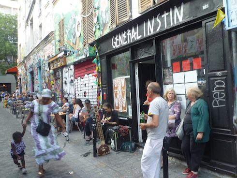<!-- .element: style="width:300px" -->

===

Nous abordons aujourd'hui le dernier temps de ce cours, dans lequel je voudrais évoquer avec vous la question des modèles d'édition alternatifs, incarnés notamment par ce que l'on appelle de manière assez large "des éditeurs indépendants".  

Les derniers concepts que nous allons explorer ensemble ce semestre sont les concepts de publication, d'éditorialisation, mais également celui de contemporain. 

Les exemples dont je vais parler aujourd'hui sont paradoxaux :
- à la fois ils constituent des cas limites, car économiquement ils ne sont souvent pas viables
- ils incarnent un pourcentage important de l'édition en France (de 30 à 40%, c'est selon : on va voir que c'est compliqué à définir un éditeur indé), et favorisent un principe de bibliodiversité essentiel à notre culture.

Bref : il s'agit d'une activité éditoriale qui, comme pour les auteurs, ne sont suffisent svt pas à vivre, et donc apparaissent comme une activité complémentaire, voire un hobby... 

<!--
Un mot rapide là-dessus : le contemporain est souvent envisagé comme une manière d'établir un périmètre temporel pour classer les oeuvres (avec tout les pb que cela pose : contemporain c'est ce qui se passe en moment, sauf que forcément, demain le contemporain d'aujourd'hui ne sera déjà plus contemporain). Envisager le contemporain comme paradigme, c'est renvoyer à un modèle épistémologique, mais également esthétique. Le paradigme contemporain est en cela d'abord issu du monde de l'art, où il s'oppose au paradigme moderne ; depuis quelques années, un travail théorique est effectué pour penser le fait littéraire à travers ce paradigme contemporain.

Le concept d'éditorialisation est un néologisme récent, directement issu des travaux scientifiques sur les phénomènes numériques, dont il s'attache à décrire les effets sur la fonction éditoriale donc nous avons parlé dès le premier cours. On balisera ensemble les contours de ce nouveau concept qui a fait l'objet de nombreux travaux ces dernières années -- je m'appuierai principalement sur MVR.

--->

§§§§§§§§§§§§§§§§§§§§§§§§§§§§§§§§§§§§§§§§§§§§§

### Éditeurs indépendants ? Une réalité multiple

* Une édition en marge des grands groupes
* Une définition floue et une institutionnalisation récente
* Un enjeu de bibliodiversité

<!-- .element: style="width:45%;float:left;margin-left:-1em; font-size:1.4rem; text-align:left" -->

<!-- .element: style="width:45%;float:right;margin-right:-1em;" -->

===

La notion d'éditeur indépendant recouvre une multitude de réalités, et ne fait d'ailleurs pas toujours l'objet d'un concensus. Par son principe même, l'édition indépendante a tendance à échapper à l'institutionnalisation. 

Dans un sens large, l'indépendance se pense d'abord en opposition à la notion de groupe éditorial. Aujourd'hui, 65 % de l’édition française sont détenus par les géants Hachette Livre et Editis (respectivement = Bolloré et Kretinsky), auxquels il faut ajouter les autres groupes (Madrigall, Média Participations…). Déjà, on voit que mon propos peut être problématique, dans la mesure où je mets dans le même pannier Madrigall (Gallimard - encore une maison familiale aujourd'hui ; ou même Actes Sud qui appartient encore à la famille Nyssen) et Hachette de Bolloré. 

La notion d'éditeur indépendant se pense d'abord dans ce contexte d'une concentration des maisons d’édition est extrême, où l’édition indépendante est marginale.

La qualification « édition indépendante », dans ce sens, désigne les maisons d'édition, souvent de petite taille, mais pas toujours (Actes Sud est une grande maison), qui n'appartiennent pas aux groupes d'édition qui forment aujourd'hui l'oligopole en réseau de l'édition et des médias.

Dans un contexte d'amplification majeur de la concentration éditoriale, ainsi que de politisation croissante des grands groupes éditoriaux (je vous renvoie aux inquiétudes exprimées ces temps-ci du côté de chez Hachette, et des perturbations chez Fayard -- sans parler de l'actualité récente chez Bayard), les éditeurs indépendants ont tenté ces dernières années de s'organiser.

En 2023, la FEDEI, pour Fédération des éditions indépendantes (éditions plutôt que éditeurs) a ainsi organisé les premières assises des indépendants. 2e édition à venir en 2025, à Bordeau. Il s'agit d'une jeune Fédération, qui attire de plus en plus l'attention sur elle. 

§§§§§§§§§§§§§§§§§§§§§§§§§§§§§§§§§§§§§§§§§§§§§

### L'indépendance selon la fédération des éditions indépendantes 

* Publier uniquement à compte d’éditeur des publications de toute nature, commercialisées auprès du public,
* Ne pas être contrôlée, directement ou indirectement, par l’État, une collectivité territoriale ou un établissement public, par un groupe d’éditions ou un groupe financier et
* Réaliser un chiffre d’affaire dont le montant annuel ne dépasse pas 10 millions d’euros.

<!-- .element: style="width:45%;float:left;margin-left:-1em; font-size:1.4rem; text-align:left" -->

<!-- .element: style="width:45%;float:right;margin-right:-1em;" -->

===

Définition de la FEDEI. 

La FEDEI estime approximativement à 2500, le nombre de maisons d’éditions indépendantes sur le territoire national, répondant à ces critières. 

>Elles ne sont pourtant que très peu représentées auprès des pouvoirs publics. Nous constituons un maillage dense et riche, porteurs d’emplois et culture. Mais nous sommes peu visibles et fragiles face à l’offre pléthorique dont les grands groupes éditoriaux abreuvent le marché. 

§§§§§§§§§§§§§§§§§§§§§§§§§§§§§§§§§§§§§§§§§§§§§

### L'indépendance ...

* Économique 
* Éditoriale / idéologique (une édition _engagée_)
* Créative / esthétique (une édition alternative)

### ... et ses défis
* Économiques (rentabilité moindre voire nulle)
* Logistiques (Distribution et Diffusion)

===

Il existe donc de nombreuses manière de considérer son indépendance. Indépendance financière : des modèles économiques souvent non-rentables. Beaucoup de ces passionnés ne vivent pas de leur activité, avec la nécessité d’avoir plusieurs emplois, de réaliser des ateliers et autres prestations.

Une indépendance que je note ici "éditoriale ou idéologique", mais que j'aurais pu qualifier de politique. 

Une indépendance créative, enfin. 

Tout cela ne va pas sans difficultés.

§§§§§§§§§§§§§§§§§§§§§§§§§§§§§§§§§§§§§§§§§§§§§

### Bibliodiversité : des modèles alternatifs

>« indépendante » pour définir l’édition, est-ce là le bon terme ? Nous incarnons une mosaïque, pas un monolithe. Quel est le plus petit dénominateur commun à même d’exprimer nos singularités ? Voilà un aspect à cerner : que la perception devienne un portrait.

<!-- .element: style="font-size:1.7rem; text-align:justify" -->

>Dominique Tourte, Président de la FEDEI

<!-- .element: style="font-size:1.7rem; text-align:justify" -->

===

L'indépendance, également, renvoie à un enjeu de diversité, ce qui est plutôt logique, lorsque l'on songe au principe d'uniformisation qui caractérise les grands groupes. Ce que l'on qualifiera de bibliodiversité, ici, renvoie à une variété des idées véhiculées par les livres, une variété des publics visés, mais également une variété des formes éditoriales envisagées. 

Camille Delettre, à la tête de la maison L’Atteinte. Pour ce dernier, le terme indépendant est problématique, lui préférant « alternatif, plus proche de la réalité ». Il ne rejette certes pas le commerce, mais le souhaite éthique et moral, sans compromission.

§§§§§§§§§§§§§§§§§§§§§§§§§§§§§§§§§§§§§§§§§§§§§

### Des qualificatifs multiples...

* _Small press_, 
* Petite édition, 
* _micro-édition_
* Fanzine, POD...

<!-- .element: style="font-size:1.7rem; text-align:justify" -->

#### ...pour de faibles tirages, un nombre réduit de titres & une fabrique artisannale

===

§§§§§§§§§§§§§§§§§§§§§§§§§§§§§§§§§§§§§§§§§§§§§

### Publier pour "rendre public"

> « Publier » retourne à son sens originel : rendre public, passer de l’expression privée destinée à des correspondants précis à l’expression pour des publics de plus en plus divers.

> Lionel Ruffel, _Brouhaha, Les Mondes du contemporain_

<!-- .element: style="font-size:1.6rem; text-align:justify" -->

====

Pour réfléchir à cette notion d'éditions indépendantes, que l'on a requalifié en modèles "alternatifs" et qui désignent des réalités, très multiples, je voudrais prendre un peu de hauteur et réfléchir avec vous à un concept essentiel mais pourtant très flou dans le champ des études littéraires et de l'histoire du livre et de l'édition : le concept de PUBLICATION.

La "publication" en revanche est un terme plutôt commun, je dirais même fonctionnel, et son usage ne prête à aucune problématisation. C'est pourtant ce que je vous propose de faire, en suivant les traces cette fois-ci de Lionnel Ruffel, qui a bcp travaillé le concept ces dernières années, notammant dans *Brouhaha* (2016).

Traditionnellement, la publication est associée à la fois à la production de l'objet livre, mais également à la dimension légitimante de cette production: "être publié" (généralement employé à la voix passive) c'est être adoubé par un éditeur, par l'écosystème éditorial.

Ainsi la publication est-elle devenue un concept propre à l'édition professionnelle.

Pourtant, fondamentalement, la publication est indépendante de toute institution. C'est ce qu'en dit notamment son étymologie : rendre public. Or aujourd'hui, on l'a vu, les moyens pour "rendre public" à la fois une oeuvre mais aussi sa propre personne (se rendre public) se sont démultipliés sous l'effet d'une diversification et d'une prolifération d'espaces ou d'écosystèmes de publication alternatifs. 

QUels sont ces espaces : 
Bibliothèques et musées, maisons de la culture ou de la poésie, établissements scolaires, résidences d'auteurs (publiques ou privées), évidemment : sites web, blogues, réseaux sociaux, plateformes vidéo et audio ; mais également des espaces plus surprenants : les murs de la ville, par exemple...

Ces espaces accueillent des activités de publication souvent "hors-livre", mais qui participent à la production et à la diffusion du fait littéraire aujourd'hui : lectures publiques, performances, ateliers d'écriture...

Omniprésents quoique parfois peu reconnus par l'édition traditionnelle, ces espaces et écosystèmes alternatifs sont à l'origine de ce que la critique appelle "Une extension du domaine littéraire".

À leur manière, ils proposent de nouveaux systèmes éditoriaux -- il faut les voir à cet égard comme des "concurrents" direct du modèle éditorial traditionnel.

Je reviendrai d'abord sur le principe "d'extension" du domaine de la littérature, observé à l'époque contemporaine. Je vous présenterai notamment le cas du Général Instin pour bien prendre la mesure de ce phénomène.
Je reviendrai ensuite sur le paradigme de la publication, à travers l'étude d'un texte théorique de Lionel Ruffel, qui a fait date dans le champ des études littéraires contemporaines.
Enfin, je m'interrogerai sur la relation entre ce paradigme de la publication et celui de l'édition, à travers l'étude de 2 éditeurs :
- cas 1 : PUblie.net
- cas 2 : Abrüpt

§§§§§§§§§§§§§§§§§§§§§§§§§§§§§§§§§§§§§§§§§§§§§

### La littérature contextuelle : de quoi parle-t-on ?
* Les pratiques « non littéraires » seraient-elles l’avenir de la littérature ?
* Le tournant médiatique de la littérature (et de la théorie littéraire...)
* Formes littéraires alternatives (hybrides, intermédiales, transmédiales, hypermédiatiques, numériques, exposées, performatives, etc.)
* Un *paradigme* "contemporain"

<!-- .element: style="font-size:1.6rem; text-align:justify" -->

===

Les pratiques « non littéraires » seraient-elles l’avenir de la littérature ?

Au-delà de toute polémique, cette question entend surtout refléter le tournant récent de la théorie littéraire francophone, qui se questionne au contact d’un corpus échappant aux classifications traditionnelles de la littérature.

Transgressant les frontières du livre, du texte, voire de la narration, pour expérimenter des formes alternatives (hybrides, intermédiales, transmédiales, hypermédiatiques, numériques, exposées, performatives, etc.), ce corpus témoigne de la présence au sein même des pratiques littéraires d’un paradigme contemporain déjà bien institué et balisé dans le domaine de l’art.

§§§§§§§§§§§§§§§§§§§§§§§§§§§§§§§§§§§§§§§§§§§§§

* Pascal Mougin, *Moderne/contemporain*, Presses du réel, 2019
* Nachtergael, Magali. 2018. « Littératures expérimentales - Présentation ». Itinéraires. Littérature, textes, cultures, nᵒˢ 2017-3 (juin). http://journals.openedition.org/itineraires/3876. + *Poet against the Machine*, 2020.
* Ruffel, Lionel. 2016. *Brouhaha. Les mondes du contemporain*. Lagrasse: Verdier.
* Théval, Gaëlle. 2015. *Poésies ready-made, XXe-XXIe Siècle*.
* Goldsmith, Kenneth. 2011. *Uncreative Writing: Managing Language in the Digital Age*. Columbia University Press.
* Gefen, Alexandre, et Claude Perez. 2019. « Extension du domaine de la littérature ». *Elfe XX-XXI. Études de la littérature française des XXe et XXIe siècles*.
* etc.

<!-- .element: style="font-size:1.6rem; text-align:justify" -->

===

Longtemps délaissées par une critique quelque peu déboussolée ou même frileuse à leur égard, ces pratiques peu conventionnelles font aujourd’hui l’objet d’une attention croissante. Elles engagent ainsi un effort théorique qui tend à renouveler les études littéraires, désormais occupées par une double question : qu’est-ce que le « paradigme contemporain » ? Qu’est-ce que la littérature contemporaine ? Comment appréhender toutes ces nouvelles avant-gardes qui frayent leur chemin à la marge des grands éditeurs ? L'édition a-t-elle définitivement perdu du terrain face à ces littératures hors-le-livre ?

quelques références parmi bcp d'autres

§§§§§§§§§§§§§§§§§§§§§§§§§§§§§§§§§§§§§§§§§§§§§

>Performances, lectures publiques, explorations et immersions diverses, enquêtes, collaborations artistiques et pluridisciplinaires, utilisation de langages ou de médias multiples, écritures numériques, animation de stages, d’ateliers, programmation, etc. : autant d’exemples de pratiques littéraires qui ont en commun de déborder le cadre du livre et le geste d’écriture, de démultiplier les possibilités d’intervention et de création des écrivains, possibilités parmi lesquelles le livre occupe toujours une place centrale mais désormais partagée, et de se faire in situ, sur les scènes des théâtres, dans les centres d’art, dans les bibliothèques ou dans la ville.

<!-- .element: style="font-size:1.6rem; text-align:justify" -->

>David Ruffel, ["La littérature contextuelle", Littérature 2010/4, n160](https://www-cairn-info.accesdistant.sorbonne-universite.fr/revue-litterature-2010-4-page-61.htm)

<!-- .element: style="font-size:1.6rem; text-align:justify" -->

§§§§§§§§§§§§§§§§§§§§§§§§§§§§§§§§§§§§§§§§§§§§§

>Une littérature qui se fait donc « en contexte » et non dans la seule communication in absentia de l’écriture, du cabinet de travail ou de la lecture muette et solitaire des textes. Je propose de regrouper ces pratiques littéraires sous l’énoncé de « littérature contextuelle ».

<!-- .element: style="font-size:1.6rem; text-align:justify" -->

>David Ruffel, ["La littérature contextuelle", Littérature 2010/4, n160](https://www-cairn-info.accesdistant.sorbonne-universite.fr/revue-litterature-2010-4-page-61.htm)

<!-- .element: style="font-size:1.6rem; text-align:justify" -->

===

Le pt commun à ces travaux : mettre en relation la production littéraire avec celle d'autres formes esthétiques, et notamment de l'art contemporain.

La citation qui suit est empruntée à David RUffel (do not confondre avec le frère), mais cette question du paradigme artistique est bien visible dans la biblio mentionnée plus tôt.

= approche intermédiale, qui permet non seulement de comprendre la littérature en relation avec d'autres formes d'expression que l'écriture et l'imprimé (le visuel, l'audiovisuel, le sonore, la performance), mais également de sortir du cadre théorique des études littéraires qui se sont, dans la foulée du post-structuralisme, essentiellement tournées vers le texte conçu comme autonome.

§§§§§§§§§§§§§§§§§§§§§§§§§§§§§§§§§§§§§§§§§§§§§

## Cas d'étude : _Général Instin_

collectif artistique, corpus fantôme et littérature Brouhaha

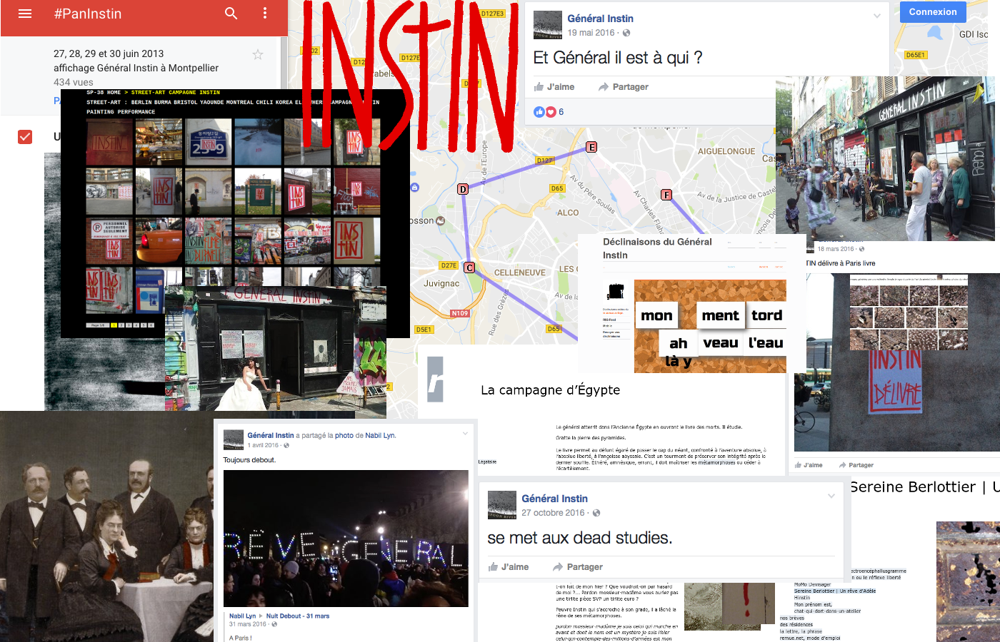<!-- .element: style="width:400px" -->

===

Je vais de suite vous donner un exemple de cette littérature contextuelle (terme de David Ruffel), brouhaha (pour reprendre le terme de son frère), de néolittérature (Magali Nachtargael), ou contemporaine.

Mon cas d'étude est un peu long, mais vous verrez qu'il est passionnant et qu'il va nous permettre de poursuivre l'effort théorique.

Le projet que je vous présente porte le nom de général Instin, que l'on pourrait décrire comme un collectif littéraire et artistique (plein de formes), fondé à la fin des années 1990, et qui a rassemblé en plus de 20 ans d'existence plus de 200 participants, investis à des degrés divers.

L'histoire du collectif n'est pas banale, mais elle est complexe, et je vais vous en proposer un rapide historique.

§§§§§§§§§§§§§§§§§§§§§§§§§§§§§§§§§§§§§§§§§§§§§
<!-- .slide: data-background-image="img/vitrailOriginal.jpg" data-background-size="contain"-->

source image: _introduction au feuilleton collectif Général Instin_ sur remue.net

<!-- .element: class="source" -->

===

Adolphe Hinstin est un général français du XIXe siècle décédé en 1905 et inhumé au cimetière du Montparnasse à Paris. Le promeneur reconnaîtra facilement le tombeau du Général, orné d'un vitrail photographique où figure le portrait du défunt. Or en raison d'un défaut de confection, ce portrait est lentement en train de se décomposer, dans ce qui s'apparente à une belle mise en abîme de la mort de son propriétaire...

En 1997, la photographe Juliette Soubrier saisit plusieurs clichés de ce portrait fantomatique.

La même année (1997) Patrick Chatelier, écrivain français, reprend cette photo pour la proposer comme contrainte créative lors d'une soirée de performance au squat artistique de la Grange aux belles (Paris).

§§§§§§§§§§§§§§§§§§§§§§§§§§§§§§§§§§§§§§§§§§§§§
<!-- .slide: data-background-image="img/ProcesDeLArt.jpg" data-background-size="contain"-->

===

Aujourd'hui disparu, le Squat de la Grange-aux-Belles fût un haut lieu de la culture alternative parisienne dans les années 1990^[Le Squat de la Grange-aux-Belles était un bâtiment privé illégalement occupé par un collectif artistique qui tentait de mettre en place des projets de création communs, et qui était basé sur un mode de gouvernance collectif. L'endroit a depuis été détruit par la ville de Paris, entraînant d'ailleurs la disparition de nombreuses oeuvres et fresques murales qui faisaient la réputation du lieu.], un lieu inscrit à la marge, donc, y compris celle de la légalité, mais aussi d'un certain modèle institutionnel de l'art et de la légitimation artistique, reposant sur l'individuation de l'auteur.

Cette photo du Général va inspirer les artistes qui occupent le squat ou qui y transitent pour quelques jours ou quelques semaines. Il va marquer le début d'un collectif relativement informel (bien que très proactif), qui donnera lieu à plusieurs événements littéraires (des lectures, des performances, des ateliers, etc.).

§§§§§§§§§§§§§§§§§§§§§§§§§§§§§§§§§§§§§§§§§§§§§
<!-- .slide: data-background-image="img/revueGeste.png" data-background-size="contain"-->

source image: revue-geste.fr  <!-- .element: class="source" -->

===

Dans un premier temps, les productions issues du collectif font l'objet d'une diffusion imprimée dans une poignée de revues littéraires imprimées (*Éponyme*, *Geste*).

§§§§§§§§§§§§§§§§§§§§§§§§§§§§§§§§§§§§§§§§§§§§§
<!-- .slide: data-background-image="img/item-026.png" data-background-size="contain"-->

source image: remue.net

<!-- .element: class="source" -->

===

Puis, lorsque la plateforme *publie.net* est créée autour de 1999-2000, GI l'investit presque immédiatement. Entre temps, Hinstin aura perdu son "H" qui le faisait personnage historique, pour devenir un matériau narratif, plastique, sémiotique. Il devient ainsi Général Instin souvent abrégé "GI" par les contributeurs au projet.

§§§§§§§§§§§§§§§§§§§§§§§§§§§§§§§§§§§§§§§§§§§§§

>Étonné, troublé par cette rencontre, Patrick Chatelier s’empare de cette figure et décide de lui donner une vie littéraire. Il commence par lui donner une nouvelle identité en supprimant le « H » initial du nom. Il devient donc le « Général Instin ». Le projet de Chatelier n’a pas été d’écrire une histoire du Général, mais de proposer une écriture collective du Général Instin, une écriture collective et plastique ouverte à toutes les propositions, comme s’il s’agissait d’un manque à combler, d’une absence à signifier.

<!-- .element: style="font-size:1.7rem; text-align:justify" -->

>Sébastien Rongier, "Le Général Instin, les vies multiples du littéraire", *Acta Fabula*

<!-- .element: style="font-size:1.7rem; text-align:right" -->

===

Entre temps, Hinstin a perdu son "H" qui le faisait personnage historique, pour devenir un matériau narratif, platisque, sémiotique. Il devient ainsi Général Instin svt abrégé GI.

§§§§§§§§§§§§§§§§§§§§§§§§§§§§§§§§§§§§§§§§§§§§§
<!-- .slide: data-background-image="img/item-026.png" data-background-size="contain" -->

source : remue.net

<!-- .element: class="source" -->
===

Remue.net  va jouer un rôle d'agrégateur / centralisateur des productions consacrées à Instin : poèmes, récits, beaucoup d'images, des vidéos et enregistrements (car bcp de lectures et d'ateliers commencent à être archivés).

Désormais, GI a pris racine dans l'hypertexte, et commence à hanter le web.

§§§§§§§§§§§§§§§§§§§§§§§§§§§§§§§§§§§§§§§§§§§§§
<!-- .slide: data-background-image="img/item-036.png" data-background-size="contain" -->

source : generalinstin.net  <!-- .element: class="source" -->

===
Ainsi, il se permet des incursions sur d'autres plateformes, à travers certaines expériences qui gagnent leur autonomie.

§§§§§§§§§§§§§§§§§§§§§§§§§§§§§§§§§§§§§§§§§§§§§
<!-- .slide: data-background-image="img/editionInstin.png" data-background-size="contain"s -->

===
Les productions reliées au GI contiennent un aspect intermédial très fort, avec une production iconographique importante et foisonnante.

Instin investit également le champ de la poésie urbaine, reposant sur un mélange entre l'affichage et le détournement des espaces institutionnels et publics existants.

§§§§§§§§§§§§§§§§§§§§§§§§§§§§§§§§§§§§§§§§§§§§§
<!-- .slide: data-background-image="img/sans_titre-2.jpg" data-background-size="contain" -->

source : Festival Rue Instin

<!-- .element: class="source" -->

===

On note par ailleurs quelques expériences proches du *land-art* et, enfin, un festival de rue documenté par des vidéos présentement accessibles sur Youtube ou Viméo (le festival compte trois éditions successives, de 2013 à 2015).

§§§§§§§§§§§§§§§§§§§§§§§§§§§§§§§§§§§§§§§§§§§§§
<!-- .slide: data-background-image="img/instinDoeuvre.png" -->

===
Bien sûr, GI investi aussi les écritures profilaires, avec un compte Facebook et Twitter (partagé par plusieurs membres du collectif qui publient messages et images en fonction de leurs envies du moment, sans nécessairement consulter les autres).

§§§§§§§§§§§§§§§§§§§§§§§§§§§§§§§§§§§§§§§§§§§§§
<!-- .slide: data-background-image="img/instinPapier.png" -->

===
Enfin, depuis 2015, Instin est devenu une figure auctoriale à part entière. Pour fêter cela, il a réinvesti le modèle éditorial imprimé, aux Éditions du Nouvel Attila, qui lui a même dédié une collection à lui seul : la collection Othello. Trois ouvrages ont été déjà publiés.

§§§§§§§§§§§§§§§§§§§§§§§§§§§§§§§§§§§§§§§§§§§§§
<!-- .slide: data-background-image="img/Hinstin-famille.jpg" data-background-size="contain" -->

source image: BNF  <!-- .element: class="source" -->

===

Si l'on pouvait s'attendre à une telle dissémination spatiale (hors-le-web, dans-le-web, hors-le-livre, dans le livre), caractéristique de l'éditorialisation, la temporalité dans laquelle le GI s'inscrit réserve une ultime surprise, qui nous fait prendre la mesure du jeu constant avec l'idée même de frontière.

Au cours des années 2000 en effet, le projet connaît un rebondissement : le collectif découvre que la famille Hinstin (avec son H historique), a partie liée depuis longtemps avec la littérature et les arts. Dès 1903 Alfred Jarry rédige dans *La Revue blanche* un texte satirique à l'encontre du neveu du Général Hinstin, accusé d'avoir commis un vol de bijoux. En 1963, Joseph Kessel consacre à Charles Hinstin, l'un des descendants du Général, la nouvelle "Le Zombie", dans le recueil *Tous n'étaient pas des anges*. La BNF dispose même d'un fonds d'archive photo de la famille, classée dans les dossiers consacrés à Lautréamont -- la rumeur voulant qu'Isidore Ducasse ait entretenu une relation très étroite avec son professeur Hinstin, frère de notre général.

§§§§§§§§§§§§§§§§§§§§§§§§§§§§§§§§§§§§§§§§§§§§§
<!-- .slide: data-background-image="img/corpusFantome.png"  -->

source image: _lexique généraliste_ sur remue.net

<!-- .element: class="source" -->

===

Ce décloisonnement entre l'Histoire et l'histoire est ainsi au centre du projet Instin, qui n'hésite pas à s'approprier des éléments radicalement antérieurs (conformément à la règle du plagiat par anticipation). Voilà pourquoi je parlais tout à l'heure d'une certaine inadéquation avec la perspective purement chronologique et téléologique, car l'éditorialisation ne suggère pas seulement qu'une oeuvre n'a pas de fin, mais également qu'elle n'a peut-être pas de début.

Un ouverture qui s'adresse d'ailleurs à la communauté élargie des lecteurs, invités à poursuivre l'oeuvre, à se l'approprier.

L'un des contributeurs, Marc Perrin, convoque ainsi la métaphore du "corpus fantôme" pour souligner la nature processuelle du projet, dans un texte qui célèbre un idéal d'autorité partagée :

>Somme de tous les éléments, écrits, images, gestes, etc., qui constituent le projet GI toujours-en-train-d’apparaître. Ce corpus fantôme se développe par diverses fractales et avatars en vue de constituer une entité géante, totem composé de l’ensemble des matériaux instin qui s’exprimera, grâce à un programme aléatoire dirigé par ordinateur, dans toutes les langues disparues depuis les premiers balbutiements de l’humanité.
Nous sommes un corps sans cesse modifié. / Nous sommes un corps sans cesse modifiant le monde auquel nous appartenons. / Nous sommes un corps sans cesse modifiant la qualité de l’appartenance [@noauthor_lexique_nodate]

On soulignera, dans ce passage, l'heureuse antanaclase autour des termes "somme/sommes", qui parachève la fusion entre les éléments du corpus et les participants impliqués dans le projet, décrit comme un seul "corps sans cesse modifié / modifiant".

§§§§§§§§§§§§§§§§§§§§§§§§§§§§§§§§§§§§§§§§§§§§§
<!-- .slide: data-background-image="img/generalAvendre.png" data-background-size="contain"-->

source image: remue.net

<!-- .element: class="source" -->

===

J'ai moi-même été témoin de ce phénomène d'appropriation, en 2019 notamment, lors de l'événement Publishing SPhere de Montréal. Nous y avions invité deux membres du projet Instin, Patrick Chatelier précédemment cité, et Éric Darsan, qui à ce moment là vient de publier les derniers textes du projet, "(G)rêve, Général(E)".

En allant les accueillir à l'Aéroport de Montréal, je me suis rendue compte qu'ils ne s'étaient jamais rencontrés !

§§§§§§§§§§§§§§§§§§§§§§§§§§§§§§§§§§§§§§§§§§§§§
<!-- .slide: data-background-image="img/campagneNonOfficielle.png" -->

source image: Facebook (profil Instin)

<!-- .element: class="source" -->

===

COup de maître : l'appropriation à l'envers...

§§§§§§§§§§§§§§§§§§§§§§§§§§§§§§§§§§§§§§§§§§§§§

> Il n’y a pas de chef, pas d’organisation, c’est un fonctionnement particulier. Il n’y a jamais eu non plus de comité de rédaction. Ni de réunion. Une tentative de séminaire a capoté. Il y a des opportunités et des gens qui vont s’investir, longtemps ou pas, dans cette entité.
>

<!-- .element: style="font-size:1.4rem; text-align:justify" -->

source: Patrick Chatelier

<!-- .element: class="source" -->

===

Revendication : collectif autogéré

> Il n’y a pas de chef, pas d’organisation, c’est un fonctionnement particulier. Il n’y a jamais eu non plus de comité de rédaction. Ni de réunion. Une tentative de séminaire a capoté. Il y a des opportunités et des gens qui vont s’investir, longtemps ou pas, dans cette entité.

Mais est-ce vraiment le cas ?

§§§§§§§§§§§§§§§§§§§§§§§§§§§§§§§§§§§§§§§§§§§§§
<!-- .slide: data-background-image="img/IntinRemuAccueil.png" data-background-size="contain" -->

source : Page du Général sur Remue.net

<!-- .element: class="source" -->

===

Au milieu de tout cela, la revue numérique Remue.net fait office de diffuseur et d'agrégateur du projet, voire de conservateur de certains éléments définitivement disparus et dont les traces (captations audio-visuelles) sont republiées en ligne.

C'est l'occasion alors de proposer une cartographie du corpus, à laquelle s'ajoute un méta-récit de l'archive qui se déploie sur plusieurs niveaux.

§§§§§§§§§§§§§§§§§§§§§§§§§§§§§§§§§§§§§§§§§§§§§

### De Hinstin à Instin

* Une contrainte créative (pour un collectif d'artistes)
* Un projet collectif (mais "sans engagement", ni "projet esthétique")
* Un personnage de fiction (Histoire / histoire)
* Un profil sur le web (Twitter, FB)
* Une figure auctoriale (qui signe des livres)

<!-- .element: style="font-size:1.6rem; text-align:justify" -->

===

§§§§§§§§§§§§§§§§§§§§§§§§§§§§§§§§§§§§§§§§§§§§§

### Un modèle (en partie) hors-livre

* Occupation des marges (les marges de la ville puis du web)
* Dissémination sur plusieurs supports/plateformes
* Investissement de l'espace public
* Mais pas *contre* le livre !

<!-- .element: style="font-size:1.6rem; text-align:justify" -->

===
Ce qui nous intéresse notamment dans le projet GI est aussi ce qui nous cause le + de difficultés: GI se conçoit principalement dans un "hors-livre", en rupture avec notre modèle éditorial moderne.

Depuis le squat de la Grange aux belles, Instin s'est toujours s'inscrit relativement à la marge - des institutions littéraires ou éditoriales traditionnelles.

Il est disséminé sur plusieurs supports, numériques/non-numériques, sur plusieurs plateformes, via des médias différents. Qu'il s'affiche sur les murs de nos rues ou sur le web, Instin occupe l'espace public - en même temps qu'il participe à redéfinir l'espace public à l'ère numérique.

De l'investissement d'un squat dans une rue de Paris jusqu'à l'investissement du web, des réseaux sociaux qui sont détournés pour créer un profil "fictif", nous avons tendance à croire qu'il y a là une même stratégie d'occupation des marges et de détournement des institutions, qui est essentiel pour comprendre les mutations qui affectent la notion même de littérature.

§§§§§§§§§§§§§§§§§§§§§§§§§§§§§§§§§§§§§§§§§§§§§

### Général Instin, un cas d'école de la littérature "brouhaha"

> « Publier » retourne à son sens originel : rendre public, passer de l’expression privée destinée à des correspondants précis à l’expression pour des publics de plus en plus divers.

> Lionel Ruffel, _Brouhaha, Les Mondes du contemporain_

<!-- .element: style="font-size:1.6rem; text-align:justify" -->

===
Lionel Ruffel a proposé le terme de "littérature brouhaha" pour qualifier ce passage d'un imaginaire du littéraire centré sur le livre comme objet-support, à un imaginaire du littéraire centré sur une action et une pratique : la publication.

§§§§§§§§§§§§§§§§§§§§§§§§§§§§§§§§§§§§§§§§§§§§§

> [C]ette multitude d’espaces publics caractérise le moment contemporain de la littérature, comme la sphère publique de la Littérature caractérisait sa représentation moderne. Si ces espaces publics ont toujours existé, même lorsqu’on les mettait sous silence, jamais ils n’ont été aussi nombreux et visibles […] si bien que le littéraire aujourd’hui apparaît en très grande partie comme une arène conflictuelle composée d’une sphère publique hégémonique reposant sur l’imprimé et d’une multitude d’espaces publics contre-hégémoniques relevant plutôt d’une « littérature-brouhaha » (exposée, performée, in situ, multi-support) avec de très nombreuses circulations entre eux. »
>
> Lionel Ruffel, _Brouhaha, Les Mondes du contemporain_

<!-- .element: style="font-size:1.6rem; text-align:justify" -->

===
Lionel Ruffel a proposé le terme de "littérature brouhaha" pour qualifier ce passage d'un imaginaire du littéraire centré sur le livre comme objet-support, à un imaginaire du littéraire centré sur une action et une pratique : la publication.
[CITER]

§§§§§§§§§§§§§§§§§§§§§§§§§§§§§§§§§§§§§§§§§§§§§

### De nouveaux *gestes* de publication

>«L’écriture numérique s’offre également comme un ciel ouvert, un chantier, une progression ininterrompue et non téléologique, un dialogue constant et tendu avec les formes. En s’offrant comme milieu, comme écosystème, l’expérience directe du processus de l’écriture s’intensifie.»
>
> Sébastien Rongier, _Le_ Général Instin, _les vies multiples du littéraire_

<!-- .element: style="font-size:1.6rem; text-align:justify" -->

===
Ce que l'on qualifiera donc désormais de "gestes de publication" traduit une nouvelle conception de l'écriture comme "milieu", pour reprendre l'expression de Sébastien Rongier qui a consacré des travaux ++ au Général Instin.
CITER

Ce qui nous intéresse notamment dans le projet GI est aussi ce qui nous cause le + de difficultés: GI se conçoit principalement dans un "hors-livre", en rupture avec notre modèle éditorial moderne.

Depuis le squat de la Grange aux belles, Instin s'est toujours s'inscrit relativement à la marge - des institutions littéraires ou éditoriales traditionnelles.

Il est disséminé sur plusieurs supports, numériques/non-numériques, sur plusieurs plateformes, via des médias différents. Qu'il s'affiche sur les murs de nos rues ou sur le web, Instin occupe l'espace public - en même temps qu'il participe à redéfinir l'espace public à l'ère numérique.

De l'investissement d'un squat dans une rue de Paris jusqu'à l'investissement du web, des réseaux sociaux qui sont détournés pour créer un profil "fictif", nous avons tendance à croire qu'il y a là une même stratégie d'occupation des marges et de détournement des institutions, qui est essentiel pour comprendre les mutations qui affectent la notion même de littérature.

§§§§§§§§§§§§§§§§§§§§§§§§§§§§§§§§§§§§§§§§§§§§§
<!-- .slide: data-background-image="img/adamique.png" data-background-size="contain-->

§§§§§§§§§§§§§§§§§§§§§§§§§§§§§§§§§§§§§§§§§§§§§

## Le paradigme de la publication

### la fin du monopole éditorial dans l'écosystème littéraire ?

L'édition professionnelle, qui devait être une solution de publication, reste probablement le modèle de publication le plus efficace et le plus recherché par les écrivains, en ce sens où il s'est accaparé le tout dernier aspect de la fonction éditoriale, et non le moindre : celui de la légitimation. Si l'éditeur demeure aussi précieux, c'est pour sa fonction de légitimation. C'est encore lui qui transforme l'écrivain en auteur. Monopole économique, certes, mais surtout un monopole symbolique, encore plus efficace que l'argent.

<!-- .element: style="font-size:1.4rem; text-align:justify" -->

===

La question que l'on pose déborde de fait le niveau de l'édition, pour aborder celui de la littérature, de manière générale.

Alors que le fait littéraire est lentement devenu le produit de la fabrique éditoriale, les pratiques de publication contemporaines tendent à rebattre les cartes, en reléguant l'éditeur au rang de manifestation possible -- mais pas unique ni définitive -- de la publication littéraire.

Évidemment, cette tendance à la diversification de la publication contemporaine n'est pas un ras-de-marée non plus.

L'édition professionnelle, qui devait être une solution de publication, reste probablement le modèle de publication le plus efficace et le plus recherché par les écrivains, en ce sens où il s'est accaparé le tout dernier aspect de la fonction éditoriale, et non le moindre : celui de la légitimation. Si l'éditeur demeure aussi précieux, c'est pour sa fonction de légitimation. C'est encore lui qui transforme l'écrivain en auteur, en vrai. Monopole économique, certes, mais surtout un monopole symbolique, encore plus efficace que l'argent.

Et c'est cette position de monopole qui a tendance à tendre les relations entre les auteurs et les éditeurs.

§§§§§§§§§§§§§§§§§§§§§§§§§§§§§§§§§§§§§§§§§§§§§

### Contre le "maillon fort" de la chaîne éditoriale ?

>On peut se demander, s’il y a fragilité de la chaîne du livre, si elle n’est pas en partie liée à un maillon fort qui a su profiter des très nombreux atouts qu’offre l’absence de régulation du travail comme la loi Lang. On peut se demander si cette facilité à publier, qui fait que de nouvelles maisons d’édition apparaissent tous les jours, n’a pas fait perdre de vue à trop de maisons d’édition les principes même de l’entreprenariat : investir, prendre des risques, prévoir et créer les tendances de demain. Être éditeur, ce ne peut pas être que publier tous azimuts, à moindre coût pour assurer ses flux financiers, en se disant qu’il en sortira bien quelques succès pour faire son bénéfice. Cela ne peut qu’être destructeur de valeur à terme pour le reste de la chaîne du livre.

<!-- .element: style="font-size:1.4rem; text-align:justify" -->

>Ligue des auteurs professionnels

<!-- .element: style="font-size:1.6rem; text-align:justify" -->

===
Reprenant l'image de la "chaîne éditoriale", la ligue des auteurs pro dont on a parlé plus tôt dénonce l'hégémonie de l'édition, accusée d'être trop occupée à assurer la perpétuation de son modèle, plutôt que l'intérêt des créateurs.

Ligue des auteurs pro, pour la refonte de leur statut.

§§§§§§§§§§§§§§§§§§§§§§§§§§§§§§§§§§§§§§§§§§§§§

### Deux modèles de publication qui s'ignorent ?
* Une production culturelle institutionnalisée, dans les "canaux" traditionnels
* Une production "à la marge" ; mais une marge de plus en plus visible, populaire ou avant-gardiste

§§§§§§§§§§§§§§§§§§§§§§§§§§§§§§§§§§§§§§§§§§§§§

* Lionel Ruffel, *Brouhaha, les mondes du contemporain* (2016)
  * Une enquête sur le substantif "contemporain"
  * Une étude des formes de la littérature "exposée"
  * Une réflexion sur les enjeux de la "publication"

<!-- .element: style="font-size:1.6rem; text-align:justify" -->

===

*Brouhaha* de Lionel Ruffel a fait bcp parler de lui depuis 5 ans.
Essai théorique qui porte sur la littérature dite "contre hégémonique", une littérature qui se déploie en dehors des circuits institutionnels connus, empruntant de nouveaux circuits : la publication en ligne, l'exposition dans la rue, les musées, etc.

Pour Ruffel, il s'agit de découvrir d'autres manière de concevoir, de diffuser et de légitimer la littérature
Une littérature "hors le livre".

Il ne s'agit pas de condamner le livre et les grands éditeurs institutionnels, en les accusant de conservatisme. Il s'agit plutôt de dire que la diversité artistique, littéraire, y compris la bibliodiversité, cad la diversité des livres eux-mêmes, est garantie également par une littérature qui se déploie aux marges du livre.

J'ai choisi plusieurs citations que je vis commenter pour vous accompagner dans votre lecture. Quelques remarques générales.

Brouhaha = enquête sur le substantif contemporain
Dans le dernier quart du 20e, on pense l'actualité du fait littéraire avec le terme post-moderne. Dans les 80, ce concept rencontre bcp de succès. Or aujourd'hui il laisse place au contemporain. Cf aussi Mougin.

Chez ruffel, contemporain n'est pas seulement un adjectif mais aussi un substantif, car il vient désigner un paradigme de l'art et de la culture, comme le fait d'ailleurs mougin avec sa comparaison art et littérature

Son étude porte sur la Littérature exposée, cad souvent performée. Conception d'une Littérature vivante plutôt que éditée ou imprimée.

Enfin, réflexion sur la publication comme "rendre public". Il insiste donc énormément sur la fonction de diffusion, dans une perspective éditoriale, mais surtout une perspective politique.

C'est ce qui distingue d'ailleurs le texte de Ruffel de celui de Mougin. Une dimension politique très forte.
Les 2 ont bcp de différences. Mais moulin = historique. Chez ruffel = politique. Dimension parfois de manifeste dans l'essai.

§§§§§§§§§§§§§§§§§§§§§§§§§§§§§§§§§§§§§§§§§§§§§

### Qu'est-ce que le "contemporain" ?

* Co/cum-tempus : une nouvelle relation au temps

>Être avec le temps, être camarade du temps, c’est se glisser dans ses plis, l’occuper, l’habiter, pour le reconfigurer et le faire voir. (Lionel Ruffel)
>De la compréhension modale du contemporain à ce que contemporain peut dire, c’est la force du préfixe cum- qui s’impose : avec, ensemble, « inséparé ». Avec le temps, avec les temps, les temps ensemble. La conception de l’histoire travaillée par le contemporain conteste ainsi l’historicité moderne fondée, elle, sur une séparation, une séquentialité, une successivité. (Lionel Ruffel, _Brouhaha, Les Mondes du contemporain_)

<!-- .element: style="font-size:1.6rem; text-align:justify" -->

===

Contemporain = avec le temps. Nouvelle manière d'établir notre relation au temps. Le contemporain se distingue du pomo parce qu'il sort de la séquentialité
Un paradigme = manière de penser

§§§§§§§§§§§§§§§§§§§§§§§§§§§§§§§§§§§§§§§§§§§§§

### Publier pour "être visible"
>L’écrivain, s’il veut être présent et exister en tant qu’écrivain, doit désormais se rendre visible. Ses interventions dans le champ social vont de pair avec le développement du spectaculaire et d’une industrie culturelle littéraire pour lequel le corps physique de l’auteur est de plus en plus requis : des signatures en librairie aux lectures publiques jusqu’au développement inédit et massif des festivals littéraires, on assiste à une transformation de la présence sociale de l’auteur. La visibilité de l’écrivain devient à la fois un principe esthétique et une condition sociale. (Ruffel et Rosenthal, 2010)

<!-- .element: style="font-size:1.6rem; text-align:justify" -->

===

Pour Ruffel et rosenthal, Le littéraire se rencontre hors du livre dans l'espace public.
La rencontre de la littérature dans le livre devient presque minoritaire.
 On ne s'est pas rendus compte de ce glissement.
La littérature à envahit l'espace public sans passer par le livre

Le littéraire se rencontre en ville, sur nos murs, dans les places publiques.

histoire de la littérature hors du livre, car le livre n’est pas la seule destinée de la littérature, tout juste un objet transitoire, une possibilité, voire une hypothèse.

Le livre = moment du texte. L'oeuvre est un processus et non un produit fini.

Publier = stratégie de survie pour être visible. L'écrivain doit se rendre visible. Corps physique. L'auteur est un corps. Transformation de la présence sociale.

A la fois vrai et problématique. Signe de la nouvelle économie du fait littéraire. L'écrivain comme métier n'est plus viable seulement seulement via la vente de ses textes mais aussi sa présence médiatique qui est source de revenu : signatures, Master class, atelier d'écriture.

Comment former les écrivains à cette présence ?
Problème = les éditeurs demandent aux écrivains d'assurer fonctions et activités qui n'ont rien à voir avec l'écriture.
Cette nouvelle fonction sociale de L'écrivain  ne convient pas à tout le monde. Injonction à la visibilité notamment par les réseaux sociaux.

§§§§§§§§§§§§§§§§§§§§§§§§§§§§§§§§§§§§§§§§§§§§§

### Le rôle moteur des "petites" formes (formats, institutions...)
>Les réseaux de bibliothèques municipales sont aux grandes bibliothèques de lecture et d’étude ce que les centres d’art sont aux musées : un nouvel espace public, devenu essentiel au monde de la littérature. Essentiel pour les écrivains, auxquels il permet d’obtenir des revenus complémentaires aux droits d’auteur. Essentiel aux institutions politiques, car il justifie l’idée des pratiques culturelles comme vecteur social. Essentiel à tout un monde littéraire qui s’est stratifié à l’excès, accueillant un nouveau jeu de professions et d’acteurs (conseillers littéraires, médiateurs) qui ont dû inventer de nouvelles matérialités du littéraire hors du livre. (Lionel Ruffel, _Brouhaha, Les Mondes du contemporain_)

<!-- .element: style="font-size:1.6rem; text-align:justify" -->

===

Revalorisation d'une littérature des petites formes, et notamment d'une littérature vivante
De fait, revalorisation des petites formes. Encouragements à relire et re-découvrir la litt via les petite formes. Fanzine. Le rôle des bibliothèques est essentiel ici.

Effet vertueux ou pervers de diversification de l'accès à la littérature et donc du métier. Certains auteurs s'y retrouvent très peu. Cf ligue des auteurs pro. Comment évaluer le tarif ? Comment fonctionne un salon ? Une économie de la publication qui n'a rien à voir ou très peu avec l'édition.

§§§§§§§§§§§§§§§§§§§§§§§§§§§§§§§§§§§§§§§§§§§§§

### Reconfiguration de la relation public/auteur
>Les conditions contemporaines du littéraire remettent en cause les conditions d’existence qui se sont élaborées durant deux siècles : l’image d’un auteur, reclus dans son bureau-atelier, en relation directe avec son éditeur et les acteurs qui constituent le champ (critiques, jurés littéraires, etc.), parlant in absentia à un public massifié et anonyme. [Jean-Jacques Palix et Ève Couturier, cités par Ruffel]

<!-- .element: style="font-size:1.4rem; text-align:justify" -->

===
De fait, refonte de la relation auteir lecteur. Difficile à appréhender. Nouvelles médiations  celle des réseaux sociaux qui tendent parfois à devenir les nouveaux agents des écrivains. Les écrivains d'ailleurs prennent en charge ici leur propre construction auctoriale là où avant c'était l'éditeur qui maîtrisait tout.

§§§§§§§§§§§§§§§§§§§§§§§§§§§§§§§§§§§§§§§§§§§§§

### Une transformation de l'espace public contemporain
>Selon Habermas, la littérature joue un rôle déterminant dans la constitution de cette sphère publique. C’est parce que s’ouvre un espace de débat sur les œuvres d’art contemporaines, et notamment sur les œuvres littéraires, que s’esquissent au cours du XVIIIe siècle les prémisses d’une sphère publique politique. Un public urbain succède au public de la cour, en particulier à travers le développement des salons et des cafés qui en sont les héritiers et qui « promeuvent » une sorte d’égalité entre gens cultivés, mettant sur le même pied la société aristocratique et certains intellectuels bourgeois (voir p. 43). Bien entendu, il s’agit d’une construction idéalisée où les « gens », pour ce qui concerne les cafés, sont des hommes « bourgeois », l’égalité s’exerçant au cœur d’une nouvelle classe dominante. (Lionel Ruffel, _Brouhaha, Les Mondes du contemporain_)

<!-- .element: style="font-size:1.4rem; text-align:justify" -->

===
Refonte de ce qu'est l'espace contemporain.

Habermas et l'espace public comme concept, né avec habermas = comment au 17e t 18 une classe bourgeoise s'est réuni dans des espaces dédiés, salon, pour s'émanciper d'une culture monarchique fondée au contraire sur les espaces privés la sphère privée et le secret. Émergence d'une pensée politique : l'idée de démocratie est issue de ces rencontres dans des espaces publics ou les individus sont davantage sur un pied d'égalité, ou il y a une émulation intellectuelle.

L'idée de la citoyenneté émerge ici. L'espace public = précédent à la possibilité de la révolution française. concept qui porte en soit l'émancipation.
Mais espace critiqué par Ruffel car il se restreint au mâle blanc dominant. Lire citation.  

§§§§§§§§§§§§§§§§§§§§§§§§§§§§§§§§§§§§§§§§§§§§§

### Espace public, "grand public"
>Le débat littéraire qui préexiste au débat politique, et donc à la sphère publique. Car ce forum n’est qu’une étape d’un processus plus large, qui est celui de l’extension de cette agora à la société, par l’entremise du marché. Ce modèle nucléaire ne peut pas, selon Habermas, se fermer sur lui-même, l’art étant devenu une marchandise. Il est appelé à s’étendre pour constituer une véritable sphère publique qui ne peut plus tenir dans des espaces publics. C’est la notion de « grand public », qu’il ne faut pas confondre avec la population d’un pays, ou « pire », avec le peuple. (Lionel Ruffel, _Brouhaha, Les Mondes du contemporain_)

<!-- .element: style="font-size:1.4rem; text-align:justify" -->

===

§§§§§§§§§§§§§§§§§§§§§§§§§§§§§§§§§§§§§§§§§§§§§

## La notion d'espace public (Habermas)
* Un espace physique et/ou médiatique (salon, journaux, sociétés savantes, cafés) permettant aux idées de circuler afin de construire une opinion publique
* La publication du savoir pour façonner une *opinion publique* et garantir la démocratie
* Tout espace public suppose un modèle conceptuel et épistémologique

<!-- .element: style="font-size:1.6rem; text-align:justify" -->
===
Habermas appelle « espace public » la sphère intermédiaire entre la vie privée de chacun et l'État monarchique qui affectionne le secret, l'arbitraire et la délation (les célèbres et redoutées « lettres de cachet », en France, qui conduisent généralement à la Bastille), qui se constitue en Angleterre et en France de la fin du XVIIIe siècle au début du XIXe siècle. Cet « espace public » permet aux opinions privées d'être rendues publiques, il comprend les salons, les loges maçonniques, les académies, les sociétés savantes, les regroupements philanthropiques, les clubs, les cafés, les journaux,  etc.

Habermas étudie comment, à partir du XVIIe, et plus particulièrement du XVIIIe, la bourgeoisie parvient à s'affranchir de la domination culturelle et idéologique, de l'aristocratie et de l'église. Chemin faisant, elle s'initie à l'usage public du raisonnement, elle se met à penser librement, non seulement à nourrir sa réflexion, mais à mettre en débat la culture dont elle est imprégnée depuis des siècles, pour finalement en venir à mettre en question la légitimité du pouvoir en place et le bousculer.

L’espace public = lieu où les idées circulent afin de construire une opinion publique

Les médias = vecteurs d'un débat démocratique ou outil de propagande des foules ?

§§§§§§§§§§§§§§§§§§§§§§§§§§§§§§§§§§§§§§§§§§§§§

### Littérature silencieuse (Habermas) vs littérature brouhaha

>L’idéalisation de la sphère publique passe par une valorisation du silence, par l’inverse du brouhaha. Et se situe donc à l’opposé de ma proposition sur le contemporain. L’histoire littéraire nous raconte ainsi combien l’histoire de la poésie, par exemple, est un lent arrachement à la musique externe au bénéfice d’une musique interne. Combien le texte dramatique idéal relève du théâtre dans un fauteuil. Combien le roman n’a pas besoin d’être lu à voix haute et que c’est pour cette raison même qu’il domine les autres genres. Non que la sphère publique idéalisée condamne les « arts du spectacle », au contraire elle les discipline avec l’idée de la catharsis, cette régulation des mauvaises passions. (Lionel Ruffel, _Brouhaha, Les Mondes du contemporain_)

<!-- .element: style="font-size:1.4rem; text-align:justify" -->

===

Littérature silencieuse d'habermas vs brouhaha. Espace conçu comme privé (monarchie) espace public habermas (privilégié et hégémonique) diversification de l'espace public avec la multiplication de lieux contre hégémonique.

Ce que propose ruffel, est que notre conception de l'espace public habermatienne et donc bourgeoise aurait conduit certaines formes et genre littéraire à avoir un grand succès. C'est le cas du roman, très individualiste.

§§§§§§§§§§§§§§§§§§§§§§§§§§§§§§§§§§§§§§§§§§§§§

### Espaces alternatifs et contre-publics (Fraser, Spivack)

>Presque à la même époque, on a assisté à l’apparition d’une multitude de contre-publics concurrents, comprenant les publics nationalistes, les publics paysans populaires, les publics des femmes de l’élite et les publics de la classe ouvrière. (Nancy Fraser)

<!-- .element: style="font-size:1.4rem; text-align:justify" -->
===

Habermas et l'espace public comme concept, né avec habermas = comment au 17e t 18 une classe bourgeoise s'est réuni dans des espaces dédiés, salon, pour s'émanciper d'une culture monarchique fondée au contraire sur les espaces privés la sphère privée et le secret. Émergence d'une pensée politique : l'idée de démocratie est issue de ces rencontres dans des espaces publics ou les individus sont davantage sur un pied d'égalité, ou il y a une émulation intellectuelle.

L'idée de la citoyenneté émerge ici. L'espace public = précédent à la possibilité de la révolution française.conceot qui porte en soit l'émancipation.
Mais espace critiqué par Ruffel car il se restreint au mâle blanc dominant. Lire citation.  

§§§§§§§§§§§§§§§§§§§§§§§§§§§§§§§§§§§§§§§§§§§§§

>De la même manière qu’il existe des contre-publics subalternes qui s’opposent à la sphère publique idéalisée, il existe des contre-publics subalternes qui s’opposent à l’idéal de la littérature silencieuse, qui se rapprochent du modèle contre-idéal du brouhaha. Ces contre-publics subalternes littéraires ne sont pas forcément l’expression de contre-publics subalternes « socio-politiques », mais l’expression d’une pratique de la littérature qui ne se construit pas sur la triple exclusion de l’espace, des corps et du son. (Lionel Ruffel, _Brouhaha, Les Mondes du contemporain_)

<!-- .element: style="font-size:1.4rem; text-align:justify" -->

§§§§§§§§§§§§§§§§§§§§§§§§§§§§§§§§§§§§§§§§§§§§§

>De nombreuses études historiques ont montré combien l’idéal de littérature était hégémonique mais non total. Les performances poétiques, les lectures publiques, ont toujours accompagné la diffusion écrite, elles ont simplement été réduites au silence par l’historiographie majoritaire. On postulera donc que ces moments d’inscription du littéraire dans des espaces publics (lectures, performances, expositions…) relèvent d’une logique propre aux contre-publics subalternes. Je crois que la meilleure preuve est la réaction qu’ils suscitent parfois. Il est reproché à ces formes soit de n’être pas de la littérature, seulement du bruit ou un gazouillis, soit d’être en quelque sorte communautariste. (Lionel Ruffel, _Brouhaha, Les Mondes du contemporain_)

<!-- .element: style="font-size:1.4rem; text-align:justify" -->

§§§§§§§§§§§§§§§§§§§§§§§§§§§§§§§§§§§§§§§§§§§§§

>[C]ette multitude d’espaces publics caractérise le moment contemporain de la littérature, comme la sphère publique de la Littérature caractérisait sa représentation moderne. Si ces espaces publics ont toujours existé, même lorsqu’on les mettait sous silence, jamais ils n’ont été aussi nombreux et visibles […] si bien que le littéraire aujourd’hui apparaît en très grande partie comme une arène conflictuelle composée d’une sphère publique hégémonique reposant sur l’imprimé et d’une multitude d’espaces publics contre-hégémoniques relevant plutôt d’une « littérature-brouhaha » (exposée, performée, in situ, multi-support) avec de très nombreuses circulations entre eux. » (Lionel Ruffel, _Brouhaha, Les Mondes du contemporain_)

<!-- .element: style="font-size:1.4rem; text-align:justify" -->

§§§§§§§§§§§§§§§§§§§§§§§§§§§§§§§§§§§§§§§§§§§§§

### La littérature "brouhaha" c'est donc...
* Une multiplication des vecteurs de publication [du livre à l'espace public/urbain en passant par le web]
* Une hétérogénéité des supports médiatiques littéraires [imprimé, page web, radio/podcast, vidéo...]
* Une hétérogénéité des formes médiatiques littéraires [textuel, oral, visuel]

<!-- .element: style="font-size:1.6rem; text-align:justify" -->

===

Pour théoriser cette multiplication des espaces de publication ainsi que cette hétérogénéité des environnements-support, et pour analyser les effets de tout cela, un concept a émergé depuis 20 ans = l'éditorialisation.

§§§§§§§§§§§§§§§§§§§§§§§§§§§§§§§§§§§§§§§§§§§§§

## L'éditorialisation

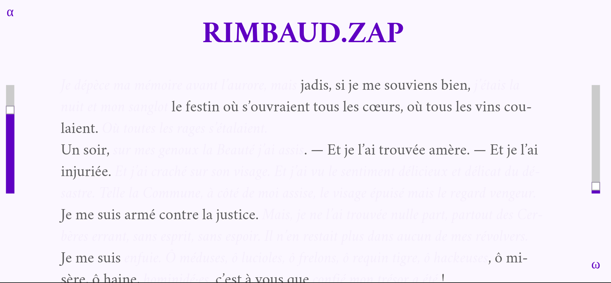

§§§§§§§§§§§§§§§§§§§§§§§§§§§§§§§§§§§§§§§§§§§§§
<!-- .slide: data-background-image="img/ngramEditorialisation.png" data-background-size="contain"-->

===

Le terme éditorialisation est un néologisme récent, forgé dans les années 2000
pour désigner de nouvelles pratiques éditoriales issues des technologies numériques. Fondamentalement, l’éditorialisation renvoie à la capacité des usagers à détourner, par leurs pratiques médiatiques, les usages institués par les media numériques (outils, plateformes, etc.). 

Éditorialiser signifie ainsi produire les conditions pour que l’usager puisse détourner les contenus diffusés, dans le but de favoriser la création de nouveaux contenus. C’est là sans doute la principale distinction entre édition (y compris édition numérique) – qui se concentre sur des fonctions de production puis de diffusion de contenus – et éditorialisation – où se met en place une relation dynamique entre ces fonctions de production et de circulation. 

Utilisé par des chercheurs issus de différentes disciplines (info-com, sociologie, philosophie, littérature, sciences du design, etc.), le concept d’éditorialisation fait l’objet de définitions parfois sensiblement différentes. 

§§§§§§§§§§§§§§§§§§§§§§§§§§§§§§§§§§§§§§§§§§§§§

>Éditorialiser signifie ainsi produire les conditions pour que l’usager puisse détourner les contenus diffusés, dans le but de favoriser la création de nouveaux contenus. C’est là sans doute la principale distinction entre édition (y compris édition numérique) – qui se concentre sur des fonctions de production puis de diffusion de contenus – et éditorialisation – où se met en place une relation dynamique entre ces fonctions de production et de circulation. (Servanne Monjour, "Editorialisation, rééditorialisation et patrimonialisation", in *Les devenirs numérique des patrimoines*, 2022)

<!-- .element: style="font-size:1.4rem; text-align:justify" -->

§§§§§§§§§§§§§§§§§§§§§§§§§§§§§§§§§§§§§§§§§§§§§

### Un concept de remédiation (approche documentaire)
> L’idée centrale de cet article est que l’indexation fine du contenu rendue possible pour le numérique introduit un rapport nouveau au contenu et au document. Alors que selon l’indexation traditionnelle l’enjeu est de retrouver le ou les documents contenant l’information recherchée, l’indexation fine du contenu permet de ne retrouver que les segments concernés par la recherche d’information et de paramétrer l’usage de ces segments. (...) Devenant des ressources, ces segments sont remobilisés pour la production d’autres contenus dont ils constituent les composants. La finalité n’est plus de retrouver des documents, mais d’en produire de nouveaux, à l’aide des ressources retrouvées. On passe ainsi de l’indexation pour la recherche à l’indexation pour la publication. Comme cette dernière s’effectue selon des règles et des normes, on parlera plutôt d’éditorialisation, pour souligner le fait que les segments indexés sont enrôlés dans des processus éditoriaux en vue de nouvelles publications.
>
> Bruno Bachimont, « Nouvelles tendances applicatives : de l’indexation à l’éditorialisation », in _L’indexation multimédia_, Paris, Hermès, 2007

<!-- .element: style="font-size:1.4rem; text-align:justify" -->

===

Selon Bachimont, l’éditorialisation est le processus par lequel une ressource est
remédiatisée et remédiée en un nouveau document numérique, impliquant la réinterprétation de la ressource. Pour le dire autrement : en changeant de forme
médiatique et de milieu, le document est amené à devenir autre. Le processus
d’indexation multimédia n’est donc plus seulement une forme d’édition, mais
d’éditorialisation (le terme désignant alors ce changement de nature qui s’opère).

§§§§§§§§§§§§§§§§§§§§§§§§§§§§§§§§§§§§§§§§§§§§§

### Un concept anti-essentialiste (approche philosophique)

> Davantage qu’un néologisme forgé pour marquer le passage au numérique, le concept d’éditorialisation vient répondre à des problématiques posées par ce nouveau modèle (numérique). Il est en effet essentiel de souligner (...) à quel point la notion d’éditorialisation peut changer notre manière d’habiter l’espace numérique. Parce qu’elle en souligne la structure, l’éditorialisation nous donne la possibilité de comprendre l’espace numérique et de comprendre le sens de nos actions dans cet espace : elle nous révèle les rapports entre les objets, les dynamiques, les forces, les dispositifs de pouvoir, les sources d’autorité.
>
> Vitali-Rosati, [_Qu'est-ce que l'éditorialisation?_, Sens public 2016](https://www.sens-public.org/article1184.html)

<!-- .element: style="font-size:1.4rem; text-align:justify" -->

===

À partir de 2008, le concept d’éditorialisation connaît un succès croissant au sein
d’un public élargi. Dans le séminaire “Écritures numériques et éditorialisation”,
l’éditorialisation se conçoit comme un espace de débat et de réflexion 8 qui réunit
des chercheurs en SHS et des praticiens (notamment des professionnels de l’information et de la documentation). L’éditorialisation permet alors de penser un processus un peu plus complexe que la définition proposée par Bruno Bachimont, car elle engage une série d’acteurs “humains” (auteurs, éditeurs, professionnels
de la documentation, lecteurs) et “techniques” (plateformes, outils, algorithmes,
etc.) pour étudier des dynamiques pratiques :

> Davantage qu’un néologisme forgé pour marquer le passage au numérique, le concept d’éditorialisation vient répondre à des problématiques posées par ce nouveau modèle (numérique). Il est en effet essentiel de souligner (...) à quel point la notion d’éditorialisation peut changer notre manière d’habiter l’espace numérique. Parce qu’elle en souligne la structure, l’éditorialisation nous donne la possibilité de comprendre l’espace numérique et de comprendre le sens de nos actions dans cet espace : elle nous révèle les rapports entre les objets, les dynamiques, les forces, les dispositifs de pouvoir, les sources d’autorité.

Là où l’éditorialisation restait, dans la définition proposée par Bachimont, un processus assez limité, finalement peu éloigné de la curation de contenu, elle donne naissance sous l’impulsion de plusieurs chercheurs 9 à une théorie ambitieuse qui tend à saisir les implications culturelles, épistémologiques et ontologiques des dynamiques processuelles mises en place dans l’environnement numérique. 

On retiendra ainsi certaines caractéristiques essentielles de l’éditorialisation, classées sous un principe fondamental d’ouverture et de performativité. 

§§§§§§§§§§§§§§§§§§§§§§§§§§§§§§§§§§§§§§§§§§§§§

### Les caractéristiques essentielles d'un contenu éditorialisé (vs édité)

1. Une ouverture dans le temps (vs stabilisation)
2. Une ouverture dans l'espace (vs ancrage dans un support)
3. Une relation stigmergique entre techniques et pratiques
4. Une dynamique collective

<!-- .element: style="font-size:1.4rem; text-align:justify" -->

===

§§§§§§§§§§§§§§§§§§§§§§§§§§§§§§§§§§§§§§§§§§§§§

Un principe d'ouverture dans le temps

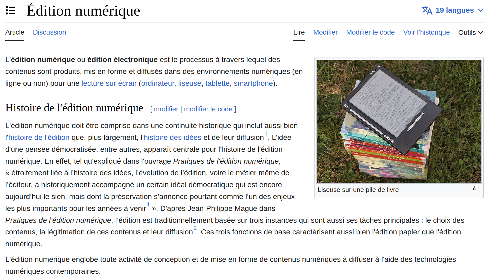<!-- .element: style="width:50%;float:left;margin-right:-1em;" -->

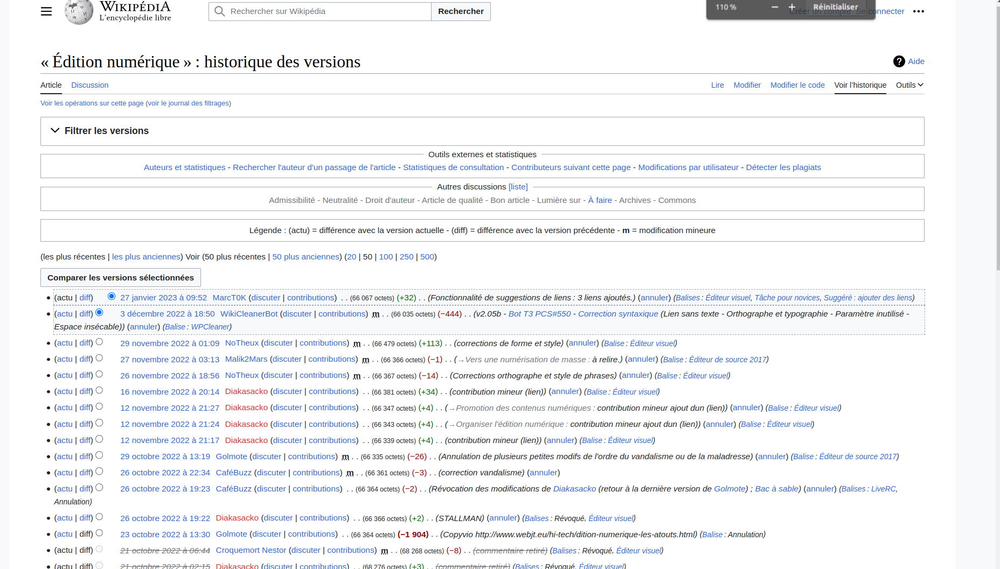<!-- .element: style="width:50%;float:right;margin-right:-1em;" -->

===

1 = ouverture dans le temps : c’est le fondement même de la nature processuelle de l’éditorialisation. La publication en ligne n’est plus le dernier maillon d’une “chaîne” éditoriale, mais bien le début d’une série de transformations. L'exemple le plus simple de cette éditorialisation dans le temps = Wikipédia (où une notice est amenée sans cesse à évoluer). Autre exemple = votre journal, dont la Une se met à jour désormais toutes les 15 minutes. Où les articles sont susceptibles d'être mis à jour : c'est d'ailleurs la raison pour laquelle on vous demande généralement, lorsque vous citez une source numérique, d'indiquer la date de votre consultation : le référencement était traditionnellement une question de lieu (tel titre, telle édition, telle page), il est désormais aussi une question de temps (tel site, telle page web, tel jour telle heure). 

Dans un régime éditorialisé, les contenus s'inscrivent en effet dans un flux permanent, là où l'édition permettait au contraire un principe très important de stabilisation des textes. On a vu que la stabilisation avait été l'un des enjeux de la construction du modèle éditorial moderne (rappelez-vous de l'auto-piratage de Voltaire). Ce principe de stabilisation se voit aujourd'hui directement remis en cause par le régime d'éditorialisation. Cette ouverture dans le temps dessine une nouvelle relation au contenu, qui se décline à présent en versions, marquant la fin de l’idée d’oeuvre conçue comme une unité stable (on pourra par exemple parler d’“états” du texte). On verra tout à l'heure avec F. Bon comment cette dé-stabilisation du texte peut être utilisée dans un corpus littéraire.

§§§§§§§§§§§§§§§§§§§§§§§§§§§§§§§§§§§§§§§§§§§§§

Un principe d'ouverture dans l'espace

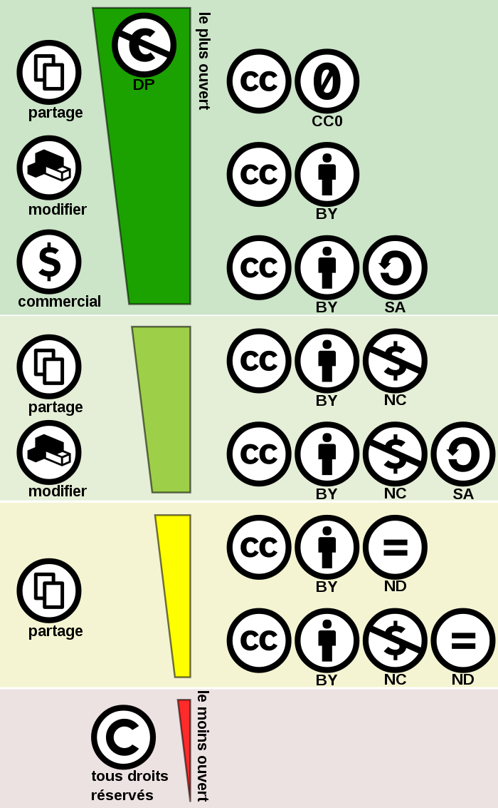<!-- .element: style="width:40%;float:left;margin-right:-1em;" -->

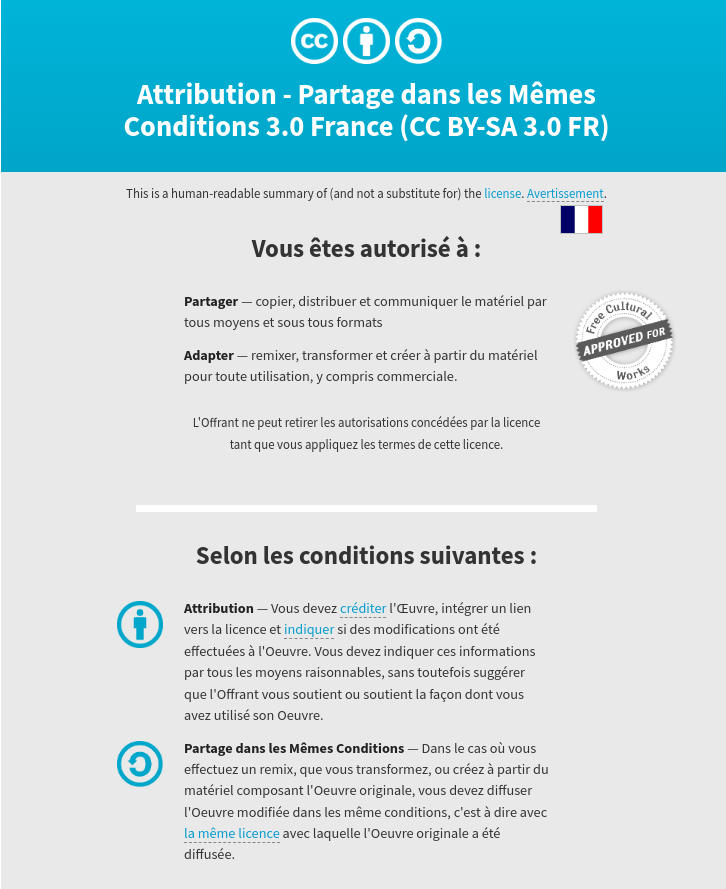<!-- .element: style="width:40%;float:right;margin-right:-1em;" -->

===

2 = Une ouverture dans l’espace. Corollairement à la proposition précédente, la dissémination des contenus s’appuie sur l’investissement conjoint de plusieurs espaces numériques. Davantage que des changements contextuels, la pluralité des environnement-supports reconfigure le sens des contenus, de manière parfois
imprévisible. Un contenu publié en ligne est en effet nécessairement soumis à une série de réappropriations qui vont le restructurer : du copier-coller, du remix, du mash-up ou remédiatisation (= republication dans un environnement alternatif). Ce qui est ici intéressant, c'est de constater que ces principes de republication échappent totalement à l'auteur original du contenu. C'est en raison même de ce principe de réappropriation que l'on a dû créer des licences (c'est la base des licences creative commons) : dans la mesure où l'on ne peut empêcher la copie d'un contenu en ligne (c'est la natude de la publication numérique que d'ouvrir à la réappropriation), on a donc créé des licences capables de déterminer les conditions de réappropriation. C'est le principe du copy-left.

§§§§§§§§§§§§§§§§§§§§§§§§§§§§§§§§§§§§§§§§§§§§§

Une relation stigmergique entre techniques et pratiques

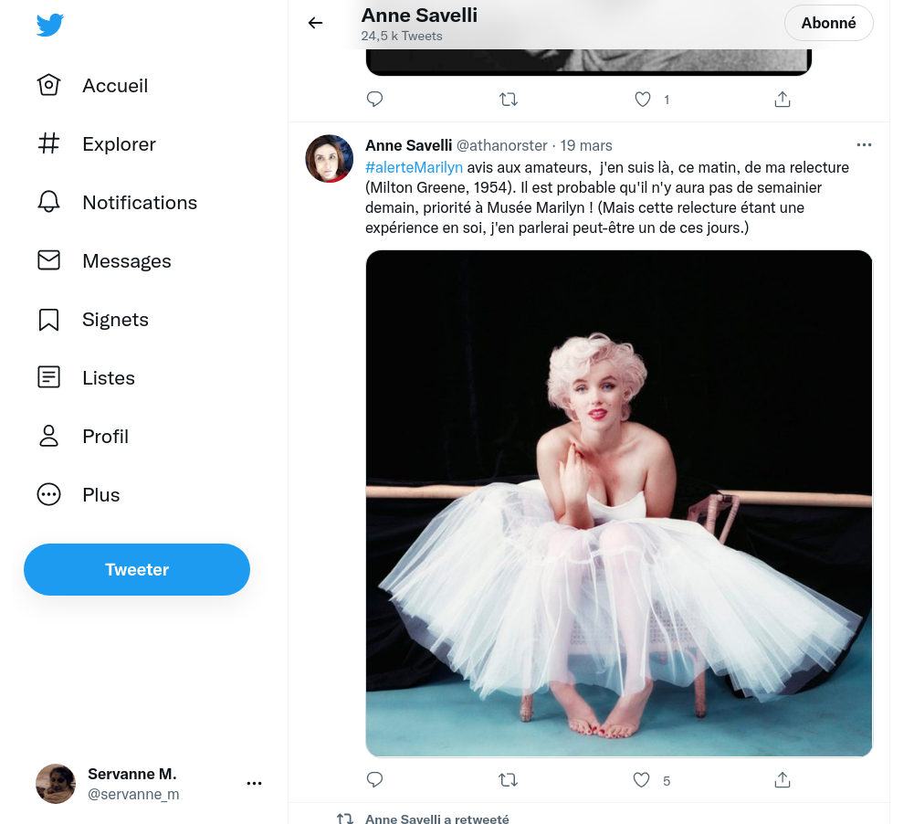<!-- .element: style="width:400px" -->

===

3 = Une relation stigmergique entre techniques et pratiques. L’éditorialisation permet de penser l’influence de la technique en évitant autant que possible le biais technodéterministe, pour envisager les relations stigmergiques qui se tissent entre l’usager et les media : si les outils, les plateformes numériques ont tendance à prescrire certains usages, ces derniers peuvent être infléchis par les pratiques des utilisateurs qui s’approprient les contenus aussi bien que leur environnement médiatique. Je n'insisterai pas trop sur cet aspect.

§§§§§§§§§§§§§§§§§§§§§§§§§§§§§§§§§§§§§§§§§§§§§

Une dynamique collective

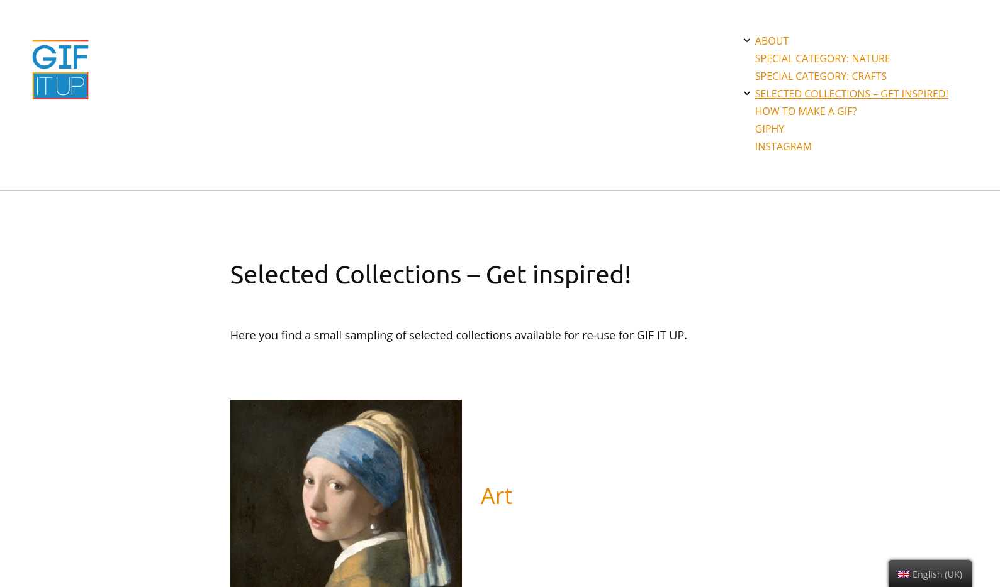<!-- .element: style="width:50%;float:left;margin-right:-1em;" -->

<!-- .element: style="width:50%;float:right;margin-right:-1em;" -->

===

4 = Une dynamique collective. Enfin, l’éditorialisation s’appuie sur un principe d’ouverture massive aux usagers, invités à devenir des acteurs à part entière de la production de contenus, via des pratiques de création participative, collaborative. Mais également via des politiques d'incitation à la réappropriation, au réagencement, etc. Cette dernière caractéristique marque une rupture épistémologique forte avec les régimes d’autorité traditionnels. Désormais, la frontière entre le producteur d’un contenu et son destinataire se voit totalement brouillée.

Donner l'Exemple de GIF it UP! Ou de l'appli BDNF

Important : dimension performative de l'éditorialisation.

Éditorialiser, c'est faire, c'est créer.
- L'éditorialisation vient faire appel à une activité et une responsabilité accrue des acteurs-lecteurs
- L'éditorialisation implique aussi une série d'outils et de protocoles qui ne sont pas toujours maîtrisables

Là où l'édition trad était finalement très normée, avec des structures d'autorités très fortes, l'édito implique une perte de contrôle qui peut s'avérer problématique pour nos institutions, mais aussi pour nous, lecteurs-internautes. Comment sont triés les résultats d'un page Google ? Je peux influer sur les résultats via mes recommandations. En même temps je n'ai pas la main sur l'algorithme...

§§§§§§§§§§§§§§§§§§§§§§§§§§§§§§§§§§§§§§§§§§§§§

## Éditorialisation et littérature : François Bon dans son chantier numérique

===

§§§§§§§§§§§§§§§§§§§§§§§§§§§§§§§§§§§§§§§§§§§§§
<!-- .slide: data-background-image="img/6165686178_548dbd0bf9_b.jpg" data-background-size="contain" -->

===

Texte important : Après le livre de F. Bon. Paru en 2011

§§§§§§§§§§§§§§§§§§§§§§§§§§§§§§§§§§§§§§§§§§§§§

>Nous vivons une des très rares mutations de l’écrit. Rares (la tablette, le rouleau, le codex, l’imprimerie), mais chaque fois irréversibles et globales.

>Ce que change Internet, ce n’est pas le rapport au livre, c’est le rapport au monde. Le numérique affecte la façon dont on écrit aussi bien que celle dont on lit, nos bibliothèques comme la trace que nous laissons parmi les autres.

>Il ne s’agit pas ici de prédire. Prendre le temps, au contraire, de considérer l’histoire récente de notre propre rapport à ces machines, comment nous nous en servons, ce qu’elles ouvrent de possibles. Prendre le temps de revenir à quelques oeuvres décisives, celles de Balzac ou de Rabelais en font partie, qui sont elles-mêmes l’empreinte d’une de ces transitions. Alors peut-être accepterons-nous de voir que s’offrent pour nos fables, nos récits, nos lettres, nos carnets privés, nos images aussi, d’autres vecteurs, une autre mémoire et de nouveaux modes de transmission.

>Nous sommes déjà après le livre.

<!-- .element: style="font-size:1.4rem; text-align:justify" -->

===

Première  question : les nouvelles formes de publication sur le web seraient-elles vraiment en train de détruire la stabilité du texte autrefois permise par l’imprimé ?

Réflexion préliminaire : la question de la stabilité et de la clôture...

§§§§§§§§§§§§§§§§§§§§§§§§§§§§§§§§§§§§§§§§§§§§§

### "Baudelaire n'a jamais écrit  les _Fleurs du mal_"
* Qu'est-ce qu'une "oeuvre" littéraire ?
* Discussion des enjeux de clôture et de stabilisation
* Le livre-nombreux : vers une nouvelle conception du texte et de la littérature

===

“Baudelaire n’a jamais écrit Les fleurs du mal”. Cette proposition polémique est le titre, un brin provocateur, du 11e chapitre d’Après le livre. Nous aurait-on alors menti ? Baudelaire ne serait pas le véritable auteur des Fleurs du mal, cette oeuvre qui compte parmi les plus connues de la littérature française ? Là n’est pas la question. François Bon n’a nullement la volonté d’ôter à Baudelaire la paternité de son oeuvre. Il s’agit plutôt de remettre en question le concept même d’oeuvre, comprise comme le résultat d’une intention explicite et forte de l’écrivain - dont le livre imprimé serait la matérialisation finale, stable et la pérenne. Dire que « Baudelaire n’a pas écrit Les Fleurs du mal », dans ce contexte, c’est donc affirmer que Les Fleurs du mal n’existent pas “en soi” comme une entité unique, autonome, et close sur elle-même, que l’auteur aurait imaginée et conçue d’un seul jet.

§§§§§§§§§§§§§§§§§§§§§§§§§§§§§§§§§§§§§§§§§§§§§
<!-- .slide: data-background-image="img/Fleurs_du_mal.jpg" data-background-size="contain" -->

§§§§§§§§§§§§§§§§§§§§§§§§§§§§§§§§§§§§§§§§§§§§§

### Une généalogie complexe, une clôture factice

- Manuscrit perdu confié à Charles Asselineau (vers 1850)
- 1ère édition par Auguste Poulet-Malassis, attaquée et censurée (1857)
- 2nde édition chez Poulet-Malassis, sans les poèmes censurés + "Tableaux Parisiens" (1861)
- Édition de _Les Épaves_ par Poulet-Malassis (1866)
- 4e Édition avec 151 poèmes (1868)
- 1949 : première "édition complète" autorisée

<!-- .element: style="font-size:1.7rem; text-align:justify" -->

===

De ce point de vue, il faut bien dire que François Bon a plutôt raison, comme le montre la généalogie complexe des Fleurs du mal. On sait en effet qu’il a d’abord existé un premier manuscrit relié du recueil, aujourd’hui perdu, que le poète avait confié à son ami écrivain Charles Asselineau, vers 1850 - le contenu exact de cette version est indéterminé. En 1857, une première édition des Fleurs du mal est publiée et tirée à 1300 exemplaires par le jeune éditeur Auguste Poulet-Malassis.
Attaquée pour outrage aux bonnes moeurs, puisque des poèmes comprennent des connotations érotiques à peine dissimulées, cette édition sera censurée.

Loin de se décourager, Auguste Poulet-Malassis, auquel Baudelaire a cédé les droits de reproduction exclusifs, propose une nouvelle édition du recueil en 1861. Le poète y supprime les 6 poèmes ayant fait l’objet d’une censure, mais en ajoute 32, pour un total de 126 poèmes - dont une nouvelle section, et non la moindre, celle des « Tableaux parisiens ». Cinq ans plus tard (1866), alors qu’il est exilé en Belgique pour échapper à la justice Française, Poulet-Malassis fait paraître Les Épaves, un recueil qui compte 23 poèmes de Baudelaire, dont les 6 qui avaient été censurés dans la première édition… L’ouvrage, évidemment, est condamné, mais il est considéré par les spécialistes comme la 3è édition des Fleurs du mal. Et ce n’est pas fini ! Après le décès de Baudelaire, une quatrième édition est publiée en 1868 qui comprend un total de 151 poèmes, sans ceux qui ont été condamnés par la censure - lesquels sont parallèlement re-publiés à Bruxelles en 1869, dans un Complément aux Fleurs du Mal de Charles Baudelaire, avec le recueil Les Épaves...

Tout cela pour dire, en fin de compte, que le public n’a pu lire une version “complète” des Fleurs du Mal qu’en 1949 (!), suite à un jugement de la Chambre criminelle de la Cour de cassation, qui a révisé l’ensemble des condamnations pour outrage aux bonnes mœurs commis par la voie du livre…

§§§§§§§§§§§§§§§§§§§§§§§§§§§§§§§§§§§§§§§§§§§§§

### Le livre-nombreux

> Peut-être “Les Fleurs du mal” est-il le livre le plus nombreux dans ma bibliothèque. Paradoxe de l’expression, mais comment dire autrement qu’il est présent dans la pièce où je travaille en tant d’éditions successives ou critiques, ou poche – ou ultra-poche… ?
>
> François Bon _Après le livre_, chapitre "Baudelaire n'a jamais écrit les Fleurs du mal" (2011)

<!-- .element: style="font-size:1.6rem; text-align:justify" -->

===

La proposition de François Bon est donc particulièrement originale : l’expression de « livre nombreux » qu’il utilise, désigne non seulement les versions du texte mais aussi les versions du livre - soit de l’inscription médiatique du texte.
En effet, on a bien vu que c’était aussi la mise en livre, le processus éditorial, qui avait construit une œuvre comme les Fleurs du mal, dont les éditions et rééditions ont été si nombreuses que Baudelaire lui-même n’en aura jamais vu l’état définitif. Le critère de “vérité du texte” doit alors prendre en compte cette multiplicité textuelle mais aussi matérielle, une multiplicité constitutive de la plupart des oeuvres littéraires - autant imputable à l’écrivain, qui aura construit une oeuvre sur plusieurs années), qu’à l’éditeur, qui est lui aussi l’architecte du livre.

§§§§§§§§§§§§§§§§§§§§§§§§§§§§§§§§§§§§§§§§§§§§§

### Le Chantier littéraire de _Fragments du dedans_

> Tout chantier d’écriture s’insère d’abord sur le site. Et puis vient un moment où le livre prend le relais, exige d’autres outils, d’autres reprises et approches.
>
> François Bon (Le Tiers livre)

<!-- .element: style="font-size:1.6rem; text-align:justify" -->

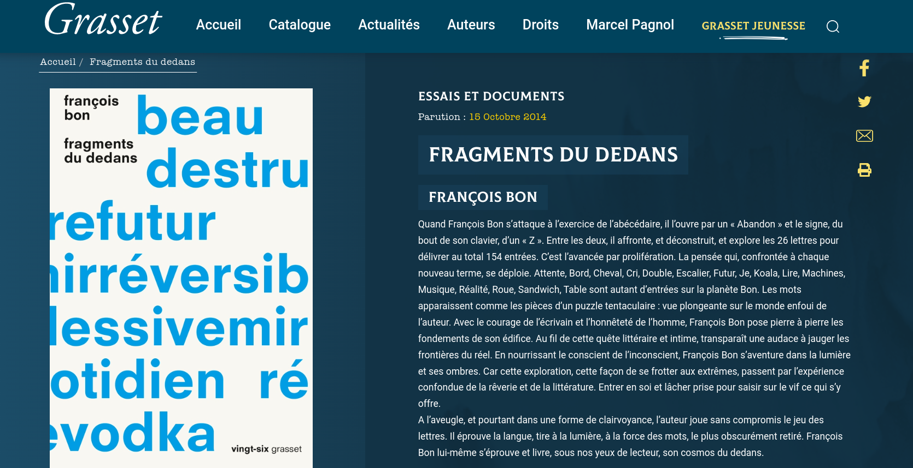<!-- .element: style="width:400px" -->

===

Il faut bien dire que les contenus diffusés en ligne sont sans cesse susceptibles d’être modifiés, altérés ou même supprimés : ils nous est tous arrivé au moins une fois de cliquer sur un “lien mort”, par exemple. Dans le domaine littéraire, cette instabilité ou fragilité technique redouble d’ailleurs celle des contenus publiés : sur le web, les écrivains et écrivaines se servent en effet de leur blogue ou de leur site pour diffuser des brouillons, des versions inachevées ou partielles d’un récit, chapitre par chapitre.

Sur les réseaux sociaux comme Twitter, ils se lancent dans des expériences exigeantes d’écriture “en direct”, donnant quotidiennement rendez-vous à leurs lecteurs - abonnés pour livrer les fragments d’un récit en construction. Pour le lecteur, l’occasion est enfin donnée d’assister à l’élaboration progressive d’un texte, et de voir les coulisses du travail littéraire. Le processus d’écriture se révèle, comme jamais, en train de se faire.

Ces chantiers à ciel ouvert que sont les blogues et les réseaux sociaux transgressent certains concepts encore très forts dans l’imaginaire littéraire et éditorial, à commencer par l’auteur et l’oeuvre. Là où le livre imprimé constituait le résultat final et très élaboré d’un travail de longue haleine, mené sur plusieurs années, mais dont rien ne filtrait, le web donne enfin à voir le travail d’écriture en amont. La conception même de l’oeuvre littéraire s’en trouve changée. Non seulement l’instabilité et le caractère inachevé du texte ne sont plus tabous.

§§§§§§§§§§§§§§§§§§§§§§§§§§§§§§§§§§§§§§§§§§§§§

### L'écriture-performance

>“Écrire n’est pas un scénario, un plan, mais comment la matière qu’on affronte sera subversion de ce scénario ou de ce plan, de l’intuition obscure qu’on en a. Le caractère nécessaire de la logique interne d’une oeuvre s’exprimant donc plutôt par l’écart qu’elle impose aux intuitions qui en sont l’origine. Le site Internet pourrait bien, alors, comme le soulignent ses détracteurs, se révéler dangereux pour les grandes constructions de l’esprit : il rend inopérante la contrainte d’écart.”
>
> François Bon (Le Tiers livre)

<!-- .element: style="font-size:1.6rem; text-align:justify" -->

===
Certains écrivains mettent en scène, dans ce qui devient parfois un véritable méta-récit, l’élaboration du texte. Dans les chantiers littéraires en ligne, l’écriture est ainsi transformée en une performance.

Cette écriture-performance, François Bon l’a mise en pratique avec Fragments du dedans - un livre publié chez Grasset, mais dont le “chantier” a d’abord été publié en ligne.

Pour François Bon en effet, “tout chantier d’écriture s’insère d’abord sur le site. Et puis vient un moment où le livre prend le relais, exige d’autres outils, d’autres reprises et approches.” Le web-chantier ne se conçoit donc pas comme un “concurrent” du livre, mais comme une expérience alternative, autonome, qui servira de pierre d’assise à la constitution de celui-ci. Ce que François Bon publie en ligne, c’est bien cette performance qu’est l’écriture - “non pas le livre, mais ce pré-travail sur le web, l’étape embryonnaire aux 2/3 de la constitution du livre, en l’état”.

§§§§§§§§§§§§§§§§§§§§§§§§§§§§§§§§§§§§§§§§§§§§§
<!-- .slide: data-background-image="img/fragmentsDuDedans.png" data-background-size="contain" -->

===
>C’était au printemps 2013. Je reçois par mail la proposition de Jeanne Garcin, éditrice chez Grasset : un abécédaire, prise de risque sous la protection de l’alphabet, tentative par l’écart, puisque aucun des auteurs sollicités ne serait chez son éditeur habituel.

Premiers rendez-vous, lente approche, le courant passe, frappé par la détermination, la qualité aussi des maquettes. Content aussi de retrouver dans cette collection quelques ferrailleurs de langue amis. Je me lance à l’été 2013, dans le petit hameau de Tartonne, dans les Alpes de Haute-Provence, mais l’écriture va continuer, le plus souvent hors domicile, dans les trains, les hôtels, les bistrots de passage, jusque vers juin 2014.

Comme d’ordinaire, tout chantier d’écriture s’insère d’abord ici sur le site. Et puis vient un moment où le livre prend le relais, exige d’autres outils, d’autres reprises et approches. Les mots les plus dangereux (roman) viendraient tout à la fin.

Sur le livre, voir autres billets de cette rubrique, et bien sûr possible de le commander ci-dessous, version papier ou numérique. Et c’est aussi une manière de soutenir le travail qui se fait ici en ligne.

§§§§§§§§§§§§§§§§§§§§§§§§§§§§§§§§§§§§§§§§§§§§§
<!-- .slide: data-background-image="img/fragmentdededansSite.png" data-background-size="contain"-->

===

Ci-dessous, non pas le livre, mais ce pré-travail sur le web, l’étape embryonnaire aux 2/3 de la constitution du livre, en l’état... Et, comme on le constatera, le titre aussi a surgi tout à la fin, en complicité avec J.G.

FB, août 2015

§§§§§§§§§§§§§§§§§§§§§§§§§§§§§§§§§§§§§§§§§§§§§
<!-- .slide: data-background-image="img/fragmentDeDedansGrasset.png" data-background-size="contain"-->

===

Évidemment, il n’est pas toujours aisé pour les éditeurs de comprendre ce genre de démarche… Beaucoup d’entre eux demandent en effet aux écrivains d’effacer les traces des chantiers en ligne, de peur que les lecteurs ne voient pas bien l’intérêt d’acheter un livre dont une part du contenu est disponible gratuitement sur le web. C’est bien mal comprendre ce qui se joue fondamentalement ici : car pour le lecteur, justement, ce sont deux expériences de lecture bien différentes ! L’une, sur le web, consiste à suivre une performance d’écriture et un récit discontinu - il faut en effet patienter entre les publications, et le sens du texte semble toujours en suspens. L’autre expérience, à travers le livre, consiste à lire un récit linéaire, dont la clôture balise par ailleurs un horizon d’attente bien différent. Comme avec Les Fleurs du mal de Baudelaire, le texte se révèle donc “nombreux” depuis ses racines en ligne jusqu’au livre imprimé. Et le dispositif éditorial, ici, ne doit pas être pensé du point de vue des contenus, mais bien depuis celui de l’expérience de lecture.

§§§§§§§§§§§§§§§§§§§§§§§§§§§§§§§§§§§§§§§§§§§§§

### Le cas _Limite_ de François Bon
* Un chantier inversé
* La réouverture du livre

===

À première vue, ces chantiers littéraires en ligne pourraient passer pour une étape transitoire vers l’imprimé, dont l’autorité et la stabilité resteraient indétrônable. Le bon vieux livre papier viendrait clore un chantier numérique dont il serait la finalité. Ce serait là bien mal connaître François Bon qui, en 2010, s’est lancé dans un travail un peu fou de récriture en ligne de son second roman, Limite. Travail “fou” car François Bon à dû retaper tout son texte à la main, puisqu’il n’existait pas de copie originale numérique de cet ouvrage paru en 1985 chez Minuit. En d’autres termes, l’auteur a procédé à contre-courant de ce que propose le modèle éditorial traditionnel, en “réouvrant” le chantier d’un livre publié 25 ans plus tôt…

§§§§§§§§§§§§§§§§§§§§§§§§§§§§§§§§§§§§§§§§§§§§§
<!-- .slide: data-background-image="img/limite01.png" data-background-size="contain"-->

===

Écrit dans les années 1980, alors que François Bon était encore un “jeune” auteur méconnu, Limite était épuisé depuis déjà bien longtemps et l’éditeur, Minuit, n’avait pas le projet de le rééditer.

§§§§§§§§§§§§§§§§§§§§§§§§§§§§§§§§§§§§§§§§§§§§§
<!-- .slide: data-background-image="img/limite02.png" data-background-size="contain"-->
<!-- .slide: class="hover"-->

===
En accord avec la maison d’édition, François Bon a donc décidé de rendre disponible à nouveau cet ouvrage, en le recopiant et le republiant lui-même sur son site web, le Tiers livre.

§§§§§§§§§§§§§§§§§§§§§§§§§§§§§§§§§§§§§§§§§§§§§

>Alors scanner et préparer l’epub ? Non : 30 ans après, j’ai décidé de tout recopier à la main sur mon ordi. Bien sûr, quelques phrases ont changé, peut-être un ou deux passages ont-ils sauté, quelques adjectifs ont été virés à la soufflette. Mais l’équilibre d’une langue est comme hors de l’auteur, on n’y touche pas. C’est très surprenant aussi combien on le découvre mémorisé, organiquement lié à vous-même, bien au-delà du souvenir conscient.

<!-- .element: style="font-size:1.4rem" -->

===

Question du choix technique :  pas de format numérique, initialement tapé à la machine (tapuscrit)... Le plus "simple" serait d'en proposer une numérisation, un peu sur le modèle de ce que propose la BN, par exemple.

Mais FB va préférer travailler directement dans son site web : donc nécessité de tt recopier à la main. CITER

§§§§§§§§§§§§§§§§§§§§§§§§§§§§§§§§§§§§§§§§§§§§§

>Encore un travail qui a commencé par le site, et restera en ligne ci-dessous.
Ecrit en 1985 à la Villa Médicis sur une machine à écrire électrique Adler (j’avais déjà à endurer quelques commentaires de collègues traditionnalistes sur le fait que j’utilisais un engin aussi futuriste), je n’avais pas de version numérique de Limite, dont j’ai pu il y a 3 ans récupérer les droits aux éditions de Minuit, qui l’avaient laissé en déshérence. Irène Lindon a eu l’élégance d’accepter, moi je voudrais bien récupérer les droits de tous mes livres au-delà de 10 ans d’exploitation, c’est une des raisons qui m’a conduit à fonder ma propre maison d’édition.

<!-- .element: style="font-size:1.4rem" -->

===

Encore un travail qui a commencé par le site, et restera en ligne ci-dessous.
Ecrit en 1985 à la Villa Médicis sur une machine à écrire électrique Adler (j’avais déjà à endurer quelques commentaires de collègues traditionnalistes sur le fait que j’utilisais un engin aussi futuriste), je n’avais pas de version numérique de Limite, dont j’ai pu il y a 3 ans récupérer les droits aux éditions de Minuit, qui l’avaient laissé en déshérence. Irène Lindon a eu l’élégance d’accepter, moi je voudrais bien récupérer les droits de tous mes livres au-delà de 10 ans d’exploitation, c’est une des raisons qui m’a conduit à fonder ma propre maison d’édition.

§§§§§§§§§§§§§§§§§§§§§§§§§§§§§§§§§§§§§§§§§§§§§

>Et c’est dans ces heures de dactylographie (le découpage des billets ici en témoigne, une douzaine de grandes séances) que me revenaient aussi les sources, les événements, les intuitions – des moments qui touchaient parfois à l’écriture, parfois aux racines autobiographiques. « Le deuxième livre est toujours le plus difficile à écrire », c’est une phrase de Jérôme Lindon, le directeur des éditions de Minuit, à réception du premier état du manuscrit, qui portait alors pour titre Terrain glissant. J’ai décidé que cette phrase serait le titre de ce livre imprimé, spécialement composé pour accueillir cette démarche.

<!-- .element: style="font-size:1.4rem" -->

===

Et c’est dans ces heures de dactylographie (le découpage des billets ici en témoigne, une douzaine de grandes séances) que me revenaient aussi les sources, les événements, les intuitions – des moments qui touchaient parfois à l’écriture, parfois aux racines autobiographiques. « Le deuxième livre est toujours le plus difficile à écrire », c’est une phrase de Jérôme Lindon, le directeur des éditions de Minuit, à réception du premier état du manuscrit, qui portait alors pour titre Terrain glissant. J’ai décidé que cette phrase serait le titre de ce livre imprimé, spécialement composé pour accueillir cette démarche.

§§§§§§§§§§§§§§§§§§§§§§§§§§§§§§§§§§§§§§§§§§§§§
<!-- .slide: data-background-image="img/limite001.png" data-background-size="contain"-->

===

Tradition de Jérôme Lindon chez Minuit : refuser systématiquement les second manuscrits en l'état. Les auteurs devaient entièrement les reprendre. Personne n'y échappe. Jean ECHenoz raconte comment il a mit des années après le refus de son second MS pour oser réécrire, et renvoyer quelque chose à Lindon.

FB lui aussi, en son temps, a vu son second manuscrit refusé :

>Quand je revois Jérôme Lindon, en juin 1985, le manuscrit s’appelle Terrain glissant. Quand j’entre dans son bureau, il raccroche son téléphone : – Marguerite Duras me dit que c’est un très mauvais titre... Jamais su si c’était réel ou un de ses rituels, pour lui l’édition tenait du jeu, mais c’est avec nous qu’il jouait, on était gagnant aussi. Et c’est lui qui proposera Limite.

Le livre devra en effet subir de grosses modifications.

Mais cette fois, FB joue avec la formule de Lindon, pour en faire dériver quelque peu le sens : "Le second livre est toujours le plus difficile à écrire"... même si, ici, ce sera plutôt une seconde version du livre. Un livre réécrit plus 20 ans après sa première publication.

§§§§§§§§§§§§§§§§§§§§§§§§§§§§§§§§§§§§§§§§§§§§§

### 1. Un travail de republication
* Un livre "recopié" à la main pour être numérisé
* Des modifications mineures (syntaxe, vocabulaire)

===

En effet, il faut bien comprendre que le travail de recopiage auquel se livre FB, va finalement constituer un travail de réécriture à part entière qui va changer le sens de l'oeuvre.

Tout d'abord, il s'agit d'un travail de l'ordre de la republication : Cette réédition numérique permet d’apporter quelques modifications mineures au texte : de l’aveu même de l’auteur, “quelques phrases ont changé, peut-être un ou deux passages ont-ils sauté, quelques adjectifs ont été virés à la soufflette” (Bon, Tiers livre).

§§§§§§§§§§§§§§§§§§§§§§§§§§§§§§§§§§§§§§§§§§§§§

### 2. Un travail de remédiation (du papier au numérique)
* De la forme linéaire à la forme fragmentée et hypertextuelle
* Transformation du roman en feuilleton
* Nouvelle expérience de lecture

===

2. Travail de remédiation

Par ailleurs, en choisissant de ne pas produire un livre numérique (epub), mais une série de posts de blogue publiés à intervalles réguliers, François Bon transforme le roman Limite en feuilleton : le texte est fragmenté, soit découpé en 12 parties. Il se transforme alors en hypertexte, là où la version imprimée privilégiait une forme linéaire.

§§§§§§§§§§§§§§§§§§§§§§§§§§§§§§§§§§§§§§§§§§§§§

### 3. Un travail de rétro-médiation
* Augmentation du récit original (création d'un méta-récit)
* Retour "à la forme initiale, en amont de la première publication”
* _Virtualisation_ du texte : de l’édition à l’éditorialisation, revenir aux origines du geste créatif

===

Mais surtout, au fur et à mesure qu’il se prête à cet exercice de dactylographie à première vue bien mécanique, l’écrivain redécouvre son propre texte et entame la construction d’un métarécit à caractère autobiographique, établissant des ponts entre la fiction (Limite) et un récit rétrospectif sur son parcours d’écrivain.

En republiant en ligne Limite, François Bon réouvre donc le chantier du roman, pour en créer une version augmentée qui explore les potentialités du texte au-delà de toute exigence de stabilité et de clôture. Dans sa forme imprimée, Limite, tel que publié chez Minuit, aura été un moment du texte - mais pas le seul !

§§§§§§§§§§§§§§§§§§§§§§§§§§§§§§§§§§§§§§§§§§§§§
<!-- .slide: data-background-image="img/limiteExemple1.png" data-background-size="contain"-->

§§§§§§§§§§§§§§§§§§§§§§§§§§§§§§§§§§§§§§§§§§§§§

### Éditorialisation de la chaîne éditoriale : le modèle SSP

§§§§§§§§§§§§§§§§§§§§§§§§§§§§§§§§§§§§§§§§§§§§§

### *Single source publishing* ?

### Éléments de définitions

 <!-- .element: style="width:300px" -->

§§§§§§§§§§§§§§§§§§§§§§§§§§§§§§§§§§§§§§§§§§§§§

### La méthode *single-source publishing*  en bref
Le *single-source publishing* désigne une méthode de production d'un objet médiatique (livre imprimé, numérique, numérique augmenté, PDF) à partir d'une source commune, dont le format permet des exports et des transformations en une multiplicité d'autres formats.

<!-- .element: style="font-size:1.4rem; text-align:justify" -->

§§§§§§§§§§§§§§§§§§§§§§§§§§§§§§§§§§§§§§§§§§§§§

### La méthode *single-source publishing* en images

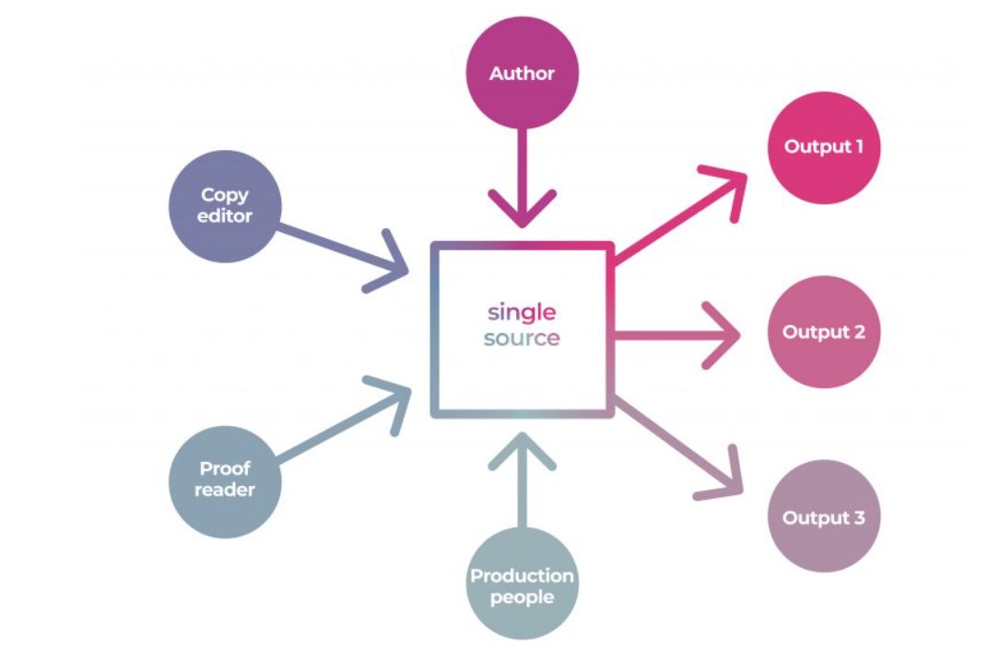 <!-- .element: style="width:45%;float:right;margin-left:-1em;" -->

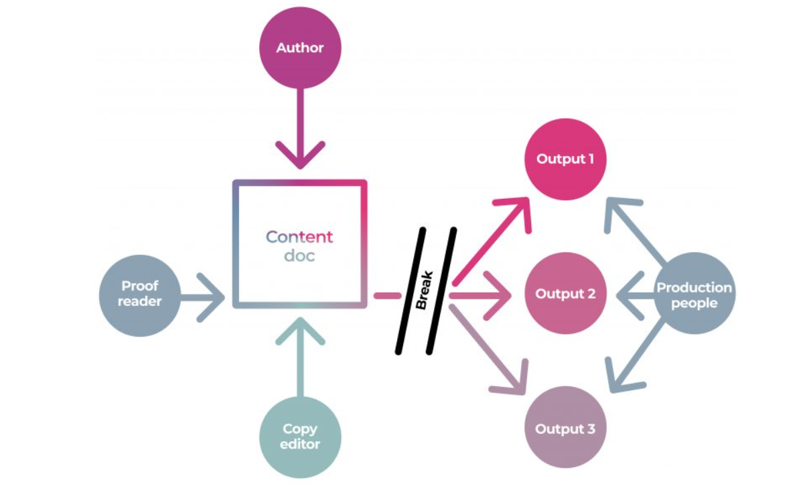 <!-- .element: style="width:45%;float:left;margin-right:-1em;" -->

§§§§§§§§§§§§§§§§§§§§§§§§§§§§§§§§§§§§§§§§§§§§§

### Le problème

- discontinuités et ruptures au stade de la production et de la publication : une multiplication de versions
- une succession d'outils et de formats à chaque "maillon" de la chaîne : des problèmes d'interopérabilité
- une publication orientée imprimé, le multiformat relégué en "post-production" : un travail chronophage, complexe, coûteux

<!-- .element: style="width:45%;float:left;margin-left:-1em; font-size:1.4rem; text-align:justify" -->

 <!-- .element: style="width:45%;float:right;margin-right:-1em;" -->

===

- discontinuités et ruptures au stade de la production et de la publication

Le texte que vous envoyez à votre directeur, celui qu'il vous renvoie : multiplication des versions.

- une succession d'outils et de formats à chaque "maillon" de la chaîne

Problème d'interropérabilité : la chaîne porte mal son nom, car elle laisse entendre que la production d'un livre s'opère de manière séquentielle comme un long fleuve tranquille, avec peu d'acteurs impliqués. 
La réalité est plus complexe.

- une publication multiformat en "post-production" : un travail chronophage, complexe, coûteux
La production du livre est aujourd'hui principalement pensée pour de l'imprimé. 
Tout ce qui va relever de la publication multimodale, notamment en numérique (epub, HTML, livre augmenté) est pensé après, alors que c'est déjà trop tard. On va remédier un livre imprimé au lieu de penser dès le premier maillon de la chaîne une sortie numérique.

§§§§§§§§§§§§§§§§§§§§§§§§§§§§§§§§§§§§§§§§§§§§§

### La solution *SSP*

* Un écosystème de publication collaboratif, où interviendront *tous* les acteurs de la chaîne
* Un format pivot à partir duquel on produira l'ensemble des formats nécessaires à la production du livre, quelle que soit sa forme médiatique (imprimé, numérique)

<!-- .element: style="width:45%;float:left;margin-left:-1em; font-size:1.4rem; text-align:justify" -->

 <!-- .element: style="width:45%;float:right;margin-right:-1em;" -->

===

§§§§§§§§§§§§§§§§§§§§§§§§§§§§§§§§§§§§§§§§§§§§§
<!-- .slide: data-background-image="img/SingleSourcePublishinModel.png" data-background-size="contain"-->

§§§§§§§§§§§§§§§§§§§§§§§§§§§§§§§§§§§§§§§§§§§§§
<!-- .slide: data-background-image="img/ssp-exemple-technique.png" data-background-size="contain"-->

§§§§§§§§§§§§§§§§§§§§§§§§§§§§§§§§§§§§§§§§§§§§§

### La philosophie (l'utopie ?)

>Single sourcing isn’t a specific solution, it is a general idea that must be intentionally designed into a publisher’s workflow. Single sourcing changes how people work and often requires a different tooling. The secret really, if we zoom out to a high-level abstraction of the problem, is to work out how the content creation and production folks can work in a shared ‘environment’ where they all work on the same files, the same source files – hence the term ‘single source’.

>CoKo Foundation

<!-- .element: style="font-size:1.4rem; text-align:justify" -->

===

Le single source n'est pas une solution spécifique, c'est une idée générale qui doit être intentionnellement conçue dans le flux de travail d'un éditeur. Le sourcing unique modifie la façon dont les gens travaillent et nécessite souvent un outillage différent. Le secret, si l'on s'en tient à une abstraction du problème, est de trouver comment les personnes chargées de la création et de la production du contenu peuvent travailler dans un "environnement" partagé où elles travaillent toutes sur les mêmes fichiers, les mêmes fichiers sources - d'où le terme "source unique".

### Expérimentations *ssp* dans les écritures littéraires 
#### Une poétique du hack dans la *gittérature* de la maison *Abrüpt*

<!-- .element: style="width:400px" -->

§§§§§§§§§§§§§§§§§§§§§§§§§§§§§§§§§§§§§§§§§§§§§
<!-- .slide: data-background-image="img/abruptGitterature.png" data-background-size="contain" -->

source image : [Site web d'Abrüpt](https://abrupt.cc/)

<!-- .element: class="source" -->

===

§§§§§§§§§§§§§§§§§§§§§§§§§§§§§§§§§§§§§§§§§§§§§
<!-- .slide: data-background-video="img/abruptcropped.mp4" data-background-size="contain" -->

source image : [page d'accueil du site web d'Abrüpt](https://abrupt.cc/)

<!-- .element: class="source" -->

===

Abrüpt est une maison d'édition Suisse, mais il serait plus juste de dire qu'elle habite web (j'y reviendrai). J'ai tendance, vous le constatez, à personnifier mon objet d'étude, mais c'est que les éditeurs-artisans-bricoleurs à l'origine du projet se font bien discrets. Ils vous répondront toujours quand vous avez une question à leur poser, mais ils semblent tout particulièrement attachés à s'exprimer à travers un "nous" maintenant une certaine équivoque (entre acteurs "humains", acteurs "techniques", "acteurs institutionnels") :

>notre situation est Internet, mais notre corporéité reste pour l’instant établie du côté de Zürich, en cette terre helvétique où se promènent les fantômes affranchis de quelques réfugiés de l’histoire.

De fait, Abrüpt -- puisque je me contenterai moi aussi de ce seul nom -- adopte la rhétorique d'un mouvement collectif. En effet :

>C’est abrüpt. Le mot se disperse dans l’obscur, et il ne nous reste plus que des livres à jeter au monde pour manifester rêves et hurlements. Nous nous organisons autour de textes qui s’agitent et se révoltent, s’altèrent en antilivres, s’échouent en partage. Nous fabriquons de la transdialectique et trafiquons du papier, nous prenons note d’une cyberpoétique dont le verbe fomente l’erreur au cœur du réel. Il bruit. Nous sommes à l’écoute.

§§§§§§§§§§§§§§§§§§§§§§§§§§§§§§§§§§§§§§§§§§§§§
<!-- .slide: data-background-image="img/abruptManifeste.png" data-background-size="contain" -->

source image : [Manifeste Abrüpt](https://www.antilivre.org/#manifeste)

<!-- .element: class="source" -->

===
Comme de nombreux collectifs Abrüpt a un projet. Ce projet a été formulé dans un manifeste que vous trouvez en ligne sur le site web de la maison.

Morceaux choisis :

§§§§§§§§§§§§§§§§§§§§§§§§§§§§§§§§§§§§§§§§§§§§§

> L’antilivre est une métamorphose, est son désordre, est l’affirmation d’une littérature des courts-circuits, de sa circulation joyeuse, contre l’époque, contre le livre et sa grammaire, contre sa chaîne et ses ronronnements, pour un futur des altérations, pour une information libre et réticulaire, pour une multitude éclairée par celle-ci.

<!-- .element: style="font-size:1.4rem; text-align:justify" -->

>L’antilivre n’a pas de forme, son impermanence dispose de toutes les formes, il se transforme sans cesse, et son information brute ne connaît aucune fixité, aucune frontière, elle fragmente son essence, distribue le commun, déploie sa liberté au-devant de nos singularités cybernétiques.

<!-- .element: style="font-size:1.4rem; text-align:justify" -->

>L’antilivre a pour ennemi toute culture. La culture ne lutte pas, elle tient la matraque, elle divertit, puis assomme.

<!-- .element: style="font-size:1.4rem; text-align:justify" -->

===

L'abrüpt manifeste de l'antilivre -- et de l'antilittérature -- détaille un programme aussi poétique que politique, où la références au mouvement des communs s'accompagne d'un appel à bousculer le verbe, la langue, et plus largement l'institution culturelle dans son ensemble. Un manifeste à l'image du catalogue où cohabitent des classiques de la pensée SHS du XX^e^ siècle (Simone Weil, Pierre Kropotkine), des auteurs contemporains que l'on aura déjà croisés ici et là sur des plateformes bien connues (Pierre Ménard et Christine Jeanney, contributeurs réguliers à publie.net), mais aussi de nouveaux noms, en tout cas pour moi : Lucia Pigliapochi ou Otto Borg. Il y a de l'essai, de la poésie, du récit, de l'image aussi (photographie, dessin). Bref, un catalogue très hétérogène en apparence, mais dans le quel se file une ligne éditoriale claire.

§§§§§§§§§§§§§§§§§§§§§§§§§§§§§§§§§§§§§§§§§§§§§

### Abrüpt, l'antilivre de la littérature
* Repenser la séquentialité de la chaîne éditoriale
* Ouvrir le livre *et* donc le texte (modularité, multiformats)

<!-- .element: style="font-size:1.6rem; text-align:justify" -->
===
Dans le manifeste antilittéraire d’Abrüpt, le poétique et le politique sont indissociables. La référence au mouvement des communs s’accompagne d’un appel à bousculer le verbe, la langue, et plus largement l’institution culturelle dans son ensemble.
L'antilivre repose de plus sur une conception très technique, entièrement arrimée au protocole GIT.

§§§§§§§§§§§§§§§§§§§§§§§§§§§§§§§§§§§§§§§§§§§§§
<!-- .slide: data-background-image="img/dio-abrupt.png" data-background-size="contain"-->

source image : Dio, *Anthropie*, sur le site de l'éditeur Abrüpt

<!-- .element: class="source" -->

===

L'antilivre est multiple. 
On a une belle expression de cette multimodalité.

§§§§§§§§§§§§§§§§§§§§§§§§§§§§§§§§§§§§§§§§§§§§§
<!-- .slide: data-background-image="img/dio-html.png" data-background-size="contain"-->

source image : Dio, *Anthropie*, antilivre HTML

<!-- .element: class="source" -->

§§§§§§§§§§§§§§§§§§§§§§§§§§§§§§§§§§§§§§§§§§§§§
<!-- .slide: data-background-image="img/dio-pdf.png" data-background-size="contain"-->

source image : Dio, *Anthropie*, PDF

<!-- .element: class="source" -->

===

§§§§§§§§§§§§§§§§§§§§§§§§§§§§§§§§§§§§§§§§§§§§§
<!-- .slide: data-background-image="img/anthropieVoleCeLivre.png" data-background-size="contain"-->

source image : Dio, *Anthropie*, version imprimée

<!-- .element: class="source" -->

===

§§§§§§§§§§§§§§§§§§§§§§§§§§§§§§§§§§§§§§§§§§§§§
<!-- .slide: data-background-image="img/dio-git.png" data-background-size="contain"-->

source image : Dio, *Anthropie*, dépôt Git

<!-- .element: class="source" -->

===

§§§§§§§§§§§§§§§§§§§§§§§§§§§§§§§§§§§§§§§§§§§§§

### De la chaîne à l'environnement éditorial : GitLab

<!-- .element: style="width:45%;float:left;margin-left:-1em; font-size:2rem; text-align:justify" -->

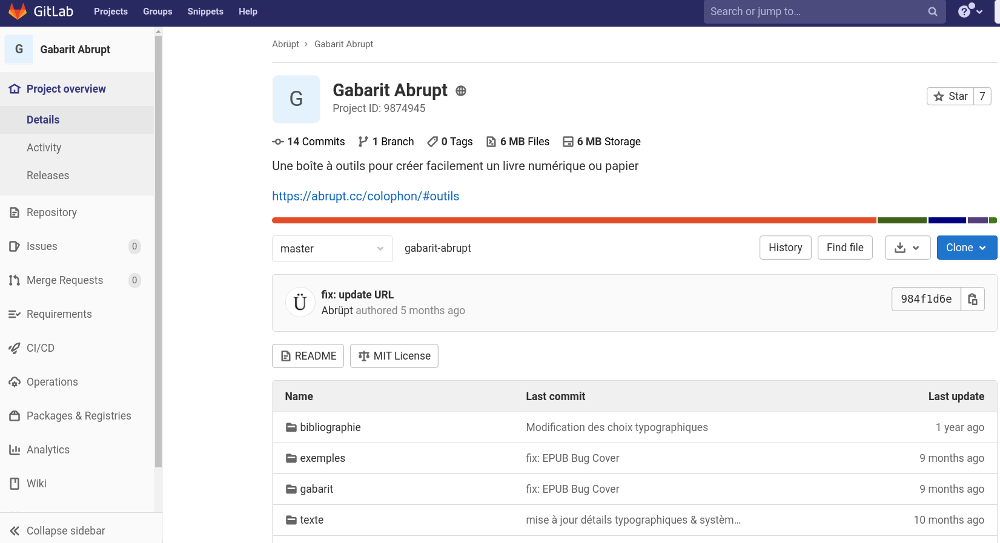<!-- .element: style="width:45%;float:right;margin-right:-1em;" -->

===

Le modèle éditorial repose sur l'utilisation d'une plateforme un peu particulière : la plateforme Gitlab, qui tient son nom du logiciel/protocole GIT. Je vais détailler le fonctionnement de cet outil dans un instant, mais en deux mots : Git est une forge logicielle [c'est surtout un protocole] de développement collaboratif qui, grâce à son système de gestion de versions, permet à des informaticiens de produire, échanger, modifier du code, le tout selon une logique contributive. GitLab, quant à lui, est un logiciel libre basé sur [le protocole/logiciel] GIT, auquel s'ajoutent des fonctionnalités de wiki, un système de suivi des bugs et de communication.

Gitlab est ce que l'on a baptisé en informatique une "forge" : un système de gestion de maintenance collaboratif de texte. Selon Violaine Louvet "L'objectif d'une forge est d'offrir un espace d’échange permanent et de collaboration en ligne aux développeurs de logiciels, et un espace de distribution (versions publiques des logiciels développés : paquets sources, pages web) pour les utilisateurs (pour tout un chacun si la forge est publique). Elle permet ainsi de rassembler des projets et des développeurs, mais aussi d'autres personnes travaillant sur ces projets (utilisateurs, traducteurs...)." (Source : [PLUME](https://www.projet-plume.org/ressource/faq-forge)).

§§§§§§§§§§§§§§§§§§§§§§§§§§§§§§§§§§§§§§§§§§§§§

### GitLab, la plateforme d'écriture des geeks
* Une plateformisation à contre-courant (compétence technique & littératie numérique)
* Une philosophie anti-wattpad (*vs* "Don't think, just write")
* Une technologie libre
* Une rencontre entre deux philosophies d'écriture : l'informatique et la littérature

<!-- .element: style="width:45%;float:left;margin-left:-1em; font-size:1.4rem; text-align:justify" -->

<!-- .element: style="width:45%;float:right;margin-right:-1em;" -->

===

Bref : gitlab, c'est une plateforme de *geeks*, pas d'écrivains. Et rien que pour cette raison, il s'agit d'un cas d'étude assez intéressant pour le sujet qui nous occupe aujourd'hui, car elle prend le contre-pied du mouvement de plateformisation des écritures web "littéraires" qui, de manière générale, ont plutôt fait le pari d'ouvrir les outils à des publics sans compétences techniques poussées, voire sans littératie numérique du tout.

Dans un contexte où les plateformes numériques redoublent d'effort pour, en surface, proposer des outils hyper-simples à utiliser, le passage par un logiciel tel que Gitlab propose au contraire de faire apparaître, pour mieux les penser, les différents niveaux de l'écriture web, et notamment le code informatique dont les usagers dans leur grande majorité n'ont généralement aucune connaissance. Il y a quelques années, Wattpad avait lancé une campagne publicitaire dont le slogan était "Don't think, just write" -- prônant la démocratisation d'une écriture créative en ligne, libérée de la contrainte technique. C'est un peu le chemin inverse que prône la gittérature : pour écrire, pensez d'abord à ce qui vous permet d'écrire. Ce qui peut ressembler à un verrou technique avec Gitlab est cependant compensé par une nette ouverture en termes d'autorité, puisque le système repose sur un principe de co-écriture et de partage des sources.

Que l'on me comprenne bien : Gitlab n'est pas une "niche" -- la plateforme dit compter près de 30 millions d'utilisateurs, ce qui n'a rien d'anodin -- elle s'adresse simplement à une espèce d'écrivains un peu à part certes, mais d'écrivains tout de même : celle des développeurs, en apparence assez éloignés des écrivains littéraires.

Ce que je vais dire peut sembler évidement mais je crois qu'il est bon de le rappeler : on aurait tort de considérer l'écriture du code comme une activité purement technique. L'histoire de l'informatique, l'émergence et la construction des langages de programmation s'est accompagnée d'une pensée théorique [et politique] sur les enjeux conceptuels [et politiques] de la technique. Dans le champ littéraire, les *critical code studies* jouent depuis longtemps avec la dimension poétique du code informatique. La gittérature s'inscrit en partie dans ce cadre, mais il me semble qu'elle va plus loin, puisqu'il s'agit de confronter la littérature à un autre modèle d'écriture, celui de l'écriture logicielle, de manière à bousculer des concepts fortement ancrés dans la tradition littéraire, à commencer par celui d'autorité.

§§§§§§§§§§§§§§§§§§§§§§§§§§§§§§§§§§§§§§§§§§§§§

### Écrire avec Gitlab
* Rien ne se perd, rien ne se crée, tout se transforme
* Coder *sur* du code : une écriture-palimpseste
* Un modèle contributif ("autorité partagée", mutualisation des compétences)
* Un espace conversationnel

<!-- .element: style="width:45%;float:left;margin-left:-1em; font-size:1.4rem; text-align:justify" -->

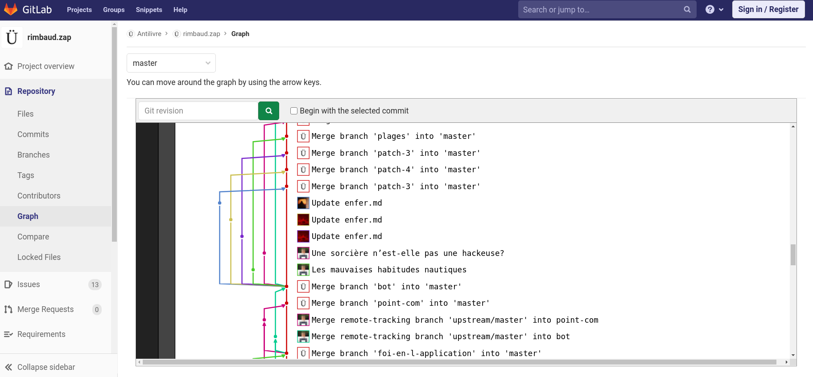<!-- .element: style="width:45%;float:right;margin-right:-1em;" -->

===

Le *hack*, ainsi entendu, c'est donc en fait un principe d'écriture -- sans doute pas si éloigné d'ailleurs d'une tradition littéraire ancienne favorisant la parodie, le pastiche, et plus récemment les défis oulipiens. En programmation, on ne code jamais à partir de zéro ! On prend des morceaux de codes déjà écrits pour les adapter, les amender, les améliorer. L'écriture du code relève d'une logique du palimpseste.

Évidemment, un tel paradigme d'écriture ne va pas sans une boîte à outil permettant de démonter, réagencer, partager le code. C'est là qu'intervient une forge telle que Gitlab, sorte de bibliothèque (ou de dépôt géant) où sont conservés les morceaux de code.

Concrètement, comment ça marche ? Vous clonez un dépôt de code en local sur votre ordinateur, vous le manipulez, le travaillez le retravaillez, avant de le renvoyer sur le serveur pour le partager avec le reste des contributeurs.

§§§§§§§§§§§§§§§§§§§§§§§§§§§§§§§§§§§§§§§§§§§§§

### La _ZAP_ Abrüpt : hacker Rimbaud

ZAP : Zone à poétiser.
[ZAP Rimbaud](https://www.cyberpoetique.org/rimbaud.zap/)

<!-- .element: style="width:45%;float:left;margin-left:-1em; font-size:1.4rem; text-align:justify" -->

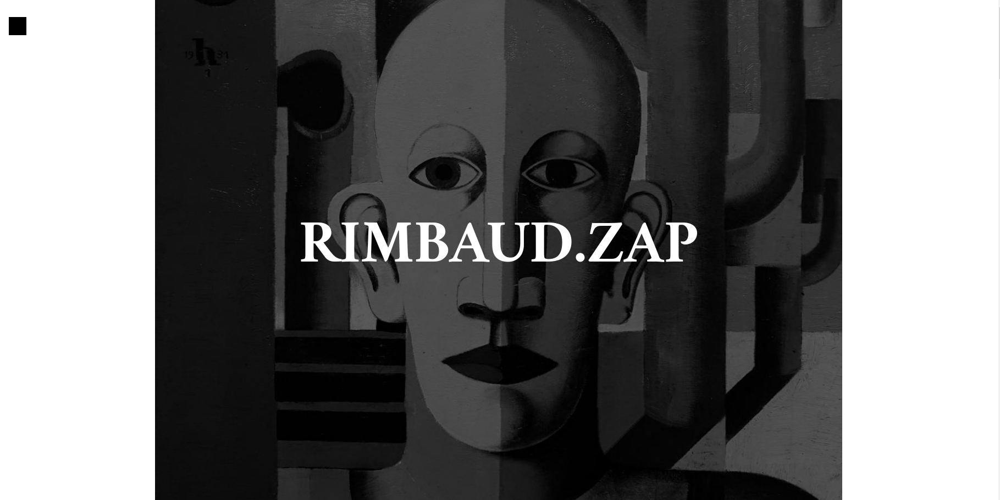<!-- .element: style="width:45%;float:right;margin-right:-1em;" -->

===
Je prendrai pour exemple un peu plus concret le projet de ZAP (pour zone autonome à poétiser) Rimbaud. En mai 2020, soit au moment où beaucoup d'entre nous étaient encore confinés, dans le cadre de l’Open Publishing Fest, Abrüpt a lancé un appel afin, je cite "d’installer un squat dans le monument Rimbaud et d’y lancer une réécriture frénétique et collective de sa *Saison en enfer*".

Le principe était simple : réécrire, de manière collective, par-dessus le texte de Rimbaud pour créer un nouvel objet littéraire.

§§§§§§§§§§§§§§§§§§§§§§§§§§§§§§§§§§§§§§§§§§§§§
<!-- .slide: data-background-image="img/ZAP.png" data-background-size="contain" -->

===
Quelques règles de base (à vrai dire très peu):
- renoncer à son autorité : le résultat de serait pas signé et déposé dans le domaine public volontaire
- n'utiliser que des outils libres (dont gitlab) à l'image de ce renoncement à la propriété intellectuelle
- adhérer à la dimension festive de l'événement, car oui, il y avait de quoi se réjouir alors que le 1er confinement s'achevait à peine, et de manière très inégale, dans le monde entier, cet événement a donné l'occasion à toute une série de contributeurs francophones (de France, de Suisse, du Québec), de se retrouver et de faire corps.

§§§§§§§§§§§§§§§§§§§§§§§§§§§§§§§§§§§§§§§§§§§§§

>Toute création est une recréation, toute invention est un vol.
>Ensemble, créons, recréons, inventons et volons.
>Ensemble, nous sommes Arthur Rimbaud.
>Ensemble, nous sommes absolument modernes.

<!-- .element: style="width:45%;float:left;margin-left:-1em; font-size:1.4rem; text-align:justify" -->

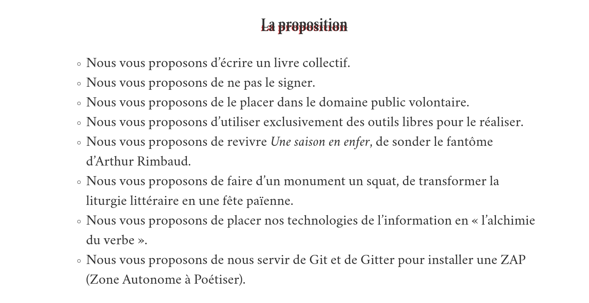<!-- .element: style="width:45%;float:right;margin-right:-1em;" -->

§§§§§§§§§§§§§§§§§§§§§§§§§§§§§§§§§§§§§§§§§§§§§
<!-- .slide: data-background-image="img/zap_branch.png" data-background-size="contain" -->

===

Mode de fonctionnement : les participants clonaient le dépôt chez eux, proposaient des réécritures à partir d'une branche personnelle puis faisaient un merge request avec la branche master maintenue par les éditeurs.

cette solution, un peu complexe techniquement, n'a pas toujours été facile à mener.

§§§§§§§§§§§§§§§§§§§§§§§§§§§§§§§§§§§§§§§§§§§§§
<!-- .slide: data-background-image="img/zapRimbaudGitIssues.png" data-background-size="contain" -->

===
D'autres espaces ont donc été investis, notamment les espaces conversationnels traditionnels de Gitlab : celui où l'on poste habituellement des issues (cad où des utilisateurs font des réclamations ou avertissent de certains bugs) a été hacké pour poster des demandes d'ajout de texte. Ici Frank Queyraud.

§§§§§§§§§§§§§§§§§§§§§§§§§§§§§§§§§§§§§§§§§§§§§
<!-- .slide: data-background-image="img/Zap1.png" data-background-size="contain" -->

===

Parallèlement, l'espace de discussion Gitter (qui est le système de chat spécialement conçu pour les développeurs de Gitlab ou Github) a été investi par les participants, pour discuter du projet en cours, résoudre les problèmes éventuels.

§§§§§§§§§§§§§§§§§§§§§§§§§§§§§§§§§§§§§§§§§§§§§
<!-- .slide: data-background-image="img/zapcompare.png" data-background-size="contain" -->

===

Sur le dépôt Git, la fonction de comparaison des fichiers permet de suivre le hack progressif du texte de rimbaud.

§§§§§§§§§§§§§§§§§§§§§§§§§§§§§§§§§§§§§§§§§§§§§
<!-- .slide: data-background-image="img/zapfinal1.png" data-background-size="contain" -->

===
Évidemment, ce n'est pas le résultat final souhaité. Les éditeurs ont mis en place un site statique avec une CSS et des scripts pour visualiser de manière un peu plus "jolie" ce palimpseste. Tout ce code est lui aussi hébergé sur le dépôt et peut être réutilisé par d'autres.

§§§§§§§§§§§§§§§§§§§§§§§§§§§§§§§§§§§§§§§§§§§§§
<!-- .slide: data-background-image="img/zapfinal2.png" data-background-size="contain" -->

§§§§§§§§§§§§§§§§§§§§§§§§§§§§§§§§§§§§§§§§§§§§§
<!-- .slide: data-background-image="img/zapfinal3.png" data-background-size="contain" -->

§§§§§§§§§§§§§§§§§§§§§§§§§§§§§§§§§§§§§§§§§§§§§
<!-- .slide: data-background-image="img/zapfinal4.png" data-background-size="contain" -->

===
Une publication imprimée du projet a été publiée il y a un an. Pour le moment, une version livresque DIY du texte de Rimbaud a été mis à disposition par abrupt.

§§§§§§§§§§§§§§§§§§§§§§§§§§§§§§§§§§§§§§§§§§§§§
<!-- .slide: data-background-image="img/blandineVolochot.png" data-background-size="contain" -->
<!-- .slide: class="hover"-->

### Qu'est-ce qui _git_ dans la gittérature ?
* Les pratiques « non littéraires » seraient-elles l’avenir de la littérature ?
* De quoi la gittérature est-elle le _NON_ ? Désessentialisation, défétichisation, déspécification...
* Plateforme éditoriale ou d'éditorialisation ?

<!-- .element: style="width:45%;float:left;margin-left:-1em; font-size:1.4rem; text-align:justify" -->

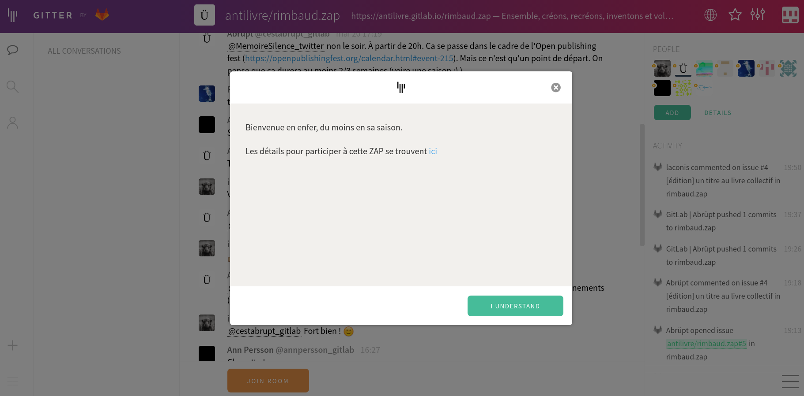<!-- .element: style="width:45%;float:right;margin-right:-1em;" -->

===

J'achève ici une présentation qui me donne l'impression de survoler un terrain potentiellement très riche. Aussi, je ne me sens pas vraiment à même de conclure, je préfère soulever quelques pistes en attendant vos commentaires et peut-être vos réponses, en espérant poursuivre ce chantier théorique que j'ai eu le plaisir de creuser grâce à cette journée.

1. Les pratiques « non littéraires » seraient-elles l’avenir de la littérature ?

Anaïs a parlé plus tôt de paralittérature, je vous ai quant à moi présenté le paradigme du hack à travers une plateforme d'écriture... C'est de toute manière le propre de cette journée de montrer combien la littérature "déborde" : elle déborde le livre, les institutions, les genres. Comme on le voit avec la gittérature, ce débordement s'appuie non seulement sur des outils d'écriture non-littéraires, mais aussi sur les phisolophies qui vont avec cet outil.

2. De quoi le contemporain est-il le _non_ ?
Avec la gittérature, ce sont des concepts traditionnels qui sont amenés à subir de radicales transformation. Fin de l'essentialisation. La gittérature s'inscrit en cela en plein dans le paradigme contemporain (cf. Mougin) : ce paradigme peut se définir, justement, comme un large processus de dé-définition de l’art comme de la littérature. Avec pour conséquence de reconsidérer les critères d’attribution de l’« artistique » ou du « littéraire », et d’ouvrir à de plus larges corpus. Il existe un tournant médiatique de la littérature (désormais intermédiale, transmédiale, etc.), qui engage à reconsidérer la suprématie du livre.

3. Plateforme éditoriale ou d'éditorialisation ?
Je voudrais insister sur l'effort fourni par Abrüpt pour "ouvrir" les écritures numériques : ouvrir le texte (avec la volonté que les auteurs versent leur texte dans le "domaine public volontaire"), ouvrir les protocoles, ouvrir leurs propres technologies éditoriales. Chez Abrüpt, ce n'est pas seulement l'écriture littéraire qui est libre, c'est le format même du livre : le "livre libre". Le code informatique des livres dynamique, les scripts permettant de générer les livres sont à disposition de tous. À nous de nous réapproprier ces outils et tout ce code, à nous de le *hacker*.

Évidemment, un défi se pose immédiatement, et c'est là peut-être la limite des expériences Abrüpt qui relèvent souvent de la "preuve de concept": combien de lecteurs ont les moyens de s'approprier ces plateformes ? Le contre-modèle Wattpad reste difficile à prendre en mains pour l'utilisateur lambda, et l'utopie du partage, du collectif, du libre prônée par les éditeurs Abrüpt, n'est pas nécessairement synonyme d'une véritable démocratisation. Les deux plateformes me semblent cela dit partager bcp de points communs, et oeuvrer chacune à leur manière à une redéfinition de concepts institutionnels, notamment en termes d'autorité.

DE fait, Gitlab apparaît ici davantage comme une plateforme d'éditorialisation qu'une plateforme éditoriale. Abrupt, c'est la maison d'édition qui aura impliqué ses lecteur dans l'écriture-éditorialisation, comme on l'a vu avec la ZAP Rimbaud.

§§§§§§§§§§§§§§§§§§§§§§§§§§§§§§§§§§§§§§§§§§§§§

### Vers une normalisation ?

#### Le ssp au Louvre

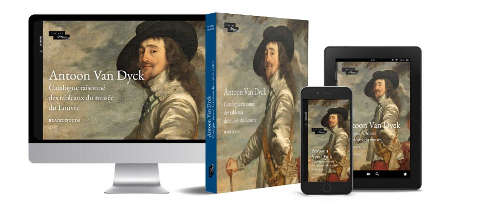<!-- .element: style="width=400px" -->

§§§§§§§§§§§§§§§§§§§§§§§§§§§§§§§§§§§§§§§§§§§§§

* Un projet institutionnel
* Seul l'ouvrage imprimé est payant (coût du papier et de l'impression)
* Un catalogue d'exposition... finalement très traditionnel

<!-- .element: style="width:45%;float:left;margin-left:-1em; font-size:1.4rem; text-align:justify" -->

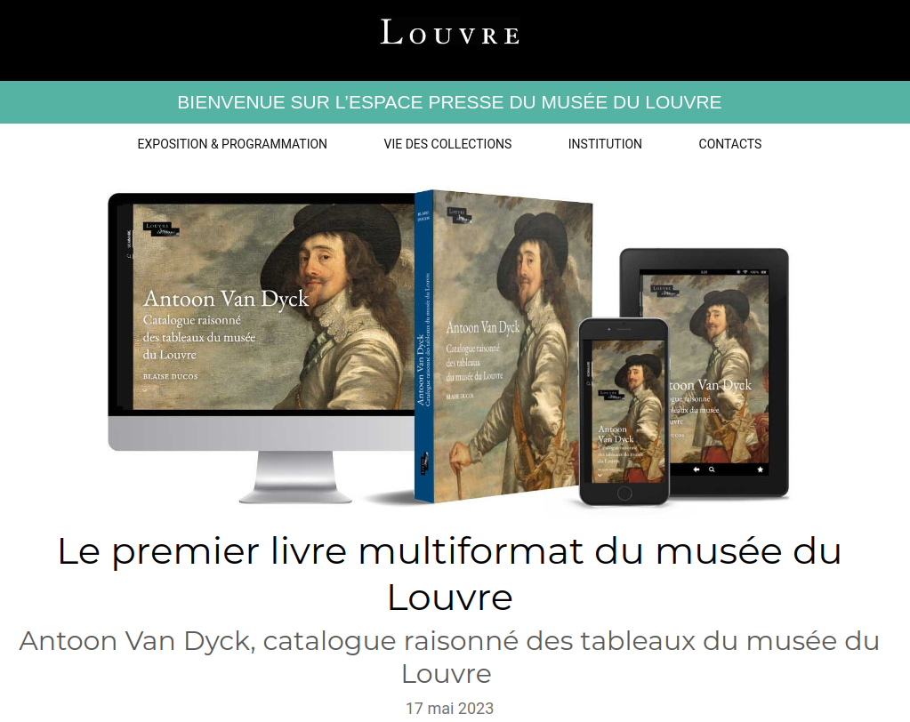<!-- .element: style="width:45%;float:right;margin-right:-1em;" -->

§§§§§§§§§§§§§§§§§§§§§§§§§§§§§§§§§§§§§§§§§§§§§

## Conclusion :
De l'édition à l'éditorialisation, la fonction éditoriale est amenée à se repenser entièrement. Dans les modèles de publication (*rendre public*) numériques, le livre imprimé n'est pas nécessairement exclu, bien au contraire, mais il sera reconsidéré comme un **moment** du texte : moment de cristallisation d'une pensée, d'une oeuvre. Ainsi, sur le web, nous pouvons repérer un déplacement de la littérature qui, d'une attention entièrement tournée vers l'oeuvre, se concentre désormais vers l'écriture (comme une performance). Éditorialiser, en ce sens, engage une perte de contrôle des instances traditionnelles, redistribuées notamment à l'auteur, mais aussi à l'usager, au lecteur. Ainsi, le modèle de publication ("rendre public") du moment contemporain de la littérature offre probablement l'occasion de repenser le rôle de l'éditeur. Selon Laurent Beccaria (Les Arènes) « Le numérique a remis l'éditeur face à son métier. Il l'oblige à se concentrer sur le travail éditorial ». Là où l'auto-édition numérique fait potentiellement courir le risque de donner du pouvoir à de nouveaux monopoles, de nouveaux modèles éditoriaux voient le jour. S'ensuit une situation paradoxale où, tandis que le marché du livre en France a tendance à s'éroder, jamais autant de « petites » maisons d'édition n'ont vu le jour. Les modèles économiques sont à réinventer, sur la base de ce moment contemporain de la littérature mis en évidence par Lionel Ruffel, en collaboration avec des institutions de toute ordre (bibliothèques, résidences, institutions culturelles, etc.), et en prenant en compte la diversité du métier d'écrivain. 

<!-- .element: style="font-size:1.4rem; text-align:justify" -->
