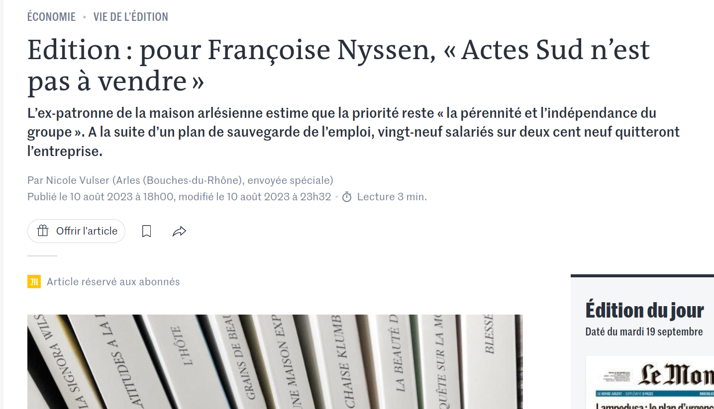

#### 2023. Actes Sud en difficultés

>Actes Sud traverse une passe difficile. La direction de la maison d’édition arlésienne indépendante a dû se résoudre, en mars, à recourir à un plan de sauvegarde de l’emploi. Sur un effectif de deux cent neuf salariés en CDI, trente postes sont supprimés. Parmi les investissements à venir figurent les référencements des ouvrages sur Google ou TikTok, mais aussi le développement du livre audio. « Notre goût pour toujours dénicher de nouveaux auteurs reste intact », promet Anne-Sylvie Bameule. La littérature constitue toujours « 68 % de nos ventes, grâce à la collection de livres de poche Babel », ajoute-t-elle. [Le Monde]

<!-- .element: style="width:45%;float:left;margin-left:-1em; font-size:1.4rem; text-align:justify" -->

<!-- .element: style="width:45%;float:right;margin-right:-1em;" -->

===

>Actes Sud traverse une passe difficile. La direction de la maison d’édition arlésienne indépendante a dû se résoudre, en mars, à recourir à un plan de sauvegarde de l’emploi. Sur un effectif de deux cent neuf salariés en CDI, trente postes sont supprimés

>« Nous sommes confrontées à une crise de croissance, pas à une crise économique »,

>Le chiffre d’affaires s’est étiolé à 57 millions d’euros (contre 61,8 millions en 2021) et l’entreprise est devenue déficitaire, malgré la vente des locaux parisiens du 6e arrondissement. Le contexte plus difficile, lié à la hausse du prix du papier – de 50 % à 100 %, selon sa qualité – et des coûts de l’énergie, s’est lourdement fait sentir.

>Parmi les investissements à venir figurent les référencements des ouvrages sur Google ou TikTok, mais aussi le développement du livre audio. « Notre goût pour toujours dénicher de nouveaux auteurs reste intact », promet Anne-Sylvie Bameule. La littérature constitue toujours « 68 % de nos ventes, grâce à la collection de livres de poche Babel », ajoute-t-elle.

