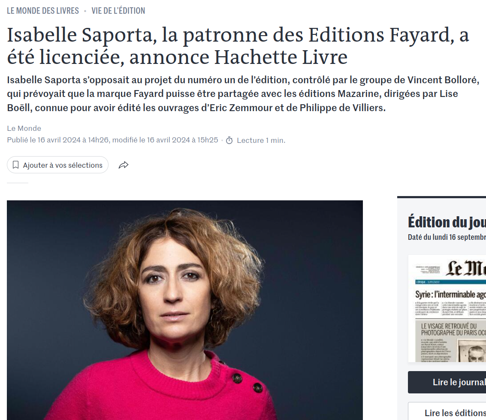
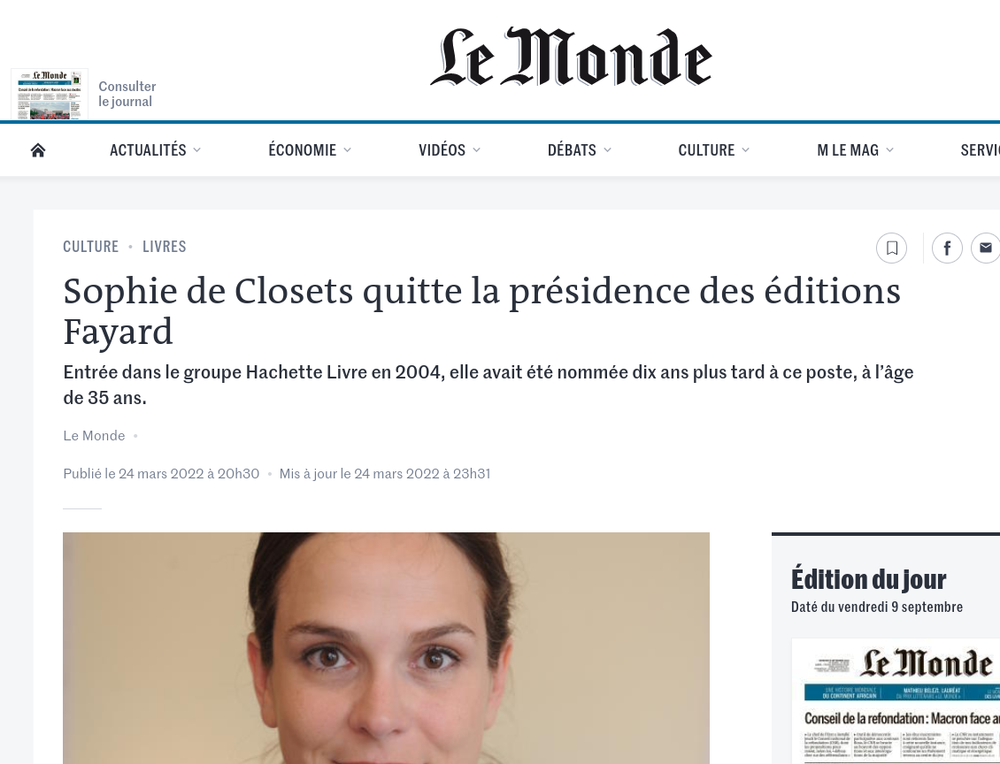
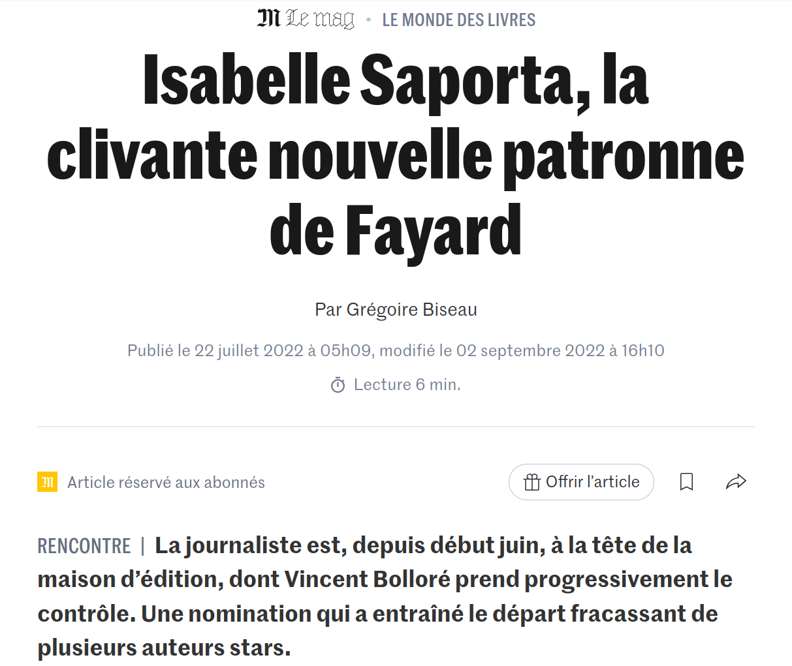

#### 2023. Actes Sud en difficultés

>Actes Sud traverse une passe difficile. La direction de la maison d’édition arlésienne indépendante a dû se résoudre, en mars, à recourir à un plan de sauvegarde de l’emploi. Sur un effectif de deux cent neuf salariés en CDI, trente postes sont supprimés. Parmi les investissements à venir figurent les référencements des ouvrages sur Google ou TikTok, mais aussi le développement du livre audio. « Notre goût pour toujours dénicher de nouveaux auteurs reste intact », promet Anne-Sylvie Bameule. La littérature constitue toujours « 68 % de nos ventes, grâce à la collection de livres de poche Babel », ajoute-t-elle. [Le Monde]

<!-- .element: style="width:45%;float:left;margin-left:-1em; font-size:1.4rem; text-align:justify" -->

<!-- .element: style="width:45%;float:right;margin-right:-1em;" -->

===

>Actes Sud traverse une passe difficile. La direction de la maison d’édition arlésienne indépendante a dû se résoudre, en mars, à recourir à un plan de sauvegarde de l’emploi. Sur un effectif de deux cent neuf salariés en CDI, trente postes sont supprimés

>« Nous sommes confrontées à une crise de croissance, pas à une crise économique »,

>Le chiffre d’affaires s’est étiolé à 57 millions d’euros (contre 61,8 millions en 2021) et l’entreprise est devenue déficitaire, malgré la vente des locaux parisiens du 6e arrondissement. Le contexte plus difficile, lié à la hausse du prix du papier – de 50 % à 100 %, selon sa qualité – et des coûts de l’énergie, s’est lourdement fait sentir.

>Parmi les investissements à venir figurent les référencements des ouvrages sur Google ou TikTok, mais aussi le développement du livre audio. « Notre goût pour toujours dénicher de nouveaux auteurs reste intact », promet Anne-Sylvie Bameule. La littérature constitue toujours « 68 % de nos ventes, grâce à la collection de livres de poche Babel », ajoute-t-elle.

§§§§§§§§§§§§§§§§§§§§§§§§§§§§§§§§§§§§§§§§§§§§§

#### Avril 2024 : licenciement d'Isabelle Saporta

>Déstabilisée, Isabelle Saporta a refusé tout compromis avec [Lise Boëll] l’ex-éditrice d’Eric Zemmour et s’est opposée à toute collaboration avec elle. En désaccord stratégique avec son actionnaire, qui veut manifestement donner une nouvelle ligne politique à une autre maison d’édition historique, Isabelle Saporta est remerciée.

<!-- .element: style="width:45%;float:left;margin-left:-1em; font-size:1.4rem; text-align:justify" -->

<!-- .element: style="width:45%;float:right;margin-right:-1em;" -->

===

L'année a été marquée par le licenciement de la PDG de Fayard, Isabelle Saporta.

Licenciée pour avoir refusé de céder un accord de licence permettant l’utilisation de la marque de la maison au profit de l’ancienne éditrice d’Eric Zemmour, Lise Boëll.

Marquée très à droite, cette dernière a également publié des ouvrages de Philippe de Villiers et, selon L’Obs, s’apprête à signer avec le président du Rassemblement national, Jordan Bardella. Lise Boëll a été nommée directrice générale des éditions Mazarine, une filiale créée par Fayard en 1979, le 22 février. Mais elle souhaitait que ses auteurs puissent signer sous la marque Mazarine/Fayard, profitant ainsi de la renommée de la maison historique.

Comment Lise Boëll a-t-elle pu obtenir la tête de Saporta, pourtant directrice d,une grande maison comme Fayard ? Parce qu'elle avait le soutient de Vincent Bolloré, qui a racheté en 2023 le groupe Hachette, dont Fayard fait partie... 

§§§§§§§§§§§§§§§§§§§§§§§§§§§§§§§§§§§§§§§§§§§§§
<!-- .slide: data-background-image="img/" data-background-size="contain" -->

#### 2022. Licenciement de Sophie de Closets

<!-- .element: style="width:45%;float:left;margin-right:-1em;" -->

<!-- .element: style="width:45%;float:right;margin-right:-1em;" -->

===

Saporta victime de la droitisation de l'édition, et de la concentration éditoriale ? N'allons peut-être pas si vite en besogne. 

Il y a deux ans, Le 24 mai 2022, Sophie de Closets, présidente-directrice générale des éditions Fayard, quittait son poste après avoir subit notamment des pressions de la part d'Hommes politiques dont Sarkozy, après la publication de Gérard Davet et Fabrice Lhomme, sur l'affaire Fillon.

À l'époque, ce n'est pas Vincent Bolloré qui dirige Hachette, c'est encore Arnaud Lagardère, très proche de Nicolas Sarkozi. Selon les médias, et les principaux intéressés, c'est bien Nicolas Sarkozy qui exige le départ de Sophie de Closets, pour placer Isabelle Saporta, qui n'était alors "que" directrice de collection : statut tout à fait honnorable, mais relativement peu suffisant pour devenir PDG d'une aussi grande maison.

Cependant voilà : Hachette Livre est passé à la fin de 2023 sous le contrôle de Vivendi, groupe du milliardaire Vincent Bolloré, accusé par de nombreux rivaux de vouloir se servir de ses maisons d’édition pour promouvoir un projet politique très à droite -- encore plus à droite que la droite de NS. C'est dans ce nouveaux contexte que s'est joué le départ d'Isabelle Saporta, 2 ans tout juste après son arrivée à la tête de la maison d'édition.

§§§§§§§§§§§§§§§§§§§§§§§§§§§§§§§§§§§§§§§§§§§§§

#### 2022. La rumeur d'une fusion Éditis Hachette : le stade ultime de la concentration éditoriale ?

>La diversité, c’est la substance même de l’édition ; et c’est bien en son nom que la loi instituant un prix unique du livre a été votée à l’unanimité de la Chambre en 1981. [Antoine Gallimard]

>Sur le marché du livre, ce mélange des genres peut agir comme un cyclone. Avec son pouvoir d’attraction, le groupe de Vincent Bolloré pourrait assécher les terres de l’édition, en s’accaparant des droits à des prix d’acquisition hors marché. C’est un des piliers de notre culture du livre qui pourrait alors être atteint : la péréquation économique entre des livres de fonds et des livres d’exploitation rapide, laquelle permet le financement de la création dans toute sa diversité. [Antoine Gallimard]

<!-- .element: style="width:45%;float:left;margin-left:-1em; font-size:1.2rem; text-align:justify" -->

<!-- .element: style="width:45%;float:right;margin-right:-1em;" -->

===

Ce qui se passe chez Fayard est le résultat d'une tension croissante entre les deux grands groupes éditoriaux français : Editis & Hachette. 

Fruit de la concentration éditoriale Éditis et Hachette sont des groupes qui relevaient jusqu'en 2023 de deux entités distinctes : 
- Editis était sous la houlette de Vivendi, propriété de Bolloré
- Hachette était détenu par Lagardère.

De quoi parle-t-on quand il est question de "Groupe" ? Du fruit de la concentration éditoriale [concept : la concentration éditoriale désigne un processus au cours duquel quelques individus ou organisations accroissent progressivement leur contrôle sur les médias de masse (journaux, magazines, livres, télévisions, radios, sites internet, etc.), sur l'industrie culturelle ainsi que sur les groupes de communication (entreprise de sondages, téléphonie mobile, internet, etc.) et par là, sur les moyens de produire et de diffuser de l'information (au sens large) et des savoirs.] Dans le monde de l'édition les premiers grands groupes éditoriaux = Gallimard, devenu à la fin du XXe siècle Madrigall.

La concentration éditoriale est un phénomène très ancien, les historiens du livre ont démontré qu'elle commence dès le milieu du XIXe siècle, en pleine industrialisation de l'édition. Ce qu'il faut comprendre, c'est que l'émergence de l'édition comme métier ou plus largement ensemble de métiers, va de paire avec une concentration éditoriale progressive. 

Les effets de la concentration sont connus et dénoncés depuis plus d'un-demi siècle :
>Il y a un lien direct entre concentration, exigence de forte rentabilité et développement du livre-marketing. Quand une maison est rachetée par un groupe multinational, elle ne dispose d’une certaine marge d’autonomie que si ses résultats financiers sont conformes aux objectifs fixés par le groupe. Si cet objectif n’est pas tenu, la maison d’édition voit son budget sévèrement contrôlé et se trouve rapidement dépendante des autorisations de budget pour toute décision éditoriale.

https://www.acrimed.org/La-concentration-dans-l-edition-et-ses-effets

Cela étant dit, ce qui change aujourd'hui, c'est l'influence politique des groupes éditoriaux. Bien qu'habituelles, ces convergences médiatiques font aujourd'hui débat, notamment concernant les intentions et poids politiques que ces groupes peuvent avoir. Cette dimmension politique est ce qui inquiète fortement les professionnels du secteurs éditorial dès lors qu'il est question de Vincent Bolloré dont le nom est associé de plus en plus à des courants de pensée d'extrême droite.

Inutile d'expliquer pourquoi, lorsque Vincent Bolloré a annoncé sa volonté de racheter Hachette, le secteur de l'édition tout entier s'est ému de la nouvelle, à l'image d'ANtoine Gallimard.

§§§§§§§§§§§§§§§§§§§§§§§§§§§§§§§§§§§§§§§§§§§§§

#### 2023-24. Le numéro un et le numéro deux de l'édition français changent de mains

<!-- .element: style="width:45%;float:left;margin-right:-1em;" -->

<!-- .element: style="width:45%;float:right;margin-right:-1em;" -->

===

Les éditeurs français se sont bcp mobilisés, et finalement la commission européenne, qui effectue tout de même un contrôle des rachats de médias, a autorisé Bolloré à racheter Hachette à condition de céder Editis. 

Depuis l'année dernière, 2023, Hachette est la propriété de Bolloré (d'où les tensions avec Saporta) et Editis est donc désormais sous la houlette de Daniel Kretinsky,  avocat, homme d'affaires et milliardaire tchèque : propriétaire des magazines Elle, Télé 7 Jours, Marianne, France Dimanche, Ici Paris, Usbek & Rica et Franc-Tireur. Par ailleurs entre octobre 2018 et septembre 2023, il est un actionnaire majeur du groupe Le Monde...

§§§§§§§§§§§§§§§§§§§§§§§§§§§§§§§§§§§§§§§§§§§§§

  <iframe src="https://geo.dailymotion.com/player.html?video=x8txosg"
    style="width:100%; height:100%; position:absolute; left:0px; top:0px; overflow:hidden; border:none;"
    allowfullscreen
    title="Dailymotion Video Player"
    allow="web-share">
  </iframe>

