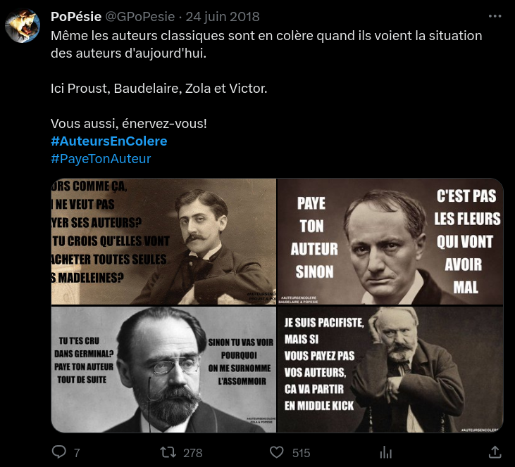
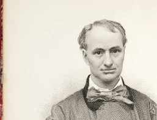
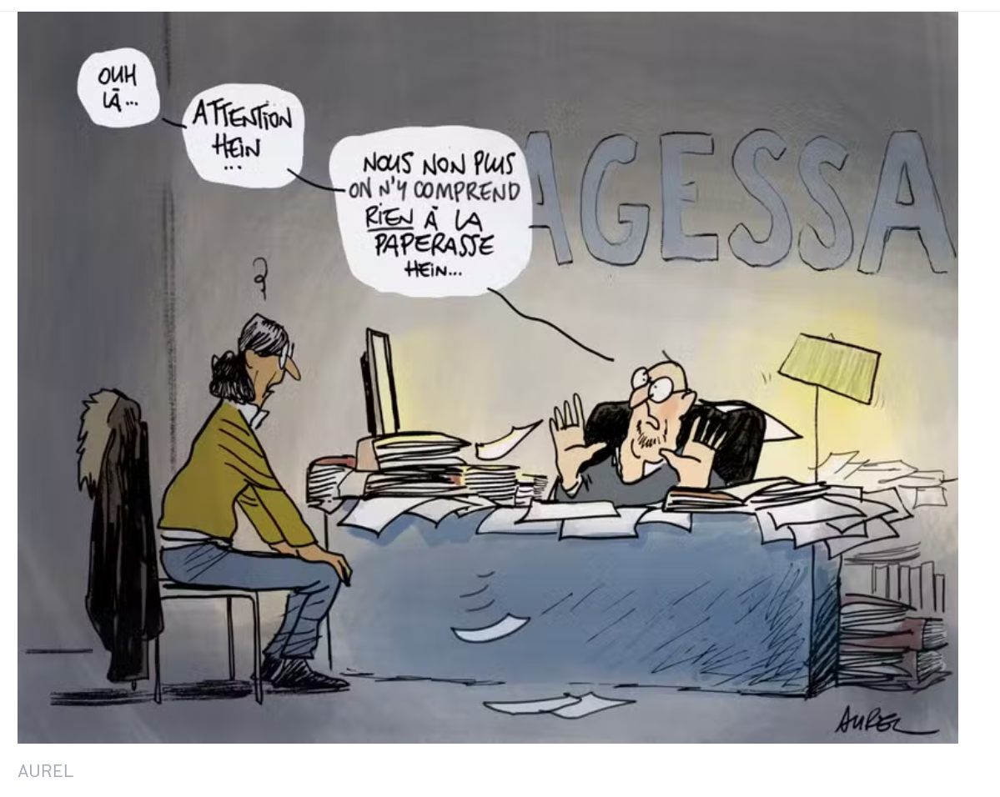
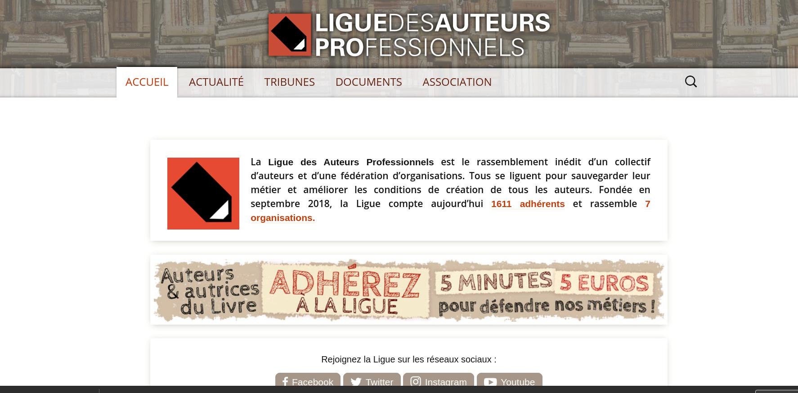
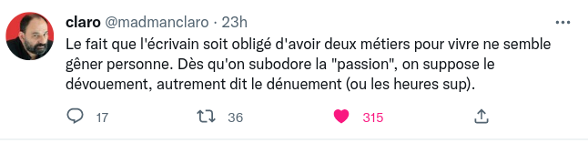

### Faut-il repenser le statut de l'auteur ? 

#### Droit d'auteur, déconstruction, professionnalisation & précarisation des auteurs-créateurs au XXIe siècle

<!-- .element: style="width:400px" -->

===

Une campagne sur les réseaux sociaux et un mème : Paye ton auteur. C'était en 2018, et cela a marqué le début d'un conflit qui mine les relations entre les grands éditeurs et les auteurs depuis lors. 

Cette séance a vocation à faire le pont entre les considérations des dernières semaines sur la gouvernance et les modèles éco des éditeurs, et le "problème" de l'auto-édition aujourd'hui. 

Une petite anecdote pour mettre en bouche.

§§§§§§§§§§§§§§§§§§§§§§§§§§§§§§§§§§§§§§§§§§§§§

### La menace de la "dés-autorisation"...

===
On peut avoir été auteur et ne plus l'être. Du moins, administrativement. C'est la mésaventure qui est arrivée à François Bon en 2018.

§§§§§§§§§§§§§§§§§§§§§§§§§§§§§§§§§§§§§§§§§§§§§
<!-- .slide: data-background-image="img/agessa.jpg" data-background-size="contain" -->

source : Tiers livre, François Bon
<!-- .element: class="source" -->

§§§§§§§§§§§§§§§§§§§§§§§§§§§§§§§§§§§§§§§§§§§§§

>Zut alors : privé d’« assiette sociale ». J’avais une assiette sociale sans le savoir et je n’en ai plus.
Dingue : pour la 1ère fois depuis... 1986, JE NE SUIS PLUS auteur ni quedalle... bon, j’ai du vieux cuir tanné – et quelques états de service derrière moi, mais ça montre bien :
- 1, comment la précarisation des auteur.e.s touche globalement et massivement désormais TOUTE la profession ;
- 2, que le régime démerde ça va être massivement la règle pour tou.te.s les d’jeuns qui débarquent dans le métier ;

>Francois Bon, [Tiers Livre](http://www.tierslivre.net/spip/spip.php?article4777)

<!-- .element: style="font-size:1.4rem; text-align:justify" -->

§§§§§§§§§§§§§§§§§§§§§§§§§§§§§§§§§§§§§§§§§§§§§

>Psychologiquement, pour moi, c’est la première fois depuis 30 ans, et depuis 20 ans de web, ce sont mes activités numériques indépendantes (y compris la vente de mes livres Tiers Livre Editeur, qui payent frais de site et matos, mais sur lesquels je ne me rémunère pas en D.A.) qui deviennent mon activité principale.

<!-- .element: style="font-size:1.4rem; text-align:justify" -->

>Francois Bon, [Tiers Livre](http://www.tierslivre.net/spip/spip.php?article4777)

<!-- .element: style="font-size:1.4rem; text-align:right" -->

§§§§§§§§§§§§§§§§§§§§§§§§§§§§§§§§§§§§§§§§§§§§§
<!-- .slide: data-background-image="img/cnl_08.jpg" data-background-size="contain" -->

source : Tiers livre, François Bon
<!-- .element: class="source" -->

§§§§§§§§§§§§§§§§§§§§§§§§§§§§§§§§§§§§§§§§§§§§§

Mais au fait, un auteur, c'est quoi ?

===

Un auteur, c'est quoi ? L'auteur, c'est d'abord un concept. En tant que concept, l'auteur a donc répondu à des définitions variées en fonction des différentes périodes historiques, mais également des ères géographiques et culturelles. Dans le domaine français, l'auteur est particulièrement tiraillé entre une définition institutionnelle & juridique (il est celui qui tombe sous le coup du droit d'auteur), et une entité bénéficiant d'une valeur symbolique particulière : l'auteur, c'est aussi celui qui a un statut d'artiste et qui, en ce sens, va bénéficier d'une certaine forme de sacralisation. 

En tant qu'étudiants en études littéraires, vous avez une connaissance de l'auteur qui est avant tout  historique (vous étudiez de "grands auteurs) et théorique (avec un peu de chance, vous avez lu Barthes et Foucault). 

§§§§§§§§§§§§§§§§§§§§§§§§§§§§§§§§§§§§§§§§§§§§§

#### Une définition institutionnelle et juridique

Le concept moderne d’auteur est le fruit du processus qui permet la professionnalisation des auteurs à la base du modèle économique de l’édition imprimée. En d’autres termes, la fonction fondamentale de l’auctorialité est la propriété. Cela signifie que la notion d’auteur n’a rien d’absolu et de nécessaire, elle est historique et, en outre, de formation relativement récente.

<!-- .element: style="font-size:1.4rem;text-align:justify;" -->

===

Le concept moderne d’auteur est le fruit du processus qui permet la professionnalisation des auteurs à la base du modèle économique de l’édition imprimée. En d’autres termes, la fonction fondamentale de l’auctorialité est la propriété. Cela signifie que la notion d’auteur n’a rien d’absolu et de nécessaire, elle est historique et, en outre, de formation relativement récente.

Le XVIIIe siècle est, en matière de librairie, le temps de la législation.
À cette époque, les privilèges sont renouvelés régulièrement et restent parfois durant plus d'un siècle aux mains d'une même famille de libraires :
- celle-ci réalise souvent des bénéfices importants,
- tandis que les descendants de l'auteur, à qui l'œuvre en question a été achetée, se trouvent dans la misère.

Cette situation, qui fait de plus en plus débat, va favoriser la mise en place d’un cadre législatif qui va définir les principaux acteurs de l’édition moderne, en institutionnalisant par des lois les pratiques éditoriales qui étaient, jusque là, génératrices de fortes inégalités.

L’idée moderne d’auteur est donc née au début du XVIIIe siècle pour des raisons essentiellement économiques : il fallait un modèle économique pour l’édition papier en train de se généraliser. C’est à partir de ce besoin qu’une série d’ajustements légaux ont été mis en place pour parvenir à l’une des premières lois sur le copyright au Royaume Uni, Le statut d’Anne, en 1710.

§§§§§§§§§§§§§§§§§§§§§§§§§§§§§§§§§§§§§§§§§§§§§

#### Le statut d'Anne (1710), première loi sur le copyright

===

- En Angleterre *Le Statut d’Anne (1710) - Copyright*

Depuis le premier "Statut d'Anne", en 1710, le droit d'auteur est conçu comme un droit d'équilibre entre les intérêts de la société et ceux des auteurs. Ces derniers disposent du monopole d'exploitation de leurs oeuvres, qui ne peuvent être éditées ou représentées sans leur consentement.
Concrètement, l’originalité du statut repose sur deux points :
•	Le droit d’exclusivité (le copyright), défini comme « la seule liberté d’imprimer et réimprimer un livre», était désormais formellement rattaché à l’auteur (vs le libraire-imprimeur).
•	mais cette exclusivité est à durée limitée. 

*Le statut créait donc un « domaine public », avec comme conséquence qu’un ensemble de textes (et de livres) ne pourraient plus être soumis à des privilèges exclusifs d’impression.

Comme le révèle l’expression « composer des livres utiles » - copyright, la loi est tournée du côté de l’exploitation de l’oeuvre. Elle défend d’abord un droit de copier (qui est un droit d'exploitant) lié à l'œuvre elle-même.
Dans ce raisonnement, le texte est donc conçu comme une marchandise.

Le copyright est une protection qui se limite à la sphère stricte de l’œuvre, sans considérer d’attribut moral à l’auteur en relation avec son œuvre, sauf sa paternité ; ce n’est plus l’auteur proprement dit, mais l’ayant-droit qui détermine les modalités de l’utilisation d’une œuvre.

§§§§§§§§§§§§§§§§§§§§§§§§§§§§§§§§§§§§§§§§§§§§§

#### La déclinaison française du droit d'auteur

Inspiré par la situation anglaise, la France propose une série d'arrêts en 1777, pour revoir la législation : un auteur qui prendra lui-même son privilège et vendra son œuvre chez lui pourra transmettre à ses héritiers un droit perpétuel sur cette œuvre [**= droit patrimonial (exploitation économique)**]. Dans la foulée, une loi sur la propriété littéraire (1793) rend hommage au « génie » de l’homme de lettres [**= droit moral (« intégrité » de l’oeuvre)**]. C’est la naissance du Droit d’auteur à la française, source de bien des interprétations et des conflits.

<!-- .element: style="font-size:1.4rem;text-align:justify;" -->

===

- En France : *Arrêt de 1777- droit d’auteur*
Inspiré par la situation anglaise, la France propose une série d'arrêts en 1777, pour revoir la législation : un auteur qui prendra lui-même son privilège et vendra son œuvre chez lui pourra transmettre à ses héritiers un droit perpétuel sur cette œuvre (//système anglais). Dans la foulée, une loi sur la propriété littéraire (1793) rendait hommage au « génie » de l’homme de lettres. C’est la naissance du Droit d’auteur.

Cette double législation est complexe et aboutit à une notion d’auteur problématique puisque le droit d’auteur va recouvrir :
- droit patrimonial (exploitation économique)
- droit moral (« intégrité » de l’oeuvre)

C’est à dire qu’on insère avec ce droit moral (en fait très flou) un droit au respect de l’auteur, indépendant des droits patrimoniaux. Les droits moraux servent à protéger l’auteur en ce qui a trait au respect de l’intégrité de son œuvre et au respect de sa paternité sur son œuvre.   
(NB : Par la loi, les droits moraux ne peuvent pas être cédés, mais ils peuvent toutefois faire l’objet d’une renonciation par contrat. Il faut donc bien lire le contrat offert par l’éditeur afin de s’assurer que vous conserviez le respect de vos droits moraux).

Par opposition au système anglo-américain du copyright, qui privilégie le public, le code français, depuis les Lumières et la Révolution, avantage et sacralise l'auteur. Ce sont là deux conceptions rivales de la culture.

Le droit d’auteur et le copyright diffèrent notamment sur un point : la notion de droit moral, inaliénable, perpétuel et imprescriptible.
Dans le droit français, ce droit moral est constitutif de l’attachement du droit d’auteur à la personne de l’auteur plutôt qu’à l’œuvre : il reconnaît dans l’œuvre l’expression de la personne de l’auteur, et la protège donc au même titre.

§§§§§§§§§§§§§§§§§§§§§§§§§§§§§§§§§§§§§§§§§§§§§

Un droit soumis à interprétation

<!-- .element: style="width:400px" -->

===

Au nom de ce droit, bcp de procès: l’écrivain François Cérésa, qui avait rédigé, en 2001, la suite du célèbre roman donnant vie à Cosette dans "Cosette ou le temps des illusions" et "Marius ou le fugitif".
L’affaire remonte à 2001, à l’aube du bicentenaire du mastodonte de la littérature française. La maison d’édition Plon met au défi les plumes audacieuses de rédiger la suite des fameux "Misérables". La version de François Cérésa est retenue, et connaît, d’ailleurs, un succès mitigé. Dès sa publication, deux camps se profilent. L’un, mené par Pierre Hugo, arrière-arrière-petit-fils de l'écrivain romantique, crie à la *dénaturation* de l’œuvre en question. S’il admet les adaptations et autres produits dérivés issus du roman, il dénonce en revanche la "suite" en tant que telle. Et notamment le fait qu’elle ressuscite le policier Javert que Victor Hugo avait noyé dans la Seine. Pierre Hugo demande 4,5 millions de francs (690 000 euros) de dommages-intérêts.

Finalement, l’éditeur gagne au bout de 7 années de procès.
Le droit d’auteur comme droit moral se heurte, on le voit, à la liberté d’expression.

§§§§§§§§§§§§§§§§§§§§§§§§§§§§§§§§§§§§§§§§§§§§§

#### Une notion théorique : déconstruire l'auteur

<!-- .element: style="width:45%;float:left;margin-right:-1em;" -->

<!-- .element: style="width:45%;float:right;margin-right:-1em;" -->

===

Dans la seconde moitié du XXe, les post-structuralistes vont critiquer la notion culturelle d’auteur, avec deux critiques phares : Michel Foucault, dans le texte « Qu'est-ce qu'un auteur ? », texte d'une conférence donnée en février 1969 à la Société française de Philosophie, écrit peu après un article non moins fameux de Roland Barthes, au titre plus polémique, « La mort de l'auteur », publié en 1968.

Au départ, ces deux critiques étaient animés par un mouvement d'hostilité à l'égard de l'histoire littéraire, dont ils contestaient la domination dans les études littéraires à l'université. Ils s'opposaient à la littérature considérée en relation avec son auteur, ou comme expression de son auteur, suivant une doctrine résumée dans le titre courant des thèses de lettres : X, l'homme et l'oeuvre.

Ce que démontrent ces travaix, c'est que l’auteur est un personnage moderne produit par notre société dans la mesure où, au sortir du Moyen Âge, avec l'empirisme anglais, le rationalisme français, et la foi personnelle de la Réforme, elle a découvert le prestige de l'individu. Tel était le point de départ de la nouvelle critique : l'auteur n'est autre que le bourgeois, l'incarnation de l'idéologie capitaliste.

§§§§§§§§§§§§§§§§§§§§§§§§§§§§§§§§§§§§§§§§§§§§§

#### Contre l'individuation de l'auteur

>l'image de la littérature que l'on peut trouver dans la culture courante est tyranniquement centrée sur l'auteur, sa personne, son histoire, ses goûts, ses passions; 1a critique consiste encore, la plupart du temps, a dire que l'oeuvre de Baudelaire, c'est l'échec de l'homme Baudelaire.
celle de Van Gogh,c'est sa folie, celle de Tchaikowsky, c'est son vice : l' explication de l'oeuvre est toujours cherchée du côté de celle qui l'a produite, comme si, à travers l'allégorie plus ou moins transparente de la fiction, c'était toujours finalement la voix d'une seule et même personne, l'auteur, qui livrait sa "confidence".

<!-- .element: style="font-size:1.7rem; text-align:justify" -->

====

Dans son essai "La Mort de l'auteur", Barthes s'oppose à la méthode de lecture et de critique littéraire qui s'appuie sur telle facette de l'identité d'un auteur pour comprendre le sens de son œuvre. Dans ce type de critique, les expériences et les préjugés de l'auteur servent d'« explication » définitive au texte. Pour Barthes, cette méthode de lecture qui peut sembler ordonnée et pratique se révèle bâclée et imparfaite : « Donner un auteur à un texte », et lui attribuer une interprétation unique et correspondante, « c'est imposer une limite à ce texte ».

« La mort de l’auteur » = prôner une nouvelle approche des textes littéraires contre la position lansonienne.

Ce qu'il qualifie d'empire de l'auteur...

>l'image de la littérature que l'on peut trouver dans la culture courante est tyranniquement centrée sur l'auteur, sa personne, son histoire, ses goûts, ses passions; 1a critique consiste encore, la plupart du temps, a dire que l'oeuvre de Baudelaire, c'est l'échec de l'homme Baudelaire.
celle de Van Gogh,c'est sa folie, celle de Tchaikowsky, ,c'est son vice : l' explication de l'oeuvre est toujours cherchée du côté de celle qui l'a produite, comme si, à travers l'allégorie plus ou moins transparente de la fiction, c'était toujours finalement la voix d'une seule et même personne, l'auteur, qui livrait sa "confidence".

Barthes plaide pour que l'étude littéraire fasse abstraction de l'auteur, comme producteur du texte, et comme contrainte dans la lecture ; il proposait en revanche une analyse des discours fondée sur les modèles de la linguistique.   

On passe donc en plein des théories de l’intention à la théorie de la réception : ce qui compte, c’est comment nous, nous lisons le texte.

§§§§§§§§§§§§§§§§§§§§§§§§§§§§§§§§§§§§§§§§§§§§§

#### Foucault et la fonction auctoriale

>Le thème dont je voudrais partir, j'en emprunte la formulation à Beckett : « Qu'importe qui parle, quelqu'un a dit qu'importe qui parle. » Dans cette indifférence, je crois qu'il faut reconnaître un des principes éthiques fondamentaux de l'écriture contemporaine.

<!-- .element: style="font-size:1.7rem; text-align:justify" -->

===

Foucault part quant à lui d’une double critique :
- Critique de l’individuation propre à notre conception de l’auteur, qui est une simplification de l’histoire (littéraire, mais aussi en général) et une réorientation de celle-ci à des fins parfois peu nobles.
- Critique de la tendance classificatoire et sacralisante de l’oeuvre.

>Le thème dont je voudrais partir, j'en emprunte la formulation à Beckett : « Qu'importe qui parle, quelqu'un a dit qu'importe qui parle. » Dans cette indifférence, je crois qu'il faut reconnaître un des principes éthiques fondamentaux de l'écriture contemporaine.

Il proclame ainsi l'anonymat de la parole dans la littérature contemporaine (le sujet écrivant ne cesse de disparaître), et plaide pour l’autonomie des textes (qui n’est référée qu’à elle-même).

L'autorité, pour lui, sera donc d'abord et avant tout une fonction : c'est la théorie de la fonction auctoriale, qui ne renvoie pas à l’individu réel, mais à une figure de l’auteur dans le texte.

§§§§§§§§§§§§§§§§§§§§§§§§§§§§§§§§§§§§§§§§§§§§§ 

#### De l'écrivain à l'auteur : la fonction de légitimation de l'éditeur
Fondamentalement, c'est l'éditeur qui transforme un écrivain en auteur. 

===

Le statut de l'auteur -- et plus largement le droit d'auteur, sa rémunération, sa figure, etc. -- a toujours été occupé par des tensions, tensions avec l'éditeur.

J'aimerais revenir avec vous sur une série de tensions qui ont émaillé les relations entre les éditeurs et les auteurs-créateurs. 

§§§§§§§§§§§§§§§§§§§§§§§§§§§§§§§§§§§§§§§§§§§§§

#### Auteurs et éditeurs, la longue histoire d'une relation amour-haine

>J’irai prochainement vous voir. Mais comme il y a deux Michel, celui de son bureau, qui croit devoir être hérissé comme un sauvage, et celui du domicile personnel, qui est parfait homme du monde, vous me permettrez de choisir le second. Tout à vous. 

>Baudelaire à son éditeur Michel Lévy

<!-- .element: style="width:45%;float:left;margin-left:-1em; font-size:1.4rem; text-align:justify" -->

<!-- .element: style="width:35%;float:right;margin-right:-1em;" -->

===

Remise en perspective : les tensions entre auteur et éditeur sont consubstantielles à l'histoire de l'édition. 
Les conflits que nous traversons présentement sont importants, mais nous n'en sommes pas à la première crise entre éditeurs et écrivains, deux métiers qui ont profondément besoin l'un de l'autre, mais sont dans un espèce de rapport de concurrence. On adore se détester.

Exemple ici de Baudelaire, avec son éditeur Michel Lévy.

§§§§§§§§§§§§§§§§§§§§§§§§§§§§§§§§§§§§§§§§§§§§§

### Comprendre la colère des auteurs-créateurs 
* Des événements marquants : Réforme de l'AGESSA, salon des auteurs
* Des tendances de fond : Professionnalisation, précarisation

===

§§§§§§§§§§§§§§§§§§§§§§§§§§§§§§§§§§§§§§§§§§§§§

#### Crispations lors de la réforme de l'AGESSA

>L’auteur, en France, est la cinquième roue du carrosse bien huilé de l’édition. Une variable qu’on ajuste selon le bon ou le mauvais temps du marché.

>Guilhem Méric, "Les auteurs aussi ont attrapé la jaunisse", *Le Monde*, 12 décembre 2018

<!-- .element: style="width:45%;float:left;margin-left:-1em; font-size:1.4rem; text-align:justify" -->

<!-- .element: style="width:45%;float:right;margin-right:-1em;" -->

===

En 2018, la réforme de l'AGESSA (caisse de retraite des écrivains) a mis le feu aux poudres.

§§§§§§§§§§§§§§§§§§§§§§§§§§§§§§§§§§§§§§§§§§§§§

>On nous a fait l’aumône d’un statut bâtard, quelque part entre travailleur indépendant et profession libérale. Nos revenus tirés des droits d’auteur (entre 5 % et 12 % du prix hors taxe du livre, selon la spécialité et la notoriété de l’auteur) ne donnent droit à aucun congé et quasiment aucun droit au chômage ou à la retraite. Aujourd’hui, on nous invente, sans concertation aucune avec les organismes intéressés, une caisse de retraite censée remplacer l’Agessa, qu’il va falloir remplir en versant l’équivalent d’un salaire qu’aucun auteur ne touche, vu que nous ne sommes pas des salariés. A la différence de tous ceux que notre travail fait vivre dans la grande chaîne du livre, soit environ 80 000 personnes.

<!-- .element: style="font-size:1.6rem; text-align:justify" -->

>Guilhem Méric, "Les auteurs aussi ont attrapé la jaunisse", *Le Monde*, 12 décembre 2018

<!-- .element: style="font-size:1.4rem; text-align:right" -->

§§§§§§§§§§§§§§§§§§§§§§§§§§§§§§§§§§§§§§§§§§§§§

#### Le "scandale" de l'AGESSA  

* Des milliers d'"assujettis" privés de retraite, en raison d'un statut administratif flou

<!-- .element: style="font-size:1.4rem;" -->

<!-- .element: style="width:500px" -->

===

Les vélléités d'indépendance des écrivains contemporain doivent être remises dans le contexte d'un conflit qui est d'abord un conflit social. Au coeur de ce conclit = les graves dysfonctionnement de l’Agessa pendant quarante ans, qui ont pénalisé jusqu’à 186 000 auteurs créateurs : Des écrivains, compositeurs, réalisateurs, dramaturges, scénaristes, photographes, traducteurs, illustrateurs, graphistes ou même chorégraphes se sont vu amputer d’une partie de leur retraite. 

Pour bien comprendre, il y avait 2 statuts possibles à l'AGESSA : affilié, qd on atteint le seuil des 8 000 - 9 0000 euros de revenus, ou bien assujettis, quand on touche moins de 9 000 euros. En gros, qd vous êtes affilié (pour vous donner une idée cela représente 17 000 personnes en 2018) vous payez d’office vos cotisations retraite.

Le problème c'est que « Les artistes-auteurs anciennement assujettis à l’Agessa n’ont jamais été prélevés de cotisations à l’assurance-vieillesse depuis la création de ce régime ». C’était à eux d’effectuer les démarches – ce qui n’existe dans aucun autre régime en France. Fort peu l’ont fait. En violation du code de la Sécurité sociale, l’Agessa s’exonérait donc de sa mission légale de recensement et d’identification de ces artistes-auteurs et n’a jamais appelé de cotisation vieillesse de base entre 1978 et fin 2018. 

>Thierry Dumas, le directeur de l’Agessa depuis 2004 et également de la Maison des artistes (MDA) depuis 2011 – qui, elle, a effectué normalement son travail de recouvrement –, a été bien obligé de constater dans le « 20 heures » de France 2, jeudi 30 janvier, que « l’Agessa n’a pas fait son travail pendant quarante ans ». En plein débat sur les retraites, il se justifie au Monde : « L’Agessa a été conçue dès le début pour gérer uniquement les auteurs vivant de leur création, donc quelques milliers d’affiliés. Elle s’est trouvée sous-dimensionnée pour identifier une partie des artistes-auteurs et recouvrer la cotisation vieillesse. » Jusqu’en 2007, l’Agessa n’arrivait même pas à savoir combien elle comptait d’assujettis…

S’il admet que « l’Agessa aurait dû appeler les cotisations », il renvoie la responsabilité de ce fiasco à sa double tutelle (les ministères de la culture et des affaires sociales). Il assure que bon nombre d’auteurs préféraient ne pas cotiser parce qu’ils occupaient un autre emploi – d’enseignant, journaliste ou autre – et n’avaient pas envie de payer deux fois. Il fait valoir par ailleurs que « la situation était dénoncée depuis des années par le conseil d’administration », mais qu’il devait aussi faire face à « des impossibilités juridiques et structurelles pour collecter les cotisations vieillesse ».

§§§§§§§§§§§§§§§§§§§§§§§§§§§§§§§§§§§§§§§§§§§§§

#### Le salon du livre 2018

<!-- .element: style="width:45%;float:left;margin-right:-1em;" -->

<!-- .element: style="width:45%;float:right;margin-right:-1em;" -->

===

Paye ton auteur et conflit au salon du livre 2018

En 2018, l’ouverture du Salon du livre de Paris avait vu le départ d’une mobilisation des « auteurs en colère », 

>Un mouvement sans précédent est né à l’annonce du refus des organisateurs de Livre Paris, Reed Expo et le Syndicat national de l’édition (SNE), de rémunérer les interventions d’auteurs. 

Le SNE et le salon ont finalement plié, et le salon s'est déroulé en présence des auteurs, rémunérés pour leur participation.

§§§§§§§§§§§§§§§§§§§§§§§§§§§§§§§§§§§§§§§§§§§§§

### Des collectifs de plus en plus vindicatifs

<!-- .element: style="width:60%;float:right;margin-right:-1em;" -->

<!-- .element: style="width:40%;float:left;margin-right:-1em;" -->

===

Dans le même temps, on assiste à la création de plusieurs collectifs : payeTonAuteur, auteursEnColère par exemple ou encore la Ligue Des Auteurs professionnels qui fait bcp parler d'elle avec sa communication efficace. Ces nouveaux collectifs cherchent à repenser leur statut, de manière parfois bien plus vindicative que les collectifs plus anciens, tels que le Conseil permanent des écrivains et la SGDL (Société des gens de lettres). Notons qu'il n'existe pas de syndicat d'écrivain (précaunication du rapport Racine).

Globalement, ces nouveaux groupes dénoncent la dégradation de leurs conditions de rémunération et d’alerter sur son aggravation inévitable avec les réformes de l’Agessa, de l’impôt sur le revenu et de la CSG.

Au-delà de ces revendications conjoncturelles, ils militent pour une meilleure reconnaissance de leur travail, une réflexion sur leur statut et un rééquilibrage en leur faveur du partage de la valeur créée par le commerce du livre.

§§§§§§§§§§§§§§§§§§§§§§§§§§§§§§§§§§§§§§§§§§§§§

### La problématique contemporaine de l'auctorialité 
Le concept moderne d’auteur est le fruit du processus ayant permis la professionnalisation des auteurs dans le modèle économique de l’édition imprimée. En d’autres termes, la fonction fondamentale de l’auctorialité est la propriété. Mais comment prendre en compte la diversification récente des activités de l'écrivain, pris dans une économie de l'attention dans laquelle il doit entretenir son « capital de visibilité » ? Que fait-on des écrivains qui ont choisi de publier *autrement* ? 

<!-- .element: style="font-size:1.7rem; text-align:justify" -->

===

L’un des problèmes soulevés par le numérique est le statut de l’auteur, largement incarné par la notion légale **et** symbolique de "droit d’auteur", impliquant non seulement un statut fiscal et des règles de rémunération, mais également un certain respect de l’oeuvre. Ce respect de l'oeuvre ne porte pas uniquement sur son intégrité (assurance que l'oeuvre ne soit pas trahie, plagiée), mais aussi l’assurance de la promotion et de la diffusion du travail d’un écrivain. Or cela, les grands éditeurs, regroupés en concentrés en groupe média, sont les premiers à mal le respecter, dans un monde régi par une économie de l'attention difficile à maîtriser, on l'a vu.

La grogne de nombreux auteurs vient sans doute d'une décorrélation grandissante entre la réalité à laquelle sont confrontés aujourd'hui les écrivains, et les règles qui régissent leur statut (règles fiscale, notamment). Il faut dire que le concept moderne d’auteur, et sa définition juridique en particulier, sont le fruit du processus qui a permis la professionnalisation des auteurs au sein d'une modèle économique propre à l’édition imprimée. 

§§§§§§§§§§§§§§§§§§§§§§§§§§§§§§§§§§§§§§§§§§§§§

### Vivre de sa plume ? 
* Entre professionnalisation et précarisation (Gisèle Sapiro)
* 33% n'exercent "que" la profession d'écrivain
* 49% signent en même temps un contrat d'adaptation audiovisuelle
* Des droits d'auteurs non versés
* Un problème de communication
* Source : [9e baromètre des relations auteurs/éditeurs, 2022](https://www.sgdl.org/phocadownload/Barom%C3%A8tre_auteurs-editeurs/9e_Barometre_VDEF_13_03-2023_pageApage.pdf)

<!-- .element: style="width:45%;float:left;margin-left:-1em; font-size:1.4rem; text-align:justify" -->

<!-- .element: style="width:40%;float:right;margin-right:-1em;" -->

===

Étude conjointe SCAM (soc. civile des auteurs multimédia) & SGDL (soc. gens de lettres) lancée en 2022 mais publiée en 2023.

Cette étude passe pour le "baromètre" de la relation entre éditeurs et auteur. Et le moins que l'on puisse dire c'est qu'il n'est pas très bon cette année.

Ils sont ainsi 33 %, selon ce baromètre SCAM/SGDL, à ne pas exercer d’autre métier – et, faute d’être tous rentiers, comme on l’imagine, par simplification, pour les écrivains du XIXe siècle, à devoir ainsi combiner hautes ambitions artistiques et basses considérations matérielles. « On assiste à un double mouvement de professionnalisation du métier d’écrivain et de précarisation » (sapiro)

Autre fait notable, que je relève ici, mais sur lequel je reviendrai plus tard : la signature conjointe du contrat d'édition + contrat d'adaptation audiovisuelle. 49%, cela peut sembler bcp, mais en fait c'est un chiffre en baisse. On reviendra là-dessus.

§§§§§§§§§§§§§§§§§§§§§§§§§§§§§§§§§§§§§§§§§§§§§
<!-- .slide: data-background-image="img/barometreSGDl.png" data-background-size="contain" -->

===

À retenir : mécontentement des auteurs, la tonalité de l'étude en témoigne : "c'est la honte !" "relation avec l'éditeur à la peine" "manque de clarté persistant".

§§§§§§§§§§§§§§§§§§§§§§§§§§§§§§§§§§§§§§§§§§§§§
<!-- .slide: data-background-image="img/DroitsDerives.png" data-background-size="contain" -->

===

Un problème de communication, sans doute, entre écrivains et éditeurs. Avec les résultats affligeants du questionnaire sur les "droits dérivés" : traduction, réédition numérique.

Jusqu'à la mise au pilon : seuls un quart des auteurs sont informés de la mise au pilon de leur livre...

§§§§§§§§§§§§§§§§§§§§§§§§§§§§§§§§§§§§§§§§§§§§§

### Le statut du droit d'auteur en question

>Les droits d’auteur ne sont donc pas assimilables à un salaire, et le contrat d’édition n’est pas un contrat de travail – impliquant une durée du travail et un lien de subordination entre employé et employeur –, ni un contrat entre un donneur d’ordre et un fournisseur. Il a parfois été comparé à un contrat de mariage entre deux partenaires s’alliant pour permettre la diffusion commerciale d’une œuvre.

<!-- .element: style="font-size:1.4rem; text-align:justify" -->

>Marie-Pierre Vaslet, "Entre auteurs et éditeurs, une relation de plus en plus mouvementée, *The conversation*, 2019.

<!-- .element: style="font-size:1.4rem; text-align:right" -->

===

>Rappelons que le droit d’auteur a été introduit en France à la fin du 18e siècle, pour protéger les auteurs de la rapacité des éditeurs. Un éditeur pouvait auparavant négocier l’achat d’un texte à un auteur et ne pas lui verser un sou de plus si son ouvrage se vendait bien. Aujourd’hui, la rémunération des auteurs en droits proportionnels aux ventes est obligatoire (hors quelques cas particuliers pour lesquels le versement d’un droit forfaitaire est admis) : l’auteur touche un pourcentage des ventes calculé sur le prix public HT. **Les droits d’auteur ne sont donc pas assimilables à un salaire, et le contrat d’édition n’est pas un contrat de travail – impliquant une durée du travail et un lien de subordination entre employé et employeur –, ni un contrat entre un donneur d’ordre et un fournisseur. Il a parfois été comparé à un contrat de mariage entre deux partenaires s’alliant pour permettre la diffusion commerciale d’une œuvre.**

Dans le droit d'auteur actuel, la fonction fondamentale de l’auctorialité est la propriété. Problème : Comment prendre en compte la diversification des activités de l'écrivain, pris dans une économie de l'attention dans laquelle il doit entretenir son « capital de visibilité » ? De plus, que fait-on des écrivains qui ont choisi de publier *autrement*, justement pour mieux entretenir leur capital de visibilité ? 

§§§§§§§§§§§§§§§§§§§§§§§§§§§§§§§§§§§§§§§§§§§§§
<!-- .slide: data-background-image="img/EnqueteSituationEco.png" data-background-size="contain" -->

===

Dans une grande enquête lancée en 2017 par le ministères de la culture, en partenariat avec l'AGESSA et la SGDL -- cela peut sembler dater un peu, mais les principales tendances demeurent d'actualité et, surtout, pas de chiffres plus à jour -- on note que pour une écrasante majorité des 100 000 « auteurs en activité » l’écriture est une activité connexe, du moins du point de vue du revenu.

Note : "auteurs en activité" = leur nombre est évalué par le comptage des « assujettis » à l’Agessa, le régime de Sécurité sociale des artistes-auteurs, qui est financé par les cotisations obligatoires sur les droits d’auteur. Dit autrement : un auteur est un individu qui touche des droits d’auteur. La plupart du temps, l’auteur en ce sens comptable est également celui qui tient la plume (ou le pinceau), mais pas toujours… Il arrive qu’un « auteur » signe un ouvrage en fait rédigé par un autre. Plus fréquemment, un éditeur salarié peut intervenir dans la conception et/ou l’écriture d’un livre. À l’inverse, les correcteurs ont parfois été rémunérés en droit d’auteur (plusieurs affaires de requalification en salaires, ainsi que l’utilisation contestée du statut d’autoentrepreneur, ont aujourd’hui réduit cette pratique).

L’enquête estime par ailleurs qu'une grande majorité des auteurs (autour de 70%) vivent principalement d’une autre activité ou d’une pension de retraite. Parfois c’est même le métier principal qui rend possible le travail d’auteur : un auteur de manuel scolaire doit être nécessairement professeur ou inspecteur de l’Éducation nationale, un auteur de livre d’architecture nécessairement architecte, etc.

La sociologue Nathalie Heinich a montré le rôle essentiel de la pluriactivité ainsi que les difficultés rencontrées par les écrivains pour concilier les deux mondes de l’art et de l’argent, du commerce et des idées.

Pour autant, la rémunération est cruciale pour les « auteurs professionnels », ceux qui vivent aussi de leur plume. Ces derniers seraient au nombre d’environ 5 300 (p. 9), si l’on compte le nombre d’affiliés à l’Agessa, avec une grande variabilité en fonction du secteur éditorial : de 45 % pour les auteurs de BD à 1 % pour les auteurs en droit (p. 47). On ne peut cependant établir un compte exact des auteurs dont l’écriture est l’activité principale, et qui touchent malgré cela un montant trop faible de droit pour être affiliés à l’Agessa. Ce chiffre est donc sans doute un minimum. 

§§§§§§§§§§§§§§§§§§§§§§§§§§§§§§§§§§§§§§§§§§§§§

### Salaire ou revenu ?
>8 % seulement de l’ensemble des 100 000 auteurs ont perçu des revenus d’auteur supérieurs au niveau du smic en 2013. Mais l’on précise rarement qu’il est impossible de déterminer combien parmi eux entendraient vivre de leur plume – et encore moins à quel temps d’activité correspond ce revenu. Un livre peut ainsi produire des droits pendant plusieurs années. Un auteur de best-seller « en activité » pourrait vivre sans rédiger une ligne sur les ventes d’un livre écrit une décennie plus tôt. Et lorsqu’un auteur touche un revenu faible, qui sait si, derrière, il y a quelques heures ou plusieurs mois de travail ? Cette précision ne doit pas masquer le fait qu’au final, 41 % des auteurs professionnels perçoivent moins de l’équivalent d’un smic et 10 % seulement plus de trois smic.

<!-- .element: style="font-size:1.4rem; text-align:justify" -->

>Marie-Pierre Vaslet, "Entre auteurs et éditeurs, une relation de plus en plus mouvementée, *The conversation*, 2019.

<!-- .element: style="font-size:1.4rem; text-align:right" -->

===

Une question à se poser, d'autant plus aujourd'hui, alors que l'Activité de l'écrivain tend à se diversifier, c'est : pour quoi un auteur doit-il être payé ? Le principe du droit d'auteur, c'est qu'il propose une rémunération sur un produit, le livre et donc plus précisémment sur la vente de ce livre, une rémunération qui est donc totalement détachée du temps de travail (combien de temps on passe à écrire un livre) ou encore d'une quelquonque idée de pénibilité (quelle implication psychologique ? Quelles recherches ? etc.).

Au sens strict, donc, le droit d’auteur ne rémunère pas la rédaction d’un texte (ou un dessin), encore moins le temps passé à y travailler, mais les ventes issues de son exploitation commerciale. Voilà pourquoi un éditeur peut affirmer que les intérêts de l’auteur sont les mêmes que les siens : les livres qui font vivre une maison d’édition sont de fait également ceux qui font vivre leurs auteurs ; et lorsqu’un auteur reçoit des droits particulièrement faibles, dans bien des cas cela signifie que son éditeur a perdu de l’argent sur son livre.

§§§§§§§§§§§§§§§§§§§§§§§§§§§§§§§§§§§§§§§§§§§§§

>Le principe du droit d’auteur est de lier partage du revenu et partage du risque éditorial – l’éditeur risquant son argent, l’auteur son temps. Ce système est au fondement du modèle économique du livre depuis deux siècles et les éditeurs l’ont chevillé au corps. Certains auteurs y trouvent largement leur compte, lorsque leurs livres se vendent bien, les autres s’en accommodent tant qu’ils n’ont pas besoin de leurs droits pour vivre et qu’ils trouvent dans la publication une rémunération immatérielle satisfaisante.

<!-- .element: style="font-size:1.4rem; text-align:justify" -->

>Marie-Pierre Vaslet, "Entre auteurs et éditeurs, une relation de plus en plus mouvementée, *The conversation*, 2019.

<!-- .element: style="font-size:1.4rem; text-align:right" -->

===
On pourra également préciser que 

>Le principe du droit d’auteur est de lier partage du revenu et partage du risque éditorial – l’éditeur risquant son argent, l’auteur son temps. Ce système est au fondement du modèle économique du livre depuis deux siècles et les éditeurs l’ont chevillé au corps. Certains auteurs y trouvent largement leur compte, lorsque leurs livres se vendent bien, les autres s’en accommodent tant qu’ils n’ont pas besoin de leurs droits pour vivre et qu’ils trouvent dans la publication une rémunération immatérielle satisfaisante.

Mais cette logique atteint ses limites et devient plus difficile à défendre lorsque le métier se professionnalise de fait, et notamment à la demande des éditeurs : le cas des traducteurs, des illustrateurs (en particulier pour la jeunesse) est souvent avancé. Mais dans cette professionnalisation, on peut également ajouter les activités de promotion dans les salons, sur les plateaux TV et radio, la construction de la visibilité sur les réseaux devenue essentielle dans une économie de l'attention.

D’ailleurs, si le droit d’auteur est dans son esprit détaché d’un temps de travail comme on l’a vu, les usages montrent que ce dernier est parfois pris en compte. Les éditeurs peuvent ainsi verser des avances sur droits ou à-valoir, dont les montants varient certes en fonction des espoirs de ventes et capacités de négociation de l’auteur, mais sont parfois établis par l’usage en référence à un « temps de travail » : les à-valoir des traducteurs sont calculés au prorata du nombre de feuillets fournis ; un scénariste BD reçoit un à-valoir très inférieur à celui de son co-auteur illustrateur qui passe beaucoup plus de temps sur ses planches, etc.

Marie-Pierre Vaslet évoque ainsi un "glissement du régime « vocationnel » de certaines catégories d’auteurs vers un régime professionnel".

§§§§§§§§§§§§§§§§§§§§§§§§§§§§§§§§§§§§§§§§§§§§§

### Un Droit d’auteur mal adapté ?

>Le droit d’auteur n’a jamais été très bien fait, mais là il est encore plus à côté de la plaque qu’avant. Alors contre les droits d’auteur ? Bien sûr que non. Seul constat que la proposition s’est complexifiée, et que dans cette complexification ce qui est rétribué tient de l’intervention, du service, et passe de fait par un mode de rétribution qui déjà s’est éloigné de l’univers des droits d’auteur. De même que le livre n’est plus le domaine exclusif de notre activité et notre présence (je n’en fais pas un dogme, juste je prends acte), de même un dossier ou une table-ronde centrée sur la problématique des droits d’auteur ne mérite pas qu’on aille y perdre notre temps, on à trop de boulot là où se constituent ces usages neufs. (François Bon)

<!-- .element: style="font-size:1.4rem; text-align:justify" -->

===

Dans ce contexte, on peut comprendre que les sirènes de l'auto-édition, et en particulier de l'auto-édition numérique, soient suivies par de plus en plus d'auteurs.

>Le droit d’auteur n’a jamais été très bien fait, mais là il est encore plus à côté de la plaque qu’avant. Alors contre les droits d’auteur ? Bien sûr que non. Seul constat que la proposition s’est complexifiée, et que dans cette complexification ce qui est rétribué tient de l’intervention, du service, et passe de fait par un mode de rétribution qui déjà s’est éloigné de l’univers des droits d’auteur. De même que le livre n’est plus le domaine exclusif de notre activité et notre présence (je n’en fais pas un dogme, juste je prends acte), de même un dossier ou une table-ronde centrée sur la problématique des droits d’auteur ne mérite pas qu’on aille y perdre notre temps, on à trop de boulot là où se constituent ces usages neufs. (François Bon)

Les éditeurs, confrontés à une mutation technologique sur laquelle ils ont peu de prise, se replient sur des pratiques juridiques et commerciales issues du XIXe siècle, et les auteurs, plus indépendants que jamais, envisageraient soit de mandater des agents littéraires pour que leurs droits soient respectés, soit de devenir « éditeurs et diffuseurs d’eux-mêmes », grâce aux nouvelles licences « libres » qui leur permettent de moduler le périmètre de leurs droits.

Attention, quoiqu'il en soit, à une forme d'hystérie qui instrumentalise le terme « Droit d’auteur », sans générer davantage d’interrogations sur la nature du Droit d'Auteur, et sur le statut particulier des oeuvres littéraires et artistiques qu'il vise à protéger. Dès lors, considérant les oeuvres comme des biens marchands traditionnels, "repenser le droit d'auteur" se limite à trouver les solutions techniques pour garantir le paiement à l'acte de lecture.

Pour de nombreux écrivains - parmi lesquels Bon - le fait que certains grands groupes tels qu’Amazon souhaite rendre obligatoire les dispositifs anti-copie dans les outils numériques (DRM) ne fait que renforcer l'idée que sous la confusion des projets se cache une orientation claire, visant à accroître la marchandisation de la culture.

Une orientation opposée aux intérêts globaux de la société.

§§§§§§§§§§§§§§§§§§§§§§§§§§§§§§§§§§§§§§§§§§§§§

## Auteurs et éditeurs : du malentendu au malaise

<!-- .element: style="width:600px" -->

===

Le problème de fond: un malaise de plus en plus grand entre auteurs et éditeurs, avec un statut qui est devenu précaire

§§§§§§§§§§§§§§§§§§§§§§§§§§§§§§§§§§§§§§§§§§§§§

### Les revendications

- obtenir une meilleure reconnaissance du travail de l'écrivain
- mener réflexion sur le statut juridique
- rééquilibrer la valeur créée par le commerce du livre

§§§§§§§§§§§§§§§§§§§§§§§§§§§§§§§§§§§§§§§§§§§§§
<!-- .slide: data-background-video="img/statutAuteur.mp4" data-background-size="contain" -->

§§§§§§§§§§§§§§§§§§§§§§§§§§§§§§§§§§§§§§§§§§§§§
<!-- .slide: data-background-video="img/BaillyLAP.mp4" data-background-size="contain" -->

§§§§§§§§§§§§§§§§§§§§§§§§§§§§§§§§§§§§§§§§§§§§§

### Le rapport Racine

§§§§§§§§§§§§§§§§§§§§§§§§§§§§§§§§§§§§§§§§§§§§§
<!-- .slide: data-background-image="img/racineRapport.png" data-background-size="contain" -->

===

>Franck Riester, ministre de la Culture, avait confié en avril 2019 à Bruno Racine, conseiller maître à la Cour des comptes, une mission prospective sur l’état des mutations que les activités de création ont pu connaître ces trente dernières années. Cette réflexion globale devra permettre d’adapter les politiques publiques existantes en faveur des artistes, auteurs et créateurs. Son rapport sur le statut des artistes-auteurs, « L’auteur et l’acte de création », a été remis au ministre mercredi 22 janvier.

Le rapport va "dresser un état des lieux de la situation des auteurs, se projeter dans la durée pour identifier les évolutions de leur activité à l’heure des GAFA, du numérique ou de l’intelligence artificielle, et surtout, proposer des changements concrets pour améliorer leurs conditions de vie."

§§§§§§§§§§§§§§§§§§§§§§§§§§§§§§§§§§§§§§§§§§§§§
<!-- .slide: data-background-image="img/PayeTonAteur.png" data-background-size="contain" -->

===

La lecture du rapport appuie le mal-être des écrivains et auteurs depuis maintenant une bonne vingtaine d'années : l’analyse menée par Bruno Racine et plusieurs experts indépendants sur plus de cent quarante pages constitue une reconnaissance de la situation difficile des artistes-auteurs.

Cette revendication était d’ailleurs à l’origine de la création de nombreux mouvements de défense et d’associations ces dernières années, à l’image du collectif #Payetonauteur ou de la Ligue des auteurs professionnels. Le rapport Racine pointe donc l’érosion de leurs revenus, soulignant que « les jeunes et les femmes sont particulièrement exposés aux difficultés socio-économiques ».

§§§§§§§§§§§§§§§§§§§§§§§§§§§§§§§§§§§§§§§§§§§§§

### Les propositions du rapport racine
* établissement d’un statut professionnel des artistes-auteurs, clairement défini par des textes
* renforcer collectivement les artistes-auteurs, via la création de syndicats d'artistes-auteurs (du droit d'auteur au droit *des* auteurs...)
* repenser les institutions et activités des auteurs (rémunération des salons, refonte des services du ministère : remplacer le service du livre par une délégation aux artistes-auteurs)

<!-- .element: style="font-size:1.4rem; text-align:justify" -->

===

Analyse de Télérama :

>Les mesures concrètes – vingt-trois au total, dont beaucoup sont très techniques – s’articulent autour de trois grands axes, le premier étant l’établissement d’un statut professionnel des artistes-auteurs, clairement défini par des textes. Car il n’existe toujours pas, à ce jour, de définition de l’auteur, ce dernier étant reconnu comme tel uniquement si un contrat est établi avec un diffuseur. Ce statut, basé sur la pratique créative, construirait donc un corps professionnel, ouvrant potentiellement des droits aux créateurs auto-diffusés. En somme, on reconnaîtrait la « carrière artistique comme métier et pas seulement comme vocation » et, si cela semble symbolique, c’est en fait une avancée capitale qui leur permettrait notamment de peser plus face aux « acteurs de l’aval » (éditeurs, producteurs, diffuseurs...), plus puissants et mieux organisés.

>Une deuxième série de mesures vise à renforcer collectivement les artistes-auteurs, en commençant par leur permettre de décider de leur sort, à travers l’organisation rapide d’élections professionnelles et démocratiques dans chaque secteur. La question de la représentation professionnelle est posée : qui défend, non pas « le droit d’auteur » mais les droits des auteurs, c’est-à-dire leurs conditions de création ? Le rapport souligne que soixante millions d’euros de droits collectés par les puissants organismes de gestion collective ou OGC (autrement dit, les gestionnaires de droits d’auteurs, comme la SACEM, la SOFIA, l’ADAGP etc) pourraient être réorientés vers le financement des syndicats d’artistes-auteurs.

>Autre mesure longtemps réclamée, mais étonnamment restreinte aux auteurs de BD et jeunesse : la rémunération des auteurs lorsqu’ils participent à des salons et des festivals, auxquels l’octroi d’aides publiques serait conditionné « au respect des règles et bonnes pratiques relatives aux artistes-auteurs ». Le rapport propose enfin de mieux former les étudiants aux aspects administratifs de leurs futurs métiers, de les accompagner dans la durée, ou encore de mettre en valeur leur travail et la vitalité de la création contemporaine à travers des manifestations nationales.

§§§§§§§§§§§§§§§§§§§§§§§§§§§§§§§§§§§§§§§§§§§§§
<!-- .slide: data-background-image="img/LeMondeRapportRacineEnterre.png" data-background-size="contain" -->

===

§§§§§§§§§§§§§§§§§§§§§§§§§§§§§§§§§§§§§§§§§§§§§
<!-- .slide: data-background-image="img/demissionBailly.png" data-background-size="contain" -->

===
La ligue des auteurs pro

>La Ligue des Auteurs Professionnels est née comme le rassemblement inédit d’un collectif d’auteurs et d’une fédération d’organisations. Elle est devenue le 20 mars 2021 un syndicat professionnel des auteurs et autrices du livre. 

§§§§§§§§§§§§§§§§§§§§§§§§§§§§§§§§§§§§§§§§§§§§§

## Conclusion...

On le voit, la notion d’auteur est confuse. Comme catégorie du droit, elle est soumise à interprétation. Le statut légal de l’auteur ne renvoie aucunement à une « Vérité » : il est culturel, et varie en fonction des sociétés dans lequel il est pensé. Ce statut légal de l’auteur - notamment dans sa version « latine », française, influence cependant profondément ce que nous faisons des oeuvres, la façon dont nous les lisons. La réforme du statut des auteurs semble nécessaire, reste à déterminer dans quelle mesure elle sera encouragée par les institutions éditoriales.

<!-- .element: style="font-size:1.4rem; text-align:justify" -->

§§§§§§§§§§§§§§§§§§§§§§§§§§§§§§§§§§§§§§§§§§§§§

### ... et ouverture

<iframe width="560" height="315" src="https://www.youtube.com/embed/QmeIEb3x2XE?start=403" title="YouTube video player" frameborder="0" allow="accelerometer; autoplay; clipboard-write; encrypted-media; gyroscope; picture-in-picture" allowfullscreen></iframe>
