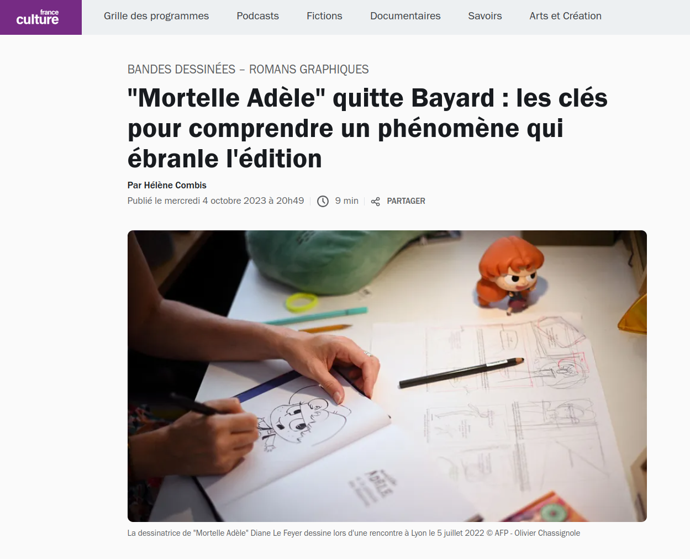
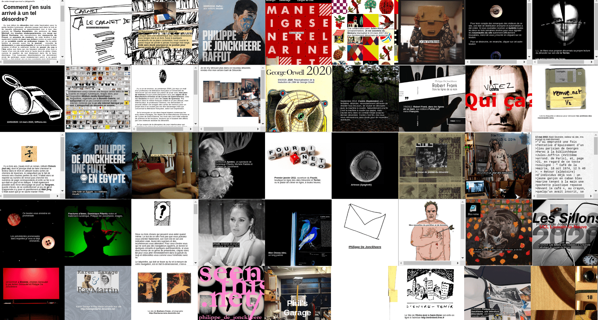
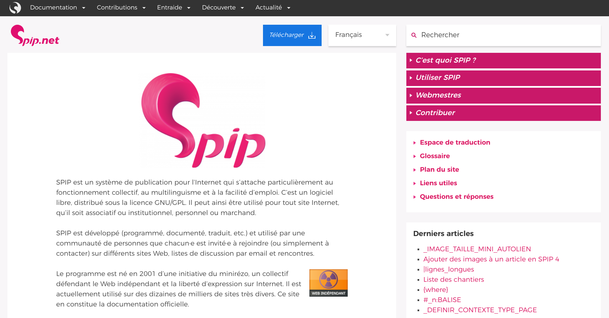
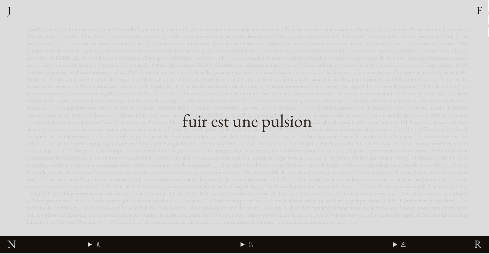
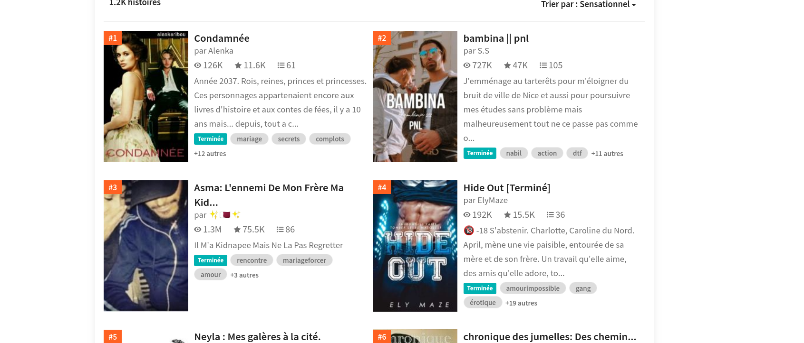
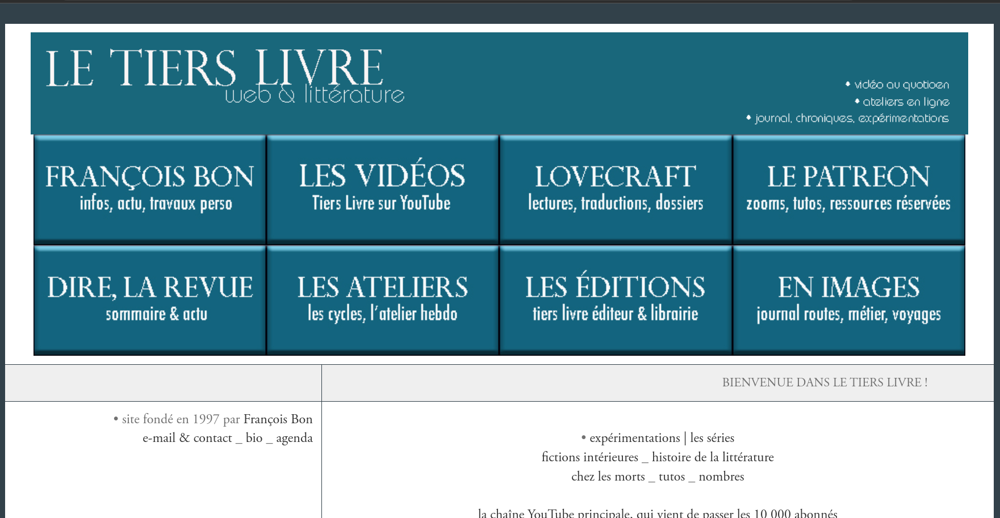
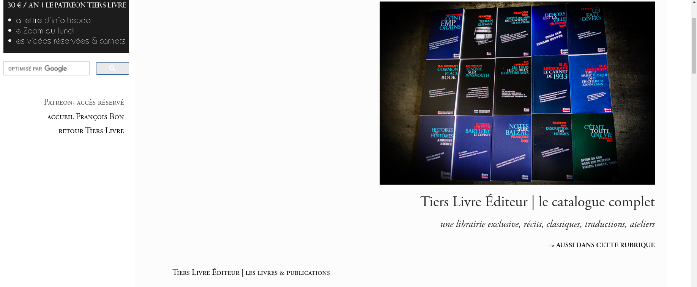
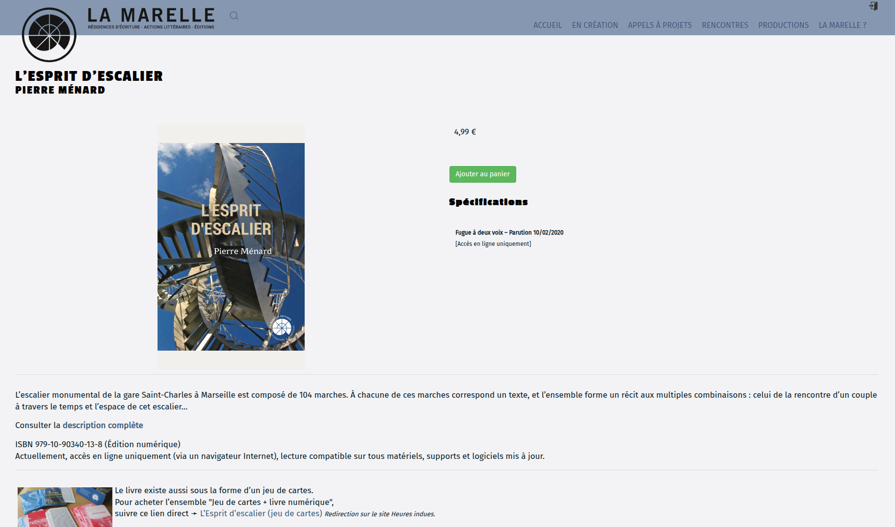
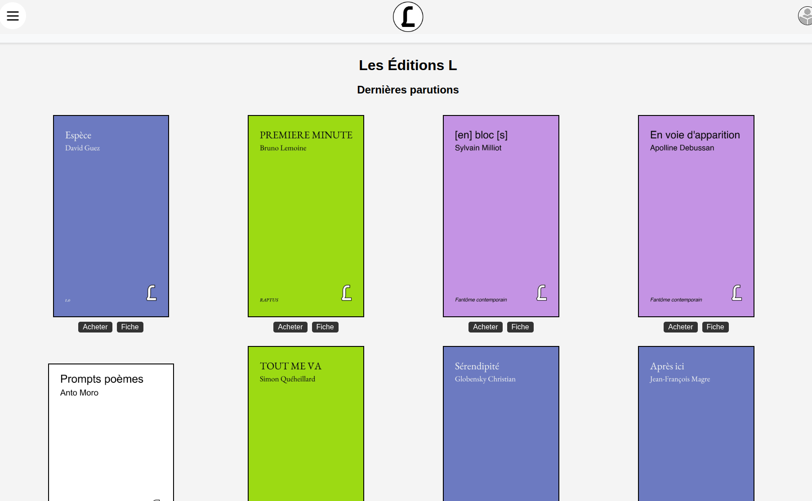
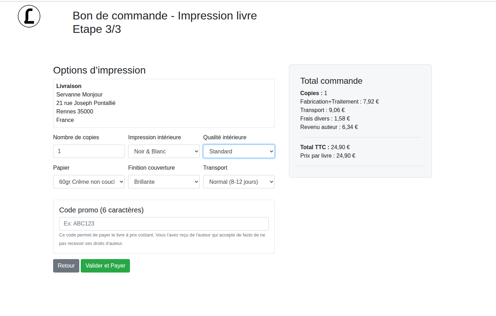

## A-t-on encore besoin des éditeurs-rices ?

#### Auto-édition & désintermédiation

<!-- .element: style="width:400px" -->

§§§§§§§§§§§§§§§§§§§§§§§§§§§§§§§§§§§§§§§§§§§§§
<!-- .slide: data-background-image="img/mortelleAdele.png" data-background-size="contain" -->

===

On a vu plus tôt combien les relations entre les éditeurs et les écrivains s'étaient crispées ces dernières années. 

L'une des manifestations les plus criantes et médiatisée de ce malaise s'incarne notamment dans la tendance de l'auto-édition, dont il sera largement question aujourd'hui. Une tendance illustrée par des cas particulièrement médiatisés -- Joel Dicker, Riad Sattouf et, dernier exemple en date, Antoine Dole et Diane Le Feyer, dont les noms vous sont sans doute moins familiers que celui de leur héroïne : Mortelle Adèle. 

La semaine dernière, tous deux ont annoncé créer leur propre structure après avoir quitté leur éditeur historique Bayard Jeunesse.

Écoutons ensemble le reportage diffusé la semaine passée sur France Culture.

§§§§§§§§§§§§§§§§§§§§§§§§§§§§§§§§§§§§§§§§§§§§§
<!-- .slide: data-background-image="img/mortelleAdele.png" data-background-size="contain" -->

<audio data-autoplay src="img/mortelle-ade-le-reportage.mp3"></audio>

===

§§§§§§§§§§§§§§§§§§§§§§§§§§§§§§§§§§§§§§§§§§§§§

L’étude révèle une polarisation marquée entre l’autoédition et l’édition traditionnelle. La tendance serait donc à la complémentarité plus qu’à la substitution : sur 70 087 auteurs ayant déposé au moins un livre en littérature à la BnF entre 2007 et 2016, plus de 48 % sont toujours restés fidèles à l’édition classique et 40 %, à l’inverse, n’ont jamais quitté l’autoédition. Seuls 12 % sont passés de l’un à l’autre de ces mondes entre 1970 et 2016.

<!-- .element: style="width:45%;float:left;margin-left:-1em; font-size:1.4rem; text-align:justify" -->

<!-- .element: style="width:45%;float:right;margin-right:-1em;" --

===

Profil sociologique : plutôt des hommes (60%), et plutôt matures (moyenne d'âge 56 ans)

§§§§§§§§§§§§§§§§§§§§§§§§§§§§§§§§§§§§§§§§§§§§§
### Sur le(s) terrain(s) de l'auto-édition
- 25 % des livres enregistrés au dépôt légal
- des stratégies éditoriales variées : d'*entreprises* en auto-édition à une édition subie
- un long chemin de croix
- une formule pas encore complètement gagnante
- le symptôme un désir d'émancipation

<!-- .element: style="font-size:1.4rem; text-align:justify" -->

===

Bcp à dire sur l'auto-édition : des modèles variés, des réalités très différentes.

Près du quart des livres papier déposés à la Bibliothèque nationale de France (BnF) sont autoédités en 2015, contre un dixième il y a 40 ans. La croissance du nombre de titres autoédités déposés au dépôt légal est impressionnante : 20 % en 2019 contre 12 % en 2010.

En 2015, au sein de la littérature française, la poésie occupe une part deux fois plus importante parmi les livres autoédités que parmi ceux édités classiquement, 60 % des livres de poésie étant autopubliés. Les romans sont aussi surreprésentés en autoédition, à l’inverse de la bande dessinée et de la littérature jeunesse.

- représente 25 % des livres enregistrés au dépôt légal
- des stratégies éditoriales variées :  d'*entreprises* en auto-édition à une édition subie
- un long chemin de croix : pour de jeunes auteurs, pas si simple
- une formule pas encore complètement gagnante, en dépit de quelques success stories qui alimentent des fantasmes et espoirs
- un désir d'émancipation lié à la précarisation des écrivains

On va proposer non pas un panorama exhaustif, mais quelques exemples permettant de baliser une séries d'enjeux et de problématiques, mais aussi un panorama historique de l'auto-édition ces dernières années.

§§§§§§§§§§§§§§§§§§§§§§§§§§§§§§§§§§§§§§§§§§§§§

### Auto-édition : de quoi parle-t-on ?
* Autoédition
* Autopublication
* Publication à compte d'auteur

<!-- .element: style="font-size:1.4rem; text-align:justify" -->

===

Histoire ancienne, pratique variée qui remonte bien avant les pratiques numériques, et qui renvoie à des réalités distinctes.

§§§§§§§§§§§§§§§§§§§§§§§§§§§§§§§§§§§§§§§§§§§§§

### Publication à compte d'auteur
L’édition à compte d’auteur consiste pour un auteur à faire éditer ses propres ouvrages par un éditeur qui assure seulement la partie technique de l’édition et de la diffusion, en dehors du choix éditorial proprement dit. Dans un contrait de publication à compte d'auteur, c’est donc l’auteur qui paie les frais d’impression et de publicité de son livre, tout en restant propriétaire de ses droits d’auteur.

<!-- .element: style="font-size:1.7rem; text-align:justify" -->

===

L’édition à compte d’auteur consiste pour un auteur à faire éditer ses propres ouvrages par un éditeur qui assure seulement la partie technique de l’édition et de la diffusion, en dehors du choix éditorial proprement dit. C’est donc l’auteur qui paie les frais d’impression et de publicité de son livre. Il reste cependant propriétaire des droits d’auteur et contrôle le nombre de livres édités.

Un éditeur qui publie à compte d’auteur n’est pas un éditeur stricto sensu, mais un prestataire de services. L’auteur devient un client.

§§§§§§§§§§§§§§§§§§§§§§§§§§§§§§§§§§§§§§§§§§§§§
<!-- .slide: data-background-image="img/Proust_1913.jpg" data-background-size="contain" -->

===

Publication à compte d'auteur : système inventé par Bernard Grasset.

Grasset avait fondé une maison d'édition avec laquelle il a expérimenté de nombreuses stratégies éditoriales très mal vues à l'époque (notamment par la NRF de Gallimard), car on considérait qu'elles portaient atteinte à l'intégrité des oeuvres et de la littérature.

C'est à lui que l'on doit notamment la naissance du marketing éditorial, avec la création de publicités destinées à vanter certains livres.

Comme la maison était plutôt jeune, et pas forcément bien dotée (quoique 2 de ses auteurs remportent le Goncourt dans les années 1910), elle a ouvert la possibilité à des écrivains de publier sous leur bannière ou label éditorial, à leur frais.

Exemple de Proust. En 1913.
>L’accord est signé avec Grasset : 1250 exemplaires du premier tome sont imprimés, dont 1000 pour la vente et 250 pour le service de presse et l’auteur.

§§§§§§§§§§§§§§§§§§§§§§§§§§§§§§§§§§§§§§§§§§§§§
<!-- .slide: data-background-image="img/editionsBaudelaire.png" data-background-size="contain" -->

===

Concrètement, le texte ne passe pas devant un comité de lecture (pas d'opération de "sélection" qui fait le propre de la fonction éditoriale traditionnelle), mais intégrait tout de suite le circuit de fabrication.

L’éditeur à compte d’auteur n’assume pas ce qu'on appelle le risque éditorial. En contrepartie, l’auteur ne lui cède pas ses droits. Il reste le propriétaire du tirage et reçoit la majeure partie du produit des ventes.

Dans une publication à compte d'auteur, typiquement, l'écrivain ne bénéficie pas tout à fait de la fonction de légitimation accordée traditionnellement par l'éditeur :
- du moins, il ne bénéficie pas de l'approbation d'un comité éditorial (cf. fonction de production qui engage une opération de sélection du contenu)
- mais il bénéficie tout de même des compétences techniques de fabrication du livre, et de ce que l'on a appelé l'énonciation éditoriale. De fait, la plupart du temps, vous ne vous rendrez même pas compte qu'un ouvrage a été publié à compte d'auteur.

§§§§§§§§§§§§§§§§§§§§§§§§§§§§§§§§§§§§§§§§§§§§§
<!-- .slide: data-background-image="img/lharmattan.png" data-background-size="contain" -->

===
L’Harmattan
La maison d’édition l’Harmattan a été fondée en 1975. Elle s’est fait connaitre en publiant des ouvrages d’auteurs Africains, ou tiers-mondistes. Aujourd’hui, le nombre de livres publiés par l’Harmattan est très impressionnant. La maison accueille de nombreux auteurs.

La maison permet d’éditer son livre gratuitement, mais ne verse des droits d’auteurs qu’à partir du 500ème livre vendu. C’est une pratique ambiguë, mais qui a l’avantage de permettre aux auteurs de publier facilement leur livre.

§§§§§§§§§§§§§§§§§§§§§§§§§§§§§§§§§§§§§§§§§§§§§

### Auto-publication
Stricto-sensu, l’autopublication (dérivé de l’anglais *self-publishing*) consiste à *rendre public* un texte, sans nécessairement chercher à le commercialiser.

Le développement du Web à compter des années 1990 a donné un élan sans précédent à l'auto-publication. 

<!-- .element: style="font-size:1.7rem; text-align:justify" -->

===

La deuxième distinction à opérer est sans doute plus ténue, et touche deux termes souvent employés de manière synonymique : auto-édition et auto-publication. Je commencerai par ce dernier terme, qui renvoie à une pratique très large dans laquelle peut entrer l'auto-édition.

Stricto-sensu, l’autopublication (dérivé de l’anglais *self-publishing*) consiste à *rendre public* un texte, sans nécessairement chercher à le commercialiser.

Il existe plein de manière de s'auto-publier, en ce sens : lorsque l'on va diffuser des "zines", par exemple. 

Mais depuis les années 1990, le développement du Web, puis des CMS, va donner une ampleur jusque là inédite à l'auto-publication. 

§§§§§§§§§§§§§§§§§§§§§§§§§§§§§§§§§§§§§§§§§§§§§

#### Auto-publication & édition numérique : naissance d'une nouvelle avant-garde littéraire

Le Web nous fait entrer de plain-pied dans l'ère de l'édition numérique, puisque les textes publiés sur le Web dès les années 1990 sont des textes encodés dans des formats numériques spécifiques, des formats "web" : XML, HTML (qui a connu plusieurs évolutions). 

<!-- .element: style="width:45%;float:left;margin-left:-1em; font-size:1.4rem; text-align:justify" -->

<!-- .element: style="width:45%;float:right;margin-right:-1em;" -->

à droite : Capture d'écran du site *Désordre*, Philippe de Jonckeere

<!-- .element: class="source" -->

===

Le Web, c'est quoi ? C'est une application d'internet, qui propose une infratructure en réseau, permettant de publier des contenus de tous types : textes, images, vidéo, etc. 

Le Web nous fait entrer de plain pied dans l'ère de l'édition numérique, puisque les textes publiés sur le Web dès les années 1990 sont des textes encodés dans des formats numériques spécifiques, des formats "web" : XML, HTML (qui a connu plusieurs évolutions). 

Les années 1990 voient naître ainsi un web littéraire, qui va globalement donner naissance à une avant-garde littéraire. Pourquoi avant-garde ? Parce que ces écrivains des premiers temps de web vont devoir apprendre une nouvelle langue, voire plusieurs langue : celle des langages de programmation. Apprendre une nouvelle langue permet bien souvent de questionner notre propre langue maternelle. Les écrivains du web 1.0 vont ainsi créer des oeuvres littéraires qui reposent non seulement sur le langage naturel, mais également sur une exploitation du langage de programmation, soit du code. 

Ici, le site DÉsordre, de Philippe de Jonckeere. 

§§§§§§§§§§§§§§§§§§§§§§§§§§§§§§§§§§§§§§§§§§§§§

#### Des outils pour l'auto-publication

<!-- .element: style="width:45%;float:left;margin-right:-1em;" -->

<!-- .element: style="width:45%;float:right;margin-right:-1em;" -->

source : Fuir est une pulsion, Guillaume Vissac

<!-- .element: class="source" -->

===

Les années 2000 marquent un tournant dans la vie du Web, avec la multiplication d'outils voire d'éco-systèmes de publication qui ne nécessitent aucune compétence informatique. 

C'est le temps des "plateformes", des "CMS" ou des réseaux sociaux. Avec ces outils, il est directement possible de publier un contenu sur le web, sans rien savoir aux langages HTML, CSS ou Javascript. 

Une autre littérature en ligne voit alors le jour, et va devenir assez majoritaire. 

SPIP = plateforme de publication ++

§§§§§§§§§§§§§§§§§§§§§§§§§§§§§§§§§§§§§§§§§§§§§

#### La souveraineté des outils en question

<!-- .element: style="width:400px" -->

source : Anne Savelli, comptes instagram

<!-- .element: class="source" -->

===

Ces plateformes posent la question des modèles économiques de l'édition numérique -- on en reparlera plus tard, mais on entre ici dans le monde des grandes plateforme et des GAFAM, cad un nouveau monopole éditorial qui ne monétise plus nécessairement ce qui est publié, mais bien les données des usagers, ou encore des modalités d'accès (accès premium, etc.).

§§§§§§§§§§§§§§§§§§§§§§§§§§§§§§§§§§§§§§§§§§§§§

#### Les "plateformes littéraires"

<!-- .element: style="width:800px" -->

===

Des plateformes dédiées, de type wattpad... Et là, on voit déjà une progression : des outils de plus en plus formattés, qui laissent une liberté d'expression et une autonomie assez variable.

Ainsi que des degrés de "Professionnalisme" de l'écrivain variables. Dans la culture de la fanfic, par exemple, on revendique l'amateurisme. Wattpad, une plateforme qui va peu à peu accueillir une communauté d'écrivains amateurs, avec quelques success story -> récupération chez de "grands" éditeurs.

§§§§§§§§§§§§§§§§§§§§§§§§§§§§§§§§§§§§§§§§§§§§§
<!-- .slide: data-background-image="img/kindleDirectPublishing.png" data-background-size="contain" -->

===

Je parlais plus tôt d'écosystèmes de publication, généralement arrimés à des diffuseurs qui ont déjà une présence en ligne ou hors-ligne : 
- le Kindle direct publishing (j'en dirai un mot tout à l'heure)
- Kobo Writing Life (Fnac)
- iBooks Authors (Apple)
- Je publie mon livre initié par Chapitre.com 

Ces plateformes ne demandent aucune contribution financière à l’auteur, mais, on y reviendra, le travail éditorial n'est de fait pas pris en charge. Le catalogue est donc rempli de textes de mauvaise qualité (je ne parle pas du fond mais de la forme : textes mal/non relus remplis de fautes, coquilles, etc). 

§§§§§§§§§§§§§§§§§§§§§§§§§§§§§§§§§§§§§§§§§§§§§

#### Quelques *success stories* qui alimentent les fantasmes

<!-- .element: style="width:500px" -->

===

Des succès : Agnès Martin-Lugand *Les gens heureux lisent et boivent du café* (adpatation ciné)

Les gens heureux lisent et boivent du café est le premier roman d’Agnès Martin-Lugand, paru le 27 décembre 2012 en format ebook sur la plate-forme d’autoédition Kindle d'Amazon, puis le 6 juin 2013 aux éditions Michel Lafon.

§§§§§§§§§§§§§§§§§§§§§§§§§§§§§§§§§§§§§§§§§§§§§

<!-- .element: style="width:700px" -->

===

Surfant sur ce principe, des éditeurs-diffuseurs numériques vont proposer des services d’autoédition numérique tels que librinova. Librinova proposent contre rémunération, un accompagnement de l’auteur sous la forme de prestations professionnelles tout en permettant également une commercialisation de l’ouvrage sur plus de 90 librairies en ligne.

L'auto-publication = une solution pour les primo-auteurs. D'où la valorisation et la médiatisation de success-story

§§§§§§§§§§§§§§§§§§§§§§§§§§§§§§§§§§§§§§§§§§§§§

### Auto-édition
L’autoédition (souvent employé comme un synonyme d'autopublication) renvoie à un modèle d'auto-publication qui se veut qualitatif, et qui s'inscrit encore dans un modèle éditorial traditionnel, où l'objet livre demeure un produit essentiel. L'auto-édition aura par ailleurs souvent une vocation marchande.

<!-- .element: style="font-size:1.7rem; text-align:justify" -->

§§§§§§§§§§§§§§§§§§§§§§§§§§§§§§§§§§§§§§§§§§§§§

### Tiers livre éditeur, de François Bon

<!-- .element: style="width:45%;float:right;margin-right:-1em;" -->

<!-- .element: style="width:45%;float:left;margin-right:-1em;" -->

===

François Bon & Tiers-livre éditeur...
Différence entre le site Tiers-Livre qui relèverait de l'auto-publication : pas de vocation commerciale

Et Tiers-livre éditeur qui propose la vente de livres produits par l'auteur.

Chez François Bon

Dans la distinction entre auto-édition et auto-publication, il y a encore l'idée de vouloir soutenir le principe d'édition comme garant d'une forme de qualité.

§§§§§§§§§§§§§§§§§§§§§§§§§§§§§§§§§§§§§§§§§§§§§
<!-- .slide: data-background-image="img/" data-background-size="contain" -->

### Pierre Ménard : de La Marelle au livre-objet auto-édité

<!-- .element: style="width:45%;float:right;margin-right:-1em;" -->

<!-- .element: style="width:45%;float:left;margin-right:-1em;" -->

====

Et le cas d'un livre-objet comme Pierre Ménard et son *Esprit d'escalier*

§§§§§§§§§§§§§§§§§§§§§§§§§§§§§§§§§§§§§§§§§§§§§

<!-- .element: style="width:700px" -->

===

Editions L

§§§§§§§§§§§§§§§§§§§§§§§§§§§§§§§§§§§§§§§§§§§§§

<!-- .element: style="width:700px" -->

===

§§§§§§§§§§§§§§§§§§§§§§§§§§§§§§§§§§§§§§§§§§§§§

## Une édition sans éditeurs-rices ? 

#### La tentation de la désintermédiation
===

Cette combinaison de facteurs -- précarisation des écrivains + tensions avec les grands éditeurs + mise à disposition d'outils d'auto-édition/publication de plus en plus "faciles" à prendre en main -- questionne la place de l'éditeur au sein de l'écosystème éditorial. 

§§§§§§§§§§§§§§§§§§§§§§§§§§§§§§§§§§§§§§§§§§§§§
<!-- .slide: data-background-image="img/" data-background-size="contain" -->

>"Alors que l'on définit la publication comme un processus de mise en forme d’un contenu préalablement sélectionné (collecté, agrégé, synthétisé…), en vue de sa diffusion collective, pour l’autopublication, il faut ajouter : “sans intermédiaire”. C'est effectivement cette notion de désintermédiation qui est en jeu. Le producteur de documents est aussi le diffuseur. Une autre notion essentielle concerne la sélection/validation. Elle permet de réaliser la distinction entre publication et édition. L'autopublication dans ce cadre associe la production à la diffusion directe reléguant la sélection à l'édition, à un tiers. La désintermédiation s'accompagne parfois d'une réintermédiation souvent fondée sur un service non-marchand."

<!-- .element: style="font-size:1.4rem; text-align:justify" -->

>Gallezot Gabriel et Ertzscheid Olivier, « Swaper la publication »

<!-- .element: style="font-size:1.4rem; text-align:justify" -->

===

Le concept sur lequel je voudrais à présent proposer quelques définitions = désintermédiation, dont on a eu l'occasion de parler à plusieurs reprises, sans pour autant creuser la définition et les implications.

§§§§§§§§§§§§§§§§§§§§§§§§§§§§§§§§§§§§§§§§§§§§§

### Qu'entend-t-on par désintermédiation ?  

Processus établissant une relation directe entre une entité (industrielle, culturelle, institutionnelle) et ses usagers, entraînant la disparition de certains services traditionnellement chargés d'assurer des services de transmission, diffusion, médiation, etc. (les "intermédiaires").

<!-- .element: style="font-size:1.4rem; text-align:justify" -->

===

La désintermédiation est d'abord un concept économique, qui a connu une fortune dès les années 60 avec le développement de techniques numériques qui rendaient obsolètes certaines activités ou tâches traditionnellement accomplies par des individus au sein de services qualifiés.

On peut définir la désintermédiation comme l'établissement d'une relation directe entre une entité (industrielle, culturelle, institutionnelle) et ses usagers, entraînant la disparition de certains services -- et par conséquent la disparition d'emplois, voire de corps de métier -- rendus obsolètes par l'automatisation.

Cette définition est pour le moment assez vague, et pour la détailler, voyons peut-être immédiatement son impact sur les industries et les instituions culturelles, comme l'édition (mais pas seulement).

La désintermédiation peut être perçue et interprétée de manière très positive ou au contraire très négative, notamment en raison d'une double implication

§§§§§§§§§§§§§§§§§§§§§§§§§§§§§§§§§§§§§§§§§§§§§

La désintermédiation engage une redistribution de l'autorité, en direction des premiers producteurs et du public. On note plus largement un phénomène d'horizontalisation de l'autorité, avec un passage de la logique "top-down" vers un mouvement "bottom-up".

<!-- .element: style="font-size:1.4rem; text-align:justify" -->

===

Le phénomène de désintermédiation renvoie tout d'abord ce phénomène de redistribution de l'autorité que l'on a pu étudier dans nos cours consacrés à la nouvelle économie de l'attention. Ce passage du "Top down" vers le "bottom up"

La désintermédiation renvoie en effet à la disparition de certains intermédiaires qui incarnaient une forme d'autorité, ou qui traditionnellement conféraient cette autorité : typiquement les éditeurs, les grands distributeurs, les libraires, etc. qui aujourd'hui doivent faire face à une concurrence jouant fortement sur le principe d'une redistribution du pouvoir de production et de prescription à la communauté des consommateurs, voire de certains prestataires.

On a pu le voir à travers plusieurs exemples, dans ce cours comme dans le cours de communication.

§§§§§§§§§§§§§§§§§§§§§§§§§§§§§§§§§§§§§§§§§§§§§
<!-- .slide: data-background-image="img/MasquePlumeBabelio.png" data-background-size="contain" -->

===

On trouve l'illustration la plus marquante de cette redistribution de l'autorité dans l'évolution récente de la critique culturelle, tous milieux confondus.

La critique est passée de secteurs spécialisés, experts, à des réseaux amateurs.
Cohabitation entre des critiques institutionnelles (Le Masque & la plume) et des réseaux amateurs. Nés dans les années 1990 avec le web, ces réseaux de critique se sont plateformisés, à l'instar de Babelio, en développant la critique amateur à une très large échelle, avec la mise en place d'un système d'évaluation globale.

§§§§§§§§§§§§§§§§§§§§§§§§§§§§§§§§§§§§§§§§§§§§§
<!-- .slide: data-background-image="img/babelioaccueil.png" data-background-size="contain" -->

===

Sur babélio, ou booknode, un système de recommandation amateur basé en priorité sur l'évaluation : le commentaire n'est pas forcément mis en avant.

§§§§§§§§§§§§§§§§§§§§§§§§§§§§§§§§§§§§§§§§§§§§§
<!-- .slide: data-background-image="img/bookTubing.png" data-background-size="contain" -->

===

Avec des phénomènes comme le BookTubing, cette critique amatrice s'est même "professionnalisée". Émergence de figures de critique-amateur-pro, calquées sur le modèle communicationnel de l'influenceur.

Autant le booktubeur n'est pas un professionnel du livre, autant il devient, de manière souvent autodidacte, un pro de la communication numérique. 

On n'est plus non plus dans un système d'amateur éclairé (qui désigne un fin connaisseur de la litt, par exemple, qui développe pour son propre plaisir ses connaissances), car la pratique du booktubing s'inscrit dans une économie de l'attention et plus largement dans l'écosystème médiatique. Enjeux économiques.

§§§§§§§§§§§§§§§§§§§§§§§§§§§§§§§§§§§§§§§§§§§§§
<!-- .slide: data-background-image="img/mediaCitoyen.png" data-background-size="contain" -->

===

On retrouve cette figure dans l'ensemble de la sphère culturelle et communicationnelle. Remise en cause du rôle de l'expert, du savant, du professionnel.

Pour sortir du seul domaine de l'édition, c'est par exemple la prise en main de la circulation voire de la production de l'information par les journalistes-citoyens.

§§§§§§§§§§§§§§§§§§§§§§§§§§§§§§§§§§§§§§§§§§§§§
<!-- .slide: data-background-image="img/tuches5.png" data-background-size="contain" -->

===

Ce que l'on observe à chaque fois, c'est donc une remise en question de l'autorité de structures institutionnelles qui disposaient d'un très fort pouvoir de légitimation.

La désintermédiation pose ainsi de nombreuses questions en termes de système hiérarchique de valeur attribués aux contenus. Pour prendre un cas particulièrement radical, une fanfiction comme After aura d'abord été validée par la masse des lecteurs amateurs d'une plateforme, mais non par un éditeur ou un commité de lecture.

Nous naviguons de faire à l'heure actuelle dans un double système de validation et de légitimation des contenus, avec d'un côté la sélection des instances expertes traditionnelles, et de l'autre celle du "grand public".

§§§§§§§§§§§§§§§§§§§§§§§§§§§§§§§§§§§§§§§§§§§§§

### La désintermédiation & l'informatisation 

#### De l'automatisation des tâches à la menace de l'obsolescence des métiers techniques de la culture

===

Évidemment, cette crise de l'autorité des instances de légitimation traditionnelle beaucoup inquiété les acteurs historiques de ces institutions, d'autant plus qu'elle s'est accompagnée d'une remise en question parfois violente de la pertinence de certains métiers.

À l'origine de la désintermédiation, un concept dont on discute depuis les années 196, on retrouve en effet le développement de dispositifs techniques (en particulier l'informatique), ayant conduit à l'automatisation de certaines tâches jusque-là assurées par des être humains. Cette automatisation a donc rendue obsolète certains emplois, voire certains corps de métier dans leur ensemble.

La désintermédiation a souvent été mal vécue par des individus dont le métier a dû être entièrement réinventé, en même temps que le développement technique entraînait l'obsolescence de leur tâche. Les institution et industries ont ainsi été nombreuses à de voir se repositionner par rapport à leur public, en proposant de nouveaux services -- et donc une nouvelle manière de concevoir leur métier / le service ou l'objet qu'ils vendaient.

§§§§§§§§§§§§§§§§§§§§§§§§§§§§§§§§§§§§§§§§§§§§§
<!-- .slide: data-background-image="img/resnais.png" data-background-size="contain" -->

===

Dans le secteur de l'industrie documentaire, par exemple (je pense ici aux bibliothèques), la désintermédiation a été très forte dès les années 70 aux années 80-90. Je me permets d'opérer ce crochet par l'industrie documentaire des bibliothèques car elle n'est pas si éloignée que cela de notre univers d'éditeurs, et parce qu'elle a fait les frais d'une désintermédiation avant l'heure, qu'elle a particulièrement bien négociée.

Je voudrais donc d'abord vous montrer quelques minutes d'un film documentaire d'Alain Resnais, "Toute la mémoire du monde", qui présente le système de catalogage à la BNF avant l'arrivée de l'informatique.

§§§§§§§§§§§§§§§§§§§§§§§§§§§§§§§§§§§§§§§§§§§§§
<!-- .slide: data-background-video="img/Resnais_extrait.mp4" data-background-size="contain" -->

§§§§§§§§§§§§§§§§§§§§§§§§§§§§§§§§§§§§§§§§§§§§§

>« Le documentaliste est un « intermédiaire dont la fonction essentielle est de mettre en contact ceux qui ont besoin de savoir et ceux qui savent »

<!-- .element: style="font-size:1.4rem; text-align:justify" -->

>Eric de Grolier, E. De Grolier, « La passion de l'organisation des connaissances », Documentaliste, sciences de l'information, 1996.

<!-- .element: style="font-size:1.4rem; text-align:justify" -->

===

Dans le secteur documentaire, désintermédiation = informatisation des catalogues. Auparavant, tout était sous forme de fiches dans de "vrais" catalogues imprimés, dans lesquels les documentalistes guidaient les lecteurs.

FIgure d'autorité :  Pour Eric de Grolier (éditeur, chercheur, parfois considéré comme le fondateur des sciences de l'information en France), le documentaliste est un « intermédiaire dont la fonction essentielle est de mettre en contact ceux qui ont besoin de savoir et ceux qui savent » (on voit combien la hiérarchie est forte), ailleurs on parle d’un « médiateur entre le document et l’utilisateur ».

L'informatisation des catalogues va entraîner un déplacement de cette fonction, désormais assumée par la machine, avec laquelle le lecteur est directement en interaction.

Gain d'autonomie énorme pour le lecteur, qui devient maître de ses recherches. Le catalogue informatisé que vous utilisez par exemple à la BU, tout cela, c'était une personne qui vous guidait ! Les documentalistes sont conscients qu’il leur faut former les usagers aux nouveaux outils de recherche mais craignent en même temps de les voir devenir totalement autonomes.

Mais est-ce que cela signifie pour autant la disparition des documentalistes ? Non ! Mais une redéfinition profonde de leur métier.

À suivre : reportage france 2 puis présentation du catalogue général

§§§§§§§§§§§§§§§§§§§§§§§§§§§§§§§§§§§§§§§§§§§§§
<!-- .slide: data-background-video="img/1765195014.mp4" data-background-size="contain" -->

§§§§§§§§§§§§§§§§§§§§§§§§§§§§§§§§§§§§§§§§§§§§§
<!-- .slide: data-background-video="img/ccfr_presentation.mp4" data-background-size="contain" -->

===

https://www.bnf.fr/fr/mediatheque/le-catalogue-collectif-de-france-quest-ce-que-cest

§§§§§§§§§§§§§§§§§§§§§§§§§§§§§§§§§§§§§§§§§§§§§
<!-- .slide: data-background-image="img/mallarme_vollard2.png" data-background-size="contain" -->

===

Liée à cette crainte de la désintermédiation causée par les machines, on voit apparaître la crainte de la dématérialisation : est-ce qu'on ne perd pas une partie de l'expérience de prendre dans ses mains un livre ancien lorsqu'on en consulte une image en ligne ?

La dématérialisation est un faux problème : on parlera plutôt de délocalisation. On l'a bien vu avec la question des supports de l'archivage numérique, qui sont en fait fragiles, bien plus qu'on ne le pensait.

Ce paradigme du déplacement, de l'évolution des objets et des métiers est essentiel.

§§§§§§§§§§§§§§§§§§§§§§§§§§§§§§§§§§§§§§§§§§§§§
<!-- .slide: data-background-image="img/" data-background-size="contain" -->

#### Éditeur : un métier en voie de disparition ? 

>Dès lors, la fonction du médiateur qu'est l'éditeur n'a pas disparu ; elle a simplement profondément changé et contraint tous les acteurs traditionnels à redéfinir d'urgence les bases de leur métier sous peine de disparaître au profit d'acteurs nouveaux venant d'autres horizons.

>Marin Dacos, Pierre Mounier, *L'édition en réseau*, dans L’édition électronique, La Découverte, 2010, pp. 88-107.

<!-- .element: style="font-size:1.4rem; text-align:justify" -->

§§§§§§§§§§§§§§§§§§§§§§§§§§§§§§§§§§§§§§§§§§§§§

## Conclusion

Si l'auto-édition est une pratique ancienne, que certains éditeurs comme Grasset ont d'ailleurs encouragée via le principe d'édition à compte d'auteur, les entreprises d'auto-édition aujourd'hui portées par des grands noms (Sattouf, Dicker, etc.) portent un coup majeur au principe de péréquation qui permet aux maisons d'édition de fonctionner. Les tensions entre les éditeurs et les auteurs expliquent en partie le phénomène, qui renvoie également à des pratiques bien plus risquées, portées par des amateurs et jeunes auteurs ou auteurs précaires. L'auto-édition s'inscrit dans un contexte culturel marqué par un principe de désintermédiation, dont l'une des principales conséquence est la redéfinition de l'autorité des éditeurs. Mais l'auto-édition est-elle vraiment synonyme d'émancipation de l'auteur ? Le développement d'un nouveau monopole éditorial basé sur les services numériques (GAFAM), donne lieu à une réintermédiation dont il faut mesurer les effets.

<!-- .element: style="font-size:1.4rem; text-align:justify" -->

