## Comment fonctionne la "chaîne du livre" ?

### *L'énonciation éditoriale*

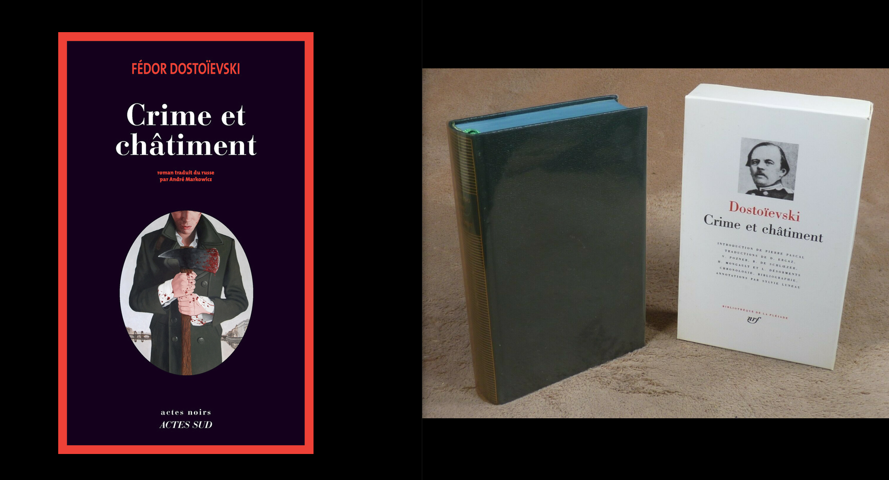<!-- .element: style="width:300px" -->

===

Nous avons la semaine passée évoquer le concept de fonction éditoriale, dont on a vu qu'elle n'était pas propre à l'éditeur moderne, mais qu'elle avait traversé l'histoire de la pensée et de la culture mondiale. La fonction éditoriale recoupe trois éléments essentiels :
- une fonction de production
- une fonction de diffusion
- une fonction de légitimation

Ces fonctions sont fort utiles pour comprendre la philosophie qui doit animer tout éditeur. Elles restent cependant assez abstraites, et j'aimerais aujourd'hui que l'on aborde ensemble l'édition sous un pan plus concret, à travers la notion de chaîne éditoriale ou de chaîne du livre. 

Pour autant, je me montrerai également critique le sens sur cette expression, qui repose sur une modélisation parfois trop rigide, et finalement peu en phase avec la réalité du terrain des maisons d'édition, surtout dans des structures un peu petites. 

Ce que je voudrais par ailleurs souligner à travers cette étude de la chaîne éditoriale, c'est l'autorité de l'éditeur, à travers un concept d'énonciation éditoriale.

§§§§§§§§§§§§§§§§§§§§§§§§§§§§§§§§§§§§§§§§§§§§§

#### De la fonction éditoriale à la professionnalisation des éditeurs

- Une institutionnalisation de la fonction
- Le développement de _process_ de travail (normalisation, standards, protocoles)

<!-- .element: style="font-size:1.6rem; text-align:justify" -->

===

Les fonctions éditoriales de production, diffusion et légitimation, ont donc été prises en charge depuis le XIXe siècle par des structures dédiées = les maisons d'édition. 

Le XIXe a ainsi marqué le début d'une professionnalisation de l'édition. 
Professionnalisation à prendre dans un double sens : 
- institutionnalisation d'un secteur économique et professionnel, avec des corps de métiers bien précis, donnant lieu à des formations universitaires et professionnelles. 
- professionnalisation dans le sens d'une mise en pace de protocoles éditoriaux, qui ont fait l'objet d'une normalisation (dont les instituts d'enseignement sont par ailleurs responsables).  

§§§§§§§§§§§§§§§§§§§§§§§§§§§§§§§§§§§§§§§§§§§§§

### La "chaîne éditoriale": incarnation de la professionnalisation de l'éditeur...

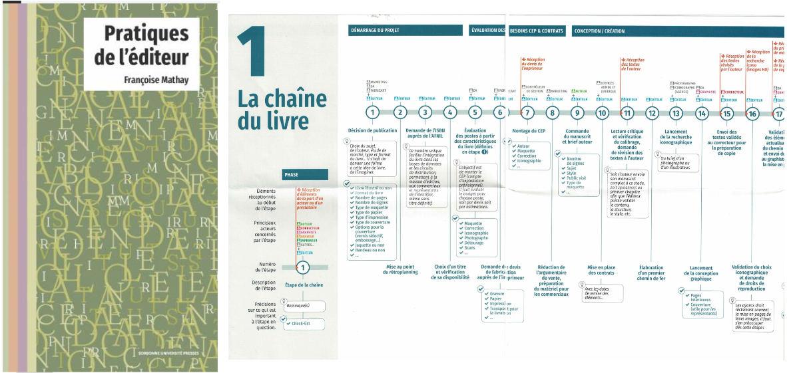<!-- .element: style="width:50%;float:right;margin-right:-1em;" -->

>Tout projet éditorial commence par une idée. Pour viser un résultat optimal, il faut suivre les étapes une par une. 

<!-- .element: style="width:45%;float:left;margin-left:-1em; font-size:1.4rem; text-align:justify" -->

>Françoise Mathay, Pratiques de l'éditeur, SUP, 2025

<!-- .element: style="width:45%;float:left;margin-left:-1em; font-size:1.4rem; text-align:justify" -->

====

L'expression "chaîne du livre" est un peu le symbole de cette institutionnalisation et de cette professionnalisation.

Je vous propose de régler provisoirement la question qu'est-ce qu'une chaîne éditoriale, à travers une publication récentes, ici aux SUP, de Françoise Mathay. J'ai déposé des numérisations dans votre espace Moodle. L'ouvrage = 12 euros.

Approche très pratique et concrète, basée sur une longue expérience : mais une expérience 1) dans une grande structure 2) dans une maison d'édition "traditionnelle" : on n'est pas dans une maison indé, qui tente d'Expérimenter des nouveaux formats. 3) dans une maison qui produit d'abord de l'imprimé. 

Cet ouvrage est d'abord un manuel, il n'est pas un ouvrage critique. Moi, ce que je voudrais faire, c'est donc un peu de critique. 

Je ne vais pas tant critiquer cette chaîne éditoriale, car je crois déjà qu'elle tout à fait acceptable et même très pertinente en l'état -- même si je vous encouragerait à garder en tête qu'il y a toujours plusieurs modèles de chaînes éditoriales. Comme un recette de cuisine, on va souvent retrouver les mêmes ingrédients, mais il existe des variantes. 

Plutôt que de chaîne éditoriale, je préfère parler de protocoles éditoriaux : c'est-à-dire de l'ensemble des consignes aux auteurs, mais également de l'environnement de travail, des étapes du travail qui sont définis par des équipes d'éditeur afin que toute cette équipe travaille efficacement. 

§§§§§§§§§§§§§§§§§§§§§§§§§§§§§§§§§§§§§§§§§§§§§

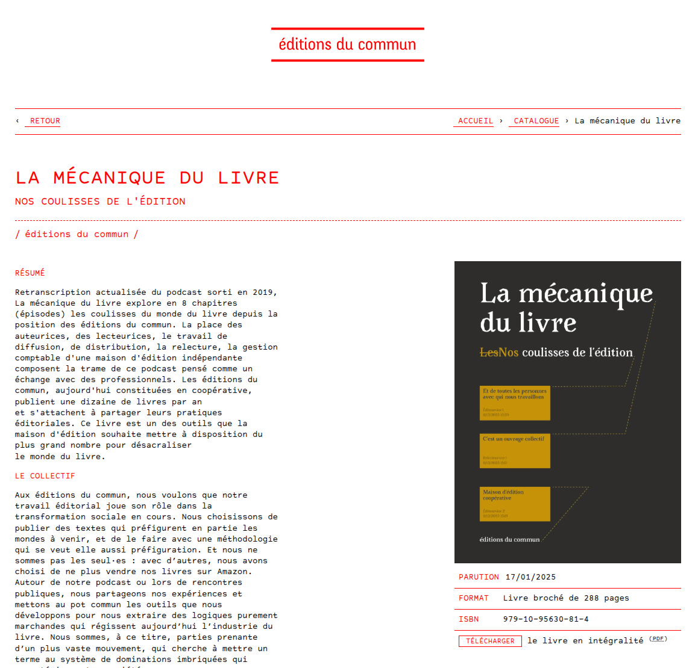

===

Ne pas oublier que l'on édite des livres, et qu'en fonction des livres édités, il y aura parfois des préférences pour telle ou telle manière de faire. Personnellement j'ai travaillé pour 3 éditeurs, et j'ai eu à chaque fois 3 des protocoles et chaînes différentes. 

§§§§§§§§§§§§§§§§§§§§§§§§§§§§§§§§§§§§§§§§§§§§§

### ... mais également de la standardisation du livre
Modélisation du processus de fabrique du livre  
Séquentialisation & distribution des tâches  
D'une fonction *représentative* à une valeur *prescriptive* de la fabrique du livre

<!-- .element: style="width:45%;float:left;margin-left:-1em; font-size:1.4rem; text-align:right" -->

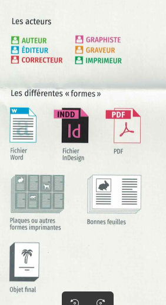<!-- .element: style="width:28%;float:right;" -->

===

Ma principale critique est une critique de fond : sur l'expression même de "chaîne éditoriale". Le terme "chaîne" renvoie d'une part à un phénomène séquentiel : il y aura, comme dans une recette de cuisine, des étapes à suivre dans l'ordre, et tout se suivrait comme un long fleuve tranquille. Or cela ne fonctionne pas comme ça. La chaîne subit souvent des ruptures. La séquentialisation touche aussi la distribution et la répartition des tâches : chaque corps de métier ou spécialisation pour telle ou telle tâche.

En résumé, le principe de chaîne éditoriale repose sur un travail de modélisation de la fabrique du livre. Modélisation = Opération par laquelle on établit un modèle, ici par exemple un schéma, d'un système complexe, en vue de garantir sa reproductibilité. 

Le schéma que j'ai présenté dans la précédente slide = une présentation très détaillée et fine des étapes qui peuvent conduire à la construction d'un livre. C'est donc un "modèle" à suivre, avec ce que ce terme sous-entend aussi : modèle = exemple ou idéal. 

Or ce que la philosophie nous enseigne, c'est que tout modèle repose sur un ensemble de valeurs. Aucun modèle n'est neutre. 

Ce n'est pas que le modèle que je viens de présenter est fautif, parcequ'il ne l'est pas. Mais il comprend un certain nombre de valeurs sous-jacentes, une certaine idée du livre, de l'édition, du métier, du marché, etc. 

L'idée même de chaîne éditoriale, comme tout processus d'institutionnalisation et de professionnalisation, a tendance à oeuvrer en faveur d'une certaine standardisation de l'édition. 

"Standardisation" dans les process (comment on construit le livre), dans les outils (avec quels outils on construit le livre), et parfois standardisation des contenus eux-mêmes (on publie des auteurs dont on sait qu'ils vont "marcher" auprès des lecteurs). 

Je vous donne un exemple de cette standardisation, avec la seconde chaîne du manuel, intitulée de "L'idée au livre" : ici, on sera surpris de voir que les "formes" du livre font toutes référence à des logiciels de PAO (publication assistée par ordinateur), qui sont des logiciels propriétaires. 

Outil pas neutre. Il conditionne la fabrique, mais aussi les contenus. 

§§§§§§§§§§§§§§§§§§§§§§§§§§§§§§§§§§§§§§§§§§§§§

#### ...le développement d'une "énonciation éditoriale"

De la réception du manuscrit à la commercialisation d'un ouvrage, la fabrique du livre nécessite la mobilisation d'une équipe de professionnels (qui ont une certaine "idée" du livre, du lectorat/client), l'utilisation d'outils spécifiques, dans un cadre institutionnel et juridique. Cet écosystème socio-technique a un impact sur le livre. C'est ce que l'on peut appeler l'énonciation éditoriale.

<!-- .element: style="font-size:1.6rem; text-align:justify" -->

===

En règle générale, cette standardisation et ces protocoles propres à la chaîne du livre sont largement ignorés, puisque celui qui occupe le premier plan, c'est toujours l'auteur. Et quand on est à l'intérieur de la machine éditoriale, on a peu tendance à remettre en question ces protocoles, qui font un peu le ciment de tout un système ou toute une maison. 

Ce que l'on va voir ensemble aujourd'hui, c'est la façon dont la chaîne du livre, dont ces standards et ces protocoles jouent un rôle essentiel dans la construction du sens du livre, et donc de son contenu : le texte. La chaîne éditoriale n'est pas qu'un mode d'emploi de la fabrique du livre, elle est porteuse d'un message, d'un réseau de signification et de valeur sur l,objet livre. 

Quand j'ai dit plus tôt que je voulais "critiquer" la chaîne, ce n'est pas forcément (même si un peu) pour dire qu'il faut trouver un autre modèle. C'est déjà pour en faire un objet de penser (casser l'impensé de la chaîne éditoriale). Penser ce qui, dans la chaîne, fait sens, porte un message, et quel message.

Cette opération critique, je vais la mener grâce à un concept issu des sciences de l'info-com : l'énonciation éditoriale. 

Une autre façon de le dire : si l'auteur est seul à écrire un manuscrit, il n'est pas seul à "écrire" ou du moins produire le livre qui va accueillir son texte. Ainsi, les équipes éditoriales, les éditeurs, font entendre leur voix dans la fabrique éditoriale.

§§§§§§§§§§§§§§§§§§§§§§§§§§§§§§§§§§§§§§§§§§§§§

Proposée par Emmanuël Souchier, la théorie de l’énonciation éditoriale renvoie à « l’élaboration plurielle de l’objet textuel » (Souchier, 1998). Elle repose sur une attention à la matérialité du texte et à ses processus de co-construction « par toute instance susceptible d’intervenir dans la conception, la réalisation ou la production du Livre. » Née dans l’ordre des industries culturelles du texte et du livre, elle s’est déployée dans le champ des médias et concerne tous les processus de communication, notamment numériques.

<!-- .element: style="width:45%;float:left;margin-left:-1em; font-size:1.4rem; text-align:justify" -->

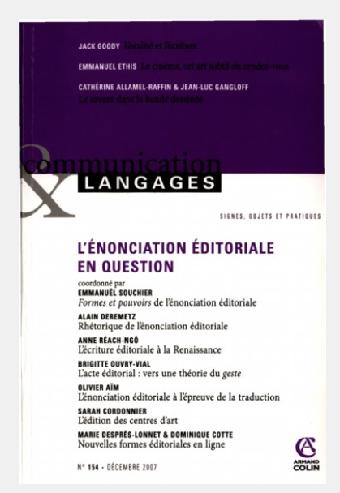<!-- .element: style="width:40%;float:right;margin-right:-1em;" -->

===

Proposée par Emmanuël Souchier, la théorie de l’énonciation éditoriale renvoie à « l’élaboration plurielle de l’objet textuel » (Souchier, 1998). Elle repose sur une attention à la matérialité du texte et à ses processus de co-construction « par toute instance susceptible d’intervenir dans la conception, la réalisation ou la production du Livre. » Née dans l’ordre des industries culturelles du texte et du livre, elle s’est déployée dans le champ des médias et concerne tous les processus de communication, notamment numériques.

Bcp de travaux, un article sur Moodle.

§§§§§§§§§§§§§§§§§§§§§§§§§§§§§§§§§§§§§§§§§§§§§

### Dostoïevski ou Dostoïevski ? 
#### Comprendre l'enjeu de "l'énonciation éditoriale"

>Archétype du roman psychologique, il est considéré comme l'une des plus grandes œuvres littéraires de l'Histoire. Le roman dépeint l'assassinat d’une vieille prêteuse sur gage et de sa sœur par Rodion Raskolnikov, ancien étudiant de Saint-Pétersbourg tombé dans la pauvreté, et ses conséquences émotionnelles, mentales et physiques sur le meurtrier. (Wikipédia)

<!-- .element: style="width:45%;float:left;margin-left:-1em; font-size:1.4rem; text-align:justify" -->

<!-- .element: style="width:40%;float:right;margin-right:-1em;" -->

===

*Crime et Châtiment* est probablement l’œuvre la plus célèbre de l’écrivain russe Fiodor Dostoïevski (1821-1881).

Voici la présentation du roman que l’on trouve dans les pages de l’encyclopédie Wikipédia : "Archétype du roman psychologique, il est considéré comme l'une des plus grandes œuvres littéraires de l'Histoire. Le roman dépeint l'assassinat d’une vieille prêteuse sur gage et de sa sœur par Rodion Raskolnikov, ancien étudiant de Saint-Pétersbourg tombé dans la pauvreté, et ses conséquences émotionnelles, mentales et physiques sur le meurtrier."

§§§§§§§§§§§§§§§§§§§§§§§§§§§§§§§§§§§§§§§§§§§§§
<!-- .slide: data-background-image="img/crime_chatimentPleiade2.jpg" data-background-size="contain" -->

===

L’ouvrage a connu plusieurs éditions dont l’une, en 1950, au sein de la prestigieuse bibliothèque de la Pléiade chez Gallimard – une collection qui consacre les plus grands écrivains de la littérature mondiale.

§§§§§§§§§§§§§§§§§§§§§§§§§§§§§§§§§§§§§§§§§§§§§
<!-- .slide: data-background-image="img/crime_chatimentActesNoirs.jpg" data-background-size="contain" -->

===

En 2016, les éditions Actes Sud ont proposé une réédition du chef d’œuvre, dans la collection « Actes noirs », avec une traduction d’André Markowicz.  

§§§§§§§§§§§§§§§§§§§§§§§§§§§§§§§§§§§§§§§§§§§§§
<!-- .slide: data-background-image="img/dosto-dosto.png" data-background-size="contain" -->

===

D'une édition à l'autre, on peut constater l'oeuvre subit des transformations.
Que vous évoque la Pleïade ? Qui la lit ? Combien coûte-t-elle ? QU'est-ce qu'on y publie ?
QUe vous évoque Actes Noirs ? Qui la lit ? Combien coûte-t-elle ? QU'est-ce qu'on y publie ?

Le terme même "évoquer" pose question : la légitimation s'appuie sur des critères parfois très subjectifs, qui sont le fruit d'une construction lente, et en partie latente. Une maison, par ailleurs, ne maîtrise pas toujours complètement sa force de légitimation.

§§§§§§§§§§§§§§§§§§§§§§§§§§§§§§§§§§§§§§§§§§§§§

### Dostoïevski, de la Pleïade à Actes Noir...
* Un glissement générique (du roman psychologique au roman noir)
* Un glissement symbolique (d'oeuvre de la littérature mondiale, du canon, à une oeuvre populaire)
* Un élargissement du public-cible
* Une provocation ? => une autre _idée_ du texte !

<!-- .element: style="font-size:1.6rem; text-align:justify" -->

===
Changement total de message que l'on fait porter à l'oeuvre : changement de public, changement de genre.

C'est cette question qu'il faut se poser : sur quels critères et quels principes s'édifie, s'entretient, mais également se saborde, la légitimité d'une institution éditoriale -- et avec elle la légitimité d'un texte, d'une oeuvre, d'un auteur ?

Cet exemple nous permet de mettre le doigt sur un élément essentiel de l'édition, conçue comme la mise en livre d'un texte : la mise en livre, c'est opérer une mise en forme, c'est donner une image au texte. Mais c'est aussi lui donner une légitimité et l'inscrire dans un horizon d'attente, horizon qui va s'adresser à certains lecteurs plus qu'à d'autres.

C'est dans un sens assez rassurant, car on peut identifier des facteurs matériels de légitimation du texte : son image, entendue comme sa forme éditoriale, graphique, sa mise en page.

Conscient de l'importance de l'image graphique du texte, le chercheur Emmanuel Souchier a proposé le concept d'énonciation édito, qui originellement cherchait à étudier la matérialité du texte, mais s'est étendu ensuite. 

§§§§§§§§§§§§§§§§§§§§§§§§§§§§§§§§§§§§§§§§§§§§§

#### Le concept d'énonciation éditoriale

Emmanuël Souchier, "L'image du texte pour une théorie de l'énonciation éditoriale", *Les cahiers de médiologie* 1998/2 (N° 6)

<!-- .element: style="width:45%;float:left;margin-right:-1em; font-size:1.4rem; text-align:right" -->

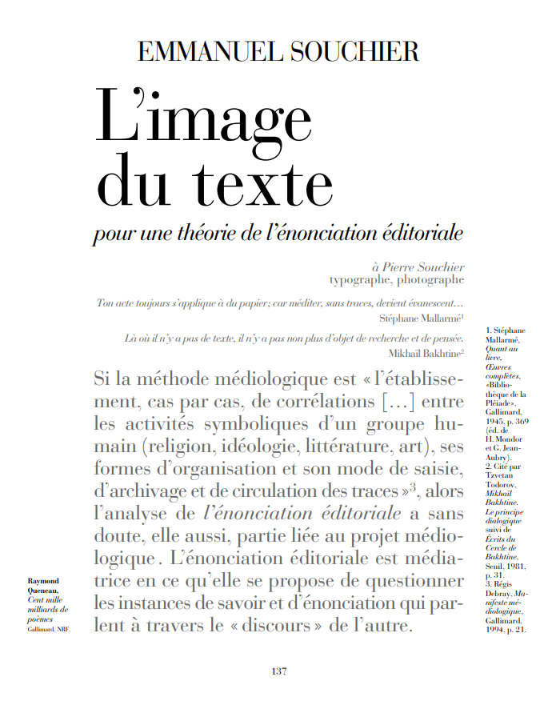<!-- .element: style="width:50%;float:right;margin-right:-1em;" -->

===

Le texte que j'ai déposé sur moodle est le suivant. Je vais en faire une explication ici, mais je vous encourage à le lire chez vous. 

§§§§§§§§§§§§§§§§§§§§§§§§§§§§§§§§§§§§§§§§§§§§§
<!-- .slide: data-background-image="img/" data-background-size="contain" -->

### "Énonciation éditoriale" : retour sur un paradoxe

>Proposer l’expression « énonciation éditoriale » est nécessairement faire œuvre d’hérésie au regard de la linguistique ou des études littéraires. D’un point de vue linguistique, le terme d’énonciation implique qu’il y ait un énoncé et un énonciateur. Or une mise en page n’est pas « une suite finie de mots » ou « de phrases », même si on peut par ailleurs défendre l’idée selon laquelle elle est au texte imprimé ce que la dispositio est à la rhétorique classique. En outre, l’énonciation est originellement définie comme un « acte individuel d’utilisation de la langue », l’énoncé étant « le résultat de cet acte », or l’« énonciation éditoriale » postule précisément une pluralité d’énonciateurs. Le point de vue littéraire qui calque son regard sur la linguistique assènera la même critique.

<!-- .element: style="font-size:1.4rem; text-align:justify" -->

===

Dans ce texte, Souchier revient sur le concept qu'il propose, et qui repose sur un paradoxe : énonciation éditoriale, ce sont deux termes qui ne devraient pas s'adjoindre. 

Sa perspective est communicationnelle ou médiologique : on convoque deux éléments, l'énonciation et l'édition, qui a priori sont antithétiques.

En effet, l'énonciation, c'est en littérature et en linguistique un concept qui relève du langage, de la parole, et c'est qui plus est un acte essentiellement individuel. Quand vous étudiez un texte littéraire et que vous en analysez l'énonciation, vous allez concrètement répondre à la question "qui parle à qui?". L’énonciation est l'acte individuel de production d'un énoncé par un énonciateur, adressé à un destinataire (l’énonciataire), dans certaines circonstances. C'est donc la situation de communication. Dans le cas d'un ouvrage, on aurait tendance à considérer que la situation énonciative se tisse entre l'auteur et son lecteur. 

Le terme "énonciation éditoriale" renverse donc le sens de ce qu'est en linguistique et en littérature l'énonciation.

>>Proposer l’expression « énonciation éditoriale » est nécessairement faire œuvre d’hérésie au regard de la linguistique ou des études littéraires. D’un point de vue linguistique, le terme d’énonciation implique qu’il y ait un énoncé et un énonciateur. Or une mise en page n’est pas « une suite finie de mots » ou « de phrases », même si on peut par ailleurs défendre l’idée selon laquelle elle est au texte imprimé ce que la dispositio est à la rhétorique classique. En outre, l’énonciation est originellement définie comme un « acte individuel d’utilisation de la langue », l’énoncé étant « le résultat de cet acte », or l’« énonciation éditoriale » postule précisément une pluralité d’énonciateurs. Le point de vue littéraire qui calque son regard sur la linguistique assènera la même critique.

§§§§§§§§§§§§§§§§§§§§§§§§§§§§§§§§§§§§§§§§§§§§§
<!-- .slide: data-background-image="img/dosto-dosto.png" data-background-size="contain" -->

===

Or pour Emmanuel Souchier, une situation énonciative se manifeste également non pas seulement dans le texte lui-même, mais dans sa matérialité : 
- sa forme graphique, sa mise en page, les choix de typo, de couverture, le discours d'escorte du livre, etc. 

L'énonciation éditoriale est ainsi différente pour nos deux versions de Crime et Châtiment.

 
§§§§§§§§§§§§§§§§§§§§§§§§§§§§§§§§§§§§§§§§§§§§§
<!-- .slide: data-background-image="img/" data-background-size="contain" -->

### La pluralité énonciative du texte

>Qu’on y songe seulement : auteur, editor, éditeur, directeur de collection, secrétaire d’édition, correcteur, illustrateur, maquettiste, graphiste, typographe, claviste, imprimeur, partenaires officiels ou mécènes… auxquels il conviendrait d’ajouter le fabricant de papier, le façonneur, le relieur, sans parler du libraire ou du diffuseur qui interviennent parfois en amont de la chaîne de production.

<!-- .element: style="font-size:1.7rem; text-align:justify" -->

===
[j’appelle editor le critique qui établit la genèse d’un texte, l’annote et le présente]

Le concept d'énonciation éditoriale est très fort, car il présuppose une désindividualisation de l'énonciation, qui n'est plus l'acte d'un seul locuteur, mais le résultat d'un ensemble d'interventions sur toute une chaîne de production.

Pour traduire : on considère qu'un livre (et le texte qu'il renferme), n'est plus seulement le fruit de l'intention d'un écrivain, mais le résultat d'un processus engageant une série d'acteurs de la chaîne éditoriale, chacun ayant l'occasion de laisser sa marque sur le livre :

>Qu’on y songe seulement : auteur, editor, éditeur, directeur de collection, secrétaire d’édition, correcteur, illustrateur, maquettiste, graphiste, typographe, claviste, imprimeur, partenaires officiels ou mécènes… auxquels il conviendrait d’ajouter le fabricant de papier, le façonneur, le relieur, sans parler du libraire ou du diffuseur qui interviennent parfois en amont de la chaîne de production.

Problème : les lecteurs n'ont que très peu conscience de cette polyphonie. Ils resteront souvent dans l'illusion d'un dialogue direct avec l'auteur. C'est tout l'enjeu (et l'injustice) de l'édition : les acteurs de la chaîne doivent se faire oublier...

L'énonciation éditoriale est donc à la fois une évidence : c'est elle qui permet au livre d'exister, et elle est en même temps invisible, c'est-à-dire transparente aux yeux des usagers qui ne s'interrogent finalement que très peu sur les conditions de production des livres, et plus largement sur leur matérialité. Le livre est l'un des médias les moins pensés par le grand public qui le consomme pourtant avec avidité. Impensé au sens premier : on n'en fait trop peu un sujet de connaissance, hormis dans le giron de l'Université. 

§§§§§§§§§§§§§§§§§§§§§§§§§§§§§§§§§§§§§§§§§§§§§
<!-- .slide: data-background-image="img/" data-background-size="contain" -->

### L'image matérielle du texte
* Penser la matérialité de l'écrit
* Réévaluer l'héritage théorique (post)structuraliste en reconsidérant le texte dans son inscription médiatique
<!-- .element: style="font-size:1.7rem; text-align:justify" -->

>L’énonciation éditoriale peut donc parfois être rendue visible par l’auteur, notamment lorsqu’il décide d’en faire l’une des données constitutives de son œuvre. (Emmanuel Souchier)
<!-- .element: style="font-size:1.7rem; text-align:justify" -->

===

Parce qu'il insiste sur l'image graphique du texte, le concept d'énonciation éditoriale encourage à repenser la **matérialité** du texte. Cette matérialité prend la forme, justement, d'une mise en forme : la mise en page, la typographie, le type et la qualité du papier, etc.

Penser cette matérialité du texte va plus ou moins à l'encontre de l'héritage des études littéraires, et notamment celui des structuralistes et post-structuralistes, qui ont prôné l'autonomie du texte, pas tant contre sa matérialité, mais contre une certaine conception de l'auteur (c'est le cas de Barthes, dans un texte très connu sur la mort de l'auteur, mais c'est aussi les travaux de Foucault).

Penser la matérialité du texte, et notamment sa graphie, n'est pas qu'une lubie d'éditeur. Il peut avoir du sens dès l'étape de production d'un texte par un auteur. En effet,

>L’énonciation éditoriale peut donc parfois être rendue visible par l’auteur, notamment lorsqu’il décide d’en faire l’une des données constitutives de son œuvre

§§§§§§§§§§§§§§§§§§§§§§§§§§§§§§§§§§§§§§§§§§§§§
<!-- .slide: data-background-image="img/federman2.png" data-background-size="contain" -->

===
Exemple Federman

§§§§§§§§§§§§§§§§§§§§§§§§§§§§§§§§§§§§§§§§§§§§§
<!-- .slide: data-background-image="img/federman1.png" data-background-size="contain" -->

§§§§§§§§§§§§§§§§§§§§§§§§§§§§§§§§§§§§§§§§§§§§§
<!-- .slide: data-background-image="img/" data-background-size="contain" -->

### Une élaboration plurielle du texte

>« Le concept d’énonciation éditoriale renvoie à l’élaboration plurielle de l’objet textuel. Il annonce une théorie de l’énonciation polyphonique du texte produite ou proférée par toute instance susceptible d’intervenir dans la conception, la réalisation ou la production du livre, et plus généralement de l’écrit. Au-delà, il intéresse tout support associant texte, image et son, notamment les écrans informatiques – étant entendu que tout texte est vu aussi bien que lu. »

<!-- .element: style="font-size:1.5rem; text-align:justify" -->

===

Ainsi, j'insiste avec Emmanuel Souchier sur la nécessité de désessentialiser le texte, pour le repenser dans son écosystème éditorial, et comme le résultat de cette production éditoriale impliquant des conditions matérielles + des compétences et corps de métiers variés.

>« Le concept d’énonciation éditoriale renvoie à l’élaboration plurielle de l’objet textuel. Il annonce une théorie de l’énonciation polyphonique du texte produite ou proférée par toute instance susceptible d’intervenir dans la conception, la réalisation ou la production du livre, et plus généralement de l’écrit. Au-delà, il intéresse tout support associant texte, image et son, notamment les écrans informatiques – étant entendu que tout texte est vu aussi bien que lu. »

De cette ultime définition, on retiendra la suivante : le texte est aussi bien "vu" que "lu". C'est tout le sens des couvertures d'ouvrage, par exemple.

§§§§§§§§§§§§§§§§§§§§§§§§§§§§§§§§§§§§§§§§§§§§§
<!-- .slide: data-background-image="img/" data-background-size="contain" -->

### L'objet livre comme énoncé

>L’une des fonctions premières de l’énonciation éditoriale est de donner le texte à lire comme activité de lecture (c’est sa dimension fonctionnelle, pragmatique ; on parlera alors de lisibilité). Dans un deuxième temps, elle s’inscrit dans l’histoire des formes du texte et par là même implique un certain type de légitimité ou d’illégitimité. L’énoncé de cette « énonciation » n’est donc pas le texte (le discours de l’auteur), mais la forme du texte, son image ; c’est le texte considéré comme objet concret et qui a été configuré à travers cette activité plurielle qu’est l’énonciation éditoriale.

<!-- .element: style="font-size:1.5rem; text-align:justify" -->

===

En proposant donc un déplacement de notre attention du contenu vers le support, ou plus exactement de l'environnement support du contenu (= le contenant),le concept d'énonciation éditoriale nous encourage à considérer la forme et la matérialité du livre comme des énoncés, et donc à en lire le sens.

L'énoncé, je le répète mais c'est important, ce n'est donc plus seulement ici le texte d'un auteur, mais c'est également son inscription matérielle.

§§§§§§§§§§§§§§§§§§§§§§§§§§§§§§§§§§§§§§§§§§§§§
<!-- .slide: data-background-image="img/" data-background-size="contain" -->

### Texte premier, texte second
>La fonction du « texte second » consiste à donner à lire le « texte premier », sa signification (la connotation) nous renvoie à l’idéologie littéraire et textuelle d’une époque donnée. Les signifiés de connotation sont les effets de légitimité textuelle liés aux usages qui se sont constitués au fil de l’histoire.

<!-- .element: style="font-size:1.5rem; text-align:justify" -->

#### Éditer, c'est travailler à l'élaboration de ce texte second.

===

Or cette inscription matérielle joue le rôle de "texte second", par rapport au texte premier (qui est le texte écrit par l'écrivain).

Être éditeur, être un membre de la chaîne éditoriale du livre, c'est travailler à l'élaboration de ce texte second.

§§§§§§§§§§§§§§§§§§§§§§§§§§§§§§§§§§§§§§§§§§§§§
<!-- .slide: data-background-image="img/dosto-dosto.png" data-background-size="contain" -->

===

Que s'est-il passé avec Dostoïevsky ? D'une édition à l'autre, le texte premier n'a pas bougé, mais le texte second s'est totalement réécrit. Et avec lui des critères de légitimité distincts se sont dessinés.

§§§§§§§§§§§§§§§§§§§§§§§§§§§§§§§§§§§§§§§§§§§§§
<!-- .slide: data-background-image="img/" data-background-size="contain" -->

### Vers une lecture littéraire **et** sémiotique

>Mais prendre en compte la dimension graphique, visuelle de l’écriture, et plus généralement de l’information écrite, implique un autre regard, une attention autre que celle dévolue d’ordinaire au texte. Ce regard fait du lecteur habituel un sémiologue attentif, car le texte ainsi considéré présente une résistance physique, matérielle, une présence sociale et idéologique qui s’expriment à travers l’histoire et la culture. C’est toute cette épaisseur de l’écrit que convoque la notion d’énonciation éditoriale.

<!-- .element: style="font-size:1.5rem; text-align:justify" -->

===

Évidemment, ce concept d'énonciation éditoriale appelle au développement de notre culture visuelle, médiatique, grpahique ou typographique, et même marketing.

>Mais prendre en compte la dimension graphique, visuelle de l’écriture, et plus généralement de l’information écrite, implique un autre regard, une attention autre que celle dévolue d’ordinaire au texte. Ce regard fait du lecteur habituel un sémiologue attentif, car le texte ainsi considéré présente une résistance physique, matérielle, une présence sociale et idéologique qui s’expriment à travers l’histoire et la culture. C’est toute cette épaisseur de l’écrit que convoque la notion d’énonciation éditoriale.

§§§§§§§§§§§§§§§§§§§§§§§§§§§§§§§§§§§§§§§§§§§§§

## Quelques applications du concept d'énonciation éditoriale
* La couverture (Joël Dicker)
* La typographie (Mallarmé, "Jamais un coup de dé n'abolira le hasard)
* L'énonciation éditoriale dans le processus de révision ortho-typographique
* Les outils

§§§§§§§§§§§§§§§§§§§§§§§§§§§§§§§§§§§§§§§§§§§§§

#### La couverture

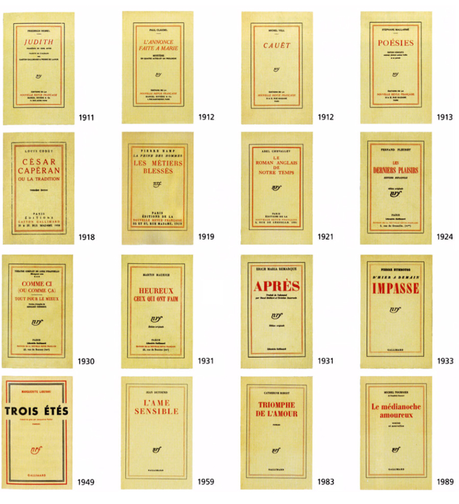<!-- .element: style="width:400px" -->

===

La couverture est un bon élément pour étudier l'énonciation éditoriale, dans ce qu'elle a aussi de culturel. 

Du blanc, du monochrome, pas d'illustration : en France, les maisons d'édition de littérature privilégient sobriété et homogénéité loin d’une tradition anglosaxonne qui conçoit la couverture comme une proposition graphique unique. Derrière cette spécificité française, une histoire de goût et de coût

L’emblématique “collection Blanche” de Gallimard voit le jour en 1911, avec un fond crème, un lettrage rouge et noir et deux légers filets. Un style qui inspirera bien d’autres maisons. Le design épuré est gage de sérieux, dans un pays où élégance et bon goût riment souvent avec sobriété. On fait confiance au texte pour ne pas tomber dans des compromissions mercantiles. Une sorte d’élitisme à la française qui distingue la “littérature blanche” d’autres styles considérés comme plus populaires, oubliables, voire jetables. Des styles pour lesquels on ajoute de la couleur pour “attirer le chaland”.

En matière d'édition de littérature, les codes couleur sont immuables et discrets ; l'illustration semble réservée à certains genres : le polar, la SF, le roman de gare, les best-sellers… En Angleterre ou aux États-Unis, l’effort graphique est ancré de plus longue date, avec parfois même une logique de couverture unique, conçue sur mesure pour chaque livre.

§§§§§§§§§§§§§§§§§§§§§§§§§§§§§§§§§§§§§§§§§§§§§
<!-- .slide: data-background-image="img/dickerCourvertures.png" data-background-size="contain" -->

===

 Après le décès de son éditeur Bernard de Fallois en 2018 et la fermeture de la maison d’édition du même nom un peu plus tard, en 2021, l’écrivain Joël Dicker a en effet pris la décision de s’auto-éditer, faute d’avoir été sollicité selon lui par une nouvelle maison d’édition. 

Sa maison s'appelle désormais Rosie&Wolfe.

 Observez les couvertures des ouvrages de Joël Dicker, chez Le Fallois puis chez Rosie & Wolfe. En quoi l’énonciation éditoriale assure-t-elle ici une relation de continuité entre les deux maisons ?

Couverture blanche et reproduction d’un tableau d’Edward Hopper, science de l’intrigue, la formule a fait ses preuves depuis 2012. Cette année-là, La Vérité sur l’affaire Harry Quebert (5 millions d’exemplaires vendus dans le monde) a remis d’aplomb une petite maison vieillissante, les Editions de Fallois.
Trois ans plus tard, Le Livre des Baltimore a confirmé l’addiction du public aux aventures de Marcus Goldman, héros récurrent qui ressemble beaucoup à son créateur, Joël Dicker. Dans L’Affaire Alaska Sanders, troisième tome de la trilogie, qui sortira le 10 mars, ce double de papier continue de surfer sur le succès. Tableau de Hopper (Gas) sur fond blanc, patronyme de l’auteur qui claque en rouge, rien n’a bougé sur le nouveau Dicker. Sauf le nom de l’éditeur, orné d’un petit loup bondissant, son animal fétiche.

§§§§§§§§§§§§§§§§§§§§§§§§§§§§§§§§§§§§§§§§§§§§§

### La typographie

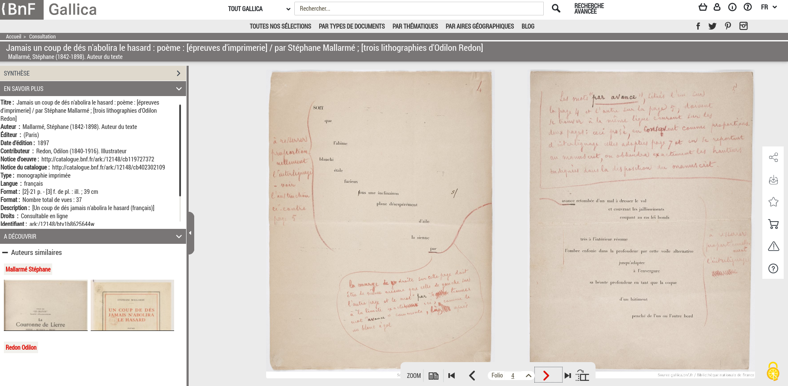

===

Emmanuël Souchier évoque le cas de Mallarmé sans s'y attarder (il développe plutôt son discours autour du cas Queneau), mais je voudrais rapidement vous raconter l'histoire éditoriale du "Coup de dés" car elle me semble essentielle pour comprendre les enjeux de l'image du texte, mais également celle de l'influence éditoriale.

« Jamais un coup de dé n’abolira le hasard » est un texte réputé complexe, auquel des ouvrages entiers ont été consacrés. Le texte déploie une sorte de prose poétique difficile à déchiffrer (il est question d'un naufrage, notamment), déployée dans l'espace médiatique du livre et de la page, ce qui n'est pas sans rappeler à l'occasion l'esthétique du calligramme.

Dans l'imaginaire collectif, mais aussi chez les spécialistes, une idée circule, selon laquelle ce texte renfermerait un code secret, que les chercheurs ou amateurs ont tenté de percer depuis des années.

Publié en 1897, « Jamais un coup de dé n’abolira le hasard » est l'aboutissement du projet esthétique de Mallarmé, qui publie le texte à la fin de sa vie. Il s'agit du dernier gros chantier poétique de l'écrivain, qui ne verra jamais son oeuvre achevée.

Le mythe du sens caché de l'oeuvre est d'autant plus forte que c'est une oeuvre "inachevée". L'histoire éditoriale de ce texte a par ailleurs soutenu ce mythe.

§§§§§§§§§§§§§§§§§§§§§§§§§§§§§§§§§§§§§§§§§§§§§
<!-- .slide: data-background-image="img/cosmopolis-may-1897-cover.png" data-background-size="contain" -->

===

• 1ère édition dans la Revue Cosmopolis. 1897 On est 2 ans avant la mort de Mallarmé - un poète en fin de vie, qui a eu le temps de nourrir son projet.
Mallarmé n'en était pas complètement satisfait. Il n'aimait pas du tout le travail typographique réalisé : la police choisie n'était pas la bonne, etc.
Il a du coup travaillé sur une autre édition, son édition idéale, le projet Vollard (du nom de l'éditeur)

§§§§§§§§§§§§§§§§§§§§§§§§§§§§§§§§§§§§§§§§§§§§§
<!-- .slide: data-background-image="img/fullsizeoutput_3ac3.jpeg" data-background-size="contain" -->

§§§§§§§§§§§§§§§§§§§§§§§§§§§§§§§§§§§§§§§§§§§§§
<!-- .slide: data-background-image="img/epreuve.png" data-background-size="contain" -->

===

• 2e édition sous forme indépendante, par Vollard, en collaboration avec l'imprimeur Firmin-Didot. http://www.coupdedes.com/rubrique4.html
En fait, il s'agit d'un projet commencé avant la publication dans *Cosmopolis* (même si cette dernière propose la première publication officielle) : 1896 - XXXX. Vollard en est l'initiateur.

De cette édition, qui était presque parfaite aux yeux du poète, nous n'avons que ces épreuves : en fait le projet n'a jamais abouti à une publication.

Ce projet tombe ensuite dans l'oubli pendant plus de 50 ans. Le projet Firmin-Didot, pas le poème évidemment, qui poursuit son destin d'oeuvre majeure, intégrant rapidement le canon littéraire.

§§§§§§§§§§§§§§§§§§§§§§§§§§§§§§§§§§§§§§§§§§§§§
<!-- .slide: data-background-image="img/nrf.png" data-background-size="contain" -->

===

Pendant des dizaines d'années, les rééditions (notamment celle de la NRF qui fait autorité) vont se caler sur la version cosmopolis.

NOTE : La création de La NRF, «revue mensuelle de littérature et de critique», est due à un groupe de six écrivains dont André Gide est, depuis le tournant du siècle, le chef de file. Elle connaîtra une audience exceptionnelle, renouvelant dans des sommaires équilibrés, tour à tour composés par Gide et le cercle des fondateurs, puis par Jacques Rivière et Jean Paulhan, les perspectives du roman, du théâtre, de la critique et de la poésie contemporains. Toutes les grandes tendances et voix de l’entre-deux-guerres y seront représentées, «sans prévention d’école ni de parti». De la revue naîtront en 1911 les Éditions de la NRF, placées sous la responsabilité de Gaston Gallimard, et dont Paul Claudel, André Gide et Saint-John Perse seront les premiers auteurs. 

Personne (sauf quelques proches de Mallarmé ou rares collectionneurs et libraires) n'ont eu connaissance des épreuves du projet Vollard, et tous les commentateurs cherchent à déchiffrer le poème sur l'édition héritée de Cosmopolis.

§§§§§§§§§§§§§§§§§§§§§§§§§§§§§§§§§§§§§§§§§§§§§
<!-- .slide: data-background-image="img/piersonPtyx.png" data-background-size="contain" -->

===
La deuxième partie du XXe et le début du XXIe siècle ont vu la multiplication des éditions du Coup de Dés, dans une grande diversité de formats (de luxe ou de poche) et de typographies, certaines s’éloignant de la composition originelle au point de la rendre méconnaissable.

Il faut dire que l'on est encore peu sensibles aux conditions matérielles de production et de diffusion des textes.

Parallèlement, La même période sera aussi celle d’un lent retour aux sources et de la révélation progressive du chef-d’œuvre inconnu oublié dans les tiroirs des collectionneurs.

Il faudra attendre 1993 pour qu’un jeu complet d’épreuves soit présenté au public, sous vitrine, et reproduit intégralement dans le catalogue de l’exposition « Poésure et Peintrie » à l’ancien hospice de la Vieille Charité, à Marseille.

• Depuis 20 ans: les reconstitutions
Michel Pierson & Ptyx, 2004, qui utilise la Didot, comme le souhaitait mallarmé pour qui la page devait être conçue comme une toile de peinture, sur laquelle venait s'inscrire le texte.

§§§§§§§§§§§§§§§§§§§§§§§§§§§§§§§§§§§§§§§§§§§§§
<!-- .slide: data-background-image="img/comparatif_mallarme3.png" data-background-size="contain" -->

===

Pourquoi est-ce aussi important ?

Jamais un coup de dé n'abolira le hasard doit se lire de manière sémantique, mais aussi graphique, comme une peinture, une calligraphie, mais aussi une partition de musique (la graisse des lettres imitant les rondes sur lesquelles le lecteur doit insister).

§§§§§§§§§§§§§§§§§§§§§§§§§§§§§§§§§§§§§§§§§§§§§
<!-- .slide: data-background-image="img/comparatif_mallarme4.png" data-background-size="contain" -->

§§§§§§§§§§§§§§§§§§§§§§§§§§§§§§§§§§§§§§§§§§§§§
<!-- .slide: data-background-image="img/" data-background-size="contain" -->

Quqlues enjeux typographiques contemporains
* Lisibilité des écrits d'écran
* Polices "libres de droit"
* Invention d'une typographie qui réponde aux enjeux linguistiques contemporains (typo épicène)

===

§§§§§§§§§§§§§§§§§§§§§§§§§§§§§§§§§§§§§§§§§§§§§
<!-- .slide: data-background-image="img/typographie-inclusive-ecriture-tristan-bartolini-graphiste-3.jpg" -->

===
tristan-bartolini

§§§§§§§§§§§§§§§§§§§§§§§§§§§§§§§§§§§§§§§§§§§§§

#### La préparation de copie 
* La préparation de copie désigne le processus de révision ortho-typographique  
* Étape décisive de la chaîne éditoriale, elle incarne l'invisibilisation de l'énonciation éditoriale puisqu'un travail réussi ne doit justement "pas se voir" (texte parfait)
* Elle repose sur un protocole de travail codifié et **évolutif** selon les techniques éditoriales

<!-- .element: style="width:45%;float:left;margin-left:-1em; font-size:1.4rem; text-align:justify" -->

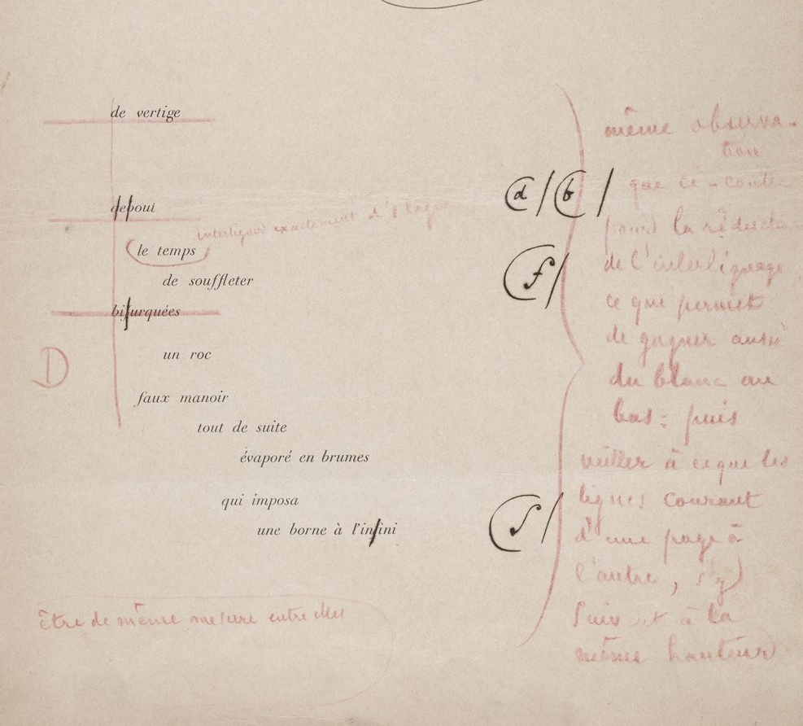<!-- .element: style="width:40%;float:right;margin-right:-1em;" -->

===

Emmanuel Souchier relie l’énonciation éditoriale à deux caractéris­tiques essentielles : d’une part la pluralité des instances qui interviennent dans la production du livre (outre l’auteur, l’éditeur et le cas échéant le diffuseur, il faut compter avec l’imprimeur, le distributeur et le libraire) ; d’autre part, le fait que les marques laissées par ces différentes instances tendent à devenir **invisibles** (1998a : 140 ; v. aussi Souchier, 1998b : 172). 

Pour illustrer cette invisibilisation, j'ai choisi de vous parler de la révision et préparation de copie : c'est ainsi que l'on qualifie une série d'actions sur le texte, avant et après sa mise en page (cad lorsqu'il en est à l'état d'épreuve), afin d'enlever les erreurs de langue, mais également régler les problèmes de mise en forme.

Le travail de révision (d'abord révision d'épreuves, puis préparation de copie et révision de fichiers), est un élément essentiel du travail éditorial. Besoin des réviseurs : compétences linguistiques ++, mais également connaissances des règles de mise en forme et de présentation. 

Il s'agit d'une tâche généralement opérée par des personnes rigoureuses, minutieuses, et dotées d'une excellente connaissance de la langue et du travail de mise en page... 

Dans une grande structure éditoriale, les préparateurs de copie = un corps de métier à part, dont c'Est la seule fonction. 

Dans les autres structures, c'est à l'éditeur que revient le travail de préparation de copie. 

§§§§§§§§§§§§§§§§§§§§§§§§§§§§§§§§§§§§§§§§§§§§§
<!-- .slide: data-background-image="img/Memento-signes-correction.svg" data-background-size="contain" -->

===

L'histoire de la préparation de copie -- ou révision ortho-typo -- est très intéressante car elle illustre ce dont j'ai parlé plus tôt : la professionnalisation de l'édition, et avec elle l'élaboration de modèles toujours plus complexes, mais aussi l'outillage des réviseurs. 

Historiquement, aux débuts de l’imprimerie (16e-17e-18e), la correction était souvent effectuée par deux correcteurs : le premier lisait un exemplaire de l’épreuve à haute voix, le second effectuait les corrections au moyen de signes conventionnels. C'était donc un travail collaboratif. 

Plus tard le correcteur travaille seul, apposant ses corrections à l’encre rouge en suivant les codes conventionnels : une marque signale le ou les caractères à changer dans le corps du texte, et la correction à apporter est mentionnée en marge.

Les règles de révision se sont de plus en plus formalisées pour aboutir à la création d'un code de révision, que l'on apprenait dans nos études.

On peut voir ici une manifestation de l'invisibilisation du travail éditorial, travail exigeant qui disparaît totalement. Si une préparation de copie est bien faite, alors le texte ne comprend aucune faute. S'il y a des fautes, alors la préparation de copie a été de mauvaise qualité, et donc le processus éditorial (raté) saute aux yeux !

§§§§§§§§§§§§§§§§§§§§§§§§§§§§§§§§§§§§§§§§§§§§§

<!-- .element: style="width:300px" -->

===

Ici un exemple de préparation de copie. 

Le processus d'invisibilisation de l'énonciation éditoriale ne doit pas cacher l'importance qu'elle joue dans la légitimation d'une publication : un texte qui a été travaillé ++ est forcément de meilleure qualité.

On pourra même suggérer l'hypothèse selon laquel plus le travail édito est invisibilisé, plus l'énonciation éditoriale est muette, plus la qualité d'un ouvrage ou d'une publication est grande. 

§§§§§§§§§§§§§§§§§§§§§§§§§§§§§§§§§§§§§§§§§§§§§

#### La préparation de copie avec Word
* Un système d'automatisation de la révision
* Les commentaires et le *track-changes*
* Des logiciels assistants de correction (Antidote, Prolexis)

<!-- .element: style="width:45%;float:left;margin-left:-1em; font-size:1.4rem; text-align:justify" -->

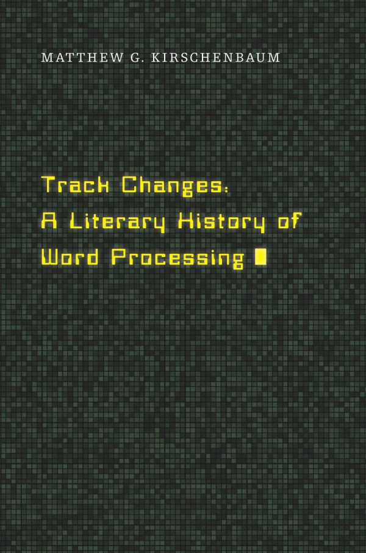<!-- .element: style="width:20%;float:right;margin-right:-1em;" -->

===

Avec l'informatique, la prépa de copie a connu une importante révolution, avec un principe d'autonomisation, d'une part de la communication entre le préparateur de copie et l'auteur (grâce au track changes ou suivi des modifs), d'autre part avec l'utilisation de correcteurs automatiques. 

Logiciel Word : track changes.

Ouvrage de de Matthew Kirschenbaum, propose une archéologie des logociels de traitement de texte, pour « raconter et décrire en termes matériels et historiques comment les ordinateurs, et plus particulièrement le traitement de texte, sont devenus partie intégrante de la création littéraire et de l'écriture littéraire ».

§§§§§§§§§§§§§§§§§§§§§§§§§§§§§§§§§§§§§§§§§§§§§

<!-- .element: style="width:40%;float:left;margin-right:-1em;" -->

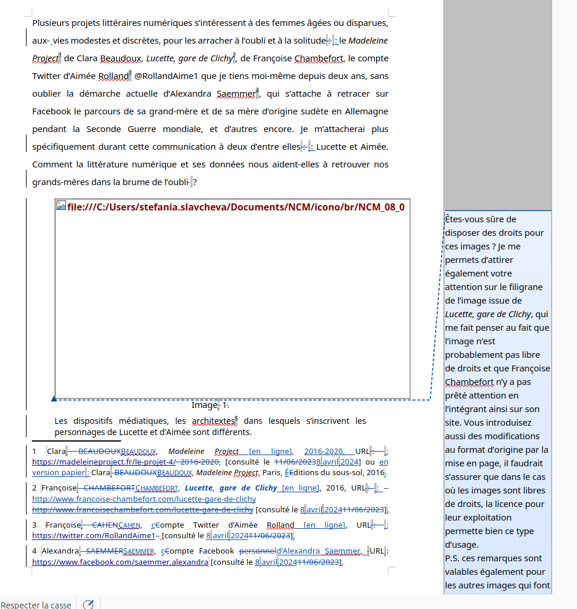<!-- .element: style="width:60%;float:right;margin-right:-1em;" -->

===

Matthew Kirschenbaum explique comment les logiciels de traitement de texte ont permis de voir directement ce que l'on écrivait en temps réel (vs. les machines à écrire où tout s'inscrivait qd on arrivait à la fin = retour chariot). 

Il explique aussi comment le fait de pouvoir copier-coller a changé le rapport des écrivains à la matérialité du texte, avec la possibilité de le manipuler : matérialité de plus en plus labile.

Il montre que le track changes a permis également de manipuler le texte davantage, mais également de produire un commentaire, une glose autour de ce texte. 

Il explique enfin qu'aujourd'hui, il existe un monopole du logiciel de traitement de texte, qui a imposé sa manière de travailler.

§§§§§§§§§§§§§§§§§§§§§§§§§§§§§§§§§§§§§§§§§§§§§

>Avec l’informatique, le texte de l’ouvrage confié par l’auteur à l’éditeur n’est pas ressaisi mais directement mis en pages : les épreuves ont complètement changé de sens : on ne demande plus à l’auteur de corriger les fautes de l’imprimeur, mais de se relire pour se corriger lui-même ou pour valider les corrections introduites par l’éditeur. Lorsqu’un auteur relit les épreuves de son texte, les coquilles apparaissent beaucoup mieux que sur sortie d’imprimante, a fortiori que sur écran.

<!-- .element: style="font-size:1.7rem; text-align:justify" -->

Marc Arabyan, Introduction au dossier "L'énonciation éditoriale" paru dans *Semen*, 41 (2016)

<!-- .element: style="font-size:1.7rem; text-align:right" -->

===

>Avec l’informatique, le texte de l’ouvrage confié par l’auteur à l’éditeur n’est pas ressaisi mais directement mis en pages : les épreuves ont complètement changé de sens : on ne demande plus à l’auteur de corriger les fautes de l’imprimeur, mais de se relire pour se corriger lui-même ou pour valider les corrections introduites par l’éditeur. Lorsqu’un auteur relit les épreuves de son texte, les coquilles apparaissent beaucoup mieux que sur sortie d’imprimante, a fortiori que sur écran.

L'informatique n'aura fait qu'automatiser un processus éditorial. 

À méditer quand on sait qu'aujourd'hui, des expériences sont menées afin d'intégrer l'IA à la préparation de copie. 

§§§§§§§§§§§§§§§§§§§§§§§§§§§§§§§§§§§§§§§§§§§§§

#### Préparation de copie et automatisation
* Logiciels de correction et révision : Antidote, ProLexis
* Intégration de l'intelligence articicielle

<!-- .element: style="width:45%;float:left;margin-left:-1em; font-size:1.4rem; text-align:justify" -->

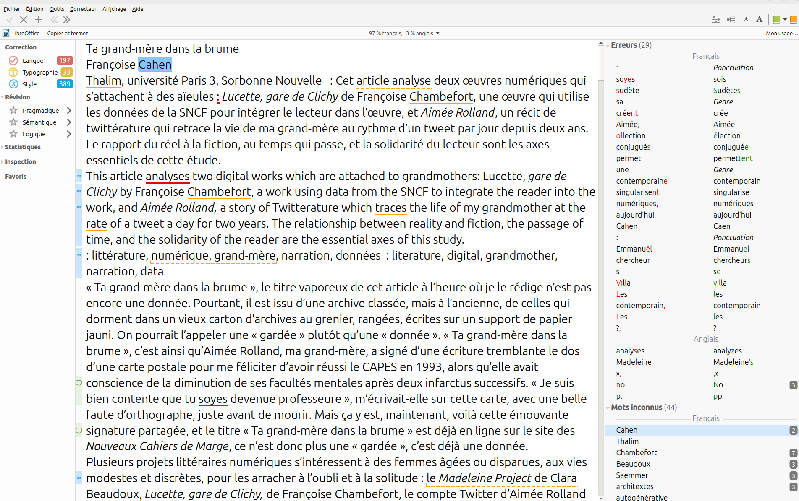<!-- .element: style="width:45%;float:right;margin-right:-1em;" -->

===

Des logiciels de révision existent.

§§§§§§§§§§§§§§§§§§§§§§§§§§§§§§§§§§§§§§§§§§§§§

#### L'énonciation éditoriale dans les écrits d'écrans

* Le dispositif numérique : un acteur supplémentaire de l'énonciation éditoriale
* Comment l'outil numérique change le rapport à la matérialité de l'écriture et de sa mise en forme ?
* Les "écrits d'écrans" : du code à l'interface, une nouvelle manière de concevoir l'énonciation éditoriale

<!-- .element: style="font-size:1.6rem" -->

===

La question de l'énonciation éditoriale se dote de toute nouvelles problématique depuis l'émergence du texte à l'écran, cad depuis l'irruption de l'informatique.

Attention, On envisagera les enjeux de la remédiation du livre, à travers une approche design en particulier. Mais dès aujourd'hui on peut aborder la question de l'énonciation éditoriale dans les écrits d'écran.

Je ne vais pas parler ici d'édition numérique, mais de ce qu'on appelle la PAO : publication assistée par ordi, qui est aujourd'hui la norme. 

Pour Souchier, Le dispositif numérique = un acteur supplémentaire de l'énonciation éditoriale

L'outil numérique a changé notre rapport à la matérialité de l'écriture et de sa mise en forme. On travaille davantage les copiés-collés. 

§§§§§§§§§§§§§§§§§§§§§§§§§§§§§§§§§§§§§§§§§§§§§

#### L'énonciation éditoriale au temps de la PAO : les monopoles impensés
* PAO = Publication assistée par ordinateur (ou prépresse)
* Des logiciels qui se sont imposés dans les écoles et les pratiques : Microsoft, Adobe 
* Une énonciation éditoriale décidée / formatée par des monopoles industriels

<!-- .element: style="width:45%;float:left;margin-left:-1em; font-size:1.4rem; text-align:justify" -->

===

PAO = Publication assistée par ordinateur

Ces procédés étaient essentiellement manuels jusque dans les années 80-90. On est donc sur des technologies récentes, qui ont conduit au développement d'une informatisation massive de la production des livres, avec ce que cela entraîne en termes de compétences.

>La publication assistée par ordinateur se fait à l'aide de logiciels spécialisés, appelés logiciels de mise en page ou logiciels de PAO, semblables à des logiciels de traitement de texte ordinaires, mais où un accent particulier a été mis sur la disposition des textes et des images sur une page.

§§§§§§§§§§§§§§§§§§§§§§§§§§§§§§§§§§§§§§§§§§§§§
<!-- .slide: data-background-image="img/CouvIndesign-CreerCouv-1.jpg" data-background-size="contain"-->

===

Monopole de la marque.

Exemple : InDesign de la société Adobe.

FOrmat de fichier non interopérable, obligation d'acheter l'outil.

§§§§§§§§§§§§§§§§§§§§§§§§§§§§§§§§§§§§§§§§§§§§§
<!-- .slide: data-background-image="img/scribus1.jpg" data-background-size="contain"-->

===

Une alternative : Scribus, qui propose une alternative libre, que je vous encourage donc à prendre en main. QUESTION D'INDÉPENDANCE.

>Scribus n’est pas fait pour écrire directement du texte, la rédaction pourrait se révéler fastidieuse. Mieux vaut préparer ses textes dans une application spécifique, comme les logiciels de traitement de texte dont c’est le rôle premier (Word par exemple).

>Un gros avantage, c’est que Scribus peut importer différents formats de texte, mais surtout des fichiers OpenOffice, la référence bureautique du monde libre. Les styles présents dans le document sont récupérés par Scribus et viennent s’ajouter ou remplacer les styles existants dans la mise en page.

§§§§§§§§§§§§§§§§§§§§§§§§§§§§§§§§§§§§§§§§§§§§§

#### Deux philosophies : les logiciels WYSIWYG ou WYSIWYM

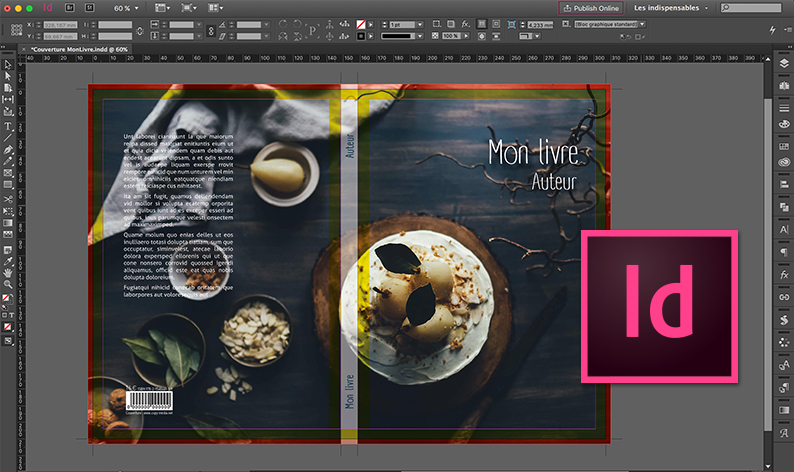<!-- .element: style="width:50%;float:left;margin-right:-1em;" -->

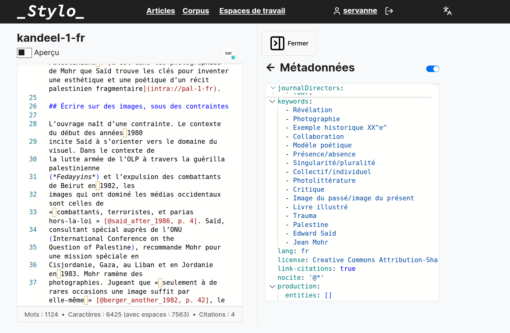<!-- .element: style="width:50%;float:right;margin-right:-1em;" -->

===

On sera sur du logiciel WYSIWYG (What you see is what you get), c'est à dire qui présentent une interface graphique dans laquelle vous pouvez organiser les éléments entre eux.

Dans quelques semaines, nous vous présenterons dans les cours d'édition (dans ce CM + dans le TD) un outil éditorial basé sur une solution WYSIWYM (What you see is what you mean), c'est-à-dire sur du sémantique. Je vous parlerai en effet de la création du logiciel Stylo, dans le cadre de la refonte d'une revue en ligne (la revue SP). Ceux d'entre vous qui sont en TD d'édition, vous aurez l'occasion de jouer avec l'outil directement.

L'objectif de la PAO reste le print : l'impression. 

§§§§§§§§§§§§§§§§§§§§§§§§§§§§§§§§§§§§§§§§§§§§§

### Briser la "chaîne" du livre ?

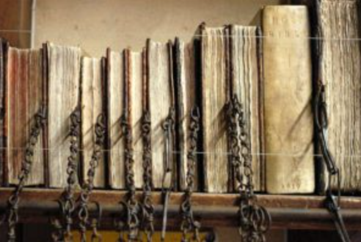<!-- .element: style="width:300px" -->

===

Chaîne = chaîne => protocole qui finit par enfermer les éditeurs et les auteurs dans des process, des solutions outillées qui ne leur conviennent pas toujours. 

Des alternatives existent. 

§§§§§§§§§§§§§§§§§§§§§§§§§§§§§§§§§§§§§§§§§§§§§

#### La solution *SSP*  [teaser]

* Un écosystème de publication collaboratif, où interviendront *tous* les acteurs de la chaîne jusqu'à la fin du processus éditorial (BAT)
* Un format pivot à partir duquel on produira l'ensemble des formats nécessaires à la production du livre, quelle que soit sa forme médiatique (imprimé, numérique)

<!-- .element: style="width:45%;float:left;margin-left:-1em; font-size:1.4rem; text-align:justify" -->

 <!-- .element: style="width:45%;float:right;margin-right:-1em;" -->

===

On parlera plus tard de la fabrique numérique, avec des nouveaux process de travail. 

La solution SSP (single source publishing = publication à une source) est : 

* Une solution technique : Un format pivot à partir duquel on produira l'ensemble des formats nécessaires à la production du livre, quelle que soit sa forme médiatique (imprimé, numérique)

* Une solution philosophique qui transforme les pratiques éditoriales et les relations entre les acteurs de la chaîne : Un écosystème de publication collaboratif, où interviendront *tous* les acteurs de la chaîne jusqu'à la fin du processus éditorial (BAT)

§§§§§§§§§§§§§§§§§§§§§§§§§§§§§§§§§§§§§§§§§§§§§

## Conclusion 
Le concept d'énonciation éditoriale souligne combien la part éditoriale du texte, sa réalité formelle, n’est plus envisagée comme une médiation neutre mais bien comme une pratique énonciative à part entière. Le travail éditorial, en transformant le texte en livre, ne contente pas de transmettre : elle produit du sens, elle valorise, dévalorise, construit un horizon d'attente. L'énonciation éditoriale renvoie par ailleurs au paradoxe de l'éditeur, tiraillé entre une invisibilisation nécessaire (il n'est pas l'auteur) et une exigence de qualité qui requiert une manipulation profonde du texte. Dans le contexte de l'informatisation de l'édition -- qui n'est qu'une étape supplémentaire dans l'automatisation des tâches de l'éditeur -- l'énonciation éditoriale fait émerger des enjeux de pouvoir liés à la question du formatage et à l'émergence de nouveaux acteurs de l'édition qui viennent bouleverser les équilibres (GAFAM). 

<!-- .element: style="font-size:1.4rem" -->

