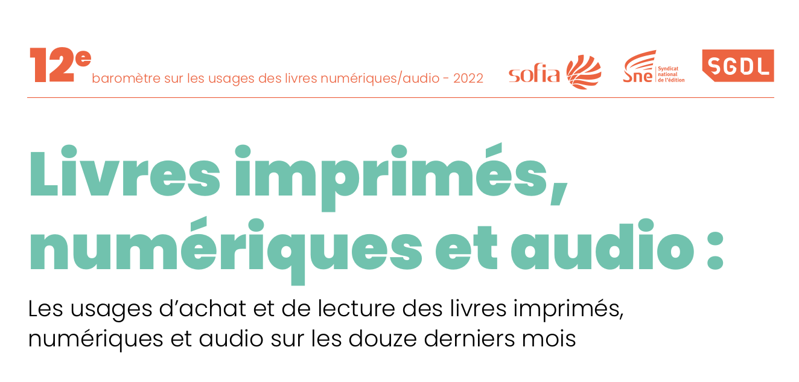

# Que signifier éditer ? 

§§§§§§§§§§§§§§§§§§§§§§§§§§§§§§§§§§§§§§§§§§§§§

## Retour aux fondamentaux : la fonction éditoriale
* Production
* Diffusion
* Légitimation

===

On peut alors reconnaître trois fonctions essentielles : la production, la circulation, la validation des contenus.

Je vais en donner ici un très bref descriptif, puis nous les envisagerons une par une à la lumière des développements historiques de cette fonction mais également des problématiques contemporaines qui leur sont associées.

La production renvoie à l’ensemble des dispositifs dans leurs aspects humains, institutionnels et techniques qui concourent à la création des contenus livresques. Si la paternité des oeuvres revient bien évidemment à l’auteur, il ne faut pas sous-estimer le rôle des éditeurs (*editor* et *publisher*), à qui revient la responsabilité d’opérer un choix parmi de nombreux manuscrits reçus et de décider ce qui doit être publié... ou pas. Leur rôle d’autorité dans la chaine éditoriale traditionnelle est donc essentiel.
Attention, l’éditeur n’est pas pour autant un prescripteur. À l’origine, il cherche surtout à garantir la transmission d’un savoir, ou d’une culture.
La fonction éditoriale doit aussi, de manière plus pratique, assurer la bonne mise en forme des contenus en vue de leur publication. Ce qui signifie concrètement : garantir la qualité linguistique et syntaxique du texte, mais aussi prendre en charge ou superviser le processus technique de fabrication du livre, depuis le design de la mise en page jusqu’à l’impression du livre.

Le second aspect de la fonction éditoriale consiste à assurer la distribution matérielle et la mise en marché du livre. Cette mission de diffusion se mène sur plusieurs fronts à la fois. Évidemment, l’éditeur doit avoir choisi et déterminé le public des lecteurs et analysé les besoins de ce lectorat précis : dans quel contexte le livre sera-t-il lu ? Le lecteur voudra-t-il le conserver dans sa bibliothèque ? Voudra-t-il le prêter ? L’annoter ? La diffusion comprend ainsi une part de réflexion sur le livre lui-même en tant qu’objet.

Enfin, la fonction éditoriale vient garantir les contenus publiés en s’assurant (et surtout en assurant le lecteur) de leur fiabilité et de leur qualité. Il s'agira bien souvent de mettre en place des processus de validation, plus ou moins transparent d'ailleurs, afin de garantir la qualité, la valeur des contenus. L’éditeur devient de fait un gage de légitimité : traditionnellement, un écrivain gagne son autorité en étant publié par un éditeur, alors que l’auto-publication est mal vue. À l’époque numérique, cette idée est de plus en plus mise à mal.

Analyser ces trois fonctions permet de comprendre à quoi sert fondamentalement l'édition, qui s'est professionnalisée au cours du temps et en particulier à partir du 18e, pour s'interroger ensuite sur la façon dont les technologies numériques réagencent le processus en le transformant.

Il faut bien comprendre en fait que la fonction éditoriale - qui a été prise en charge en grande partie par des maisons d'édition dans les derniers siècles - ne leur est pas réservée par définition.

%%%%%%%%%%%%%%%%%%%%%%%%%%%%%%%%%%%%%%%%%%%%%

## La fonction de production

§§§§§§§§§§§§§§§§§§§§§§§§§§§§§§§§§§§§§§§§§§§§§

## La fonction de production
* Choisir et produire des contenus
* Actions de commande / de sélection / d'organisation
* Réflexion sur la production matérielle

===

>En premier lieu, l'édition a une fonction de choix et de production des contenus.

>C'est la différence la plus évidente entre un contenu édité et un contenu non édité. Entre le manuscrit dans le tiroir de l'auteur et le livre sur l'étagère d'une librairie ou d'une bibliothèque, il y a eu un processus de choix et de mise en forme qui distingue radicalement les deux objets.

>En quoi consiste exactement ce processus ? Il s'agit d'une sélection parmi plusieurs contenus existants : une sélection basée sur (1) la qualité ou sur (2) des exigences de marché ou encore -- plus souvent -- sur un mélange des deux.

Éditer signifie décider quel contenu est "digne" d'être rendu accessible à un public. À questionner : qu'est-ce qui est "digne", et qu'est-ce qu'on range sous ce terme de "dignité" ? On voit qu'on déborde ici déjà sur la fonction de légitimation, mais puisqu'il est question du choix préalable à tout travail éditorial, creusons cette question :
- ce qui est digne = ce qui est intéressant ? Ce qui a un intérêt pour le public : des contenus pratiques (parmi les premiers textes édités, on retrouve des manuels de philosophie), des contenus esthétiques (qualité littéraire et poétiques), des contenus sacrés (bible, etc)
- ce qui est digne = ce qui va de fait trouver un public -- des premiers enjeux de diffusion entre les érudits de l'Antiquité et du Moyen-Âge, on va se diriger aujourd'hui vers ce qui va vendre. Best-sellers etc. On a jamais autant peu publiés de jeunes/nouveaux auteurs. Éditer, c'est pourtant aussi produire des nouvelles idées, des nouveaux textes. Publier ce qui n'a jamais été déjà publié.

>Depuis plusieurs siècles - ou, plus précisément, depuis le XV siècle -, cette sélection a été le plus souvent garantie par des maisons d'édition : les auteurs leur proposent des manuscrits parmi lesquels elles choisissent ceux qui leur semblent valoir la peine d'être publiés. Mais ce mécanisme de sélection peut être différent : par exemple, une maison d'édition peut demander à des auteurs de produire un texte qui n'existe pas, commanditer un livre sur un sujet qu'elle considère comme important ou potentiellement lucratif.

Et avant l'apparition des maisons d'édition, ce choix était réservé à des instances complètement différentes : par exemple un mécène qui décidait de financer un auteur pour qu'il produise des textes.

Parmi les plus grandes et plus célèbres oeuvres de la littérature, notamment celles qui précèdent l'avènement de l'édition moderne au XIXe, on retrouve de nombreuses commandes : Virgile a par exemple composé l'*Enéide* à la demande de l'empereur Auguste, qui souhaitait construire une épopée à la gloire de ses ancêtres pour asseoir son pouvoir politique et son statut d'imperator.

§§§§§§§§§§§§§§§§§§§§§§§§§§§§§§§§§§§§§§§§§§§§§

* Éditeur (définition TLFI)
> (1.) « Personne qui fait paraître un texte après l’avoir établi »

===

Cette dimension de production n'est donc pas du tout l'apanage des éditeurs modernes. Elle est même certainement la définition fondamentale de l'éditeur historique -- un éditeur qui se distingue totalement du commerçant, voire de l'homme d'affaire, qu'il a pu devenir de nos jours.

Si je lis encore aujourd'hui la définition d'éditeur dans le dictionnaire, la toute première définition est la suivante : « Personne qui fait paraître un texte après l’avoir établi »

Définition Éditer est alors synonyme d’ « établir » un texte en vue de sa publication. Au sens strict, établir un texte = travailler à partir de ses différentes versions existantes, afin de reconstituer - ou de constituer tout court - la version la plus optimale possible. L’édition vient aussi désigner, dans ce cas, le travail de présentation, d’annotation, de commentaire du texte.

§§§§§§§§§§§§§§§§§§§§§§§§§§§§§§§§§§§§§§§§§§§§§
<!-- .slide: data-background-image="img/Porphyry.jpg" data-background-size="contain" -->

===

Exemple de cet éditeur ancien : Porphyre.

Ce philosophe grec, qui a vécu au IIIe siècle après J-C, fût en effet l'un des premiers et des plus importants éditeurs d’Aristote. Son travail éditorial le plus connu porte sur les *Catégories* d'Aristote, un traité d'ontologie (qu'est-ce que le monde, le réel, la nature des choses).

Problème des textes d'Aristote : ce n'étaient pas des livres au sens où on l'entend nous aujourd'hui. DÉjà, ce n'était pas du codex, mais plutôt du volumen, ces rouleaux en papyrus (le payrus étant friable, on de pouvait pas le plier, simplement le rouler). C'est plus tard, à partir du IIe siècle après JC, avec le développement d'autres techniques telles que le parchemin, que le codex, ce livre au format que l'on connait, va émerger. On parle souvent de révolution du livre avec le numérique, mais il n'en est pas à sa première révolution : l'invention du codex, puis de l'imprimerie, marquent également des changement de paradigme très fort.

Autre problème : le texte, déjà à l'époque de Porphyre, est parvenu en morceaux, en plusieurs morceaux (copies de copies) présentant des différences.

Au 3è siècle, Porphyre décide donc d'éditer les Catégories pour les rendre plus lisible par un public contemporain (Aristote = 4e avant JC, Porphyre est 3e siècle après JC), et pour mettre de l'ordre dans la diversité des versions. Pour faciliter cette lisibilité, il va donc ajouter une introduction, un commentaire, mais également une modélisation graphique des fameuses catégories présentées par Aristote.

§§§§§§§§§§§§§§§§§§§§§§§§§§§§§§§§§§§§§§§§§§§§§
<!-- .slide: data-background-image="img/porphyre.JPEG" data-background-size="contain" -->

===

L’arbre de Porphyre, comme on l’appelle donc, se présente sous la forme d'un schéma en arborescence, qui figure de trois colonnes de notions : la colonne du milieu (le “tronc”) est consacrée aux séries du genre et de l’espèce. De part et d’autre de ce “tronc”, deux colonnes (les “branches” de l’arbre) exposent les différences.

Grâce à cette visualisation, il est possible de subordonner les genres et les espèces sous des genres supérieurs, afin de mettre en place un système de classification visuel efficace. En faisant l’effort de synthétiser les connaissances du monde pour en révéler l’organisation et les diffuser auprès d’un public plus large dans un objectif de transmission et de réappropriation, l’arbre de Porphyre a donc participé à la construction du concept encyclopédique qui sera surtout développé à la Renaissance. L'arbre de Porphyre est donc une édition des catégories d'Aristote, qui se sert d'un système éditorial et des potentialités de l'écrit pour proposer une interprétation à la fois graphique et sémantique d'un texte de logique.

On insistera sur le travail du texte comme matière, qui va être modelée pour épouser la forme de l'ouvrage, du codex. L'histoire de Porphyre démontre à merveille combien le texte n'est rien dans un travail d'édition, au sens premier = établissement du texte. Cet établissement comprend évidemment tout une part du travail qui existe encore aujourd'hui : la relecture destinée à vérifier la cohérence du texte (pas de répétition, par d'erreur, de personnage qui changerait de nom, de contradiction), vérifier sa correction orthographique et syntaxique, tout le travail de mise en page, etc. Il s'agit donc d'un travail de fond, mais également de forme.

Éditer un texte, c'est penser dès la première minute son incarnation dans un objet-livre.

§§§§§§§§§§§§§§§§§§§§§§§§§§§§§§§§§§§§§§§§§§§§§

## En résumé
Éditer signifie d'abord choisir et produire. Cette fonction éditoriale primordiale renvoie à la définition historique de l'éditeur (qui se rapproche aujourd'hui de l'éditeur scientifique ou du philologue), celle d'établissement du texte en vue de sa publication. Il ne s'agit donc pas seulement d'un travail sur le fond du texte, mais également d'une conceptualisation de sa forme livresque.

<!-- .element: style="font-size:1.5rem; text-align:justify" -->

## Et maintenant ?

===

Le choix et la production sont donc toujours la première fonction de l'édition. Éditer signifie d'abord choisir et produire.

Cette fonction éditoriale primordiale renvoie à la définition historique de l'éditeur (qui se rapproche aujourd'hui de l'éditeur scientifique ou du philologue), celle d'établissement du texte en vue de sa publication. Il ne s'agit donc pas seulement d'un travail sur le fond du texte, mais également d'une conceptualisation de sa forme livresque.

Il est évident que les changements techniques dus aux technologies numériques ont un impact sur cet aspect de
l'édition. Pour le dire de manière très radicale : a-t-on encore besoin d'éditeurs pour produire aujourd'hui une publication ?
Je propose déjà une distinction entre édition et publication. Publication = rendre public.

Quelques éléments de réflexion -- et de provocation -- que je laisse ici en suspend car nous aurons l'occasion d'y revenir dans les semaines suivantes.

§§§§§§§§§§§§§§§§§§§§§§§§§§§§§§§§§§§§§§§§§§§§§
<!-- .slide: data-background-image="img/wattpad.png" data-background-size="contain" -->

===
Wattpad

Certes, uniquement publi en ligne, mais relation directe écrivain - lecteur

§§§§§§§§§§§§§§§§§§§§§§§§§§§§§§§§§§§§§§§§§§§§§
<!-- .slide: data-background-image="img/kindleDirectPublishing.png" data-background-size="contain" -->

===
Amazon
Instance de production d'un objet livresque numérique.
Avec option POD.

§§§§§§§§§§§§§§§§§§§§§§§§§§§§§§§§§§§§§§§§§§§§§
<!-- .slide: data-background-video="img/espressoBookMachine.mp4" data-background-size="contain" -->

===
Expresso book machine

POD (print on demand)

De manière générale, l'auteur reprend en charge la fonction éditoriale : c'est le cas avec le principe d'autoproduction / autopublication des textes.

Cela fait écho à une certaine lassitude de nombreux auteurs, qu'ils soient débutants ou même confirmés (et c'est là que c'est très intéressant, car on a une communauté qui renonce au service proposé par l'éditeur), lassitude vis-à-vis des éditeurs, ou plus généralement d'un système éditorial qui a creusé des inégalités, et dans lesquels de nombreux auteurs ne se reconnaissent plus.

%%%%%%%%%%%%%%%%%%%%%%%%%%%%%%%%%%%%%%%%%%%%%
<!-- .slide: data-background-image="img/" data-background-size="contain" -->

## La fonction de diffusion

§§§§§§§§§§§§§§§§§§§§§§§§§§§§§§§§§§§§§§§§§§§§§

## La fonction de diffusion
* Rendre visible les contenus
* Adresser un texte, un contenu à quelqu'un
* Médier les contenus, via leur publicisation
* Créer un texte second (discours d'escorte) au texte premier (ex : l'oeuvre littéraire)

===

Reprenons l'exemple du manuscrit dans le tiroir de l'auteur pour identifier une dernière fonction de l'édition, une fonction qui semble évidente : celle de la diffusion des contenus. Le manuscrit dans le tiroir n'est pas diffusé : voilà pourquoi on renvoie à l'image du tiroir. Le manuscrit est donc invisible.

Mais l'invisibilité n'est pas la seule caractéristique qui distingue le manuscrit du livre : justement parce qu'il est
dans le tiroir, le manuscrit ne s'adresse à personne, n'est pour personne.

La fonction de diffusion confère donc d'une part de la visibilité et de l'autre une adresse : elle accomplit un travail de médiation entre le producteur du contenu et le destinataire, le lecteur. La fonction éditoriale a pour mission de créer une relation entre le producteur du contenu et son lecteur.

§§§§§§§§§§§§§§§§§§§§§§§§§§§§§§§§§§§§§§§§§§§§§
<!-- .slide: data-background-image="img/kwakkek.jpg" data-background-size="contain" -->

===

Je commencerai peut-être par le principe de visibilité, qui touche à l'édition commme réalisation médiatique et matérielle.

Dans l'histoire de l'édition, ou de la fonction éditoriale, avant le sacre  de l'éditeur moderne, donc, cette relation entre l'éditeur (compris comme le producteur du livre) et le lecteur, a parfois été directe et exclusive, sans intermédiaire. Je parle ici d'une époque où la figure de l'éditeur correspondait au copiste : avant l'imprimerie, lorsque l'on copiait à la main les textes.

Chaque exemplaire était alors une version unique, conçue pour les besoins particuliers d'un lecteur.
L'historien du livre Erik Kwakkel en fait mention dans ces travaux, assimilant la tâche du copiste à celui d'un architecte, qui agencerait le texte dans le livre pour correspondre à des usages singuliers.

§§§§§§§§§§§§§§§§§§§§§§§§§§§§§§§§§§§§§§§§§§§§§

>Readers, in turn, preferred their books – and the pages in them – to be formatted in certain ways because they planned to use them for performing particular tasks: to educate or be educated (teachers and students), to entertain or to be entertained (minstrels and courtiers), or to gather a body of information and consult it (scholars, preachers, physicians, lawyers). How and where words were placed on the page – their size and script, and their location – were important considerations in this process of turning the book into a tool that was up to the task. Indeed, it can be argued that a page’s design was (and is) key to a book’s success.

<!-- .element: style="font-size:1.5rem; text-align:justify" -->

Erik Kwakkel, "THE ARCHITECTURE OF THE MEDIEVAL PAGE", 2018.
<!-- .element: style="font-size:1.5rem; text-align:justify" -->

===

Selon Kwakkel, "les lecteurs qui passaient commande au scribe / copiste demandaient à ce que la page soit organisée en fonction de l'utilisation qu'ils allaient faire du livre : - éduquer ou être éduqués (enseignants et étudiants), - divertir ou divertir (ménestrels et courtisans), - ou rassembler un corpus d’informations et le consulter (universitaires, prédicateurs, médecins, avocats).
Ces usages du livre déterminaient le design de la page : Comment et où les mots ont été placés sur la page - leur taille et leur emplacement - étaient des considérations importantes dans ce processus de transformation du livre en un outil à la hauteur de la tâche. En fait, on peut affirmer que le design d’une page est essentiel au succès d’un livre."

Votre livre était donc conçu non pas selon un modèle éditorial faisant autorité (ce qui a été mis en place avec l'imprimé et la production mécanique -- reproductibilité non seulement du texte et de la mise en page), mais selon l'usage que l'acheteur, le lecteur, ferait de son livre. Conception qui, étonnament, peut en partie revenir aujourd'hui avec des options de POD ou de livre numérique.

§§§§§§§§§§§§§§§§§§§§§§§§§§§§§§§§§§§§§§§§§§§§§

## Connaître son public
* Distinguer la figure du lecteur (concept littéraire) du marché des lecteurs
* Le livre = un produit culturel

===

Cela étant dit, on ne doit pas réduire la fonction de diffusion au fait de rendre matériellement disponible un contenu - il n'est pas seulement question de distribution (dans les librairies, notamment) et de publicisation (dans les journaux, dans le métro).

Le fait de diffuser ne se limite pas à cette action matérielle. Il s'agit également d'identifier un lectorat, d'analyser ses besoins, ses compétences, ses désirs, ses pratiques et de faire en sorte que le contenu lui soit **adressé**.

Un contenu est édité quand il est édité **pour** quelqu'un. En ce sens, la fonction de diffusion empiète en partie sur la fonction de production : le choix d'un titre d'un livre, par exemple, de son format, de sa mise en forme, mais aussi de son langage relève d'une fonction de diffusion.

La diffusion matérielle du contenu, sa distribution, dépend de ce premier aspect qu’est l’adresse. C'est à partir de l'identification d'un lectorat spécifique que l’on peut ensuite déterminer un mode concret de distribution qui répondra à la question : où peut-on trouver le lectorat visé ? Quels sont ses usages et ses
pratiques ?

Une difficulté pour les littéraires : distinguer la figure du lecteur du marché des lecteurs. La figure du lecteur = instance idéale et idéalisée par le texte et son auteur. On pense ici à la qualité littéraire exclusivement, à la relation qui se tisse entre un auteur et un lecteur, comme entre un émetteur et un destinataire.

Sauf qu'au milieu de cette relation se trouve le livre : le livre comme produit culturel certes, mais produit d'abord. Il est important de comprendre que ce qui fait vendre un livre, ce ne sera pas seulement le texte et ce message que l'écrivain veut faire passer à son lecteur.

La lecture et tout ce qu'elle comprend (les modes d'acquisition des textes / livre, leur mode de consommation) renvoient à des  comportements qui n'ont cessé d'évoluer avec le temps.

§§§§§§§§§§§§§§§§§§§§§§§§§§§§§§§§§§§§§§§§§§§§§

### Pour qui éditons-nous aujourd'hui ?
* Imprimé, numérique, audio : des secteurs en concurrence ?
* Librairies indépendantes : la crise ?

===

Il est important de noter combien les éditeurs se doivent de comprendre les besoins et les habitudes de leurs lecteurs. Nous n'en sommes plus à l'époque des copistes qui pouvaient produire du livre sur mesure, et heureusement : l'édition n'a jamais cessé de vouloir se démocratiser. C'est pourquoi elle a toujours aimé les évolutions technologiques : l'invention de l'imprimerie, la presse à caractères mobiles, la technique du brochage, l'émergence du format poche, etc. qui ont facilité la démocratisation, via une production plus grande pour un coût optimal. Les développements numériques ne sont qu'une nouvelle étape de cette histoire technique de l'édition.

Mais nous avons besoin de comprendre les attentes des lecteurs et leurs comportements qui ne cessent d'évoluer.

§§§§§§§§§§§§§§§§§§§§§§§§§§§§§§§§§§§§§§§§§§§§§

#### Les études de marché

Études annuelles de la Sofia-SGDL-SNE

- édition imprimée
- édition numérique (pas de précision sur les formats)
- édition audio

<!-- .element: style="width:45%;float:left;margin-left:-1em; font-size:1.4rem; text-align:justify" -->

<!-- .element: style="width:45%;float:right;margin-right:-1em;" -->

===
Ces stats sont produites par la Sofia (Organisme de gestion collective
dédié exclusivement au secteur du livre), en partenariat avec le SNE et la SGDL.

L'intérêt de cette étude, c'est qu'elle pointe de suite les trois grandes formes médiatiques que prennent aujourd'hui le livre :
- son modèle / forme imprimée
- son modèle / forme numérique (pas de précision sur les formats)
- son modèle / forme audio

Je ne rentrerai pas dans le détail de l'étude, mais je pointe votre attention sur quelques points de l'étude comparative.

§§§§§§§§§§§§§§§§§§§§§§§§§§§§§§§§§§§§§§§§§§§§§
<!-- .slide: data-background-image="img/barometre_sgdl_sofia_23-2401.png" data-background-size="contain" -->

source : Baromètre La Sofia-SNE-SGDL

<!-- .element: class="source" -->

===

Pas d'apocalypse : des lecteurs toujours plus nombreux (vs idée de la crise et de la décadence).

>Si le nombre de lecteurs reste globalement stable
tous supports de lecture confondus, le livre audio
numérique connaît une progression significative
avec 800 000 nouveaux utilisateurs sur la période.
Sur l’ensemble de la population, 25% des Français de 15 ans et plus ont déjà lu un livre numérique, 15%
d’entre eux ont déjà écouté un livre audio physique
et 12% un livre audio numérique. À noter que les livres
audio, physiques et numériques, attirent de plus en
plus le lectorat masculin

§§§§§§§§§§§§§§§§§§§§§§§§§§§§§§§§§§§§§§§§§§§§§
<!-- .slide: data-background-image="img/barometre_sgdl_sofia_23-2404.png" data-background-size="contain" -->

source : Baromètre La Sofia-SNE-SGDL

<!-- .element: class="source" -->

===

Pas de crise :

>Le nombre de livres achetés a connu une augmentation, tous supports confondus. Le budget consacré à la
pratique de la lecture a lui aussi progressé : les lecteurs sont 37% à déclarer dépenser plus de 100 euros par an
pour les livres imprimés, 18% pour les livres numériques, 13% pour les livres audio physiques et 19% pour les livres
audio numériques. Enfin, cette année encore, le nombre de lecteurs achetant plus de 5 livres par an est en hausse.

Le livre reste une valeur sûre, objet souvent offert.
Pdt la pandémie, le marché du livre s'est particulièrement bien porté, avec cependant des conséquences perverses : les valeurs sûres l'ont emporté avec l'achat en ligne. Le fait d'avoir des librairies fermées, notamment lors des deux premiers confinements, a empêché une pratique du flanage et donc la vente de nouveaux auteurs ou d'auteurs peu connus.

S'est ainsi accentuée une tendance à ne publier que des auteurs déjà confirmée. De quoi alimenter la question : à qui s'adresse-t-on ? À un lectorat de fidèles. Ou alors à celui qui se fie à la critique, aux prix.

§§§§§§§§§§§§§§§§§§§§§§§§§§§§§§§§§§§§§§§§§§§§§
<!-- .slide: data-background-image="img/barometre_sgdl_sofia_23-2408.png" data-background-size="contain" -->

===

Qu'est-ce qu'on lit ?
>La littérature reste la catégorie la plus lue pour 91%
des lecteurs de livres imprimés et 83% des lecteurs
de livres numériques, 73% des auditeurs de livres
audio physiques et 83% des auditeurs de livres audio
numériques. La jeunesse et l’éveil sont particulièrement
écoutés sur les livres audio physiques.

§§§§§§§§§§§§§§§§§§§§§§§§§§§§§§§§§§§§§§§§§§§§§
<!-- .slide: data-background-image="img/equipements-2021.png" data-background-size="contain" -->

source : Baromètre La Sofia-SNE-SGDL

<!-- .element: class="source" -->

===

Comportement de lecture vis-à-vis des médias ou supports médiatiques :
La concurrence entre les médias n'en est pas une.
Phénomène relativement récent : le livre audio devient un phénomène de plus en plus fort.

>La diversification des formats se poursuit : 3,7 millions de lecteurs, soit 7% de la population ont utilisé les quatre supports pour lire ou écouter un livre.

>La lecture est toujours très majoritairement considérée avant tout comme une activité de plaisir
(plus de 80% des personnes interrogées, tous supports
confondus), réalisée principalement au domicile.
S’agissant du livre audio numérique, les notions de
parentalité et de praticité sont particulièrement
mises en avant. Les livres sont souvent écoutés avec
les enfants et en voiture.

>Le fait que seuls 52% (-5 pts) des auditeurs de livres
audio physiques en aient écouté un il y a moins d’un
an, traduit vraisemblablement le début d’un véritable
basculement du livre audio physique au profit du
livre audio numérique

§§§§§§§§§§§§§§§§§§§§§§§§§§§§§§§§§§§§§§§§§§§§§
<!-- .slide: data-background-image="img/lieux-achat-2021.png" data-background-size="contain" -->

source : Baromètre La Sofia-SNE-SGDL

<!-- .element: class="source" -->

===

>Librairies et grandes surfaces spécialisées sont les
points de vente physiques préférés des Français
pour l’achat des livres imprimés et des livres audio
physiques.

>À noter que chez les lecteurs âgés de 15 à 24 ans,
40% ont utilisé le Pass culture pour acheter des livres
imprimés, 41% des livres numériques, 43% des livres
audio physique et 54% des livres audio numériques.

>Le nombre d’emprunteurs est en augmentation : 48%
(+5 pts) des Français déclarent avoir déjà emprunté
un livre en bibliothèque (tous supports confondus) :
- 50% des lecteurs de livres imprimés (+7 pts) en
empruntent en bibliothèque (plus de 20 par an pour
1 emprunteur sur 5) ;
- 49% des auditeurs de livres audio physiques en
empruntent également en bibliothèque (+ 8 pts)

§§§§§§§§§§§§§§§§§§§§§§§§§§§§§§§§§§§§§§§§§§§§§
<!-- .slide: data-background-image="img/barometre_sgdl_sofia_23-2409.png" data-background-size="contain" -->

source : Baromètre La Sofia-SNE-SGDL

<!-- .element: class="source" -->

§§§§§§§§§§§§§§§§§§§§§§§§§§§§§§§§§§§§§§§§§§§§§
<!-- .slide: data-background-image="img/barometre_sgdl_sofia_23-2410.png" data-background-size="contain" -->

source : Baromètre La Sofia-SNE-SGDL

<!-- .element: class="source" -->

§§§§§§§§§§§§§§§§§§§§§§§§§§§§§§§§§§§§§§§§§§§§§

## En résumé...
La fonction de diffusion comporte l'adresse, la distribution et tous les dispositifs qui tendent à rendre un contenu matériellement accessible et visible. Cette fonction comprend de fait l'ensemble des actions de publicisation du contenu. Il est important, pour un éditeur littéraire en particulier, d'apprendre à opérer la distinction entre le lecteur idéal supposé par toute oeuvre littéraire, une figure idéale / idéalisée notamment par l'auteur, de la communauté des lecteurs réels.

<!-- .element: style="font-size:1.5rem; text-align:justify" -->

## Et maintenant ?

§§§§§§§§§§§§§§§§§§§§§§§§§§§§§§§§§§§§§§§§§§§§§
<!-- .slide: data-background-image="img/livreAccesLibre.png" data-background-size="contain" -->

===

Il y aurait beaucoup à dire sur les nouvelles problématiques de la fonction de diffusion. En communication, on étudiera les nouvelles manière de publiciser les oeuvres par le biais des réseaux sociaux -- où on verra que la fonction éditoriale est d'ailleurs de plus en plus assumée par l'auteur lui-même.

Je me concentrerai aujourd'hui sur les enjeux soulevés par les possibilités de diffusion du format numérique, vs format imprimé.

Diffusion numérique : changement de paradigme liée à la nature même de l'objet numérique, qui par définition est un fichier que l'on peut copier sans coût. Un livre imprimé ne peut être dupliqué : vous pouvez le photocopier, mais c'est fastidieux. Ce ne sera pas le même objet, par ailleurs. Il y a encore une idée de la copie unique, même si l'imprimerie fabrique des objets en série. Avec le format numérique il faut bien comprendre que nous avons au contraire le même fichier qui se duplique et se transmet à l'infini ou presque, très facilement.

Cette situation engendre une remise en question profonde de ce qu'est le livre en tant que produit culturel.  Avec des problématiques des variées.

Bcp d'oeuvres dans le domaine public font par exemple l'objet d'une diffusion en libre accès -- sans coût d'achat (mais avec évidemment des coûts de production). Les modèles économique du libre accès sont encore à trouver.

§§§§§§§§§§§§§§§§§§§§§§§§§§§§§§§§§§§§§§§§§§§§§
<!-- .slide: data-background-image="img/DRM.png" data-background-size="contain" -->

===

Sur la plateforme ebookgratuits.com, on retrouve par exemple un appel aux dons, et ce logo qui aura peut-être retenu votre attention "lecteurs contre les DRM".

DRM = digital rights management.

Les DRM renvoient aux dispositifs pouvant s'appliquer à tous types de supports numériques physiques (disques, DVD, PDF, logiciels…) ou de transmission (télédiffusion, services Internet…) grâce à un système d'accès conditionnel.

* Ces dispositifs techniques ou logiciels peuvent viser à :

- restreindre la lecture du support à une zone géographique prévue (par exemple les zones des DVD, mais aussi certaines émissions de TV en streaming lorsque vous êtes à l'étranger) ;
- restreindre la lecture du support à du matériel spécifique (par exemple les versions smartphone ou tablette : Apple est passé maître là-dedans, avec des ebook que l'on ne peut lire que sur Ipad) ;
- restreindre la lecture du support à un constructeur ou vendeur (afin de bloquer la concurrence : c'est le cas du Kindle d'Amazon) ;
- restreindre ou empêcher la copie privée du support (transfert vers un appareil externe - idem pour Kindle) ;
- restreindre ou verrouiller certaines fonctions de lecture du support (désactivation de l'avance rapide sur certains passages d'un DVD). Très utile pour obliger l'exposition aux annonces publicitaires ;
- identifier et tatouer numériquement toute œuvre et tout équipement de lecture ou enregistrement (pour faciliter le pistage des copies non autorisées, mais surtout empêcher la personnalisation et donc le contrôle d'une technologie, par exemple empêcher l'installation d'un autre système d'exploitation sur un ordinateur).

Chez certains vendeurs, comme Amazon et son système Kindle, nous ne sommes donc pas propriétaire d'un objet, de l'objet-livre. Nous avons payé un accès. Impossible de prêter le livre, par exemple. Et difficile de le lire hors de l'application dédiée.

Je m'arrête là temporairement, mais je résume : dans le cas des publications en libre accès, la fonction éditoriale se trouve donc grandement transformée, et surtout de plus en plus floue. Les nouvelles possibilités, offertes par le web, rendent les frontières de la fonction éditoriale floues: la désintermédiation ainsi que le déplacement et l'éclatement de ces fonctions font qu’aujourd’hui, une reconstruction de ces procédés est à faire. Le glissement de ces fonctions s’est fait des éditeurs vers les auteurs et les lecteurs.

%%%%%%%%%%%%%%%%%%%%%%%%%%%%%%%%%%%%%%%%%%%%%

## La fonction de validation / légitimation

§§§§§§§§§§§§§§§§§§§§§§§§§§§§§§§§§§§§§§§§§§§§§

## La fonction de validation / légitimation
* Conférer une valeur symbolique (qualitative ?) au texte transformé en livre
* Transformer l'écrivain en auteur
* Donner des gages de garantie au lectorat

===

>Le dernier aspect qui distingue de façon évidente le manuscrit dans le tiroir de
l'auteur du livre publié est la valeur symbolique que nous attribuons à ce dernier. Un
livre a une valeur symbolique plus importante qu'un manuscrit. Pourquoi ?
Justement à cause de la médiation effectuée par la fonction éditoriale : celle-ci
garantit la qualité du contenu édité et le différencie par ce biais du contenu non
édité. C'est ce que nous appelons une fonction de légitimation. Cette légitimation est
rendue possible grâce au travail de sélection et de production du contenu qui a donc
été révisé, formaté et retravaillé par une instance ayant le pouvoir symbolique d'en
garantir la qualité.

>Dépendamment de l'instance éditoriale, cette légitimation aura
un poids et une forme différents, mais dans tous les cas la fonction de légitimation
donne au contenu une fiabilité qui est une garantie pour son lectorat. Par exemple,
dans le cas d'un roman, le fait qu'il soit publié par une maison d'édition est une
garantie de qualité littéraire; dépendamment de la maison d'édition, cette garantie
sera de forme différente : la signature de la maison d'édition nous donnera des
indices sur le type de littérature dont il s'agit et sur la qualité littéraire que l’on peut
attendre.

§§§§§§§§§§§§§§§§§§§§§§§§§§§§§§§§§§§§§§§§§§§§§

### Sur quels critères la fonction de légitimation est-elle fondée ?
* Des critères quantifiables (travail éditorial, prix littéraires, ancienneté...)
* Des critères intangibles (imaginaire collectif et individuel, publicité, etc.)

===

La fonction de légitimation est passionnante, car elle si elle a beau s'appuyer sur des critères qui se veulent objectifs (par exemple, une lecture en double aveugle, un travail de révision du texte, des prix littéraires, etc.), elle fait finalement appel, fondamentalement, à un imaginaire à la fois collectif et individuel, à des critères finalement très subjectifs et qui, s'ils ont été vrais à un moment donné, peinent parfois à se confirmer dans le temps.

Qu'est-ce qui fait qu'une maison comme Les Éditions de Minuit est plus prestigieuse que les éditions de ta mère ? Il y aura bien sûr une histoire attachée à une maison, son ancienneté, ses auteurs, le nombre de prix reçus. Mais la valeur d'une maison, et de ses publication, n'est pas si aisément quantifiable.

Sans compter que, désormais, certaines publications sont prises dans un écosystème médiatique : effets de buzz ou bad-buzz, célébrités, sont à l'origine de succès d'édition qui ne s'expliquent pas autrement que par la célébrité médiatique.

§§§§§§§§§§§§§§§§§§§§§§§§§§§§§§§§§§§§§§§§§§§§§
<!-- .slide: data-background-image="img/encreDA.jpg" data-background-size="contain" -->

===

Dans l'histoire : le privilège du  Roy
Fonction d'Autorisation au sens premier du terme : donner le droit de publication.

Après l’invention de Gutemberg, l’imprimerie est métier neuf, qui ne s’intégra pas d’emblée dans un cadre préétabli, mais qui entre en liaison avec les anciens métiers du livre :
    • copistes (on disait alors écrivains),
    • enlumineurs,
    • libraires
qui passèrent tous progressivement de la fabrication et du trafic des manuscrits au commerce du livre imprimé.
L'imprimerie à sa naissance se caractérise par l'alliance des humanistes et des hommes d'affaires. Les imprimeurs du xve siècle ne sont plus simplement des « publieurs », mais des proto-éditeurs, qui prennent la responsabilité de la production et la diffusion des textes en marge d’une activité artisanale ou marchande bien plus rémunératrice : l’imprimerie ou la librairie. C’est-à-dire que, finalement, l’édition est une activité connexe, un peu obligée en marge de l’activité rémunératrice qui consiste à imprimer des livres et les vendre.
On ne peut pas vivre de l’édition : on vit de l’imprimerie ou, à la rigueur, de la vente (pour les libraires - quoique, dans la plupart des villes de province, le libraire est aussi le papetier voire le mercier, qui consacre une partie de sa boutique aux livres).
C’était par ailleurs une logique économique de la demande : on lançait des souscriptions avant de lancer le processus de production d’un livre (le livre était déjà vendu avant son impression).
Au début, la distinction n’était pas nette entre imprimeurs et libraires. Si certains libraires faisaient travailler pour eux des imprimeurs, les imprimeurs vendaient eux-mêmes les livres qu’ils fabriquaient et, en échange de ceux qu’ils livraient à leurs collègues, ils recevaient souvent, non pas de l’argent, mais d’autres livres qu’ils écoulaient dans leur boutique.
Bref, pas de distinction très nette entre tous ces corps de métier, ce qui a vite conduit, à la fin du premier siècle de l’imprimerie, à une situation anarchique :
Contrefaçon Quand un éditeur publiait un ouvrage, rien n’empêchait ses collègues de faire réimprimer le même texte s’ils l’estimaient d’un débit assuré. C’est ce que l’on appelle la contrefaçon. Ce procédé paralysait les initiatives ; les éditions que les imprimeurs réalisaient s’écoulaient mal, car elles étaient contrefaites par des confrères qui pouvaient vendre meilleur marché, n’ayant pas eu à supporter les frais de la préparation des éditions et de la correction des textes. Aussi les éditeurs qui entreprenaient une publication furent-ils amenés à solliciter les Pouvoirs publics pour arbitrer les querelles entre les imprimeurs-libraires. Principale revendication : interdire à qui que ce soit de publier le même ouvrage pendant un laps de temps déterminé.
Donc, En tant que denrée commerciale, le livre imprimé fut vite soumis à la concurrence, et le manque d’institutionnalisation du métier poussa les pouvoirs publics (comprendre : la monarchie) à enfermer le livre dans un système des privilèges pour se prémunir de la contrefaçon.
Système des privilèges S'érigeant en arbitre au milieu des querelles entre corporations d’imprimeurs, corporations de libraires, qui s’affrontent autour des confrontations, l’État impose, en France, pour toute publication nouvelle, le système du privilège : = la permission d'imprimer est accordée à la suite de l'examen d'un texte par le censeur est assortie d'un monopole concédé pour une durée dépendant du bon vouloir du chancelier.
Censure Cette situation a une conséquence très forte en termes de censure : les libraires et imprimeurs n'avaient plus, en pareil climat, qu'à montrer patte blanche, d'autant plus que l'État était encore à la fois un fournisseur de textes et un client non négligeable depuis qu'il avait pris l'habitude de faire imprimer et diffuser les décisions officielles (système des imprimeurs du Roi). Tous les textes étaient systématiquement relus par l’état qui épurait les passages jugés « problématiques »…
Ainsi, de la protection commerciale au contrôle des idées, toute une législation complexe entrava l’édition pour trois siècles.

§§§§§§§§§§§§§§§§§§§§§§§§§§§§§§§§§§§§§§§§§§§§§
<!-- .slide: data-background-image="img/lindonMinuit.png" data-background-size="contain" -->

===

Une chose est sûre, s'il y a bien une fonction éditoriale qui reste encore prégnante aujourd'hui, alors même que le rôle des éditeurs est souvent remis en question, c'est la fonction de légitimation.

C'est elle notamment qui va façonner l'auteur, le faire passer d'un statut d'écrivain à auteur. Le professionnaliser, en quelque sorte. La fonction de légitimation renvoie à une reconnaissance symbolique des auteurs, qui demeure aujourd'hui très importante, alors même que la reconnaissance économique fait largement défaut, et créée des dissensions entre éditeurs et écrivains (pour rappel, un auteur touche environ 10% du prix du livre).

>Cette fonction a une importance sociale et politique fondamentale : c'est le dispositif
grâce auquel nous distinguons des formes d'autorité qui nous permettent de nous
repérer dans les contenus, de choisir quel type de matériel nous voulons lire, et de
savoir à quel point nous pouvons lui accorder notre confiance. La fonction de
légitimation sert donc à établir une différence entre les contenus et à disposer
d’indices clairs sur leur valeur et finalement sur leur sens.

§§§§§§§§§§§§§§§§§§§§§§§§§§§§§§§§§§§§§§§§§§§§§
<!-- .slide: data-background-image="img/Proust_ELjames.png" data-background-size="contain" -->

===

Qu’on en commun Marcel Proust et E.L. James ?

Aucun éditeur n'a voulu d'eux !

Des histoires tout de même assez différentes : l'un s'est publié à compte d'auteur (donc avec le label édito), l'autre s'est auto-publié, avant d'être éditée.

§§§§§§§§§§§§§§§§§§§§§§§§§§§§§§§§§§§§§§§§§§§§§
<!-- .slide: data-background-image="img/proust.png" data-background-size="contain" -->

===

1912 :  Marcel Proust dépose le manuscrit de Du côté de chez Swann à la NRF, maison fondée un an plus tôt par Gaston Gallimard. André Gide le consulte, le trouve nul, le renvoie à l’auteur. Proust se publie à compte d’auteur chez Grasset - c’est-à-dire qu’il a un éditeur sans en avoir, puisqu’il paie lui-même tout le travail d’édition. Gaston Gallimard se rendra vite compte de sa « bourde » et republiera par la suite Du côté de chez Swann après s’être confondu en excuses… il publiera l’ensemble de La Recherche du temps perdu.

§§§§§§§§§§§§§§§§§§§§§§§§§§§§§§§§§§§§§§§§§§§§§
<!-- .slide: data-background-image="img/keepCalmAndWriteFanfiction.png" data-background-size="contain" -->

===

2009: Fifty Shades of Grey E.L. James a d’abord publié son roman sur un site de fanfiction = ces sites où des lecteurs s’amusent à écrire ou réécrire des suites, des ellipses de leurs romans préférés. Fifty Shades of Grey est ainsi une réécriture de Twilight, de Stephanie Meyers. Lorsque son histoire a commencé à connaître un grand succès en ligne, l’auteure l’a déposé chez un éditeur et a fait en sorte d’effacer les traces de son travail sur le web. On connaît la suite…

Avec après de nombreux pb vis-à-vis de la communauté...

§§§§§§§§§§§§§§§§§§§§§§§§§§§§§§§§§§§§§§§§§§§§§

### Publication, édition, autoédition, à compte d'auteur...
Des modalités de publication qui suggèrent différents niveaux de valeur.

===

§§§§§§§§§§§§§§§§§§§§§§§§§§§§§§§§§§§§§§§§§§§§§

## En résumé...

La fonction de légitimation renvoie aux dispositifs d'autorité qui permettent au public de se repérer dans les contenus, de choisir les textes et d'évaluer leur fiabilité. Si elle est supposée laisser des indices clairs sur leur valeur et finalement sur leur sens, on voit que la fonction de légitimation s'appuie sur un imaginaire collectif et individuel très fort.

## Et maintenant ?

§§§§§§§§§§§§§§§§§§§§§§§§§§§§§§§§§§§§§§§§§§§§§
<!-- .slide: data-background-image="img/babelio.png" data-background-size="contain" -->

===

Bcp de choses à dire, mais on se concentrera sur les conséquences d'un phénomène d'horizontalisation de l'autorité, qui confère de plus en plus de pouvoir à la communauté des lecteurs.

Exemple : la critique littéraire, qui se voit concurrencée par des phénomènes plus populaire, avec l'émergence de plateformes d'évaluation directement adressée au public, comme babélio.

Lecteur érudit vs lecteur réel.

§§§§§§§§§§§§§§§§§§§§§§§§§§§§§§§§§§§§§§§§§§§§§
<!-- .slide: data-background-image="img/booktubing.png" data-background-size="contain" -->

===
Émergence de figures intermédiaires : des amateurs-professionnels, les influenceurs que l'on peut trouver sur Youtube, par exemple, ou TikTok.

§§§§§§§§§§§§§§§§§§§§§§§§§§§§§§§§§§§§§§§§§§§§§
<!-- .slide: data-background-image="img/twitterLecteur.png" data-background-size="contain" -->

===

Système de recommandation qui a évolué : les lecteurs se parlent entre eux, grâce à l'émergence de forum, puis surtout des réseaux sociaux.

%%%%%%%%%%%%%%%%%%%%%%%%%%%%%%%%%%%%%%%%%%%%%

## Conclusion

Les débats qui agitent l'écosystème éditorial contemporain, sous l'effet notamment des mutations technologiques et culturelles liées au développement du fait numérique, nous donnent l'occasion de réinventer les métiers de l'édition à la lumière d'une fonction éditoriale qui excède l'émergence du modèle éditorial moderne. Cette fonction éditoriale comprend trois piliers interdépendant. Tout d'abord, une fonction de production qui renvoie à l’ensemble des dispositifs dans leurs aspects humains, institutionnels et techniques qui concourent à la création des contenus (livresques ou non). Le second aspect de la fonction éditoriale consiste à assurer la distribution matérielle et, bien souvent, la mise en marché des contenus. La troisième fonction, dite de légitimation, concerne la valeur symbolique des contenus conférée par l'instance éditorial : c'est elle qui donne les garanties au public. La fonction éditoriale - qui a été prise en charge en grande partie par des maisons d'édition dans les derniers siècles - ne leur est donc pas réservée par définition.

<!-- .element: style="font-size:1.7rem; text-align:justify" -->

===

Nous avons parlé jusqu’à présent de fonction éditoriale pour ne pas confondre les
trois objectifs de l'édition avec les maisons d'édition. Il est en effet important de
souligner que, si ces trois fonctions ont été fondamentalement prises en charge par
des maisons d'édition dans les derniers siècles, il n'est pas intrinsèquement
nécessaire que l'instance éditoriale soit systématiquement identifiée avec ces
institutions. À partir de l'invention et de la diffusion en occident de la presse à
caractères mobiles au XVe siècle, s’est opéré un processus d'institutionnalisation des
maisons d'édition qui sont devenues l'instance éditoriale par excellence. Or ce qui
est en train de se produire, avec le rapide développement du web à partir des années
1990, est une progressive émergence d'autres instances éditoriales. En d'autres
termes, il y a d'autres entités, différentes des maisons d'édition, qui prennent en
charge d'une manière ou d'une autre ces trois fonctions de production, de diffusion
et de légitimation, en bouleversant le panorama éditorial qui s'était stabilisé au
cours des derniers siècles.

