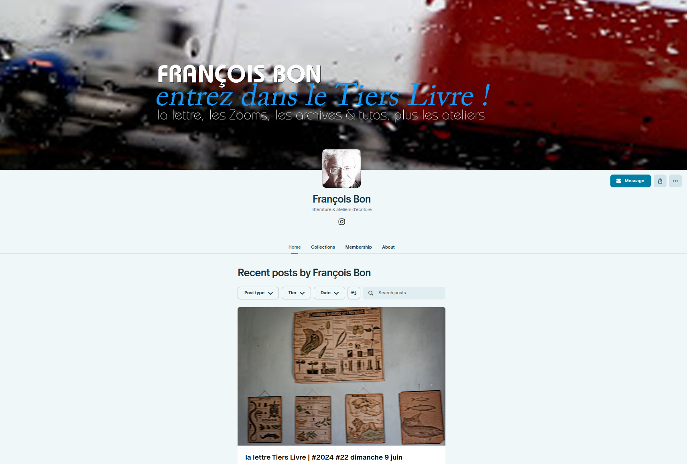
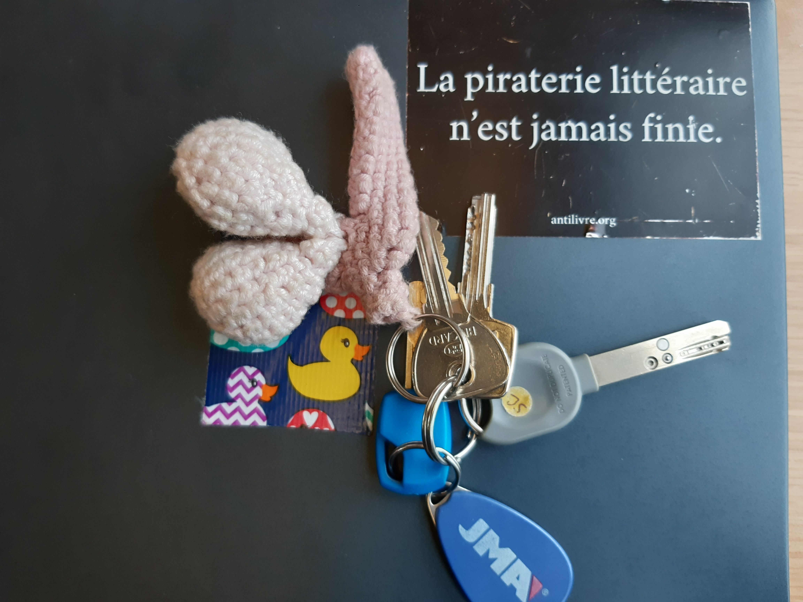
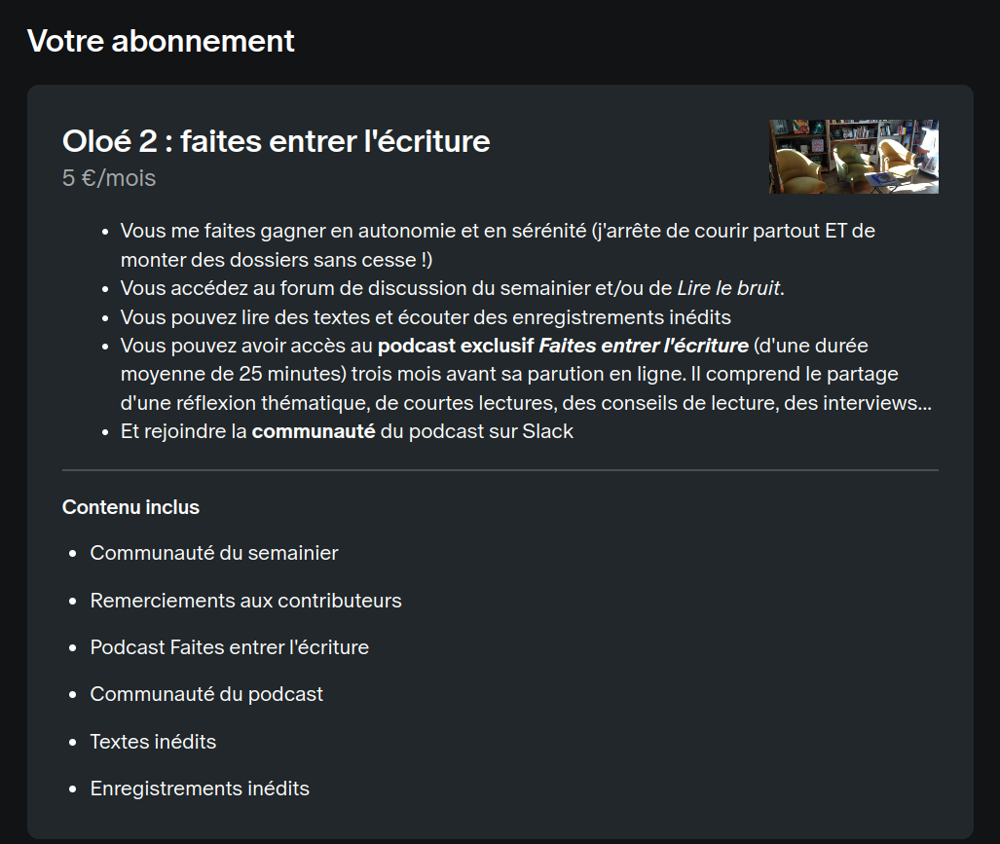
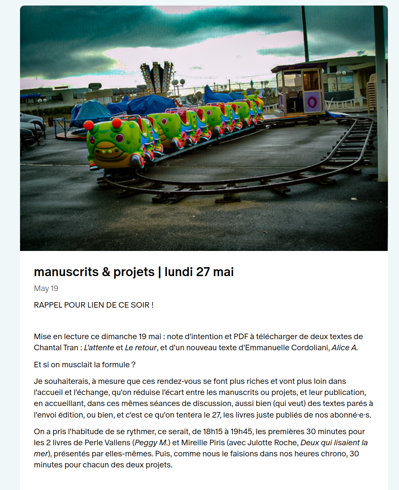

## L'édition est-elle rentable ?

#### Modèles économiques, péréquation, best-sellerisation, financements participatifs

<!-- .element: style="width:300px" -->

===

Aujourd'hui, on va parler d'argent.

L'édition est un secteur économique qui suscite une attention particulière en France, dans la mesure où il passe pour un fleuron un peu particulier de notre économie : celui de notre prestige et santé culturelle. 

Ce secteur est devenu d'autant plus sensible qu'il fait l'objet d'une concentration de plus en plus grande -- comme on l'a vu la semaine dernière -- et dans ce contexte de concentration, de pratiques commerciales qui font l'objet de nombreux débats au sein de la communauté des éditeurs eux-mêmes, mais également des créateurs. 

N'étant pas économiste, je ne me lancerai pas dans un cours de gestion, mais je voudrais vous présenter quelques tendances majeures des modèles économiques de l'édition contemporaine, dans la mesure où ces modèles économiques me semblent avoir des impacts intéressants sur la création littéraire elle-même. 

* Chiffres : CA, revenus, droits d'auteurs
* La logique de la péréquation
* La best-sellerisation
* Financements publics
* Le prix des prix littéraires
* Le débat autour du livre d'occasion
* Les modèles alternatifs

§§§§§§§§§§§§§§§§§§§§§§§§§§§§§§§§§§§§§§§§§§§§§

(chiffres SNE)

====

Pour répondre à la question soulevée dans le titre de ce cours, on peut commencer par s'en référer aux chiffres officiels, qui sont donnés chaque année par le SNE.

Le chiffre d’affaires des éditeurs est passé de 2 944,7 millions d’euros en 2023 à 2 901,6 millions d’euros en 2024, soit une baisse de 1,5%. Le nombre d’exemplaires vendus est, lui, passé de 439,7 millions en 2023 à 426 millions en 2024, soit une baisse de 3,1%.

Si l’on compare 2024 à 2019, année de « référence » prépandémie, le marché du livre est en croissance de 3,4% en valeur mais en baisse de 2,1% en volume.

§§§§§§§§§§§§§§§§§§§§§§§§§§§§§§§§§§§§§§§§§§§§§

===

Un rapide coup d'oeil aux segments éditoriaux montre que la littérature conserve la plus grande part du marché, et reste une valeur sûre : c'est la seule qui progresse l'an passé dans un contexte de baisse généralisée.

§§§§§§§§§§§§§§§§§§§§§§§§§§§§§§§§§§§§§§§§§§§§§

#### CA des grands groupes/maisons (2024)
* Hachette : 2 873 millions d'euros
* Editis : 773 millions d'euros
* Madrigall : 630,6 millions d'euros
* Actes Sud : 69,1 millions d'euros
* Classiques Garnier : 2,4 millions d'euros

===

Le planisphère de l'édition produit par Livre Hedbo, dont nous avons parlé la semaine dernière, fait état quant à lui de chiffres d'Affaire particulièrement élevés. 

Mais ces chiffres cachent de véritables disparités, avec des CA bien moins mirobolants du côté de l'édition indépendants.

§§§§§§§§§§§§§§§§§§§§§§§§§§§§§§§§§§§§§§§§§§§§§

#### De fortes disparités entre les éditeurs
* 67 % des maisons d’édition fonctionnent avec des revenus inférieurs à 75.000 € annuels
* Des conditions de travail variable (plus de télétravail et de bénévolat dans les maisons indés)
* Des revenus complémentaires chez les indépendants, pour une diversification de l'activité

<!-- .element: style="width:45%;float:left;margin-left:-1em; font-size:1.4rem; text-align:justify" -->

<!-- .element: style="width:40%;float:right;margin-right:-1em;" -->

===

67 % des maisons d’édition fonctionnent avec des revenus inférieurs à 75.000 € annuels, un seuil critique qui pose la question de leur viabilité.

Cela se ressent sur les conditions de travail variable (plus de télétravail et de bénévolat dans les maisons indés)

Autre élément notable : Des revenus complémentaires chez les indépendants, pour une diversification de l'activité (médiation culturelle, événements sociaux autour des livres, graphisme, communication, etc.)

§§§§§§§§§§§§§§§§§§§§§§§§§§§§§§§§§§§§§§§§§§§§§

#### La loi "Lang" sur le prix unique du livre

Promulguée le 10 août 1981, la loi sur le prix unique du livre (dite loi « Lang ») est entrée en vigueur le 1er janvier 1982 en instaurant le système du prix unique du livre en France : toute personne qui publie ou importe un livre est tenue de fixer pour ce livre un prix de vente au public.

<!-- .element: style="width:45%;float:left;margin-left:-1em; font-size:1.4rem; text-align:justify" -->

<!-- .element: style="width:40%;float:right;margin-right:-1em;" -->

===

La France a une particularité, c'est le tarif unique du livre NEUF ! 

On doit cette loi à Jack Lang, ministre de la culture sous Mitterand, d'où le nom de loi Lang. Promulguée le 10 août 1981, la loi sur le prix unique du livre (dite loi « Lang ») est entrée en vigueur le 1er janvier 1982 en instaurant le système du prix unique du livre en France : toute personne qui publie ou importe un livre est tenue de fixer pour ce livre un prix de vente au public.

Quelle que soit la période de l’année, ce prix doit être respecté par tous les détaillants (grande surface spécialisée, hypermarché, maison de la presse, grossiste, librairie traditionnelle ou en ligne), qui n’ont la faculté d’accorder des rabais que s’ils sont limités à 5 % du prix déterminé par l’éditeur ou son importateur.

À l'origine de cette loi, refus de considérer le livre comme un produit marchand banalisé, ne répondant qu’aux seules exigences de rentabilité immédiate. En effet la pratique de bradage (discount) entraîne, à long terme, une raréfaction du nombre de titres disponibles, au profit des ouvrages à « rotation rapide », touchant un vaste public (best-sellers, guides,…), au détriment des œuvres de création originale.

§§§§§§§§§§§§§§§§§§§§§§§§§§§§§§§§§§§§§§§§§§§§§

#### Les financements de l'édition

===

§§§§§§§§§§§§§§§§§§§§§§§§§§§§§§§§§§§§§§§§§§§§§

2024-aides-maisons-inde.png

§§§§§§§§§§§§§§§§§§§§§§§§§§§§§§§§§§§§§§§§§§§§§

#### Le temps des alternatives : 

##### Patreon, le réseau social anti-social ?

<!-- .element: style="width:50%;float:left;margin-right:-1em;" -->

* Création 2013
* Plateforme de financement participatif (micro-contributions mensuelles)

<!-- .element: style="width:45%;float:right;margin-left:-1em; font-size:1.4rem; text-align:justify" -->

===

Patreon n'est pas une plateforme extrêmement populaire, que ce soit auprès du grand public ou des chercheurs. La littérature sur le sujet est pauvre, et j'ai eu peine à trouver des études approfondies utiles à mon propos : qq rares mentions dans des articles en français, plusieurs études dans le monde anglo-saxon. Mais l'orientation est souvent axée sur l'influence du _business model_, et sur des profils patreon consacrés aux contenus musicaux. Les rares fois où il est question de profils issus de la sphère littéraire, c'est toujours de la BD. Rien sur les créateurs de littérature native numérique.

Patreon a été créée en 2013. Initialement investie par le secteur musical, elle a séduit plusieurs écrivains, notamment des créateurs de BD, mais également certains auteurs-créateurs issus du web littéraire francophone. Elle appartient à la grande famille des plateformes de financement participatif, dont elle incarne un modèle assez mal connu : contrairement à Ulule, par exemple, qui va proposer des campagnes de financement sur projet avec des objectifs à atteindre en un temps limité (des paliers sont débloqués en échange de contreparties souvent gadget), Patreon opte pour un modèle de micro-contributions mensuelles (quelques euros) permettant aux porteurs de projets de s’assurer une rémunération régulière, sur le modèle du salaire. 

§§§§§§§§§§§§§§§§§§§§§§§§§§§§§§§§§§§§§§§§§§§§§

<!-- .element: style="width:50%;float:left;margin-right:-1em;" -->

<!-- .element: style="width:50%;float:right;margin-right:-1em;" -->

===

Les créateurs peuvent choisir parmi trois formules d'adhésion :
Lite, Pro et Premium. Patreon perçoit des revenus par le biais de ces plans : le plan lite 5%, tandis que Pro et Premium prélèvent respectivement huit et douze pour cent.

Corpus ici : Savelli + Bon

Difficile et peut-être inutile de présenter François Bon, pionnier de la littérature numérique en France, explorateur de nombreux outils de publication numérique depuis les années 1990 : il est passé par toutes sortes de CMS et réseaux sociaux. Ses expérimentations lui ont valu la mauvaise surprise de ne plus répondre aux exigences administratives régissant le statut d'auteur. 

§§§§§§§§§§§§§§§§§§§§§§§§§§§§§§§§§§§§§§§§§§§§§

<!-- .element: style="width:700px" -->

===

Concrètement, le créateur peut adapter les formules comme il le souhaite et, surtout, en personnaliser le nom. Chez François Bon, les trois formules sont déclinées ainsi :

* un abonnement 3.5$ par mois : un accès à la communauté Tier Livre, avec une newsletter, des réunions zoom hebdomadaires et un canal de communication direct avec François
* un abonnement à 22$ par mois, pour un accès aux "Ateliers d'écriture", qui est une sorte de coaching pour l'écriture littéraire
* à noter que la formule médiane propose la même chose, mais à tarif réduit pour les étudiants ou demandeurs d'emploi.

§§§§§§§§§§§§§§§§§§§§§§§§§§§§§§§§§§§§§§§§§§§§§

### Le _buisiness model_ du financement participatif (_crowdfunding_)

* Manager la relation parasociale entre le créateur et son public
* _patron_ = mécène
* Une transformation du rôle du créateur, amené à opérer un management de son projet artistique

<!-- .element: style="width:45%;float:left;margin-left:-1em; font-size:1.4rem; text-align:justify" -->

<!-- .element: style="width:45%;float:right;margin-right:-1em;" -->

===

Le crowdfunding s'est largement répandu ces dernières années dans le secteur de la création, où il défend le principe d'une relation sur le long terme entre le créateur et son public selon une logique de mécénat qui ne fixe aucune durée de collecte ni d'objectifs précis à atteindre, comme la publication d'un livre ou d'un CD, par exemple. Comme on l'a rapidement évoqué, le nom même de la plateforme s'inscrit dans ce paradigme du mécénat, puisque *patreon* est une déformation de *patron*, en anglais, qui signifie donateur, mécène. En français, le terme peut porter à confusion.

Logique du management : le créateur devient de plus en plus son propre producteur.

§§§§§§§§§§§§§§§§§§§§§§§§§§§§§§§§§§§§§§§§§§§§§

## Sur les réseaux sociaux, une relation avant tout parasociale

Le concept de relation parasociale, d'abord issu de l'analyse psychologique des téléspectateurs dans les années 1960, décrit le phénomène par lequel une personne développe un sentiment d’intimité avec une figure médiatique ou fictive qui n’a pourtant pas vraiment conscience de son existence. Le _community management_ repose sur l'exploitation de cette relation parasociale, en jouant sur le registre de l'intime : tout est fait pour que le public développe un sentiment de proximité avec l'émetteur du message. Les influenceurs, mais également les créateurs de contenus en tout genre, gagnent leur vie en monétisant la relation parasociale. 

<!-- .element: style="font-size:1.7rem; text-align:justify" -->

===

Comment les relations entre l'écrivain et le lecteur, le patron-mécènne, sont-elles organisées et gérées ? 

Rappel : La littérature des plateformes accompagne les mutations profondes de la présence sociale de l'écrivain dans l'espace public. La présence en ligne des auteurs, généralement sur des réseaux sociaux caractérisés par un flux conversationnel continu, implique une prise en charge l'identité auctoriale, qui tend à se confondre avec l'identité numérique. Ces écritures profilaires, qui échappent de plus en plus aux éditeurs, jusque-là seuls responsables de la médiatisation de l'écrivain, représentent un travail quotidien, parfois risqué, tant la gestion des communautés numérique implique un savoir-faire à part entière.

Comme les CMS, les réseaux sociaux ont également nourri un discours de la désintermédiation : sur Twitter, FaceBook, le lecteur ou le fan serait en mesure d'échanger "directement" avec son artiste favori. La communauté Des travaux ont nuancé cette relation directe, en requalifiant de "parasociale" la relation qui unit les créateurs de contenus et leurs *follower*. Ce concept de relation parasociale, d'abord issu de l'analyse psychologique des téléspectateurs dans les années 1960, décrit le phénomène par lequel une personne développe un sentiment d’intimité avec une figure médiatique ou fictive qui n’a pourtant pas vraiment conscience de son existence. Le _community management_ repose sur l'exploitation de cette relation parasociale, en jouant sur le registre de l'intime : tout est fait pour que le public développe un sentiment de proximité avec l'émetteur du message. Les influenceurs, mais également les créateurs de contenus en tout genre, gagnent leur vie en monétisant la relation parasociale. 

Sur Patreon, l'accent est mis sur la promesse d'une sociabilité plus authentique, garantissant un accès direct au créateur. François Bon insiste : "le Patreon autorise une relation directe et un autre espace d'expérimentation privilégiée." L'abonnement garantit un "accès à la messagerie privée avec priorité de mon côté." 

§§§§§§§§§§§§§§§§§§§§§§§§§§§§§§§§§§§§§§§§§§§§§

>Le mécénat se définit comme "le soutien matériel apporté, sans contrepartie directe de la part du bénéficiaire, à une oeuvre ou à une personne pour l'exercice d'activités présentant un intérêt général."

<!-- .element: style="font-size:1.5rem; width:50%;float:left;margin-left:-3em;" -->

<!-- .element: style="width:40%;float:right;margin-right:-3em;" -->

===

Pour être toute à fait franche, je ne suis pas certaine qu'un juriste serait tout à fait d'accord avec l'usage du terme "mécénat" dont se réclame Patreon, qui renvoie d'abord à un statut juridique assez précis. Sur le site du ministère de la culture, on peut notamment lire que :

>Le mécénat se définit comme "le soutien matériel apporté, sans contrepartie directe de la part du bénéficiaire, à une oeuvre ou à une personne pour l'exercice d'activités présentant un intérêt général."

Tout repose sans doute sur l'interprétation du terme "contrepartie directe". Sur une plateforme de financement participatif comme Ulule, notre contribution financière nous donne droit à une contrepartie directe : le livre, le jeu de société ou les éponges bio que nous avons commandées, avec, pour nous inciter à donner davantage, des *goodies* de type autocollant ou totebag. Une fois, en soutenant un festival de littérature érotique féministe, j'ai même obtenu un porte-clé tricoté en forme de clitoris.

§§§§§§§§§§§§§§§§§§§§§§§§§§§§§§§§§§§§§§§§§§§§§

>Vous me faites gagner en autonomie et en sérénité (j'arrête de courir partout ET de monter des dossiers sans cesse !) 

>Vous me rendez maîtresse de mon destin (carrément !)

<!-- .element: style="font-size:1.5rem; width:50%;float:left;margin-left:-3em;" -->

<!-- .element: style="width:60%;float:right;margin-right:-3em;" -->

===

Notons que les rétributions sont beaucoup plus sérieuses et/ou symboliques sur Patréon. Il ne s'agit que de contenus artistiques, ou bien de "nouvelles" ou newsletters de l'artiste, qui s'apparentent bien souvent à des comptes-rendus d'activités. L'écrivain fournit la preuve qu'il ne procrastine pas, loin de là. L'activité littéraire y est ainsi présentée plus que jamais comme un travail, comprenant des tâches bien définies. En retour, le lecteur, le "patron", assure donc un revenu mensuel. 

Chacun de nos deux écrivains insiste ainsi, dans la présentation de leurs formules d'adhésion, sur l'autonomie que le système Patreon permet d'acquérir :

>Vous me faites gagner en autonomie et en sérénité (j'arrête de courir partout ET de monter des dossiers sans cesse !)

écrit Anne Savelli dans la présentation de l'abonnement Oloé 2 que j'ai choisi. Dans la description du 3e pallier à 11,50 $ / mois : 

>Vous me rendez maîtresse de mon destin (carrément !)

Le discours est similaire chez les autres. Ainsi, chez Anne Archet, notre contribution est supposée nous offrir une rétribution symbolique, mais non moins importante : "La satisfaction d'appuyer Anne".

§§§§§§§§§§§§§§§§§§§§§§§§§§§§§§§§§§§§§§§§§§§§§

### Le paradigme du "patron" [Mécène] 
#### Une contre-culture participative ? 

|Artiste|Nombre total de membres|Membres payants|Publications|
|:--------------- |:---------------:|:---------------:| -----:|
|François Bon|494|271|584|
|Anne Savelli|81|32|*nr*|

<!-- .element: style="font-size:1.5rem; width:50%;float:left;margin-left:-3em;" -->

<!-- .element: style="width:60%;float:right;margin-right:-3em;" -->

===

Au niveau managérial, la logique de Patreon avec sa communauté fermée et limitée parait donc relativement originale, puisqu'elle va impliquer ce que je qualifierai de contre-culture participative. Je m'explique : dans le contexte de l'économie de l'attention où la participation des publics apparaît comme un levier essentiel de captation durable des publics, les industries culturelles et les créateurs redoublent d'efforts pour générer de l'interaction avec les internautes, via les plateformes de diffusion des contenus. 

C'est ce que Marta Severo a notamment qualifié d'impératif participatif : permettre la participation n'est plus seulement un moyen de gagner de l'audience, c'est aussi un moyen de gagner en légitimité. Le paradigme participatif s'accompagne par ailleurs d'un idéal de renversement de l'autorité, désormais déclinée selon un modèle horizontal et non plus vertical. Chez le sociologue Dominique Cardon, c'est bien certains modèles de plateforme -- notamment le CMS wiki de Wikipédia -- qui amène les usagers à pratiquer l'autogouvernance et à réguler l'écriture encyclopédique.

Pourtant, l'impératif participatif a ses revers : la participation, du fait de la plateformisation croissante, est de plus en plus régulée. Ainsi, pour Adam Fish, la culture participative initiée dans le cadre d'un paradigme démocratique et d'une horizontalisation des échanges, serait désormais assimilée par une logique du capital (sa thèse est détaillée dans l'ouvrage *Technolibéralism. The End of participatory culture*).

§§§§§§§§§§§§§§§§§§§§§§§§§§§§§§§§§§§§§§§§§§§§§

>Nota 2 : c’est aussi le soutien que représente à mes activités cet espace #Patreon qui m’a permis de désactiver le plus totalement possible les publicités parasites sur ma chaîne YouTube, désormais le poumon respirant du site. Pour cela aussi, merci. 

<!-- .element: style="font-size:1.7rem; text-align:justify" -->

>François Bon

<!-- .element: style="font-size:1.7rem; text-align:right" -->

===

Dans un tel contexte, Patreon n'incarnerait-il pas la fin de la culture de la participation, en réintégrant l'idée d'un espace fermé, un salon littéraire sélect, renouant ainsi avec la notion habermasienne d'espace public Bourgeois ? J'ai l'intuition que c'est un peu plus compliqué que cela. **Patreon est présenté par les créateurs eux-mêmes comme une solution permettant de gagner en autonomie, tant sur un plan qualitatif (la liberté de création faisant partie du contrat passé avec le "patron") que quantitatif (puisque la rétribution n'est pas liée à la popularité ou au calcul de l'audience des contenus).** Cette autonomie ressurgit d'ailleurs positivement sur les autres plateformes, dont le modèle économique repose sur le tiers acteur : 

>Nota 2 : c’est aussi le soutien que représente à mes activités cet espace #Patreon qui m’a permis de désactiver le plus totalement possible les publicités parasites sur ma chaîne YouTube, désormais le poumon respirant du site. Pour cela aussi, merci. (F. Bon)

Là où le recrutement et l’activation de la participation des internautes est une préoccupation majeure des gestionnaires de plateformes créatives et des organisateurs d’opérations participatives, la plateforme Patreon aurait donc tendance à diminuer les effets de surproduction et de spectacularisation. Semble ainsi se jouer une sociabilité d'un genre un peu nouveau -- ou pas tant que ça : F. Bon parle d'un retour aux "premiers temps du web".

§§§§§§§§§§§§§§§§§§§§§§§§§§§§§§§§§§§§§§§§§§§§§

<!-- .element: style="width:570px" -->

===

François Bon est sans doute celui de nos deux écrivains qui déploie le plus loin l'exposition de sa "fabrique" du fait littéraire. Son Patreon est en effet devenu l'interface privilégie de son école de création à distance : ce qu'il range dans la catégorie des Ateliers. Je ne développerai pas davantage ce point qui me semblerait mériter une étude à part entière, plus approfondie, avec l'abonnement qui va avec (et que je n'ai pas), mais j'ai l'impression que François Bon met en place ce qui pourrait être qualifié de *coaching d'écriture*, qui relève sans doute bien plus de ce qui peut se passer dans une salle de classe que sur un réseau social. [CITER EXTRAIT]

>Mise en lecture ce dimanche 19 mai : note d'intention et PDF à télécharger de deux textes de Chantal Tran : L'attente et Le retour, et d'un nouveau texte d'Emmanuelle Cordoliani, Alice A.

>Et si on musclait la formule ?

>Je souhaiterais, à mesure que ces rendez-vous se font plus riches et vont plus loin dans l'accueil et l'échange, qu'on réduise l'écart entre les manuscrits ou projets, et leur publication, en accueillant, dans ces mêmes séances de discussion, aussi bien (qui veut) des textes parés à l'envoi édition, ou bien, et c'est ce qu'on tentera le 27, les livres juste publiés de nos abonné·e·s.

>On a pris l'habitude de se rythmer, ce serait, de 18h15 à 19h45, les premières 30 minutes pour les 2 livres de Perle Vallens (Peggy M.) et Mireille Piris (avec Julotte Roche, Deux qui lisaient la mer), présentés par elles-mêmes. Puis, comme nous le faisions dans nos heures chrono, 30 minutes pour chacun des deux projets.

François Bon apparaît ainsi comme le chef d'orchestre ou l'animateur d'un petit groupe d'amateurs éclairés, et même davantage : d'autres créateurs en devenir.

§§§§§§§§§§§§§§§§§§§§§§§§§§§§§§§§§§§§§§§§§§§§§

Là où la plupart des plateformes créatives et de financement participatif jouent sur la monétisation de la relation parasociale qui se crée entre le créateur et sa communauté, à partir d'une mise en scène de l'intime, Patréon joue sur la carte de la professionnalisation, et valorise un discours du travail. Il me semble à cet égard que la plateforme est sans doute la plus à même de renouer avec un certain esprit du salon littéraire -- métaphore souvent avancée, de manière trop poussive à mon sens, pour qualifier les forums en ligne puis les différentes plateformes d'écriture et enfin les réseaux sociaux.

<!-- .element: style="font-size:1.7rem; text-align:justify" -->

===

En d'autres termes, **là où la plupart des plateformes créatives et de financement participatif jouent sur la monétisation de la relation parasociale qui se crée entre le créateur et sa communauté, à partir d'une mise en scène de l'intime, Patréon joue sur la carte de la professionnalisation, et valorise un discours du travail. Il me semble à cet égard que la plateforme est sans doute la plus à même de renouer avec un certain esprit du salon littéraire -- métaphore souvent avancée, de manière trop poussive à mon sens, pour qualifier les forums en ligne puis les différentes plateformes d'écriture et enfin les réseaux sociaux.**

