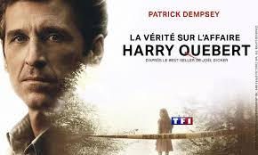

## L'édition est-elle rentable ?

#### Modèles économiques, péréquation, best-sellerisation, financements participatifs

<!-- .element: style="width:400px" -->

===

Aujourd'hui, on va parler d'argent et de modèles économique.

L'édition est un secteur économique qui suscite une attention particulière en France, dans la mesure où il passe pour un fleuron un peu particulier de notre économie : celui de notre prestige et santé culturelle. 

Ce secteur est devenu d'autant plus sensible qu'il fait l'objet d'une concentration de plus en plus grande -- comme on l'a vu la semaine dernière -- et dans ce contexte de concentration, de pratiques commerciales qui font l'objet de nombreux débats au sein de la communauté des éditeurs eux-mêmes, mais également des créateurs. 

N'étant pas économiste, je ne me lancerai pas dans un cours de gestion, mais je voudrais vous présenter quelques tendances majeures des modèles économiques de l'édition contemporaine, dans la mesure où ces modèles économiques me semblent avoir des impacts intéressants sur la création littéraire elle-même. 

* Chiffres : CA, revenus, droits d'auteurs
* La logique de la péréquation
* La best-sellerisation
* Financements publics
* Le prix des prix littéraires
* Le débat autour du livre d'occasion
* Les modèles alternatifs

§§§§§§§§§§§§§§§§§§§§§§§§§§§§§§§§§§§§§§§§§§§§§

chiffres SNE
<!-- .element: style="font-size:1.7rem" -->

====

Pour répondre à la question soulevée dans le titre de ce cours, on peut commencer par s'en référer aux chiffres officiels, qui sont donnés chaque année par le SNE.

Le chiffre d’affaires des éditeurs est passé de 2 944,7 millions d’euros en 2023 à 2 901,6 millions d’euros en 2024, soit une baisse de 1,5%. Le nombre d’exemplaires vendus est, lui, passé de 439,7 millions en 2023 à 426 millions en 2024, soit une baisse de 3,1%.

Si l’on compare 2024 à 2019, année de « référence » prépandémie, le marché du livre est en croissance de 3,4% en valeur mais en baisse de 2,1% en volume.

§§§§§§§§§§§§§§§§§§§§§§§§§§§§§§§§§§§§§§§§§§§§§

===

Un rapide coup d'oeil aux segments éditoriaux montre que la littérature conserve la plus grande part du marché, et reste une valeur sûre : c'est la seule qui progresse l'an passé dans un contexte de baisse généralisée.

§§§§§§§§§§§§§§§§§§§§§§§§§§§§§§§§§§§§§§§§§§§§§

#### CA des grands groupes/maisons (2024)
* Hachette : 2 873 millions d'euros
* Editis : 773 millions d'euros
* Madrigall : 630,6 millions d'euros
* Actes Sud : 69,1 millions d'euros
* Classiques Garnier : 2,4 millions d'euros

<!-- .element: style="font-size:1.7rem; text-align:justify" -->

===

Le planisphère de l'édition produit par Livre Hedbo, dont nous avons parlé la semaine dernière, fait état quant à lui de chiffres d'Affaire particulièrement élevés. 

Mais ces chiffres cachent de véritables disparités, avec des CA bien moins mirobolants du côté de l'édition indépendants.

§§§§§§§§§§§§§§§§§§§§§§§§§§§§§§§§§§§§§§§§§§§§§

#### De fortes disparités entre les éditeurs
* 67 % des maisons d’édition fonctionnent avec des revenus inférieurs à 75.000 € annuels
* Des conditions de travail variable (plus de télétravail et de bénévolat dans les maisons indés)
* Des **revenus complémentaires** chez les indépendants, pour une diversification de l'activité

<!-- .element: style="width:45%;float:left;margin-left:-1em; font-size:1.4rem; text-align:justify" -->

<!-- .element: style="width:50%;float:right;margin-right:-1em;" -->

===

67 % des maisons d’édition fonctionnent avec des revenus inférieurs à 75.000 € annuels, un seuil critique qui pose la question de leur viabilité.

Cela se ressent sur les conditions de travail variable (plus de télétravail et de bénévolat dans les maisons indés)

Autre élément notable : Des revenus complémentaires chez les indépendants, pour une diversification de l'activité (médiation culturelle, événements sociaux autour des livres, graphisme, communication, etc.)

Élément très important : dans le modèle économique des éditeurs, la vente de livre n'est pas la seule source de rémunération. Un éditeur peut vendre des services, comme le font très souvent les structures indépendantes. 
Les éditeurs peuvent aussi percevoir des subventions, comme on le verra. 
Autre modèle dont on reparlera : les services de publication à compte d'auteur. 

§§§§§§§§§§§§§§§§§§§§§§§§§§§§§§§§§§§§§§§§§§§§§

#### Rémunération des éditeurs (assistants édition)

<!-- .element: style="width:50%;float:right;margin-right:-1em;" -->

<!-- .element: style="width:50%;float:left;margin-right:-1em;" -->

===

Salaires...

§§§§§§§§§§§§§§§§§§§§§§§§§§§§§§§§§§§§§§§§§§§§§

#### Rémunération des auteurs
* Rémunération proportionnelle aux ventes de l'ouvrage (5 à 12%)
* À-valoir versé en avance (compensé ensuite selon la vente des ouvrages)
* "Auteur", "écrivain"... une activité entre professionnalisation et précarisation

<!-- .element: style="font-size:1.4rem" -->

===

Les éditeurs rémunèrent le plus communément leurs auteurs proportionnellement aux ventes de l’ouvrage. D’après la Société des Gens de Lettres, cette rémunération « se situe entre 5 % et 12 % selon le secteur éditorial, le niveau de ventes espéré, la maison d’édition et la notoriété de l’auteur. En littérature générale, cette fourchette est le plus souvent comprise entre 8 % et 10 %. Plusieurs pourcentages peuvent également être fixés par le contrat (par exemple 8 %, 10 % et 12 %) et s’appliquer par paliers au fur et à mesure du nombre d’exemplaires vendus. » 

Les auteurs peuvent négocier un à-valoir : un montant pré-défini qui, s’il est accepté par l’éditeur, lui sera versé quelles que soient les ventes effectuées. Toujours d’après la Société des Gens de Lettres, cet à-valoir peut lui être versé en une fois à la signature du contrat ou en plusieurs versements avant la publication de l’ouvrage. Au fur et à mesure des ventes, cet à-valoir est ensuite compensé : l’éditeur retient les droits d’auteur qu’il aurait normalement versés à l’auteur pour rembourser cet à-valoir, jusqu’à ce le montant des droits d’auteur générés par les ventes dépasse l’à-valoir. À partir de ce moment, l’auteur perçoit ses droits de manière proportionnelle, comme expliqué ci-dessus. 

§§§§§§§§§§§§§§§§§§§§§§§§§§§§§§§§§§§§§§§§§§§§§

#### Une spécificicté française : la loi "Lang" (prix unique du livre)

Promulguée le 10 août 1981, la loi sur le prix unique du livre (dite loi « Lang ») est entrée en vigueur le 1er janvier 1982 en instaurant le système du prix unique du livre en France : toute personne qui publie ou importe un livre est tenue de fixer pour ce livre un prix de vente au public.

<!-- .element: style="width:65%;float:left;margin-left:-1em; font-size:1.4rem; text-align:justify" -->

<!-- .element: style="width:35%;float:right;margin-right:-1em;" -->

===

La France a une particularité, c'est le tarif unique du livre NEUF ! Cette pratique amène donc à une régulation du marché particulièrement importante, avec pour objectif de favoriser (ou ne pas défavoriser) les librairies indépendantes.

On doit cette loi à Jack Lang, ministre de la culture sous Mitterand, d'où le nom de loi Lang. Promulguée le 10 août 1981, la loi sur le prix unique du livre (dite loi « Lang ») est entrée en vigueur le 1er janvier 1982 en instaurant le système du prix unique du livre en France : toute personne qui publie ou importe un livre est tenue de fixer pour ce livre un prix de vente au public.

Et c’est d’ailleurs pour cela qu’il est imprimé obligatoirement en quatrième de couverture de celui-ci.

Quelle que soit la période de l’année, ce prix doit être respecté par tous les détaillants (grande surface spécialisée, hypermarché, maison de la presse, grossiste, librairie traditionnelle ou en ligne), qui n’ont la faculté d’accorder des rabais que s’ils sont limités à 5 % du prix déterminé par l’éditeur ou son importateur.

À l'origine de cette loi, refus de considérer le livre comme un produit marchand banalisé, ne répondant qu’aux seules exigences de rentabilité immédiate. En effet la pratique de bradage (discount) entraîne, à long terme, une raréfaction du nombre de titres disponibles, au profit des ouvrages à « rotation rapide », touchant un vaste public (best-sellers, guides,…), au détriment des œuvres de création originale.

§§§§§§§§§§§§§§§§§§§§§§§§§§§§§§§§§§§§§§§§§§§§§

#### Répartition du prix du livre : la bataille des chiffres

« Cette étude rappelle que s’il faut un auteur pour un livre, il faut une maison d’édition pour le financer », insiste Vincent Montagne, président du SNE et PDG de Média-Participations. 

<!-- .element: style="width:45%;float:left;margin-left:-1em; font-size:1.4rem; text-align:justify" -->

<!-- .element: style="width:40%;float:right;margin-right:-1em;" -->

===

Dispatch prix du livre : étude SNE 2024 qui a fait couler beaucoup d'encre.

§§§§§§§§§§§§§§§§§§§§§§§§§§§§§§§§§§§§§§§§§§§§§

<!-- .element: style="width:35%;float:right;margin-right:-1em;" -->

« Cet outil de propagande, qui aurait pu être le premier pas d’objectivation de l’économie du livre, ne peut que susciter une grande méfiance pour ceux qui connaissent le sujet et une grande confusion pour le grand public » [Benoît Peeters]

<!-- .element: style="width:45%;float:left;margin-left:-1em; font-size:1.4rem; text-align:justify" -->

===

La Ligue des auteurs professionnels regrette que « la notion d’auteur envisagée dans l’étude semble inclure de nombreuses acceptions (rémunération des directeurs de collection, acquisition des droits à l’étranger, à-valoir versés à des traducteurs…) », ce qui déforme selon eux la réalité. 

Autre pierre d’achoppement : « L’auteur devra payer sur ses droits ses cotisations sociales, son loyer et l’amortissement de son matériel », rappelle la Ligue. On reviendra sur ces questions sur le statut d'auteur un peu plus tard.

« Cet outil de propagande, qui aurait pu être le premier pas d’objectivation de l’économie du livre, ne peut que susciter une grande méfiance pour ceux qui connaissent le sujet et une grande confusion pour le grand public », résume l’écrivain et scénariste Benoît Peeters.

§§§§§§§§§§§§§§§§§§§§§§§§§§§§§§§§§§§§§§§§§§§§§

>L’échantillon permettant d’établir une telle conclusion porte uniquement sur l’analyse de la comptabilité des grosses maisons (Actes Sud, Albin Michel, Editis, Glénat Editions, Hachette Livre, Madrigall – la maison mère de Gallimard et Flammarion), Média-Participations et la petite maison indépendante Zulma. Ces poids lourds représentaient 29 % du marché en 2022 et ont pour particularité de publier le plus grand nombre de best-sellers – et donc de payer le plus de droits d’auteur.

<!-- .element: style="font-size:1.3rem; text-align:justify" -->

>Par ailleurs, seuls cinq secteurs ont été passés en revue pour cette étude : la littérature générale, les livres pratiques, les livres d’art, de jeunesse et la bande dessinée, qui représentaient, en 2022, 68,5 % du marché français de l’édition. Jugés peu représentatifs, le scolaire, aléatoire selon les réformes, et le manga, liés à des cessions de droits à l’étranger, n’ont pas été gardés.

<!-- .element: style="font-size:1.3rem; text-align:justify" -->

>Nicole Vulser, *Le Monde*, février 2024

<!-- .element: style="font-size:1.3rem; text-align:right" -->

§§§§§§§§§§§§§§§§§§§§§§§§§§§§§§§§§§§§§§§§§§§§§

>"Le camembert devrait en tout premier lieu pointer que sur les 49 % du prix de vente hors taxe, 42,8 % reviennent à l’éditeur. Que la répartition des débits qu’une maison effectue entre les salaires, les frais de fonctionnement, les charges et autres représente un appréciable effort de transparence. Mais paradoxalement, cet inventaire de coûts à la Prévert renvoie l’information inverse de la réalité.Au choix, l’arbre qui cache la forêt, ou mieux : diviser (le pourcentage global), non pour mieux régner, mais noyer le poisson." [*Nicolas Gary pour Livre Hebdo*]

<!-- .element: style="width:45%;float:left;margin-left:-1em; font-size:1.4rem; text-align:justify" -->

<!-- .element: style="width:40%;float:right;margin-right:-1em;" -->

§§§§§§§§§§§§§§§§§§§§§§§§§§§§§§§§§§§§§§§§§§§§§

#### Le modèle des éditions du commun

===

Si on prend le diagramme circulaire, on peut déjà parler du fait que 5,5 % vont à la TVA donc à l’État.

Une taxe dont là encore le pourcentage est différent d’autres secteurs. Dans la suite si je prends le schéma à rebours on aurait le libraire autour de 35 %, on a ensuite un diffuseur et un distributeur qui pour nous sont différenciés, mais ensemble les deux ont à peu près 24 %. Nous avons ensuite l’auteur/l’autrice, qui pour nous aujourd’hui a 8 % lorsque c’est une personne seule et dès qu’ils sont plusieurs se partagent 12 %. Il y a ensuite l’imprimeur qui est autour, pour nous là aussi, de 10 %. Et il reste donc pour celles et ceux qui ont fait le calcul 17,5 % pour l’éditeur.

§§§§§§§§§§§§§§§§§§§§§§§§§§§§§§§§§§§§§§§§§§§§§

### Une redistribution de plus en plus contestée

* Précarisation du métier
* Essor de l'auto-édition
* Organisation des auteurs en collectifs (ligue des auteurs pro)

<!-- .element: style="font-size:1.4rem" -->

===

§§§§§§§§§§§§§§§§§§§§§§§§§§§§§§§§§§§§§§§§§§§§§

### Comment financer un projet éditorial ?
* Un secteur soutenu par l'état et les collectivités
* Un système fondé sur un principe de péréquation
* La course aux prix & best-sellers

<!-- .element: style="font-size:1.4rem" -->

===

On va laisser de côté ces questions de partage, on y reviendra en partie, mais il faut aussi garder à l'esprit qu'il y a de fortes disparités et des cas particuliers. 

Penchons-nous sur les financements possibles de projets éditoriaux. Je voudrais aborder 3 points :

* Un secteur soutenu par l'état et les collectivités : je n'insisterai pas bcp là-dessus, mais c'est sans doute la première chose à relever : importance de protéger un système culturel.
* Un système fondé sur un principe de péréquation 
* La course aux prix & best-sellers : je m'y attarderai car des questions littéraires.

§§§§§§§§§§§§§§§§§§§§§§§§§§§§§§§§§§§§§§§§§§§§§

<!-- .element: style="width:50%;float:left;margin-right:-1em;" -->

<!-- .element: style="width:50%;float:right;margin-right:-1em;" -->

* 3 098 aides allouées (subventions et prêts), pour un montant total de 23,8 M€

<!-- .element: style="font-size:1.4rem" -->

===

Premier principe : les aides publiques. État, CNL, collectivités locales. 

en 2024 : * 3 098 aides allouées (subventions et prêts), pour un montant total de 23,8 M€

§§§§§§§§§§§§§§§§§§§§§§§§§§§§§§§§§§§§§§§§§§§§§

#### Le principe de la péréquation

En édition, le principe de péréquation renvoie à un mécanisme économique par lequel un succès éditorial majeur et grand public (ce que l'on pourra qualifier de *best seller*) assure le financement les titres moins rentables, souvent plus exigeants, risqués ou destinés à un public restreint.

<!-- .element: style="font-size:1.4rem" -->

===

Second principe = système économique de la péréquation.

En édition, le principe de péréquation renvoie à un mécanisme économique par lequel un succès éditorial majeur et grand public (ce que l'on pourra qualifier de *best seller*) assure le financement les titres moins rentables, souvent plus exigeants, risqués ou destinés à un public restreint.

Autrement dit, c’est une forme de solidarité économique interne au sein d’un catalogue :
les best-sellers permettent de maintenir une diversité éditoriale.

Le principe de péréquation est ultra majoritaire dans le système éditorial contemporain, où il a assuré pendant plusieurs décénnies un certain équilibre et une forme de diversité. 

Attention, dans la définition que je donne ici, on a un peu l'impression qu'un littérature populaire et de moindre qualité assurerait la publication de genres de niches hyper spécialisés. C'est toujours plus compliqué que cela. 

Le principe de péréquation fait aujourd'hui l'objet d'une importante remise en cause, dont nous allons essayer ensemble de comprendre les raisons. En effet, avec la concentration du secteur et la baisse des ventes moyennes, ce modèle devient difficile à maintenir.

Mais j'aimerais profiter de ce sujet pour en revenir à la question du Best-Seller.

§§§§§§§§§§§§§§§§§§§§§§§§§§§§§§§§§§§§§§§§§§§§§

#### « L’ère des cent mille », ou la naissance du *best-seller*

>«  On appelle succès, de notre temps, le brusque engouement d’un public étendu pour un ouvrage, se traduisant parfois, dans l’espace de quelques mois, par une vente qui dépasse cent mille exemplaires&nbsp;» (Bernard Grasset, correspondance, vers 1920)

<!-- .element: style="font-size:1.4rem" -->

===

L'anglicisme Best Seller laisse parfois penser que la mode des grands succès populaires est assez récent. Pourtant, on retrouve cette idée du best seller dans l'histoire de l'édition industrielle, dès le XIXe. 

Un éditeur en particulier s'est imposé dans le discours sur le best-seller : Bernard Grasset. 

Grasset est un éditeur à part : c'est lui qui établit un système de publication à compte d'auteur (et publiera le premier Proust, à compte d'auteur justement). C'est lui également qui va lancer les premières publicités pour le livre. C'est un éditeur et un homme d'affaire. De fait, Grasset a beaucoup théorisé le principe du best seller : même si ce à quoi il fait référence existe souvent depuis bien plus longtemps. 

>Dès les années 1920, L’édition serait entrée dans ce qu’il appelle « l’ère des cent mille » – chiffre en réalité fabuleux, très rarement atteint par des ouvrages de littérature générale. Grasset considère
que la lecture littéraire aurait progressé dans le goût d’un grand nombre de personnes.

§§§§§§§§§§§§§§§§§§§§§§§§§§§§§§§§§§§§§§§§§§§§§

<!-- .element: style="width:300px" -->

Madame Bovary de Gustave Flaubert, publié en 1857 en deux tomes et vendu à 25 000 exemplaires en une année.

<!-- .element: style="font-size:1.4rem" -->

===

Or, si Grasset, au début du XX, met les mots sur ce phénomène, c'est bien au XIXe que celui-ci s'est développé. 

Le XIXe est le siècle où s'opère une importante mutation des usages et des consommations de
produits culturels : celui de Madame Bovary de Gustave Flaubert, publié en 1857 en
deux tomes et vendu à 25 000 exemplaires en une année.

Pour vous donner un ordre d'idée : Tout au long du 18e, les éditeurs se contentaient de tirer à 800, 1 000 ou 1 200 exemplaires des romans qu’ils tronçonnaient en deux ou trois tomes.

§§§§§§§§§§§§§§§§§§§§§§§§§§§§§§§§§§§§§§§§§§§§§

#### Le best seller, une histoire de changement d'échelle
* Capacité à assurer de forts tirages
* Transformations de l'objet livre
* Augmentation des lecteurs
* Modèle de l'offre (*vs* demande)

<!-- .element: style="font-size:1.4rem" -->

===

Cette citation de Grasset amène à bien comprendre le phénomène. Les best-sellers, c'est d'abord une histoire d'échelle : 
- d'abord une capacité technique à produire des forts tirages
- également transformation de l'objet livre pour en baisser le prix (on ne va pas tirer 100 000 livres "Précieux"). Le best seller intervient donc à un moment où on va repenser l'objet vendu : en réduisant sa taille, mais également en usant de papiers davantage bon marché (souvenez-vous ici de l'énonciation éditoriale : la qualité matérielle du livre relève de cette énonciation)
- enfin une augmentation des lecteurs, qui va transformer le modèle éco, en passant d'un modèle dit de la demande (on commandait des livres qui étaient produits après cette commande) à une politique de l'offre (on fait de gros tirages en pariant sur le fait que ceux-ci vont trouver leur public)

§§§§§§§§§§§§§§§§§§§§§§§§§§§§§§§§§§§§§§§§§§§§§

#### Les machines à vapeur : une révolution de l'imprimerie

<!-- .element: style="width:500px" -->

§§§§§§§§§§§§§§§§§§§§§§§§§§§§§§§§§§§§§§§§§§§§§

#### L'enjeu du format

>La solution préconisée était simple et révolutionnaire : en finir avec le beau volume in-octavo à grandes marges et papier agréable au toucher, et remplacer le volume à 7,50 francs par un petit in-18 « Jésus » qui serait commercialisé à 3,50 francs, tout en offrant au lecteur la matière de deux in-octavo. [JY Mollier, "L’entrée dans l’ère des cent mille, un tournant irréversible", *Best sellers, l'industrie du succès*, 2021]

<!-- .element: style="width:45%;float:left;margin-left:-1em; font-size:1.4rem; text-align:justify" -->

 <!-- .element: style="width:35%;float:right;margin-right:-1em;" -->

[Consulter le document en ligne](https://gallica.bnf.fr/ark:/12148/bpt6k6305332g/f403.item.zoom)

<!-- .element: style="width:35%;float:left;margin-left:-1em; font-size:1.4rem; text-align:justify" -->

===

Élément majeur : le travail sur le format. Réflexion sur l'objet (et donc énonciation éditoriale).

Le format est un enjeu permanent de l’édition, d’extension et de spécialisation des marchés et de praticité de la lecture. Dès le début du 16e siècle, on édite du « livre portatif » qui connaîtra une forte demande [Febvre et Martin, 1958]. Avec l’essor de l’enseignement au milieu du 19e siècle, des collections à bas prix sont lancées pour les nouveaux lectorats.

Réduire le format, c'est aller dans le sens d'une transformation de l'économie du livre pour le faire entrer dans une distribution plus massive.

Il faut rappeler que Jusque dans les années 1830, le livre est un produit de luxe qui se vend entre 7 et 9 francs. Lorsqu’il s’agit de la première publication, il faut même débourser jusqu’à 15 francs. De plus à cette époque, les éditeurs ont pour habitude de publier un titre en plusieurs volumes. Cette pratique est largement soutenue par les auteurs et bibliophiles qui peuvent ainsi meubler leur belle bibliothèque. Cependant, elle freine encore davantage l’accès au livre pour les classes modestes. Pour se procurer l’intégralité d’une œuvre, il faut donc acheter deux, trois voire quatre volumes. Et le montant total s’envole !

Un nom à retenir : Gervais Charpentier (1805-1871) est un libraire éditeur du XIXe siècle, qui a bouleversé l’économie du livre et son mode de consommation. Pionnier de l’édition bon marché, il a ouvert la voie aux grands noms de l’édition que sont Hachette ou Michel et Calmann Lévy.

Gervais Charpentier va frapper fort en proposant ses livres au prix de 3,5 francs.

Ses arguments de vente sont :prix unique de 3 francs 50 centimes le volume ; chaque ouvrage en un seul volume ; publié dans le format anglais (in-18, soit 11,5 x 18,3 cm)

L’intérêt économique du livre de poche tient à la réduction des coûts de fabrication, l’accroissement des volumes, l’optimisation de la gestion des droits et les facilités de commercialisation

§§§§§§§§§§§§§§§§§§§§§§§§§§§§§§§§§§§§§§§§§§§§§

#### La starification des écrivains

>Mais parallèlement, un phénomène de starisation avant la lettre se produit qui profite avant tout aux « vedettes » de la scène et du roman. Ernest Feydeau avait connu un succès foudroyant, quoiqu’éphémère, au début des années 1860, avec la publication de deux romans légers, Fanny et Daniel, mais ce sont surtout Victor Hugo et Ernest Renan qui écrasèrent la concurrence avec la publication des Misérables en 1862 et de la Vie de Jésus en 1863.

<!-- .element: style="font-size:1.6rem" -->

>JY Mollier, "L’entrée dans l’ère des cent mille, un tournant irréversible", *Best sellers, l'industrie du succès*, 2021

<!-- .element: style="font-size:1.6rem" -->

===

Dans nos études littéraires, on a tendance à focaliser notre attention sur les textes, et tt ce que j'ai dit depuis le début du cours, c'est que le texte est en fait inclu dans un écosystème, une fabrique que l'on a gommé, mais qui exerce une forte influence sur les contenus. 

On vient de voir comment les mutations industrielles et formelles de l'objet livre avaient, dès le XIX, permis d'accueillir une certaine littérature. 

Mais les textes et les oeuvres elles-mêmes ne sont pas les seules à avoir subi cette influence du modèle économique du best-seller. 

L'auteur en a également fait les frais. JY Mollier n'hésite pas à parler de starification des écrivains, qui commence dès le XIXe, dans un contexte d'un culture médiatique émergente. 

>Mais parallèlement, un phénomène de starisation avant la lettre se produit qui profite avant tout aux « vedettes » de la scène et du roman. Ernest Feydeau avait connu un succès foudroyant, quoiqu’éphémère, au début des années 1860, avec la publication de deux romans légers, Fanny et Daniel, mais ce sont surtout Victor Hugo et Ernest Renan qui écrasèrent la concurrence avec la publication des Misérables en 1862 et de la Vie de Jésus en 1863.

§§§§§§§§§§§§§§§§§§§§§§§§§§§§§§§§§§§§§§§§§§§§§

#### L'émergence de l'ère médiatique : *La vie de Jésus* d'Ernest Renan, premier _bad buzz_ de l'édition ?

>Cet exemple est intéressant en ce qu’il montre qu’en ce début d’ère médiatique une œuvre telle que la Vie de Jésus, lancée comme un produit scandaleux par un professeur dont le cours au Collège de France a été suspendu l’année précédente parce qu’il niait la divinité du Christ. [JY Mollier, "L’entrée dans l’ère des cent mille, un tournant irréversible", *Best sellers, l'industrie du succès*, 2021]

<!-- .element: style="width:65%;float:left;margin-left:-1em; font-size:1.4rem; text-align:justify" -->

<!-- .element: style="width:25%;float:right;margin-right:-1em;" -->

===

Dans le premier cas, les dix tomes se vendirent à 12 000 exemplaires en moyenne,
soit 120 000 exemplaires, et dans le second, la Vie de Jésus à 7,50 francs bénéficia
d’une vente de 72 000 exemplaires bien relayée par les 96 000 exemplaires du Jésus à
1,25 franc imprimé en 1864 [35]. Cet exemple est intéressant en ce qu’il montre qu’en
ce début d’ère médiatique une œuvre telle que la Vie de Jésus, lancée comme un
produit scandaleux par un professeur dont le cours au Collège de France a été
suspendu l’année précédente parce qu’il niait la divinité du Christ.

§§§§§§§§§§§§§§§§§§§§§§§§§§§§§§§§§§§§§§§§§§§§§

#### L'émergence d'une culture populaire

<!-- .element: style="width:45%;float:right;margin-right:-1em;" -->

Le développement du best-seller, comme stratégie éditoriale qui permet à l'éditeur de gagner de l'argent, mais également de financer des projets plus risqués, repose sur le développement d'une littérature populaire. 

<!-- .element: style="width:45%;float:left;margin-left:-1em; font-size:1.4rem; text-align:justify" -->

CI-contre, *Fantômas*, trente-deux volumes vendus à près de 140 000 exemplaires entre 1911 et 1913.

<!-- .element: style="width:45%;float:left;margin-left:-1em; font-size:1.4rem; text-align:justify" -->

===

Au XIXe se développent également des collections grand public. qui préfigurent la littérature sérielle du dernier tiers du xixe siècle [33], celle dont profitera Fantômas, dont les trente-deux volumes dépasseront en moyenne les 140 000 exemplaires [34] entre 1911 et 1913.

On voit ici comment l'influence d'une énonciation éditoriale s'exerce, et va profondément influencer la littérature et la culture : le développement du best-seller, comme stratégie éditoriale qui permet à l'éditeur de gagner de l'argent, mais également de financer des projets plus risqués, repose sur le développement d'une littérature populaire. 

Il est donc intéressant de voir que l'on conspue la littérature populaire, alors qu'elle permet finalement le développement de projets plus "difficiles". 
D'un autre côté, un argument consiste à voir un nivellement par le bas de l'offre. 

C'est une logique du pharmakon : on est toujours sur une ligne de crète entre ce qui est bénéfique et ce qui potentiellement vient pourrir un système. 

§§§§§§§§§§§§§§§§§§§§§§§§§§§§§§§§§§§§§§§§§§§§§

#### Le paradoxe du *best seller* : pas vu, pas pris

>On n’en parle jamais dans la presse littéraire ni à l’école, et pourtant on ne voit qu’eux dans les trains et sur les plages, et ils offrent des heures de divertissement et même des cadres de pensée à des millions de Français. Telle est la destinée des best-sellers : innombrables en librairie, têtes de gondoles dans les rayons des hypermarchés et les maisons de la presse, mais absents des programmes académiques ; appréciés des lecteurs qui font la queue dans les salons du livre pour rencontrer leurs auteurs fétiches, mais souvent considérés avec quelque dédain comme une distraction inavouable. Ils sont pourtant une nécessité essentielle, mais cachée, de l’économie française de la culture : on a pu estimer le poids global des revenus de Marc Levy à 80,6 millions d’euros en 2008, soit à lui seul environ deux fois le budget annuel du Centre national du livre.

<!-- .element: style="font-size:1.4rem;text-align:justify;" -->

O. Bessard Banquy, S. Ducas et A. Gefen *Best-sellers : L'industrie du succès*, 2021

<!-- .element: style="font-size:1.4rem;text-align:right;" -->

===

Le paradoxe du best seller : 

>On n’en parle jamais dans la presse littéraire ni à l’école, et pourtant on ne voit qu’eux dans les trains et sur les plages, et ils offrent des heures de divertissement et même des cadres de pensée à des millions de Français. Telle est la destinée des best-sellers : innombrables en librairie, têtes de gondoles dans les rayons des hypermarchés et les maisons de la presse, mais absents des programmes académiques ; appréciés des lecteurs qui font la queue dans les salons du livre pour rencontrer leurs auteurs fétiches, mais souvent considérés avec quelque dédain comme une distraction inavouable. Ils sont pourtant une nécessité essentielle, mais cachée, de l’économie française de la culture : on a pu estimer le poids global des revenus de Marc Levy à 80,6 millions d’euros en 2008, soit à lui seul environ deux fois le budget annuel du Centre national du livre.

§§§§§§§§§§§§§§§§§§§§§§§§§§§§§§§§§§§§§§§§§§§§§

#### Le concept de *best seller* : contre une certaine idéologie de la littérature

>Le discours sur les best-sellers est en réalité construit en creux à partir d’une définition moderniste de la littérature valorisant des modèles d’exigence fondés sur la rareté et le refus d’une trop grande accessibilité. Une telle définition, moderniste, s’est progressivement imposée au cours du xixe siècle en réaction à trois phénomènes : le développement d’une culture médiatique, celui d’une pulsion démocratique portée par le peuple, celui enfin des nouvelles formes de la société marchande. Or ces trois traits convergent dans le best-seller.

<!-- .element: style="font-size:1.6rem;text-align:justify;" -->

Matthieu Letourneux, "Best-seller, consommation et idéologie", Dans O. Bessard Banquy, S. Ducas et A. Gefen *Best-sellers : L'industrie du succès*, 2021.

<!-- .element: style="font-size:1.4rem;text-align:right;" -->

===

La mise en perspective que l'on vient de faire montre qu'il a toujours existé des best-sellers (pris au sens
neutre de meilleures ventes). Pourtant, la notion apparaît dans le langage courant bien plus tard, à compter des années 1960, à un moment clé de l’histoire
économique (celui du basculement des États-Unis dans une culture de
consommation) qui a eu une répercussion majeure dans l’histoire culturelle (Letourneux)

La rapidité avec laquelle la notion de best-seller s’est imposée au début du xxe siècle tient à sa manière de synthétiser les transformations de la culture qui se produisent à l’époque.

Ce rôle du best-seller comme lieu de cristallisation d’un débat culturel plus large
expliquerait le glissement qui s’est opéré dès les premières années d’une définition
économique (le best-seller renvoyant, au sens propre, aux « meilleurs ventes ») vers
une définition littéraire à forte coloration axiologique. En réalité, par la suite, un tel
glissement se retrouvera constamment dans les études consacrées au best-seller,
que celles-ci soient universitaires ou journalistiques d’ailleurs. Elles témoignent
que le discours sur les best-sellers est en réalité construit en creux à partir d’une
définition moderniste de la littérature valorisant des modèles d’exigence fondés sur
la rareté et le refus d’une trop grande accessibilité. Une telle définition, moderniste,
s’est progressivement imposée au cours du xixe siècle en réaction à trois
phénomènes : le développement d’une culture médiatique, celui d’une pulsion
démocratique portée par le peuple, celui enfin des nouvelles formes de la société
marchande [2]. Or ces trois traits convergent dans le best-seller.

Pour Letourneux, le best-seller ne doit pas être compris seulement comme une catégorie économique (meilleures ventes) ni comme une catégorie littéraire, mais avant tout comme une catégorie idéologique. Il cristallise en effet les tensions de la culture moderne entre élitisme et culture de masse.

Le problème et l'intérêt du best seller, c'est qu'il est objet de débats culturels :
Le best-seller a très vite été associé à une culture de masse, démocratique et médiatisée, opposée aux valeurs modernistes d’exigence et de rareté. La presse et la critique oscillent alors entre fascination pour le succès et condamnation d’une marchandisation de l’esprit.

§§§§§§§§§§§§§§§§§§§§§§§§§§§§§§§§§§§§§§§§§§§§§

#### Une littérature illégitime ? La *middlebrow culture* 

>La thèse qui sous-tend Middlebrow Matters est par conséquent que depuis la fin du dix-neuvième siècle il existe toute une couche de fiction narrative qui a été lue et appréciée par des milliers de lecteurs (voire de lectrices), qui a joué un rôle important dans la construction de mentalités et d’imaginaires collectifs, mais qui reste absente ou en marge du canon « légitime » – à cause de sa relative transparence formelle et de sa négation des principes modernistes. Diana Holmes, *Middlebrow Matters. Women's reading and the literary canon in France since the Belle Époque*, Contemporary French and Francophone Cultures, 57.

<!-- .element: style="width:45%;float:left;margin-left:-1em; font-size:1.3rem; text-align:justify" -->

<!-- .element: style="width:35%;float:right;margin-right:-1em;" -->

===

Middlebrow culture :
Les best-sellers s’imposent dans l’espace des classes moyennes, soutenus par les magazines populaires et une culture de consommation. Ils se situent entre la culture « highbrow » (élite intellectuelle) et la « lowbrow » (culture populaire), proposant un divertissement « de bon goût » qui emprunte aux genres populaires tout en s’en distinguant.

Critiques et idéologies :
Les modernistes comme Virginia Woolf ou Q. D. Leavis dénoncent le best-seller comme signe d’un déclin culturel. Mais au-delà des attaques, ce sont surtout les nouvelles pratiques de consommation et les rapports entre littérature et marché qui sont visés.

Évolution au XXᵉ siècle :
Le discours critique a intégré progressivement un vocabulaire « mineur » (plaisir, divertissement, originalité légère) pour parler des best-sellers, ce qui reflète l’influence croissante de la société de consommation. À partir des années 1970, les genres populaires (policier, espionnage, fantasy, etc.) occupent de plus en plus les listes de best-sellers, dans un contexte post-fordiste qui combine standardisation et singularisation.

Conclusion :
Le best-seller est un observatoire des mutations culturelles : il révèle les tensions entre élitisme et culture de masse, entre valeur artistique et succès commercial, entre singularité et production industrielle. Plus qu’un simple indicateur de ventes, il est un symptôme des transformations idéologiques et sociales de la culture au XXᵉ siècle, dominée par la logique de consommation.

§§§§§§§§§§§§§§§§§§§§§§§§§§§§§§§§§§§§§§§§§§§§§

### La tentation de la best-sellerisation et ses risques sur l'écosystème éditorial
* Du principe de péréquation au coeur du modèle économique des éditeurs (un succès d'édition pour financer les projets moins rémunérateurs et plus risqués)...
* ... à la statégie expansionniste à la tentation autonomiste des écrivains...
* dans un contexte d'augmentation massive du nombre d'ouvrages publiés (+26% en 10 ans)

<!-- .element: style="font-size:1.6rem; text-align:justify" -->

===

Best-sellerisation ? Nouveau concept pour désigner une dérive, pas tant du best seller (même s'il sert de prétexte), que du système de péréquation.

Ce modèle est cependant mis à rude épreuve par une conjoncture qui le pousse dans ses retranchements : Les ventes se polarisent plus que jamais sur un tout petit nombre d’ouvrages, d’une veine souvent plus commerciale que littéraire. Dans le même temps, on assiste à une augmentation très forte du nombre de textes publiés :  le ministère de la ­culture indique que, entre 2011 et 2021, les livres enregistrés à la Bibliothèque nationale de France au titre du dépôt légal sont passés de 70 109 à 88 016 (+ 26 %).

Conséquence : on publie bcp de titres, mais peu d'ouvrage : le tirage moyen d’un ­livre (tous genres confondus : BD, essais, romans, jeunesse, scolaires, usuels…) était en 2010 de 7 937 exemplaires, contre 4 815 en 2022, selon les chiffres du Syndicat national de l’édition (SNE). Ce qui de fait réduit la part de droits d'auteurs potentielle. 

En d'autres termes : la best-sellerisation réduit la possibilité pour un auteur "non populaire" de toucher des droits d'auteurs. D'autant plus que les risques sont de moins en moins pris.

La "best-sellerisation" qui était autrefois un moyen pour les éditeurs de rémunérer tt le monde équitablement, est en train d'atteindre ses limites sous son propre mouvement.

Avec des effets sur l'auteur, sur l'écrivain, assez inattendus, voire pour certains préoccupants : 

§§§§§§§§§§§§§§§§§§§§§§§§§§§§§§§§§§§§§§§§§§§§§

>Sous l’effet de chaînes comme HBO et de plates-formes telles que Netflix, une partie des auteurs serait en train de muter, convertis aux cliffhangers et autres effets scénaristiques. Pour le plus grand bonheur des groupes multimédias, mais au désespoir de certains éditeurs traditionnels. « Tous les jeunes auteurs rêvent d’être adaptés et écrivent en conséquence », se lamente l’un d’eux, sous le couvert de l’anonymat. Joël Dicker a anticipé la vague. L’art de gérer les droits audiovisuels, d’adapter les livres en scénarios, rien de tout cela ne lui a échappé non plus pendant sa formation chez de Fallois. « Bernard a refusé quatre-vingts propositions pour Harry Quebert. J’ai appris que l’auteur doit négocier ses droits et ne pas s’offrir au premier producteur venu. » 

<!-- .element: style="width:45%;float:left;margin-left:-1em; font-size:1.3rem; text-align:justify" -->

<!-- .element: style="width:40%;float:right;margin-right:-1em;" -->

Source : "La vérité sur l’affaire Joël Dicker, l’écrivain-entrepreneur", Pascale Nivelle pour *Le Monde*, nov. 2022

<!-- .element: class="source" -->

§§§§§§§§§§§§§§§§§§§§§§§§§§§§§§§§§§§§§§§§§§§§§

>La classe moyenne [de l'édition] est en voie de disparition, alors qu’elle constituait jusqu’à récemment le cœur battant du milieu. Un livre dont on pouvait raisonnablement espérer, il y a quelques années, qu’il se vendrait à 15 000 ou 20 000 exemplaires atteint aujourd’hui plutôt les 2 000. 

<!-- .element: style="font-size:1.6rem; text-align:justify" -->

Karina Hocine, secrétaire générale de Gallimard, dans *Le Monde*, octobre 2023.

<!-- .element: class="source" -->

===

Les effets de la « best-sellerisation » accrue des ventes touchent durement ceux que Karina Hocine, secrétaire générale de Gallimard, appelle « la classe moyenne de l’édition ». Ceux dont les livres s’écoulaient encore récemment entre 5 000 et 10 000 exemplaires – le seuil de ventes annuel à partir duquel il deviendrait, de l’avis général, possible de vivre de sa plume si l’on y ajoute les prix littéraires, les cessions de droits pour les passages en poche, les traductions et les options pour des adaptations. « Cette classe moyenne est en voie de disparition, alors qu’elle constituait jusqu’à récemment le cœur battant du milieu, poursuit Karina Hocine. Un livre dont on pouvait raisonnablement espérer, il y a quelques années, qu’il se vendrait à 15 000 ou 20 000 exemplaires atteint aujourd’hui plutôt les 2 000. » 

§§§§§§§§§§§§§§§§§§§§§§§§§§§§§§§§§§§§§§§§§§§§§

#### Chez les indépendants, un modèle économique sans cesse à réinventer

===

Les grands perdants = classe moyenne
Et plus généralement les éditeurs indé. 

§§§§§§§§§§§§§§§§§§§§§§§§§§§§§§§§§§§§§§§§§§§§§

===

Dépendance aux financements publics

§§§§§§§§§§§§§§§§§§§§§§§§§§§§§§§§§§§§§§§§§§§§§

===

macula-economie.png

§§§§§§§§§§§§§§§§§§§§§§§§§§§§§§§§§§§§§§§§§§§§§

#### Le temps des alternatives : le financement participatif

<!-- .element: style="width:500px" -->

===

§§§§§§§§§§§§§§§§§§§§§§§§§§§§§§§§§§§§§§§§§§§§§

##### Patreon, plateforme de publication & rémunération

<!-- .element: style="width:50%;float:left;margin-right:-1em;" -->

* Création 2013
* Plateforme de financement participatif (micro-contributions mensuelles)

<!-- .element: style="width:45%;float:right;margin-left:-1em; font-size:1.4rem; text-align:justify" -->

===

Patreon n'est pas une plateforme extrêmement populaire, que ce soit auprès du grand public ou des chercheurs. La littérature sur le sujet est pauvre, et j'ai eu peine à trouver des études approfondies utiles à mon propos : qq rares mentions dans des articles en français, plusieurs études dans le monde anglo-saxon. Mais l'orientation est souvent axée sur l'influence du _business model_, et sur des profils patreon consacrés aux contenus musicaux. Les rares fois où il est question de profils issus de la sphère littéraire, c'est toujours de la BD. Rien sur les créateurs de littérature native numérique.

Patreon a été créée en 2013. Initialement investie par le secteur musical, elle a séduit plusieurs écrivains, notamment des créateurs de BD, mais également certains auteurs-créateurs issus du web littéraire francophone. Elle appartient à la grande famille des plateformes de financement participatif, dont elle incarne un modèle assez mal connu : contrairement à Ulule, par exemple, qui va proposer des campagnes de financement sur projet avec des objectifs à atteindre en un temps limité (des paliers sont débloqués en échange de contreparties souvent gadget), Patreon opte pour un modèle de micro-contributions mensuelles (quelques euros) permettant aux porteurs de projets de s’assurer une rémunération régulière, sur le modèle du salaire. 

§§§§§§§§§§§§§§§§§§§§§§§§§§§§§§§§§§§§§§§§§§§§§

<!-- .element: style="width:50%;float:left;margin-right:-1em;" -->

<!-- .element: style="width:50%;float:right;margin-right:-1em;" -->

===

Les créateurs peuvent choisir parmi trois formules d'adhésion :
Lite, Pro et Premium. Patreon perçoit des revenus par le biais de ces plans : le plan lite 5%, tandis que Pro et Premium prélèvent respectivement huit et douze pour cent.

Corpus ici : Savelli + Bon

Difficile et peut-être inutile de présenter François Bon, pionnier de la littérature numérique en France, explorateur de nombreux outils de publication numérique depuis les années 1990 : il est passé par toutes sortes de CMS et réseaux sociaux. Ses expérimentations lui ont valu la mauvaise surprise de ne plus répondre aux exigences administratives régissant le statut d'auteur. 

§§§§§§§§§§§§§§§§§§§§§§§§§§§§§§§§§§§§§§§§§§§§§

<!-- .element: style="width:700px" -->

===

Concrètement, le créateur peut adapter les formules comme il le souhaite et, surtout, en personnaliser le nom. Chez François Bon, les trois formules sont déclinées ainsi :

* un abonnement 3.5$ par mois : un accès à la communauté Tier Livre, avec une newsletter, des réunions zoom hebdomadaires et un canal de communication direct avec François
* un abonnement à 22$ par mois, pour un accès aux "Ateliers d'écriture", qui est une sorte de coaching pour l'écriture littéraire
* à noter que la formule médiane propose la même chose, mais à tarif réduit pour les étudiants ou demandeurs d'emploi.

§§§§§§§§§§§§§§§§§§§§§§§§§§§§§§§§§§§§§§§§§§§§§

### Le _buisiness model_ du financement participatif (_crowdfunding_)

* Manager la relation parasociale entre le créateur et son public
* _patron_ = mécène
* Une transformation du rôle du créateur, amené à opérer un management de son projet artistique

<!-- .element: style="width:45%;float:left;margin-left:-1em; font-size:1.4rem; text-align:justify" -->

<!-- .element: style="width:45%;float:right;margin-right:-1em;" -->

===

Le crowdfunding s'est largement répandu ces dernières années dans le secteur de la création, où il défend le principe d'une relation sur le long terme entre le créateur et son public selon une logique de mécénat qui ne fixe aucune durée de collecte ni d'objectifs précis à atteindre, comme la publication d'un livre ou d'un CD, par exemple. Comme on l'a rapidement évoqué, le nom même de la plateforme s'inscrit dans ce paradigme du mécénat, puisque *patreon* est une déformation de *patron*, en anglais, qui signifie donateur, mécène. En français, le terme peut porter à confusion.

Logique du management : le créateur devient de plus en plus son propre producteur.

§§§§§§§§§§§§§§§§§§§§§§§§§§§§§§§§§§§§§§§§§§§§§

>Le mécénat se définit comme "le soutien matériel apporté, sans contrepartie directe de la part du bénéficiaire, à une oeuvre ou à une personne pour l'exercice d'activités présentant un intérêt général."

<!-- .element: style="font-size:1.5rem; width:50%;float:left;margin-left:-3em;" -->

<!-- .element: style="width:40%;float:right;margin-right:-3em;" -->

===

Pour être toute à fait franche, je ne suis pas certaine qu'un juriste serait tout à fait d'accord avec l'usage du terme "mécénat" dont se réclame Patreon, qui renvoie d'abord à un statut juridique assez précis. Sur le site du ministère de la culture, on peut notamment lire que :

>Le mécénat se définit comme "le soutien matériel apporté, sans contrepartie directe de la part du bénéficiaire, à une oeuvre ou à une personne pour l'exercice d'activités présentant un intérêt général."

Tout repose sans doute sur l'interprétation du terme "contrepartie directe". Sur une plateforme de financement participatif comme Ulule, notre contribution financière nous donne droit à une contrepartie directe : le livre, le jeu de société ou les éponges bio que nous avons commandées, avec, pour nous inciter à donner davantage, des *goodies* de type autocollant ou totebag. Une fois, en soutenant un festival de littérature érotique féministe, j'ai même obtenu un porte-clé tricoté en forme de clitoris.

§§§§§§§§§§§§§§§§§§§§§§§§§§§§§§§§§§§§§§§§§§§§§

>Vous me faites gagner en autonomie et en sérénité (j'arrête de courir partout ET de monter des dossiers sans cesse !) 

>Vous me rendez maîtresse de mon destin (carrément !)

<!-- .element: style="font-size:1.5rem; width:50%;float:left;margin-left:-3em;" -->

<!-- .element: style="width:60%;float:right;margin-right:-3em;" -->

===

Notons que les rétributions sont beaucoup plus sérieuses et/ou symboliques sur Patréon. Il ne s'agit que de contenus artistiques, ou bien de "nouvelles" ou newsletters de l'artiste, qui s'apparentent bien souvent à des comptes-rendus d'activités. L'écrivain fournit la preuve qu'il ne procrastine pas, loin de là. L'activité littéraire y est ainsi présentée plus que jamais comme un travail, comprenant des tâches bien définies. En retour, le lecteur, le "patron", assure donc un revenu mensuel. 

Chacun de nos deux écrivains insiste ainsi, dans la présentation de leurs formules d'adhésion, sur l'autonomie que le système Patreon permet d'acquérir :

>Vous me faites gagner en autonomie et en sérénité (j'arrête de courir partout ET de monter des dossiers sans cesse !)

écrit Anne Savelli dans la présentation de l'abonnement Oloé 2 que j'ai choisi. Dans la description du 3e pallier à 11,50 $ / mois : 

>Vous me rendez maîtresse de mon destin (carrément !)

Le discours est similaire chez les autres. Ainsi, chez Anne Archet, notre contribution est supposée nous offrir une rétribution symbolique, mais non moins importante : "La satisfaction d'appuyer Anne".

§§§§§§§§§§§§§§§§§§§§§§§§§§§§§§§§§§§§§§§§§§§§§

### Le paradigme du "patron" [Mécène] 
#### Une contre-culture participative ? 

|Artiste|Nombre total de membres|Membres payants|Publications|
|:--------------- |:---------------:|:---------------:| -----:|
|François Bon|494|271|584|
|Anne Savelli|81|32|*nr*|

<!-- .element: style="font-size:1.5rem; width:50%;float:left;margin-left:-3em;" -->

<!-- .element: style="width:60%;float:right;margin-right:-3em;" -->

===

Au niveau managérial, la logique de Patreon avec sa communauté fermée et limitée parait donc relativement originale, puisqu'elle va impliquer ce que je qualifierai de contre-culture participative. Je m'explique : dans le contexte de l'économie de l'attention où la participation des publics apparaît comme un levier essentiel de captation durable des publics, les industries culturelles et les créateurs redoublent d'efforts pour générer de l'interaction avec les internautes, via les plateformes de diffusion des contenus. 

C'est ce que Marta Severo a notamment qualifié d'impératif participatif : permettre la participation n'est plus seulement un moyen de gagner de l'audience, c'est aussi un moyen de gagner en légitimité. Le paradigme participatif s'accompagne par ailleurs d'un idéal de renversement de l'autorité, désormais déclinée selon un modèle horizontal et non plus vertical. Chez le sociologue Dominique Cardon, c'est bien certains modèles de plateforme -- notamment le CMS wiki de Wikipédia -- qui amène les usagers à pratiquer l'autogouvernance et à réguler l'écriture encyclopédique.

Pourtant, l'impératif participatif a ses revers : la participation, du fait de la plateformisation croissante, est de plus en plus régulée. Ainsi, pour Adam Fish, la culture participative initiée dans le cadre d'un paradigme démocratique et d'une horizontalisation des échanges, serait désormais assimilée par une logique du capital (sa thèse est détaillée dans l'ouvrage *Technolibéralism. The End of participatory culture*).

§§§§§§§§§§§§§§§§§§§§§§§§§§§§§§§§§§§§§§§§§§§§§

>Nota 2 : c’est aussi le soutien que représente à mes activités cet espace #Patreon qui m’a permis de désactiver le plus totalement possible les publicités parasites sur ma chaîne YouTube, désormais le poumon respirant du site. Pour cela aussi, merci. 

<!-- .element: style="font-size:1.7rem; text-align:justify" -->

>François Bon

<!-- .element: style="font-size:1.7rem; text-align:right" -->

===

Dans un tel contexte, Patreon n'incarnerait-il pas la fin de la culture de la participation, en réintégrant l'idée d'un espace fermé, un salon littéraire sélect, renouant ainsi avec la notion habermasienne d'espace public Bourgeois ? J'ai l'intuition que c'est un peu plus compliqué que cela. **Patreon est présenté par les créateurs eux-mêmes comme une solution permettant de gagner en autonomie, tant sur un plan qualitatif (la liberté de création faisant partie du contrat passé avec le "patron") que quantitatif (puisque la rétribution n'est pas liée à la popularité ou au calcul de l'audience des contenus).** Cette autonomie ressurgit d'ailleurs positivement sur les autres plateformes, dont le modèle économique repose sur le tiers acteur : 

>Nota 2 : c’est aussi le soutien que représente à mes activités cet espace #Patreon qui m’a permis de désactiver le plus totalement possible les publicités parasites sur ma chaîne YouTube, désormais le poumon respirant du site. Pour cela aussi, merci. (F. Bon)

Là où le recrutement et l’activation de la participation des internautes est une préoccupation majeure des gestionnaires de plateformes créatives et des organisateurs d’opérations participatives, la plateforme Patreon aurait donc tendance à diminuer les effets de surproduction et de spectacularisation. Semble ainsi se jouer une sociabilité d'un genre un peu nouveau -- ou pas tant que ça : F. Bon parle d'un retour aux "premiers temps du web".

§§§§§§§§§§§§§§§§§§§§§§§§§§§§§§§§§§§§§§§§§§§§§

<!-- .element: style="width:400px" -->

===

François Bon est sans doute celui de nos deux écrivains qui déploie le plus loin l'exposition de sa "fabrique" du fait littéraire. Son Patreon est en effet devenu l'interface privilégie de son école de création à distance : ce qu'il range dans la catégorie des Ateliers. Je ne développerai pas davantage ce point qui me semblerait mériter une étude à part entière, plus approfondie, avec l'abonnement qui va avec (et que je n'ai pas), mais j'ai l'impression que François Bon met en place ce qui pourrait être qualifié de *coaching d'écriture*, qui relève sans doute bien plus de ce qui peut se passer dans une salle de classe que sur un réseau social. [CITER EXTRAIT]

>Mise en lecture ce dimanche 19 mai : note d'intention et PDF à télécharger de deux textes de Chantal Tran : L'attente et Le retour, et d'un nouveau texte d'Emmanuelle Cordoliani, Alice A.

>Et si on musclait la formule ?

>Je souhaiterais, à mesure que ces rendez-vous se font plus riches et vont plus loin dans l'accueil et l'échange, qu'on réduise l'écart entre les manuscrits ou projets, et leur publication, en accueillant, dans ces mêmes séances de discussion, aussi bien (qui veut) des textes parés à l'envoi édition, ou bien, et c'est ce qu'on tentera le 27, les livres juste publiés de nos abonné·e·s.

>On a pris l'habitude de se rythmer, ce serait, de 18h15 à 19h45, les premières 30 minutes pour les 2 livres de Perle Vallens (Peggy M.) et Mireille Piris (avec Julotte Roche, Deux qui lisaient la mer), présentés par elles-mêmes. Puis, comme nous le faisions dans nos heures chrono, 30 minutes pour chacun des deux projets.

François Bon apparaît ainsi comme le chef d'orchestre ou l'animateur d'un petit groupe d'amateurs éclairés, et même davantage : d'autres créateurs en devenir.

§§§§§§§§§§§§§§§§§§§§§§§§§§§§§§§§§§§§§§§§§§§§§

## Conclusion

L'édition moderne et contemporaine s'est construite sur un modèle économique de péréquation, qui s'est appuyé sur la publication de succès d'édition -- ou *best sellers*. Paradoxalement, les *best sellers* sont des impensés des études littéraires, qui privilégient une culture élitiste. Les études médiatiques, et certains coutants théoriques contemporains, s'attachent à étudier ces oeuvres issues de la culture populaire, dont certaines ont d'ailleurs fini par acquérir leurs lettres de noblesse. Dans un contexte accru de concentration éditoriale, ce modèle de la péréquation est remis en cause par une tendance à la best-sellerisation qui voit la classe moyenne de l'édition menacée. Cette crise économique voit émerger des modèles alternatifs, et participe de la tendance à l'auto-édition.

<!-- .element: style="font-size:1.7rem; text-align:justify" -->
