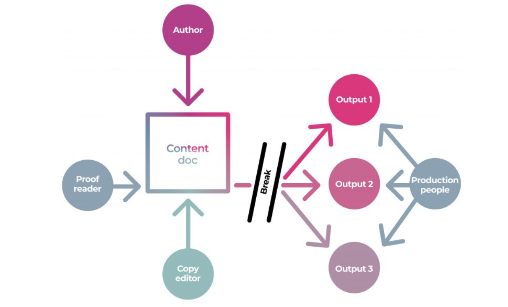
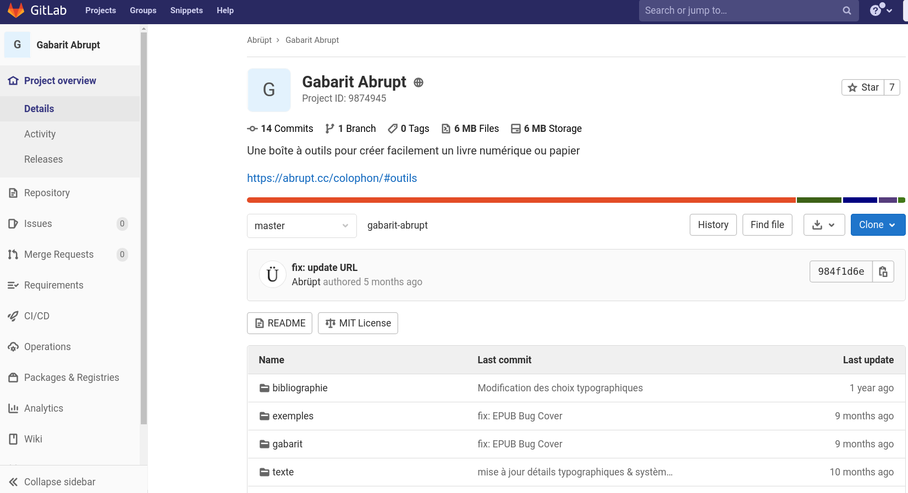
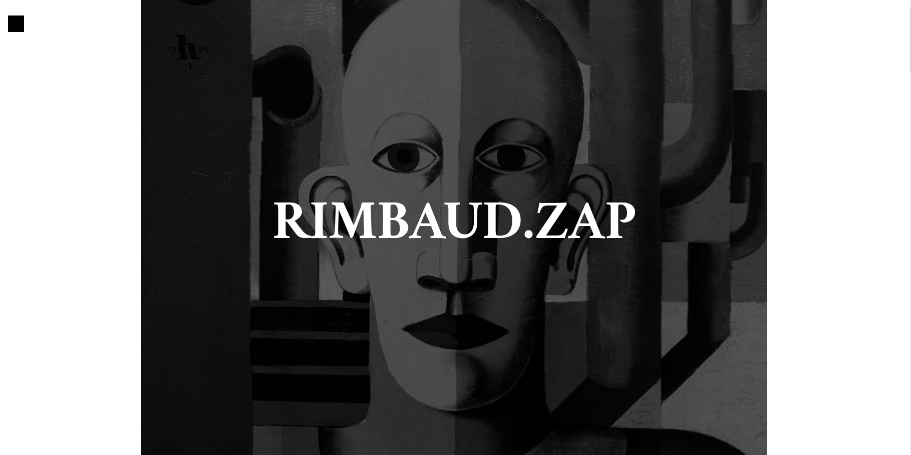
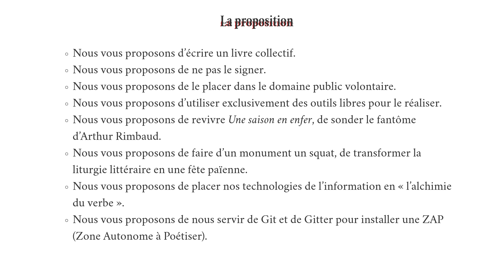
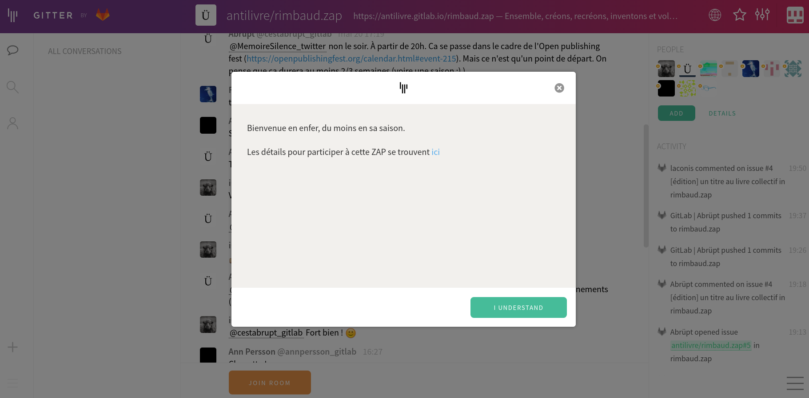
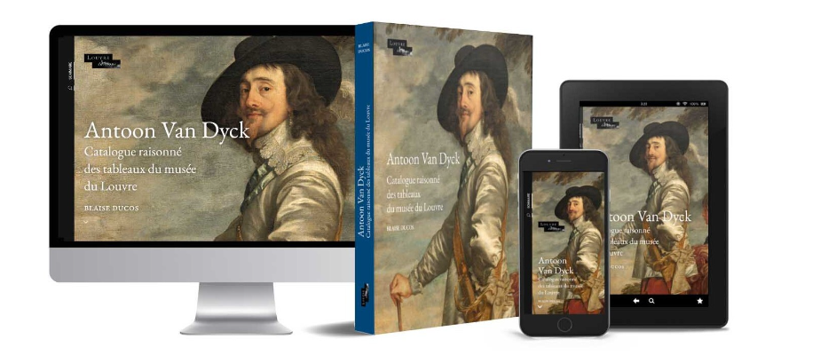

§§§§§§§§§§§§§§§§§§§§§§§§§§§§§§§§§§§§§§§§§§§§§

### Éditorialisation de la chaîne éditoriale : le modèle SSP

§§§§§§§§§§§§§§§§§§§§§§§§§§§§§§§§§§§§§§§§§§§§§

### *Single source publishing* ?

### Éléments de définitions

 <!-- .element: style="width:300px" -->

§§§§§§§§§§§§§§§§§§§§§§§§§§§§§§§§§§§§§§§§§§§§§

### La méthode *single-source publishing*  en bref
Le *single-source publishing* désigne une méthode de production d'un objet médiatique (livre imprimé, numérique, numérique augmenté, PDF) à partir d'une source commune, dont le format permet des exports et des transformations en une multiplicité d'autres formats.

<!-- .element: style="font-size:1.4rem; text-align:justify" -->

§§§§§§§§§§§§§§§§§§§§§§§§§§§§§§§§§§§§§§§§§§§§§

### La méthode *single-source publishing* en images

 <!-- .element: style="width:45%;float:right;margin-left:-1em;" -->

 <!-- .element: style="width:45%;float:left;margin-right:-1em;" -->

§§§§§§§§§§§§§§§§§§§§§§§§§§§§§§§§§§§§§§§§§§§§§

### Le problème

- discontinuités et ruptures au stade de la production et de la publication : une multiplication de versions
- une succession d'outils et de formats à chaque "maillon" de la chaîne : des problèmes d'interopérabilité
- une publication orientée imprimé, le multiformat relégué en "post-production" : un travail chronophage, complexe, coûteux

<!-- .element: style="width:45%;float:left;margin-left:-1em; font-size:1.4rem; text-align:justify" -->

 <!-- .element: style="width:45%;float:right;margin-right:-1em;" -->

===

- discontinuités et ruptures au stade de la production et de la publication

Le texte que vous envoyez à votre directeur, celui qu'il vous renvoie : multiplication des versions.

- une succession d'outils et de formats à chaque "maillon" de la chaîne

Problème d'interropérabilité : la chaîne porte mal son nom, car elle laisse entendre que la production d'un livre s'opère de manière séquentielle comme un long fleuve tranquille, avec peu d'acteurs impliqués. 
La réalité est plus complexe.

- une publication multiformat en "post-production" : un travail chronophage, complexe, coûteux
La production du livre est aujourd'hui principalement pensée pour de l'imprimé. 
Tout ce qui va relever de la publication multimodale, notamment en numérique (epub, HTML, livre augmenté) est pensé après, alors que c'est déjà trop tard. On va remédier un livre imprimé au lieu de penser dès le premier maillon de la chaîne une sortie numérique.

§§§§§§§§§§§§§§§§§§§§§§§§§§§§§§§§§§§§§§§§§§§§§

### La solution *SSP*

* Un écosystème de publication collaboratif, où interviendront *tous* les acteurs de la chaîne
* Un format pivot à partir duquel on produira l'ensemble des formats nécessaires à la production du livre, quelle que soit sa forme médiatique (imprimé, numérique)

<!-- .element: style="width:45%;float:left;margin-left:-1em; font-size:1.4rem; text-align:justify" -->

 <!-- .element: style="width:45%;float:right;margin-right:-1em;" -->

===

§§§§§§§§§§§§§§§§§§§§§§§§§§§§§§§§§§§§§§§§§§§§§
<!-- .slide: data-background-image="img/SingleSourcePublishinModel.png" data-background-size="contain"-->

§§§§§§§§§§§§§§§§§§§§§§§§§§§§§§§§§§§§§§§§§§§§§
<!-- .slide: data-background-image="img/ssp-exemple-technique.png" data-background-size="contain"-->

§§§§§§§§§§§§§§§§§§§§§§§§§§§§§§§§§§§§§§§§§§§§§

### La philosophie (l'utopie ?)

>Single sourcing isn’t a specific solution, it is a general idea that must be intentionally designed into a publisher’s workflow. Single sourcing changes how people work and often requires a different tooling. The secret really, if we zoom out to a high-level abstraction of the problem, is to work out how the content creation and production folks can work in a shared ‘environment’ where they all work on the same files, the same source files – hence the term ‘single source’.

>CoKo Foundation

<!-- .element: style="font-size:1.4rem; text-align:justify" -->

===

Le single source n'est pas une solution spécifique, c'est une idée générale qui doit être intentionnellement conçue dans le flux de travail d'un éditeur. Le sourcing unique modifie la façon dont les gens travaillent et nécessite souvent un outillage différent. Le secret, si l'on s'en tient à une abstraction du problème, est de trouver comment les personnes chargées de la création et de la production du contenu peuvent travailler dans un "environnement" partagé où elles travaillent toutes sur les mêmes fichiers, les mêmes fichiers sources - d'où le terme "source unique".

### Expérimentations *ssp* dans les écritures littéraires 
#### Une poétique du hack dans la *gittérature* de la maison *Abrüpt*

<!-- .element: style="width:400px" -->

§§§§§§§§§§§§§§§§§§§§§§§§§§§§§§§§§§§§§§§§§§§§§
<!-- .slide: data-background-image="img/abruptGitterature.png" data-background-size="contain" -->

source image : [Site web d'Abrüpt](https://abrupt.cc/)

<!-- .element: class="source" -->

===

§§§§§§§§§§§§§§§§§§§§§§§§§§§§§§§§§§§§§§§§§§§§§
<!-- .slide: data-background-video="img/abruptcropped.mp4" data-background-size="contain" -->

source image : [page d'accueil du site web d'Abrüpt](https://abrupt.cc/)

<!-- .element: class="source" -->

===

Abrüpt est une maison d'édition Suisse, mais il serait plus juste de dire qu'elle habite web (j'y reviendrai). J'ai tendance, vous le constatez, à personnifier mon objet d'étude, mais c'est que les éditeurs-artisans-bricoleurs à l'origine du projet se font bien discrets. Ils vous répondront toujours quand vous avez une question à leur poser, mais ils semblent tout particulièrement attachés à s'exprimer à travers un "nous" maintenant une certaine équivoque (entre acteurs "humains", acteurs "techniques", "acteurs institutionnels") :

>notre situation est Internet, mais notre corporéité reste pour l’instant établie du côté de Zürich, en cette terre helvétique où se promènent les fantômes affranchis de quelques réfugiés de l’histoire.

De fait, Abrüpt -- puisque je me contenterai moi aussi de ce seul nom -- adopte la rhétorique d'un mouvement collectif. En effet :

>C’est abrüpt. Le mot se disperse dans l’obscur, et il ne nous reste plus que des livres à jeter au monde pour manifester rêves et hurlements. Nous nous organisons autour de textes qui s’agitent et se révoltent, s’altèrent en antilivres, s’échouent en partage. Nous fabriquons de la transdialectique et trafiquons du papier, nous prenons note d’une cyberpoétique dont le verbe fomente l’erreur au cœur du réel. Il bruit. Nous sommes à l’écoute.

§§§§§§§§§§§§§§§§§§§§§§§§§§§§§§§§§§§§§§§§§§§§§
<!-- .slide: data-background-image="img/abruptManifeste.png" data-background-size="contain" -->

source image : [Manifeste Abrüpt](https://www.antilivre.org/#manifeste)

<!-- .element: class="source" -->

===
Comme de nombreux collectifs Abrüpt a un projet. Ce projet a été formulé dans un manifeste que vous trouvez en ligne sur le site web de la maison.

Morceaux choisis :

§§§§§§§§§§§§§§§§§§§§§§§§§§§§§§§§§§§§§§§§§§§§§

> L’antilivre est une métamorphose, est son désordre, est l’affirmation d’une littérature des courts-circuits, de sa circulation joyeuse, contre l’époque, contre le livre et sa grammaire, contre sa chaîne et ses ronronnements, pour un futur des altérations, pour une information libre et réticulaire, pour une multitude éclairée par celle-ci.

<!-- .element: style="font-size:1.4rem; text-align:justify" -->

>L’antilivre n’a pas de forme, son impermanence dispose de toutes les formes, il se transforme sans cesse, et son information brute ne connaît aucune fixité, aucune frontière, elle fragmente son essence, distribue le commun, déploie sa liberté au-devant de nos singularités cybernétiques.

<!-- .element: style="font-size:1.4rem; text-align:justify" -->

>L’antilivre a pour ennemi toute culture. La culture ne lutte pas, elle tient la matraque, elle divertit, puis assomme.

<!-- .element: style="font-size:1.4rem; text-align:justify" -->

===

L'abrüpt manifeste de l'antilivre -- et de l'antilittérature -- détaille un programme aussi poétique que politique, où la références au mouvement des communs s'accompagne d'un appel à bousculer le verbe, la langue, et plus largement l'institution culturelle dans son ensemble. Un manifeste à l'image du catalogue où cohabitent des classiques de la pensée SHS du XX^e^ siècle (Simone Weil, Pierre Kropotkine), des auteurs contemporains que l'on aura déjà croisés ici et là sur des plateformes bien connues (Pierre Ménard et Christine Jeanney, contributeurs réguliers à publie.net), mais aussi de nouveaux noms, en tout cas pour moi : Lucia Pigliapochi ou Otto Borg. Il y a de l'essai, de la poésie, du récit, de l'image aussi (photographie, dessin). Bref, un catalogue très hétérogène en apparence, mais dans le quel se file une ligne éditoriale claire.

§§§§§§§§§§§§§§§§§§§§§§§§§§§§§§§§§§§§§§§§§§§§§

### Abrüpt, l'antilivre de la littérature
* Repenser la séquentialité de la chaîne éditoriale
* Ouvrir le livre *et* donc le texte (modularité, multiformats)

<!-- .element: style="font-size:1.6rem; text-align:justify" -->
===
Dans le manifeste antilittéraire d’Abrüpt, le poétique et le politique sont indissociables. La référence au mouvement des communs s’accompagne d’un appel à bousculer le verbe, la langue, et plus largement l’institution culturelle dans son ensemble.
L'antilivre repose de plus sur une conception très technique, entièrement arrimée au protocole GIT.

§§§§§§§§§§§§§§§§§§§§§§§§§§§§§§§§§§§§§§§§§§§§§
<!-- .slide: data-background-image="img/dio-abrupt.png" data-background-size="contain"-->

source image : Dio, *Anthropie*, sur le site de l'éditeur Abrüpt

<!-- .element: class="source" -->

===

L'antilivre est multiple. 
On a une belle expression de cette multimodalité.

§§§§§§§§§§§§§§§§§§§§§§§§§§§§§§§§§§§§§§§§§§§§§
<!-- .slide: data-background-image="img/dio-html.png" data-background-size="contain"-->

source image : Dio, *Anthropie*, antilivre HTML

<!-- .element: class="source" -->

§§§§§§§§§§§§§§§§§§§§§§§§§§§§§§§§§§§§§§§§§§§§§
<!-- .slide: data-background-image="img/dio-pdf.png" data-background-size="contain"-->

source image : Dio, *Anthropie*, PDF

<!-- .element: class="source" -->

===

§§§§§§§§§§§§§§§§§§§§§§§§§§§§§§§§§§§§§§§§§§§§§
<!-- .slide: data-background-image="img/anthropieVoleCeLivre.png" data-background-size="contain"-->

source image : Dio, *Anthropie*, version imprimée

<!-- .element: class="source" -->

===

§§§§§§§§§§§§§§§§§§§§§§§§§§§§§§§§§§§§§§§§§§§§§
<!-- .slide: data-background-image="img/dio-git.png" data-background-size="contain"-->

source image : Dio, *Anthropie*, dépôt Git

<!-- .element: class="source" -->

===

§§§§§§§§§§§§§§§§§§§§§§§§§§§§§§§§§§§§§§§§§§§§§

### De la chaîne à l'environnement éditorial : GitLab

<!-- .element: style="width:45%;float:left;margin-left:-1em; font-size:2rem; text-align:justify" -->

<!-- .element: style="width:45%;float:right;margin-right:-1em;" -->

===

Le modèle éditorial repose sur l'utilisation d'une plateforme un peu particulière : la plateforme Gitlab, qui tient son nom du logiciel/protocole GIT. Je vais détailler le fonctionnement de cet outil dans un instant, mais en deux mots : Git est une forge logicielle [c'est surtout un protocole] de développement collaboratif qui, grâce à son système de gestion de versions, permet à des informaticiens de produire, échanger, modifier du code, le tout selon une logique contributive. GitLab, quant à lui, est un logiciel libre basé sur [le protocole/logiciel] GIT, auquel s'ajoutent des fonctionnalités de wiki, un système de suivi des bugs et de communication.

Gitlab est ce que l'on a baptisé en informatique une "forge" : un système de gestion de maintenance collaboratif de texte. Selon Violaine Louvet "L'objectif d'une forge est d'offrir un espace d’échange permanent et de collaboration en ligne aux développeurs de logiciels, et un espace de distribution (versions publiques des logiciels développés : paquets sources, pages web) pour les utilisateurs (pour tout un chacun si la forge est publique). Elle permet ainsi de rassembler des projets et des développeurs, mais aussi d'autres personnes travaillant sur ces projets (utilisateurs, traducteurs...)." (Source : [PLUME](https://www.projet-plume.org/ressource/faq-forge)).

§§§§§§§§§§§§§§§§§§§§§§§§§§§§§§§§§§§§§§§§§§§§§

### GitLab, la plateforme d'écriture des geeks
* Une plateformisation à contre-courant (compétence technique & littératie numérique)
* Une philosophie anti-wattpad (*vs* "Don't think, just write")
* Une technologie libre
* Une rencontre entre deux philosophies d'écriture : l'informatique et la littérature

<!-- .element: style="width:45%;float:left;margin-left:-1em; font-size:1.4rem; text-align:justify" -->

<!-- .element: style="width:45%;float:right;margin-right:-1em;" -->

===

Bref : gitlab, c'est une plateforme de *geeks*, pas d'écrivains. Et rien que pour cette raison, il s'agit d'un cas d'étude assez intéressant pour le sujet qui nous occupe aujourd'hui, car elle prend le contre-pied du mouvement de plateformisation des écritures web "littéraires" qui, de manière générale, ont plutôt fait le pari d'ouvrir les outils à des publics sans compétences techniques poussées, voire sans littératie numérique du tout.

Dans un contexte où les plateformes numériques redoublent d'effort pour, en surface, proposer des outils hyper-simples à utiliser, le passage par un logiciel tel que Gitlab propose au contraire de faire apparaître, pour mieux les penser, les différents niveaux de l'écriture web, et notamment le code informatique dont les usagers dans leur grande majorité n'ont généralement aucune connaissance. Il y a quelques années, Wattpad avait lancé une campagne publicitaire dont le slogan était "Don't think, just write" -- prônant la démocratisation d'une écriture créative en ligne, libérée de la contrainte technique. C'est un peu le chemin inverse que prône la gittérature : pour écrire, pensez d'abord à ce qui vous permet d'écrire. Ce qui peut ressembler à un verrou technique avec Gitlab est cependant compensé par une nette ouverture en termes d'autorité, puisque le système repose sur un principe de co-écriture et de partage des sources.

Que l'on me comprenne bien : Gitlab n'est pas une "niche" -- la plateforme dit compter près de 30 millions d'utilisateurs, ce qui n'a rien d'anodin -- elle s'adresse simplement à une espèce d'écrivains un peu à part certes, mais d'écrivains tout de même : celle des développeurs, en apparence assez éloignés des écrivains littéraires.

Ce que je vais dire peut sembler évidement mais je crois qu'il est bon de le rappeler : on aurait tort de considérer l'écriture du code comme une activité purement technique. L'histoire de l'informatique, l'émergence et la construction des langages de programmation s'est accompagnée d'une pensée théorique [et politique] sur les enjeux conceptuels [et politiques] de la technique. Dans le champ littéraire, les *critical code studies* jouent depuis longtemps avec la dimension poétique du code informatique. La gittérature s'inscrit en partie dans ce cadre, mais il me semble qu'elle va plus loin, puisqu'il s'agit de confronter la littérature à un autre modèle d'écriture, celui de l'écriture logicielle, de manière à bousculer des concepts fortement ancrés dans la tradition littéraire, à commencer par celui d'autorité.

§§§§§§§§§§§§§§§§§§§§§§§§§§§§§§§§§§§§§§§§§§§§§

### Écrire avec Gitlab
* Rien ne se perd, rien ne se crée, tout se transforme
* Coder *sur* du code : une écriture-palimpseste
* Un modèle contributif ("autorité partagée", mutualisation des compétences)
* Un espace conversationnel

<!-- .element: style="width:45%;float:left;margin-left:-1em; font-size:1.4rem; text-align:justify" -->

<!-- .element: style="width:45%;float:right;margin-right:-1em;" -->

===

Le *hack*, ainsi entendu, c'est donc en fait un principe d'écriture -- sans doute pas si éloigné d'ailleurs d'une tradition littéraire ancienne favorisant la parodie, le pastiche, et plus récemment les défis oulipiens. En programmation, on ne code jamais à partir de zéro ! On prend des morceaux de codes déjà écrits pour les adapter, les amender, les améliorer. L'écriture du code relève d'une logique du palimpseste.

Évidemment, un tel paradigme d'écriture ne va pas sans une boîte à outil permettant de démonter, réagencer, partager le code. C'est là qu'intervient une forge telle que Gitlab, sorte de bibliothèque (ou de dépôt géant) où sont conservés les morceaux de code.

Concrètement, comment ça marche ? Vous clonez un dépôt de code en local sur votre ordinateur, vous le manipulez, le travaillez le retravaillez, avant de le renvoyer sur le serveur pour le partager avec le reste des contributeurs.

§§§§§§§§§§§§§§§§§§§§§§§§§§§§§§§§§§§§§§§§§§§§§

### La _ZAP_ Abrüpt : hacker Rimbaud

ZAP : Zone à poétiser.
[ZAP Rimbaud](https://www.cyberpoetique.org/rimbaud.zap/)

<!-- .element: style="width:45%;float:left;margin-left:-1em; font-size:1.4rem; text-align:justify" -->

<!-- .element: style="width:45%;float:right;margin-right:-1em;" -->

===
Je prendrai pour exemple un peu plus concret le projet de ZAP (pour zone autonome à poétiser) Rimbaud. En mai 2020, soit au moment où beaucoup d'entre nous étaient encore confinés, dans le cadre de l’Open Publishing Fest, Abrüpt a lancé un appel afin, je cite "d’installer un squat dans le monument Rimbaud et d’y lancer une réécriture frénétique et collective de sa *Saison en enfer*".

Le principe était simple : réécrire, de manière collective, par-dessus le texte de Rimbaud pour créer un nouvel objet littéraire.

§§§§§§§§§§§§§§§§§§§§§§§§§§§§§§§§§§§§§§§§§§§§§
<!-- .slide: data-background-image="img/ZAP.png" data-background-size="contain" -->

===
Quelques règles de base (à vrai dire très peu):
- renoncer à son autorité : le résultat de serait pas signé et déposé dans le domaine public volontaire
- n'utiliser que des outils libres (dont gitlab) à l'image de ce renoncement à la propriété intellectuelle
- adhérer à la dimension festive de l'événement, car oui, il y avait de quoi se réjouir alors que le 1er confinement s'achevait à peine, et de manière très inégale, dans le monde entier, cet événement a donné l'occasion à toute une série de contributeurs francophones (de France, de Suisse, du Québec), de se retrouver et de faire corps.

§§§§§§§§§§§§§§§§§§§§§§§§§§§§§§§§§§§§§§§§§§§§§

>Toute création est une recréation, toute invention est un vol.
>Ensemble, créons, recréons, inventons et volons.
>Ensemble, nous sommes Arthur Rimbaud.
>Ensemble, nous sommes absolument modernes.

<!-- .element: style="width:45%;float:left;margin-left:-1em; font-size:1.4rem; text-align:justify" -->

<!-- .element: style="width:45%;float:right;margin-right:-1em;" -->

§§§§§§§§§§§§§§§§§§§§§§§§§§§§§§§§§§§§§§§§§§§§§
<!-- .slide: data-background-image="img/zap_branch.png" data-background-size="contain" -->

===

Mode de fonctionnement : les participants clonaient le dépôt chez eux, proposaient des réécritures à partir d'une branche personnelle puis faisaient un merge request avec la branche master maintenue par les éditeurs.

cette solution, un peu complexe techniquement, n'a pas toujours été facile à mener.

§§§§§§§§§§§§§§§§§§§§§§§§§§§§§§§§§§§§§§§§§§§§§
<!-- .slide: data-background-image="img/zapRimbaudGitIssues.png" data-background-size="contain" -->

===
D'autres espaces ont donc été investis, notamment les espaces conversationnels traditionnels de Gitlab : celui où l'on poste habituellement des issues (cad où des utilisateurs font des réclamations ou avertissent de certains bugs) a été hacké pour poster des demandes d'ajout de texte. Ici Frank Queyraud.

§§§§§§§§§§§§§§§§§§§§§§§§§§§§§§§§§§§§§§§§§§§§§
<!-- .slide: data-background-image="img/Zap1.png" data-background-size="contain" -->

===

Parallèlement, l'espace de discussion Gitter (qui est le système de chat spécialement conçu pour les développeurs de Gitlab ou Github) a été investi par les participants, pour discuter du projet en cours, résoudre les problèmes éventuels.

§§§§§§§§§§§§§§§§§§§§§§§§§§§§§§§§§§§§§§§§§§§§§
<!-- .slide: data-background-image="img/zapcompare.png" data-background-size="contain" -->

===

Sur le dépôt Git, la fonction de comparaison des fichiers permet de suivre le hack progressif du texte de rimbaud.

§§§§§§§§§§§§§§§§§§§§§§§§§§§§§§§§§§§§§§§§§§§§§
<!-- .slide: data-background-image="img/zapfinal1.png" data-background-size="contain" -->

===
Évidemment, ce n'est pas le résultat final souhaité. Les éditeurs ont mis en place un site statique avec une CSS et des scripts pour visualiser de manière un peu plus "jolie" ce palimpseste. Tout ce code est lui aussi hébergé sur le dépôt et peut être réutilisé par d'autres.

§§§§§§§§§§§§§§§§§§§§§§§§§§§§§§§§§§§§§§§§§§§§§
<!-- .slide: data-background-image="img/zapfinal2.png" data-background-size="contain" -->

§§§§§§§§§§§§§§§§§§§§§§§§§§§§§§§§§§§§§§§§§§§§§
<!-- .slide: data-background-image="img/zapfinal3.png" data-background-size="contain" -->

§§§§§§§§§§§§§§§§§§§§§§§§§§§§§§§§§§§§§§§§§§§§§
<!-- .slide: data-background-image="img/zapfinal4.png" data-background-size="contain" -->

===
Une publication imprimée du projet a été publiée il y a un an. Pour le moment, une version livresque DIY du texte de Rimbaud a été mis à disposition par abrupt.

§§§§§§§§§§§§§§§§§§§§§§§§§§§§§§§§§§§§§§§§§§§§§
<!-- .slide: data-background-image="img/blandineVolochot.png" data-background-size="contain" -->
<!-- .slide: class="hover"-->

### Qu'est-ce qui _git_ dans la gittérature ?
* Les pratiques « non littéraires » seraient-elles l’avenir de la littérature ?
* De quoi la gittérature est-elle le _NON_ ? Désessentialisation, défétichisation, déspécification...
* Plateforme éditoriale ou d'éditorialisation ?

<!-- .element: style="width:45%;float:left;margin-left:-1em; font-size:1.4rem; text-align:justify" -->

<!-- .element: style="width:45%;float:right;margin-right:-1em;" -->

===

J'achève ici une présentation qui me donne l'impression de survoler un terrain potentiellement très riche. Aussi, je ne me sens pas vraiment à même de conclure, je préfère soulever quelques pistes en attendant vos commentaires et peut-être vos réponses, en espérant poursuivre ce chantier théorique que j'ai eu le plaisir de creuser grâce à cette journée.

1. Les pratiques « non littéraires » seraient-elles l’avenir de la littérature ?

Anaïs a parlé plus tôt de paralittérature, je vous ai quant à moi présenté le paradigme du hack à travers une plateforme d'écriture... C'est de toute manière le propre de cette journée de montrer combien la littérature "déborde" : elle déborde le livre, les institutions, les genres. Comme on le voit avec la gittérature, ce débordement s'appuie non seulement sur des outils d'écriture non-littéraires, mais aussi sur les phisolophies qui vont avec cet outil.

2. De quoi le contemporain est-il le _non_ ?
Avec la gittérature, ce sont des concepts traditionnels qui sont amenés à subir de radicales transformation. Fin de l'essentialisation. La gittérature s'inscrit en cela en plein dans le paradigme contemporain (cf. Mougin) : ce paradigme peut se définir, justement, comme un large processus de dé-définition de l’art comme de la littérature. Avec pour conséquence de reconsidérer les critères d’attribution de l’« artistique » ou du « littéraire », et d’ouvrir à de plus larges corpus. Il existe un tournant médiatique de la littérature (désormais intermédiale, transmédiale, etc.), qui engage à reconsidérer la suprématie du livre.

3. Plateforme éditoriale ou d'éditorialisation ?
Je voudrais insister sur l'effort fourni par Abrüpt pour "ouvrir" les écritures numériques : ouvrir le texte (avec la volonté que les auteurs versent leur texte dans le "domaine public volontaire"), ouvrir les protocoles, ouvrir leurs propres technologies éditoriales. Chez Abrüpt, ce n'est pas seulement l'écriture littéraire qui est libre, c'est le format même du livre : le "livre libre". Le code informatique des livres dynamique, les scripts permettant de générer les livres sont à disposition de tous. À nous de nous réapproprier ces outils et tout ce code, à nous de le *hacker*.

Évidemment, un défi se pose immédiatement, et c'est là peut-être la limite des expériences Abrüpt qui relèvent souvent de la "preuve de concept": combien de lecteurs ont les moyens de s'approprier ces plateformes ? Le contre-modèle Wattpad reste difficile à prendre en mains pour l'utilisateur lambda, et l'utopie du partage, du collectif, du libre prônée par les éditeurs Abrüpt, n'est pas nécessairement synonyme d'une véritable démocratisation. Les deux plateformes me semblent cela dit partager bcp de points communs, et oeuvrer chacune à leur manière à une redéfinition de concepts institutionnels, notamment en termes d'autorité.

DE fait, Gitlab apparaît ici davantage comme une plateforme d'éditorialisation qu'une plateforme éditoriale. Abrupt, c'est la maison d'édition qui aura impliqué ses lecteur dans l'écriture-éditorialisation, comme on l'a vu avec la ZAP Rimbaud.

§§§§§§§§§§§§§§§§§§§§§§§§§§§§§§§§§§§§§§§§§§§§§

### Vers une normalisation ?

#### Le ssp au Louvre

<!-- .element: style="width=400px" -->

§§§§§§§§§§§§§§§§§§§§§§§§§§§§§§§§§§§§§§§§§§§§§

* Un projet institutionnel
* Seul l'ouvrage imprimé est payant (coût du papier et de l'impression)
* Un catalogue d'exposition... finalement très traditionnel

<!-- .element: style="width:45%;float:left;margin-left:-1em; font-size:1.4rem; text-align:justify" -->

<!-- .element: style="width:45%;float:right;margin-right:-1em;" -->

§§§§§§§§§§§§§§§§§§§§§§§§§§§§§§§§§§§§§§§§§§§§§

## Conclusion :
De l'édition à l'éditorialisation, la fonction éditoriale est amenée à se repenser entièrement. Dans les modèles de publication (*rendre public*) numériques, le livre imprimé n'est pas nécessairement exclu, bien au contraire, mais il sera reconsidéré comme un **moment** du texte : moment de cristallisation d'une pensée, d'une oeuvre. Ainsi, sur le web, nous pouvons repérer un déplacement de la littérature qui, d'une attention entièrement tournée vers l'oeuvre, se concentre désormais vers l'écriture (comme une performance). Éditorialiser, en ce sens, engage une perte de contrôle des instances traditionnelles, redistribuées notamment à l'auteur, mais aussi à l'usager, au lecteur. Ainsi, le modèle de publication ("rendre public") du moment contemporain de la littérature offre probablement l'occasion de repenser le rôle de l'éditeur. Selon Laurent Beccaria (Les Arènes) « Le numérique a remis l'éditeur face à son métier. Il l'oblige à se concentrer sur le travail éditorial ». Là où l'auto-édition numérique fait potentiellement courir le risque de donner du pouvoir à de nouveaux monopoles, de nouveaux modèles éditoriaux voient le jour. S'ensuit une situation paradoxale où, tandis que le marché du livre en France a tendance à s'éroder, jamais autant de « petites » maisons d'édition n'ont vu le jour. Les modèles économiques sont à réinventer, sur la base de ce moment contemporain de la littérature mis en évidence par Lionel Ruffel, en collaboration avec des institutions de toute ordre (bibliothèques, résidences, institutions culturelles, etc.), et en prenant en compte la diversité du métier d'écrivain. 

<!-- .element: style="font-size:1.4rem; text-align:justify" -->

