## Qui "gouverne" le monde de l'édition ?

#### Indépendance(s), concentration(s) et bibliodiversité

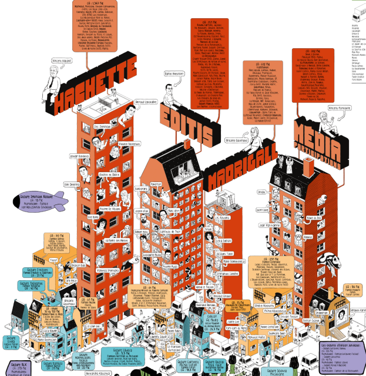<!-- .element: style="width:300px" -->

===

Dans ce cours, nous allons aborder la question de la gouvernance de l'édition.

La gouvernance est un concept qui renvoie à la manière dont un domaine d'activités est gouverné. La gouvernance renvoie à un système d'entités décisionnelles qui dirige un certain domaine d'activités, autrement dit à un « système de gouvernance », impliquant notamment une structure de gouvernance et un dynamisme de système (processus de gouvernance, activités de gestion, etc).

On pourrait passer tout un semestre sur ces questions, je n'y consacrerai que cette heure, de manière à baliser quelques problématiques qui me semblent essentielles, notamment pour introduire les autres thématiques que nous aborderons les prochaines semaines. 

L'angle que je vais choisir est celui de l'opposition, ou de la tension qui oppose, en France, le phénomène déjà ancien de "concentration éditoriale", que vous connaissez sans doute très bien parce qu'il est souvent mentionné, y compris pour parler du système médiatique, au concept un peu plus flou "d'édition indépendante". 

La question que je veux donc poser avec vous, c'est celle de l'indépendance de l'édition (qui excède la seule problématique des éditions "indépendante"), indépendance en matière de choix éditoriaux, chois de forme et de contenu, autrement dit en matière de "Bibliodiversité".

La bibliodiversité = c'est l'équivalent culturel du concept de biodiversité pour la nature. On y reviendra, la bibliodiversité, c'est la garantie d'une pluralité et d'un pluralisme de contenus, de formes, de voix, d'auteurs, d'éditeurs... la garantie d'une culture hétérogène, et non pas standardisée (sur le plan des idées, évidemment, mais également sur le plan des formes esthétiques). 

§§§§§§§§§§§§§§§§§§§§§§§§§§§§§§§§§§§§§§§§§§§§§

##### Le planisphère de l'édition 2025 (LivreHebdo)

<!-- .element: style="width:400px" -->

===

On va commencer par une analyse de terrain.

Vous les avez peut-être croisées, il existe plusieurs tentatives de cartographie de l'édition française, que l'on peut se procurer de manière à se faire une petite idée de la gouvernance. Je voudrais en passer en revue 3 avec vous, en vous rappelant qu'un cartographie n'est jamais neutre : c'est le piège, elle a vocation à rendre un paysage appréhendable et donc à l'objectiver, mais en vérité il y a toujours des partis pris, des représentations parfois inconscientes, des biais, et donc des visions un peu biaisées du monde (c'est pour cela que l'Europe est aujourd'hui encore au centre des planisphères).  

Chaque année, ainsi, à la rentrée Livre Hebdo publie son "planisphère de l'édition française". Ce planisphère est assez schématique, il va faire la part belle aux gros acteurs du secteur (Editis, Hachette, Madrigall), mais il a ceci de pratique qu'il met bien en évidence les liens entre les éditeurs et leurs distributeurs.

Je passe de suite à la suivante, et on reviendra sur cet enjeu de la distribution.

§§§§§§§§§§§§§§§§§§§§§§§§§§§§§§§§§§§§§§§§§§§§§  

##### Édition française, qui possède quoi ? (Le Monde diplomatique/Agone éditions)

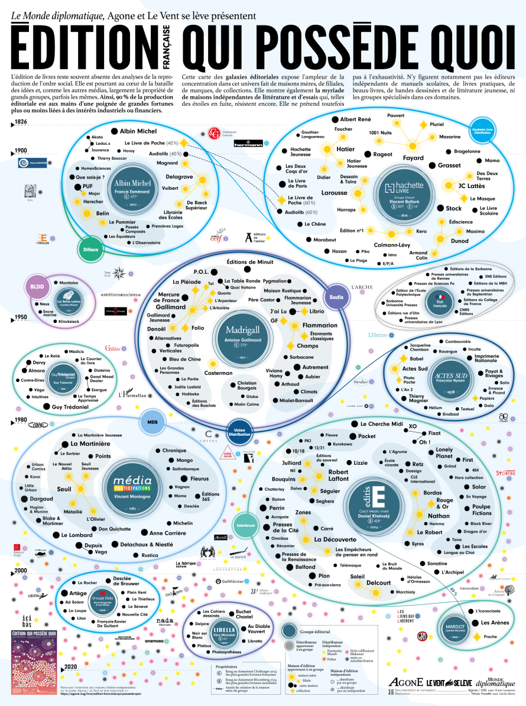<!-- .element: style="width:400px" -->

===

Seconde carte : Édition française, qui possède quoi ? (Le Monde diplomatique/Agone éditions), avril 2025. 
Agone Édition : publication de *La Trahison des éditeurs* de Thierry Discepolo (qui en est à sa 3e édition depuis 2011), et qui dénonce depuis 15 ans la concentration éditoriale.

Cette carte est engagée, je vous en lit la présentation du le site des éditions Agone :

>Bien qu’au cœur de la bataille des idées, l’édition est le plus souvent absente des analyses de la reproduction de l’ordre social. Elle est pourtant, comme les autres médias, la propriété de grands groupes, parfois les mêmes.

>90 % de la production éditoriale est ainsi aux mains d’une poignée de grandes fortunes plus ou moins liées à des intérêts industriels ou financiers. Cette carte expose l’ampleur de la concentration éditoriale tout en rendant visible la myriade de maisons indépendantes qui y échappe. Si elle tend à l’exhaustivité, n’y figurent que les éditeurs indépendants de littérature et d’essais, à l’exclusion des manuels spécialisés et livres pratiques, des beaux-livres, de la BD, de la jeunesse et du scolaire.

Elle est donc engagée, mais cela ne veut pas dire qu'elle n'est pas documentée (je rappelle qu'elle est co-publiée avec le monde diplo). Elle a le grand avantage de re-visibiliser les maisons d'éditions indépendantes. Elle montre bien, de ce point de vue, au premier coup d'oeil, le phénomène de concentration avec des noeuds 

§§§§§§§§§§§§§§§§§§§§§§§§§§§§§§§§§§§§§§§§§§§§§

##### Le cherche et trouve de l'édition française (Association pour l'écologie du livre)

<!-- .element: style="width:400px" -->

===

ENfin, ici on a une carte sensible : qui assume sa subjectivité et se veut ludique. 
Avec là encore un parti pris : davantage écologique, pour dénoncer aussi la façon dont les gros groupes, donc la concentration éditoriale, interpeler les lecteurices sur la concentration inédite du secteur du livre.

Il s'agit d'une représentation plus artitisque, avec une transposition sous forme de ville et démogrpahie : Les distributeurs sont représentés sous la forme de camions de livraison.

L’Association pour l’écologie du livre a sollicité le dessinateur de bédé David Snug.

Ce modèle est en libre accès et gratuit.

Ces cartes peuvent vous donner des pt de repère, elles n'ont pas vocation à être apprises par coeur.
Je vais en montrer les points communs et revenir sur quelques aspects parfois plus singuliers qui me semble essentiels.

§§§§§§§§§§§§§§§§§§§§§§§§§§§§§§§§§§§§§§§§§§§§§

### La "concentration éditoriale" : un phénomène ancien

>« Avec l’achat de la Librairie Nouvelle […] la maison Michel Lévy frères devient des plus considérables. On a soulevé à cette occasion une question fort délicate : celle de savoir si, à moins de clause expresse, une propriété intellectuelle peut passer de Pierre à Paul ; si, par exemple, un auteur qui a voulu s’engager primitivement avec M. Bourdilliat, le cessionnaire, et non avec M. Lévy, peut, sans être consulté, être vendu à celui-ci par celui-là… »
> Revue anecdotique, nouvelle série, t. IV, décembre 1861, p. 268. 

<!-- .element: style="width:45%;float:left;margin-left:-1em; font-size:1.4rem; text-align:left" -->

<!-- .element: style="width:45%;float:right;margin-right:-1em;" -->

===

Leçon majeure : Toutes trois font apparaître des gros noeuds identifiables sur chaque cartes et sur lesquels on va revenir : Editis & Hachette, les deux gros géants. Ces noeud, ce sont les gruopes. 

L'apparition des groupes est un phénomène connu, qui procède donc de ce que j'ai qualifié de concentration éditoriale.

La concentration éditoriale désigne un processus au cours duquel quelques individus ou organisations accroissent progressivement leur contrôle sur les médias de masse (journaux, magazines, livres, télévisions, radios, sites internet, etc.), sur l'industrie culturelle ainsi que sur les groupes de communication (entreprise de sondages, téléphonie mobile, internet, etc.) et par là, sur les moyens de produire et de diffuser de l'information (au sens large) et des savoirs.

En France, la concentration éditoriale est un phénomène ancien, les historiens du livre ont démontré qu'elle commence dès le milieu du XIXe siècle, en pleine industrialisation de l'édition. Ce qu'il faut comprendre, c'est que l'émergence de l'édition comme métier ou plus largement ensemble de métiers, va de paire avec une concentration éditoriale progressive. 

Charles Baudelaire en 1861 pointait déjà les risques de la concentration et de ses cuisines peut ragoûtantes : « Avec l’achat de la Librairie Nouvelle […] la maison Michel Lévy frères devient des plus considérables. On a soulevé à cette occasion une question fort délicate : celle de savoir si, à moins de clause expresse, une propriété intellectuelle peut passer de Pierre à Paul ; si, par exemple, un auteur qui a voulu s’engager primitivement avec M. Bourdillat, le concessionnaire, et non avec M. Lévy, peut, sans être consulté, être vendu à celui-ci par celui-là… »

Certains groupes se démarquent par leur longévité, ce sont les groupes historiques : Les premiers grands groupes éditoriaux = Gallimard, devenu à la fin du XXe siècle Madrigall.

§§§§§§§§§§§§§§§§§§§§§§§§§§§§§§§§§§§§§§§§§§§§§

### De la concentration éditoriale aux "oligopoles à frange"

>En 1968, l’économiste américain George Stigler élabora le concept d’oligopole à frange pour
permettre de comprendre l’évolution des industries culturelles dans son pays. Son analyse insiste
sur la présence d’un petit nombre d’entreprises contrôlant la plus grande part d’un marché et ne
laissant à une multitude de petites structures que la frange ou les miettes du festin. (Jean-Yves Mollier)

<!-- .element: style="width:45%;float:left;margin-left:-1em; font-size:1.4rem; text-align:left" -->

<!-- .element: style="width:35%;float:right;margin-right:-1em;" -->

===

Pour JY Mollier, la concentration éditoriale s'est lourdement agravée depuis les années 2000, pour donner lieu à ce que l'on appelle un "oligopole" à frange.

>En 1968, l’économiste américain George Stigler élabora le concept d’oligopole à frange pour
permettre de comprendre l’évolution des industries culturelles dans son pays. Son analyse insiste
sur la présence d’un petit nombre d’entreprises contrôlant la plus grande part d’un marché et ne
laissant à une multitude de petites structures que la frange ou les miettes du festin.

(STIGLER George Joseph, The Organization of Industry, Homewood (Ill.), Richard D. Irving, 1968, et, pour la France,
REYNAUD-CRESCENT Bénédicte, L’Évolution de la branche d’édition de livres en France, thèse de doctorat en sciences
économiques, dir. J. Parent, université Paris I, 1982. )

§§§§§§§§§§§§§§§§§§§§§§§§§§§§§§§§§§§§§§§§§§§§§

L’édition française n’a jamais été aussi concentrée qu’aujourd’hui. En effet, les indépendants totalisent 10% à 12% du chiffre d’affaires global. Quant à eux deux, Hachette et Editis représentent 55% du marché. 

<!-- .element: style="font-size:1.7rem; text-align:justify" -->

§§§§§§§§§§§§§§§§§§§§§§§§§§§§§§§§§§§§§§§§§§§§§

<!-- .element: style="width:400px" -->

===

Les deux gros oligopoles français sont Hachette et Editis. 
Le planisphère nous dit que Hachette = 2,873 milliards d'euros de chiffre d'affaires en 2024
et pour Editis = 773 milliards de chiffre d'affaires.

Ce sont donc les 2 qui gagnent le plus.

Si on regarde Hachette Livre, on voit bien une illustration de la notion d'Oligopole à Franges : ce sont des dizaines de maisons d'édition qui sont inclues dans ce groupe, avec même des filières à l'étranger. 

Hachette = propriété du groupe Lagardère, lui-même propriété du groupe Vivendi, dirigé par le milliardaire français Vincent Bolloré, qui affiche depuis plusieurs années un ancrage à droite, voire très à droite.

Pour bien illustrer cette notion d'oligopole à Frange, les poupées russes se déroulent aussi dans l'autre sens : Certaines structures éditoriales d'Hachette renferment elles-mêmes plusieurs maisons, ce sont donc des groupes dans le groupe. Par exemple Fayard (cas sur lequel je vais revenir) est proprio de Pluriel, 1001 nuits, Pauvert, Mazarine !

§§§§§§§§§§§§§§§§§§§§§§§§§§§§§§§§§§§§§§§§§§§§§

>Il y a un lien direct entre concentration, exigence de forte rentabilité et développement du livre-marketing. Quand une maison est rachetée par un groupe multinational, elle ne dispose d’une certaine marge d’autonomie que si ses résultats financiers sont conformes aux objectifs fixés par le groupe. Si cet objectif n’est pas tenu, la maison d’édition voit son budget sévèrement contrôlé et se trouve rapidement dépendante des autorisations de budget pour toute décision éditoriale.

<!-- .element: style="font-size:1.7rem; text-align:justify" -->

>Jeanine Brémond, *L'édition sous influence*, 2003.

<!-- .element: style="font-size:1.7rem; text-align:justify" -->

===

Et alors ? Vous pourriez me dire qu'il y a là rien de mal, c'est la règle du marché, l'édition a vocation à vendre.

Cela étant, si le livre est produit, est-ce un produit comme un autre ? Non, c'est un produit culturel.

De ce point de vue, Les effets de la concentration sont connus et dénoncés depuis plus d'un-demi siècle, en ce qu'ils modifient profondément les modes de fonctionnement des structures éditoriales et la diversité de l’offre : 

>Il y a un lien direct entre concentration, exigence de forte rentabilité et développement du livre-marketing. Quand une maison est rachetée par un groupe multinational, elle ne dispose d’une certaine marge d’autonomie que si ses résultats financiers sont conformes aux objectifs fixés par le groupe. Si cet objectif n’est pas tenu, la maison d’édition voit son budget sévèrement contrôlé et se trouve rapidement dépendante des autorisations de budget pour toute décision éditoriale.

https://www.acrimed.org/La-concentration-dans-l-edition-et-ses-effets

À l'époque, 2003, Brémond dénonçait surtout la fabrique de livres Marketin, notamment "Cosette ou le temps des illusions perdues" paru chez Plon (à l’époque Vivendi): À l’origine de ce roman, il y a une idée marketing qui repose sur deux éléments, la fascination qu’exerce le livre de Victor Hugo Les Misérables et un sujet de débat médiatisable : en effet, c'était plutôt audacieux de donner une suite au texte de Hugo. Et ça ne va pas louper, avec un procès au retentissement médiatique très fort, ce qui dispense l'éditeur de faire de la com. Ce qui pose problème dans cette logique marketing, c’est que les ventes d’un livre dépendent principalement, non de ses qualités intrinsèques (qui peuvent d’ailleurs être réelles), mais des modalités et de la puissance de la promotion du livre.

§§§§§§§§§§§§§§§§§§§§§§§§§§§§§§§§§§§§§§§§§§§§§

#### Les risques de la concentration
* Contrôle des contenus littéraires à des fins marketing
<!-- .element: style="font-size:1.7rem; text-align:justify" -->

* Contrôle des idées à des fins d'influence des foules
<!-- .element: style="font-size:1.7rem; text-align:justify" -->

* Contrôle de la chaîne éditoriale à des fins d'exclusions des structures indépendantes
<!-- .element: style="font-size:1.7rem; text-align:justify" -->

 

#### Un risque avéré pour la bibliodiversité

===

Cela étant dit, ce qui caractérise notre époque, c'est l'influence politique des groupes éditoriaux. Bien qu'habituelles, ces convergences médiatiques font aujourd'hui débat, notamment concernant les intentions et poids politiques que ces groupes peuvent avoir. Cette dimmension politique est ce qui inquiète fortement les professionnels du secteurs éditorial dès lors qu'il est question de Vincent Bolloré dont le nom est associé de plus en plus à des courants de pensée d'extrême droite.

§§§§§§§§§§§§§§§§§§§§§§§§§§§§§§§§§§§§§§§§§§§§§

#### Concentration et contrôle des contenus et des idées 

##### L'Affaire Fayard : symptôle de la droitisation de l'édition ?

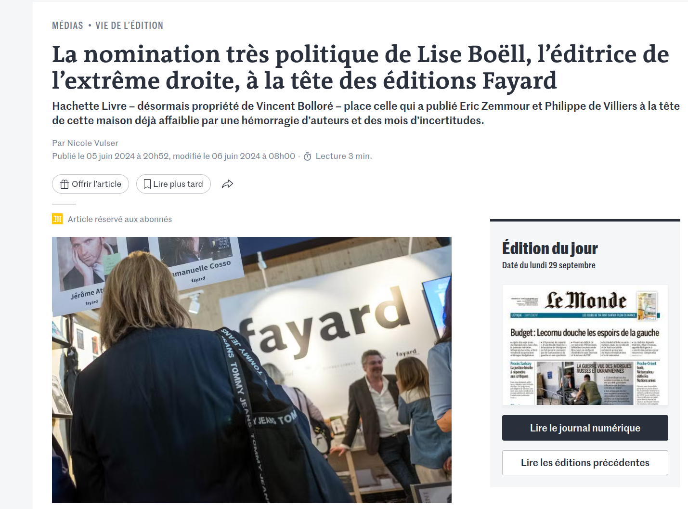<!-- .element: style="width:300px" -->

===

Pour aborder la problématique du contrôle des contenus et des idées, rien de mieux que d'évoquer les multiples affaires "fayard", du nom de cette maison d'édition qui, depuis plusieurs années, fait régulierement la Une des journaux pour des problèmes supposés d'indépendance politique.

Dernier drame en date : Lise Boell nommée directrice des éditions, afin de remplacer Isabelle Saporta. 
Lise Boëll est une éditrice française, connue pour avoir publié des auteurs comme Éric Zemmour et Philippe de Villiers. 
Son arrivée à Fayard a été marquée par une polémique, notamment en raison de son positionnement éditorial et de son passé d’éditrice d’auteurs d’extrême droite.

§§§§§§§§§§§§§§§§§§§§§§§§§§§§§§§§§§§§§§§§§§§§§

#### Avril 2024 : licenciement d'Isabelle Saporta

>Déstabilisée, Isabelle Saporta a refusé tout compromis avec [Lise Boëll] l’ex-éditrice d’Eric Zemmour et s’est opposée à toute collaboration avec elle. En désaccord stratégique avec son actionnaire, qui veut manifestement donner une nouvelle ligne politique à une autre maison d’édition historique, Isabelle Saporta est remerciée.

<!-- .element: style="width:45%;float:left;margin-left:-1em; font-size:1.4rem; text-align:justify" -->

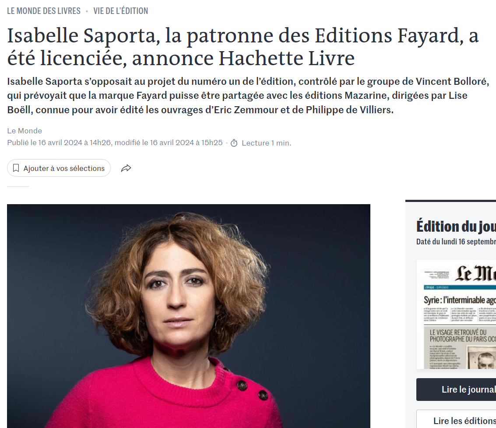<!-- .element: style="width:45%;float:right;margin-right:-1em;" -->

===

Il faut dire que l'arrivée de Lise Boëll s'est effectuée au prix d'un limogeage, avec le licenciement de la PDG de Fayard, Isabelle Saporta en avril 2024.

Licenciée pour avoir refusé de céder un accord de licence permettant l’utilisation de la marque de la maison au profit de l’ancienne éditrice d’Eric Zemmour, Lise Boëll, qui était à l'époque éditrice pour Plon (vous vous souvenez ? Mazarine fait partie du groupe Fayard, lui-même propriété d'Hachette, lui-même chez Lagardère, lui-même chez Vivendi... propriété de Bolloré).

Marquée très à droite, cette dernière a également publié des ouvrages de Philippe de Villiers et, selon L’Obs, s’apprête à signer avec le président du Rassemblement national, Jordan Bardella. Lise Boëll a été nommée directrice générale des éditions Mazarine, une filiale créée par Fayard en 1979, le 22 février. Mais elle souhaitait que ses auteurs puissent signer sous la marque Mazarine/Fayard, profitant ainsi de la renommée de la maison historique.

Comment Lise Boëll a-t-elle pu obtenir la tête de Saporta, pourtant directrice d,une grande maison comme Fayard ? Parce qu'elle avait le soutient de Vincent Bolloré, qui a racheté en 2023 le groupe Hachette, dont Fayard fait partie... 

§§§§§§§§§§§§§§§§§§§§§§§§§§§§§§§§§§§§§§§§§§§§§
<!-- .slide: data-background-image="img/" data-background-size="contain" -->

#### 2022. Licenciement de Sophie de Closets

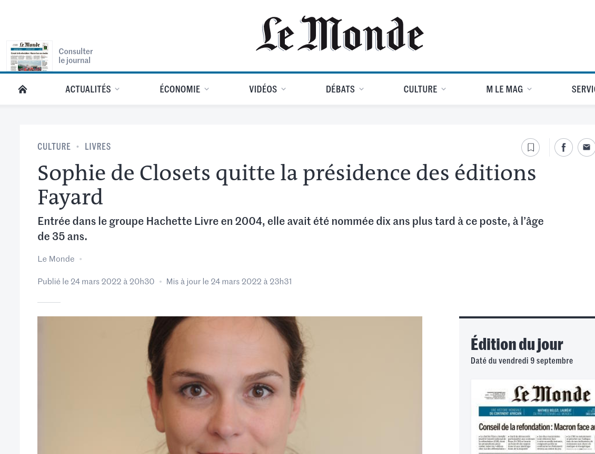<!-- .element: style="width:45%;float:left;margin-right:-1em;" -->

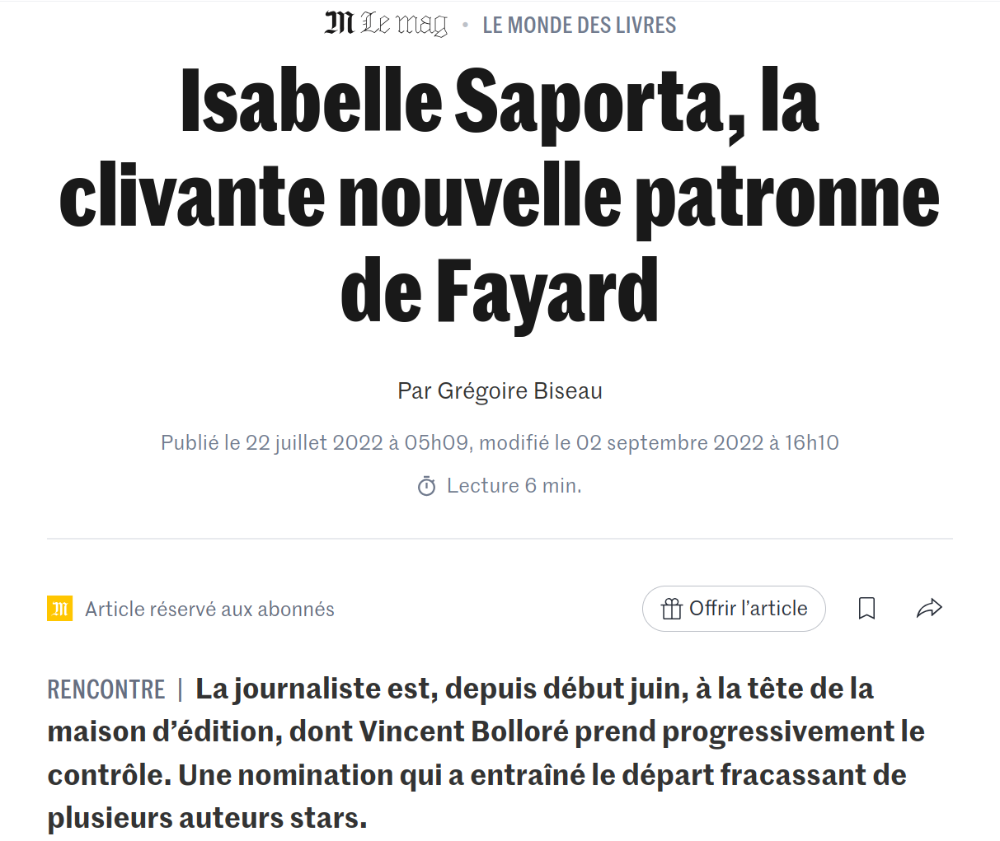<!-- .element: style="width:45%;float:right;margin-right:-1em;" -->

===

Saporta victime de la droitisation de l'édition, et de la concentration éditoriale ? N'allons peut-être pas si vite en besogne. 

Il y a trois ans, Le 24 mai 2022, c'est en effet Sophie de Closets, présidente-directrice générale des éditions Fayard, quittait son poste après avoir subit notamment des pressions de la part d'Hommes politiques dont Sarkozy, après la publication de Gérard Davet et Fabrice Lhomme, sur l'affaire Fillon.

À l'époque, ce n'est pas Vincent Bolloré qui dirige Hachette, c'est encore Arnaud Lagardère, très proche de Nicolas Sarkozi. Selon les médias, et les principaux intéressés, c'est bien Nicolas Sarkozy qui exige le départ de Sophie de Closets, pour placer Isabelle Saporta, qui n'était alors "que" directrice de collection : statut tout à fait honnorable, mais relativement peu suffisant pour devenir PDG d'une aussi grande maison.

Cependant voilà : Hachette Livre est passé à la fin de 2023 sous le contrôle de Vivendi, groupe du milliardaire Vincent Bolloré, accusé par de nombreux rivaux de vouloir se servir de ses maisons d’édition pour promouvoir un projet politique très à droite -- encore plus à droite que la droite de NS. C'est dans ce nouveaux contexte que s'est joué le départ d'Isabelle Saporta, 2 ans tout juste après son arrivée à la tête de la maison d'édition.

Difficile de ne pas des influences politiques dans ces décisions managériales mais également éditoriales.

§§§§§§§§§§§§§§§§§§§§§§§§§§§§§§§§§§§§§§§§§§§§§

#### 2022, la menace de la fusion Éditis Hachette : le stade ultime de la concentration éditoriale ?

>La diversité, c’est la substance même de l’édition ; et c’est bien en son nom que la loi instituant un prix unique du livre a été votée à l’unanimité de la Chambre en 1981. [Antoine Gallimard]

>Sur le marché du livre, ce mélange des genres peut agir comme un cyclone. Avec son pouvoir d’attraction, le groupe de Vincent Bolloré pourrait assécher les terres de l’édition, en s’accaparant des droits à des prix d’acquisition hors marché. C’est un des piliers de notre culture du livre qui pourrait alors être atteint : la péréquation économique entre des livres de fonds et des livres d’exploitation rapide, laquelle permet le financement de la création dans toute sa diversité. [Antoine Gallimard]

<!-- .element: style="width:45%;float:left;margin-left:-1em; font-size:1.2rem; text-align:justify" -->

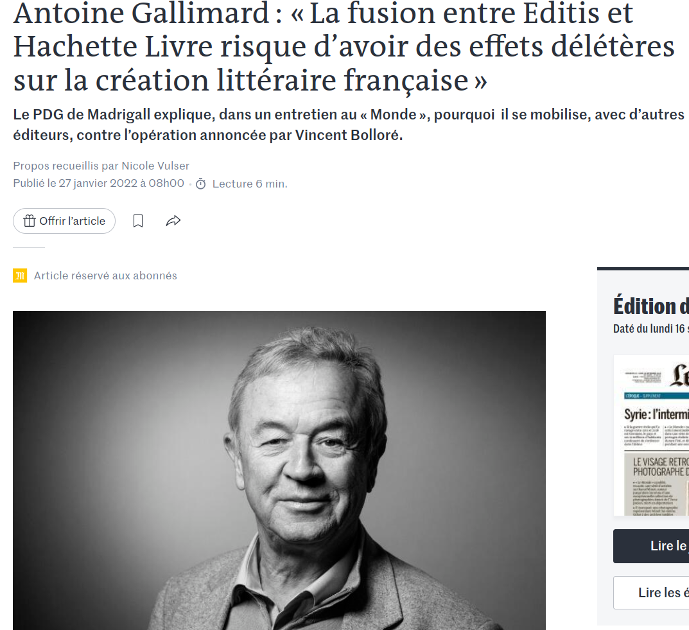<!-- .element: style="width:45%;float:right;margin-right:-1em;" -->

===

Aujourd'hui, en France, La concentration éditoriale donne lieu à une tension croissante entre les deux grands groupes éditoriaux français, ou les deux oligopoles à franges : Editis & Hachette. 

Ces deux plus gros acteurs de la concentration éditoriale sont des groupes qui relevaient jusqu'en 2023 de deux entités distinctes : 
- Editis était sous la houlette de Vivendi, propriété de Bolloré
- Hachette était détenu par Lagardère.

Inutile d'expliquer pourquoi, lorsque Vincent Bolloré a annoncé sa volonté de racheter Hachette, le secteur de l'édition tout entier s'est ému de la nouvelle, à l'image d'ANtoine Gallimard.

§§§§§§§§§§§§§§§§§§§§§§§§§§§§§§§§§§§§§§§§§§§§§

#### 2023-24 : le numéro un et le numéro deux de l'édition français changent de mains

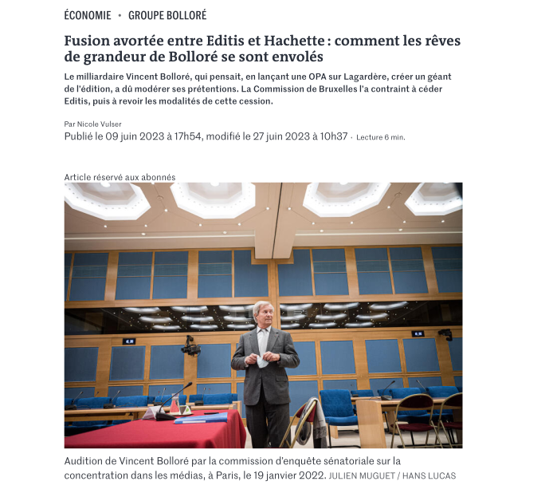<!-- .element: style="width:45%;float:left;margin-right:-1em;" -->

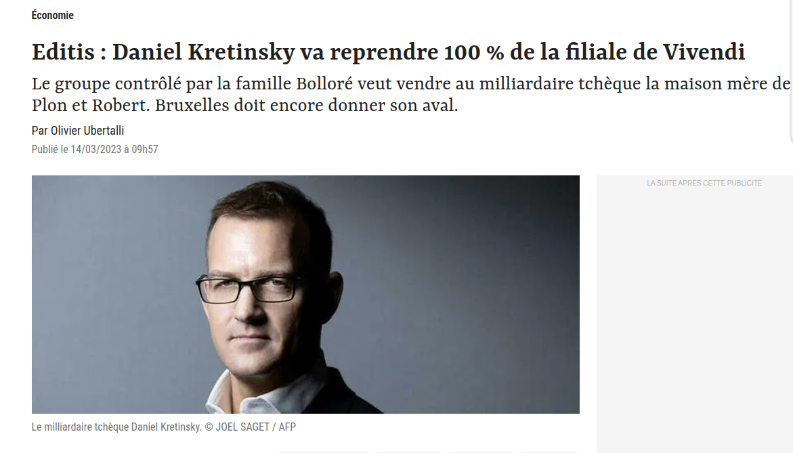<!-- .element: style="width:45%;float:right;margin-right:-1em;" -->

===

Les éditeurs français se sont bcp mobilisés, et finalement la commission européenne, qui effectue tout de même un contrôle des rachats de médias, a autorisé Bolloré à racheter Hachette à condition de céder Editis. 

Depuis l'année dernière, 2023, Hachette est la propriété de Bolloré (d'où les tensions avec Saporta) et Editis est donc désormais sous la houlette de Daniel Kretinsky,  avocat, homme d'affaires et milliardaire tchèque : propriétaire des magazines Elle, Télé 7 Jours, Marianne, France Dimanche, Ici Paris, Usbek & Rica et Franc-Tireur. Par ailleurs entre octobre 2018 et septembre 2023, il est un actionnaire majeur du groupe Le Monde...

§§§§§§§§§§§§§§§§§§§§§§§§§§§§§§§§§§§§§§§§§§§§§

  <iframe src="https://geo.dailymotion.com/player.html?video=x8txosg"
    style="width:100%; height:100%; position:absolute; left:0px; top:0px; overflow:hidden; border:none;"
    allowfullscreen
    title="Dailymotion Video Player"
    allow="web-share">
  </iframe>

§§§§§§§§§§§§§§§§§§§§§§§§§§§§§§§§§§§§§§§§§§§§§

#### La stratégie de main-mise sur la chaîne éditoriale

<!-- .element: style="width:40%;float:right;margin-right:-1em;" -->

**Diffusion & distribution : la nouvelle concentration éditoriale**
 La concentration des activités de diffusion et de distribution constituent un risque majeur pour les éditeurs indépendants, manaçant la bibliodiversité.

<!-- .element: style="width:45%;float:left;margin-left:-1em; font-size:1.3rem; text-align:justify" -->

===

Un second aspect de la concentration éditoriale ne repose pas sur un seul plan idéologique mais tout simplement logistique et technique. 
C'est ce que l'on peut appeler la main mise sur la chaîne éditoriale.

Ce qui m'intéresse ici, ce sont ces petits camions dessinés sur la carte de l'asso pour l'écologie du livre, ou encore les gros points de distribution sur le planisphère. 

Quelle est la différence entre distribution de livre et diffusion de livre ?
Cette question peut vous paraître simple mais, pour le grand public, la réponse reste floue. 

La distribution et la diffusion de livres sont deux métiers à part entière, complètement différents. Leur point commun : ils s’inscrivent chacun dans la chaîne de commercialisation des ouvrages. Alors comment les différencier ?

§§§§§§§§§§§§§§§§§§§§§§§§§§§§§§§§§§§§§§§§§§§§§

#### Les diffuseurs
* Fonctions : référencer, stocker, expédier, retourner, facturer
<!-- .element: style="font-size:1.4rem; text-align:justify" -->

* Sociétés : Volumen (Seuil), Sodis (Gallimard), Union (Flammation), Hachette (Hachette), Interforum (Editis)
<!-- .element: style="font-size:1.4rem; text-align:justify" -->

>« la distribution assume les tâches liées à la circulation physique du livre (stockage, transport) et à la gestion des flux financiers qui en sont la contrepartie (…) Entre 8 et 15 % du prix de vente du livre revient au distributeur. » (définition SNE)

<!-- .element: style="font-size:1.4rem; text-align:justify" -->

===

Les métiers de la distributions sont principalement tournés vers la logistique et peut se résumer en quatre verbes : référencer, stocker, expédier, retourner, facturer.

Pour bien comprendre, il faut revenir en amont de la chaîne de production d’un livre. Lorsque vous terminez la direction d’ouvrage avec votre éditeur, votre livre est prêt à être commercialisé. Vous signez alors un B.A.T. (bon à tirer), qui marque le top départ de votre publication et donc la fin du travail consacré à la création. Votre éditeur peut imprimer un certain nombre d’exemplaires au lancement, ou assurer uniquement l’impression à la demande. Dans tous les cas, votre livre est prêt à être distribuer et c’est là qu’intervient le distributeur.

En France, ils se nomment Volumen, Sodis, Union, Hachette, Interforum. Ils sont les principaux distributeurs français. La plupart de ces grands noms de la distribution ne vous disent rien, et pourtant ils sont tous des filiales de grandes maisons d’édition – respectivement Seuil, Gallimard, Flammarion, Hachette et Editis. 

La structure leader en France est représentée par Hachette Livre Distribution, qui appartient au groupe éponyme, lui-même propriété de Lagardère (donc Vivendi & Bolloré). 

En ayant acquis ou créé leurs structures de distribution, les grands groupes s'épargnent donc un gros travail logistique. Mais il vont aussi enfoncer un peu plus les indépendants, qui ne bénéficient pas de la même puissance de distribution, ou alors doivent en assumer les coûts.

§§§§§§§§§§§§§§§§§§§§§§§§§§§§§§§§§§§§§§§§§§§§§

### Que font les diffuseurs ? 

#### Du référencement
* catalogues de libraires (Dilicom, Electre...)
* mise au point de fiches descriptives à destination des libraires
* moteur de recherche pour les commandes

<!-- .element: style="width:45%;float:left;margin-left:-1em; font-size:1.4rem; text-align:justify" -->

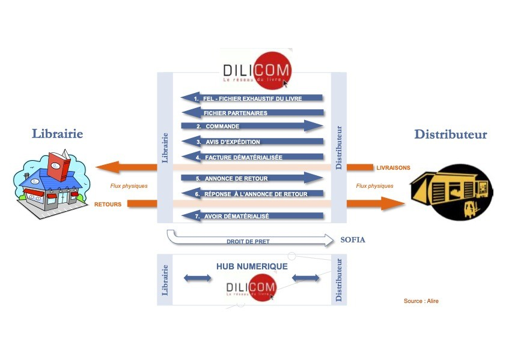<!-- .element: style="width:40%;float:right;margin-right:-1em;" -->

===

Les livres sont référencés dans le catalogue des libraires via des entités comme Dilicom ou Electre. Ainsi, les libraires ont accès à une fiche de votre livre sur leur logiciel, ce qui leur permet de commander des exemplaires de votre livre à la demande des clients ou pour le placer en rayon.

§§§§§§§§§§§§§§§§§§§§§§§§§§§§§§§§§§§§§§§§§§§§§

### Que font les diffuseurs ? 

#### Du stockage
* gestion des stocks de livres imprimés (entreposage, inventaire)

<!-- .element: style="width:45%;float:left;margin-left:-1em; font-size:1.4rem; text-align:justify" -->

>Le système incite donc financièrement les éditeurs à privilégier les ouvrages à rotation rapide ou à assurer eux-mêmes le stockage de leurs fonds dans des conditions moins coûteuses pour ne maintenir que des quantités minimales chez le distributeur. La question des stocks se pose aussi de manière particulièrement sensible pour les petits éditeurs qui ont confié leurs tirages à des structures de distribution fragiles ; les faillites successives de Distique et d’Alterdis ont ainsi privé certains d’entre eux à la fois des recettes des en-cours, mais aussi de leurs propres stocks. ( Bertrand Legendre, « Les enjeux de la distribution », Bulletin des bibliothèques de France (BBF), 2004, n° 3, p. 5-9.)

<!-- .element: style="width:45%;float:right;margin-left:-1em; font-size:1.2rem; text-align:justify" -->

===

Dans un premier temps, le distributeur gère le stock de livres imprimés. C’est toujours utile si le premier tirage de votre ouvrage s’élève à plusieurs milliers d’exemplaires, l’éditeur ne pouvant stocker des dizaines de cartons pesant une tonne dans son bureau...

Le stockage est aujourd'hui devenu un enjeu majeur face à la masse des ouvrages publiés, dans un contexte de concentration.

Selon Bertrand Legendre : 

>>Le système incite financièrement les éditeurs à privilégier les ouvrages à rotation rapide ou à assurer eux-mêmes le stockage de leurs fonds dans des conditions moins coûteuses pour ne maintenir que des quantités minimales chez le distributeur. La question des stocks se pose aussi de manière particulièrement sensible pour les petits éditeurs qui ont confié leurs tirages à des structures de distribution fragiles ; les faillites successives de Distique et d’Alterdis ont ainsi privé certains d’entre eux à la fois des recettes des en-cours, mais aussi de leurs propres stocks. 

La rotation correspond au nombre de fois où l’on vend le stock dans l’année. Plus la rotation moyenne d’une librairie est élevée, plus le stock se vend souvent, et donc la rentabilité de ce stock est bonne.

On voit ici comment la chaîne du livre entretient un cercle vicieux : la rentabilité d'un livre se calcule aussi selon la vitesse de "rotation" en librairie : tout l'enjeux est d'avoir donc des stocks qui s'écoulent vite, tant chez le libraire que, par conséquent, chez le distributeur qui s'occupe d'approvisionner les libraires. C

Pour un petit éditeur qui aurait une vingtaine de titres à son catalogue, tirés à 4 000 exemplaires chacun, la location de locaux représenterait ainsi des frais voisins de 5 000 euros par an.

§§§§§§§§§§§§§§§§§§§§§§§§§§§§§§§§§§§§§§§§§§§§§

### Que font les diffuseurs ? 

#### La gestion des expéditions et des retours & La facturation
* Envoi des commandes
* Gestion des retours
* Mise au pilon...

<!-- .element: style="width:45%;float:left;margin-left:-1em; font-size:1.4rem; text-align:justify" -->

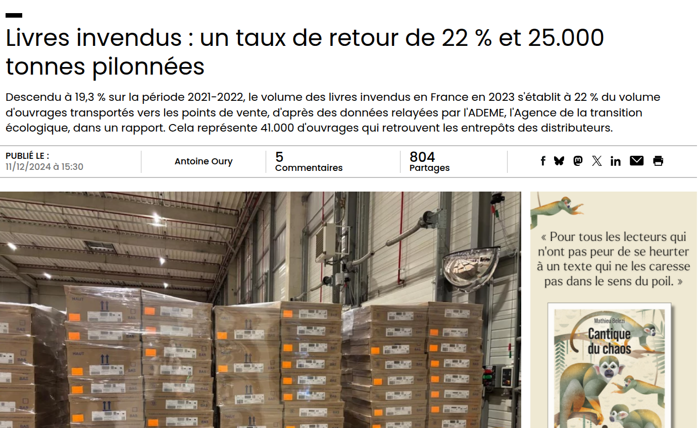<!-- .element: style="width:50%;float:right;margin-right:-1em;" -->

===

Lorsqu’un exemplaire de votre livre trouve preneur, le distributeur assure l’expédition, c’est-à-dire qu’il conditionne le colis et l’envoie par voie postale aux librairies, aux clients finaux ou à toute autre adresse renseignée par l’acquéreur. Concrètement, lorsqu’un lecteur commande votre livre sur Amazon ou dans une librairie de quartier, ils se passe trois choses : Amazon et la librairie encaissent l’argent puis transmettent la commande au distributeur qui expédie le livre sous 48h, la plupart du temps.

Selon les éditeurs, une politique de retour des livres invendus est mise en place, ainsi que la mise au pilon (destruction). Cette étape, qui permet aux éditeurs et aux auteurs de minimiser les risques financiers est, paradoxalement, facturée très cher par les distributeurs, ce qui explique que certains éditeurs ne gèrent pas cet aspect.

c’est le distributeur qui se charge de la facturation pour la simple et bonne raison qu’il est en contact direct avec les centrales d’achat et les librairies (physiques et en ligne) qui commandent les livres. Il comptabilise donc les exemplaires vendus (expédiés puis facturés par tous les intermédiaires) et transmet ponctuellement un rapport de vente aux éditeurs, ces derniers vous le transmettant à leur tour.

§§§§§§§§§§§§§§§§§§§§§§§§§§§§§§§§§§§§§§§§§§§§§

#### Les diffuseurs
* Fonctions : commercial et marketing
<!-- .element: style="font-size:1.4rem; text-align:justify" -->

* Sociétés : Hachette, Sodis, Dilisco, Interforum
<!-- .element: style="font-size:1.4rem; text-align:justify" -->

>« la diffusion désigne l’ensemble des opérations commerciales et marketing mises en œuvre par les éditeurs dans les différents réseaux de vente (…) entre 4 et 7 % du prix de vente du livre revient au diffuseur ». (définition SNE)

<!-- .element: style="font-size:1.4rem; text-align:justify" -->

===
Le métier du diffuseur est principalement commercial et marketing. Il favorise la présence des livres dans les librairies physiques et sur les salons littéraires.

Si le distributeur permet à votre livre de pouvoir être acheté partout, le diffuseur fait en sorte qu’il soit vu partout, quel que soit le point de vente : librairies indépendantes, chaines, grandes surfaces, marchands de journaux, centrales d’achat, etc.

Aujourd'hui, les grands diffuseurs sont les sociétés qui gèrent également la distribution.

Pour réussir, le diffuseur s’appuie sur une équipe de commerciaux, nommés « représentants », qui se consacre entièrement à la vente des livres, selon les étapes suivantes :

§§§§§§§§§§§§§§§§§§§§§§§§§§§§§§§§§§§§§§§§§§§§§

#### Quelques exemples de tâches pour le diffuseur
* Définition avec l'éditeur des objectifs de vente (combien d'exemplaires insérer sur le marché ?)
* Démarchage des points de vente pour faire connaître le catalogue de l'éditeur
* Produire et distribuer des supports de promotion
* Assurer le réassort des livres pour éviter les ruptures de stock

<!-- .element: style="font-size:1.4rem; text-align:justify" -->

===

Définir avec votre éditeur un objectif de nombre d’exemplaires de livres à insérer sur le marché.
Démarcher les points de vente pour leur faire connaitre le catalogue de votre éditeur et les convaincre de commander des exemplaires.
Fournir aux points de vente des supports de promotion pour mieux vendre : kakémonos, présentoirs, affiches, etc.
Prendre les commandes réceptionnées par les points de vente et les fournir à votre éditeur (qui les fournit ensuite au distributeur).
Assurer le réassort des livres dans les points de vente pour éviter les ruptures de stock.
Sensibiliser les points de vente sur les nouveautés littéraires de votre éditeur, puis reprendre au point 3., et ainsi de suite.

Bref, les diffuseurs font du porte-à-porte dans l’espoir de placer en rayon les livres de votre éditeur. Ça peut paraître normal, mais ça reste une exception dans le monde de l’édition. Peu d’éditeurs peuvent recourir aux services d’un diffuseur car ça coûte très cher et c’est un milieu élitiste. Les diffuseurs ne travaillent qu’avec des grands noms de l’édition, les éditeurs indépendants ne les intéressant guère.

§§§§§§§§§§§§§§§§§§§§§§§§§§§§§§§§§§§§§§§§§§§§§

### Le graal de la diffusion et de la distribution
* Un service coûteux réservé aux grands éditeurs
* Un déséquilibre entre groupes et éditeurs indépendants
* Des éditeurs indépendants forcés de s'auto-distribuer et s'auto-diffuser

===

Si j'ai insisté aussi longtemps sur la distribution et la diffusion, ce n'est pas pour faire de vous des experts du stockage, mais pour comprendre que se joue ici un aspect logistique assez peu médiatisé de la concentration éditoriale, et pourtant aux très lourdres conséquences sur la bibliodiversité et l'indépendance.

Une enquête de l'asso des éditeurs indépendants montre que l'écrasante majorité des petites maisons indé 67 % (moins de 25.000 € de CA) assurent eux-mêmes leur diffusion, tandis que les maisons au CA supérieur à 250.000 € ont systématiquement recours à un diffuseur et un distributeur. Effet de précarisation. 

Comme nous l’avons vu, la diffusion et la distribution peuvent parfois être assurées par la même société. Mais la sélection à l’entrée est souvent un frein pour de nombreux éditeurs qui ne peuvent compter sur aucun distributeur, ni aucun diffuseur. Ils entretiennent alors du mieux possible leur réseau de libraires pour vendre vos livres. C’est un travail de titan qu’ils assure souvent uniquement dans leur secteur. Le stockage, l’expédition et la facturation des commandes leur incombent aussi. Ces éditeurs-là sont des héros, mais leur efficacité est bien moindre que celle d’éditeurs entourés d’un distributeur et d’un diffuseur.

Si une bonne diffusion profite aux auteurs reconnus pour vendre des centaines de milliers d’exemplaires de leur livre, une bonne distribution vous permettra au moins de trouver vos lecteurs et d’être vendu partout dans le monde. Finalement, si la diffusion est LE graal quasi inaccessible pour espérer faire de votre ouvrage un bestseller, la distribution est un minimum pour que vos livres soient visibles et disponibles.

§§§§§§§§§§§§§§§§§§§§§§§§§§§§§§§§§§§§§§§§§§§§§

===

C'est ce qui explique qu'un groupe, aujourd'hui, est toujours formé de maisons + de distributeurs. Et c'est le cas aussi pour les maisons historiques : Loin d’être demeurées de simples maisons d’édition, avant tout soucieuses de création littéraire et de renforcement des collections qui en sont la carte d’identité, elles ont toutes investi considérablement dans le secteur de la diffusion et celui de la distribution. 

Récemment, en 2019, le CDE (Centre de diffusion de l’édition), la société appartenant à Madrigall, a demandé à une quarantaine d’éditeurs jusque-là diffusés, de partir et de trouver un autre prestataire de services avant le 31 décembre. 

Les seuls diffuseurs disponibles, c’est-à-dire n’appartenant pas aux grands groupes, Harmonia Mundi, les Belles Lettres, Pollen, Paon Diffusion, Dod et Cie, DG Diffusion, Hobo, Serendip et quelques autres, étaient en effet assaillis de demandes et ne pouvaient reprendre la totalité des éditeurs jetés sur le pavé. 

Exemple de prise en charge de l'indépendance : une campagne ULULE. ON aura l'occasion d'y revenir.

§§§§§§§§§§§§§§§§§§§§§§§§§§§§§§§§§§§§§§§§§§§§§

### La concentration éditoriale au XXIe siècle : une double croissance horizontale et verticale

>[La concentration éditoriale] s’est considérablement renforcée après 1945 et elle a véritablement changé de nature après 1980. En effet, pendant plus d’une centaine d’années, les achats d’entreprises s’effectuaient à l’intérieur de ce qu’il est convenu d’appeler une croissance horizontale et verticale du capital. La Librairie Hachette, par ses acquisitions permanentes de maisons d’édition concurrentes, illustre parfaitement les effets de cette croissance horizontale et, par ses rachats de papeteries,
d’imprimeries et de messageries, ceux de la croissance verticale destinée à lui permettre de
dominer toute la filière du livre.

<!-- .element: style="font-size:1.3rem; text-align:justify" -->

JY Mollier, Brève histoire de la concentration éditoriale dans le monde du livre, 2024

<!-- .element: style="font-size:1.3rem; text-align:right" -->

===

Toutefois, elle
s’est considérablement renforcée après 1945 et elle a véritablement changé de nature après 1980.
En effet, pendant plus d’une centaine d’années, les achats d’entreprises s’effectuaient à l’intérieur
de ce qu’il est convenu d’appeler une croissance horizontale et verticale du capital. La Librairie
Hachette, par ses acquisitions permanentes de maisons d’édition concurrentes, illustre
parfaitement les effets de cette croissance horizontale et, par ses rachats de papeteries,
d’imprimeries et de messageries, ceux de la croissance verticale destinée à lui permettre de
dominer toute la filière du livre.

§§§§§§§§§§§§§§§§§§§§§§§§§§§§§§§§§§§§§§§§§§§§§

### Comment penser l'indépendance éditoriale ? 

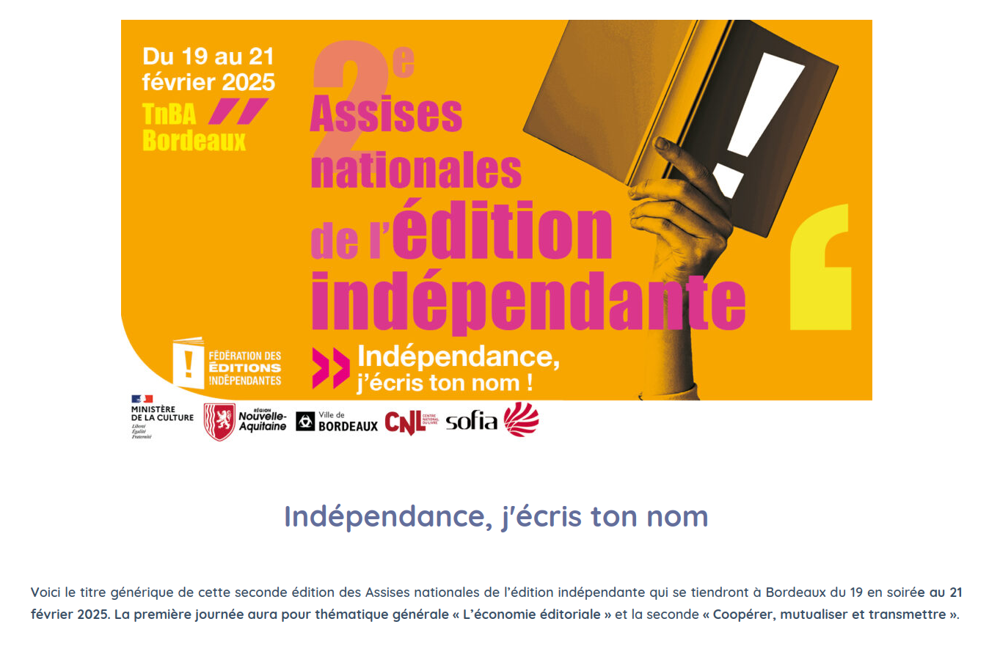<!-- .element: style="width:500px" -->

===

Nous abordons le dernier temps de ce cours, dans lequel je voudrais évoquer avec vous la question des modèles d'édition alternatifs, incarnés notamment par ce que l'on appelle de manière assez large "des éditeurs indépendants".  

Je vais en rester, pour ce cours-ci, à des considérations plutôt théoriques, et on aura le temps dans le semestre de développer des exemples plus concrets.

Disons-le tout de suite, les éditions indés sont un défi :
- elles constituent des cas limites, car économiquement ils ne sont souvent pas viables
- ils incarnent un pourcentage important de l'édition en France (de 30 à 40%, c'est selon : on va voir que c'est compliqué à définir un éditeur indé), et favorisent un principe de bibliodiversité essentiel à notre culture.

Bref : il s'agit d'une activité éditoriale qui, comme pour les auteurs, ne sont suffisent svt pas à vivre, et donc apparaissent comme une activité complémentaire, voire un hobby... 

§§§§§§§§§§§§§§§§§§§§§§§§§§§§§§§§§§§§§§§§§§§§§

### Éditeurs indépendants ? Une réalité multiple

* Une édition en marge des grands groupes
* Une définition floue et une institutionnalisation récente
* Un enjeu de bibliodiversité

<!-- .element: style="width:45%;float:left;margin-left:-1em; font-size:1.4rem; text-align:left" -->

<!-- .element: style="width:45%;float:right;margin-right:-1em;" -->

===

La notion d'éditeur indépendant recouvre une multitude de réalités, et ne fait d'ailleurs pas toujours l'objet d'un concensus. Par son principe même, l'édition indépendante a tendance à échapper à l'institutionnalisation. 

Dans un sens large, l'indépendance se pense d'abord en opposition à la notion de groupe éditorial. Aujourd'hui, 65 % de l’édition française sont détenus par les géants Hachette Livre et Editis (respectivement = Bolloré et Kretinsky), auxquels il faut ajouter les autres groupes (Madrigall, Média Participations…). Déjà, on voit que mon propos peut être problématique, dans la mesure où je mets dans le même pannier Madrigall (Gallimard - encore une maison familiale aujourd'hui ; ou même Actes Sud qui appartient encore à la famille Nyssen) et Hachette de Bolloré. 

La notion d'éditeur indépendant se pense d'abord dans ce contexte d'une concentration des maisons d’édition est extrême, où l’édition indépendante est marginale.

La qualification « édition indépendante », dans ce sens, désigne les maisons d'édition, souvent de petite taille, mais pas toujours (Actes Sud est une grande maison), qui n'appartiennent pas aux groupes d'édition qui forment aujourd'hui l'oligopole en réseau de l'édition et des médias.

Dans un contexte d'amplification majeur de la concentration éditoriale, ainsi que de politisation croissante des grands groupes éditoriaux, les éditeurs indépendants ont tenté ces dernières années de s'organiser.

En 2023, la FEDEI, pour Fédération des éditions indépendantes (éditions plutôt que éditeurs) a ainsi organisé les premières assises des indépendants. 2e édition à venir en 2025, à Bordeau. Il s'agit d'une jeune Fédération, qui attire de plus en plus l'attention sur elle. 

§§§§§§§§§§§§§§§§§§§§§§§§§§§§§§§§§§§§§§§§§§§§§

### L'indépendance selon la fédération des éditions indépendantes 

* Publier uniquement à compte d’éditeur des publications de toute nature, commercialisées auprès du public,
* Ne pas être contrôlée, directement ou indirectement, par l’État, une collectivité territoriale ou un établissement public, par un groupe d’éditions ou un groupe financier et
* Réaliser un chiffre d’affaire dont le montant annuel ne dépasse pas 10 millions d’euros.

<!-- .element: style="width:45%;float:left;margin-left:-1em; font-size:1.4rem; text-align:left" -->

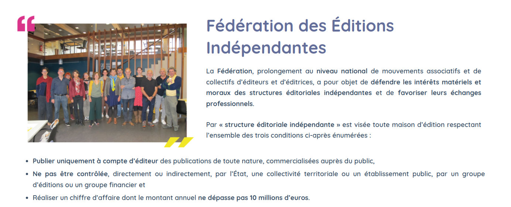<!-- .element: style="width:45%;float:right;margin-right:-1em;" -->

===

Définition de la FEDEI. 

La FEDEI estime approximativement à 2500, le nombre de maisons d’éditions indépendantes sur le territoire national, répondant à ces critières. 

>Elles ne sont pourtant que très peu représentées auprès des pouvoirs publics. Nous constituons un maillage dense et riche, porteurs d’emplois et culture. Mais nous sommes peu visibles et fragiles face à l’offre pléthorique dont les grands groupes éditoriaux abreuvent le marché. 

§§§§§§§§§§§§§§§§§§§§§§§§§§§§§§§§§§§§§§§§§§§§§

### L'indépendance ...

* Économique 
* Éditoriale / idéologique (une édition _engagée_)
* Créative / esthétique (une édition alternative)

### ... et ses défis
* Économiques (rentabilité moindre voire nulle)
* Logistiques (Distribution et Diffusion)

===

Il existe donc de nombreuses manière de considérer son indépendance. Indépendance financière : des modèles économiques souvent non-rentables. Beaucoup de ces passionnés ne vivent pas de leur activité, avec la nécessité d’avoir plusieurs emplois, de réaliser des ateliers et autres prestations.

Une indépendance que je note ici "éditoriale ou idéologique", mais que j'aurais pu qualifier de politique. 

Une indépendance créative, enfin. 

Tout cela ne va pas sans difficultés.

§§§§§§§§§§§§§§§§§§§§§§§§§§§§§§§§§§§§§§§§§§§§§

#### Le débat de l'indépendance

La question de l’indépendance c’est considérablement complexifiée, à tel point qu’elle devient difficile à définir. Et pourtant il est indispensable de nommer et de qualifier cette façon très politique de faire de l’édition de création, si singulière et si différente de l’« édition de groupe ». Si l’on se concentre exclusivement sur le capital, donc une indépendance économique, c’est oublier la dépendance économique dans laquelle sont placées des structures qui ont recours à une diffusion distribution déléguées, qu’elle soit ou non rattachée à un groupe éditorial. La question de liberté et la qualité de choix éditoriaux ne peuvent pas non plus être utilisé seuls comme outil de définition de l’indépendance, la liberté et la qualité éditoriale se retrouvant tant dans les publications de collections appartenant à des groupes que dans celles des structures indépendantes. 

<!-- .element: style="font-size:1.7rem; text-align:justify" -->

>Benoît Laureau, co-fondateur de L’Ogre, dans « (Re)définir l’indépendance », Livre Hebdo, 2024.

<!-- .element: style="font-size:1.7rem; text-align:right" -->

§§§§§§§§§§§§§§§§§§§§§§§§§§§§§§§§§§§§§§§§§§§§§

L’indépendance serait donc surtout une question d’état d’esprit et de capacité à contrôler à minima la manière d’éditer, de fabriquer et de commercialiser le livre. Mais ce que révèle surtout cette tentative de définition, c’est que, derrière de nos indépendances individuelles (auteurs, éditeurs, libraires, diffuseurs-distributeurs), se cache une interdépendance très concrète et politique. Et il me semble aujourd’hui beaucoup plus intéressant de se concentrer sur cette notion, de la définir et s’en servir pour construire une véritable chaine du livre indépendant qui permettrait d’apporter un ensemble de réponse à nos préoccupations sociales, écologiques, et économiques.

<!-- .element: style="font-size:1.7rem; text-align:justify" -->

>Benoît Laureau, co-fondateur de L’Ogre, dans « (Re)définir l’indépendance », Livre Hebdo, 2024.

<!-- .element: style="font-size:1.7rem; text-align:right" -->

§§§§§§§§§§§§§§§§§§§§§§§§§§§§§§§§§§§§§§§§§§§§§

### Bibliodiversité : des modèles alternatifs

>« Indépendante » pour définir l’édition, est-ce là le bon terme ? Nous incarnons une mosaïque, pas un monolithe. Quel est le plus petit dénominateur commun à même d’exprimer nos singularités ? Voilà un aspect à cerner : que la perception devienne un portrait.

<!-- .element: style="font-size:1.7rem; text-align:justify" -->

>Dominique Tourte, Président de la FEDEI

<!-- .element: style="font-size:1.7rem; text-align:justify" -->

===

L'indépendance, également, renvoie à un enjeu de diversité, ce qui est plutôt logique, lorsque l'on songe au principe d'uniformisation qui caractérise les grands groupes. Ce que l'on qualifiera de bibliodiversité, ici, renvoie à une variété des idées véhiculées par les livres, une variété des publics visés, mais également une variété des formes éditoriales envisagées. 

Camille Delettre, à la tête de la maison L’Atteinte. Pour ce dernier, le terme indépendant est problématique, lui préférant « alternatif, plus proche de la réalité ». Il ne rejette certes pas le commerce, mais le souhaite éthique et moral, sans compromission.

§§§§§§§§§§§§§§§§§§§§§§§§§§§§§§§§§§§§§§§§§§§§§

## Dans les prochains cours... 

§§§§§§§§§§§§§§§§§§§§§§§§§§§§§§§§§§§§§§§§§§§§§

### Repenser les enjeux de _publication_ 

* Modèles hors le livre
* Édition numérique

<!-- .element: style="font-size:1.7rem; text-align:justify" -->

§§§§§§§§§§§§§§§§§§§§§§§§§§§§§§§§§§§§§§§§§§§§§

### Des qualificatifs multiples...

* _Small press_, 
* Petite édition, 
* _micro-édition_
* Fanzine, POD...

<!-- .element: style="font-size:1.7rem; text-align:justify" -->

#### ...pour de faibles tirages, un nombre réduit de titres & une fabrique artisannale

===

§§§§§§§§§§§§§§§§§§§§§§§§§§§§§§§§§§§§§§§§§§§§§

### L'auto-édition, une solution ? 

§§§§§§§§§§§§§§§§§§§§§§§§§§§§§§§§§§§§§§§§§§§§§

### Les GAFAM : la menace de la concentration numérique

<!-- .element: style="width:500px" -->

§§§§§§§§§§§§§§§§§§§§§§§§§§§§§§§§§§§§§§§§§§§§§

## Conclusion

La question de la gouvernance éditoriale pose celle de l'influence des grands groupes sortis vainqueurs des batailles pour la concentration éditoriale aux XX et XXIe siècles. L'actualité brûlante de cette concentration pose aujourd'hui Hachette et Editis en leader du marché, qui comprend aussi bien un catalogue d'auteurs (et d'idées) qu'une structure logistique qui leur permet de conserver leur domination. Dans ce contexte, l'indépendance éditoriale fait face à des défis multiples, mais semble plus essentielle que jamais. Cet état des lieux ouvre à de nouveaux questionnements, sur l'auto-édition, les modèles éditoriaux alternatifs, ainsi que les effets de concentration à venir, liés à l'essor de l'édition numérique.

<!-- .element: style="font-size:1.7rem; text-align:justify" -->
