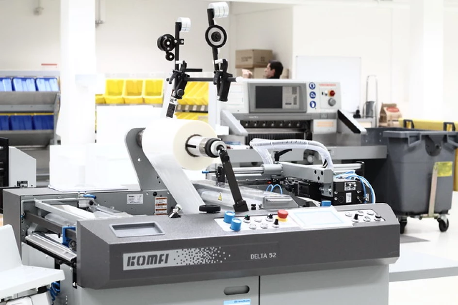

## Pourquoi la désintermédiation n'a-t-elle finalement pas eu lieu ?

#### Réintermédiation & plateformisation

<!-- .element: style="width:400px" -->

§§§§§§§§§§§§§§§§§§§§§§§§§§§§§§§§§§§§§§§§§§§§§

>Depuis longtemps, les débats à propos du Web  2.0 se sont concentrés sur la question de la désintermédiation. Avec l'accès immédiat et spontané des auteurs aux outils de publication sur des plateformes de partage de contenus en ligne, ceux qui font profession d'assurer la publication d'une œuvre, c'est-à-dire de la porter pour l'auteur vers son public, ont pu se croire neutralisés par une mise en relation directe de l'auteur au lecteur. À l'heure du « tous auteurs », « tous journalistes », la capacité des entreprises d'édition à faire accéder l'écrivant au statut d'auteur et le monopole qu'elles détiennent jusqu'alors sur cette capacité semblent s'effondrer.

>Marin Dacos, Pierre Mounier, *L'édition en réseau*.

<!-- .element: style="font-size:1.4rem; text-align:justify" -->

===

Marin Dacos, Pierre Mounier = créateurs de OpenEdition, et du CMS Lodel.

Reprenons : utopie de la désintermédiation = rêve d'une relation directe entre tous les écrivains et leur public, sans la médiation (et parfois la censure, la révision, le jugement)

§§§§§§§§§§§§§§§§§§§§§§§§§§§§§§§§§§§§§§§§§§§§§

* La désintermédiation a-t-elle vraiment eu lieu ?

§§§§§§§§§§§§§§§§§§§§§§§§§§§§§§§§§§§§§§§§§§§§§

>Contre toute attente, le scénario catastrophe de la désintermédiation n'a pourtant pas eu lieu. On sait en 2010 que la spontanéité apparente du texte 2.0 n'est qu'un leurre et que ce texte est en réalité le résultat d'une très puissante médiation, mais qui s'exprime selon des modes peu habituels et parfaitement inconnus des acteurs traditionnels. Il s'agit :

<!-- .element: style="font-size:1.4rem; text-align:justify" -->

>– du design des plateformes informatiques ;   
– de la définition des règles d'écriture et de lecture ;   
– de la gestion des communautés qui les utilisent ;   
– des algorithmes de classement de l'information produite.   

>Marin Dacos, Pierre Mounier, L'édition en réseau

<!-- .element: style="font-size:1.4rem; text-align:justify" -->

===

CITER

Que veut dire cette citation ? Qu'une publication en ligne reste, quoiqu'on en dise, le résultat d'une médiation et d'un travail éditorial. Mais d'un travail éditorial d'un genre nouveau, dont les acteurs ne sont pas toujours identifiés comme des éditeurs, ni même identifiés tout court.

§§§§§§§§§§§§§§§§§§§§§§§§§§§§§§§§§§§§§§§§§§§§§

ILLUSTRER

===

DÉtaillons, à partir de ce qu'en disent Mounier & Dacos

– du design des plateformes informatiques =  succès de certaines formes médiatiques comme la vidéo ou l'image, svnt ou dépends du texte (on va aussi développer pour une lecture sur appareil téléphone)  
– de la définition des règles d'écriture et de lecture = sur les réseaux sociaux, des règles parfois très strictes sur la taille des contenus (c'était le cas sur Twitter, ça l'est sur TikTok). Exemple également de Wikipédia. 
– de la gestion des communautés qui les utilisent = question de l'économie de l'attention, du calcul des profils, du community management qui va permettre de donner vie à un contenu, dans un contexte de surcharge informationnelle.   
– des algorithmes de classement de l'information produite = comment un contenu va-t-il être indexé sur Google ? Ou même au sein d'une plateforme (algo de Tik Tok, Youtube, Netflix, etc.)

§§§§§§§§§§§§§§§§§§§§§§§§§§§§§§§§§§§§§§§§§§§§§

## L'utopie de la désintermédiation
* La disparition d'intermédiaires historiques...
* ... sitôt remplacés par de nouveaux acteurs (géants du web, GAFAM... avec des modèles économiques et culturels différents)

===

Ce que les débats sur l'autorité contemporaine travaillent, c'est d'abord une tension entre l'utopie, propre à l'économie numérique, d'une désintermédiation, et la réalité d'une ré-intermédiation qui ne dit pas toujours son nom.

§§§§§§§§§§§§§§§§§§§§§§§§§§§§§§§§§§§§§§§§§§§§§

### De la désintermédiation à la réintermédiation

>Présentée comme à la fois un rétrécissement de la chaîne de valeur et une suppression des médiations, cette dynamique devait reconfigurer en profondeur les économies et les modalités de communication en favorisant une « im-médiateté » entre offre et demande, producteurs et consommateurs, émetteurs et récepteurs. À l’épreuve des faits, c’est le mouvement inverse qui s’est réalisé. Les acteurs se sont ainsi multipliés autour des activités mises en place par les industriels qualifiés de « plateformes », en proposant une multitude de produits connexes, de services complémentaires qui ont constitué autant de formes nouvelles de médiations informationnelles, techniques ou transactionnelles.

<!-- .element: style="font-size:1.4rem; text-align:justify" -->

Vincent Bullich, La « plateformisation » comme déploiement d’une logique organisatrice : propositions théoriques et éléments de méthode

<!-- .element: style="font-size:1.4rem; text-align:right" -->

§§§§§§§§§§§§§§§§§§§§§§§§§§§§§§§§§§§§§§§§§§§§§

### Réintermédiation numérique : le risque de la plateformisation
Uniformisation des productions s'intégrant dans un format de publication préconstruit et partagé par une communauté d'utilisateurs, avec les dérives potentielles en termes de censure, de formatage, d'appauvrissement des contenus etc.

===

L'écriture, la publication, l'évaluation, l'information... tous ces contenus passent aujourd'hui essentiellement par des plateformes, qui sont des logiciels construits par des sociétés (rarement par des communautés indépendantes), à des fins commerciales (même si ce n'est pas en publication ou en lecture que l'on paye, mais pas nos connexion, la récolte des données, la publicité, etc.)

Mounier et Dacos parlent plus haut de facteurs de réintermédiation via :
– le design des plateformes informatiques ;   
– la définition des règles d'écriture et de lecture ;   
– la gestion des communautés qui les utilisent ;   
– les algorithmes de classement de l'information produite.   

Tous ces éléments participent de ce que l'on appelle la plateformisation, à savoir
- uniformisation des productions pour entrer dans un modèle de publication préconstruit et partagé par une communauté d'utilisateurs

§§§§§§§§§§§§§§§§§§§§§§§§§§§§§§§§§§§§§§§§§§§§§
<!-- .slide: data-background-movie="img/" data-background-size="contain" -->

### La publication via des chaînes numériques dédiées : le risque de l'exploitation
* le cas Koskas & Kindle Direct Publishing (KDP)

§§§§§§§§§§§§§§§§§§§§§§§§§§§§§§§§§§§§§§§§§§§§§
<!-- .slide: data-background-image="img/kindleDirectPublishing.png" data-background-size="contain" -->

===

>La plus célèbre d’entre elles est, évidemment, Amazon Kindle Direct Publishing (KDP). A l’origine, il s’agit d’un service proposé aux auteurs pour augmenter rapidement le nombre de livres numériques disponible au format Kindle. En quelques années, KDP s’est imposé par sa simplicité d’utilisation (vous téléchargez vos fichiers de couverture et de contenu) et sa puissance de vente : 60 % des ebooks seraient en effet vendus par Amazon.

KDP existe depuis 2011 en France, 2009 aux US.

>Il en existe d’autres telles que iBooks Author (Apple), Tolino Publishing, Kobo Writing Life (Kobo/Sony) ou Google Play Books.

>La publication est gratuite et l’auteur perçoit une redevance (royalties) dont le pourcentage varie mais qui peut aller jusqu’à 70% du prix de vente.

>Ces plateformes ne proposent pas de services éditoriaux. C’est pourquoi on y trouve le pire comme le meilleur, des ouvrages d’une grande utilité comme des essais de quelques pages bourrés de fautes d’orthographe.

§§§§§§§§§§§§§§§§§§§§§§§§§§§§§§§§§§§§§§§§§§§§§
<!-- .slide: data-background-image="img/koskas2.png" data-background-size="contain" -->

===
Kokas = "Indie Author", expression anglo-saxone où l'auto-édition a fait émerger cette figure de l'auteur indépendant, sur le même modèle sémantique (valorisant), de la musique indé, ou chez nous des libraires indé.

le cas Koskas : sur la liste du Renaudot en 2018.

§§§§§§§§§§§§§§§§§§§§§§§§§§§§§§§§§§§§§§§§§§§§§
<!-- .slide: data-background-image="img/koskas1.png" data-background-size="contain" -->

===

§§§§§§§§§§§§§§§§§§§§§§§§§§§§§§§§§§§§§§§§§§§§§

>via le dispositif KDP, Amazon saisit l’opportunité de cet espace de sédition que représente l’autoédition, l’injonction à la créativité prenant ici la forme réduite d’une injonction à la production de contenus, supprimant tout intermédiaire susceptible de qualifier ces derniers. Externalisant ainsi les aléas de la valeur - aucun risque et un investissement financier tout relatif au regard de la puissance de feu d’Amazon - l’autoédition est l’un des vecteurs déployés par cet acteur, lui permettant de nourrir le catalogue de la liseuse Kindle et au-delà, d’occuper de manière exponentielle le marché du livre numérique.

>Sylvie Bosser, "L’autoédition selon Kindle Direct Publishing : Amazon et l’instrumentalisation de la créativité"

<!-- .element: style="font-size:1.4rem; text-align:justify" -->

===

Sylvie Bosser a pris en charge l'étude de la platforme KDP, et voici ses conclusions.

MÉthodologie = analysé le discours présent sur le site de KDP, ainsi que celui tenu par
Marie-Pierre Sangouard, responsable des contenus Kindle d’Amazon France + Étude du classement des meilleures ventes (soit les contenus mis en avant sur le site)

Cette méthodo "permet de déterminer les secteurs littéraires majoritairement présents et d’autre part, de voir de quelle manière s’opère, derrière ce classement, une logique de commercialisation qui s’appuie sur le savoir-faire d’Amazon en matière d’algorithme."

§§§§§§§§§§§§§§§§§§§§§§§§§§§§§§§§§§§§§§§§§§§§§
<!-- .slide: data-background-image="img/KDP-pub.png" data-background-size="contain" -->

===

Sylvie Bosser :

>Sur la page d’accueil de KDP19, l’accent est mis, dans le discours tenu, sur la simplicité du
processus, la rapidité de la mise en œuvre de celui-ci (« Publiez en quelques minutes et votre
livre apparaît sur le site d’Amazon en moins de 24 heures »), ainsi que sur la notion
d’indépendance à travers le choix possible des territoires de vente et enfin, sur le montant de
la redevance qui peut aller jusqu’à 70 %.

>l’accent est particulièrement mis sur la maîtrise du processus par la
personne : « C’est vous le chef, vous déterminez tout, du contenu au prix ».

>la personne qui a recours au service de KDP est d’emblée désignée comme
écrivain, pouvant de cette manière se passer de l’intermédiaire classique qu’est l’éditeur :
« Ce n’est pas votre truc les lettres, les recherches d’argent, etc. Vous êtes un auteur, pas un
éditeur ».

>D’emblée, le texte est envisagé comme acceptable: « Vous n’avez pas à nous convaincre que
votre livre mérite d’être publié. Désormais chacun peut publier de façon indépendante ses
ouvrages fraîchement écrits ou ceux qui patientent depuis des années ».

>discours promotionnel marqué par le registre lexical du pouvoir.

§§§§§§§§§§§§§§§§§§§§§§§§§§§§§§§§§§§§§§§§§§§§§

### KDP, un service sous conditions

===

>Le programme KDP select est un service gratuit qui vous est proposé lorsque vous publiez
votre livre sur Amazon. En souscrivant à ce programme, vous bénéficiez de plusieurs
avantages par rapport aux auteurs qui ne le font pas, mais l’accès à ces avantages n’est pas
sans contrepartie.

Par exemple, pour toucher les fameux 70% de recettes de votre livre, il faut accepter de le vendre à un tarif plafonné à 2, 99 euros !

§§§§§§§§§§§§§§§§§§§§§§§§§§§§§§§§§§§§§§§§§§§§§
<!-- .slide: data-background-image="img/KDP-lectureGratuite.png" data-background-size="contain" -->

===

>Prime Reading
Prime Reading est un programme de promotion facultatif qui permet aux auteurs de proposer leurs livres aux lecteurs Amazon les plus actifs. Les membres Prime Reading peuvent accéder à un nombre illimité d’ouvrages sans frais supplémentaires.

Durant votre promotion Prime Reading, votre livre reste disponible à la vente selon nos conditions standard et continue de générer des redevances.

Remarque : Votre livre doit être inscrit à KDP Select pour être éligible au programme Prime Reading.

§§§§§§§§§§§§§§§§§§§§§§§§§§§§§§§§§§§§§§§§§§§§§

>Notons que depuis le mois de juillet 2015, les auteurs dont les livres sont empruntés dans ce cadre ne sont plus
rémunérés selon le barème d’une base minimale de lecture de 10 % du livre, mais en fonction du nombre de pages lues. Cette comptabilisation ne s’effectue pas selon le nombre de pages téléchargées, mais en fonction du nombre de pages affichées suffisamment longtemps à l’écran pour pouvoir supposer avoir été lues. Sous ce rapport, Amazon ne fait finalement que poursuivre son utilisation des algorithmes, valeur cardinale de son système de recommandation. Mais ces fourches caudines de l’algorithme désormais appliquées à la rémunération des auteurs, pour l’instant seulement dans le cadre du prêt, ne vont-elles pas générer de la part de ces derniers un formatage de leur écrit, au sens où il s’agira d’inciter, coûte que coûte, le lecteur à poursuivre le plus loin possible sa progression dans l’ouvrage ?

>Sylvie Bosser, "L’autoédition selon Kindle Direct Publishing : Amazon et l’instrumentalisation de la créativité"

<!-- .element: style="font-size:1.4rem; text-align:justify" -->

===

Par exemple, écriture de cliffangher, etc sur le modèle des séries TV mais également des feuilletons du 19e.

§§§§§§§§§§§§§§§§§§§§§§§§§§§§§§§§§§§§§§§§§§§§§

>En d’autres termes, sous couvert de promesse d’émancipation et d’obtention de gains substantiels, ce recours au crowdsourcing (Howe, 2006), à l’empowerment des aspirants écrivains s’inscrit dans le modèle économique de l’hyperoffre au sens de Benghozi (2012), ainsi que d’une rationalisation et industrialisation de la production des biens culturels
(Bouquillion, Miège, Moeglin, 2013).

>Sylvie Bosser, "L’autoédition selon Kindle Direct Publishing : Amazon et l’instrumentalisation de la créativité"

<!-- .element: style="font-size:1.4rem; text-align:justify" -->

§§§§§§§§§§§§§§§§§§§§§§§§§§§§§§§§§§§§§§§§§§§§§

### La publication via les réseaux sociaux : le risque de la censure
* Le cas François Bon & TikTok

§§§§§§§§§§§§§§§§§§§§§§§§§§§§§§§§§§§§§§§§§§§§§
<!-- .slide: data-background-video="img/AdieuTikTok.mp4" data-background-size="contain" -->

===
- censure
cas de FB sur Tik Tok

§§§§§§§§§§§§§§§§§§§§§§§§§§§§§§§§§§§§§§§§§§§§§

>Il est urgent de saisir cette opportunité, créée par la remise en cause des modes de production que l’on appelle du terme générique, qui resterait à définir et critiquer, la « société de l’information ». En particulier parce que les forces dominantes cherchent à utiliser ce basculement pour revenir sur des acquis démocratiques et réorganiser les pouvoirs pour limiter plus encore les marges de liberté des créateurs sur la diffusion de l’information, de la culture et de la connaissance. Les questions de la copie privée, du brevetage des logiciels, l’extension de la propriété intellectuelle définissent ainsi des zones de front dans le nouveau cadre de la société de l’information.

>Hervé Le Crosnier, "Désintermédiation et démocratie. Quelques questions dans le domaine culturel", 2004.

<!-- .element: style="font-size:1.4rem; text-align:justify" -->

§§§§§§§§§§§§§§§§§§§§§§§§§§§§§§§§§§§§§§§§§§§§§

### Une transformation de la présence sociale de l'écrivain
* Transfert de la gestion du risque
* Importance accrue de l'évaluation par le public
* Importance de la recommandation par les pairs

===

Transfert de la gestion du risque, traditionnellement assumé par la galerie, vers l'artiste lui-même.

l’évaluation esthétique est opérée par le public en fonction de ses propres affects,
lesquels influencent la notoriété et, conséquemment, le succès commercial.

§§§§§§§§§§§§§§§§§§§§§§§§§§§§§§§§§§§§§§§§§§§§§

### Le POD : une technologie de désintermédiation au service de la réintermédiation ?
* *Print on demand* ou impression à la demande
* Des techniques de plus en plus pointues depuis les années 1990
* Une réappropriation par les éditeurs pour éviter les coûts de réimpression

<!-- .element: style="width:45%;float:left;margin-left:-1em; font-size:1.4rem; text-align:justify" -->

<!-- .element: style="width:50%;float:right;margin-right:-1em;" -->

===

La réintermédiation ne touche pas seulement la question des plateformes et du tout numérique. 

chronologiquement : expresso-book machine
Puis des machines de + en + perfectionnées (possibilité d'imprimer des titres très rapidement)
Ces machines POD réintégrées dans les chaînes des grands éditeurs traditionnels, qui s'en servent pour gérer les pb de stock. Un éditeur n'a pas intérêt à tirer bcp d'exemplaires (politique de retour des livres, mis au pilon). Pour des ouvrages qui ne sont plus dispo, on les met en POD, et on peut faire soit des tirages à la demande (Stock), soit refaire des stocks qui ne relèvent pas d'une "réimpression" (seuil pour la réimpression = 500 exemplaires)

notes FB : liberté et indépendance.

Désintermédiation ratée, puisque les éditeurs se sont emparés de la startégie POD.

§§§§§§§§§§§§§§§§§§§§§§§§§§§§§§§§§§§§§§§§§§§§§

>En 10 ans, la notion de « tirage » a été rendue totalement obsolète. Se souvenir de comment stocks et entrepôts étaient une instance vitale autrefois. On imprimait, on gardait dans des cartons. Les lieux étaient des caves aux trésors. Ainsi l’entrepôt Verdier quand la pacifique rivière voisine avait débordé : mon Enterrement de 120 pages qui semblait en faire 400… Comprendre cela : que ce qui détermine ces machines, c’est le software. Ce qui coûtait aux éditeurs : les stocks. Donc imprimer par paquets de 3000, même s’il s’agit d’un best-seller. Accepter que pour nombre d’éditeurs de contemporain (même si filiale de Gallimard), un auteur ne puisse vendre que 200 exemplaires, avec une mise en place de 1500 et faites la soustraction pour les retours à trois mois. Sur ces machines, il y a 2 ou 3 ans, on arrivait à ce tirage de 3000 en 2h de travail, avec un temps de 40’ entre 2 tirages pour charger les fichiers du prochain titre.

>François Bon, "Le POD est mort", Tiers Livre.

<!-- .element: style="font-size:1.4rem; text-align:justify" -->

§§§§§§§§§§§§§§§§§§§§§§§§§§§§§§§§§§§§§§§§§§§§§
<!-- .slide: data-background-image="img/POD_Hachette_Lagardere.png" data-background-size="contain" -->

===

>Arnaud Nourry l’a fait le premier, de façon visionnaire, pour Hachette : dès qu’un livre, dans n’importe quelle maison du groupe, descend à moins de 500 ventes par an, au lieu d’être réimprimé on le bascule en Print On Demand. Il est totalement impossible désormais, sauf à nous autres qui iront interprété « l’achevé d’imprimé » minuscule en fin d’ouvrage, de savoir s’il s’agit de réimpression ou de POD.

>Le geste visionnaire de Hachette : implanter l’unité de fabrication POD (soit : l’imprimante continue pour les intérieurs livre, l’imprimante continue couvertures, la colleuse et la massicoteuse, les 4 machines nécessitant transfert manuel d’une à l’autre, avec optimisation quotidienne des séries de titre – je ne sais pas pour les autres unités, comme celle de CreateSpace) dans le lieu même d’expédition des entrepôts géants de Maurepas, où transitent près d’un tiers des livres imprimés en France. En bout de chaîne, là où on les envoie aux libraires. Le livre fabriqué en Print On Demand est livré directement au poste d’expédition.

Conséquences : remettre en marché des livres depuis lgtps écoulés. Limiter la mise au pilon. Retravailler avec les libraires. Limiter le problème du stockage.

§§§§§§§§§§§§§§§§§§§§§§§§§§§§§§§§§§§§§§§§§§§§§

#### Sur les réseaux sociaux, une relation avant tout parasociale

Le concept de relation parasociale, d'abord issu de l'analyse psychologique des téléspectateurs dans les années 1960, décrit le phénomène par lequel une personne développe un sentiment d’intimité avec une figure médiatique ou fictive qui n’a pourtant pas vraiment conscience de son existence. Le _community management_ repose sur l'exploitation de cette relation parasociale, en jouant sur le registre de l'intime : tout est fait pour que le public développe un sentiment de proximité avec l'émetteur du message. Les influenceurs, mais également les créateurs de contenus en tout genre, gagnent leur vie en monétisant la relation parasociale. 

<!-- .element: style="font-size:1.7rem; text-align:justify" -->

===

Comment les relations entre l'écrivain et le lecteur, le patron-mécènne, sont-elles organisées et gérées ? 

Rappel : La littérature des plateformes accompagne les mutations profondes de la présence sociale de l'écrivain dans l'espace public. La présence en ligne des auteurs, généralement sur des réseaux sociaux caractérisés par un flux conversationnel continu, implique une prise en charge l'identité auctoriale, qui tend à se confondre avec l'identité numérique. Ces écritures profilaires, qui échappent de plus en plus aux éditeurs, jusque-là seuls responsables de la médiatisation de l'écrivain, représentent un travail quotidien, parfois risqué, tant la gestion des communautés numérique implique un savoir-faire à part entière.

Comme les CMS, les réseaux sociaux ont également nourri un discours de la désintermédiation : sur Twitter, FaceBook, le lecteur ou le fan serait en mesure d'échanger "directement" avec son artiste favori. La communauté Des travaux ont nuancé cette relation directe, en requalifiant de "parasociale" la relation qui unit les créateurs de contenus et leurs *follower*. Ce concept de relation parasociale, d'abord issu de l'analyse psychologique des téléspectateurs dans les années 1960, décrit le phénomène par lequel une personne développe un sentiment d’intimité avec une figure médiatique ou fictive qui n’a pourtant pas vraiment conscience de son existence. Le _community management_ repose sur l'exploitation de cette relation parasociale, en jouant sur le registre de l'intime : tout est fait pour que le public développe un sentiment de proximité avec l'émetteur du message. Les influenceurs, mais également les créateurs de contenus en tout genre, gagnent leur vie en monétisant la relation parasociale. 

Sur Patreon, l'accent est mis sur la promesse d'une sociabilité plus authentique, garantissant un accès direct au créateur. François Bon insiste : "le Patreon autorise une relation directe et un autre espace d'expérimentation privilégiée." L'abonnement garantit un "accès à la messagerie privée avec priorité de mon côté." 

§§§§§§§§§§§§§§§§§§§§§§§§§§§§§§§§§§§§§§§§§§§§§

## Conclusion

La désintermédiation -- concept phare de la culture numérique il y a encore quelques années -- incarnait la promesse d'une émancipation des écrivains, enfin capable de garder l'entière maîtrise de leur travail. La fin des éditeurs a cependant été trop vite annoncée, tant la réintermédiation semble avoir mis en place un nouveau monopole qui n'est pas toujours plus favorable au statut des auteurs. 

<!-- .element: style="font-size:1.4rem; text-align:justify" -->
