### Pourquoi la révolution numérique de l'édition n'a-t-elle pas (encore) vraiment eu lieu?

Édition(s) numérique(s), livre(s) numérique(s), remédiations, design éditorial

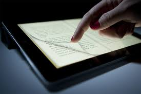<!-- .element: style="width:400px" -->

§§§§§§§§§§§§§§§§§§§§§§§§§§§§§§§§§§§§§§§§§§§§§

<!-- .slide: data-background-video="img/phallainaChap1.mp4" -->

===

Porté par la vague des nouveaux appareils numériques, en particulier le téléphone et la tablette tactile, le livre se réinvente, et se déplace : il investit des formes médiatiques -- comme l'audio, l'écran -- qui l'éloignent de sa forme canonique : le papier. 

Introduction :
exemple de Phalaina, de Marietta Ren (ancienne étudiante des Gobelins) :
- à l'image, j'ai un graphisme qui ressemble beaucoup à de la BD
- à la lecture, j'ai un récit que je fais défiler en continu, dans une séquentialité hybride : la "page" comme unité a disparu, de même que la case (de CD), pour proposer une lecture séquentielle quasi cinématographique, mais également des objets médiatiques bien plus anciens, comme la tapisserie de Bayeux ! On est dans un dispositif bien plus immersif.
- immersion : ajout de son
- Geste : entre le scroll (cf. les cours de com / geste typiquement numérique) et le tactile, puisqu'ici je vois bien que je dépens de ma tablette tactile.
- Machine : obligation d'avoir ce type de machine (une liseuse tablette) pour lire.

DÉpendance à la machine de plus en plus forte.

§§§§§§§§§§§§§§§§§§§§§§§§§§§§§§§§§§§§§§§§§§§§§

## Mon livre numérique est-il encore un livre ?
* Des mutations esthétiques
* Un changement de format (qu'est-ce qui "fait livre" : la tablette, le fichier, l'appli ?)
* Un nouveau dispositif de lecture (tablettes, liseuse, écran)
* Des enjeux de stockage et de pérennité (quelle bibliothèque ?)

<!-- .element: style="width:45%;float:left;margin-left:-1em; font-size:1.4rem; text-align:justify" -->

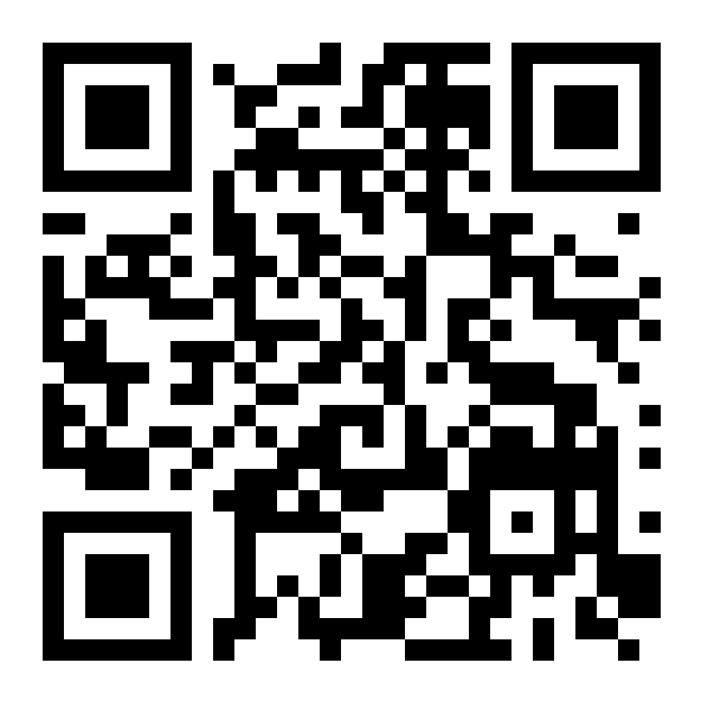<!-- .element: style="width:45%;float:right;margin-right:-1em;" -->

===

Bcp de questions se posent. Les plus évidentes, pour nous, ce sera d'abord les questions esthétiques. Dans cette BD immersive d'un nouveau genre, on perçoit bien sûr les mutations esthétiques : ce mariage du livre (image fixe) avec le cinéma, l'insertion de sons, etc. On est dans ce que l'on peut qualifier d'oeuvre hypermédiatique :

>L’art hypermédiatique est une sous-catégorie de l'art numérique, dont l'expression découle du terme hypermédia. Elle désigne un ensemble de pratiques artistiques intégrant un principe associatif entre des images, du texte et du son dans une interface de type écran.

Mais cet engouement esthétique, cette fascination pour un objet spectaculaire, ne doit pas faire oublier des enjeux un peu plus pratiques.

À commencer par la question générale qui doit occuper tout éditeur : l'Accessibilité et la lisibilité de son livre.
Ainsi, le passage de l'imprimé au numérique pose d'abord la question des formats. Le livre numérique, c'est d'abord un fichier ou un ensemble de fichiers, édité dans des formats parfois très différents : de l'epub (1-2-3), du azw (amazon, non interopérable), du PDF, du HTML+Javascript (livre-appli). Problèmes : développement (x coûts), interopérabilité, manipulabilité... on y reviendra.

ENjeu de la machine : sur quel appareil lit-on ? Quel est son coût ? Si je conçois une oeuvre hypermédiatique qui requiert un écran tactile, certaines liseuses seront exclues de mon marché.

ENfin : comment penser le stockage de ces ouvrages dans de nouvelles bibliothèques ?

C'est beau hein ? 

Ça c'est le cours que je donnais il y a encore 2 ans. Sauf que, force est de constater, des ouvrages comme Phalaina, très peu de gens les lisent, il ne sont jamais nommés aux Goncourt, et de toute manière, bien souvent, je ne peux pas les faire étudier parceque tt le monde n'a pas d'ipad, ou tout simplement l'appli ne fonctionne plus sur tablette. 

§§§§§§§§§§§§§§§§§§§§§§§§§§§§§§§§§§§§§§§§§§§§§

[Flashback : la fin du livre, sans cesse annoncée, sans cesse repoussée]

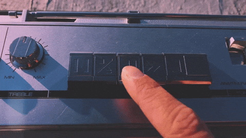

====

En vérité, l'édition numérique n'a pas encore connu son grand soir. Il y a encore 10-15 ans les éditeurs, les écrivains, les profs s'inquiétaient de la révolution numérique à l'oeuvre, mais de révolution, point du tout. Ce que je voudrais faire avec vous, c'est tenter de comprendre les raisons de cet "échec", qui n'en est pas vraiment un non plus :
- pas de "grand remplacement"
- une cohabitation

Mis à part lors de certaines périodes critiques (le covid), les chiffres de vente des livres imprimé n'ont jamais baissé au profit d'une hausse du numérique. On est à 10% du marché global de l'édition.

Comprendre les raisons de l'échec relatif du numérique, c'est également comprendre les raisons du succès du livre : en tant que média, le livre fait valoir une incroyable longévité, car il a plus de 2000 ans. Le livre a résisté à de nombreuses révolutions médiatiques et à la concurrence d'autres médias : le phonographe, le cinéma, la télévision, et aujourd'hui les médias numériques. Résisté, oui, mais pas non plus resté monolithique. Le cours que je vous propose aujourd'hui se déroule un peu en deux temps : évidemment, je parlerai beaucoup d,édition numérique, pour vous présenter les enjeux de la transition numérique du livre, les nouveaux objets de lecture qui sont créée et diffusés aujourd'hui. Mais le plus important est aussi de comprendre les effets de contamination réciproque : comment notre bon vieux livre imprimé traditionnel est reconfiguré au contact d'autres réalités médiatiques. 

Parti pris : le livre, comme média, ne doit pas être essentialisé, mais conçu dans ses multiples relations intermédiales, des effets d'échange avec d'autres formes médiatiques.

§§§§§§§§§§§§§§§§§§§§§§§§§§§§§§§§§§§§§§§§§§§§§

#### La fin des livres (?)

>«&nbsp;Si par livres vous entendez parler de nos innombrables cahiers de papier imprimé, ployé, cousu, broché sous une couverture annonçant le titre de l’ouvrage, je vous avouerai franchement que je ne crois point, — et que les progrès de l’électricité et de la mécanique moderne m’interdisent de croire, — que l’invention de Gutenberg puisse ne pas tomber plus ou moins prochainement en désuétude comme interprète de nos productions intellectuelles.&nbsp;»  
>«&nbsp;Je crois donc au succès de tout ce qui flattera et entretiendra la paresse et l’égoïsme de l’homme ; l’ascenseur a tué les ascensions dans les maisons ; le phonographe détruira probablement l’imprimerie. Nos yeux sont faits pour voir et refléter les beautés de la nature et non pas pour s’user à la lecture des textes ; il y a trop longtemps qu’on en abuse, et il n’est pas besoin d’être un savant ophtalmologiste pour connaître la série des maladies qui accablent notre vision et nous astreignent à emprunter les artifices de la science optique.&nbsp;»

<!-- .element: style="font-size:1.3rem; text-align:justify" -->

"La fin des livres", *Contes pour bibliophiles*, Octave Uzanne (illustr. Albert Robida), 1894.

<!-- .element: style="font-size:1.3rem; text-align:right" -->

===

Quand les premières tablettes, ebook, sont apparus, on a vu croître un peu partout un discours de la fin des livres.
Ce n'est pas la première fois qu'on annonce la mort du livre. CITER.

ce texte a plus d'un siècle, il date de la fin du XIX. Et annonce la fin du livre, supplanté par les nouveaux médias d'alors : le phonographe. 

On appelle cela de la littérature d'anticipation, très fréquente au XIX, avec des têtes de proue comme Jules Verne, qui avait écrit l'arrivée de l'homme sur la Lune. Ce qui est intéressant dans la littérature d'anticipation, c'est que parfois elle tombe juste, parfois elle énonce des discours qui perdurent dans le temps. C'est du moins mon avis avec ce texte sur la disparition du livre. 

§§§§§§§§§§§§§§§§§§§§§§§§§§§§§§§§§§§§§§§§§§§§§

>« Pour le livre, ou disons mieux, car alors les livres auront vécu, pour le novel ou storyographe, l’auteur deviendra son propre éditeur, afin d’éviter les imitations et contrefaçons ; il devra préalablement se rendre au Patent Office pour y déposer sa voix et en signer les notes basses et hautes, en donnant des contre-auditions nécessaires pour assurer les doubles de sa consignation. Aussitôt cette mise en règle avec la loi, l’auteur parlera son œuvre et la clichera sur des rouleaux enregistreurs et mettra en vente lui-même ses cylindres patentés, qui seront livrés sous enveloppe à la consommation des auditeurs. »

<!-- .element: style="width:45%;float:left;margin-left:-1em; font-size:1.4rem; text-align:justify" -->

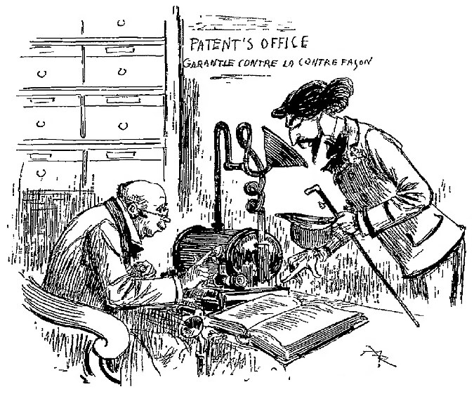<!-- .element: style="width:45%;float:right;margin-right:-1em;" -->

===

Proposition : l'auteur s'auto-éditera. 
Proposition : on laissera tomber l'écriture pour la voix (le podcast).

§§§§§§§§§§§§§§§§§§§§§§§§§§§§§§§§§§§§§§§§§§§§§

« Les dames ne diront plus, parlant d’un auteur à succès : « J’aime tant sa façon d’écrire ! » Elles soupireront toutes frémissantes : « Oh ! ce diseur a une voix qui pénètre, qui charme, qui émeut ; ses notes graves sont adorables, ses cris d’amours déchirants ; il vous laisse toute brisée d’émotion après l’audition de son œuvre : c’est un ravisseur d’oreille incomparable. [...] Les éditions recherchées seront celles qui auront été autophonographiées par des artistes en vogue : on se disputera, par exemple, le Molière de Coquelin, le Shakespeare d’Irving, le Dante de Salvini, le Dumas fils d’Éléonore Duce, le Hugo de Sarah Bernhardt, le Balzac de Mounet Sully [...]»

<!-- .element: style="width:45%;float:left;margin-left:-1em; font-size:1.4rem; text-align:justify" -->

<!-- .element: style="width:45%;float:right;margin-right:-1em;" -->

===

Starification des "interprêtes".

§§§§§§§§§§§§§§§§§§§§§§§§§§§§§§§§§§§§§§§§§§§§§

## Le livre numérique : une "révolution" qui se fait attendre

(ou qui surgit là où on ne l'attend pas)

§§§§§§§§§§§§§§§§§§§§§§§§§§§§§§§§§§§§§§§§§§§§§

#### Chriffres clés de 2023 (enquête SNE 2024)

* Le livre numérique en France : 283 millions € de chiffre d’affaires
* Le numérique : une offre scolaire et universitaire
* La littérature en progression (mais seulement 6% de la production numérique)
* L’édition numérique représente 10 % du chiffre d’affaires total des éditeurs

<!-- .element: style="font-size:1.3rem; text-align:justify" -->

===

Année 2024 dans la slide suivante

§§§§§§§§§§§§§§§§§§§§§§§§§§§§§§§§§§§§§§§§§§§§§

>En 2024, le marché de l’édition numérique, tous supports et toutes catégories éditoriales confondus, a généré un chiffre d’affaires de 278,6 millions d’euros, en baisse de 1,6% par rapport à 2023. Cette tendance est principalement due à l’édition grand public (hors littérature) dont le CA est en baisse de 17,1%. La constante progression de l’édition numérique de littérature (+ 8,5%) est tirée par la romance, la science-fiction et le roman policier. Le reste de l’édition professionnelle et universitaire est en légère hausse (+ 0,7%). L’édition scolaire numérique est en forte baisse (- 14%). 

<!-- .element: style="width:45%;float:left;margin-left:-1em; font-size:1.4rem; text-align:justify" -->

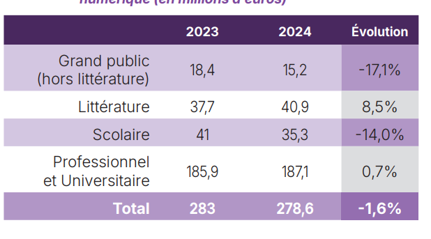<!-- .element: style="width:45%;float:right;margin-right:-1em;" -->

§§§§§§§§§§§§§§§§§§§§§§§§§§§§§§§§§§§§§§§§§§§§§

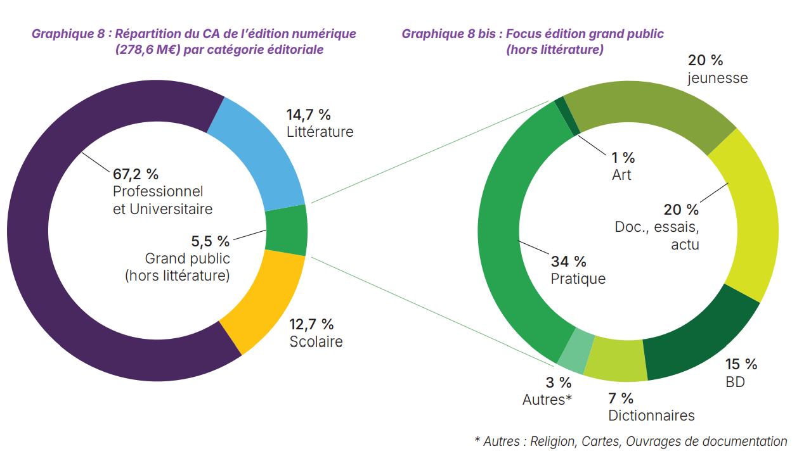

===

Une édition qui est très "pratique" : scientifique, essai, etc. 

Paradoxalement, d'un pt de vue purement économique, le livre numérique ne se vend pas beaucoup, et quand il se vend, c'est pour toucher un public particulièrement professionnel. L'édition numérique est très peu une édition littéraire ou une édition de loisir (même si, c'est là aussi un paradoxe, l'édition numérique littéraire qui fonctionne bien renvoie d'abord à des genres dits "middlebrow" : romance, SF, etc.). 

§§§§§§§§§§§§§§§§§§§§§§§§§§§§§§§§§§§§§§§§§§§§§

#### Quelques freins au développement du livre numérique
* Modèle économique encore insatisfaisant
* Multiplicité et éparpillement technologique
* Des projets (passionnants) expérimentaux, mais peu industrialisés
* Un modèle médiatique imprimé encore prégnant

<!-- .element: style="font-size:1.3rem; text-align:justify" -->

===

Raisons multiples : 
* Économique : pas de modèle encore. Le coût de développement d'un livre num est grand
* Technique : pas de consensus technique, bizarrement
* Expérimental : qd l'édition numérique fonctionne et qu'elle est intéressante, c'est pour de l'avant garde. Et les avant garde, ça n'a jamais fait vachement vendre. Dada, vous ne l'achetez pas pour vous détendre sur la plage : vous l'achetez parce que votre prof de lettres vous l'a demandé.
* médiatique : en fait on aime lire des livres imprimé : l'édition littéraire n'est pas encore conquise par le support numérique. Le support numérique (notamment le smartphone) cristallise la consommation, mais pas pour de la lecture littéraire (à quelques exceptions : le livre audio), plutôt pour de l'information, et sous forme de vidéo/audio (donc plus trop du texte). 

§§§§§§§§§§§§§§§§§§§§§§§§§§§§§§§§§§§§§§§§§§§§§

### La multiples réalités de l'édition numérique

* Une production homothétique grand public devenue complémentaire à l'offre papier, mais peu intéressante au plan du design éditorial (version Kindle, Koobo des grands titres)
* Une production expérimentale relevant de la production de "beau-livre" ou de la micro-édition (éditions indépendantes, auto-édition, cricuits courts)
* Des créations éditoriales multi-support, qui relèvent d'une hybridation médiatique (applications numériques, webdoc, fictions transmédiatiques)

<!-- .element: style="font-size:1.3rem; text-align:justify" -->

===

Parler d'édition numérique

§§§§§§§§§§§§§§§§§§§§§§§§§§§§§§§§§§§§§§§§§§§§§

## Les médias numériques : une problématique de la remédiation

* La remédiation : un concept pour penser les transitions médiatiques
* La remédiation a-t-elle une utilité pratique ou n'est-elle qu'un artifice ?
* Existe-t-il une esthétique ou même une poétique de la remédiation ?

<!-- .element: style="font-size:1.7rem; text-align:justify" -->

§§§§§§§§§§§§§§§§§§§§§§§§§§§§§§§§§§§§§§§§§§§§§

## Le concept de Bolter et Grusin
* Un ouvrage de référence : *Remediation: Understanding New Media*, MIT press, 1998
* Une relation intermédiale dans la logique évolutive des medias
* Effet de mimétisme, de "vampirisation", d'emprunt voire de plagiat
* Un media "familier" a plus de chance d'être adopté

<!-- .element: style="width:45%;float:left;margin-left:-1em; font-size:1.4rem; text-align:justify" -->

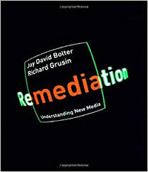<!-- .element: style="width:35%;float:right;margin-right:-1em;" -->

===
Ouvrage de référence : Jay David Bolter, Richard Grusin,*Remediation : Understanding New Media*. Bolter et Grusin ont vu dans la relation intermédiale une logique évolutive des médias. C’est-à-dire que c’est dans la nature de tout nouveau média que de plagier son aîné.

Le concept de remédiation souligne d’abord une répétition, la trace d’un ancien médium dans un nouveau = il s’agit de vampiriser les formes connues, familières, quotidiennes, pour mieux s’intégrer auprès du public contemporain.

En gros : le public aime ce qui lui est familier. 

§§§§§§§§§§§§§§§§§§§§§§§§§§§§§§§§§§§§§§§§§§§§§

## La relation intermédiale

>"L’émergence d’un nouveau média conduit également à une transformation de la forme prise par les médias existants. Pour comprendre cela, il est important de ne pas adopter une définition essentialiste de ce que sont les médias. Au contraire, il s’agit de les considérer comme des formes modulable sans cesse en cours de (re)configuration."

>Remy Besson, "PROLÉGOMÈNES POUR UNE DÉFINITION DE L’INTERMÉDIALITÉ"

<!-- .element: style="font-size:1.7rem; text-align:justify" -->

===

Besson : "L’émergence d’un nouveau média conduit également à une transformation de la forme prise par les médias existants. Pour comprendre cela, il est important de ne pas adopter une définition essentialiste de ce que sont les médias. Au contraire, il s’agit de les considérer comme des formes modulable sans cesse en cours de (re)configuration."

Présupposé : nature hétérogène des media. Parti pris absolument non essentialiste.
Ce qui signifie : pas de définition stable du media, qui est toujours en processus de construction.

§§§§§§§§§§§§§§§§§§§§§§§§§§§§§§§§§§§§§§§§§§§§§

## La *mimesis* médiatique : comment mieux "médier" le réel
* L'utopie de l'effacement du médium
* Un effacement qui procède aussi d'une sécularisation des media

<!-- .element: style="font-size:1.7rem; text-align:justify" -->

===

L'origine de la remédiation est en fait la problématique première de la médiation : comment médier le monde ?
Comment donner accès au réel ?

§§§§§§§§§§§§§§§§§§§§§§§§§§§§§§§§§§§§§§§§§§§§§

## La remédiation : deux stratégies possibles
* Immédiateté (*immediacy*)
* Hypermédiateté (*hypermediacy*)

<!-- .element: style="font-size:1.7rem; text-align:justify" -->

§§§§§§§§§§§§§§§§§§§§§§§§§§§§§§§§§§§§§§§§§§§§§

### 1. Immediacy : la logique de la "transparence"

>What designers often say they want is an “interfaceless” interface, in which there will be no recognizable electronic tools—no buttons, windows, scroll bars, or even icons as such. Instead the user will move through the space interacting with the objects “naturally,” as she does in the physical world. Virtual reality, threedimensional graphics, and graphical interface design are all seeking to make digital technology “transparent.” In this sense, a transparent interface would be one that erases itself, so that the user is no longer aware of confronting a medium, but instead stands in an immediate relationship to the contents of that medium.

<!-- .element: style="font-size:1.6rem; text-align:justify" -->

===
"Ce que disent les designers, c'est qu'ils veulent une interface "sans interface", dans laquelle il n'y aura pas d'outils électroniques reconnaissables - pas de boutons, de fenêtres, de scroll-barres, ni même d'icônes en tant que telles. Au lieu de cela, l'utilisateur se déplacera dans l'espace en interagissant avec les objets "naturellement", comme il le fait dans le monde physique. La réalité virtuelle, les graphiques tridimensionnels et la conception des interfaces graphiques visent tous à rendre la technologie numérique "transparente". En ce sens, une interface transparente serait une interface qui s'efface d'elle-même, de sorte que l'utilisateur n'est plus conscient de se confronter à un support, mais se trouve au contraire dans une relation immédiate avec le contenu de ce support."

§§§§§§§§§§§§§§§§§§§§§§§§§§§§§§§§§§§§§§§§§§§§§
<!-- .slide: data-background-image="img/movink-feature-video2-1400x788.gif" data-background-size="contain" -->

§§§§§§§§§§§§§§§§§§§§§§§§§§§§§§§§§§§§§§§§§§§§§

### 2. Hypermediacy : la logique de l'emprunte médiatique (car "Le médium, c'est le message")

>If the paintbox software is ‘intuitive,’ it is only intuitive because the paintbox is a culturally
familiar object. In fact, the graphical interface referred not only to culturally familiar objects, but specifically to prior media, such as painting, typewriting, and handwriting. In making such references, computer designers were in fact creating a more complex system in which iconic and arbitrary forms of representation interact.

<!-- .element: style="font-size:1.7rem; text-align:justify" -->
===

Si le logiciel "paintbox" est "intuitif", c'est uniquement parce que la boîte de peinture est un objet culturel familier. Ainsi, l'interface graphique ne se réfère pas seulement à des objets culturellement familiers, mais aussi à des supports antérieurs, tels que la peinture, la dactylographie et l'écriture manuscrite. En faisant de telles références, les designers informatiques ont en fait créé un système plus complexe dans lequel interagissent des formes de représentation iconiques et arbitraires.

Ici, il s'agit cette fois de surjouer la présence du media, généralement d'un ancien media, dont on reprend des codes graphiques, sonores, kinésiques...

§§§§§§§§§§§§§§§§§§§§§§§§§§§§§§§§§§§§§§§§§§§§§
<!-- .slide: data-background-image="img/page-de-garde-word.gif" data-background-size="contain" -->

§§§§§§§§§§§§§§§§§§§§§§§§§§§§§§§§§§§§§§§§§§§§§

## Du design d'interface...

>« Le design est une activité créatrice qui consiste à déterminer les propriétés formelles des objets que l'on veut produire industriellement. Par propriétés formelles des objets, on ne doit pas entendre seulement les caractéristiques extérieures, mais surtout les relations structurelles qui font d'un objet ou d'un système d'objets une unité cohérente, tant du point de vue du producteur que du consommateur ».

<!-- .element: style="font-size:1.7rem; text-align:justify" -->

Maldonaclo - 1961, Venise. Définition adoptée par l'SICSID (Conseil International des Sociétés de Design Industriel)

<!-- .element: style="font-size:1.7rem; text-align:justify" -->

===
Le concept de remédiation a été spécifiquement pensé dans une réflexion sur la transition numérique, et sur le design des outils numériques, le design des interfaces. On y reviendra, car cela a toute son importance pour l'édition : quelle interface offre le livre ? 

Le livre **est un objet de design**

Ce mot vient du latin designare qui signifie marquer d'un signe distinctif. Les mots dérivés sont :

dessein (intention, projet)
dessin (forme, modèle)

>« Le design est une activité créatrice qui consiste à déterminer les propriétés formelles des objets que l'on veut produire industriellement. Par propriétés formelles des objets, on ne doit pas entendre seulement les caractéristiques extérieures, mais surtout les relations structurelles qui font d'un objet ou d'un système d'objets une unité cohérente, tant du point de vue du producteur que du consommateur ».

Maldonaclo - 1961, Venise et adoptée par l'Sortie du siteICSID (Conseil International des Sociétés de Design Industriel)

Idée que l'objet doit être pensé pour faciliter son utilisation : critère de beauté/élégance, bien sûr, mais pas seulement : aspect pratique, simple.

§§§§§§§§§§§§§§§§§§§§§§§§§§§§§§§§§§§§§§§§§§§§§

## ... à l'histoire des grands medias
* La remédiation de B&G a été d'abord conceptualisée pour penser les nouvelles technologies
* Application à tous les medias et les arts, depuis l'antiquité

<!-- .element: style="font-size:1.7rem; text-align:justify" -->

===
Mais on peut en fait appliquer ce concept de remédiation à l'histoire des media en général

§§§§§§§§§§§§§§§§§§§§§§§§§§§§§§§§§§§§§§§§§§§§§
<!-- .slide: data-background-video="img/Ciotat.mp4" data-background-size="contain" -->

source image : "Entrée d'un train en gare de La Ciotat", Les frères Lumières

<!-- .element: class="source" -->

§§§§§§§§§§§§§§§§§§§§§§§§§§§§§§§§§§§§§§§§§§§§§
<!-- .slide: data-background-video="img/Melies.mp4" data-background-size="contain" -->

source image : "Le voyage dans la lune", Georges Mélies

<!-- .element: class="source" -->

§§§§§§§§§§§§§§§§§§§§§§§§§§§§§§§§§§§§§§§§§§§§§

#### Hypermédiateté et immédiateté : une opposition si simple ?

Pourquoi l'hypermédiateté semble-t-elle si importante au début de cette remédiation numérique ?

<!-- .element: style="font-size:1.7rem; text-align:justify" -->

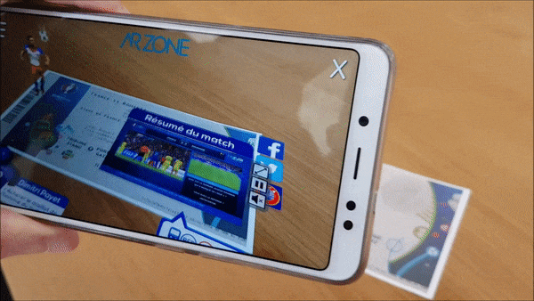<!-- .element: style="width:45%;float:right;margin-right:-1em;" -->

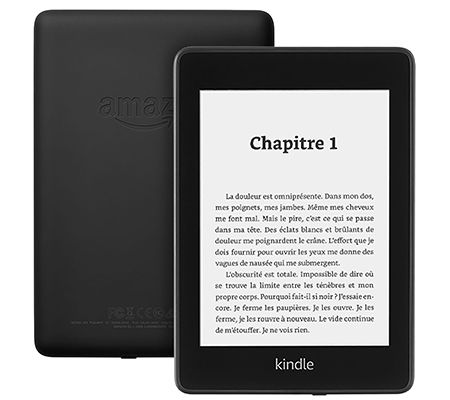<!-- .element: style="width:45%;float:left;margin-right:-1em;" -->

===
Pour de nombreux  media, et en particulier le livre, le principe d'hypermédiateté, c'est-à-dire cette dimension médiatique surjouée, est prépondérante. Pourquoi ? La question du design est essentielle : parce qu'une oeuvre numérique, ce n'est pas toujours si simple à lire...

Parce que l'interface, celle notamment de l'écran (et surtout de la machine qui le supporte), ne doit justement pas faire écran au texte. Parce que l'expérience de lecture profonde "deep reading" ne doit pas être parasitée par un dispositif trop complexe à comprendre.

Echec de certaines oeuvres très belles graphiquement, très intelligentes et complexes sur le plan du dispositif médiatique, mais des échecs publics complets, car les lecteurs/spectateurs n'ont pas réussi à s'approprier l'objet.

D'où un questionnement : et si la transparence, c'était le bruit ? Parfois plus facile pour des lecteurs/consommateurs de s'approprier des interfaces très fournies, remplies de signes qui font écho à des codes médiatiques.

§§§§§§§§§§§§§§§§§§§§§§§§§§§§§§§§§§§§§§§§§§§§§

## Une histoire des remédiations du livre
* Histoire matérielle et technique
* Histoire culturelle du livre

<!-- .element: style="font-size:1.7rem; text-align:justify" -->

===

Le livre n'en est pas à sa première remédiation.

Étudier les remédiations du livre, c'est faire une histoire matérielle de l'édition, et comprendre à la fois pourquoi l'objet livre tel que nous le connaissons aujourd'hui a cette forme, et pourquoi cette forme est porteuse de connotations et de capital symbolique.

Ce que je propose, c'est un panorama vraiment très très générique et simpliste, mais qui cherche à montrer comment les usages et du coup la signifaction de l'objet livre comme média a pu s'enrichir au fil des grandes évolutions technologiques. 

§§§§§§§§§§§§§§§§§§§§§§§§§§§§§§§§§§§§§§§§§§§§§

## Première époque : du volumen au codex

§§§§§§§§§§§§§§§§§§§§§§§§§§§§§§§§§§§§§§§§§§§§§

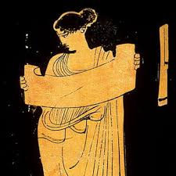<!-- .element: style="width:45%;float:right;margin-right:-1em;" -->

<!-- .element: style="width:45%;float:left;margin-right:-1em;" -->

===

Saint Marc copiant un rouleau dans un codex

Codex est un mot latin qui désigne le livre formé de feuilles pliées et assemblées en cahiers, et couvert d'une reliure tel que nous le connaissons.
Le parchemin, en effet, matière solide, facile à plier, inscriptible des deux côtés, donne des feuillets que l’on réunit et assemble en cahiers. Le codex ainsi formé contient beaucoup plus de textes que le rouleau antique (volumen).

Il existe des vestiges de codex en parchemin très tôt, dès le début du 2e siècle. Mais le rouleau (volumen) reste, dans l'Antiquité, le principal format des livres. Son abandon pour le codex est une mutation qui bouleverse les habitudes d’écriture et de lecture, et qui prend plusieurs siècles. Elle est impulsée par les chrétiens : la Bible est copiée sur codex dès le 2e siècle. codex s’impose vraiment au 4e siècle dans l’Occident latin et au 5e siècle dans l’Empire byzantin. La forme du rouleau persiste au Moyen Âge pour des pièces liturgiques ou administratives des chroniques ou des généalogies sous forme de volumen ou de rotulus à déroulement vertical.

§§§§§§§§§§§§§§§§§§§§§§§§§§§§§§§§§§§§§§§§§§§§§

#### Une révolution technologique & intellectuelle

* L'invention de la page (et de l'architecture du savoir : sommaires, index, pages de titre et de couverture)
* De nouveaux gestes de lecture et d'annotation (naissance de la glose)
* La trace du *volumen* dans le lexique éditorial (le "volume")

<!-- .element: style="font-size:1.7rem; text-align:justify" -->

===

Le codex présente de nombreux avantages : il permet de réunir une grande quantité d'écriture, il occupe moins de place dans les bibliothèques que le papyrus et permet une organisation plus rationnelle du texte. Enfin, il favorise le travail scolastique d'annotation. Grâce au codex, la page n'est plus comme sur le rouleau un défilé continuel de colonnes, mais bien un espace délimité, une entité visuelle intellectuellement autonome.

Le codex permet au lecteur de garder une main libre pour écrire et donc annoter, commenter, gloser le texte. Il lui offre une véritable architecture du texte, séquencée en pages, hiérarchisée en chapitres, puis en paragraphes, aisément feuilletable grâce à un index. Il lui autorise également retours et avancées au fil de sa curiosité ou des besoins de sa mémoire et fortifie son rapport au savoir.

§§§§§§§§§§§§§§§§§§§§§§§§§§§§§§§§§§§§§§§§§§§§§

## Deuxième époque : du manuscrit à l'imprimé

§§§§§§§§§§§§§§§§§§§§§§§§§§§§§§§§§§§§§§§§§§§§§

* Vers une stabilisation des textes
* Naissance d'une industrie culturelle
* Un changement d'échelle de la diffusion des savoirs 

<!-- .element: style="font-size:1.7rem; text-align:justify" -->

§§§§§§§§§§§§§§§§§§§§§§§§§§§§§§§§§§§§§§§§§§§§§
<!-- .slide: data-background-image="img/incunable.jpg" data-background-size="contain"-->

§§§§§§§§§§§§§§§§§§§§§§§§§§§§§§§§§§§§§§§§§§§§§

### Les "incunables"
* Les incunables désignent les premiers livres fabriqués dans les décennies qui ont suivi l'invention de Gutenberg
* Des livres imprimés... qui imitent le manuscrit !

<!-- .element: style="font-size:1.7rem; text-align:justify" -->

§§§§§§§§§§§§§§§§§§§§§§§§§§§§§§§§§§§§§§§§§§§§§

## Troisième époque : de l'imprimé au numérique (et vice-versa...)

===

Troisième époque : l'arrivée de l'imprimé.
Contrairement à mes deux précédentes révolutions, je voudrais qd même revenir sur cette tentation téléologique : l'opposition qui a longtemps prévalu pour penser l'imprimé et le numérique n'est sans doute pas si juste.

Après avoir imaginé que l'un chasserait l'autre, nous nous sommes plutôt résolus à penser ces deux formes médiatiques en termes de complémentarité. J'y reviendrai en détails, mais je le précise préalablement pour justifier mon titre : de l'imprimé au numérique et "Vice-versa" : on réalisera que de très nombreuses oeuvres littéraires, essayistiques, etc. qui sont natives numériques, finissent par trouver une nouvelle vie dans un modèle imprimé.

De plus, la représentation numérique du livre est désormais un élément important de la production du livre imprimé, notamment parce que l'on travaille tous ou presque sur du fichier numérique. La chaîne du livre est largement informatisée, cf. début du semestre. 

La remédiation de l'imprimé par le numérique ne s'effectue donc nullement sur le mode d'une technologie chassant l'autre. On est sur la réalisation d'objets hybrides, de plus en plus complémentaires. Pas de "ceci tuera cela".

Mais n'allons pas trop vite en besogne et observons de plus près ce fameux "livre numérique".

§§§§§§§§§§§§§§§§§§§§§§§§§§§§§§§§§§§§§§§§§§§§§

## Le "livre numérique" n'existe pas...
* Une "adaptation" de l'imprimé à un mode de consultation/diffusion numérique (= livres homothétiques)
* Des propositions techniques et conceptuelles natives numériques (oeuvres hypermédiatiques, livres-appli, etc.)
* Une production hybride : complémentarité imprimé & numérique ; PAO (publication assistée par ordinateur); Web to print

<!-- .element: style="font-size:1.7rem; text-align:justify" -->

===

Parler de "Livre numérique" n'a en soit aucun sens : l'édition numérique recouvre en vérité une multitude de pratiques dessinant un très large spectre depuis une adaptation très basique du livre imprimé pour un mode de consultation / diffusion numérique (ce que l'on va appeler le livre "homothétique"), jusqu'à des conceptions du livre directement pensée pour la lecture numérique et ses nouveaux support : cad du "Livre à l'écran".

Entre les deux extrémités de ce spectre, on retiendra que désormais, quoiqu'il arrive, la production d'un livre fait nécessairement appel à une technologie numérique. C'est notamment ce que l'on appelle la PAO (publication assistée par ordinateur).

>La PAO consiste à préparer des documents destinés à l'impression à l'aide d'un ordinateur en lieu et place des procédés historiques de la typographie et de la photocomposition.

Ces procédés étaient essentiellement manuels jusque dans les années 80-90. On est donc sur des technologies récentes, qui ont conduit au développement d'une informatisation massive de la production des livres, avec ce que cela entraîne en termes de compétences.

>La publication assistée par ordinateur se fait à l'aide de logiciels spécialisés, appelés logiciels de mise en page ou logiciels de PAO, semblables à des logiciels de traitement de texte ordinaires, mais où un accent particulier a été mis sur la disposition des textes et des images sur une page.

Je ne me lancerai pas dans une typologie du livre numérique, car ce serait trop hasardeux.

Cependant, on peut reconnaître trois grandes familles de livres conçues pour la diffusion et la lecture numérique, familles que je distingue en fonction d'intentions éditoriales voire esthétiques.

§§§§§§§§§§§§§§§§§§§§§§§§§§§§§§§§§§§§§§§§§§§§§

#### L'édition numérique : une question de forme et de formats

>HVFRQWHQXVQXP«ULTXHVVRQWSDUQDWXUHHQFRG«V3RXUSRXYRLU¬WUHSDUWDJ«HXQH LQIRUPDWLRQGRLW¬WUHVWUXFWXU«HVHORQGHVVWDQGDUGVbOHVIRUPDWV/HFKRL[GɛXQIRUPDW DGHVLPSOLFDWLRQVSURIRQGHVbOHVLQIRUPDWLRQVTXHOɛRQSHXWWUDQVPHWWUHFKDQJHQW DLQVLTXHOHXUOLVLELOLW«OHXUXQLYHUVDOLW«OHXUDJHQFHPHQ OHXUWUDQVSRUWDELOLW«OHXU
WUDQVIRUPDELOLW«HWF

<!-- .element: style="font-size:1.7rem; text-align:justify" -->

===

Ouch : ça va pas bien. 
Pourquoi ? Parce que justement j'ai un problème de format. 

Cf. slide suivante, puis revenir ici

Que s'est-il passé ? J'ai fait un copié collé depuis le PDF, or le PDF est encodé de telle manière que mon résultat donne ce texte illisible. Tous les PDF ne font pas cela, mais dépendamment de la façon dont ils ont été produits, cela peut aboutir à ces bogues d'affichage. 

>Les formats nous sont le plus souvent invisibles ou presque. On clique sur une icône pour ouvrir un fichier. [...]Nous visionnons un film, nous entendons de la musique, nous visualisons une image, nous lisons un texte qui peut d’ailleurs « contenir » du son, de l’image, de la vidéo. Il y a donc un mécanisme qui associe au format de chaque document un outil adapté. Ce mécanisme apparaît d’abord quand l’application effectue un diagnostic – elle fait l’hypothèse que le document relève d’un format déterminé – et qu’elle nous propose éventuellement d’utiliser un certain outil pour ce document et pour tous les autres du même format. Ce mécanisme apparaît également quand l’application ne trouve pas d’outil adéquat. Elle nous demande alors de chercher sur l’ordinateur utilisé l’outil nécessaire ou de l’installer. Notre ordinateur utilise donc un mécanisme de détection de format et maintient un « dictionnaire » évolutif associant à un format l’outil à utiliser. On comprend en passant qu’un format peut parfois être utilisé par plusieurs outils.

L’outil qui peut traiter un format change au fil du temps. De nouvelles versions surviennent. Le décalage de version entre celle nécessaire et celle de l’outil peut gêner dans les deux directions. Une ancienne version d’un logiciel peut ne pas prendre en compte un nouveau format. Inversement, une version peut être incapable d’interagir avec un format trop ancien.

§§§§§§§§§§§§§§§§§§§§§§§§§§§§§§§§§§§§§§§§§§§§§

#### L'édition numérique : une question de forme et de formats  (deuxième essai)

>Les contenus numériques sont, par nature, encodés. Pour pouvoir être partagée, une information doit être structurée selon des standards : les formats. Le choix d’un format a des implications profondes : les informations que l’on peut transmettre changent, ainsi que leur lisibilité, leur universalité, leur agencement, leur transportabilité, leur transformabilité, etc. 

<!-- .element: style="font-size:1.7rem; text-align:justify" -->

Viviane Boulétreau et Benoît Habert, "Les formats", *Qu'est-ce que l'édition numérique?*, PUM 2014.

<!-- .element: style="font-size:1.7rem; text-align:right" -->

===

Tout ce que vous écrivez sur votre ordinateur est formaté (cf cours introduction)

Format = l’extension que vous voyez à la fin du fichier. Les formats cachent souvent des clauses cachées au contrat explicite.
On distingue plusieurs catégories de formats :
▪ Les « formats propriétaires » : leurs spécifications techniques sont contrôlées par une entité privée et ont en général fait l’objet d’un brevet. Leur usage est donc limité. FORMAT AZW (KINDLE) / DOC (word) / PDF
▪ Les « formats libres ou ouverts » : leurs spécifications techniques sont publiques et il n’y a pas de restriction d’accès ou de mise en œuvre. Chaque éditeur de logiciel peut donc librement proposer les modules permettant de lire ou d’écrire des données selon ces formats. EPUB
On parle souvent de droits d’auteurs, aujourd’hui ce problème est aussi celui des formats : vous ne pouvez pas ouvrir certains fichiers sans posséder le logiciel. Quand vous achetez un livre électronique sur amazon, vous êtes obligés de le lire sur Kindle. Vous ne pouvez pas prêter votre livre.

§§§§§§§§§§§§§§§§§§§§§§§§§§§§§§§§§§§§§§§§§§§§§

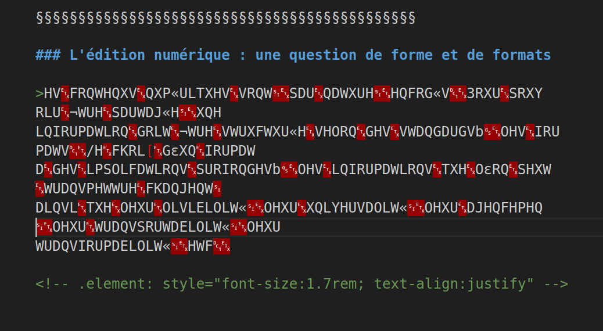<!-- .element: style="width:45%;float:left;margin-right:-1em;" -->

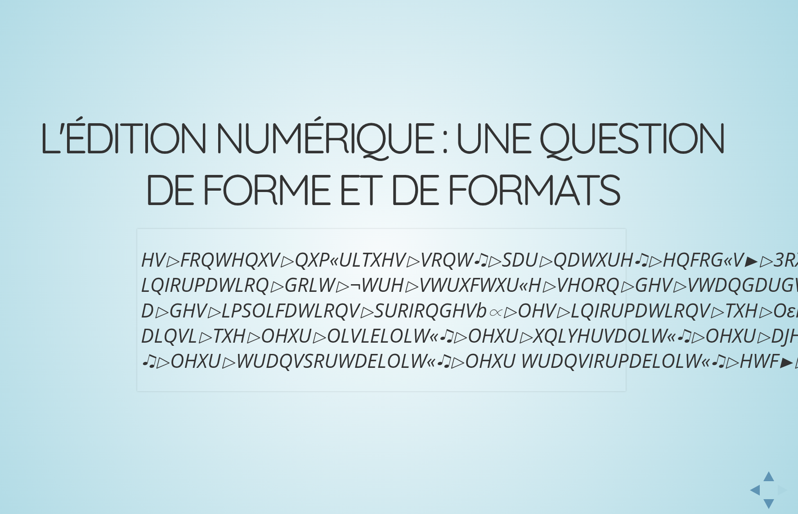<!-- .element: style="width:45%;float:roght;margin-right:-1em;" -->

===

Derrière ces questions qui ne peuvent sembler que techniques se mettent en place des stratégies éditoriales. 

REVENIR à la diapo précédente

§§§§§§§§§§§§§§§§§§§§§§§§§§§§§§§§§§§§§§§§§§§§§

### Le livre homothétique

Le livre "homothétique" désigne toute transposition à l'identique ou presque d'un livre imprimé en version numérique, avec un investissement minimal des potentialités de la technologie numérique.

<!-- .element: style="font-size:1.7rem; text-align:justify" -->

===

Derrière ces questions qui ne peuvent sembler que techniques se mettent en place des stratégies éditoriales. 
Je voudrais voir avec vous quelques "formes" du livre numérique, à travers quelques histoires de formats. 

1) Le livre homothétique.

Le premier, et le plus répandu, est le livre électronique « homothétique », qui est une transposition à l’identique d’un livre papier en version numérique.

Depuis 2010 environ, les nouveautés publiées par la majorité des maisons d’édition sont immédiatement disponibles en version « homothétique ». Le prix des livrels avoisine généralement 75 % du coût de la version papier et peut s’élever à 100 % (dans le cas des livres présentant de nombreuses illustrations, par exemple). Les livrels sont souvent protégés contre la copie par filigrane et parfois par verrou numérique (DRM, Digital Rights Management).

Michel Morvan :

>Les lecteurs lisent en effet de plus en plus en numérique (la proportion a notamment particulièrement augmenté pendant la crise Covid) mais encore moitié moins que sur papier. La prééminence du papier reste cependant une spécificité française qui est en partie due à la loi sur le prix unique du livre qui donne aux libraires une place très importante dans toute la chaîne du livre. Ainsi, la concurrence jouant très peu entre les librairies, il est très important pour les éditeurs papier de ne pas mécontenter les libraires dont ils ne peuvent pas se passer et entre lesquels le prix unique empêche de faire jouer la concurrence.

>Et cela a pour conséquence que les éditeurs papier qui publient aussi en numérique (c’est-à-dire la quasi-totalité d’entre eux) ont choisi d’avoir une politique de prix numérique élevée. Il est ainsi rare que le livre numérique soit vendu à moins de 30 % du prix du livre papier. Cela freine évidemment considérablement le développement du livre numérique.

https://www.unidivers.fr/livre-numerique-michel-morvan/

§§§§§§§§§§§§§§§§§§§§§§§§§§§§§§§§§§§§§§§§§§§§§

PDF

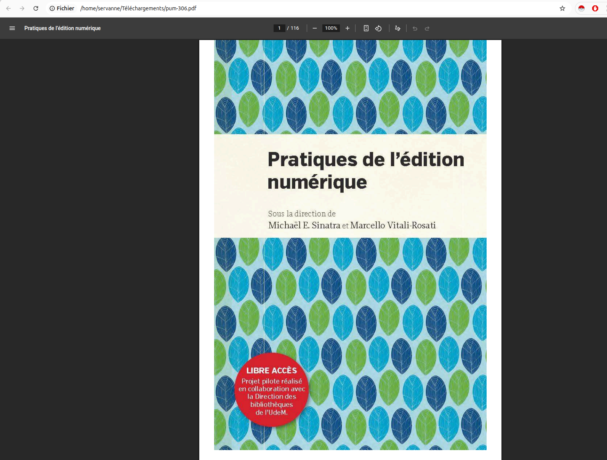<!-- .element: style="width:700px" -->

===

Le livre homothétique va se manifester sous différents formats. 

D'abord le PDF. 

Le Portable Document Format, communément abrégé en PDF, est un langage de description de page présenté par la société Adobe Systems en 1992 et qui est devenu en 2008 une norme ISO en format ouvert.

Les premières versions de PDF ne prenaient pas en charge les hyperliens externes, ce qui limitait son utilité sur Internet. La taille plus importante d'un document PDF par rapport au texte brut entraînait des temps de téléchargement plus longs, en particulier avec les modem plus lents couramment utilisés à l'époque. De plus, le rendu des fichiers PDF était lent sur les machines moins puissantes de l'époque.

§§§§§§§§§§§§§§§§§§§§§§§§§§§§§§§§§§§§§§§§§§§§§

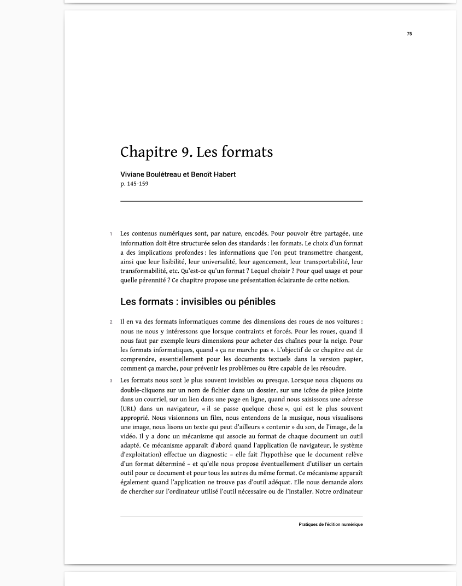<!-- .element: style="width:45%;float:left;margin-right:-1em;" -->

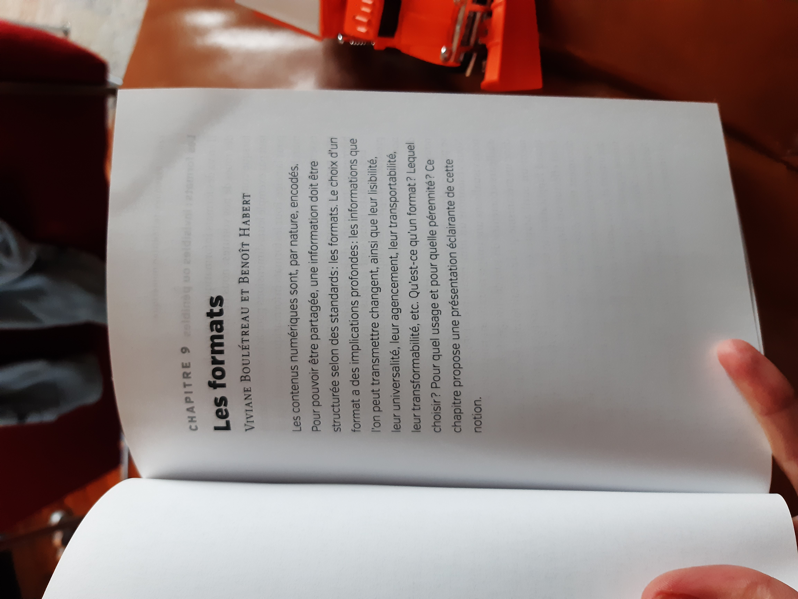<!-- .element: style="width:45%;float:roght;margin-right:-1em;" -->

===

La spécificité du PDF est de préserver la mise en page d’un document — polices de caractères, images, objets graphiques, etc. — telle qu'elle a été définie par son auteur, et cela quels que soient le logiciel, le système d'exploitation et l'ordinateur utilisés pour l’imprimer ou le visualiser. Le PDF offre ainsi une forte stabilisation, ce qui est une caractéristique de l'objet imprimé : on veut une clôture & stabilisation du texte.

Visuellement, on voit bien l'idée du livre "homothétique" : vous avez des pages, numérotées, on est vraiment dans une "Photocopie" de ce qu'est un livre. 
Format d'Adobe, soit une entreprise privée, ultra majoritaire, celui qu'on produit tous. Interropérable dans la limite des fonctionnalités. Pas éditable (je peux aller éditer un mur).

Le format PDF peut aussi être interactif. Il est possible d'incorporer des champs de textes, des notes, des corrections, des menus déroulants, des choix, des calculs, etc. On parle alors de formulaire PDF.

Globalement, PDF = le nouveau print. Il s'est largement répandu dans les pratiques, parce qu'il est proposé en sortie de tous les éditeurs de texte. 

§§§§§§§§§§§§§§§§§§§§§§§§§§§§§§§§§§§§§§§§§§§§§

EPUB

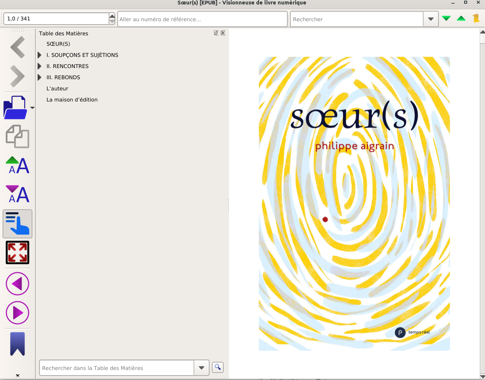<!-- .element: style="width:700px" -->

===

L’ePub a pour ancêtre le format Open eBook, créé par SoftBook Press, société fondée en 1996.
Openbooks = justement « ouverture »

Epub est un format ouvert - on peut tous le lire gratuitement, il est compatible avec bcp de liseuses (y compris des kindle). Epub sert principalement pour des oeuvres homothétiques, ou bien le publication de livres natifs numériques. Avec epub, on reste dans une logique du livre - de la forme livre, avec un texte divisé en pages, chapitres, etc.

§§§§§§§§§§§§§§§§§§§§§§§§§§§§§§§§§§§§§§§§§§§§§

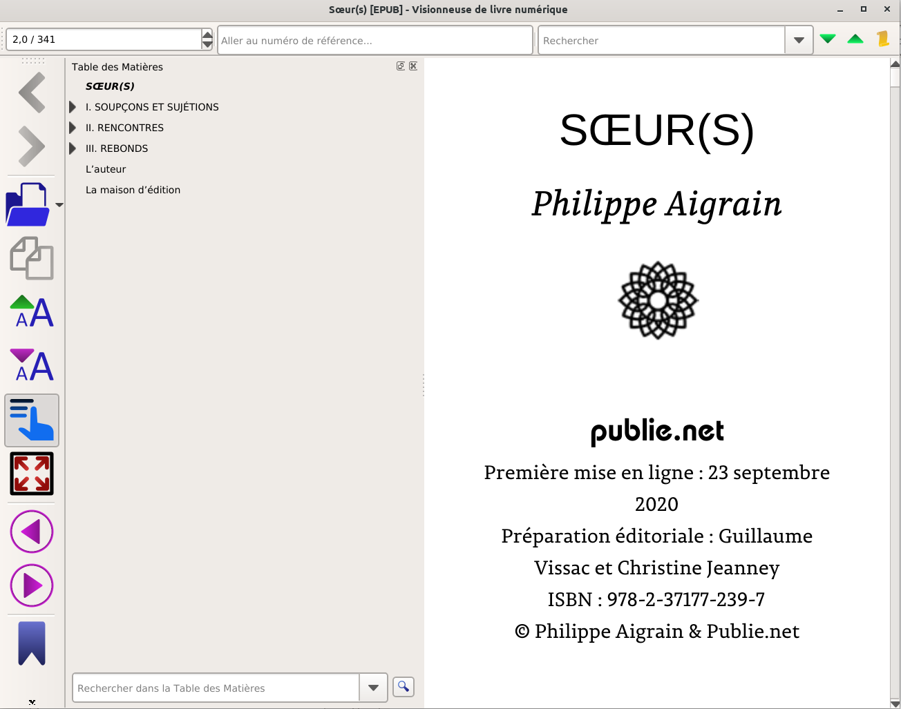<!-- .element: style="width:700px" -->

===

L'EPUB est conçu pour faciliter la mise en page du contenu, le texte affiché étant ajusté au tout dernier moment en fonction du dispositif d'affichage et des choix ergonomiques du lecteur au moment précis de la lecture, choix totalement différent de celui du format PDF. 

Dans un PDF, la mise en page du livre est fixe et ne se modifie pas, peu importe sur quel support on le lit (ordinateur, tablette, liseuse ou iPhone). La mise en page du livre en ePub est quant à elle fluide et s’adapte facilement à l’écran de lecture. On peut, entre autres, modifier la taille et la police de caractères, ce qui rend la lecture plus agréable sur un iPhone par exemple. Toutefois, la mise en page modifiée entraîne forcément des changements dans la pagination, ce qui implique un ajustement dans les usages.

Cette fluidité n'a donc pas forcément plu aux lecteurs, qui avaient besoin de citer, donc de se repérer dans le livre. 

§§§§§§§§§§§§§§§§§§§§§§§§§§§§§§§§§§§§§§§§§§§§§

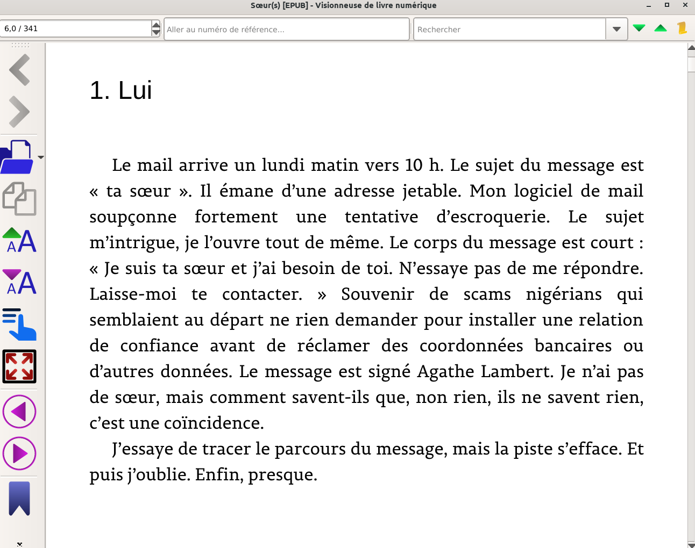<!-- .element: style="width:700px" -->

===

La première version de l'EPUB est proposée durant les années 2000 alors que le marché des liseuses commence à se développer. Le format entend répondre au besoin de celles-ci mais il est tout d'abord peu apprécié des éditeurs et lecteurs en raison de ses limites. Notamment, au début pb d'interactivité (intégration img et son, vidéo) 

§§§§§§§§§§§§§§§§§§§§§§§§§§§§§§§§§§§§§§§§§§§§§

AZW (kindle)

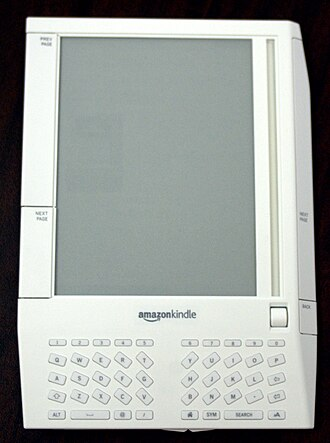<!-- .element: style="width:300px" -->

===

AZW = format proprio : impossible ou difficile de le lire indépendamment de l'outil, en l'occurrence une application, Kindle, développée par Amazon. 

C'est le dev de ce format qui a permis le modèle économique d'Amazon : ne pas vendre des livres mais l'Accès à un catalogue. 

Amazon est allé plus loin : l'outil n'est pas seulement une application, mais un objet-support. 

C'est l'Essor de la liseuse. 
Tout premier Kindle = 2007

Il n’y avait pas d'interface tactile, cependant, le Kindle offrait un clavier complet, avec boutons de navigation et un design en forme de coin favorisant une bonne prise en main. Il offrait également un haut-parleur, une prise casque et un rangement extensible de carte SD.

Comme la navigation était difficile, elle comportait une molette de défilement pour faciliter les sélections sur l'écran. 

§§§§§§§§§§§§§§§§§§§§§§§§§§§§§§§§§§§§§§§§§§§§§

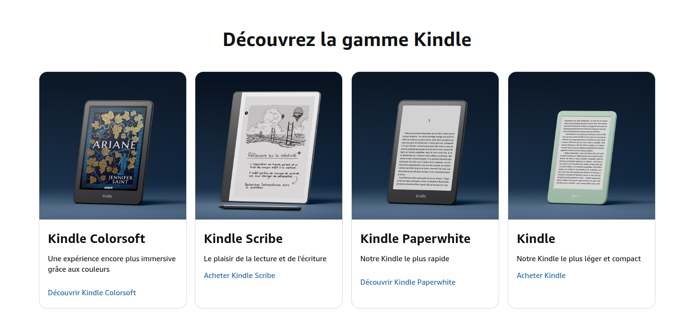

===

Le principe même de la liseuse est intéressant, car on voit que le réflexe de lecture change finalement assez peu : on a encore la logique de la page, là où l'écran, par exemple sur smartphone, nous a appris à scroller. 

Question des gestes de lecture dont on reparlera plus tard.

§§§§§§§§§§§§§§§§§§§§§§§§§§§§§§§§§§§§§§§§§§§§§

### Le livre enrichi ou augmenté
Le livre enrichi utilise les possibilités techniques du format numérique afin d’apporter un enrichissement, autant au contenu qu’à la mise en forme de l’ouvrage imprimé qu’il vient compléter. Il s'agit d'ajouter une plus-value au livre.

<!-- .element: style="font-size:1.7rem; text-align:justify" -->

===

le livre enrichi doit idéalement utiliser les possibilités techniques du format numérique afin d’apporter un enrichissement, autant au contenu qu’à la mise en forme de l’ouvrage imprimé qu’il vient compléter.

Ça a été la grande mode, mais souvent ç'en est resté à « vitrine technologique ». Développement très coûteux, peu de modèle éco encore. Difficile à faire tenir sur le temps long. 

L'idée de l'enrichissement était d'aller vers un modèle hybride, dans lequel on aurait une plus-value grâce au numérique, soit sous la forme d'une augmentation des types de contenus, soit sous la forme de potentialités de lecture. 

§§§§§§§§§§§§§§§§§§§§§§§§§§§§§§§§§§§§§§§§§§§§§

Édition augmentée en ligne - Format WEB (HTML/XML)

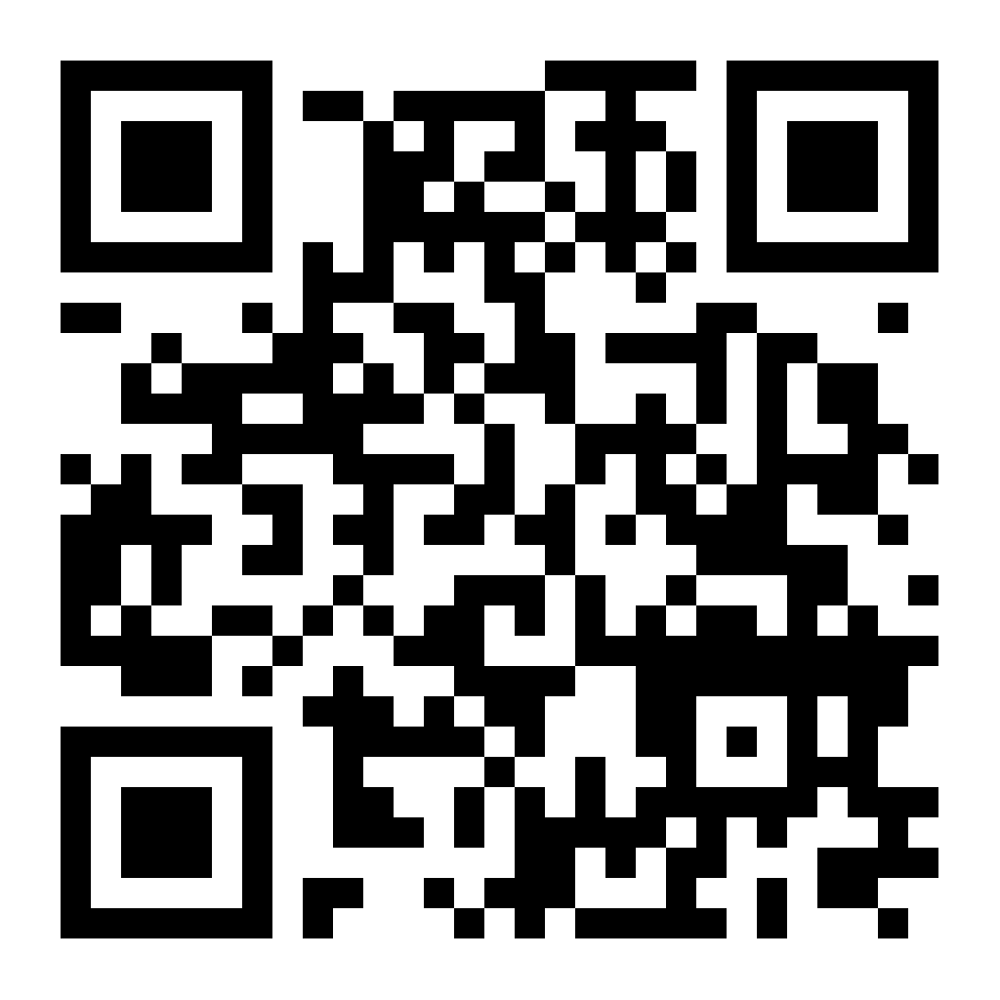<!-- .element: style="width:25%;float:left;margin-right:-1em;" -->

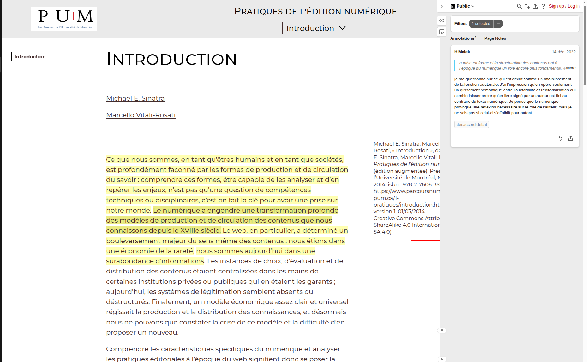<!-- .element: style="width:65%;float:roght;margin-right:-1em;" -->

===

Beaucoup de cas différents : d'abord des éditions dites "augmentées".

collection Parcours numériques : des livres imprimés sans illustration.

Des illustrations sur un site web.

On a donc deux objets, qui fonctionnent indépendamment mais s’apportent une plus-value mutuelle très forte.

Dans cette maison d'édition, passage d'un CMS vers un format Web statique.

§§§§§§§§§§§§§§§§§§§§§§§§§§§§§§§§§§§§§§§§§§§§§

Édition enrichie via un dispositif transmédia (lecture délocalisée sur un appareil)

===

Le livre augmenté, quant à lui, est un dispositif transmédia s’articulant généralement autour d’un livre physique et d’une application mobile dédiée apportant du contenu supplémentaire à l’histoire : sons, images animées en réalité augmentée qui se superposent aux pages du livre, etc.  

DÉlocalisation vers un appareil : ipad, iphone. Souvent qd même des outils apple... On y reviendra, mais développer pour Android et Apple, c'Est très cher. Problème du format de développement : 2 grosses entreprises non interopérables.

Phénomène très utilisé en jeunesse, où il a permis de faire des "histoires animées"

§§§§§§§§§§§§§§§§§§§§§§§§§§§§§§§§§§§§§§§§§§§§§
<!-- .slide: data-background-video="img/Collection Histoires animées.mp4" data-background-size="contain"-->

===

Phénomène très utilisé en jeunesse.

Ici tentative chez Albin Michel : collection "Histoires animées". Seulement 2 ouvrages parus en 2016

§§§§§§§§§§§§§§§§§§§§§§§§§§§§§§§§§§§§§§§§§§§§§

### Le livre hypermédiatique
Une oeuvre numérique s'inspire des potentialités techniques du media numérique (plurimédiatique, immersif, interactif...). Elle opte pour un positionnement esthétique en faveur de la création de nouvelles formes livresques, émancipées du modèle imprimé. La notion même de "livre" est d'ailleurs parfois difficile à convoquer encore.

<!-- .element: style="font-size:1.7rem; text-align:justify" -->

===

le livre hypermédiatique. Créé par et pour le numérique, et non en complément ou par imitation d’un « original papier ».

On ne trouve ces livres que dans un format numérique (voir le manifeste pour une littérature hypermédiatique).

http://revuebleuorange.org/oeuvre/08/livres-dartistes-livres-numeriques-manifeste

Il s'agit d'un positionnement esthétique, avec l'idée que l'expérience de lecture que l'on souhaite produire ne peut être conçue qu'à partir de technologies numériques.

§§§§§§§§§§§§§§§§§§§§§§§§§§§§§§§§§§§§§§§§§§§§§
<!-- .slide: data-background-image="img/bleuOrange08-bis.png" data-background-size="contain"-->

===

Exemple du manifeste de la revue BleuOrange, paru en 2015.

>L’OBJET LIVRE FACE AU NUMÉRIQUE VIENT SOULEVER DES PROBLÉMATIQUES PROPRES À LA RENCONTRE DE DEUX MÉDIAS. LES PRODUCTIONS D’ARTISTES ABORDANT CES QUESTIONS S’INSCRIVENT DANS UN CHAMP DE TENSIONS SE DÉVELOPPANT ENTRE LIVRE PAPIER, LIVRE-OBJET PLASTIQUE ET LIVRE NUMÉRIQUE.

>LE LIVRE PAPIER ÉDITÉ S’INSCRIT DANS UNE ÉCONOMIE (D’OFFRE ET DE DEMANDE, DE REPRODUCTIBILITÉ) DONT LE LIVRE D’ARTISTE (PIÈCE UNIQUE, FANZINE OU MULTIPLE) S’ÉMANCIPE. LA LECTURE DU PREMIER S’ACCOMPAGNE D’UNE CERTAINE TRANSPARENCE DE L’ÉNONCIATION ÉDITORIALE, DE L’OUBLI DU SUPPORT MATÉRIEL AU PROFIT D’UNE RECHERCHE D’«IMMERSION» (EN PARTICULIER DANS LES TEXTES DE FICTION), JUSQU’AUX JEUX PLASTIQUES LES PLUS DIVERS. CETTE DERNIÈRE DÉMARCHE INTERROGE LA FORME DU LIVRE-OBJET. CELUI-CI DÉBORDE DE LA DÉFINITION TRADITIONNELLE DU «LIVRE», JUSQU’À PARFOIS LA METTRE À MAL. DES EXPÉRIMENTATIONS D’ARTISTES SUR LES FORMES PLASTIQUES, LE VOLUME ET LE SUPPORT ATTRIBUÉS À CE LIVRE-OBJET METTENT AU DÉFI LES PRATIQUES DE LECTURE.

§§§§§§§§§§§§§§§§§§§§§§§§§§§§§§§§§§§§§§§§§§§§§
<!-- .slide: data-background-image="img/bleuOrange08.png" data-background-size="contain"-->

===

>NOUS DISTINGUERONS LE LIVRE NUMÉRIQUE DU LIVRE HOMOTHÉTIQUE DE FORMAT PDF OU DE CERTAINS EPUB, DONT LA FORME SE CONTENTE D’IMITER LE LIVRE PAPIER. IL NE S’AGIT PAS NON PLUS D’UN SITE WEB AU SENS CLASSIQUE DU TERME: UN SUPPORT AU CONTENU EXTENSIBLE ET DONT LA FORME OUVERTE (ECO) EST DIFFICILEMENT CIRCONSCRIPTIBLE PAR LE LECTEUR. CE QUI FAIT LIVRE DANS LE NUMÉRIQUE EST UNE FORME AUTOPORTÉE, CIRCONSCRITE, QUOIQUE DYNAMIQUE ET PARFOIS NON LINÉAIRE, ET DONT L’ESSENCE N’EST PAS NÉCESSAIREMENT LITTÉRAIRE NI TEXTUELLE. L’ÉVENTUEL PARADOXE DU «LIVRE» NUMÉRIQUE SE RÉSOUT DANS UNE ADÉQUATION TOTALE ENTRE LES PARTICULARITÉS DU SUPPORT AU SERVICE D’UN CONTENU PENSÉ NATIVEMENT POUR CELUI-CI.

§§§§§§§§§§§§§§§§§§§§§§§§§§§§§§§§§§§§§§§§§§§§§

Le livre-application

===

Livre qui dépend de l'installation & compatiblité d'un outil, souvent une appli. Problème de pérennité, entretien de l'appli & du code. 

§§§§§§§§§§§§§§§§§§§§§§§§§§§§§§§§§§§§§§§§§§§§§
<!-- .slide: data-background-video="img/theboat_mGD18RhL.mp4" data-background-size="contain"-->

===

https://www.youtube.com/watch?v=1CHrxD-wxW4

‘The Boat’ an interactive graphic novel based on the acclaimed short story by Nam Le of of 16-year-old Mai, sent alone by her parents on a boat after the Fall of Saigon.

Writer - Nam Le
Artist - Matt Huynh
Producer - Kylie Boltin
Project design and development - Matt Smith
Sound design - Sam Petty
Client - SBS Online, SBS Australia

The project was launched in recognition of the 40th anniversary of the fall of Saigon and 40 years of Vietnamese resettlement in Australia.

The Boat est également une BD enrichie puisque des archives sont disponibles tout au long de la lecture. Pour accéder à ses archives, le lecteur doit cliquer sur une flèche rouge, qui l’informe qu’il va quitter la page, tout en restant dans l’œuvre (voir annexe 4, illustration 16).
Cependant, les possibilités de lecture qu’offre l’œuvre en font une œuvre atypique qui s’éloigne de la bande dessinée et se rapproche de l’animation.
En effet, il est possible d’enclencher un mode de lecture appelé auto-scroll, qui permet de lancer un défilement automatique de la page. Bien que le
défilement soit assez lent pour permettre la lecture, cette option de lecture va à l’encontre d’une des caractéristiques de la BD, la maîtrise du rythme de
lecture. De plus l’auto-scroll se rapproche plus de l’animation, avec un lecteur qui ne serait plus que spectateur, tout comme l’amateur de film lisant des
sous-titres.

§§§§§§§§§§§§§§§§§§§§§§§§§§§§§§§§§§§§§§§§§§§§§

Le "récit pour IPad"

<iframe title="vimeo-player" src="https://player.vimeo.com/video/74614087?h=7c1905966a" width="640" height="360" frameborder="0" referrerpolicy="strict-origin-when-cross-origin" allow="autoplay; fullscreen; picture-in-picture; clipboard-write; encrypted-media; web-share"   allowfullscreen></iframe>

===
+ parler du livre-appli, du problème de flash en particulier

Conduit d'aération : d'abord "roman pour IPad", puis développement en epub3.

§§§§§§§§§§§§§§§§§§§§§§§§§§§§§§§§§§§§§§§§§§§§§

L'édition Web

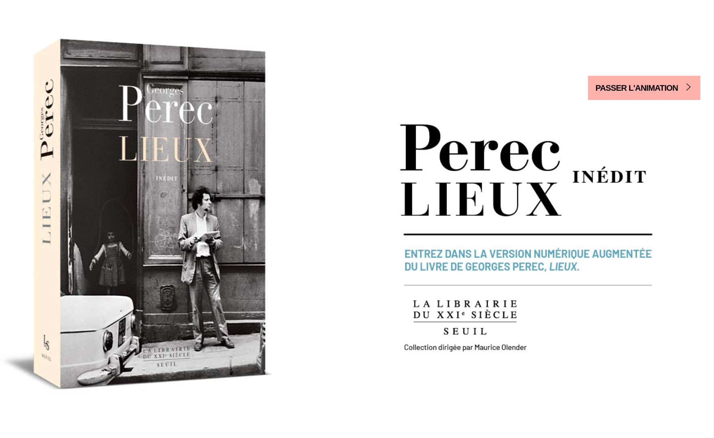

===

On est ici sur du livre-web. 

Lieux de Perec : une véritable édition numérique. 2022

Pas toujours besoin de choses très spectaculaires. 
Les opérations les plus réussies sont celles qui vont vers du low-tech.

§§§§§§§§§§§§§§§§§§§§§§§§§§§§§§§§§§§§§§§§§§§§§
<!-- .slide: data-background-image="img/LieuxPerec3.png" data-background-size="contain"-->

§§§§§§§§§§§§§§§§§§§§§§§§§§§§§§§§§§§§§§§§§§§§§
<!-- .slide: data-background-image="img/LieuxPerec4.png" data-background-size="contain"-->

§§§§§§§§§§§§§§§§§§§§§§§§§§§§§§§§§§§§§§§§§§§§§
<!-- .slide: data-background-image="img/LieuxPerec2.png" data-background-size="contain"-->

§§§§§§§§§§§§§§§§§§§§§§§§§§§§§§§§§§§§§§§§§§§§§

Le *Web to print*

* Un format structuré (HTML/XML) lisible sur un navigateur pour la création du fichier d'impression
* Souveraineté technologique (HTML & XML = standards W3C) et une émancipation des logiciels propriétaires
* Des ouvrages modulaires et multisupports depuis un seul format pivot

<!-- .element: style="width:45%;float:left;margin-left:-1em; font-size:1.2rem; text-align:justify" -->

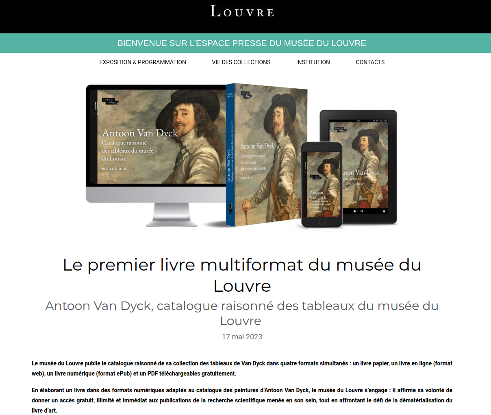<!-- .element: style="width:50%;float:right;margin-right:-1em;" -->

===

Web to print avec HTML structuré.

Fond Gallimard aujourd’hui en XML depuis plus d’une 10aine d’année afin de pouvoir automatiser la mise en forme des textes.

depuis le navigateur web, des fichiers destinés à l’impression.

Pourquoi faire du web to print : souveraineté technologique. Prolétarisation des designers graphiques : locateurs ou usagers d’un service Adobe, mais pas des artisans comme l’étaient les graphistes.

§§§§§§§§§§§§§§§§§§§§§§§§§§§§§§§§§§§§§§§§§§§§§

## Enjeux techniques et éditoriaux du livre numérique
* Interopérabilité
* Manipulabilité
* Ouverture (fermeture) du format
* Pérennité

<!-- .element: style="font-size:1.7rem; text-align:justify" -->

===

La fabrique du livre numérique est en vérité encore balbutiante. Pour le dire de manière très honnête, cette fabrique est encore en phase exploratoire : on teste, on avance pas à pas. On fait des erreurs...

Interopérabilité = capacité à fonctionner sur plusieurs machines et plusieurs environnement (IOS + Androïd)

Manipulabilité = capacité à travailler le texte : surligner, annoter, marquer des pages, citer les pages...

Ouverture du format = rejoint l'interopérabilité : formats et polices libres -- j'y reviens dans un instant

Pérennité = assurer l'archivage, lutter contre l'obsolescence technique

§§§§§§§§§§§§§§§§§§§§§§§§§§§§§§§§§§§§§§§§§§§§§
<!-- .slide: data-background-image="img/hemonLazarrus.png" data-background-size="contain"-->

§§§§§§§§§§§§§§§§§§§§§§§§§§§§§§§§§§§§§§§§§§§§§
<!-- .slide: data-background-image="img/waybackmachine.png" data-background-size="contain"-->

§§§§§§§§§§§§§§§§§§§§§§§§§§§§§§§§§§§§§§§§§§§§§
<!-- .slide: data-background-image="img/wayBackPortier.png" data-background-size="contain"-->

§§§§§§§§§§§§§§§§§§§§§§§§§§§§§§§§§§§§§§§§§§§§§

### De l'imprimé au numérique, du texte au code

* Composante graphique
* Composante computationnelle

<!-- .element: style="font-size:1.7rem; text-align:justify" -->

### Une énonciation éditoriale des "écrits d'écran"

===
Repartons de l'origine du problème : l'écriture numérique se caractérise par sa dualité, comprenant une composante graphique, mais aussi des composantes computationnelles (comme l'a notamment théorisé Bruno Bachimont). Cette stratification de l'écriture numérique, des codes graphiques, linguistiques et informatiques, engage en vérité une stratification du sens, qui globalement échappe à l'usager.

§§§§§§§§§§§§§§§§§§§§§§§§§§§§§§§§§§§§§§§§§§§§§
<!-- .slide: data-background-image="img/codeCarpenter.png" data-background-size="contain" -->
<!-- .slide: class="hover" -->

### Les 3 "niveaux" de l'écriture numérique (Bouchardon & Petit)

>Le livre a une réalité physique ou matérielle (le papier, l’encre) et une réalité symbolique ou culturelle (la langue, les signes à interpréter). Mais pour comprendre le fonctionnement du numérique il faut comprendre l’articulation, non pas de deux, mais de trois niveaux : **il y a ce qu’écrit la machine, il y a ce qu’écrit le programmeur de cette machine, il y a ce qu’écrit l’utilisateur de cette machine. Lire un document numérique quelconque, c’est lire ces trois niveaux, quoique seul le dernier soit visible.** ([Bouchardon et Petit, 2017](http://www.costech.utc.fr/CahiersCOSTECH/spip.php?article69))

<!-- .element: style="font-size:1.5rem; text-align:justify" -->

===

Illustrer ça.

Mais ça marche aussi avec l'écriture. 

Dimension multiple de l'écriture numérique : nous sommes des écrivains qui s'ignorent / voire analphabètes.

Nous pratiquons une écriture dont nous sommes conscients et que nous maîtrisons complètement ou presque (écrire un courriel, éditer un profil sur les réseaux sociaux, commenter un article de presse, remplir un formulaire en ligne pour acheter un livre ou un billet de train, etc.). C'est la dimension "graphique" de l'écriture numérique. Utilisation d'éditeurs ou plutôt de logiciels de traitement de texte WYSISYG : ce que l'on voit, c'est ce que l'on obtient. Concentration vers l'effet en sortie, purement graphique. 

Sauf que cette écriture n'est pas une écriture que peut comprendre la machine. Un ordinateur comprend des données structurées et encodées. Fondamentalement, une édition vraiment numérique a donc beosin d'un logiciel WYSISYM : ce que l'on voit, c'est ce que l'on signifie, ce que l'on veut dire. C'est ajouter une valeur sémantique à des données, en l'occurrence des données textuelles.  

Ce qui signifie que quand on écrit sur un ordinateur, avec un logiciel d'écriture WYSISYG, qui cache derrière une couche logicielle, une couche de code sémantique. 

§§§§§§§§§§§§§§§§§§§§§§§§§§§§§§§§§§§§§§§§§§§§§

Expérience : révéler la composition d'un fichier Word

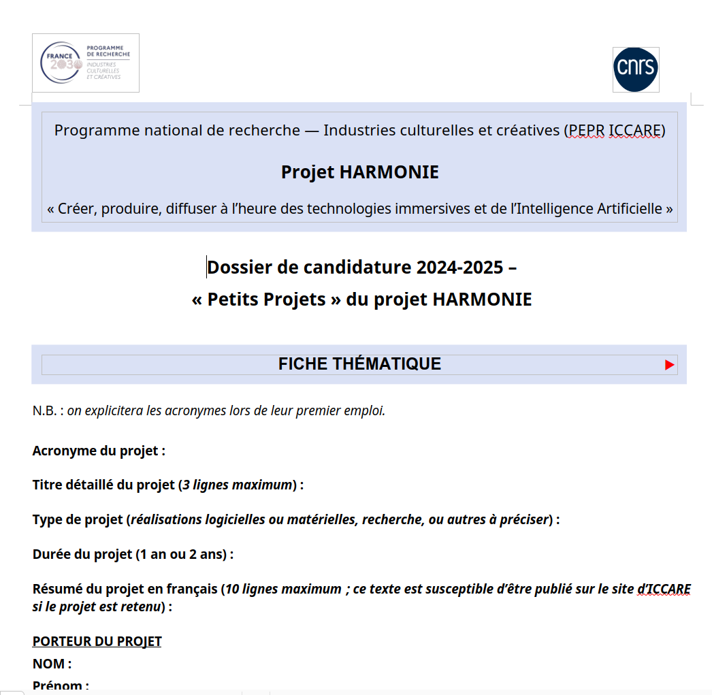<!-- .element: style="width:45%;float:left;margin-right:-1em;" -->

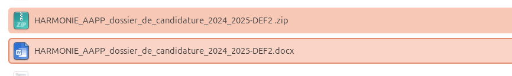<!-- .element: style="width:45%;float:right;margin-right:-1em;" -->

===

Je vous propose une petite expérience : on va déconstruire ensemble un fichier produit en WYSIWYG, pour retrouver la version sémantique. Cette version sémantique est toujours, là, elle fait partie du fichier, elle est conditionnelle à son existence puisque c'est seulement cela que l'ordinateur comprend. Mais généralement c'est caché. 

prenez sur votre ordi n'importe quel fichier Word (docx pour extension). 
Changez l'extension en zip. 

§§§§§§§§§§§§§§§§§§§§§§§§§§§§§§§§§§§§§§§§§§§§§

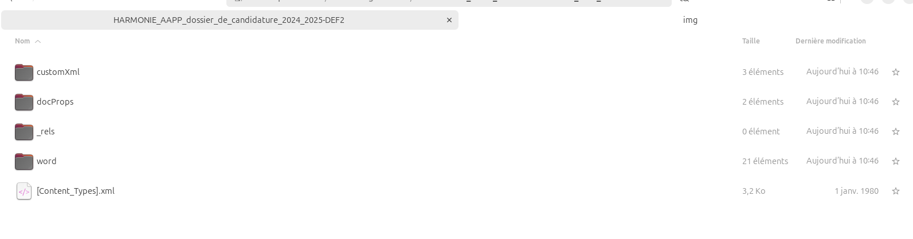<!-- .element: style="width:50%;float:left;margin-left:-1em;" -->

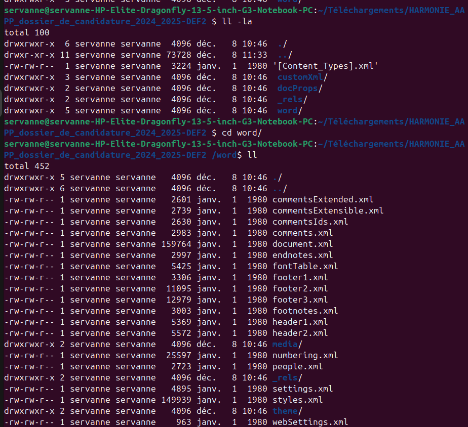<!-- .element: style="width:45%;float:right;margin-right:-1em;" -->

===

Ouvrez ensuite le fichier zip, vous allez voir apparaître l'architecture de votre document.

§§§§§§§§§§§§§§§§§§§§§§§§§§§§§§§§§§§§§§§§§§§§§

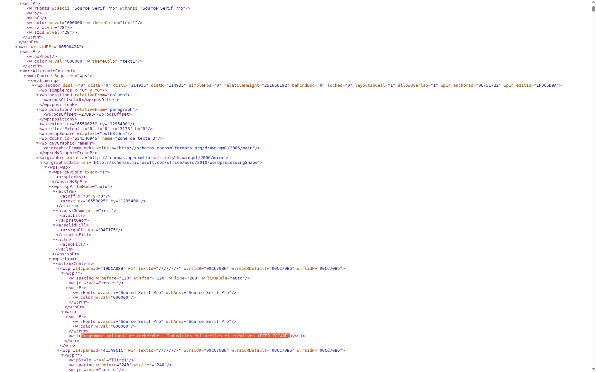<!-- .element: style="width:45%;float:left;margin-left:-1em;" -->

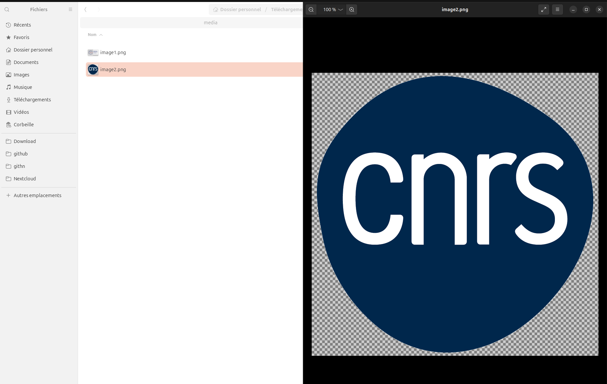<!-- .element: style="width:45%;float:right;margin-right:-1em;" -->

===

Si je rentre dans le dossier Word : je peux ouvrir par exemple document.xml, où je vais avoir l'archi du texte. 

L'Extensible Markup Language, généralement appelé XML, « langage de balisage extensible » en français, est un métalangage informatique de balisage générique

Si je rentre dans le dossier media, j'ai cette fois toute l'iconographie : mes logos. 

Vous vous dites sans doute : heureusement que je ne dois pas faire ça, écrire comme ça, et vous avez raison. 
Cependant, ça ce n'est pas de l'édition numérique : cette architecture est alourdie **parce que** on utilise un éditeur de texte WYSIWYG. L'interface graphique ajoute toute cette couche extrêment lourde de code, cette complexité architecturale. Pas de logique informatique ici. 

§§§§§§§§§§§§§§§§§§§§§§§§§§§§§§§§§§§§§§§§§§§§§

WYSIWYG *vs* WYSIWYM

<!-- .element: style="width:45%;float:left;margin-left:-1em;" -->

<!-- .element: style="width:45%;float:right;margin-right:-1em;" -->

§§§§§§§§§§§§§§§§§§§§§§§§§§§§§§§§§§§§§§§§§§§§§

#### "Bonjour" dans Word

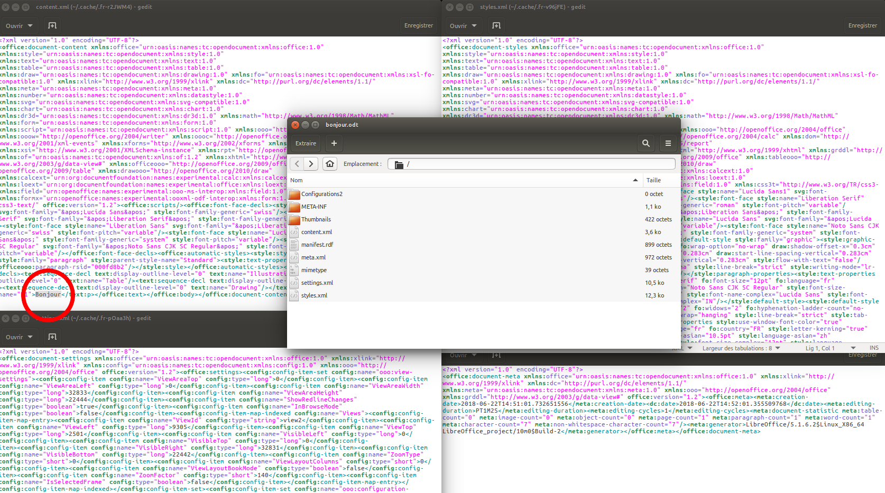

===

Les outils grand public, produits par des multinationales, se sont développées grâce à la construction d'interfaces d'écriture et de publication qui effacent la technique informatique. En conséquence : des documents souvent mal structurés, qui seront difficilement interprétables par la machine sur le long terme, donc non interopérables et non pérennes. 

L'histoire de l'informatique est ainsi l'histoire d'un éloignement, d'une rupture progressive entre nos actions sur l'interface et la machine. 

L'histoire de l'informatique, c'est aussi l'histoire de guerres industrielles, qui se poursuivent aujourd'hui. Et qui finissent par imposer des usages.

Word : au début, développé avec son propre langage. Sauf que c'était un format fermé (.doc), en binaire, quand on ouvrait on n'y voyait rien. 

Par soucis d'interropérabilité, ils ont créé le docx basé sur du langage XML, ce qui fait que l'on peut ouvrir un docx à peu près partout. Le XML de Word est cependant arrimé à un format très abscons. 

Les formats ouverts correspondent à des fichiers encodés de façon transparente, leur recette de fabrication fait partie du domaine public. Ils sont interopérables, c’est à dire qu’ils peuvent être créés, lus et modifiés par tous les logiciels destinés à traiter le type du fichier (image, texte, audio, etc.).

Les formats ouverts sont souvent des standards ouverts, comme le format .html qui sert à construire des pages Web. Les formats ouverts sont à privilégier pour la préservation et le partage des données.

Les formats fermés correspondent souvent à des formats propriétaires.Par exemple InDesign appartient à Adobe. Le logiciel est payant, ce qui explique son format fermé. Cependant, tous les formats propriétaires ne sont pas fermés. Pour reprendre le cas d’Adobe, son format .pdf est devenu un standard (norme ISO). Tout le monde peut ouvrir un fichier PDF.

Microsoft a tenté d’ouvrir les formats de sa suite Microsoft Office. Toutes ses extensions terminant par un “x” (.docx, .pptx, .xlsx) sont des formats sortis dans un but d’interopérabilité. Toutefois leur aspect ouvert fait encore débat.

Pour résumer : Docx est un format propriétaire gérer par un logiciel payant, mais format reste en théorie ouvert. En théorie, car en pratique on voit bien qu'on y comprend rien, trop complexe à lire par un humain. 

§§§§§§§§§§§§§§§§§§§§§§§§§§§§§§§§§§§§§§§§§§§§§

### Les formats : une guerre d'édition à l'époque numérique
* Les GAFAM (logique commerciale, construction de formats fermés)
* Les consortiums de type W3C (logique éditoriale, de gratuité et d'accessibilité)

<!-- .element: style="font-size:1.7rem; text-align:justify" -->

===

À l’heure actuelle, il existe un peu une « bataille » pour la propriété du web.

Les Éditions GAFAM, qui bénéficient d’une grande visibilité car bcp d’argent mis dans la publicité. Aussi, une certaine simplicité d’accès. Ces groupes décident de leurs formats, ils en sont les propriétaires. LOGIQUE COMMERCIALE

Les Communautés / consortiums (ex. le W3C) qui discutent ensemble pour construire des formats strandards basés sur un principe de gratuité et d’accessibilité - associée à une réflexion d’ouverture (toujours faire en sorte d’assurer une accessibilité et une pérénité dans le temps). LOGIQUE ÉDITORIALE (au sens de l’organisation/structuration/transmission/pérénisation des documents).

Ce qui se joue ici, c’est une réflexion sur la propriété intellectuelle des outils avec lesquels nous allons construire les livres numériques.

// Communs

Tout le monde a un ordinateur, mais tout le monde n’a pas acheté les logiciels ou les droits de lecture / d’écriture de certains fichiers. Qu’est-ce qu’on achète ??? Les droits d’un texte ou de son format ?
Pb d’un nouveau modèle économique à trouver.

§§§§§§§§§§§§§§§§§§§§§§§§§§§§§§§§§§§§§§§§§§§§§

### La lecture à l'écran va-t-elle transformer nos gestes de lecture ?

Quelques réflexions sur nos gestes de lecture, et leur possible réinvention en contexte numérique (UX Design, *game play*, design du livre, tactilité).

§§§§§§§§§§§§§§§§§§§§§§§§§§§§§§§§§§§§§§§§§§§§§
<!-- .slide: data-background-image="img/lndlr.jpg" data-background-size="contain"-->

===
Dans son roman *Le Nom de la rose*, Umberto Eco met en scène l'une des armes du crime les plus improbables de la littérature policière : un livre ou, plutôt, une mauvaise habitude de lecture transformée en piège mortel par le meurtrier. Les moines copistes s’empoisonnent en effet à chaque fois qu’ils tournent une page du manuscrit interdit (le mythique livre sur la Comédie d’Aristote) en s’humectant légèrement les doigts avec la langue pour parvenir à séparer les feuillets du manuscrit ancien, dont le papier est devenu collant. Le meurtrier, Jorge, a parié sur ce geste de lecteur impatient pour piéger ses victimes, en déposant du poison dans les marges du manuscrit - piège mortel que Guillaume de Baskerville, le héros du récit, parvient à éviter

§§§§§§§§§§§§§§§§§§§§§§§§§§§§§§§§§§§§§§§§§§§§§

>Il lut à voix haute la première page, puis il cessa, comme s’il n’était pas intéressé à en savoir davantage, et il feuilleta en hâte les pages suivantes : mais après quelques feuillets, il rencontra une résistance, car sur la marge latérale supérieure, et tout le long de la tranche, les feuillets étaient unis les uns aux autres, comme il arrive lorsque – une fois humidifiée et détériorée – la matière du papier forme une sorte de gluten poisseux. Jorge se rendit compte que le froissement des feuillets tournés avait cessé, et il exhorta Guillaume. « Allons, lis, feuillette-le. Il est à toi, tu l’as bien mérité. » (Le Nom de la Rose, U. ECO)

<!-- .element: style="font-size:1.6rem; text-align:justify" -->

§§§§§§§§§§§§§§§§§§§§§§§§§§§§§§§§§§§§§§§§§§§§§

>Guillaume rit ; il paraissait plutôt amusé : « Alors, ce n’est pas vrai que tu me crois aussi subtil que ça, Jorge ! Tu ne le vois pas, mais j’ai des gants. Avec les doigts empêtrés de la sorte je ne parviens pas à détacher les feuillets. Je devrais m’exécuter les mains nues, m’humecter les doigts avec ma langue, comme il m’est arrivé de faire ce matin en lisant dans le scriptorium, alors soudain ce mystère aussi s’est éclairci pour moi, et je devrais continuer à tourner ainsi les feuillets, tant qu’une bonne dose de poison ne serait pas passée dans ma bouche. (Le Nom de la Rose, U. ECO)

<!-- .element: style="font-size:1.6rem; text-align:justify" -->

===

>Il lut à voix haute la première page, puis il cessa, comme s’il n’était pas intéressé à en savoir davantage, et il feuilleta en hâte les pages suivantes : mais après quelques feuillets, il rencontra une résistance, car sur la marge latérale supérieure, et tout le long de la tranche, les feuillets étaient unis les uns aux autres, comme il arrive lorsque – une fois humidifiée et détériorée – la matière du papier forme une sorte de gluten poisseux. Jorge se rendit compte que le froissement des feuillets tournés avait cessé, et il exhorta Guillaume. « Allons, lis, feuillette-le. Il est à toi, tu l’as bien mérité. » Guillaume rit ; il paraissait plutôt amusé : « Alors, ce n’est pas vrai que tu me crois aussi subtil que ça, Jorge ! Tu ne le vois pas, mais j’ai des gants. Avec les doigts empêtrés de la sorte je ne parviens pas à détacher les feuillets. Je devrais m’exécuter les mains nues, m’humecter les doigts avec ma langue, comme il m’est arrivé de faire ce matin en lisant dans le scriptorium, alors soudain ce mystère aussi s’est éclairci pour moi, et je devrais continuer à tourner ainsi les feuillets, tant qu’une bonne dose de poison ne serait pas passée dans ma bouche.

§§§§§§§§§§§§§§§§§§§§§§§§§§§§§§§§§§§§§§§§§§§§§
<!-- .slide: data-background-image="img/photolit.png" data-background-size="contain"-->
<!-- .slide: class="hover"-->

### Eco et le geste de lecture
* Le texte importe parfois moins que le livre qui le contient (le médium, c'est le message...)
* Le livre, en tant que média, s'est fait transparent (sécularisation)
* Le livre engage une sensorialité forte (matérialité)
* L'acte de lecture est indissociable de ses gestes (aspect kinésique)

<!-- .element: style="font-size:1.7rem; text-align:justify" -->

===
le texte importe parfois moins que « l’acte » de lecture d’abord conçu comme un geste – un geste mortel dans *Le Nom de la rose*

§§§§§§§§§§§§§§§§§§§§§§§§§§§§§§§§§§§§§§§§§§§§§
<!-- .slide: data-background-image="img/photolit.png" data-background-size="contain"-->
<!-- .slide: class="hover"-->

### Livre et tablette tactile : vers l'ux design
* Comment les éditeurs, écrivains, designers, exploitent-ils le potentiel de la tablette tactile, en réinvestissant la dimension kinésique du livre - dimension à la fois pratique et imaginaire ?

<!-- .element: style="font-size:1.7rem; text-align:justify" -->

===

De l’expérience livresque (papier, couverture, etc.), à l’interface numérique, il y a eu une très grande réflexion sur le design du livre.

Attention : design peut sembler loin de nos préoccupations, on peut se dire que ça n’a rien à voir avec la littérature, mais si !!!!

§§§§§§§§§§§§§§§§§§§§§§§§§§§§§§§§§§§§§§§§§§§§§

>Le design d’expérience peut se définir brièvement comme la conception orientée vers l’expérience de l’utilisateur. Pour comprendre ce concept, le mieux est d’expliquer ce qu’est l’expérience utilisateur.

>Ce terme a commencé à être utilisé notamment dans les années 2000, avec l’essor du web 2.0 et du marketing digital. L’objectif est de concevoir un site, une plateforme ou une application web en tenant compte des attentes des utilisateurs, voire en anticipant la manière dont les consommateurs vont naviguer sur le site, interagir ou réagir à ses fonctionnalités et à son apparence.

<!-- .element: style="width:45%;float:left;margin-left:-1em; font-size:1.2rem; text-align:justify" -->

<!-- .element: style="width:50%;float:right;margin-right:-1em;" -->

===

Cas de l'UX Design :

>Le design d’expérience peut se définir brièvement comme la conception orientée vers l’expérience de l’utilisateur. Pour comprendre ce concept, le mieux est d’expliquer ce qu’est l’expérience utilisateur.

>Ce terme a commencé à être utilisé notamment dans les années 2000, avec l’essor du web 2.0 et du marketing digital. L’objectif est de concevoir un site, une plateforme ou une application web en tenant compte des attentes des utilisateurs, voire en anticipant la manière dont les consommateurs vont naviguer sur le site, interagir ou réagir à ses fonctionnalités et à son apparence.

Cet aspect du design  (qui concerne donc l’expérience lecteur) montre qu’il y a encore toute une réflexion à mener sur ce que peut-être et peut donner un livre numérique.

§§§§§§§§§§§§§§§§§§§§§§§§§§§§§§§§§§§§§§§§§§§§§

### Le design skeuomorphique

>« un élément de design ou une structure qui ne sert aucun but dans l'objet formé à partir du nouveau matériau, mais qui était essentiel dans l'objet fait à partir du matériau original » (Georges Basalla)

<!-- .element: style="font-size:1.7rem; text-align:justify" -->

===

C’est ainsi que l’on peut envisager et revaloriser les premières tentatives de remédiation du livre à l’ère numérique, qui se sont d’abord appuyées sur le principe de design skeuomorphique, lui-même peu à peu associé aux fonctions tactiles des écrans numériques.

Le terme skeumorphisme est un néologisme formé à partir du grec skeuos (« l'équipement militaire, mais aussi le costume, l'ornement, la décoration ») pour qualifier « un élément de design ou une structure qui ne sert aucun but dans l'objet formé à partir du nouveau matériau, mais qui était essentiel dans l'objet fait à partir du matériau original ». Cette définition, donnée par George Basalla à la fin des années 80, sert de référence pour le concept et on la retrouve un peu partout. C’est d’ailleurs assez regrettable, car, ainsi défini, le skeuomorphisme est condamné d’office comme un élément « sans but », purement « ornemental », une métaphore visuelle ou sonore destinée à rassurer des usagers infantilisés par les constructeurs comme Apple – qui a d’ailleurs usé et abusé de cette forme (supposée œuvrer en faveur d’une interface intuitive).

La remédiation du livre joue beaucoup sur notre imaginaire kinésique : c’est-à-dire notre expérience sensorielle (Beigbedder et son « sniffer » les livres).

Ce qui est intéressant, c’est que la matérialité du livre - et son influence sur notre expérience de lecture - ont été parmi les premières choses à avoir été travaillées.

Source : Google Earth

<!-- .element: class="source" -->

§§§§§§§§§§§§§§§§§§§§§§§§§§§§§§§§§§§§§§§§§§§§§

## Un pastiche inutile ?

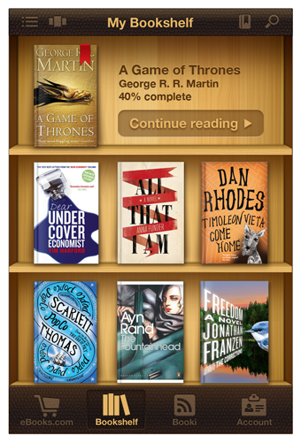

===

Un exemple : les premières bibliothèques Ibook reproduisaient l’image de nos bibliothèques, avec ses étagères en bois, et les images des livres, en relief, cliquables pour accéder au texte. Cette mise en scène, certes pour le coup assez gadget, ou en tout cas purement représentative, a d’ailleurs été abandonnée dans les dernières années (au profit du flat design).

Longtemps critiquée et moquée, la représentation skeuomorphique de la page papier dans les livres numériques nous a permis, avec l’apparition des écrans tactiles, de reproduire le geste de lecture propre au codex, en particulier le geste du feuilletage.

§§§§§§§§§§§§§§§§§§§§§§§§§§§§§§§§§§§§§§§§§§§§§

## Comprendre la lecture comme un faire
* Enjeu : reproduire les gestes de lecture qui donnent eux aussi leur sens au texte
* Lire, c'est agir, pas seulement regarder... (matérialité performative)

<!-- .element: style="font-size:1.7rem; text-align:justify" -->

===
Aujourd’hui, ce dispositif est devenu assez obsolète, il prête même à sourire, pourtant il serait injuste de la réduire à une métaphore visuelle singeant le papier : il faisait en effet l’effort de comprendre la lecture comme un geste de feuilletage – une pratique performative qui a toute son importance, car elle participe aussi à construire le sens au texte et notre statut de lecteur.

En dépit de son étymologie, qui le fait passer pour un simple « ornement » ou une métaphore visuelle, le skeuomorphisme de la page du livre numérique envisageait déjà le processus de remédiation comme réitération d’un geste et initiait ainsi, contre toute apparence, une critique de la remédiation conçue comme représentation de l’image d’un vieux médium. Le skeuomorphisme, à plus forte raison lorsqu’il était associé à la technologie tactile,  s’inscrivait ainsi dans un paradigme performatif – où l’on favorisait déjà l’idée d’un « faire » plutôt que l’idée d’un « regarder ».

§§§§§§§§§§§§§§§§§§§§§§§§§§§§§§§§§§§§§§§§§§§§§

### Les affordances du livre

>"The affordances of the environment are what it offers the animal, what it provides or furnishes, either for good or ill." (GIBSON, 1986)

<!-- .element: style="font-size:1.7rem; text-align:justify" -->

===

L'affordance, emprunt à l'anglais, est parfois traduit par « potentialité » ou « prise »[réf. nécessaire]. Le terme est originellement un néologisme anglais dérivé du verbe to afford qui a un double sens : « être en mesure de faire quelque chose » et « offrir »

"The affordances of the environment are what it offers the animal, what it provides or furnishes, either for good or ill." [@gibson_ecological_1986, p. 119].

>Les affordances de l'environnement désignent ce que ce dernier offre à l'animal, ce qu'il fournit, que ce soit pour le meilleur ou pour le pire.

Pour Gibson, l'affordance est l'ensemble de toutes les possibilités d'action d'un environnement. Celles-ci sont objectives, mais doivent toujours être mises en relation avec l'acteur qui peut les utiliser. Par exemple, face à livre imprimé traditionnel, on aura tendance à tourner les pages une par une. Mais, selon les cultures, l,ordre des pages peut changer... on voit donc bien que ce n'est pas un "universalisme".

§§§§§§§§§§§§§§§§§§§§§§§§§§§§§§§§§§§§§§§§§§§§§

### Lire : un savoir "naturellement" produit par le médium ?
* Affordances = potentiel d'action d'un environnement tel qu'il est perçu par l'usager
* Affordances "réelles" ou "apprises" ?
* Mais ne confond-t-on pas la matérialité performative avec un savoir-agir culturel (cf. Eco) ?
* Penser la "matérialité performative" du livre (Drucker)

<!-- .element: style="font-size:1.7rem; text-align:justify" -->

===

Pour résumer, les affordances désignent le potentiel d'action d'un environnement - soit dans le cas qui nous occupe, le potentiel d'action du media livresque, *tel qu'il est perçu par l'usager*.

Là où les théories littéraires de la réception  avaient déjà redéfini le texte en fonction de son actualisation par le lecteur, la notion d'affordance relie cette perfomativité à la matérialité du texte (ce que Johanna Drucker a aussi appelé la "matérialité performative"[^drucker]).

Cette association évidente entre l'action et son support ne manque pourtant pas d'ouvrir à d'autres problématiques.

§§§§§§§§§§§§§§§§§§§§§§§§§§§§§§§§§§§§§§§§§§§§§
<!-- .slide: data-background-image="img/gestures.png" data-background-size="contain"" -->

===

Dans le domaine des applications numériques, l'affordance est devenu un terme très à la mode. "En ergonomie, elle permet de rendre l’utilisation d’un objet ou d’un service « intuitive ». Pour améliorer l’interface utilisateur (UI) et l’expérience utilisateur (UX), les affordances sont donc essentielles dans le design des interfaces et des services."

Cette distinction entre affordances "réelles" et "apprises"[^debatAffordance] a d'ailleurs nourri certains reproches à l'endroit des designers d'interfaces, qui ne prendraient pas suffisamment en compte les écarts de littératie numérique entre les usagers : tout le monde ne sait pas se servir (si bien) d'un ordinateur.

§§§§§§§§§§§§§§§§§§§§§§§§§§§§§§§§§§§§§§§§§§§§§

## La remédiation comme réitération d'un geste
* Réinvestir l'expérience kinésique du livre
* Remédier = agir plutôt que pastiche

<!-- .element: style="font-size:1.7rem; text-align:justify" -->

===
Dès lors, on comprend pourquoi c'est la stratégie de l'hypermédiateté qui s'est révélée gagnante dans la construction des interfaces de lecture contemporaines : il s'agissait de jouer sur les affordances culturelle (notre connaissance du livre en tant que média, sa performativité matérielle), pour prendre en main de nouvelles machines de lecture.

La remédiation apparaît ainsi non pas comme une simple "Imitation" des livres imprimés, mais comme la possibilité de réinvestir des gestes bien connus : l'expérience kinésique du livre, son toucher.

§§§§§§§§§§§§§§§§§§§§§§§§§§§§§§§§§§§§§§§§§§§§§

## Le champ de bataille des gestes de lecture
* Apple vs IOS
* Des gestes pré-construits
* Des technologies propriétaires (donc, des gestes "sous embargo")

<!-- .element: style="font-size:1.7rem; text-align:justify" -->

===
Pb : faire ces gestes suppose un travail technique que l'on néglige souvent alors qu'il est décisif.

Ainsi, le numérique a commencé à façonner ses propres gestes de lecture, que les usagers maîtrisent de mieux en mieux. On ajoutera cependant aussitôt que la formule « le numérique » est ici un brin simpliste : car ce sont bel et bien les grandes entreprises, fabricantes de nos outils et supports numériques, qui ont façonné ces gestes. De ce point de vue, le développement des technologies reliées à ces gestes de lecture ou de navigation n’est pas seulement un enjeu poétique, il est aussi politique. En 2011, une rumeur s’est d’ailleurs emparée du Web : Apple était accusé d’avoir déposé un brevet pour s’accaparer les dernières technologies en matière d’interfaces tactiles. En vérité, Apple avait déposé un abstract1 – dont l’impact légal n’est pas tout à fait le même qu’un brevet – qui ne concernait pas tant l’interface tactile que les gestes (la technologie multitouch) permettant de manipuler cette interface. Mais la levée de boucliers qui a accompagné cette rumeur2 démontre combien les gestes de lecture de nos appareils numériques sont devenus un enjeu essentiel dans l’industrie, attisant la concurrence entre les grandes firmes (notamment Apple, Google, Samsung).

Il est d’ailleurs assez préoccupant de constater que l’industrie du numérique - en particulier l’industrie des GAFAMs - ne propose aux usagers qu’un « catalogue » restreint de gestes de lecture possibles. Les écrivains, éditeurs, designers, développeurs sont ainsi soumis à ces affordances préconstruites, ce qui influence évidemment le processus de création en amont - mais aussi le processus de réception et de lecture des livres numériques.

§§§§§§§§§§§§§§§§§§§§§§§§§§§§§§§§§§§§§§§§§§§§§

>Apple et Google «verrouillent» totalement le marché, ce qui implique en conséquence la prépondérance de leurs deux systèmes d’exploitation, respectivement iOS et Android. Cette domination n’est pas sans impact sur les œuvres et les modes de création. D’autant plus que, comme le remarque Françoise Benhamou dans « Le livre et son double », aucune de ces grandes entreprises ne vient du monde de la culture, par conséquent les objets littéraires et artistiques qu’ils relaient sur leurs plateformes de vente ne sont que quelques contenus parmi beaucoup d’autres dans leur stratégie (hégémonique?) de diversification. (Anaïs Guilet, 2016)

<!-- .element: style="font-size:1.6rem; text-align:justify" -->

§§§§§§§§§§§§§§§§§§§§§§§§§§§§§§§§§§§§§§§§§§§§§
<!-- .slide: data-background-image="img/UX_controle.png" -->

===

>L’impact des systèmes d’exploitation des appareils à écrans tactiles est particulièrement prégnant au regard des œuvres applicatives qui sont expressément conçues pour s’y adapter. En effet, un développeur qui voudra rendre disponible une application sur Android et iOS devra en réaliser deux versions, et d’autant plus s’il veut qu’elles soient exécutables sur Windows phone de Microsoft, Firefox OS du groupe Mozilla ou le système open source Tizen. À l’heure actuelle, les créateurs et éditeurs d’applications s’en tiennent donc le plus souvent à Android et iOS. Chaque système d’exploitation induit des interfaces différentes et donc des IHM différentes. Une interface, pour qu’elle soit efficace, doit être la plus ergonomique et la plus intuitive possible pour son usager, dont les pratiques varient en fonction du contexte d’utilisation. (Anaïs Guilet, 2016)

§§§§§§§§§§§§§§§§§§§§§§§§§§§§§§§§§§§§§§§§§§§§§

>L’impact des systèmes d’exploitation des appareils à écrans tactiles est particulièrement prégnant au regard des œuvres applicatives qui sont expressément conçues pour s’y adapter. En effet, un développeur qui voudra rendre disponible une application sur Android et iOS devra en réaliser deux versions, et d’autant plus s’il veut qu’elles soient exécutables sur Windows phone de Microsoft, Firefox OS du groupe Mozilla ou le système open source Tizen. À l’heure actuelle, les créateurs et éditeurs d’applications s’en tiennent donc le plus souvent à Android et iOS. Chaque système d’exploitation induit des interfaces différentes et donc des IHM différentes. Une interface, pour qu’elle soit efficace, doit être la plus ergonomique et la plus intuitive possible pour son usager, dont les pratiques varient en fonction du contexte d’utilisation. (Anaïs Guilet, 2016)

<!-- .element: style="font-size:1.6rem; text-align:justify" -->

§§§§§§§§§§§§§§§§§§§§§§§§§§§§§§§§§§§§§§§§§§§§§

## Barbarismes technologiques et littérarité numérique

§§§§§§§§§§§§§§§§§§§§§§§§§§§§§§§§§§§§§§§§§§§§§

## Cliquer (l'hypertexte)

* Je clique d'abord, je réfléchis ensuite (éventuellement)

§§§§§§§§§§§§§§§§§§§§§§§§§§§§§§§§§§§§§§§§§§§§§
<!-- .slide: data-background-image="img/commeSiDeRienNEtait.png" data-background-size="contain"-->

§§§§§§§§§§§§§§§§§§§§§§§§§§§§§§§§§§§§§§§§§§§§§
<!-- .slide: data-background-image="img/commeSiDeRienNEtait1.png" data-background-size="contain"-->

§§§§§§§§§§§§§§§§§§§§§§§§§§§§§§§§§§§§§§§§§§§§§
<!-- .slide: data-background-image="img/commeSiDeRienNEtait2.png" data-background-size="contain"-->

§§§§§§§§§§§§§§§§§§§§§§§§§§§§§§§§§§§§§§§§§§§§§

>Chaque bouton, chaque hyperlien est une invitation à aller plus loin, une promesse de contenu. Par le mécanisme de dévoilement qui lui est inhérent, ce système en appelle particulièrement à la psychologie de l’enfant. Anticipant sur ce qui est connu aujourd’hui comme la “ loi du marteau ” (à savoir que l’enfant qui découvre le marteau estime que tout a besoin d’être martelé), Valéry avait noté combien les enfants avaient tendance à répondre aux sollicitations de leur environnement: « S’il y a un anneau, on tend à le tirer, une porte, à l’ouvrir, une manivelle, à la tourner — une culasse, à la faire jouer. (Christian Vandendorpe, 1999)

<!-- .element: style="font-size:1.4rem; text-align:justify" -->

§§§§§§§§§§§§§§§§§§§§§§§§§§§§§§§§§§§§§§§§§§§§§

## Dessiner (le poème numérique)

* Une réinterprétation du calligramme

§§§§§§§§§§§§§§§§§§§§§§§§§§§§§§§§§§§§§§§§§§§§§
<!-- .slide: data-background-video="img/poemm.mp4" data-background-size="contain"-->

Source : [P.o.E.M.M](http://www.poemm.net/), Jason Edward Lewis

<!-- .element: class="source" -->

===
Poetry for Excitable [Mobile] Media is a series of poems written and designed to be read on touch devices, from large-scale exhibition surfaces to mobile screens.

§§§§§§§§§§§§§§§§§§§§§§§§§§§§§§§§§§§§§§§§§§§§§

## Filmer (le livre en réalité augmentée)

* Une réinterprétation du pop-up : le livre en 3D

§§§§§§§§§§§§§§§§§§§§§§§§§§§§§§§§§§§§§§§§§§§§§
<!-- .slide: data-background-video="img/leneigenapasdesens.mp4" data-background-size="contain"-->

Source : *La Neige n'a pas de sens*, Claire Bardainne & Adrien Mondot, Subjectile

<!-- .element: class="source" -->

§§§§§§§§§§§§§§§§§§§§§§§§§§§§§§§§§§§§§§§§§§§§§

## Regarder (le livre-écran)

* Un codex papier comme interface

§§§§§§§§§§§§§§§§§§§§§§§§§§§§§§§§§§§§§§§§§§§§§
<!-- .slide: data-background-video="img/lelivreinfini.mp4" data-background-size="contain"-->

Source : *Le livre infini*, Albertine Meunier

<!-- .element: class="source" -->

§§§§§§§§§§§§§§§§§§§§§§§§§§§§§§§§§§§§§§§§§§§§§

## Caresser (l'image à l'écran)

* Créer des métaphores kinésiques : une expérience synesthéstique

§§§§§§§§§§§§§§§§§§§§§§§§§§§§§§§§§§§§§§§§§§§§§
<!-- .slide: data-background-video="img/Etant_Donnee2.mp4" data-background-size="contain"-->

Source : *Étant donnée*, Cécile Portier

<!-- .element: class="source" -->

§§§§§§§§§§§§§§§§§§§§§§§§§§§§§§§§§§§§§§§§§§§§§
<!-- .slide: data-background-image="img/rondepierre.png" data-background-size="contain"-->

## Conclusion
Après avoir un temps fait courir la rumeur d'un remplacement médiatique, et de la disparition du papier, le livre numérique apparaît plutôt comme une nouvelle offre, qui n'est pas nécessairement à prendre comme une offre concurrente, mais comme une offre supplémentaire. Concept clé de la théorie des _media_ depuis 30 ans, la remédiation s'avère être une stratégie fondamentale des nouveaux media numériques. Du point de vue des usages (design), elle permet aux utilisateurs d'assurer une continuité formelle et pratique, facilitant la prise en main des nouveaux outils, plateformes, des oeuvres elles-mêmes. Du point de vue esthétique, elle ouvre aussi à des hybridations inattendues. Cependant, à l'heure actuelle, les enjeux techniques de la remédiation demeurent dans les mains des grandes firmes technologiques, qui développent autant qu'elles verrouillent les outils de développement, d'écriture et de lecture.

<!-- .element: style="font-size:1.6rem; text-align:justify" -->

===
