# Problématiques de l'édition contemporaine

 *Connaissance des métiers de l’édition*
 2026-2027

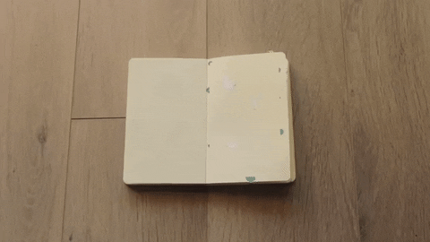

 Servanne Monjour (servanne.monjour@sorbonne-universite.fr)

<!-- .element: style="font-size:1.3rem; text-align:center" -->
===

Le cours a pour titre "connaissance des métiers de l'édition". Titre assez mal choisi car, en vérité, des "métiers" de l'édition, il en existe des dizaines, plus ou moins visibles ou invisibilisés, tout le long de la chaîne de production du livre : 

- écrivain, auteur, éditeur, agent littéraire, préparateur de copie, designeur, maquettiste, typographe, imprimeur, juriste spécialiste des droits, distributeur, diffuseur, libraire et j'en passe. 

Ce cours pourrait donc rapidement ressembler à un liste à la manière de Georges Perec, ce qui serait peut-être drôle, mais au final lassant. 

Une autre expression, qui recouvre en partie mais pas complètement la précédente, serait "métiers du livre". Mais c'est un peu le même problème : un livre, c'est quoi ? 
- objet matériel : le codex, qui aujourd'hui connait de grandes mutations avec les technos numériques
- un support pour des textes et des images -- concurrence d'autres formats (podcast ou livre audio)
- un objet culturel et symbolique -- le livre incarne une certaine conception de la culture, de la sagesse, du savoir... il n'y a qu'à voir la portée symbolique d'un autodafé pour comprendre
- un produit -- produit culturel certes, mais produit qd même, ET à ce titre un objet industrialisé. DE ce pt de vue, pris dans une économie.

%%%%%%%%%%%%%%%%%%%%%%%%%%%%%%%%%%%%%%%%%%%%%

## Quelques questions pour commencer... 

<!-- .element: style="width:200px" --> 

§§§§§§§§§§§§§§§§§§§§§§§§§§§§§§§§§§§§§§§§§§§§§

## Revue de presse du secteur éditorial 2025
* Section ["Vie de l'édition"](https://www.lemonde.fr/vie-de-l-edition/), *Le Monde*
* *Le 1 des libraires* (en kiosques - cf. le spécial "Rentrée littéraire")
* [ActuaLitté](https://actualitte.com/)
* [Éditions actu](https://editions-actu.org/)
* [LivresHebdo](https://www.livreshebdo.fr/articles)
* Etc. 

<!-- .element: style="font-size:1.7rem; text-align:justify" -->

===

Ce que je vous propose, c'est d'opérer ensemble un petit tour d'horizon de la presse spécialisée dans l'édition ces derniers mois et/ou années, afin de comprendre les enjeux du secteur. 

Cette "revue de presse" est d'ailleurs un exercice que je vous conseille d'opérer régulièrement, afin de vous tenir au courant des tendances du moment, mais également parce que c'est là dessus que portera votre évaluation : je vous proposerai un article de presse à analyser afin de le conceptualiser. Vous devrez me démontrer votre capacité à mobiliser des concepts théoriques : théorie littéraire, théorie des médias, théorie de l'histoire matérielle du livre, afin de problématiser les informations de la presse écrite et de les discuter de manière critique.

Mener une veille informationnelle du secteur professionnel pour...

... se cultiver sans effort (ou presque)
... saisir les problématiques du secteur
... excercer son esprit critique

Un article de presse se fait le reflet de l'actualité, mais ce n'est pas un texte critique. En tant que spécialistes de l'édition -- et plus largement des industries culturelles -- je vous demanderai d'être capables de prendre un recul critique sur ces informations. 

Tout au long de ce semestre, nous allons donc nous préparer à exercer ce recul critique.

§§§§§§§§§§§§§§§§§§§§§§§§§§§§§§§§§§§§§§§§§§§§§

## Restez informé.es grâce aux réseaux !

* Médias culture & littérature (LinkedIN, Instagram, X, TikTok)
* Maisons d'édition et éditeurs (LinkedIN, Instagram, X, TikTok)
* [SNE-compte LinkedIn](https://www.linkedin.com/company/syndicat-national-de-l'%C3%A9dition/posts/?feedView=all)
* [SGDL-compte LinkedIn](https://www.linkedin.com/company/soci-t-des-gens-de-lettres/posts/?feedView=all)
* [Ligue des auteurs professionnels](https://www.linkedin.com/company/la-ligue-des-auteurs-pros/posts/?feedView=all)
* Etc. 

<!-- .element: style="font-size:1.7rem; text-align:justify" -->

===

Pour vous informer, je vous conseille également de vous abonner à des comptes linkedIn. Outre les médias cités plus tôt, vous pouvez vous abonner aux pages des maisons d'éditions elles-mêmes, désormais elles sont toutes ou presque sur LinkedIn, mais également  : 
- le SNE
- la SGDL
- Ligue des auteurs pro (Stéphanie LeCam)

Une manière de voir aussi les débats qui agitent la profession : important de comprendre les enjeux. 

Dans cette revue de presse, je vais venir viter les actualités de ces 2-3 dernières années qui m'ont semblé les plus marquantes, à titre personnel, et je vous proposerai une synthèse par la suite des problématiques ou questionnements que l'ont peut en tirer. Dans ces prochaines semaines, il s'agira trouver des éléments de conceptuels pour nous aider à traiter ces problématiques. 

§§§§§§§§§§§§§§§§§§§§§§§§§§§§§§§§§§§§§§§§§§§§§

## Bonne rentrée... littéraire !

* 461 romans paraîtront à la rentrée d'automne à partir de la mi-août et jusqu'au mois d'octobre
* 2025 : 484 parutions au même moment
* 344 titres en langue française, parmi lesquels 68 premiers romans
* Publication d'auteurs reconnus : Amélie Nothomb, Philippe Jeanada, Jean-Philippe Toussaint, etc.
* Des éditeurs prudents, après une année 2025-2026 jugé "morose"

<!-- .element: style="width:45%;float:left;margin-left:-1em; font-size:1.4rem; text-align:justify" -->

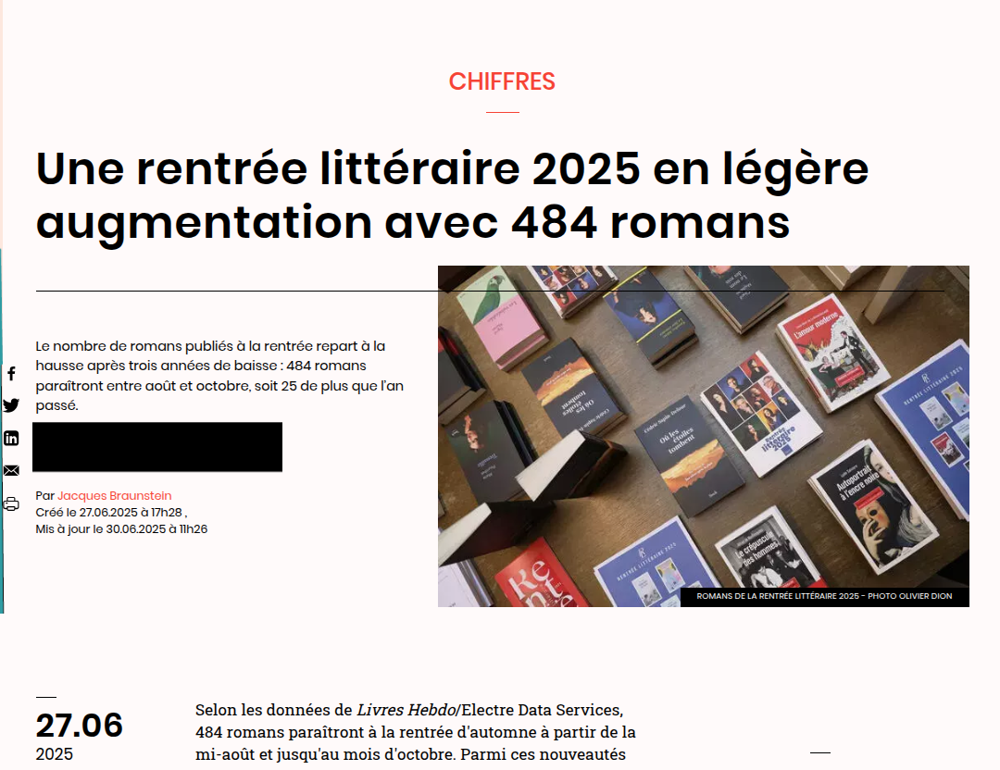<!-- .element: style="width:45%;float:right;margin-right:-1em;" -->

===

rentrée littéraire en chiffres.

La rentrée littéraire est marquée par la publication de 461 nouveaux romans. C'est une vingtaine de moins que l'an dernier, avec 484 titres entre août et octobre, selon le comptage de Livres Hebdo. Il s'agit d'une légère baisse qui s'inscrit dans une tendance de fond sur dix ans, mais un niveau resté globalement stable sur cinq ans. La baisse est surtout imputable à une diminution du côté des romans étrangers, pour des raisons dont on reparlera. 

Est-ce que cela vous paraît beaucoup ? 

344 romans francophones (niveau identique à 2025)

117 romans traduits, contre 140 en 2025 — c'est là que se concentre presque toute la baisse (environ -16 %), les éditeurs étant plus prudents sur des traductions plus coûteuses.

La rentrée comprend ses stars attendues au tournant pour la liste des prix littéraires : 
- Philippe Jaenada (*L'Inconnue du quai de Javel* chez Flammarion), 
- Sonia Devillers (*Le Fabuleux Piano*, ), 
- François-Henri Désérable (*Le Palais*), 
- Ananda Devi (*Chronique d'un royaume perdu*), 
- Philippe Besson (*La Première Phrase du premier livre*) 
- Jean-Philippe Toussaint (*La Hantise*, chez Minuit)

Mais aussi ses inconnus, avec 68 premiers romans, contre 73 en 2025.

Cela étant dit, il est à noter que les libraires grognent depuis longtemps sur cet embouteillage de la rentrée, qui selon eux pénalisent le marché et les auteurs. L'événement "rentrée littéraire", qui a tendance à invisibiliser sous la masse les ouvrages, est régulièrement décrié.

§§§§§§§§§§§§§§§§§§§§§§§§§§§§§§§§§§§§§§§§§§§§§

## Les tendances littéraires de la rentrée 
Entre grand retour de la fiction, histoires de la violence, performances éditoriales

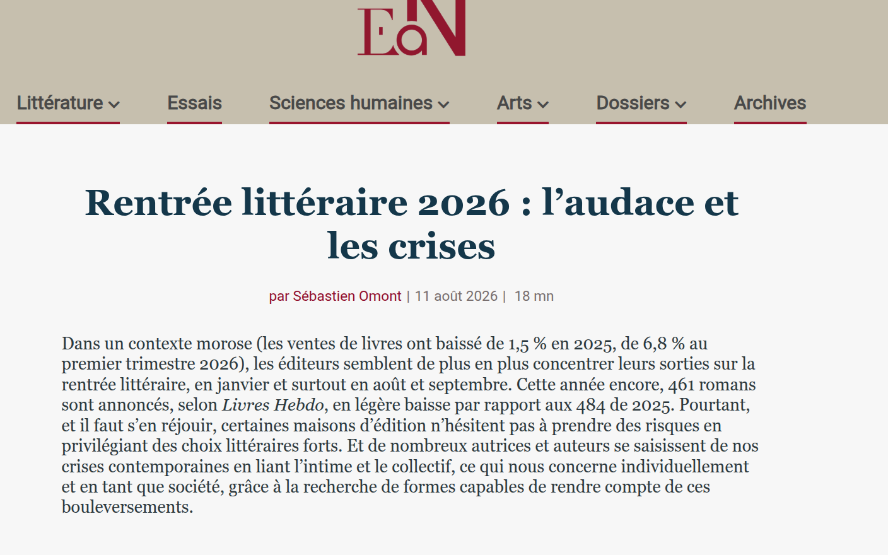<!-- .element: style="width:45%;float:right;margin-right:-1em;" -->

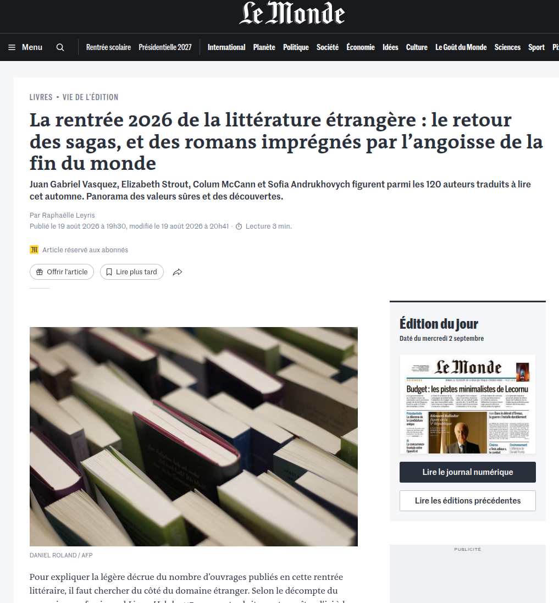<!-- .element: style="width:45%;float:left;margin-left:-1em;" -->

===

Plusieurs grandes tendances, même si avec tous ces titres on a qd même de la diversité, heureusement. 

§§§§§§§§§§§§§§§§§§§§§§§§§§§§§§§§§§§§§§§§§§§§§

## Le retour en grâce de la fiction

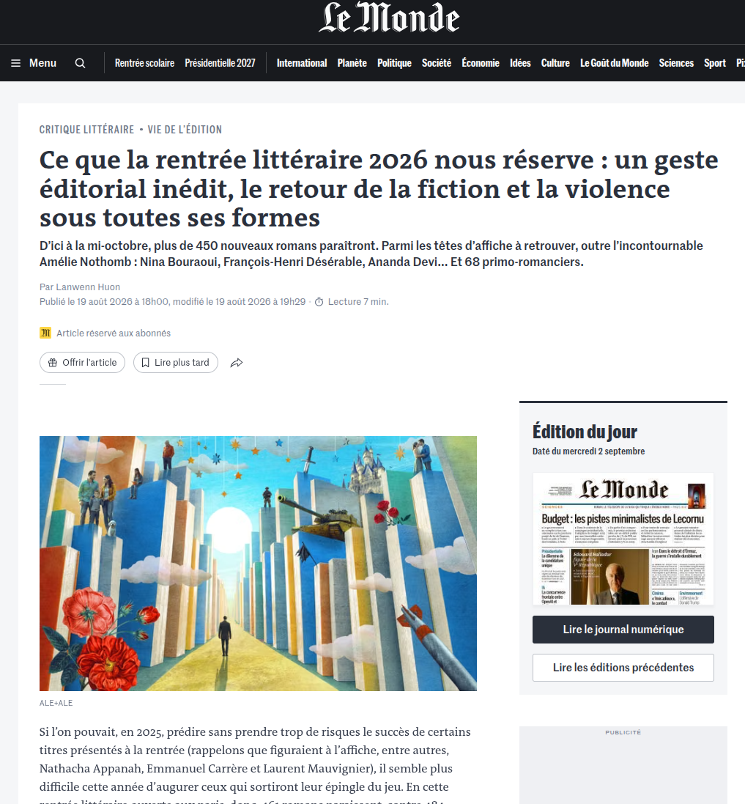<!-- .element: style="width:45%;float:right;margin-right:-1em;" -->

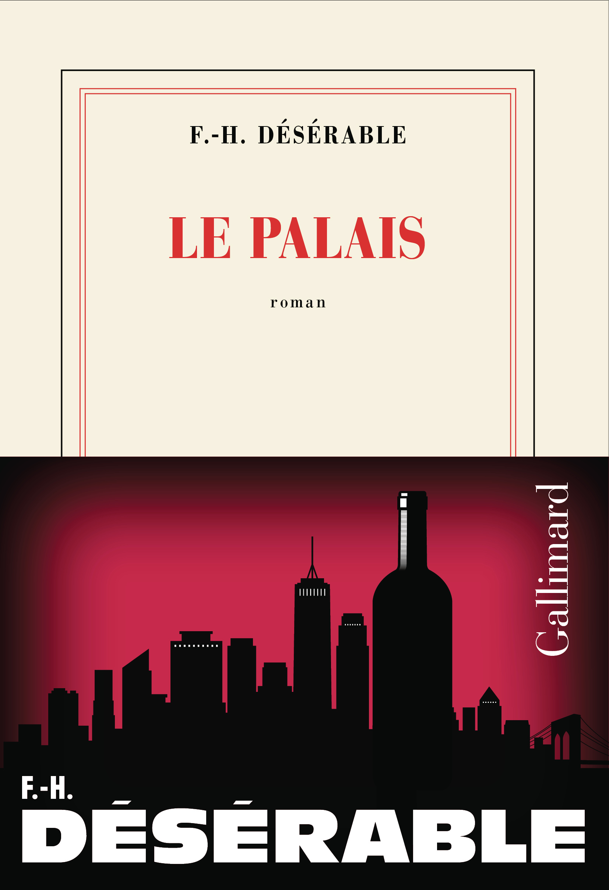<!-- .element: style="width:35%;float:left;margin-left:-1em;" -->

===

- le retour de la fiction, après des grands titres de l'an passé qui abordaient des histoires de familles (*La maison vide* de Mauvignier, ou encore *Kohlkoze* de Carrère). "Une part nettement plus grande est faite à la fiction. Cela se confirme avec certains des auteurs les plus identifiés de la rentrée comme Ananda Devi, qui déploie une vaste fresque historique et familiale dans sa *Chronique d’un royaume perdu* (Grasset), ou François-Henri Désérable, qui, dans *Le Palais* (Gallimard), imagine les aventures d’un jeune Indien adopté par un couple bourguignon et promis à un grand avenir dans le monde du vin." (Le Monde)

§§§§§§§§§§§§§§§§§§§§§§§§§§§§§§§§§§§§§§§§§§§§§

## Fictions technologiques, SF, et péril IA

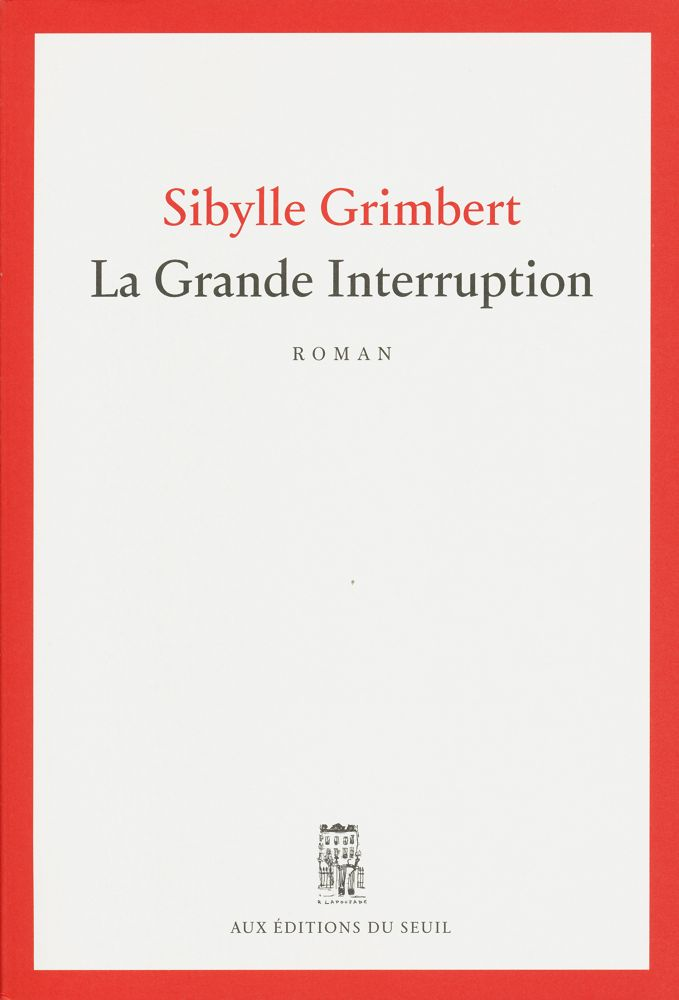<!-- .element: style="width:350px" -->

===

Ces fictions lorgnent même pour certains du côté de la SF, avec une exploration des nouveaux mondes numériques (IA). Ainsi paysages sombres se dessinent sous la forme de dystopies, comme chez Sibylle Grimbert, qui signe l’odyssée d’une IA et d’une fillette dans un univers postapocalyptique (La Grande Interruption, Seuil).

§§§§§§§§§§§§§§§§§§§§§§§§§§§§§§§§§§§§§§§§§§§§§

## Le récit d'un monde violent

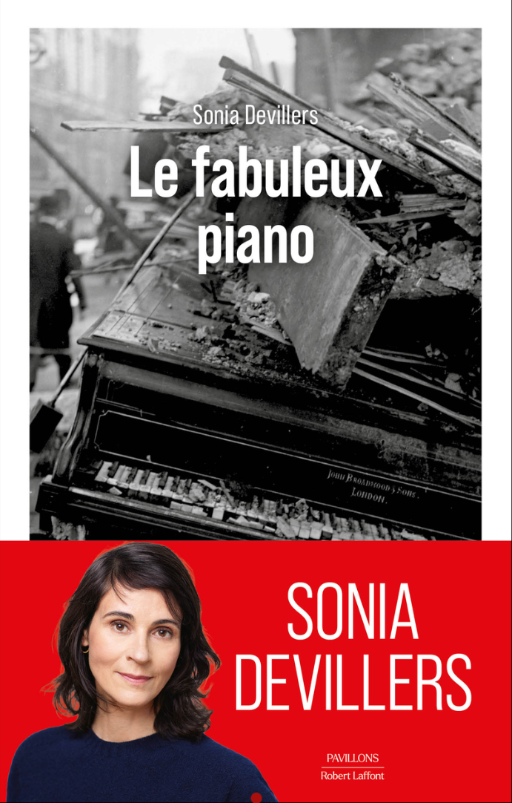<!-- .element: style="width:35%;float:right;margin-right:-1em;" -->

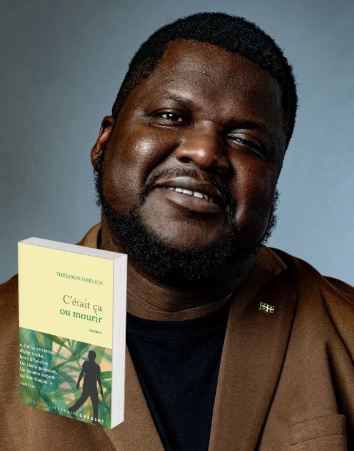<!-- .element: style="width:45%;float:left;margin-left:-1em;" -->

===

- les récits sur la violence, la guerre, traduction d'une situation politique et géopolitique difficile : 

>De manière générale, la violence sous toutes ses formes reste pour les écrivains un terrain d’exploration privilégié. Ainsi, violences sexiste et raciste traversent de diverses manières les livres de Victor Dumiot (Lola va mourir, Calmann-Lévy), de Diaty Diallo (Darya & Dounya, Seuil), d’Abdellah Taïa (Debout dans tes rêves, Julliard), ou encore de Thélyson Orélien *C'était ça ou mourir*. Les guerres d’hier et d’aujourd’hui sont également très présentes. La seconde guerre mondiale constitue la toile de fond d’Un marché noir, de Bérénice Pichat (Les Avrils) ou encore du Fabuleux piano, de Sonia Devillers (éd. Robert Laffont), enquête sur le piano dont la famille Enoch a été spoliée par les nazis, en 1943. 

§§§§§§§§§§§§§§§§§§§§§§§§§§§§§§§§§§§§§§§§§§§§§

## Récits de famille

<!-- .element: style="width:500px" -->

===

Titre de Diakrtitic : La famille en héritage : psychopathologie de la rentrée littéraire

La famille reste un sujet abondamment traité, que ce soit dans des récits de fiction ou de non-fiction. L'an passé, prix Goncourt pour *La Maison Vide*, qui retraçait l'histoire familiale de Mauvigner.

Cette année, on peut par exemple noter la présence d'une néo-romancière, Anna Bogdanoff, *Rappelle-moi, ma belle*.

>Il existe néanmoins à cette prolifération du récit familial une dimension économique et culturelle que la psychopathologie aurait tort de tenir pour extérieure à son objet. L’intime est devenu une valeur, non seulement subjective, mais également narrative, médiatique et marchande. Le sujet contemporain se trouve continuellement sollicité par des dispositifs qui l’invitent à produire le récit de lui-même à travers les réseaux sociaux, les podcasts, les émissions, les entretiens, l’autofiction participent, selon des modalités différentes, d’une même injonction devenue presque imperceptible à force d’être généralisée. (Vincent Hein)

§§§§§§§§§§§§§§§§§§§§§§§§§§§§§§§§§§§§§§§§§§§§§

## La non-fiction, valeur sûre

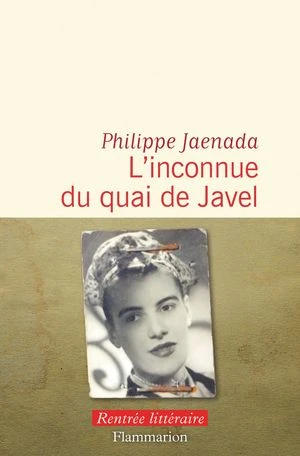

===

À ces tendances, s'ajoutent évidemment les grands mouvements habituels : importance de la littérature du réel ou de non fiction (L'inconnue du Quai Javel de Jaenada).
Tendance journalistique. Enquête.

§§§§§§§§§§§§§§§§§§§§§§§§§§§§§§§§§§§§§§§§§§§§§

## Des autrices et une écriture féministe dynamique

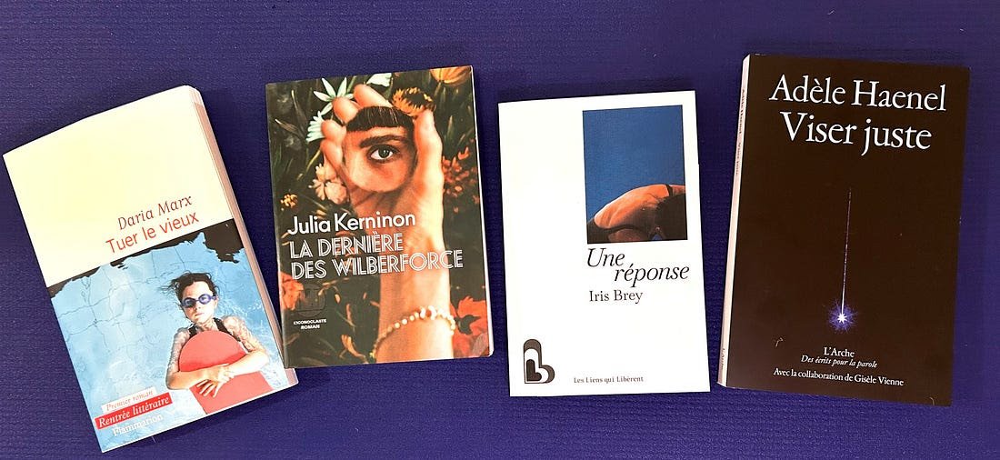

source : photo de Victoire Tuaillon (renverser la table)

<!-- .element: class="source" -->

===

Autrices très présentes, avec des textes sur l'emprise, le féminisme, l'inceste

La star de cette rentrée est sans doute Adèle Haenel.

§§§§§§§§§§§§§§§§§§§§§§§§§§§§§§§§§§§§§§§§§§§§§

## Des risques éditoriaux

===

- plus généralement, des parutions qui traduisent des partis-pris éditoriaux avec des publications risquée, tant du pt de vue formel (Lucie RIco), que du point de vue du fond (avec des sujets difficles abordés), le tout dans un contexte où l'édition tend à se politiser -- on y reviendra.

§§§§§§§§§§§§§§§§§§§§§§§§§§§§§§§§§§§§§§§§§§§§§

## La performance de la rentrée : Antoine Volodine 

>À l’heure où, avec entre autres Freida McFadden (La femme de ménage et ses suites…), un type de littérature stéréotypé écrase les ventes, il est enthousiasmant de voir onze éditeurs prendre le risque économique de faire paraître en même temps onze livres signés d’un nom inconnu du grand public, Infernus Iohannes.

<!-- .element: style="width:45%;float:left;margin-left:-1em; font-size:1.4rem; text-align:justify" -->

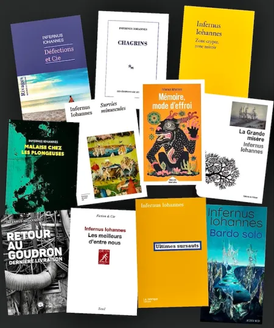<!-- .element: style="width:45%;float:right;margin-right:-1em;" -->

===

la sortie de onze romans chez onze éditeurs, signés par un même auteur, Infernus Iohannes. Derrière ce pseudonyme se cache l'écrivain Antoine Volodine qui entend, avec "cette performance artistique", clore en beauté sa longue carrière littéraire.

Éditorialement, la démarche est logique,puisque tous ces textes sont issus d’un même ouvrage, Retour au goudron, que sa taille rendait difficilement publiable en lui-même. Et littérairement, cette « performance éditoriale » se justifie complètement : son auteur l’a affirmé depuis des années, Retour au goudron est le dernier livre d’une œuvre sans équivalent, essentielle dans la littérature française du XXe et du XXIe siècle, l’édifice post-exotique construit depuis 1985 sous différents hétéronymes par Antoine Volodine.

Ces onze livres, Bardo solo (Actes Sud), Chagrins (Minuit), Défections et Cie (Rivages), Dernière livraison (La Marelle), La Grande Misère (L’Olivier), Les Meilleurs d’entre nous (Seuil), Malaise chez les plongeuses (La Volte), Mémoire, mode d’effroi (Robert Laffont), Ultimes sursauts (La Fabrique), Survies minuscules (Sous-sol) et Zone crypte, zone miroir (Verdier), peuvent parfaitement se lire indépendamment. Chacun, avec ses différences, constitue un tout cohérent offrant une plongée dans l’atmosphère onirique, l’humour du désastre et le sens de la fin propres à Volodine. 

§§§§§§§§§§§§§§§§§§§§§§§§§§§§§§§§§§§§§§§§§§§§§

### 2026 (et avant cela : 2025, 2024, 2023...). Le genre de la rentrée littéraire : romance et *new romance*

>Un chiffre d'affaires qui augmente de 59 % en un an, un volume qui gonfle de 38 % et des tirages initiaux qui s'élèvent à 100 000 exemplaires sans sourciller... Rares sont les progressions aussi retentissantes dans le monde du livre. Fleuron économique, la romance est passée en une poignée d'années seulement de mouton noir du secteur à marché porteur. « Et ce n'est pas près de s'arrêter », se réjouit depuis Strasbourg la libraire de l'Escapade spécialisée dans le genre, Marie Wietzorek, égrenant les titres « lourds » de la rentrée : Valentina - 44 millions de lectures sur Wattpad -, l'intégrale de la série Hadès et Perséphone en collector et la suite de Trouble Maker, déjà 90 000 exemplaires vendus du premier tome. [Livre Hebdo]

<!-- .element: style="width:45%;float:left;margin-left:-1em; font-size:1.2rem; text-align:justify" -->

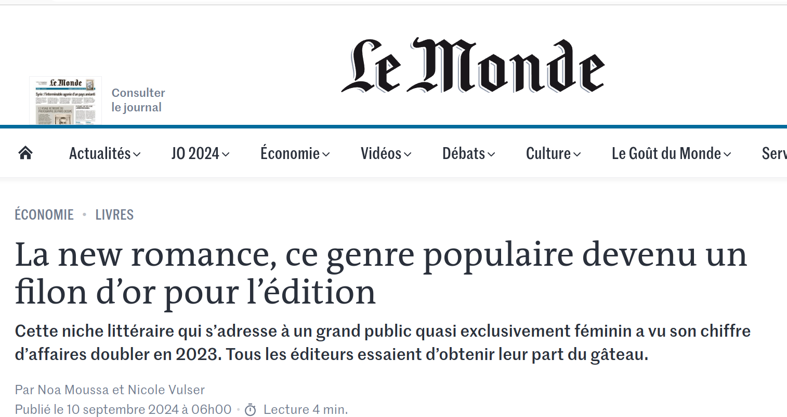<!-- .element: style="width:45%;float:right;margin-right:-1em;" -->

===

§§§§§§§§§§§§§§§§§§§§§§§§§§§§§§§§§§§§§§§§§§§§§

<!-- .element: style="width:45%;float:right;margin-right:-1em;" -->

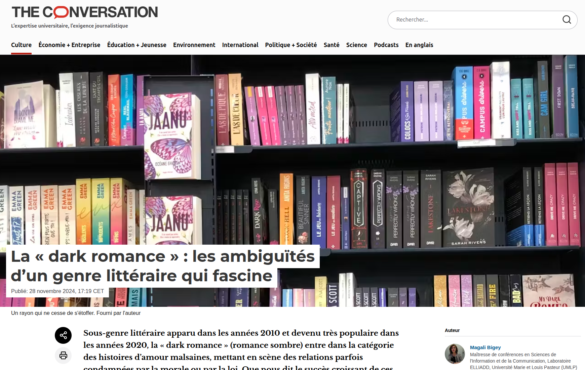<!-- .element: style="width:45%;float:left;margin-right:-1em;" -->

===

Des polémiques : qui de la dimension féministes de ces ouvrages. 

§§§§§§§§§§§§§§§§§§§§§§§§§§§§§§§§§§§§§§§§§§§§§

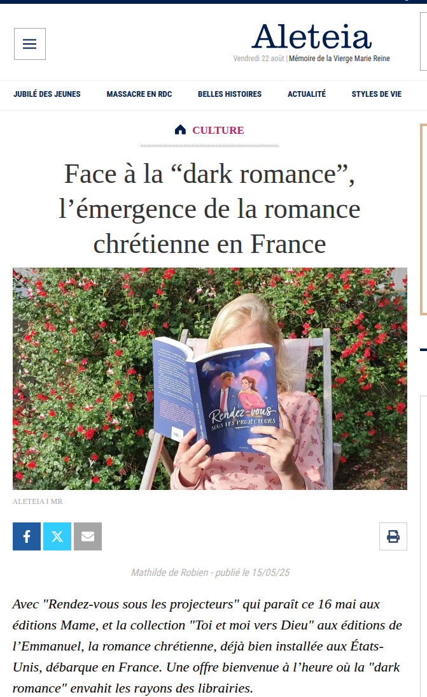<!-- .element: style="width:40%;float:right;margin-right:-1em;" -->

>Bien installée aux États-Unis mais quasiment inconnue en France, la romance chrétienne arrive en librairie à compter du 9 mai 2025 avec « Cœur pur », une nouvelle collection lancée par Mame Éditions (groupe Fleurus). L'éditeur développe en même temps « Cœur à cœur », une ligne de romance light. Ciblant des lectrices de 14 à 18 ans, ces collections ont en commun de promouvoir des « relations saines » et des contenus sans « scène explicite » ni « langage cru », selon l'éditrice Marie Rémond. [Livre Hebdo]

<!-- .element: style="width:45%;float:left;margin-left:-1em; font-size:1.2rem; text-align:justify" -->

===

Un contre-mouvement: la romance chrétienne?

§§§§§§§§§§§§§§§§§§§§§§§§§§§§§§§§§§§§§§§§§§§§§

## Les difficultés de la littérature étrangère

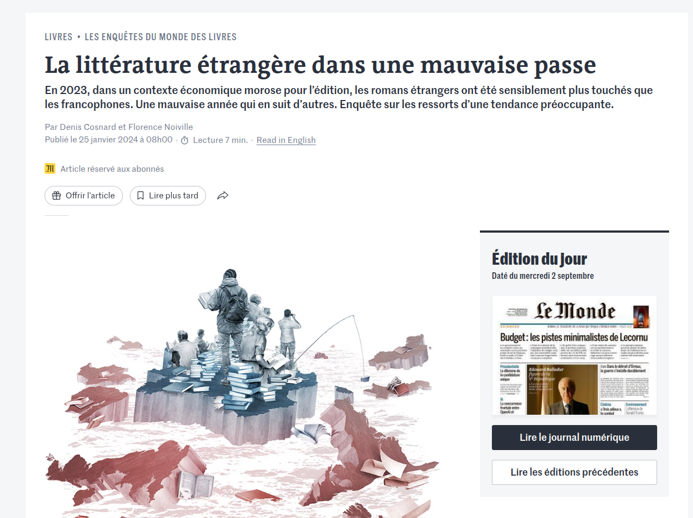<!-- .element: style="width:500px" -->

===

Pour expliquer la légère décrue du nombre d’ouvrages publiés en cette rentrée littéraire, il faut chercher du côté du domaine étranger. Selon le décompte du magazine professionnel Livres Hebdo, 117 romans traduits vont paraître d’ici à la mi-octobre, soit 23 de moins qu’en 2025. Cette baisse s’explique en partie par les mauvais chiffres de vente, depuis plusieurs années, d’un secteur qui, par surcroît, coûte plus cher à produire que le rayon francophone, entre l’acquisition des droits et la traduction des textes. 

§§§§§§§§§§§§§§§§§§§§§§§§§§§§§§§§§§§§§§§§§§§§§

## Actualité économique : un contexte morose

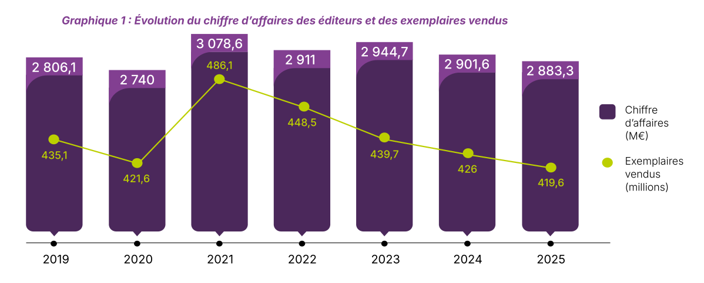

===

La rentrée littéraire, c'est aussi le temps de faire le point sur l'actualité de l'année écoulée. En 2026, cette actualité a été très chaotique. 

Je commence par l'actu économique. Chiffre d'affaires des éditeurs en 2025 : 2 883,3 M€, contre 2 901,6 M€ en 2024 — un recul modéré selon le Syndicat national de l'édition (SNE), mais qui masque une baisse plus sévère en volume. En gros : le secteur s'en sort pas trop mal parce que le prix du livre a un peu augmenté, mais le nombre de vente a baissé. 

* Librairies : les fermetures ont dépassé les créations en 2025, du jamais vu ; l'Observatoire du Syndicat de la librairie française (panel de ~500 librairies) signale tous les indicateurs au rouge sur les 4 premiers mois de 2026, avec une pression particulière sur les beaux livres, la BD, les mangas et les ouvrages pratiques

* Grandes enseignes : certaines traversent des difficultés financières marquées, comme Gibert

* Librairies rurales : maillage culturel important mais rentabilité faible, logistique fragile, rémunérations sacrifiées (étude Fill/CNL)

* Seul segment en croissance nette : le thriller/poche, porté notamment par le phénomène Freida McFadden

§§§§§§§§§§§§§§§§§§§§§§§§§§§§§§§§§§§§§§§§§§§§§

### Polémique : taxer le livre d'occasion ?

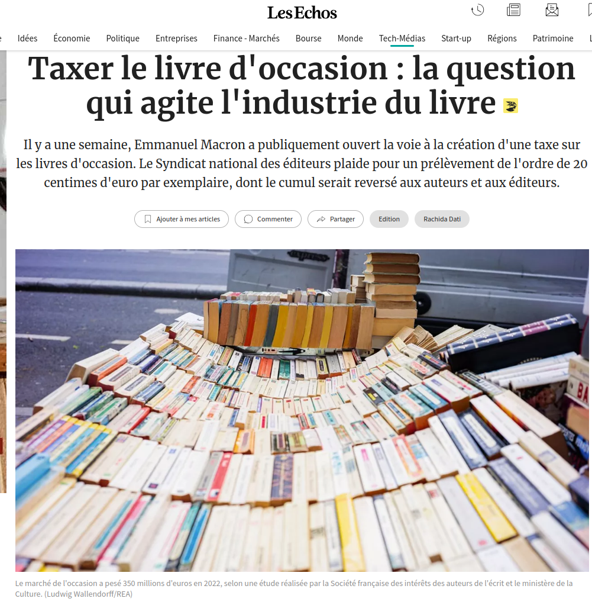<!-- .element: style="width:45%;float:left;margin-right:-1em;" -->

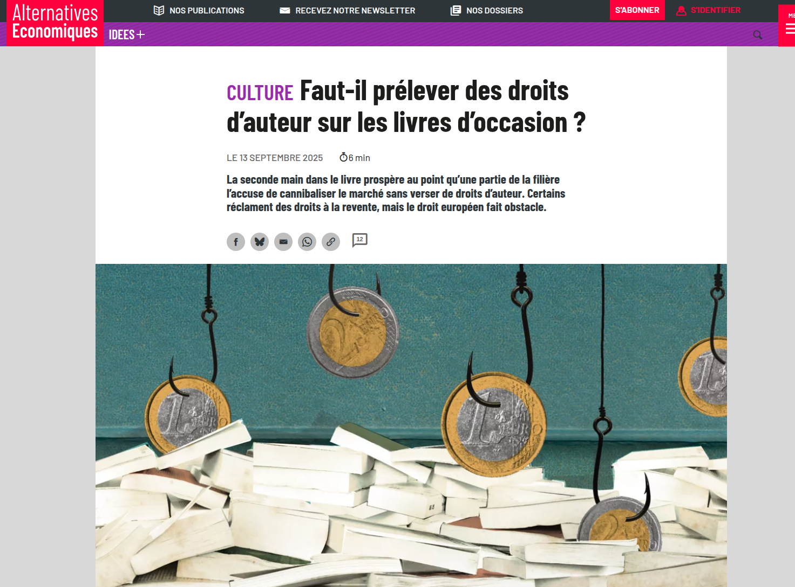<!-- .element: style="width:45%;float:right;margin-right:-1em;" -->

===

La seconde main dans le livre prospère au point qu’une partie de la filière l’accuse de cannibaliser le marché sans verser de droits d’auteur. Certains réclament des droits à la revente, mais le droit européen fait obstacle.

§§§§§§§§§§§§§§§§§§§§§§§§§§§§§§§§§§§§§§§§§§§§§

## Actualité politique : l'indépendance en question

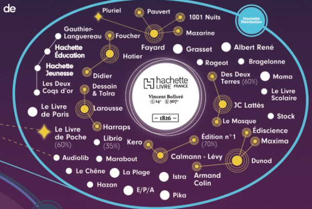<!-- .element: style="width:45%;float:left;margin-right:-1em;" -->

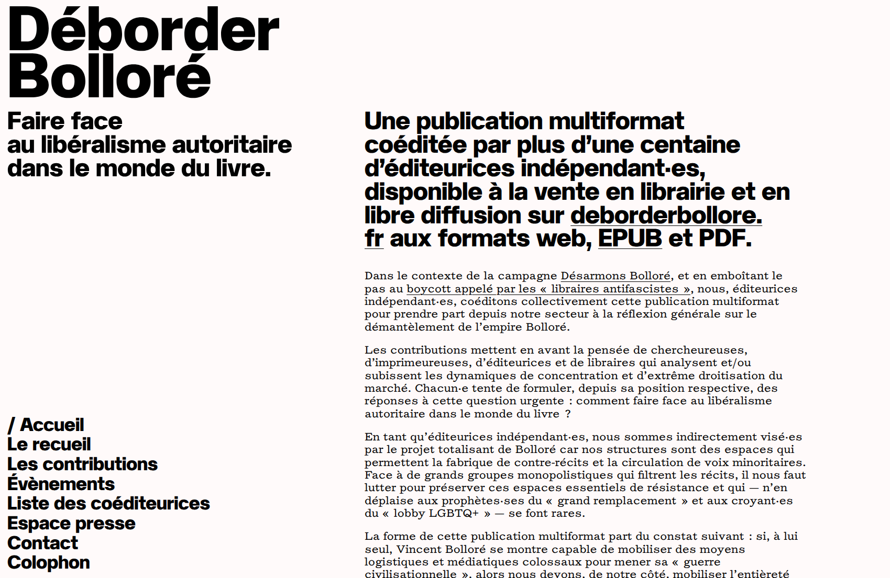<!-- .element: style="width:45%;float:right;margin-right:-1em;" -->

====

L'histoire de l'édition est indissociable d'une histoire de la Concentration éditoriale, laquelle est aussi une concentration économique, qui a fait de plus en plus planer le doute sur la liberté éditoriale et la ligne édito de certaines maisons affiliées.

Depuis 3 ans maintenant, la concentration éditoriale a pris une nouvelle dimension avec l'acquisition de Hachette Livre, un grand groupe (on reviendra là-dessus).

Bolloré contrôle Hachette Livre, numéro un français de l'édition (3 001 M€ de chiffre d'affaires en 2025, n°1 en France, n°2 au Royaume-Uni, plus de 200 marques éditoriales publiant environ 15 000 nouveautés par an), qui inclut notamment :

- Grasset — au cœur de l'affaire Nora
- Fayard
- Larousse

La tension monte entre ces grands groupes, en particulier Hachette, et les indépendants. 
*DÉborder Bollorer* = Recueil collectif paru en juin 2025, coédité par plus d'une centaine de structures d'édition indépendantes, né dans le sillage de la campagne « Désarmer Bolloré » et du boycott appelé par les « libraires antifascistes »

Objectif affiché : penser une résistance au « libéralisme autoritaire » dans la chaîne du livre face à la concentration des groupes éditoriaux-médiatiques. Diffusé notamment lors du Festival du Livre de Paris comme « parole subversive » distribuée en marge de l'événement officiel. 

§§§§§§§§§§§§§§§§§§§§§§§§§§§§§§§§§§§§§§§§§§§§§

### Polémique : L'affaire Nora

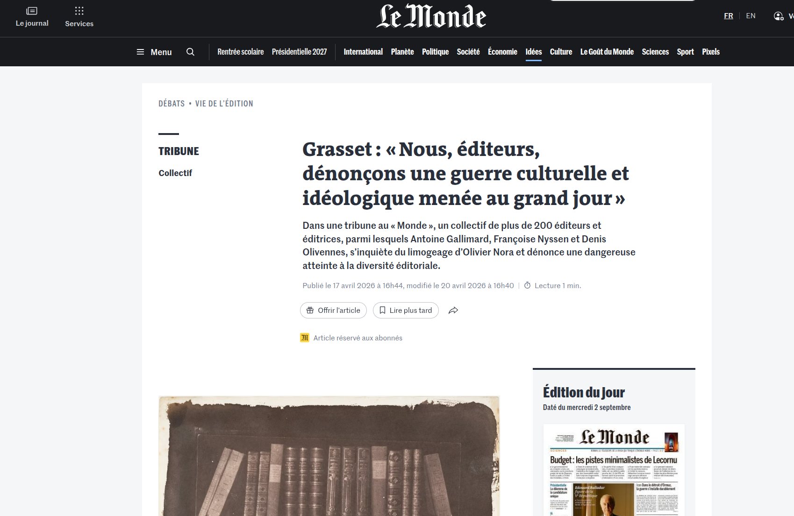<!-- .element: style="width:45%;float:left;margin-right:-1em;" -->

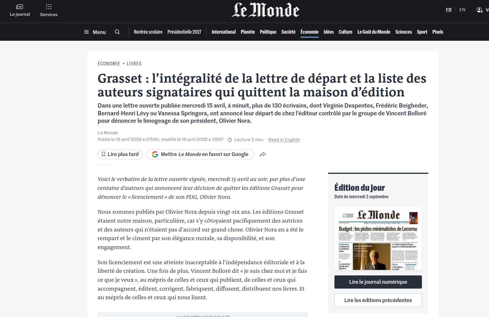<!-- .element: style="width:45%;float:right;margin-right:-1em;" -->

===

14-15 avril 2026 : Olivier Nora, patron historique de Grasset, est limogé sur ordre direct de Vincent Bolloré. Selon la journaliste Sophie des Déserts, Bolloré aurait lâché à ses employés : « J'en peux plus de ce con, virez-le-moi »

Officiellement, deux versions circulent : un désaccord sur la date de publication du livre de Boualem Sansal (Nora voulait la fin d'année, Hachette exigeait le 6 juin), et le refus de Nora de publier un ouvrage de Nicolas Diat — éditeur par ailleurs de Jordan Bardella chez Fayard, ce qui suggère une pression directement liée à des enjeux idéologiques.

Par le passé, il y avait eu déjà des dissensions avec d'autres éditeurs, mais des accords à l’amiable avaient été conclus entre le groupe et Arnaud Nourry, ex-PDG d’Hachette Livre, ou encore avec Sophie de Closets, l’ancienne patronne de Fayard (filiale d’Hachette), tous deux partis en désaccord avec la stratégie de Vincent Bolloré.

On reviendra sur cette polémique, pour évoquer la notion d'indépendance éditoriale, mais pointons du doigts deux grands éléments : 
- hémorragie des écrivains (mettre ok Despentes et BHL, c'est fou)
- prise de position des éditeurs indé

§§§§§§§§§§§§§§§§§§§§§§§§§§§§§§§§§§§§§§§§§§§§§

### Les indépendants en lutte 

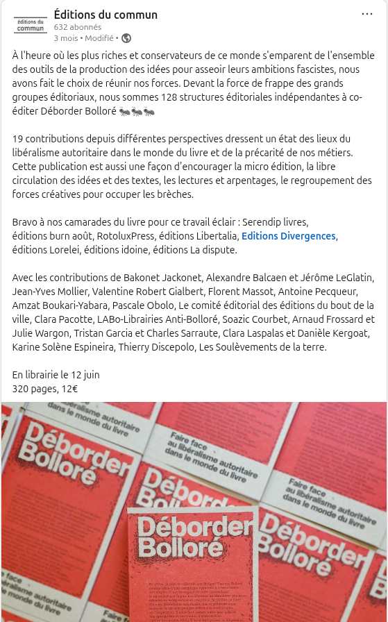<!-- .element: style="width:300px" --> 

===

Face à la concentration de l’édition dans les mains d’acteurs conservateurs, un réseau d’éditeurs et libraires indépendants fourmille et pique autour du slogan « Déborder Bolloré ».

Le projet est simple : un recueil collectif, coédité par une cinquantaine d'éditeurs et éditrices indépendants, prévu en librairies en juin 2025. Une action qui s’inscrit dans la campagne Désarmons Bolloré et en soutien au boycott lancé par les « libraires antifascistes », cet ouvrage apporte sa pierre dans une réflexion sur le démantèlement de l'empire Bolloré.

Déborder Bolloré, ce sont 320 pages, un gros volume grisé puisqu’imprimé sur papier recyclé, et les petites fourmis actives et urticantes qui animent ses pages représentent la masse innombrable des éditeurs et éditrices indépendantes, libraires, imprimeurs et imprimeuses qui ont l’idée de se regrouper pour conscientiser le public francophone : il y a urgence à défendre une édition indépendante, des écritures et pratiques diversifiées dans un secteur du livre désormais hyperconcentré économiquement, qui connaît par ailleurs une droitisation, un conservatisme assumé, catholique, blanc, cisgenre que ce collectif entend questionner, et, de ce fait, déborder.

§§§§§§§§§§§§§§§§§§§§§§§§§§§§§§§§§§§§§§§§§§§§§

## 2020-24 : La tendance grandissante de l'auto-édition

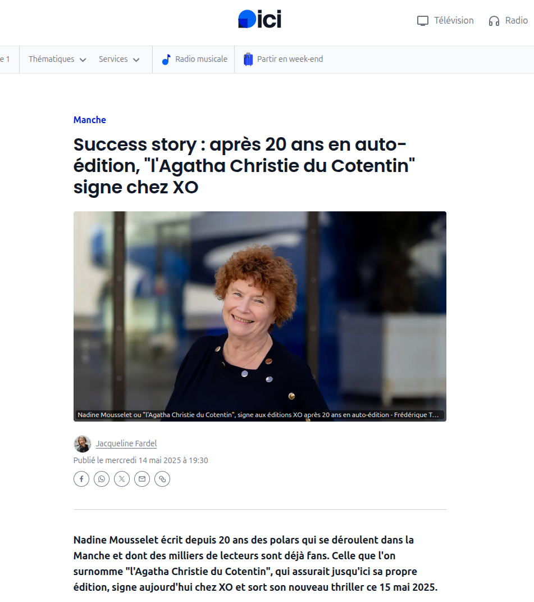<!-- .element: style="width:45%;float:right;margin-right:-1em;" -->

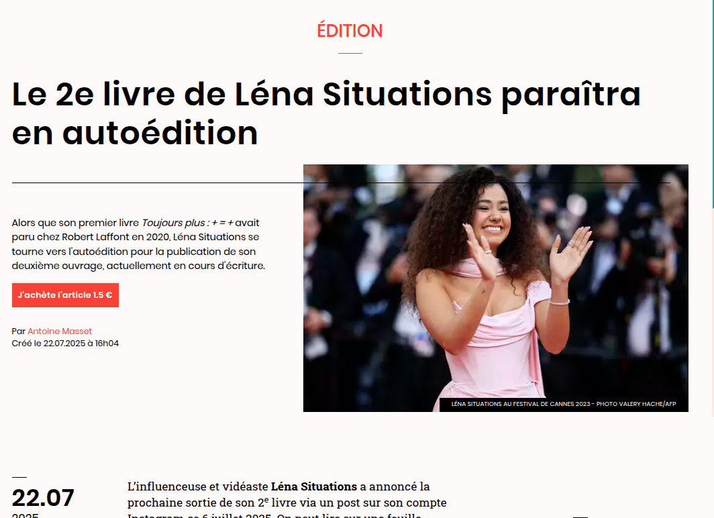<!-- .element: style="width:45%;float:left;margin-right:-1em;" -->

§§§§§§§§§§§§§§§§§§§§§§§§§§§§§§§§§§§§§§§§§§§§§

### Polémiques : indépendance ou égoïsme des auteurs ? 

>Coup sur coup, plusieurs personnalités ou auteurs de best-sellers succombent aux sirènes de l’autoédition ou de l’autopublication. Ils se passent des services d’une maison d’édition pour fonder la leur, ou parient – volontairement, ou bien contraints et forcés – sur une indépendance éditoriale. Coïncidence fortuite ? En tout cas, l’arrivée de telles signatures, synonymes de centaines de milliers de ventes, bouleverse la donne et devrait inciter les maisons d’édition à se repenser. [*Le Monde, nov. 2021*]

<!-- .element: style="width:45%;float:left;margin-left:-1em; font-size:1.4rem; text-align:justify" -->

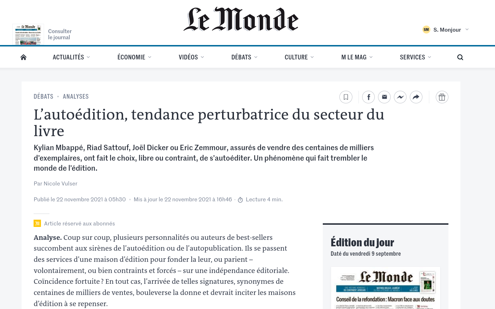<!-- .element: style="width:45%;float:right;margin-right:-1em;" -->

===

>Coup sur coup, plusieurs personnalités ou auteurs de best-sellers succombent aux sirènes de l’autoédition ou de l’autopublication. Ils se passent des services d’une maison d’édition pour fonder la leur, ou parient – volontairement, ou bien contraints et forcés – sur une indépendance éditoriale. Coïncidence fortuite ? En tout cas, l’arrivée de telles signatures, synonymes de centaines de milliers de ventes, bouleverse la donne et devrait inciter les maisons d’édition à se repenser.

Ces deux dernières années, Kylian Mbappé, Riad Sattouf (Le Jeune Acteur 1), Joël Dicker ou Eric Zemmour se sont auto-édités, en créant généralement leur propre label pour publier leur texte.

Une volonté  d'indépendance qui s'explique par de nombreux facteurs, mais qui traduisent un sentiment de plus en plus partagé par la communauté des écrivains.

§§§§§§§§§§§§§§§§§§§§§§§§§§§§§§§§§§§§§§§§§§§§§

## Actualité technologique : les révolutions numériques

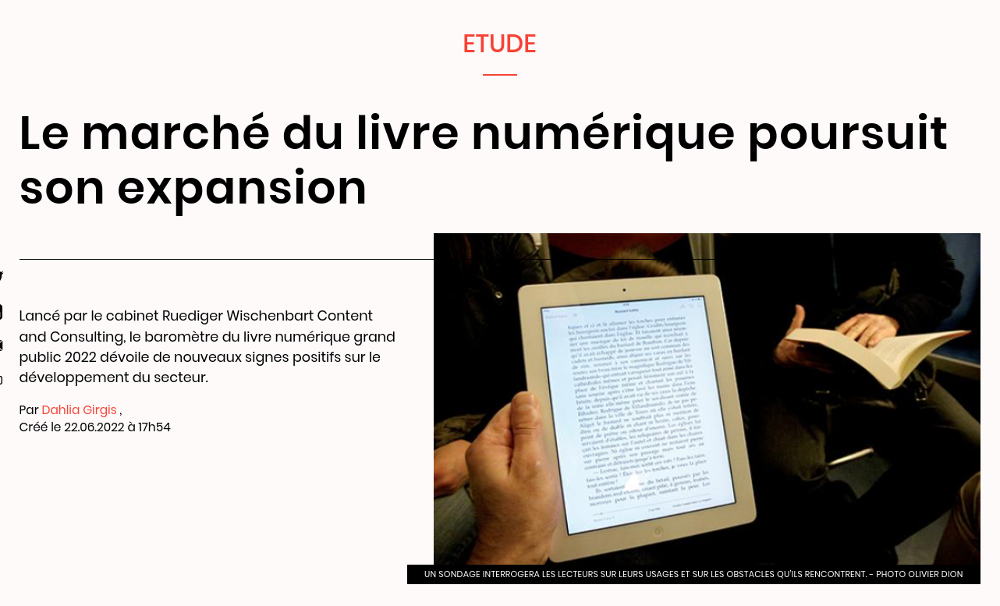

<!-- .element: style="width:45%;float:left;margin-left:-1em; font-size:1.4rem; text-align:justify" -->

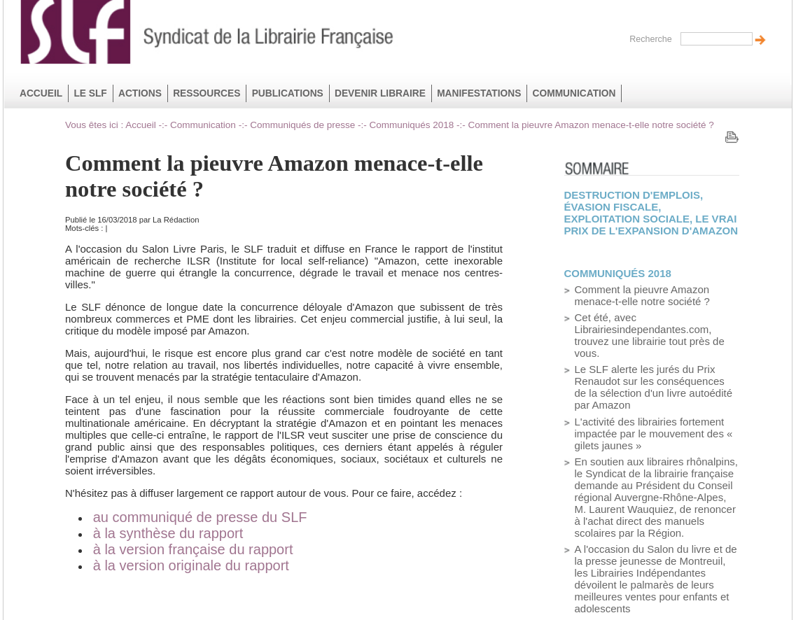

<!-- .element: style="width:45%;float:right;margin-left:-1em; font-size:1.4rem; text-align:justify" -->

===

Pdt ce temps, le livre numérique gagne du terrain...

Avec des inquiétudes légitimes.
Concurrence pour les éditeurs, fausse indépendance pour les écrivains, qui croient trouver une alternative finalement loin d'être parfaite.

§§§§§§§§§§§§§§§§§§§§§§§§§§§§§§§§§§§§§§§§§§§§§

### Polémique : pour ou contre les IAG ? 

>L’intelligence artificielle constitue également une opportunité pour l’édition. L’assistance à des tâches de production ou encore l’amélioration de la découvrabilité des fonds, sont autant de pistes explorées activement au sein de notre métier. [Communiqué du SNE]

<!-- .element: style="width:45%;float:left;margin-left:-1em; font-size:1.4rem; text-align:justify" -->

<!-- .element: style="width:45%;float:right;margin-right:-1em;" -->

===

On reparlera de l'IA dans les deux cours, y compris en communication.

§§§§§§§§§§§§§§§§§§§§§§§§§§§§§§§§§§§§§§§§§§§§§

## Approche du cours : renverser la problématique...
Le système éditorial moderne s'appuie sur un modèle (économique, juridique, institutionnel etc.) qui a atteint ses limites plutôt qu'il n'est menacé par les phénomènes techniques et culturels contemporains. Affirmer qu'il existe des **modèles** éditoriaux revient à désacraliser l'édition, et engage à la "virtualiser" : revenir à une définition conceptuelle avant d'en envisager les déclinaisons pratiques.

<!-- .element: style="font-size:1.7rem; text-align:justify" -->

#### Poser des questions simples... apporter des réponses documentées, conceptuelles et nuancées

===

Comment va-t-on traiter cette actualité ? 

Quand on pose toutes ces questions plutôt complexes, pour certaines déprimantes, quand on envisage le champ de bataille de l'édition contemporaine, ses défis, ses enjeux, ses problèmes, on est parfois tentés de dire c'est tout un modèle qui est menacé.

Et de fait, il s'agit d'un discours que vous entendrez souvent dans votre carrière. 

Le parti pris de ce cours vise à couper court à cette tendance qui consiste à opposer le monde éditorial ancien (généralement présenté sous son meilleur jour, comme un modèle vertueux garant d'une qualité littéraire, de la défense de grands auteurs), au monde contemporain et nouveaux (un monde où tout se perd, les valeurs culturelles, littéraires etc.).

Dans ce cours, nous allons chercher à dépasser cette querelle générationnelle, cette querelle technologique, pour prendre un peu de recul et réfléchir à redéfinir l'édition à travers ses fonctions fondamentales.

En effet, il semble que le système éditorial moderne s'appuie sur un modèle (économique, juridique, institutionnel etc.) qui a atteint ses limites plutôt qu'il n'est menacé par les phénomènes techniques et culturels contemporains. Affirmer qu'il existe des **modèles** éditoriaux revient à désacraliser l'édition, et engage à la "virtualiser" : revenir à une définition conceptuelle avant d'en envisager les déclinaisons pratiques.

Autrement dit, plutôt que d’envisager l’“édition” comme un secteur en crise, il s’agira de questionner ensemble les enjeux de la fonction éditoriale, indépendamment de l’émergence, finalement très récente, de notre modèle éditorial moderne aujourd’hui remis en question par la culture numérique. Ce fil rouge nous conduira à questionner les concepts-clés de l’édition, et les missions des principaux métiers qui y sont associés : qu’est-ce qu’un livre ? Qu’est-ce qu’un auteur ? Qu’est-ce qu’un éditeur ? Que signifie “publier” ?

Je vais, à chaque cours jusqu'à la fin du semestre, poser des questions très simples, pour y apporter des réponses compliquée. Mais non ! Y apporter des réponses nuancées, et conceptualisées => ojbectif du cours = être capable de conceptualiser. DÉpasser la discussion de comptoir. 

Il s'agira de :
- partir d'une question d'actualité
- proposer une étude historique ou archéologique pour comprendre pourquoi et comment cette question d'actualité a été amenée à se poser
- proposer des exemples, des cas d'études

§§§§§§§§§§§§§§§§§§§§§§§§§§§§§§§§§§§§§§§§§§§§§

## Axe 1 : déconstruire l'édition

* Que veut dire éditer ? *La fonction éditoriale*
* Qui sont les acteurs de la "chaîne du livre"? *L'énonciation éditoriale*
* Qui dirige le monde de l'édition ? *Politiques éditoriales*
* L'édition est-elle rentable ? *Péréquation, best-sellerisation, financements alternatifs*

<!-- .element: style="font-size:1.5rem; text-align:justify" -->

===

§§§§§§§§§§§§§§§§§§§§§§§§§§§§§§§§§§§§§§§§§§§§§

## Axe 2 : polémiques éditoriales contemporaines

* Peut-on tout (re)publier ? *Sensitivity readers, récriture, censure*
* Faut-il repenser le statut de l'auteur ? *Professionnalisation et précarisation de l'artiste-auteur au XXI^e^ siècle*
* A-t-on encore besoin des éditeurs ? *Auto-édition et désintermédiation*
* Le livre est-il écologique ? *Permapublishing*

<!-- .element: style="font-size:1.5rem; text-align:justify" -->

===

§§§§§§§§§§§§§§§§§§§§§§§§§§§§§§§§§§§§§§§§§§§§§

## Axe 3 : mutations technologiques en édition
* Les plateformes numériques vont-elles remplacer les éditeurs ? *Ré-intermédiation & Plateformisation*
* Pourquoi la révolution numérique n'a-t-elle pas (vraiment) eu lieu ? *Remédiation*
* Le livre imprimé est-il une fin (littéraire) en soi ? *Publication, éditorialisation*
* L'IA va-t-elle remplacer les auteurs et les éditeurs ? *llm, création, expérimentation*

<!-- .element: style="font-size:1.5rem; text-align:justify" -->

===

§§§§§§§§§§§§§§§§§§§§§§§§§§§§§§§§§§§§§§§§§§§§§

## Évaluation
* Partiel en janvier : épreuve d'1h30
* Lecture d'un article de presse
* Questions de compréhension, d'analyse critique de l'article

===

