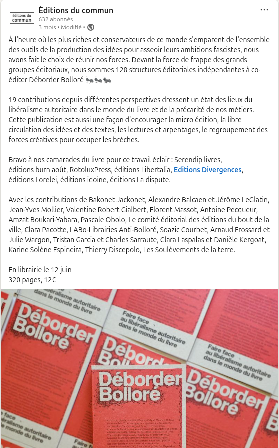
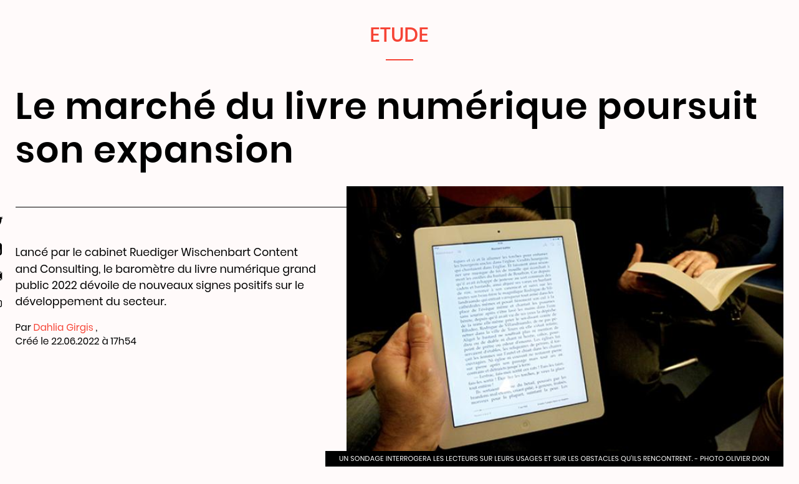

## Problématiques de l'édition contemporaine

 *Connaissance des métiers de l’édition*
 2025-2026
 Servanne Monjour (servanne.monjour@sorbonne-universite.fr)

<!-- .element: style="font-size:1.7rem; text-align:center" -->

 <!-- .element: class="logo" -->

===

Le cours a pour titre "connaissance des métiers de l'édition". Titre assez mal choisi car, en vérité, des "métiers" de l'édition, il en existe des dizaines, plus ou moins visibles ou invisibilisés, tout le long de la chaîne de production du livre : 
- écrivain, auteur, éditeur, agent littéraire, préparateur de copie, designeur, maquettiste, typographe, imprimeur, juriste spécialiste des droits, distributeur, diffuseur, libraire et j'en passe. 

Ce cours pourrait donc rapidement ressembler à un liste à la manière de Georges Perec, ce qui serait peut-être drôle, mais au final lassant. 

Une autre expression, qui recouvre en partie mais pas complètement la précédente, serait "métiers du livre". Mais c'est un peu le même problème : un livre, c'est quoi ? 
- objet matériel : le codex, qui aujourd'hui connait de grandes mutations avec les technos numériques
- un support pour des textes et des images -- concurrence d'autres formats (podcast ou livre audio)
- un objet culturel et symbolique -- le livre incarne une certaine conception de la culture, de la sagesse, du savoir... il n'y a qu'à voir la portée symbolique d'un autodafé pour comprendre
- un produit -- produit culturel certes, mais produit qd même, ET à ce titre un objet industrialisé. DE ce pt de vue, pris dans une économie.

%%%%%%%%%%%%%%%%%%%%%%%%%%%%%%%%%%%%%%%%%%%%%

### Quelques questions pour commencer... 

<!-- .element: style="width:200px" --> 

§§§§§§§§§§§§§§§§§§§§§§§§§§§§§§§§§§§§§§§§§§§§§

### Revue de presse du secteur éditorial 2025
* Section ["Vie de l'édition"](https://www.lemonde.fr/vie-de-l-edition/), *Le Monde*
* *Le 1 des libraires* (en kiosques - cf. le spécial "Rentrée littéraire")
* [ActuaLitté](https://actualitte.com/)
* [Éditions actu](https://editions-actu.org/)
* [LivresHebdo](https://www.livreshebdo.fr/articles)
* Etc. 

<!-- .element: style="font-size:1.7rem; text-align:justify" -->

===

Ce que je vous propose, c'est d'opérer ensemble un petit tour d'horizon de la presse spécialisée dans l'édition ces derniers mois et/ou années, afin de comprendre les enjeux du secteur. 

Cette "revue de presse" est d'ailleurs un exercice que je vous conseille d'opérer régulièrement, afin de vous tenir au courant des tendances du moment, mais également parce que c'est là dessus que portera votre évaluation : je vous proposerai un article de presse à analyser afin de le conceptualiser. Vous devrez me démontrer votre capacité à mobiliser des concepts théoriques : théorie littéraire, théorie des médias, théorie de l'histoire matérielle du livre, afin de problématiser les informations de la presse écrite et de les discuter de manière critique.

Un article de presse se fait le reflet de l'actualité, mais ce n'est pas un texte critique. En tant que spécialistes de l'édition -- et plus largement des industries culturelles -- je vous demanderai d'être capables de prendre un recul critique sur ces informations. 

Tout au long de ce semestre, nous allons donc nous préparer à exercer ce recul critique.

§§§§§§§§§§§§§§§§§§§§§§§§§§§§§§§§§§§§§§§§§§§§§

### Restez informé.es grâce aux réseaux !

* Médias culture & littérature (LinkedIN, Instagram, X, TikTok)
* Maisons d'édition et éditeurs (LinkedIN, Instagram, X, TikTok)
* [SNE-compte LinkedIn](https://www.linkedin.com/company/syndicat-national-de-l'%C3%A9dition/posts/?feedView=all)
* [SGDL-compte LinkedIn](https://www.linkedin.com/company/soci-t-des-gens-de-lettres/posts/?feedView=all)
* [Ligue des auteurs professionnels](https://www.linkedin.com/company/la-ligue-des-auteurs-pros/posts/?feedView=all)
* Etc. 

<!-- .element: style="font-size:1.7rem; text-align:justify" -->

===

Pour vous informer, je vous conseille également de vous abonner à des comptes linkedIn. Outre les médias cités plus tôt, vous pouvez vous abonner aux pages des maisons d'éditions elles-mêmes, désormais elles sont toutes ou presque sur LinkedIn, mais également  : 
- le SNE
- la SGDL
- Ligue des auteurs pro (Stéphanie LeCam)

Une manière de voir aussi les débats qui agitent la profession : important de comprendre les enjeux. 

Dans cette revue de presse, je vais venir viter les actualités de ces 2-3 dernières années qui m'ont semblé les plus marquantes, à titre personnel, et je vous proposerai une synthèse par la suite des problématiques ou questionnements que l'ont peut en tirer. Dans ces prochaines semaines, il s'agira trouver des éléments de conceptuels pour nous aider à traiter ces problématiques. 

§§§§§§§§§§§§§§§§§§§§§§§§§§§§§§§§§§§§§§§§§§§§§

#### Bonne rentrée... littéraire !

* 484 romans paraîtront à la rentrée d'automne à partir de la mi-août et jusqu'au mois d'octobre
* Une hausse des parutions après trois années successives de baisse des titres
* 344 titres en langue française, parmi lesquels 73 premiers romans
* Publication d'auteurs reconnus : Emmanuel Carrère, Anne Berest, Maria Pourchet, Amélie Nothomb, Laurent Mauvignier, etc.
* Des éditeurs prudents (baisse de 19% des nouveautés), après un début d'année 2025 jugé "morose"

<!-- .element: style="width:45%;float:left;margin-left:-1em; font-size:1.4rem; text-align:justify" -->

<!-- .element: style="width:45%;float:right;margin-right:-1em;" -->

===

rentrée littéraire 

Le nombre de romans de la rentrée littéraire repart à la hausse en 2025, avec 484 titres entre août et octobre, selon le comptage de Livres Hebdo.

Le mensuel de l'édition, qui tient les comptes depuis les années 1980, indique dans son numéro "spécial rentrée littéraire" paru jeudi 26 juin que ce total avait baissé trois années de suite, jusqu'à tomber à 459 l'an dernier.

Selon les chiffres annuels du Syndicat national de l'édition, les éditeurs français ont publié 19% de nouveautés en moins en 2024 qu'en 2019 (tous genres confondus, pas uniquement la littérature).

La fébrilité est palpable chez les éditeurs, les résultats du premier semestre s’étant révélés décevants. Entre janvier et mars, l’Observatoire de la librairie a constaté une baisse de 4,6 % en volume chez les libraires indépendants, par rapport à la même période de 2024 (source : Les Echos). Certes, le recul est moins important (– 1 %) si l’on inclut les grandes enseignes, comme la Fnac ou Cultura, où quelques titres de littérature populaire tirent les ventes. Mais, dans l’ensemble, le marché demeure morose, et les maisons d’édition misent sur cette rentrée d’automne pour rattraper un début d’année inquiétant.

Cela étant dit, il est à noter que les libraires grognent depuis longtemps sur cet embouteillage de la rentrée, qui selon eux pénalisent le marché et les auteurs. L'événement "rentrée littéraire", qui a tendance à invisibiliser sous la masse les ouvrages, est régulièrement décrié.

§§§§§§§§§§§§§§§§§§§§§§§§§§§§§§§§§§§§§§§§§§§§§

#### Les tendance de la rentrée : écritures du réel, récits de soi, non-fiction

<!-- .element: style="width:45%;float:right;margin-right:-1em;" -->

<!-- .element: style="width:45%;float:left;margin-left:-1em;" -->

§§§§§§§§§§§§§§§§§§§§§§§§§§§§§§§§§§§§§§§§§§§§§

#### 2025 (et avant cela : 2024, 2023...). Le genre de la rentrée littéraire : romance et *new romance*

>Un chiffre d'affaires qui augmente de 59 % en un an, un volume qui gonfle de 38 % et des tirages initiaux qui s'élèvent à 100 000 exemplaires sans sourciller... Rares sont les progressions aussi retentissantes dans le monde du livre. Fleuron économique, la romance est passée en une poignée d'années seulement de mouton noir du secteur à marché porteur. « Et ce n'est pas près de s'arrêter », se réjouit depuis Strasbourg la libraire de l'Escapade spécialisée dans le genre, Marie Wietzorek, égrenant les titres « lourds » de la rentrée : Valentina - 44 millions de lectures sur Wattpad -, l'intégrale de la série Hadès et Perséphone en collector et la suite de Trouble Maker, déjà 90 000 exemplaires vendus du premier tome. [Livre Hebdo]

<!-- .element: style="width:45%;float:left;margin-left:-1em; font-size:1.2rem; text-align:justify" -->

<!-- .element: style="width:45%;float:right;margin-right:-1em;" -->

===

§§§§§§§§§§§§§§§§§§§§§§§§§§§§§§§§§§§§§§§§§§§§§

<!-- .element: style="width:45%;float:right;margin-right:-1em;" -->

<!-- .element: style="width:45%;float:left;margin-right:-1em;" -->

===

Des polémiques : qui de la dimension féministes de ces ouvrages. 

§§§§§§§§§§§§§§§§§§§§§§§§§§§§§§§§§§§§§§§§§§§§§

<!-- .element: style="width:40%;float:right;margin-right:-1em;" -->

>Bien installée aux États-Unis mais quasiment inconnue en France, la romance chrétienne arrive en librairie à compter du 9 mai 2025 avec « Cœur pur », une nouvelle collection lancée par Mame Éditions (groupe Fleurus). L'éditeur développe en même temps « Cœur à cœur », une ligne de romance light. Ciblant des lectrices de 14 à 18 ans, ces collections ont en commun de promouvoir des « relations saines » et des contenus sans « scène explicite » ni « langage cru », selon l'éditrice Marie Rémond. [Livre Hebdo]

<!-- .element: style="width:45%;float:left;margin-left:-1em; font-size:1.2rem; text-align:justify" -->

===

Un contre-mouvement: la romance chrétienne?

§§§§§§§§§§§§§§§§§§§§§§§§§§§§§§§§§§§§§§§§§§§§§

#### 2020-24 : La tendance grandissante de l'auto-édition

<!-- .element: style="width:45%;float:right;margin-right:-1em;" -->

<!-- .element: style="width:45%;float:left;margin-right:-1em;" -->

§§§§§§§§§§§§§§§§§§§§§§§§§§§§§§§§§§§§§§§§§§§§§

>Coup sur coup, plusieurs personnalités ou auteurs de best-sellers succombent aux sirènes de l’autoédition ou de l’autopublication. Ils se passent des services d’une maison d’édition pour fonder la leur, ou parient – volontairement, ou bien contraints et forcés – sur une indépendance éditoriale. Coïncidence fortuite ? En tout cas, l’arrivée de telles signatures, synonymes de centaines de milliers de ventes, bouleverse la donne et devrait inciter les maisons d’édition à se repenser. [*Le Monde, nov. 2021*]

<!-- .element: style="width:45%;float:left;margin-left:-1em; font-size:1.4rem; text-align:justify" -->

<!-- .element: style="width:45%;float:right;margin-right:-1em;" -->

===

>Coup sur coup, plusieurs personnalités ou auteurs de best-sellers succombent aux sirènes de l’autoédition ou de l’autopublication. Ils se passent des services d’une maison d’édition pour fonder la leur, ou parient – volontairement, ou bien contraints et forcés – sur une indépendance éditoriale. Coïncidence fortuite ? En tout cas, l’arrivée de telles signatures, synonymes de centaines de milliers de ventes, bouleverse la donne et devrait inciter les maisons d’édition à se repenser.

Ces deux dernières années, Kylian Mbappé, Riad Sattouf (Le Jeune Acteur 1), Joël Dicker ou Eric Zemmour se sont auto-édités, en créant généralement leur propre label pour publier leur texte.

Une volonté  d'indépendance qui s'explique par de nombreux facteurs, mais qui traduisent un sentiment de plus en plus partagé par la communauté des écrivains.

§§§§§§§§§§§§§§§§§§§§§§§§§§§§§§§§§§§§§§§§§§§§§

#### Polémique : une droitisation de l'édition ?

<!-- .element: style="width:400px" --> 

§§§§§§§§§§§§§§§§§§§§§§§§§§§§§§§§§§§§§§§§§§§§§

#### Les indépendants en lutte 

<!-- .element: style="width:300px" --> 

===

Face à la concentration de l’édition dans les mains d’acteurs conservateurs, un réseau d’éditeurs et libraires indépendants fourmille et pique autour du slogan « Déborder Bolloré ».

Le projet est simple : un recueil collectif, coédité par une cinquantaine d'éditeurs et éditrices indépendants, prévu en librairies en juin 2025. Une action qui s’inscrit dans la campagne Désarmons Bolloré et en soutien au boycott lancé par les « libraires antifascistes », cet ouvrage apporte sa pierre dans une réflexion sur le démantèlement de l'empire Bolloré.

Déborder Bolloré, ce sont 320 pages, un gros volume grisé puisqu’imprimé sur papier recyclé, et les petites fourmis actives et urticantes qui animent ses pages représentent la masse innombrable des éditeurs et éditrices indépendantes, libraires, imprimeurs et imprimeuses qui ont l’idée de se regrouper pour conscientiser le public francophone : il y a urgence à défendre une édition indépendante, des écritures et pratiques diversifiées dans un secteur du livre désormais hyperconcentré économiquement, qui connaît par ailleurs une droitisation, un conservatisme assumé, catholique, blanc, cisgenre que ce collectif entend questionner, et, de ce fait, déborder.

§§§§§§§§§§§§§§§§§§§§§§§§§§§§§§§§§§§§§§§§§§§§§

#### La polémique 2023 : Kevin Lambert et les sensitivity readers

<!-- .element: style="width:500px" --> 

===

apparition de nouveaux "métiers", mais questionnements philo

Ces relecteurs chargés de traquer dans les manuscrits des passages ou des situations susceptibles de heurter des minorités, notamment ethniques ou sexuelles, sont-ils utiles ou détestables ? Des appuis, ou des censeurs ? En Amérique du Nord, le recours à ces démineurs éditoriaux s’est considérablement développé ces dernières années. En France, la pratique reste rare. Un décalage qui explique la polémique née autour de Kevin Lambert et de son troisième roman, Que notre joie demeure, portrait d’une architecte star publié en France par Le Nouvel Attila, une maison qui dépend du Seuil (Média Participations).

L’écrivain, cité dans le billet, se réjouit pour sa part que Chloé Savoie-Bernard, une poète et professeure de littérature d’origine québécoise et haïtienne, ait « contribué à l’édition du livre ».

Pour Philippe Claudel, les « sensitivity readers » n’ont pas grand-chose de neuf, sinon leur appellation. « Les éditeurs ont toujours relu les textes avec attention, notamment à ce qui pouvait susciter la polémique, relève l’auteur de Crépuscule (Stock, 2022). Bien des manuscrits sont revus par des avocats, retravaillés par les éditeurs, sans que cela choque personne. Ce qui est intéressant, c’est le texte final. » Pierre Assouline, lui, se montre résolument opposé à cette pratique. « On n’a pas besoin en France de cette police de la pensée importée des Etats-Unis, plaide l’auteur du Nageur (Gallimard, 2023). Si on me le demandait pour un de mes livres, je refuserais. »

§§§§§§§§§§§§§§§§§§§§§§§§§§§§§§§§§§§§§§§§§§§§§

#### Polémique (encore) : taxer le livre d'occasion ?

<!-- .element: style="width:45%;float:left;margin-right:-1em;" -->

<!-- .element: style="width:45%;float:right;margin-right:-1em;" -->

===

La seconde main dans le livre prospère au point qu’une partie de la filière l’accuse de cannibaliser le marché sans verser de droits d’auteur. Certains réclament des droits à la revente, mais le droit européen fait obstacle.

§§§§§§§§§§§§§§§§§§§§§§§§§§§§§§§§§§§§§§§§§§§§§

#### Pendant ce temps, le numérique poursuit sa croissance...

<!-- .element: style="width:45%;float:left;margin-left:-1em; font-size:1.4rem; text-align:justify" -->

<!-- .element: style="width:45%;float:right;margin-left:-1em; font-size:1.4rem; text-align:justify" -->

===

Pdt ce temps, le livre numérique gagne du terrain...

Avec des inquiétudes légitimes.
Concurrence pour les éditeurs, fausse indépendance pour les écrivains, qui croient trouver une alternative finalement loin d'être parfaite.

§§§§§§§§§§§§§§§§§§§§§§§§§§§§§§§§§§§§§§§§§§§§§

#### ... et génère une remise en question du métier

>L’intelligence artificielle constitue également une opportunité pour l’édition. L’assistance à des tâches de production ou encore l’amélioration de la découvrabilité des fonds, sont autant de pistes explorées activement au sein de notre métier. [Communiqué du SNE]

<!-- .element: style="width:45%;float:left;margin-left:-1em; font-size:1.4rem; text-align:justify" -->

<!-- .element: style="width:45%;float:right;margin-right:-1em;" -->

===

On reparlera de l'IA dans les deux cours, y compris en communication.

§§§§§§§§§§§§§§§§§§§§§§§§§§§§§§§§§§§§§§§§§§§§§

#### Un marché en pleine transformation
- ralentissement en 2024 (-1,5% de chiffre d'affaire pour les éditeurs)
- mais croissance par rapport à la période pré-covid (+3,4%)
- belle dynamique des ventes de littérature générale, roman policier, format poche
- difficultés de la littérature étrangère
- place prépondérante prise par la BD, la romance, le manga

<!-- .element: style="width:45%;float:left;margin-left:-1em; font-size:1.4rem; text-align:justify" -->

<!-- .element: style="width:45%;float:right;margin-right:-1em;" -->

===

Essai de synthèse...

>Le secteur de l’édition, après avoir affiché des résultats historiques pendant la crise due au Covid-19, a connu un ralentissement. 

Dans une conjoncture économique délicate, le marché du livre affiche des résultats en léger retrait en 2024 (-1,5 %), selon les données consolidées du Syndicat national de l’édition, mais toujours supérieurs en valeur à 2019 (+ 3,4 %), grâce notamment à la performance de la littérature, du roman policier et à la résistance du format poche.

>« Le marché s’est transformé de façon importante, notamment en raison de la place prépondérante prise par le manga, la bande dessinée et la romance, alors que le pouvoir d’achat des lecteurs reste le même », explique Anne-Sylvie Bameule. 

§§§§§§§§§§§§§§§§§§§§§§§§§§§§§§§§§§§§§§§§§§§§§

#### Approche du cours : renverser la problématique...
Le système éditorial moderne s'appuie sur un modèle (économique, juridique, institutionnel etc.) qui a atteint ses limites plutôt qu'il n'est menacé par les phénomènes techniques et culturels contemporains. Affirmer qu'il existe des **modèles** éditoriaux revient à désacraliser l'édition, et engage à la "virtualiser" : revenir à une définition conceptuelle avant d'en envisager les déclinaisons pratiques.

<!-- .element: style="font-size:1.7rem; text-align:justify" -->

#### Poser des questions simples... apporter des réponses documentées, conceptuelles et nuancées

===

Comment va-t-on traiter cette actualité ? 

Quand on pose toutes ces questions plutôt complexes, pour certaines déprimantes, quand on envisage le champ de bataille de l'édition contemporaine, ses défis, ses enjeux, ses problèmes, on est parfois tentés de dire c'est tout un modèle qui est menacé.

Et de fait, il s'agit d'un discours que vous entendrez souvent dans votre carrière. 

Le parti pris de ce cours vise à couper court à cette tendance qui consiste à opposer le monde éditorial ancien (généralement présenté sous son meilleur jour, comme un modèle vertueux garant d'une qualité littéraire, de la défense de grands auteurs), au monde contemporain et nouveaux (un monde où tout se perd, les valeurs culturelles, littéraires etc.).

Dans ce cours, nous allons chercher à dépasser cette querelle générationnelle, cette querelle technologique, pour prendre un peu de recul et réfléchir à redéfinir l'édition à travers ses fonctions fondamentales.

En effet, il semble que le système éditorial moderne s'appuie sur un modèle (économique, juridique, institutionnel etc.) qui a atteint ses limites plutôt qu'il n'est menacé par les phénomènes techniques et culturels contemporains. Affirmer qu'il existe des **modèles** éditoriaux revient à désacraliser l'édition, et engage à la "virtualiser" : revenir à une définition conceptuelle avant d'en envisager les déclinaisons pratiques.

Autrement dit, plutôt que d’envisager l’“édition” comme un secteur en crise, il s’agira de questionner ensemble les enjeux de la fonction éditoriale, indépendamment de l’émergence, finalement très récente, de notre modèle éditorial moderne aujourd’hui remis en question par la culture numérique. Ce fil rouge nous conduira à questionner les concepts-clés de l’édition, et les missions des principaux métiers qui y sont associés : qu’est-ce qu’un livre ? Qu’est-ce qu’un auteur ? Qu’est-ce qu’un éditeur ? Que signifie “publier” ?

Je vais, à chaque cours jusqu'à la fin du semestre, poser des questions très simples, pour y apporter des réponses compliquée. Mais non ! Y apporter des réponses nuancées, et conceptualisées => ojbectif du cours = être capable de conceptualiser. DÉpasser la discussion de comptoir. 

Il s'agira de :
- partir d'une question d'actualité
- proposer une étude historique ou archéologique pour comprendre pourquoi et comment cette question d'actualité a été amenée à se poser
- proposer des exemples, des cas d'études

§§§§§§§§§§§§§§§§§§§§§§§§§§§§§§§§§§§§§§§§§§§§§

## Axe 1 : déconstruire l'édition

* Que veut dire éditer ? *La fonction éditoriale*
* Qui sont les acteurs de la "chaîne du livre"? *L'énonciation éditoriale*
* Qui dirige le monde de l'édition ? *Politiques éditoriales*
* L'édition est-elle rentable ? *Les modèles économiques*

<!-- .element: style="font-size:1.5rem; text-align:justify" -->

===

§§§§§§§§§§§§§§§§§§§§§§§§§§§§§§§§§§§§§§§§§§§§§

## Axe 2 : polémiques éditoriales contemporaines

* Peut-on tout (re)publier ? *Sensitivity readers, récriture, censure*
* Auteurs et éditeurs : meilleurs ennemis ? *Autorisation & droit d'auteur*
* A-t-on encore besoin des éditeurs ? *Auto-édition et désintermédiation*
* Le livre est-il écologique ? *Permapublishing*

<!-- .element: style="font-size:1.7rem; text-align:justify" -->

===

§§§§§§§§§§§§§§§§§§§§§§§§§§§§§§§§§§§§§§§§§§§§§

## Axe 3 : mutations technologiques en édition
* Pourquoi l'auto-édition n'est-elle pas toujours rentable ? *Ré-intermédiation & Plateformisation*
* Pourquoi la révolution numérique n'a-t-elle pas (vraiment) eu lieu ? *Remédiation*
* Le livre imprimé est-il une fin (littéraire) en soi ? *Publication, éditorialisation*
* L'IA va-t-elle remplacer les auteurs et les éditeurs ? *llm, création, expérimentation*

<!-- .element: style="font-size:1.7rem; text-align:justify" -->

===

§§§§§§§§§§§§§§§§§§§§§§§§§§§§§§§§§§§§§§§§§§§§§

## Évaluation
* Partiel en janvier : épreuve d'1h30
* Lecture d'un article de presse
* Questions de compréhension, d'analyse critique de l'article

===

