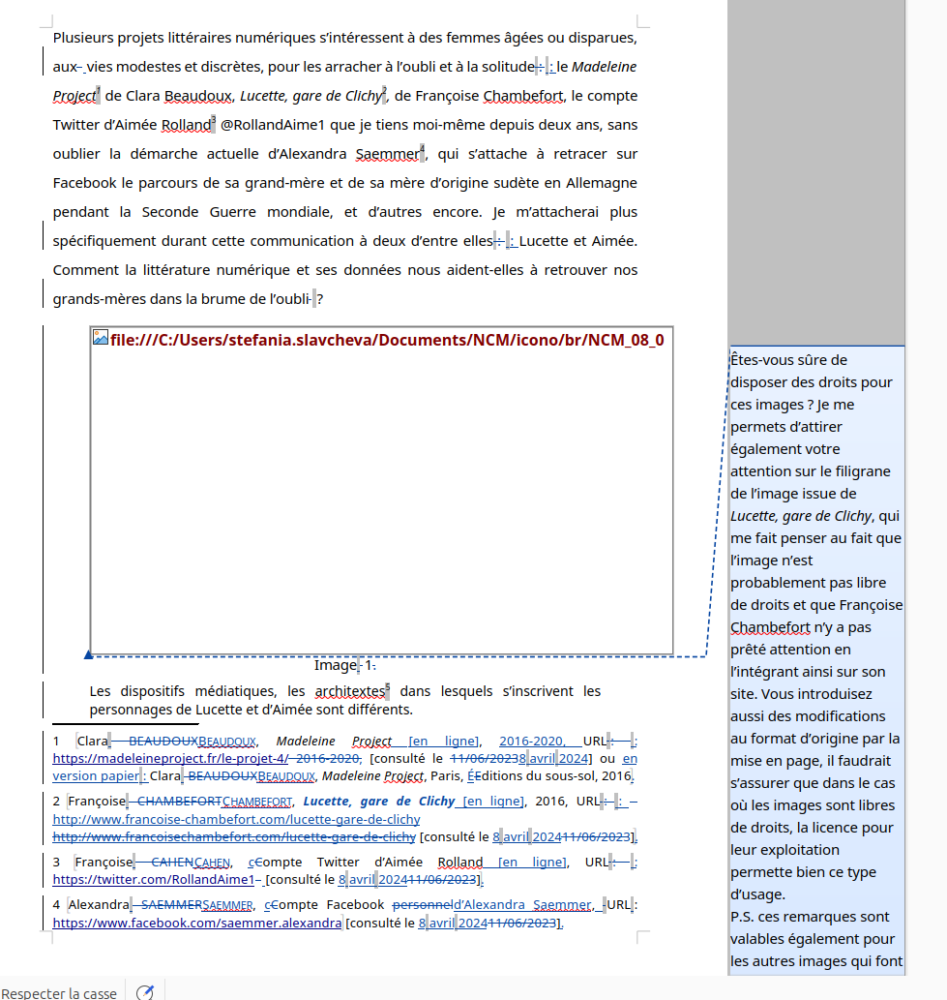
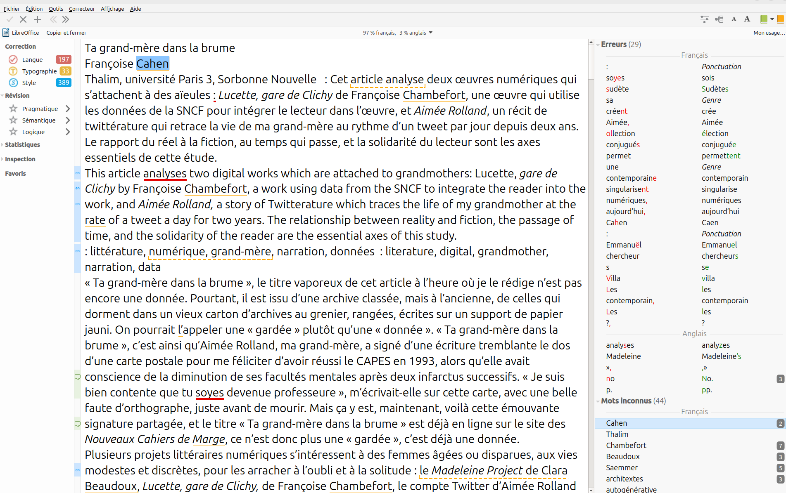

<!-- .slide: data-background-image="img/" -->

## Institutions : la puissance de légitimation des éditeurs en question

<!-- .element: style="width:400px" -->

===
Rappel / reprise :
Nous avons la semaine passée évoquer le concept de fonction éditoriale, dont on a vu qu'elle n'était pas propre à l'éditeur moderne, mais qu'elle avait traversé l'histoire de la pensée et de la culture mondiale. La fonction éditoriale recoupe trois éléments essentiels :
- une fonction de production
- une fonction de diffusion
- une fonction de légitimation

Tout au long de ce semestre, nous allons chercher à penser les métiers de l'édition, le savoir-faire et le savoir-être qu'ils requièrent, à partir d'une réflexion à la fois théorique et pratique sur cette fonction éditoriale historique.

Chaque séance sera consacrée à un concept ou à une figure majeure de l'édition (l'éditeur, le livre, l'auteur, l'oeuvre littéraire, la publication), dont on questionnera les enjeux contemporains à travers le prisme de cette fonction éditoriale.

§§§§§§§§§§§§§§§§§§§§§§§§§§§§§§§§§§§§§§§§§§§§§

Comment l'éditeur produit-il de la légitimité - et quelle corrélation peut-on établir entre légitimation et qualité du travail éditorial ? 

<!-- .element: style="font-size:1.7rem; text-align:justify" -->

Comment peut-il lui-même faire fructifier sa propre légitimité ? 

<!-- .element: style="font-size:1.7rem; text-align:justify" -->

Existe-t-il des opérations concrètes et objectives pour produire de la légitimité ? 

<!-- .element: style="font-size:1.7rem; text-align:justify" -->

Que devient la puissance de légitimation des éditeurs en contexte numérique ?

<!-- .element: style="font-size:1.7rem; text-align:justify" -->

===

Aujourd'hui, le cours se concentrera sur le métier d'éditeur, et sur la fonction de légitimation qu'elle engage. Comment l'éditeur produit-il de la légitimité ? Quelle relation peut-on établit entre la légitimité que l'éditeur confère à un auteur ou une oeuvre, et la qualité du travail éditorial effectué ?

D'ailleurs, j'en profite ici pour préciser une ou

Comment peut-il lui-même faire fructifier sa propre légitimité ? Existe-t-il des opérations concrètes et objectives pour produire de la légitimité ?  On comprend bien ici l'enjeu : l'éditeur doit d'abord construire sa légitimité afin d'être lui-même doté d'un pouvoir de légitimation, qui lui permet de transformer un texte en livre (voire en "oeuvre"), et un écrivain en auteur. Enfin, que devient la puissance de légitimation des éditeurs en contexte numérique ?

Il est difficile de mesurer la légitimité et la force de légitimation d'une institution éditoriale. Aujourd'hui, on va voir comment elle peut s'appuyer sur des éléments matériels, et notamment sur la fabrique du livre, mais également comment cette légitimité se construit sur le temps long de l'histoire.

Mais un mot peut-être, tout d'abord, sur ce que l'on entend ici par éditeur. On a vu la semaine dernière que la fonction éditoriale n'avait pas besoin des éditeurs pour être performée. Dès l'antiquité, des "editor", au sens littéraire et philologique du terme, se chargent ainsi d'établir les meilleures version possibles des textes pour en assurer la transmission auprès d'un public plutôt restreint : un public d'érudits.

Le métier d'éditeur va peu à peu se professionnaliser au cours de l'histoire. Il s'agit d'un mouvement progressif, dont on pourrait raconter l'évolution sur tout un semestre, mais je m'arrêterai ici sur le moment d'accélération de cette professionnalisation, qui s'est opérée à compter de la fin du XVIIIe et surtout du XIXe, pour donner naissance au modèle de l'éditeur moderne, modèle qui fait encore aujourd'hui référence, mais qui commence on l'a dit à être quelque peu bousculé.

Fin XVIIIe, on observe donc une conjoncture d'une série de facteurs très distincts qui vont façonner l'éditeur moderne, parmi lesquels on peut citer :
- [facteur technique] le développement croissant de l'imprimerie
- [facteur juridique] la réglementation du droit d'auteur et de la non-concurrence entre éditeur (qui a permis de réguler un marché pour le rendre soutenable)
- [facteur démographique] l'augmentation d'une population alphabétisée qui a accru la demande
- [facteur culturel et esthétique] la parution d'oeuvres majeures, qui ont permis d'imposer le livre comme un produit culturel. Premier Best-seller = L'encyclopédie de D&A.

Le processus de professionnalisation des éditeurs s'est construit sur le temps long, et n'a pas été un long fleuve tranquille. Encore aujourd'hui, il ne cesse de se réinventer, et avec elle la fonction de légitimation des textes.

§§§§§§§§§§§§§§§§§§§§§§§§§§§§§§§§§§§§§§§§§§§§§

### Édition et institutionnalisation
* Une institution ?
* Une fonction institutionnalisante ?

===

Le titre de cette séance pose un concept sur lequel je voudrais D'abord revenir : "Institution", la puissance de légitimation des éditeurs en question. QU'est-ce qu'une institution ? Dans un état de droit comme le nôtre, une institution désigne une structure d'origine coutumière ou légale, faite d'un ensemble de règles orienté vers une fin, qui participe à l'organisation de la société ou de l'État lui-même. L'école, l'université, sont des institutions. Les préfectures, les ministères également. Ce qui caractérise nos institutions, c'est qu'elles sont assez solidement structurées pour pouvoir fonctionner correctement (et de fait assurer le fonctionnement des services qu'elles proposes), indépendamment des personnes et personnalités : l'école ne ferme pas ses portes quand un ministre démissionne. Le principe de l'institution, c'est donc d'assurer une stabilité et une continuité à la société -- ou tout simplement à une structure. C'est ainsi que la Belgique a tenu près de 2 ans sans gouvernement.

Transposons à présent cette idée d'institution à l'échelle de la culture : les bibliothèques, les musées, sont des institutions culturelles : elles gardent un patrimoine, en assurent la conservation et la transmission. Bref, elles participent à réguler, stabiliser, pérenniser notre culture.

À bien des égards, les maisons d'édition peuvent également être considérées comme des institutions. Des institutions privées, soumises à des contraintes économiques, mais des institutions qd même, qui ont mis en place des structures particulièrement solides et reconnaissables, pour transmettre par effet de contiguité, une légitimité à tout ce qu'elles produisent : ouvrages et auteurs.

C'est pourquoi, surtout, il faut reconnaître aux maisons d'édition leur fonction institutionnalisante. En publiant un texte, un écrivain, la maison d'édition opère une transformation, et même une transformation de sa matière première :
- le texte devient livre / oeuvre
- l'écrivain devient auteur

Cette transmutation n'est pas que symbolique : elle s'appuie sur des statuts juridiques précis (le droit d'auteur), sur des procédures de normalisation (comme l'ISBN du livre).

NB : L'International Standard Book Number (ISBN) ou Numéro international normalisé du livre est un numéro internationalement reconnu, créé en 1970, identifiant de manière unique chaque édition de chaque livre publié, postérieurement à l’introduction de l’ISBN, quel que soit son support. Cet identifiant pérenne est destiné à simplifier la gestion pour tous les intervenants de la chaîne du livre (éditeurs, imprimeurs, grossistes, libraires, bibliothèques).

Par sa fonction institutionnalisante, le processus d'édition va conférer à un travail d'écriture (qu'il soit littéraire ou non), un message qu'il ne portait pas nécessairement à l'origine. Ce message va par la suite accompagner le livre tout au long de sa vie, et assurant sa transmission auprès des lecteurs.

§§§§§§§§§§§§§§§§§§§§§§§§§§§§§§§§§§§§§§§§§§§§§

### Dostoïevski ou Dostoïevski ?

===

Il existe plusieurs gestes d'institutionnalisation. Pour le comprendre, je voudrais commencer directement par un exemple qui me permette de problématiser cette question de l'institutionnalisation.

*Crime et Châtiment* est probablement l’œuvre la plus célèbre de l’écrivain russe Fiodor Dostoïevski (1821-1881).

§§§§§§§§§§§§§§§§§§§§§§§§§§§§§§§§§§§§§§§§§§§§§

### Introduction : Dostoïevski ou Dostoïevski ?

>Archétype du roman psychologique, il est considéré comme l'une des plus grandes œuvres littéraires de l'Histoire. Le roman dépeint l'assassinat d’une vieille prêteuse sur gage et de sa sœur par Rodion Raskolnikov, ancien étudiant de Saint-Pétersbourg tombé dans la pauvreté, et ses conséquences émotionnelles, mentales et physiques sur le meurtrier.

<!-- .element: style="font-size:1.7rem; text-align:justify" -->

===

Voici la présentation du roman que l’on trouve dans les pages de l’encyclopédie Wikipédia : "Archétype du roman psychologique, il est considéré comme l'une des plus grandes œuvres littéraires de l'Histoire. Le roman dépeint l'assassinat d’une vieille prêteuse sur gage et de sa sœur par Rodion Raskolnikov, ancien étudiant de Saint-Pétersbourg tombé dans la pauvreté, et ses conséquences émotionnelles, mentales et physiques sur le meurtrier."

§§§§§§§§§§§§§§§§§§§§§§§§§§§§§§§§§§§§§§§§§§§§§
<!-- .slide: data-background-image="img/crime_chatimentPleiade2.jpg" data-background-size="contain" -->

===

L’ouvrage a connu plusieurs éditions dont l’une, en 1950, au sein de la prestigieuse bibliothèque de la Pléiade chez Gallimard – une collection qui consacre les plus grands écrivains de la littérature mondiale.

§§§§§§§§§§§§§§§§§§§§§§§§§§§§§§§§§§§§§§§§§§§§§
<!-- .slide: data-background-image="img/crime_chatimentActesNoirs.jpg" data-background-size="contain" -->

===

En 2016, les éditions Actes Sud ont proposé une réédition du chef d’œuvre, dans la collection « Actes noirs », avec une traduction d’André Markowicz.  

§§§§§§§§§§§§§§§§§§§§§§§§§§§§§§§§§§§§§§§§§§§§§
<!-- .slide: data-background-image="img/dosto-dosto.png" data-background-size="contain" -->

===

D'une édition à l'autre, on peut constater l'oeuvre subit des transformations.
Que vous évoque la Pleïade ? Qui la lit ? Combien coûte-t-elle ? QU'est-ce qu'on y publie ?
QUe vous évoque Actes Noirs ? Qui la lit ? Combien coûte-t-elle ? QU'est-ce qu'on y publie ?

Le terme même "évoquer" pose question : la légitimation s'appuie sur des critères parfois très subjectifs, qui sont le fruit d'une construction lente, et en partie latente. Une maison, par ailleurs, ne maîtrise pas toujours complètement sa force de légitimation.

§§§§§§§§§§§§§§§§§§§§§§§§§§§§§§§§§§§§§§§§§§§§§

### Dostoïevski, de la Pleïade à Actes Noir...
* Un glissement générique (du roman psychologique au roman noir)
* Un glissement symbolique (d'oeuvre de la littérature mondiale, du canon, à une oeuvre populaire)
* Un élargissement du public-cible

===
Changement total de message que l'on fait porter à l'oeuvre : changement de public, changement de genre.

C'est cette question qu'il faut se poser : sur quels critères et quels principes s'édifie, s'entretient, mais également se saborde, la légitimité d'une institution éditoriale -- et avec elle la légitimité d'un texte, d'une oeuvre, d'un auteur ?

§§§§§§§§§§§§§§§§§§§§§§§§§§§§§§§§§§§§§§§§§§§§§

Sur quels critères et quels principes s'édifie, s'entretient, mais également se saborde, la légitimité d'une institution éditoriale -- et avec elle la légitimité d'un texte, d'une oeuvre, d'un auteur ?

§§§§§§§§§§§§§§§§§§§§§§§§§§§§§§§§§§§§§§§§§§§§§
<!-- .slide: data-background-image="img/" data-background-size="contain" -->

## Légitimité et image du texte en question
* Imaginaire symbolique : construction d'une réputation
* Des critères matériels : mise en forme et matérialité

===

Cet exemple nous permet de mettre le doigt sur un élément essentiel de l'édition, conçue comme la mise en livre d'un texte : la mise en livre, c'est opérer une mise en forme, c'est donner une image au texte. Mais c'est aussi lui donner une légitimité et l'inscrire dans un horizon d'attente, horizon qui va s'adresser à certains lecteurs plus qu'à d'autres.

C'est dans un sens assez rassurant, car on peut identifier des facteurs matériels de légitimation du texte : son image, entendue comme sa forme éditoriale, graphique, sa mise en page.

Et pour questionner cette notion d'image graphique du texte, nous allons évoquer ensemble le concept d'énonciation éditoriale, notamment présenté dans ce petit texte théorique signé Emmanuël Souchier que j'ai déposé sur MOODLE.

Je vais d'abord passer en revue avec vous les principaux éléments du texte, en les illustrant d'exemple un peu concrets.

§§§§§§§§§§§§§§§§§§§§§§§§§§§§§§§§§§§§§§§§§§§§§

## 1. La légitimation par l'image graphique du texte 

#### Introduction au concept d'énonciation éditoriale

§§§§§§§§§§§§§§§§§§§§§§§§§§§§§§§§§§§§§§§§§§§§§

Emmanuël Souchier, "L'image du texte pour une théorie de l'énonciation éditoriale", *Les cahiers de médiologie* 1998/2 (N° 6)

§§§§§§§§§§§§§§§§§§§§§§§§§§§§§§§§§§§§§§§§§§§§§
<!-- .slide: data-background-image="img/" data-background-size="contain" -->

### "Énonciation éditoriale" : retour sur un paradoxe

>Proposer l’expression « énonciation éditoriale » est nécessairement faire œuvre d’hérésie au regard de la linguistique ou des études littéraires. D’un point de vue linguistique, le terme d’énonciation implique qu’il y ait un énoncé et un énonciateur. Or une mise en page n’est pas « une suite finie de mots » ou « de phrases », même si on peut par ailleurs défendre l’idée selon laquelle elle est au texte imprimé ce que la dispositio est à la rhétorique classique. En outre, l’énonciation est originellement définie comme un « acte individuel d’utilisation de la langue », l’énoncé étant « le résultat de cet acte », or l’« énonciation éditoriale » postule précisément une pluralité d’énonciateurs. Le point de vue littéraire qui calque son regard sur la linguistique assènera la même critique.

<!-- .element: style="font-size:1.5rem; text-align:justify" -->

===

Perspective communicationnelle ou médiologique : on convoque deux éléments, l'énonciation et l'édition, qui a priori sont antithétiques.
L'énonciation, c'est en littérature et en linguistique un concept qui relève du langage, de la parole, et c'est qui plus est un acte essentiellement individuel.

L'énonciation éditoriale renverse donc le sens de ce qu'est en linguistique et en littérature l'énonciation.

>>Proposer l’expression « énonciation éditoriale » est nécessairement faire œuvre d’hérésie au regard de la linguistique ou des études littéraires. D’un point de vue linguistique, le terme d’énonciation implique qu’il y ait un énoncé et un énonciateur. Or une mise en page n’est pas « une suite finie de mots » ou « de phrases », même si on peut par ailleurs défendre l’idée selon laquelle elle est au texte imprimé ce que la dispositio est à la rhétorique classique. En outre, l’énonciation est originellement définie comme un « acte individuel d’utilisation de la langue », l’énoncé étant « le résultat de cet acte », or l’« énonciation éditoriale » postule précisément une pluralité d’énonciateurs. Le point de vue littéraire qui calque son regard sur la linguistique assènera la même critique.

§§§§§§§§§§§§§§§§§§§§§§§§§§§§§§§§§§§§§§§§§§§§§
<!-- .slide: data-background-image="img/" data-background-size="contain" -->

### La pluralité énonciative du texte

>Qu’on y songe seulement : auteur, editor, éditeur, directeur de collection, secrétaire d’édition, correcteur, illustrateur, maquettiste, graphiste, typographe, claviste, imprimeur, partenaires officiels ou mécènes… auxquels il conviendrait d’ajouter le fabricant de papier, le façonneur, le relieur, sans parler du libraire ou du diffuseur qui interviennent parfois en amont de la chaîne de production.

<!-- .element: style="font-size:1.7rem; text-align:justify" -->

===
[j’appelle editor le critique qui établit la genèse d’un texte, l’annote et le présente]

Le concept d'énonciation éditoriale est très fort, car il présuppose une désindividualisation de l'énonciation, qui n'est plus l'acte d'un seul locuteur, mais le résultat d'un ensemble d'interventions sur toute une chaîne de production.

Pour traduire : on considère qu'un livre (et le texte qu'il renferme), n'est plus seulement le fruit de l'intention d'un écrivain, mais le résultat d'un processus engageant une série d'acteurs de la chaîne éditoriale, chacun ayant l'occasion de laisser sa marque sur le livre :

>Qu’on y songe seulement : auteur, editor, éditeur, directeur de collection, secrétaire d’édition, correcteur, illustrateur, maquettiste, graphiste, typographe, claviste, imprimeur, partenaires officiels ou mécènes… auxquels il conviendrait d’ajouter le fabricant de papier, le façonneur, le relieur, sans parler du libraire ou du diffuseur qui interviennent parfois en amont de la chaîne de production.

Problème : les lecteurs n'ont que très peu conscience de cette polyphonie. Ils resteront souvent dans l'illusion d'un dialogue direct avec l'auteur. C'est tout l'enjeu (et l'injustice) de l'édition : les acteurs de la chaîne doivent se faire oublier...

L'énonciation éditoriale est donc à la fois une évidence : c'est elle qui permet au livre d'exister, et elle est en même temps invisible, c'est-à-dire transparente aux yeux des usagers qui ne s'interrogent finalement que très peu sur les conditions de production des livres, et plus largement sur leur matérialité. Le livre est l'un des médias les moins pensés par le grand public qui le consomme pourtant avec avidité. Impensé au sens premier : on n'en fait trop peu un sujet de connaissance, hormis dans le giron de l'Université. 

§§§§§§§§§§§§§§§§§§§§§§§§§§§§§§§§§§§§§§§§§§§§§
<!-- .slide: data-background-image="img/" data-background-size="contain" -->

### L'image matérielle du texte
* Penser la matérialité de l'écrit
* Réévaluer l'héritage théorique (post)structuraliste en reconsidérant le texte dans son inscription médiatique

===

Parce qu'il insiste sur l'image graphique du texte, le concept d'énonciation éditoriale encourage à repenser la **matérialité** du texte. Cette matérialité prend la forme, justement, d'une mise en forme : la mise en page, la typographie, le type et la qualité du papier, etc.

Penser cette matérialité du texte va plus ou moins à l'encontre de l'héritage des études littéraires, et notamment celui des structuralistes et post-structuralistes, qui ont prôné l'autonomie du texte, pas tant contre sa matérialité, mais contre une certaine conception de l'auteur (c'est le cas de Barthes, dans un texte très connu sur la mort de l'auteur, mais c'est aussi les travaux de Foucault).

Penser la matérialité du texte, et notamment sa graphie, n'est pas qu'une lubie d'éditeur. Il peut avoir du sens dès l'étape de production d'un texte par un auteur. En effet,

>L’énonciation éditoriale peut donc parfois être rendue visible par l’auteur, notamment lorsqu’il décide d’en faire l’une des données constitutives de son œuvre

§§§§§§§§§§§§§§§§§§§§§§§§§§§§§§§§§§§§§§§§§§§§§
<!-- .slide: data-background-image="img/federman2.png" data-background-size="contain" -->

===
Exemple Federman

§§§§§§§§§§§§§§§§§§§§§§§§§§§§§§§§§§§§§§§§§§§§§
<!-- .slide: data-background-image="img/federman1.png" data-background-size="contain" -->

§§§§§§§§§§§§§§§§§§§§§§§§§§§§§§§§§§§§§§§§§§§§§
<!-- .slide: data-background-image="img/" data-background-size="contain" -->

### Une élaboration plurielle du texte

>« Le concept d’énonciation éditoriale renvoie à l’élaboration plurielle de l’objet textuel. Il annonce une théorie de l’énonciation polyphonique du texte produite ou proférée par toute instance susceptible d’intervenir dans la conception, la réalisation ou la production du livre, et plus généralement de l’écrit. Au-delà, il intéresse tout support associant texte, image et son, notamment les écrans informatiques – étant entendu que tout texte est vu aussi bien que lu. »

<!-- .element: style="font-size:1.5rem; text-align:justify" -->

===

Ainsi, j'insiste avec Emmanuel Souchier sur la nécessité de désessentialiser le texte, pour le repenser dans son écosystème éditorial, et comme le résultat de cette production éditoriale impliquant des conditions matérielles + des compétences et corps de métiers variés.

>« Le concept d’énonciation éditoriale renvoie à l’élaboration plurielle de l’objet textuel. Il annonce une théorie de l’énonciation polyphonique du texte produite ou proférée par toute instance susceptible d’intervenir dans la conception, la réalisation ou la production du livre, et plus généralement de l’écrit. Au-delà, il intéresse tout support associant texte, image et son, notamment les écrans informatiques – étant entendu que tout texte est vu aussi bien que lu. »

De cette ultime définition, on retiendra la suivante : le texte est aussi bien "vu" que "lu". C'est tout le sens des couvertures d'ouvrage, par exemple.

§§§§§§§§§§§§§§§§§§§§§§§§§§§§§§§§§§§§§§§§§§§§§
<!-- .slide: data-background-image="img/" data-background-size="contain" -->

### L'objet livre comme énoncé

>L’une des fonctions premières de l’énonciation éditoriale est de donner le texte à lire comme activité de lecture (c’est sa dimension fonctionnelle, pragmatique ; on parlera alors de lisibilité). Dans un deuxième temps, elle s’inscrit dans l’histoire des formes du texte et par là même implique un certain type de légitimité ou d’illégitimité. L’énoncé de cette « énonciation » n’est donc pas le texte (le discours de l’auteur), mais la forme du texte, son image ; c’est le texte considéré comme objet concret et qui a été configuré à travers cette activité plurielle qu’est l’énonciation éditoriale.

<!-- .element: style="font-size:1.5rem; text-align:justify" -->

===

En proposant donc un déplacement de notre attention du contenu vers le support, ou plus exactement de l'environnement support du contenu (= le contenant),le concept d'énonciation éditoriale nous encourage à considérer la forme et la matérialité du livre comme des énoncés, et donc à en lire le sens.

L'énoncé, je le répète mais c'est important, ce n'est donc plus seulement ici le texte d'un auteur, mais c'est également son inscription matérielle.

§§§§§§§§§§§§§§§§§§§§§§§§§§§§§§§§§§§§§§§§§§§§§
<!-- .slide: data-background-image="img/" data-background-size="contain" -->

### Texte premier, texte second
>La fonction du « texte second » consiste à donner à lire le « texte premier », sa signification (la connotation) nous renvoie à l’idéologie littéraire et textuelle d’une époque donnée. Les signifiés de connotation sont les effets de légitimité textuelle liés aux usages qui se sont constitués au fil de l’histoire.

<!-- .element: style="font-size:1.5rem; text-align:justify" -->

### Être éditeur, être un membre de la chaîne éditoriale du livre, c'est travailler à l'élaboration de ce texte second.

===

Or cette inscription matérielle joue le rôle de "texte second", par rapport au texte premier (qui est le texte écrit par l'écrivain).

Être éditeur, être un membre de la chaîne éditoriale du livre, c'est travailler à l'élaboration de ce texte second.

§§§§§§§§§§§§§§§§§§§§§§§§§§§§§§§§§§§§§§§§§§§§§
<!-- .slide: data-background-image="img/dosto-dosto.png" data-background-size="contain" -->

===

Que s'est-il passé avec Dostoïevsky ? D'une édition à l'autre, le texte premier n'a pas bougé, mais le texte second s'est totalement réécrit. Et avec lui des critères de légitimité distincts se sont dessinés.

§§§§§§§§§§§§§§§§§§§§§§§§§§§§§§§§§§§§§§§§§§§§§
<!-- .slide: data-background-image="img/" data-background-size="contain" -->

### Vers une lecture littéraire **et** sémiotique

>Mais prendre en compte la dimension graphique, visuelle de l’écriture, et plus généralement de l’information écrite, implique un autre regard, une attention autre que celle dévolue d’ordinaire au texte. Ce regard fait du lecteur habituel un sémiologue attentif, car le texte ainsi considéré présente une résistance physique, matérielle, une présence sociale et idéologique qui s’expriment à travers l’histoire et la culture. C’est toute cette épaisseur de l’écrit que convoque la notion d’énonciation éditoriale.

<!-- .element: style="font-size:1.5rem; text-align:justify" -->

===

Évidemment, ce concept d'énonciation éditoriale appelle au développement de notre culture visuelle, médiatique, grpahique ou typographique, et même marketing.

>Mais prendre en compte la dimension graphique, visuelle de l’écriture, et plus généralement de l’information écrite, implique un autre regard, une attention autre que celle dévolue d’ordinaire au texte. Ce regard fait du lecteur habituel un sémiologue attentif, car le texte ainsi considéré présente une résistance physique, matérielle, une présence sociale et idéologique qui s’expriment à travers l’histoire et la culture. C’est toute cette épaisseur de l’écrit que convoque la notion d’énonciation éditoriale.

§§§§§§§§§§§§§§§§§§§§§§§§§§§§§§§§§§§§§§§§§§§§§
<!-- .slide: data-background-image="img/dickerCourvertures.png" data-background-size="contain" -->

===

 Après le décès de son éditeur Bernard de Fallois en 2018 et la fermeture de la maison d’édition du même nom un peu plus tard, en 2021, l’écrivain Joël Dicker a en effet pris la décision de s’auto-éditer, faute d’avoir été sollicité selon lui par une nouvelle maison d’édition. 

Sa maison s'appelle désormais Rosie&Wolfe.

 Observez les couvertures des ouvrages de Joël Dicker, chez Le Fallois puis chez Rosie & Wolfe. En quoi l’énonciation éditoriale assure-t-elle ici une relation de continuité entre les deux maisons ?

Couverture blanche et reproduction d’un tableau d’Edward Hopper, science de l’intrigue, la formule a fait ses preuves depuis 2012. Cette année-là, La Vérité sur l’affaire Harry Quebert (5 millions d’exemplaires vendus dans le monde) a remis d’aplomb une petite maison vieillissante, les Editions de Fallois.
Trois ans plus tard, Le Livre des Baltimore a confirmé l’addiction du public aux aventures de Marcus Goldman, héros récurrent qui ressemble beaucoup à son créateur, Joël Dicker. Dans L’Affaire Alaska Sanders, troisième tome de la trilogie, qui sortira le 10 mars, ce double de papier continue de surfer sur le succès. Tableau de Hopper (Gas) sur fond blanc, patronyme de l’auteur qui claque en rouge, rien n’a bougé sur le nouveau Dicker. Sauf le nom de l’éditeur, orné d’un petit loup bondissant, son animal fétiche.

§§§§§§§§§§§§§§§§§§§§§§§§§§§§§§§§§§§§§§§§§§§§§

### L'image du texte, ou l'importance de la typographie
### Le cas Mallarmé : « Jamais un coup de dé n’abolira le hasard »

===

Emmanuël Souchier évoque le cas de Mallarmé sans s'y attarder (il développe plutôt son discours autour du cas Queneau), mais je voudrais rapidement vous raconter l'histoire éditoriale du "Coup de dés" car elle me semble essentielle pour comprendre les enjeux de l'image du texte, mais également celle de l'influence éditoriale.

« Jamais un coup de dé n’abolira le hasard » est un texte réputé complexe, auquel des ouvrages entiers ont été consacrés. Le texte déploie une sorte de prose poétique difficile à déchiffrer (il est question d'un naufrage, notamment), déployée dans l'espace médiatique du livre et de la page, ce qui n'est pas sans rappeler à l'occasion l'esthétique du calligramme.

Dans l'imaginaire collectif, mais aussi chez les spécialistes, une idée circule, selon laquelle ce texte renfermerait un code secret, que les chercheurs ou amateurs ont tenté de percer depuis des années.

Publié en 1897, « Jamais un coup de dé n’abolira le hasard » est l'aboutissement du projet esthétique de Mallarmé, qui publie le texte à la fin de sa vie. Il s'agit du dernier gros chantier poétique de l'écrivain, qui ne verra jamais son oeuvre achevée.

Le mythe du sens caché de l'oeuvre est d'autant plus forte que c'est une oeuvre "inachevée". L'histoire éditoriale de ce texte a par ailleurs soutenu ce mythe.

§§§§§§§§§§§§§§§§§§§§§§§§§§§§§§§§§§§§§§§§§§§§§
<!-- .slide: data-background-image="img/cosmopolis-may-1897-cover.png" data-background-size="contain" -->

===

• 1ère édition dans la Revue Cosmopolis. 1897 On est 2 ans avant la mort de Mallarmé - un poète en fin de vie, qui a eu le temps de nourrir son projet.
Mallarmé n'en était pas complètement satisfait. Il n'aimait pas du tout le travail typographique réalisé : la police choisie n'était pas la bonne, etc.
Il a du coup travaillé sur une autre édition, son édition idéale, le projet Vollard (du nom de l'éditeur)

§§§§§§§§§§§§§§§§§§§§§§§§§§§§§§§§§§§§§§§§§§§§§
<!-- .slide: data-background-image="img/fullsizeoutput_3ac3.jpeg" data-background-size="contain" -->

§§§§§§§§§§§§§§§§§§§§§§§§§§§§§§§§§§§§§§§§§§§§§
<!-- .slide: data-background-image="img/epreuve.png" data-background-size="contain" -->

===

• 2e édition sous forme indépendante, par Vollard, en collaboration avec l'imprimeur Firmin-Didot. http://www.coupdedes.com/rubrique4.html
En fait, il s'agit d'un projet commencé avant la publication dans *Cosmopolis* (même si cette dernière propose la première publication officielle) : 1896 - XXXX. Vollard en est l'initiateur.

De cette édition, qui était presque parfaite aux yeux du poète, nous n'avons que ces épreuves : en fait le projet n'a jamais abouti à une publication.

Ce projet tombe ensuite dans l'oubli pendant plus de 50 ans. Le projet Firmin-Didot, pas le poème évidemment, qui poursuit son destin d'oeuvre majeure, intégrant rapidement le canon littéraire.

§§§§§§§§§§§§§§§§§§§§§§§§§§§§§§§§§§§§§§§§§§§§§
<!-- .slide: data-background-image="img/nrf.png" data-background-size="contain" -->

===

Pendant des dizaines d'années, les rééditions (notamment celle de la NRF qui fait autorité) vont se caler sur la version cosmopolis.

NOTE : La création de La NRF, «revue mensuelle de littérature et de critique», est due à un groupe de six écrivains dont André Gide est, depuis le tournant du siècle, le chef de file. Elle connaîtra une audience exceptionnelle, renouvelant dans des sommaires équilibrés, tour à tour composés par Gide et le cercle des fondateurs, puis par Jacques Rivière et Jean Paulhan, les perspectives du roman, du théâtre, de la critique et de la poésie contemporains. Toutes les grandes tendances et voix de l’entre-deux-guerres y seront représentées, «sans prévention d’école ni de parti». De la revue naîtront en 1911 les Éditions de la NRF, placées sous la responsabilité de Gaston Gallimard, et dont Paul Claudel, André Gide et Saint-John Perse seront les premiers auteurs. 

Personne (sauf quelques proches de Mallarmé ou rares collectionneurs et libraires) n'ont eu connaissance des épreuves du projet Vollard, et tous les commentateurs cherchent à déchiffrer le poème sur l'édition héritée de Cosmopolis.

§§§§§§§§§§§§§§§§§§§§§§§§§§§§§§§§§§§§§§§§§§§§§
<!-- .slide: data-background-image="img/piersonPtyx.png" data-background-size="contain" -->

===
La deuxième partie du XXe et le début du XXIe siècle ont vu la multiplication des éditions du Coup de Dés, dans une grande diversité de formats (de luxe ou de poche) et de typographies, certaines s’éloignant de la composition originelle au point de la rendre méconnaissable.

Il faut dire que l'on est encore peu sensibles aux conditions matérielles de production et de diffusion des textes.

Parallèlement, La même période sera aussi celle d’un lent retour aux sources et de la révélation progressive du chef-d’œuvre inconnu oublié dans les tiroirs des collectionneurs.

Il faudra attendre 1993 pour qu’un jeu complet d’épreuves soit présenté au public, sous vitrine, et reproduit intégralement dans le catalogue de l’exposition « Poésure et Peintrie » à l’ancien hospice de la Vieille Charité, à Marseille.

• Depuis 20 ans: les reconstitutions
Michel Pierson & Ptyx, 2004, qui utilise la Didot, comme le souhaitait mallarmé pour qui la page devait être conçue comme une toile de peinture, sur laquelle venait s'inscrire le texte.

§§§§§§§§§§§§§§§§§§§§§§§§§§§§§§§§§§§§§§§§§§§§§
<!-- .slide: data-background-image="img/comparatif_mallarme3.png" data-background-size="contain" -->

===

Pourquoi est-ce aussi important ?

Jamais un coup de dé n'abolira le hasard doit se lire de manière sémantique, mais aussi graphique, comme une peinture, une calligraphie, mais aussi une partition de musique (la graisse des lettres imitant les rondes sur lesquelles le lecteur doit insister).

§§§§§§§§§§§§§§§§§§§§§§§§§§§§§§§§§§§§§§§§§§§§§
<!-- .slide: data-background-image="img/comparatif_mallarme4.png" data-background-size="contain" -->

§§§§§§§§§§§§§§§§§§§§§§§§§§§§§§§§§§§§§§§§§§§§§
<!-- .slide: data-background-image="img/" data-background-size="contain" -->

### Enjeux typographiques contemporains
* Lisibilité des écrits d'écran
* Polices "libres de droit"
* Invention d'une typographie qui réponde aux enjeux linguistiques contemporains (typo épicène)

===

tristan-bartolini

§§§§§§§§§§§§§§§§§§§§§§§§§§§§§§§§§§§§§§§§§§§§§
<!-- .slide: data-background-image="img/typographie-inclusive-ecriture-tristan-bartolini-graphiste-1.jpg" data-background-size="contain" -->

===
tristan-bartolini

§§§§§§§§§§§§§§§§§§§§§§§§§§§§§§§§§§§§§§§§§§§§§
<!-- .slide: data-background-image="img/typographie-inclusive-ecriture-tristan-bartolini-graphiste-3.jpg" data-background-size="contain" -->

===
tristan-bartolini

§§§§§§§§§§§§§§§§§§§§§§§§§§§§§§§§§§§§§§§§§§§§§
<!-- .slide: data-background-image="img/fontmap.png" data-background-size="contain" -->

§§§§§§§§§§§§§§§§§§§§§§§§§§§§§§§§§§§§§§§§§§§§§
<!-- .slide: data-background-image="img/fontmeme.png" data-background-size="contain" -->

§§§§§§§§§§§§§§§§§§§§§§§§§§§§§§§§§§§§§§§§§§§§§

## L'énonciation éditoriale : une part d'invisibilisation 

#### Le cas de la révision et de la préparation de copie
* Révision ortho-typographique  
* Un protocole de travail codifié et évolutif selon les techniques éditoriales

<!-- .element: style="width:45%;float:left;margin-left:-1em; font-size:1.4rem; text-align:justify" -->

<!-- .element: style="width:40%;float:right;margin-right:-1em;" -->

===

Emmanuel Souchier relie l’énonciation éditoriale à deux caractéris­tiques essentielles : d’une part la pluralité des instances qui interviennent dans la production du livre (outre l’auteur, l’éditeur et le cas échéant le diffuseur, il faut compter avec l’imprimeur, le distributeur et le libraire) ; d’autre part, le fait que les marques laissées par ces différentes instances tendent à devenir invisibles (1998a : 140 ; v. aussi Souchier, 1998b : 172). 

Pour illustrer cette invisibilisation, j'ai choisi de vous parler de la révision et préparation de copie : c'est ainsi que l'on qualifie une série d'actions sur le texte, avant et après sa mise en page (cad lorsqu'il en est à l'état d'épreuve), afin d'enlever les erreurs de langue, mais également régler les problèmes de mise en forme.

Le travail de révision (d'abord révision d'épreuves, puis préparation de copie et révision de fichiers), est un élément essentiel du travail éditorial. Besoin des réviseurs : compétences linguistiques ++, mais également connaissances des règles de mise en forme et de présentation. 

Il s'agit d'une tâche généralement opérée par des personnes rigoureuses, minutieuses, et dotées d'une excellente connaissance de la langue et du travail de mise en page..

§§§§§§§§§§§§§§§§§§§§§§§§§§§§§§§§§§§§§§§§§§§§§
<!-- .slide: data-background-image="img/Memento-signes-correction.svg" data-background-size="contain" -->

===

Historiquement, aux débuts de l’imprimerie, la correction était souvent effectuée par deux correcteurs : le premier lisait un exemplaire de l’épreuve à haute voix, le second effectuait les corrections au moyen de signes conventionnels. 

Le lecteur utilisait, pour signaler les diverses ponctuations et styles typographiques, de termes abréviatifs : « ouvre » pour une parenthèse ouvrante, « ferme » pour une parenthèse fermante, « clame » pour un point d’exclamation, « sus » pour des points de suspension, etc. 

Plus tard le correcteur travaille seul, apposant ses corrections à l’encre rouge en suivant les codes conventionnels : une marque signale le ou les caractères à changer dans le corps du texte, et la correction à apporter est mentionnée en marge.

Les règles de révision se sont de plus en plus formalisées pour aboutir à la création d'un code de révision, que l'on apprenait dans nos études.

On peut voir ici une manifestation de l'invisibilisation du travail éditorial, travail exigeant qui disparaît totalement. 

§§§§§§§§§§§§§§§§§§§§§§§§§§§§§§§§§§§§§§§§§§§§§

Qualité de la publication et invisibilisation de l'énonciation éditoriale&nbsp;: une relation consubstantielle ?

<!-- .element: style="width:300px" -->

===

Le processus d'invisibilisation de l'énonciation éditoriale ne doit pas cacher l'importance qu'elle joue dans la légitimation d'une publication : un texte qui a été travaillé ++ est forcément de meilleure qualité.

On pourra même suggérer l'hypothèse selon laquel plus le travail édito est invisibilisé, plus l'énonciation éditoriale est muette, plus la qualité d'un ouvrage ou d'une publication est grande. 

§§§§§§§§§§§§§§§§§§§§§§§§§§§§§§§§§§§§§§§§§§§§§

## L'énonciation éditoriale dans les écrits d'écrans

* Le dispositif numérique : un acteur supplémentaire de l'énonciation éditoriale
* Comment l'outil numérique change le rapport à la matérialité de l'écriture et de sa mise en forme ?
* Les "écrits d'écrans" : du code à l'interface, une nouvelle manière de concevoir l'énonciation éditoriale

<!-- .element: style="font-size:1.6rem" -->

===

La question de l'énonciation éditoriale se dote de toute nouvelles problématique depuis l'émergence du texte à l'écran.

On verra plus en détail la question de la fabrique du livre et sa remédiation dans deux semaines. On envisagera les enjeux de la remédiation du livre, à travers une approche design en particulier. Mais dès aujourd'hui on peut aborder la question de l'énonciation éditoriale dans les écrits d'écran.

* Le dispositif numérique : un acteur supplémentaire de l'énonciation éditoriale
* Comment l'outil numérique change le rapport à la matérialité de l'écriture et de sa mise en forme ?
* Les "écrits d'écrans" : du code à l'interface, une nouvelle manière de concevoir l'énonciation éditoriale

§§§§§§§§§§§§§§§§§§§§§§§§§§§§§§§§§§§§§§§§§§§§§

### La préparation de copie en PAO
* PAO = Publication assistée par ordinateur
* Un système d'automatisation de la révision
* Les commentaires et le *track-changes*

<!-- .element: style="width:45%;float:left;margin-left:-1em; font-size:1.4rem; text-align:justify" -->

<!-- .element: style="width:20%;float:right;margin-right:-1em;" -->

===

Publication assistée par ordinateur

Logiciel Word : track changes.

Ouvrage de de Matthew Kirschenbaum, propose une archéologie des logociels de traitement de texte, pour « raconter et décrire en termes matériels et historiques comment les ordinateurs, et plus particulièrement le traitement de texte, sont devenus partie intégrante de la création littéraire et de l'écriture littéraire ».

§§§§§§§§§§§§§§§§§§§§§§§§§§§§§§§§§§§§§§§§§§§§§

<!-- .element: style="width:40%;float:left;margin-right:-1em;" -->

<!-- .element: style="width:60%;float:right;margin-right:-1em;" -->

===

Il explique déjà comment les logiciels de traitement de texte ont permis de voir directement ce que l'on écrivait en temps réel (vs. les machines à écrire où tout s'inscrivait qd on arrivait à la fin = retour chariot). 

Il explique aussi comment le fait de pouvoir copier-coller a changé le rapport des écrivains à la matérialité du texte, avec la possibilité de le manipuler : matérialité de plus en plus labile.

Il montre que le track changes a permis également de manipuler le texte davantage, mais également de produire un commentaire, une glose autour de ce texte. 

Il explique enfin qu'aujourd'hui, il existe un monopole du logiciel de traitement de texte, qui a imposé sa manière de travailler.

§§§§§§§§§§§§§§§§§§§§§§§§§§§§§§§§§§§§§§§§§§§§§

>Avec l’informatique, le texte de l’ouvrage confié par l’auteur à l’éditeur n’est pas ressaisi mais directement mis en pages : les épreuves ont complètement changé de sens : on ne demande plus à l’auteur de corriger les fautes de l’imprimeur, mais de se relire pour se corriger lui-même ou pour valider les corrections introduites par l’éditeur. Lorsqu’un auteur relit les épreuves de son texte, les coquilles apparaissent beaucoup mieux que sur sortie d’imprimante, a fortiori que sur écran.

<!-- .element: style="font-size:1.7rem; text-align:justify" -->

Marc Arabyan, Introduction au dossier "L'énonciation éditoriale" paru dans *Semen*, 41 (2016)

<!-- .element: style="font-size:1.7rem; text-align:right" -->

===

L'informatique n'aura fait qu'automatiser un processus éditorial. 

À méditer quand on sait qu'aujourd'hui, des expériences sont menées afin d'intégrer l'IA à la préparation de copie. 

§§§§§§§§§§§§§§§§§§§§§§§§§§§§§§§§§§§§§§§§§§§§§

#### Préparation de copie et automatisation
* Logiciels de correction et révision : Antidote, ProLexis
* Intégration de l'intelligence articicielle

<!-- .element: style="width:45%;float:left;margin-left:-1em; font-size:1.4rem; text-align:justify" -->

<!-- .element: style="width:45%;float:right;margin-right:-1em;" -->

===

Des logiciels de révision existent.

§§§§§§§§§§§§§§§§§§§§§§§§§§§§§§§§§§§§§§§§§§§§§

### La difficile légitimation des "écranvains"

Comment devient-on un "auteur" quand on publie en ligne ?

<!-- .element: style="font-size:1.6rem" -->

Qu'est-ce qui fait qu'un texte à l'écran est plus "légitime qu'un autre" ? 

<!-- .element: style="font-size:1.6rem" -->
===

Le problème que je vais adresser à présent nous éloigne en apparence de la pratique éditoriale traditionnelle : elle vient poser la question des compétences de l'auteur numérique. Elle interroge également la redistribution de la fonction éditoriale à l'époque numérique.

§§§§§§§§§§§§§§§§§§§§§§§§§§§§§§§§§§§§§§§§§§§§§

>
"La légitimation s’invite au rang des questions épineuses, dans le quotidien même des écrivains contemporains. Elle s’impose dans le même temps aux écranvains, fréquemment accusés de privilégier le support Internet, car permettant une autoédition synonyme de désintermédiation, c’est-à-dire de stratégie d’évitement des filtres traditionnels mis en place par la chaîne du livre. Pas une discussion au sujet des blogs qui n’interroge in fine, et parfois avec virulence, la littérarité problématique de leurs contenus."

>
Gilles Bonnet, *Pour une poétique numérique: littérature et Internet* (2018)

<!-- .element: style="font-size:1.6rem" -->
===

S’attaquer à la question de la littérarité des écritures numériques semble constituer un défi quelque peu hasardeux : pourquoi, en effet, courir le risque de tomber dans le piège essentialiste tendu par ce concept sur lequel les théoriciens n’ont jamais réussi à s’entendre, après plus d’un siècle de débats? Force est de reconnaître, tout d’abord, l’actualité d’une problématique à l’origine de nombreuses tensions dans le champ de la littérature contemporaine, et en particulier de la littérature numérique, encore en quête de légitimation malgré déjà plusieurs décennies d’existence. Comme l’a souligné Gilles Bonnet :

§§§§§§§§§§§§§§§§§§§§§§§§§§§§§§§§§§§§§§§§§§§§§
<!-- .slide: data-background-image="img/crouzetAuteurCodeur.png" data-background-size="contain"-->

===

Dans un billet de blogue au titre percutant — « si t’es pas codeur, t’es pas auteur », publié en 2011 — l’écrivain Thierry Crouzet dessinait une relation conditionnelle entre les compétences informatiques de l’écrivain et son statut d’auteur.

§§§§§§§§§§§§§§§§§§§§§§§§§§§§§§§§§§§§§§§§§§§§§

*“Si t’es pas codeur t’es pas auteur”...*

>
**"Pour écrire un codex [numérique], l’auteur doit produire non seulement du texte et des liens, mais aussi du code informatique, un code qui fait partie intégrante de l’œuvre."**

Thierry Crouzet, 2011.

<!-- .element: style="font-size:1.6rem" -->

===

"Pour écrire un codex, l’auteur doit produire non seulement du texte et des liens, mais aussi du code informatique, un code qui fait partie intégrante de l’œuvre."

La formule était volontairement provocatrice, et elle suscitera d’ailleurs des réactions assez vives — de l’aveu même de l’intéressé : « On m’a répondu “T’es pas boulanger, t’es pas auteur” ».

§§§§§§§§§§§§§§§§§§§§§§§§§§§§§§§§§§§§§§§§§§§§§

>
**“On m’a répondu  «&nbsp;T’es pas boulanger, t’es pas auteur&nbsp;»”**

Thierry Crouzet, 2011.

<!-- .element: style="font-size:1.8rem" -->

===

Cette position, radicale aux yeux de certains écrivains et lecteurs, fait pourtant écho à une définition canonique de la littérature électronique, qui place au premier plan la dimension technique et dispositive de l’œuvre numérique.

Un tel débat peut sembler abscons, mais il questionne en fait le processus de légitimation d'un texte, à l'heure où sa fabrique (ce qui relèverait de la fonction de production), est de plus en plus déléguée à des procédures machiniques, informatiques.

§§§§§§§§§§§§§§§§§§§§§§§§§§§§§§§§§§§§§§§§§§§§§

### "Écritures numériques" : de quoi parle-t-on ?

===

Pour bien comprendre le problème, posons-nous la question : qu'Est-ce que l'écriture (et donc l'édition) numérique ?

§§§§§§§§§§§§§§§§§§§§§§§§§§§§§§§§§§§§§§§§§§§§§

### Du livre à l'écran : 3 "niveaux" de l'écriture numérique

>Le livre a une réalité physique ou matérielle (le papier, l’encre) et une réalité symbolique ou culturelle (la langue, les signes à interpréter). Mais pour comprendre le fonctionnement du numérique il faut comprendre l’articulation, non pas de deux, mais de trois niveaux : il y a ce qu’écrit la machine, il y a ce qu’écrit le programmeur de cette machine, il y a ce qu’écrit l’utilisateur de cette machine. Lire un document numérique quelconque, c’est lire ces trois niveaux, quoique seul le dernier soit visible. ([Bouchardon et Petit, 2017](http://www.costech.utc.fr/CahiersCOSTECH/spip.php?article69))

<!-- .element: style="font-size:1.7rem; text-align:justify" -->

§§§§§§§§§§§§§§§§§§§§§§§§§§§§§§§§§§§§§§§§§§§§§

### Niveau 1 : le code binaire, la technique comme matière

> Le premier niveau de l’écriture numérique est d’abord théorique et repose sur la discrétisation et la manipulation d’unités formelles privées de sens (les 0 et les 1 ou n’importe quelles autres unités logiques formelles constituant un alphabet de manipulation). Tout contenu numérique peut être réduit en codage binaire, dont la signification éventuelle est arbitraire et indépendante de la manipulation formelle. ([Bouchardon et Petit, 2017](http://www.costech.utc.fr/CahiersCOSTECH/spip.php?article69))

<!-- .element: style="font-size:1.7rem; text-align:justify" -->

§§§§§§§§§§§§§§§§§§§§§§§§§§§§§§§§§§§§§§§§§§§§§
<!-- .slide: data-background-image="img/binaryCode.png" -->

§§§§§§§§§§§§§§§§§§§§§§§§§§§§§§§§§§§§§§§§§§§§§

### Niveau 2 : le code informatique, la technique comme code
>Le deuxième niveau est celui du potentiel fonctionnel proposé par les applications, ce n’est plus le niveau de l’implémentation matérielle, mais le niveau du logiciel, celui de la manifestation, celui des formats d’écriture et des fonctions d’écriture. Comment nommer ce deuxième niveau de l’écriture numérique ? Nous proposons de l’appeler écriture pour les machines, soit l’écriture informatique ou l’écriture du code. ([Bouchardon et Petit, 2017](http://www.costech.utc.fr/CahiersCOSTECH/spip.php?article69))

<!-- .element: style="font-size:1.7rem; text-align:justify" -->

§§§§§§§§§§§§§§§§§§§§§§§§§§§§§§§§§§§§§§§§§§§§§
<!-- .slide: data-background-image="img/code.png" data-background-size="contain" -->

§§§§§§§§§§§§§§§§§§§§§§§§§§§§§§§§§§§§§§§§§§§§§

### Niveau 3 : l'interface, la technique comme art

>Ce troisième niveau est celui des utilisateurs du numérique, qui interprètent des formes sémiotiques et les manipulent, c’est le niveau de l’interaction (avec le niveau 1 via le niveau 2). Ce troisième niveau étant le plus usuel, nous pouvons le nommer écriture avec les machines. Mais tout l’enjeu de l’écriture numérique du troisième niveau est de ne pas oublier les deux autres niveaux, qui ne sont pas directement visibles mais qui rendent visible. ([Bouchardon et Petit, 2017](http://www.costech.utc.fr/CahiersCOSTECH/spip.php?article69))

<!-- .element: style="font-size:1.7rem; text-align:justify" -->

§§§§§§§§§§§§§§§§§§§§§§§§§§§§§§§§§§§§§§§§§§§§§
<!-- .slide: data-background-image="img/interface.png" data-background-size="contain" -->

§§§§§§§§§§§§§§§§§§§§§§§§§§§§§§§§§§§§§§§§§§§§§

>Du fait de ces trois niveaux, il existe une tension propre à l’écriture numérique. S’il y a tension, c’est d’abord parce que l’écriture numérique réunit deux mondes jusqu’alors disjoints : le monde de l’écriture et le monde de la machine. [...] Pour ne parler ici que de la tension entre écriture et lecture, il est clair que la manipulation des signes et la dissémination des traces propres à l’écriture numérique entraînent ceci de particulier que non seulement écrire c’est lire, mais que lire c’est écrire. Avant d’être l’industrialisation de l’écriture, le web est l’industrialisation de la lecture. ([Bouchardon et Petit, 2017](http://www.costech.utc.fr/CahiersCOSTECH/spip.php?article69))

<!-- .element: style="font-size:1.7rem; text-align:justify" -->

§§§§§§§§§§§§§§§§§§§§§§§§§§§§§§§§§§§§§§§§§§§§§

## Le devenir-écriture de l'image / du graphisme

§§§§§§§§§§§§§§§§§§§§§§§§§§§§§§§§§§§§§§§§§§§§§
<!-- .slide: data-background-image="img/barthes2.jpg" data-background-size="contain" -->

§§§§§§§§§§§§§§§§§§§§§§§§§§§§§§§§§§§§§§§§§§§§§
<!-- .slide: data-background-image="img/barthesImageCode.png" data-background-size="contain" -->

§§§§§§§§§§§§§§§§§§§§§§§§§§§§§§§§§§§§§§§§§§§§§
<!-- .slide: data-background-image="img/barthesCoding.png" data-background-size="contain" -->

§§§§§§§§§§§§§§§§§§§§§§§§§§§§§§§§§§§§§§§§§§§§§
<!-- .slide: data-background-image="img/barthes2modif.jpg" data-background-size="contain" -->

§§§§§§§§§§§§§§§§§§§§§§§§§§§§§§§§§§§§§§§§§§§§§

## Une écriture invisible : les couches de code

- langage machine
- langage de programmation
- interface CMS (back office)
- interface usager / lecteur

<!-- .element: style="font-size:1.6rem" -->

===

Qui assume l'énonciation éditoriale ?

Problème de la standardisation des codes / de leur mauvaise compréhension (manque de littératie)

Tout cela témoigne d'une redistribution de l'énonciation éditoriale

§§§§§§§§§§§§§§§§§§§§§§§§§§§§§§§§§§§§§§§§§§§§§

## Une méta-écriture : l'importance des métadonnées
* Le contenu textuel se dédouble (ce qui est affiché / ce qui se cache sous l'affichage)
* Écriture descriptive : ceci est un titre, une citation, une référence...
* Un repérage indispensable en contexte numérique (vers des analyses quantitatives)
* Une valeur ajoutée au texte : des bibliothèques qui deviennent des bases de données

<!-- .element: style="font-size:1.6rem" -->

===

Méta-écriture : un contenu extrêmement important / inestimable pour assurer la vie d'un texte dans l,écosystème numérique, mais un travail totalement invisibilisé.

L'énonciation éditoriale à l'écran est doublement invisible : autant très peu de lecteurs portent attention au paratexte d'un livre, à son image graphique (la typo de Mallarmé est un épiphénomène pour bien des lecteurs), autant l'énonciation éditoriale numérique est invisible littéralement car il s'agit d'une couche inférieure du texte.

Qui se charge de cette nouvelle énonciation ? Les auteurs eux-mêmes lorsqu'ils sont les producteurs de leur site / les CMS ou les outils d'écriture numérique qui prévoient des catégories / Des data-managers, webmestre, qui travaille alors le texte en ligne en mode SEO (Search Engine optimization).

§§§§§§§§§§§§§§§§§§§§§§§§§§§§§§§§§§§§§§§§§§§§§
<!-- .slide: data-background-image="img/metadonnee.png" data-background-size="contain"  -->

source : Exemple de métadonnées d'un article *Sens public*

<!-- .element: class="source" -->

§§§§§§§§§§§§§§§§§§§§§§§§§§§§§§§§§§§§§§§§§§§§§
<!-- .slide: data-background-image="img/nuits.png" data-background-size="contain"  -->

Source image : [_Nuits 48_ Joachim Séné](http://jsene.net/fragments-chutes-et-consequences/spip.php?article845)

<!-- .element: class="source" -->

===
> la série Nuits… qui ne sont lisibles que de nuit, le site étant réglé pour n’afficher qu’un avertissement priant l’internaute de revenir après le coucher du soleil s’il y accède trop tôt dans la journée : « Désolé, la nuit n’est pas encore tombée ici et les Nuits sont désormais illisibles de jour…
Revenez dans quelques heures. »

Aujourd'hui, nuits est de toute façon soumis à la "patine numérique" = CSS qui fait s'effacer le texte

§§§§§§§§§§§§§§§§§§§§§§§§§§§§§§§§§§§§§§§§§§§§§
<!-- .slide: data-background-image="img/nuits-code.png" data-background-size="contain"  -->

Source image : [_Nuits 48_ Joachim Séné](http://jsene.net/fragments-chutes-et-consequences/spip.php?article845)

<!-- .element: class="source" -->

===
Inspecter le code pour relire le texte = palimpseste numérique !

§§§§§§§§§§§§§§§§§§§§§§§§§§§§§§§§§§§§§§§§§§§§§

### Outils d'écriture et d'édition numérique : vers une nouvelle standardisation de l'image du texte ?
* Les CMS et le risque de la plateformisation
* Une écriture (graphique) "sans" écriture (du code) ?

===

CMS = content management system

Ces dispositifs déclinent des « formes modèles » d’écriture, qui s’offrent à l’appropriation des usagers.

En standardisant les écritures, les logiciels régissent donc des fonctionnalités textuelles et imposent une certaine conception de l’écrit. Les internautes sont à la fois énonciateurs et récepteurs de ces formes uniformisées derrière la promesse d’une accessibilité universelle. Mais la démocratisation proclamée des pratiques d’écriture-lecture sur l’Internet se traduit en réalité par une complexification des compétences d’écriture : « en se propageant, mais sous des formes complexes, l’institution de l’image du texte appelle des compétences particulières, des lucidités particulières, que les programmes éducatifs ne prennent pas en charge et qui relèvent, ainsi, des habiletés et des opportunités » (Jeanneret, Souchier, 2005). La formalisation des écritures numériques se solde ainsi par un renforcement des inégalités sociales face au texte.

§§§§§§§§§§§§§§§§§§§§§§§§§§§§§§§§§§§§§§§§§§§§§

### Classez la légitimité des plateformes suivantes :

>Sur quelle plateforme iriez-vous lire/écouter un texte littéraire ?

* Twitter
* Wattpad
* TikTok
* Wordpress
* SPIP

§§§§§§§§§§§§§§§§§§§§§§§§§§§§§§§§§§§§§§§§§§§§§
<!-- .slide: data-background-image="img/poem.jpg" data-background-size="contain"-->
<!-- .slide: class="hover"-->

>
**"Au-delà de la compétence technique de l’auteur, la valeur littéraire relèverait en particulier des connotations attribuées au prestige d’une technologie ou d’une marque à laquelle il associe son nom. Dans ce cadre, l’œuvre littéraire apparaîtrait comme indissociable de la strate des discours tenus à son sujet comme production technique. [...] ce n’est pas tant “lire“ qui compte que “lire sur iphone“, ni tant “écrire“ que “écrire sous Java“".**

Candel et Gomez-Gomez-Meija, 2013

<!-- .element: style="font-size:1.6rem" -->

===

En 2013, Étienne Candel et Gustavo Gomez-Mejia avaient d’ailleurs déjà relevé le problème, en suggérant qu’« au-delà de la compétence technique de l’auteur, la valeur littéraire relèverait en particulier des connotations attribuées au prestige d’une technologie ou d’une marque à laquelle il associe son nom.

Dans ce cadre, l’œuvre littéraire apparaîtrait comme indissociable de la strate des discours tenus à son sujet comme production technique ». Afin d’affirmer la littérarité de son travail d’écriture numérique, l’auteur aurait donc tout intérêt à s’associer explicitement à certaines marques plutôt qu’à d’autres. Car « ce n’est pas tant ‘lire’ qui compte que ‘lire sur iphone’, ni tant ‘écrire’ que ‘écrire sous Java’».

Ainsi, la technique n’est donc pas qu’une seule question de code et de programmation, elle comprend aussi une part discursive et culturelle majeure. Les codes, les logiciels, s’inscrivent dans un imaginaire qui a forgé un système de valeur.

Tout ceci a tendance à nous rappeler le capital symbolique que certaines maisons d’édition exercent : publier chez Minuit reste quoiqu’on en dise un gage de légitimité majeur. Une remarque à laquelle nous pourrons aussi ajouter que, quand on publie chez Minuit, nous pouvons compter sur toute une armée de professionnels du livre, alors que quand on écrit avec Java, on est souvent bien seuls.

§§§§§§§§§§§§§§§§§§§§§§§§§§§§§§§§§§§§§§§§§§§§§

## Les techniques numériques : quelles connotations ?
* Un glissement du code vers la compétence "culturelle" ou "politique"
* Une littérature du détournement dispositif

===

Maîtriser cette culture numérique, avec son système de valeurs qui repose sur des principes plus ou moins discutables, est aujourd’hui devenu essentiel, puisque cela participe à la construction sémiotique de plusieurs œuvres de littérature numérique.

L’enjeu n’est d’ailleurs pas seulement symbolique, il est aussi politique, à l’heure où les GAFAM semblent imposer un nouveau monopole éditorial, fondé sur des outils et des plateformes qui « mâchent » grandement le travail de conception informatique.

§§§§§§§§§§§§§§§§§§§§§§§§§§§§§§§§§§§§§§§§§§§§§
<!-- .slide: data-background-image="img/spip2.png"  data-background-size="contain"-->

§§§§§§§§§§§§§§§§§§§§§§§§§§§§§§§§§§§§§§§§§§§§§
<!-- .slide: data-background-image="img/spip1.png"  data-background-size="contain"-->

§§§§§§§§§§§§§§§§§§§§§§§§§§§§§§§§§§§§§§§§§§§§§
<!-- .slide: data-background-image="img/wattpad.png"  data-background-size="contain"-->

===

Massivement investis par les écrivains, ces nouveaux dispositifs éditoriaux (CMS, réseaux sociaux) permettent l’émergence d’une génération qui est loin de partager la même littératie numérique que celle qui l’a précédée.

§§§§§§§§§§§§§§§§§§§§§§§§§§§§§§§§§§§§§§§§§§§§§

## Conclusion 
Le concept d'énonciation éditoriale souligne combien la part éditoriale du texte, sa réalité formelle, n’est plus envisagée comme une médiation neutre mais bien comme une pratique énonciative à part entière. Le travail éditorial, en transformant le texte en livre, ne contente pas de transmettre : elle produit du sens, elle valorise, dévalorise, construit un horizon d'attente. L'énonciation éditoriale renvoie par ailleurs au paradoxe de l'éditeur, tiraillé entre une invisibilisation nécessaire (il n'est pas l'auteur) et une exigence de qualité qui requiert une manipulation profonde du texte. Dans le contexte de l'informatisation de l'édition -- qui n'est qu'une étape supplémentaire dans l'automatisation des tâches de l'éditeur -- l'énonciation éditoriale fait émerger des enjeux de pouvoir liés à la question du formatage et à l'émergence de nouveaux acteurs de l'édition qui viennent bouleverser les équilibres (GAFAM). À cet égard, le risque de la plateformisation (= la standardisation de l'écriture / lecture qui accompagne une démocratisation des dispositifs éditoriaux numériques) doit faire l'objet d'une attention particulière afin de garantir la bibliodiversité. 

<!-- .element: style="font-size:1.6rem" -->

