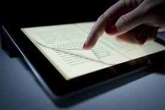

<!-- .slide: data-background-image="img/devTrays.png" -->
<!-- .slide: class="hover"-->

## Remédiations : concevoir le livre de demain

<!-- .element: style="width:400px" -->

§§§§§§§§§§§§§§§§§§§§§§§§§§§§§§§§§§§§§§§§§§§§§
<!-- .slide: data-background-video="img/phallainaChap1.mp4" -->

===

Introduction :
exemple de Phalaina, de Marietta Ren (ancienne étudiante des Gobelins) :
- à l'image, j'ai un graphisme qui ressemble beaucoup à de la BD
- à la lecture, j'ai un récit que je fais défiler en continu, dans une séquentialité hybride : la "page" comme unité a disparu, de même que la case (de CD), pour proposer une lecture séquentielle quasi cinématographique, mais également des objets médiatiques bien plus anciens, comme la tapisserie de Bayeux ! On est dans un dispositif bien plus immersif.
- immersion : ajout de son
- Geste : entre le scroll (cf. les cours de com / geste typiquement numérique) et le tactile, puisqu'ici je vois bien que je dépens de ma tablette tactile.
- Machine : obligation d'avoir ce type de machine (une liseuse tablette) pour lire.

DÉpendance à la machine de plus en plus forte.

§§§§§§§§§§§§§§§§§§§§§§§§§§§§§§§§§§§§§§§§§§§§§

## Mon livre numérique est-il encore un livre ?
* Des mutations esthétiques
* Un changement de format (qu'est-ce qui "fait livre" : la tablette, le fichier, l'appli ?)
* Un nouveau dispositif de lecture (tablettes, liseuse, écran)
* Des enjeux de stockage et de pérennité (quelle bibliothèque ?)

===

Bcp de questions se posent. Les plus évidentes, pour nous, ce sera d'abord les questions esthétiques. Dans cette BD immersive d'un nouveau genre, on perçoit bien sûr les mutations esthétiques : ce mariage du livre (image fixe) avec le cinéma, l'insertion de sons, etc. On est dans ce que l'on peut qualifier d'oeuvre hypermédiatique :

>L’art hypermédiatique est une sous-catégorie de l'art numérique, dont l'expression découle du terme hypermédia. Elle désigne un ensemble de pratiques artistiques intégrant un principe associatif entre des images, du texte et du son dans une interface de type écran.

Mais cet engouement esthétique, cette fascination pour un objet spectaculaire, ne doit pas faire oublier des enjeux un peu plus pratiques.

À commencer par la question générale qui doit occuper tout éditeur : l'Accessibilité et la lisibilité de son livre.
Ainsi, le passage de l'imprimé au numérique pose d'abord la question des formats. Le livre numérique, c'est d'abord un fichier ou un ensemble de fichiers, édité dans des formats parfois très différents : de l'epub (1-2-3), du azw (amazon, non interopérable), du PDF, du HTML+Javascript (livre-appli). Problèmes : développement (x coûts), interopérabilité, manipulabilité... on y reviendra.

ENjeu de la machine : sur quel appareil lit-on ? Quel est son coût ? Si je conçois une oeuvre hypermédiatique qui requiert un écran tactile, certaines liseuses seront exclues de mon marché.

ENfin : comment penser le stockage de ces ouvrages dans de nouvelles bibliothèques ?

§§§§§§§§§§§§§§§§§§§§§§§§§§§§§§§§§§§§§§§§§§§§§

## La culture numérique : une problématique de la remédiation

* De quoi la remédiation est-elle le signe ? Une "nostalgie" médiatique ? Un refus des nouvelles technologies ?
* La remédiation a-t-elle une utilité pratique ou n'est-elle qu'un artifice ?
* Existe-t-il une esthétique ou même une poétique de la remédiation ?

§§§§§§§§§§§§§§§§§§§§§§§§§§§§§§§§§§§§§§§§§§§§§

## Le concept de Bolter et Grusin
* Un ouvrage de référence : *Remediation: Understanding New Media*, MIT press, 1998
* Une relation intermédiale dans la logique évolutive des medias
* Effet de mimétisme, de "vampirisation", d'emprunt voire de plagiat
* Un media "familier" a plus de chance d'être adopté

===
Ouvrage de référence : Jay David Bolter, Richard Grusin,*Remediation : Understanding New Media*. Bolter et Grusin ont vu dans la relation intermédiale une logique évolutive des médias. C’est-à-dire que c’est dans la nature de tout nouveau média que de plagier son aîné.

§§§§§§§§§§§§§§§§§§§§§§§§§§§§§§§§§§§§§§§§§§§§§
<!-- .slide: data-background-image="img/remediation.jpeg" data-background-size="contain"-->

===

Le concept de remédiation souligne d’abord une répétition, la trace d’un ancien médium dans un nouveau = il s’agit de vampiriser les formes connues, familières, quotidiennes, pour mieux s’intégrer auprès du public contemporain.

En gros : le public aime ce qui lui est familier. // la question de la forme chez Yvez Citton.

§§§§§§§§§§§§§§§§§§§§§§§§§§§§§§§§§§§§§§§§§§§§§

## La relation intermédiale

>"L’émergence d’un nouveau média conduit également à une transformation de la forme prise par les médias existants. Pour comprendre cela, il est important de ne pas adopter une définition essentialiste de ce que sont les médias. Au contraire, il s’agit de les considérer comme des formes modulable sans cesse en cours de (re)configuration."

>Remy Besson, "PROLÉGOMÈNES POUR UNE DÉFINITION DE L’INTERMÉDIALITÉ"

<!-- .element: style="font-size:1.7rem; text-align:justify" -->

===

Besson : "L’émergence d’un nouveau média conduit également à une transformation de la forme prise par les médias existants. Pour comprendre cela, il est important de ne pas adopter une définition essentialiste de ce que sont les médias. Au contraire, il s’agit de les considérer comme des formes modulable sans cesse en cours de (re)configuration."

Présupposé : nature hétérogène des media. Parti pris absolument non essentialiste.
Ce qui signifie : pas de définition stable du media, qui est toujours en processus de construction.

§§§§§§§§§§§§§§§§§§§§§§§§§§§§§§§§§§§§§§§§§§§§§

## La *mimesis* médiatique : comment mieux "médier" le réel
* L'utopie de l'effacement du médium
* Un effacement qui procède aussi d'une sécularisation des media

===

L'origine de la remédiation est en fait la problématique première de la médiation : comment médier le monde ?
Comment donner accès au réel ?

§§§§§§§§§§§§§§§§§§§§§§§§§§§§§§§§§§§§§§§§§§§§§

## La remédiation : deux stratégies possibles
* Immédiateté (*immediacy*)
* Hypermédiateté (*hypermediacy*)

§§§§§§§§§§§§§§§§§§§§§§§§§§§§§§§§§§§§§§§§§§§§§

### 1. Immediacy : la logique de la "transparence"

>What designers often say they want is an “interfaceless” interface, in which there will be no recognizable electronic tools—no buttons, windows, scroll bars, or even icons as such. Instead the user will move through the space interacting with the objects “naturally,” as she does in the physical world. Virtual reality, threedimensional graphics, and graphical interface design are all seeking to make digital technology “transparent.” In this sense, a transparent interface would be one that erases itself, so that the user is no longer aware of confronting a medium, but instead stands in an immediate relationship to the contents of that medium.

<!-- .element: style="font-size:1.6rem; text-align:justify" -->

===
"Ce que disent les designers, c'est qu'ils veulent une interface "sans interface", dans laquelle il n'y aura pas d'outils électroniques reconnaissables - pas de boutons, de fenêtres, de scroll-barres, ni même d'icônes en tant que telles. Au lieu de cela, l'utilisateur se déplacera dans l'espace en interagissant avec les objets "naturellement", comme il le fait dans le monde physique. La réalité virtuelle, les graphiques tridimensionnels et la conception des interfaces graphiques visent tous à rendre la technologie numérique "transparente". En ce sens, une interface transparente serait une interface qui s'efface d'elle-même, de sorte que l'utilisateur n'est plus conscient de se confronter à un support, mais se trouve au contraire dans une relation immédiate avec le contenu de ce support."

§§§§§§§§§§§§§§§§§§§§§§§§§§§§§§§§§§§§§§§§§§§§§
<!-- .slide: data-background-image="img/Facetime.jpg" data-background-size="contain" -->

§§§§§§§§§§§§§§§§§§§§§§§§§§§§§§§§§§§§§§§§§§§§§

### 2. Hypermediacy : la logique de l'emprunte médiatique (car "Le médium, c'est le message")

>If the paintbox software is ‘intuitive,’ it is only intuitive because the paintbox is a culturally
familiar object. In fact, the graphical interface referred not only to culturally familiar objects, but specifically to prior media, such as painting, typewriting, and handwriting. In making such references,
computer designers were in fact creating a more complex system in which iconic and arbitrary forms of representation interact.

<!-- .element: style="font-size:1.7rem; text-align:justify" -->
===

Si le logiciel "paintbox" est "intuitif", c'est uniquement parce que la boîte de peinture est un objet culturel familier. Ainsi, l'interface graphique ne se réfère pas seulement à des objets culturellement familiers, mais aussi à des supports antérieurs, tels que la peinture, la dactylographie et l'écriture manuscrite. En faisant de telles références, les designers informatiques ont en fait créé un système plus complexe dans lequel interagissent des formes de représentation iconiques et arbitraires.

Ici, il s'agit cette fois de surjouer la présence du media, généralement d'un ancien media, dont on reprend des codes graphiques, sonores, kinésiques...

§§§§§§§§§§§§§§§§§§§§§§§§§§§§§§§§§§§§§§§§§§§§§
<!-- .slide: data-background-image="img/word.png" data-background-size="contain" -->

§§§§§§§§§§§§§§§§§§§§§§§§§§§§§§§§§§§§§§§§§§§§§

## Du design d'interface...

>« Le design est une activité créatrice qui consiste à déterminer les propriétés formelles des objets que l'on veut produire industriellement. Par propriétés formelles des objets, on ne doit pas entendre seulement les caractéristiques extérieures, mais surtout les relations structurelles qui font d'un objet ou d'un système d'objets une unité cohérente, tant du point de vue du producteur que du consommateur ».

<!-- .element: style="font-size:1.7rem; text-align:justify" -->

Maldonaclo - 1961, Venise et adoptée par l'Sortie du siteICSID (Conseil International des Sociétés de Design Industriel)

<!-- .element: style="font-size:1.7rem; text-align:justify" -->

===
Le concept de remédiation a été spécifiquement pensé dans une réflexion sur la transition numérique, et sur le design des outils numériques.

Ce mot vient du latin designare qui signifie marquer d'un signe distinctif. Les mots dérivés sont :

dessein (intention, projet)
dessin (forme, modèle)

>« Le design est une activité créatrice qui consiste à déterminer les propriétés formelles des objets que l'on veut produire industriellement. Par propriétés formelles des objets, on ne doit pas entendre seulement les caractéristiques extérieures, mais surtout les relations structurelles qui font d'un objet ou d'un système d'objets une unité cohérente, tant du point de vue du producteur que du consommateur ».

Maldonaclo - 1961, Venise et adoptée par l'Sortie du siteICSID (Conseil International des Sociétés de Design Industriel)

Idée que l'objet doit être pensé pour faciliter son utilisation : critère de beauté/élégance, bien sûr, mais pas seulement : aspect pratique, simple.

§§§§§§§§§§§§§§§§§§§§§§§§§§§§§§§§§§§§§§§§§§§§§

## ... à l'histoire des grands medias
* La remédiation de B&G a été d'abord conceptualisée pour penser les nouvelles technologies
* Application à tous les medias et les arts, depuis l'antiquité

===
Mais on peut en fait appliquer ce concept de remédiation à l'histoire des media en général

§§§§§§§§§§§§§§§§§§§§§§§§§§§§§§§§§§§§§§§§§§§§§
<!-- .slide: data-background-video="img/Ciotat.mp4" data-background-size="contain" -->

source image : "Entrée d'un train en gare de La Ciotat", Les frères Lumières

<!-- .element: class="source" -->

§§§§§§§§§§§§§§§§§§§§§§§§§§§§§§§§§§§§§§§§§§§§§
<!-- .slide: data-background-video="img/Melies.mp4" data-background-size="contain" -->

source image : "Le voyage dans la lune", Georges Mélies

<!-- .element: class="source" -->

§§§§§§§§§§§§§§§§§§§§§§§§§§§§§§§§§§§§§§§§§§§§§

## La remédiation en 3 points
* Une logique intermédiale (hybridations médiatiques)
* Un idéal mimétique (les techniques face au réel)
* Un concept de design : entre le graphisme (esthétique) et la praxis (les usages)

§§§§§§§§§§§§§§§§§§§§§§§§§§§§§§§§§§§§§§§§§§§§§

## Hypermédiateté et immédiateté : une opposition si simple ?

Pourquoi l'hypermédiateté semble-t-elle si importante au début de cette remédiation numérique ?

===
Pour de nombreux  media, et en particulier le livre, le principe d'hypermédiateté, c'est-à-dire cette dimension médiatique surjouée, est prépondérante. Pourquoi ? La question du design est essentielle : parce qu'une oeuvre numérique, ce n'est pas toujours si simple à lire...

Parce que l'interface, celle notamment de l'écran (et surtout de la machine qui le supporte), ne doit justement pas faire écran au texte. Parce que l'expérience de lecture profonde "deep reading" ne doit pas être parasitée par un dispositif trop complexe à comprendre.

Echec de certaines oeuvres très belles graphiquement, très intelligentes et complexes sur le plan du dispositif médiatique, mais des échecs publics complets, car les lecteurs/spectateurs n'ont pas réussi à s'approprier l'objet.

D'où un questionnement : et si la transparence, c'était le bruit ?

§§§§§§§§§§§§§§§§§§§§§§§§§§§§§§§§§§§§§§§§§§§§§

## Pratiques et esthétiques lo-fi : et si la transparence, c'était le bruit ?

===
L'hypermédiateté semble être le maître-mot de la transition numérique

§§§§§§§§§§§§§§§§§§§§§§§§§§§§§§§§§§§§§§§§§§§§§
<!-- .slide: data-background-image="img/lifoPlayer.png" data-background-size="contain"-->

===

C'est l'esthétique par excellence des interfaces

§§§§§§§§§§§§§§§§§§§§§§§§§§§§§§§§§§§§§§§§§§§§§
<!-- .slide: data-background-image="img/UdeM2.png" data-background-size="contain"-->

===

§§§§§§§§§§§§§§§§§§§§§§§§§§§§§§§§§§§§§§§§§§§§§
<!-- .slide: data-background-image="img/mcdonalds-bigmac-indemodable.jpg" data-background-size="contain"-->

===

Mais c'est aussi, au plan communicationnel, un élément très prisé dans la pub... au point que le faux-vintage est devenu une véritable stratégie de com

§§§§§§§§§§§§§§§§§§§§§§§§§§§§§§§§§§§§§§§§§§§§§
<!-- .slide: data-background-image="img/phpThumb_generated_thumbnailjpg.jpeg" data-background-size="contain"-->
<!-- .slide: class="hover"-->

### Lo-Fi vs Hi-Fi : deux conceptions de l'"authenticité"
* High-fidelity : medium d’enregistrement = transmetteur d’une performance (sonore, visuelle..) authentique, qui doit rester "muet"
* Low-fidelity : medium = objet esthétique singulier, déterminé par cette singularité (rayure entre les sillons d’un vinyle, couleurs passées d’une photographie...). La trace du du medium, son "bruit", fait œuvre.

===
En vérité, ce sont ici deux conceptions de l'authenticité qui s'affrontent... en lien avec des conceptions assez diverse de la mimesis (concept qui renvoie à la représentation la plus "correcte" du réel).

2 termes sont ici importants : lo-fi / hi-fi.
Empruntés à la musique.

§§§§§§§§§§§§§§§§§§§§§§§§§§§§§§§§§§§§§§§§§§§§§

## La (re)remédiation du livre à l'ère numérique

===

Le livre n'en est pas à sa première remédiation

§§§§§§§§§§§§§§§§§§§§§§§§§§§§§§§§§§§§§§§§§§§§§

## Première époque : du volumen au codex

§§§§§§§§§§§§§§§§§§§§§§§§§§§§§§§§§§§§§§§§§§§§§
<!-- .slide: data-background-image="img/volumen2.jpeg" data-background-size="contain"-->

§§§§§§§§§§§§§§§§§§§§§§§§§§§§§§§§§§§§§§§§§§§§§

* L'invention de la page (et de l'architecture du savoir : sommaires, index, pages de titre et de couverture)
* De nouveaux gestes de lecture
* La trace du *volumen* dans le lexique éditorial (le "volume")

§§§§§§§§§§§§§§§§§§§§§§§§§§§§§§§§§§§§§§§§§§§§§

## Deuxième époque : du manuscrit à l'imprimé

§§§§§§§§§§§§§§§§§§§§§§§§§§§§§§§§§§§§§§§§§§§§§
<!-- .slide: data-background-image="img/incunable.jpg" data-background-size="contain"-->

§§§§§§§§§§§§§§§§§§§§§§§§§§§§§§§§§§§§§§§§§§§§§

### Les "incunables"
* Les incunables désignent les premiers livres fabriqués dans les décennies qui ont suivi l'invention de Gutenberg
* Des livres imprimés... qui imitent le manuscrit !

§§§§§§§§§§§§§§§§§§§§§§§§§§§§§§§§§§§§§§§§§§§§§

## Troisième époque : de l'imprimé au numérique (et vice-versa...)

===

Troisième époque : l'arrivée de l'imprimé.
Contrairement à mes deux précédentes révolutions, je voudrais qd même revenir sur cette tentation téléologique : l'opposition qui a longtemps prévalu pour penser l'imprimé et le numérique n'est sans doute pas si juste.

Après avoir imaginé que l'un chasserait l'autre, nous nous sommes plutôt résolus à penser ces deux formes médiatiques en termes de complémentarité. J'y reviendrai en détails, mais je le précise préalablement pour justifier mon titre : de l'imprimé au numérique et "Vice-versa" : on réalisera que de très nombreuses oeuvres littéraires, essayistiques, etc. qui sont natives numériques, finissent par trouver une nouvelle vie dans un modèle imprimé.

La remédiation de l'imprimé par le numérique ne s'effectue donc nullement sur le mode d'une technologie chassant l'autre. On est sur la réalisation d'objets hybrides, de plus en plus complémentaires. Pas de "ceci tuera cela".s

Mais n'allons pas trop vite en besogne et observons de plus près ce fameux "livre numérique".

§§§§§§§§§§§§§§§§§§§§§§§§§§§§§§§§§§§§§§§§§§§§§

## Le "livre numérique" n'existe pas...
* Une "adaptation" de l'imprimé à un mode de consultation/diffusion numérique (= livres homothétiques)
* Des propositions techniques et conceptuelles natives numériques (oeuvres hypermédiatiques, livres-appli, etc.)
* Une production hybride : complémentarité imprimé & numérique ; PAO (publication assistée par ordinateur)

===

Parler de "Livre numérique" n'a en soit aucun sens : l'édition numérique recouvre en vérité une multitude de pratiques dessinant un très large spectre depuis une adaptation très basique du livre imprimé pour un mode de consultation / diffusion numérique (ce que l'on va appeler le livre "homothétique"), jusqu'à des conception conception du livre directement pensée pour la lecture numérique.

Entre les deux extrémités de ce spectre, on retiendra que désormais, quoiqu'il arrive, la production d'un livre fait nécessairement appel à une technologie numérique. C'est notamment ce que l'on appelle la PAO (publication assistée par ordinateur).

>La PAO consiste à préparer des documents destinés à l'impression à l'aide d'un ordinateur en lieu et place des procédés historiques de la typographie et de la photocomposition.

Ces procédés étaient essentiellement manuels jusque dans les années 80-90. On est donc sur des technologies récentes, qui ont conduit au développement d'une informatisation massive de la production des livres, avec ce que cela entraîne en termes de compétences.

>La publication assistée par ordinateur se fait à l'aide de logiciels spécialisés, appelés logiciels de mise en page ou logiciels de PAO, semblables à des logiciels de traitement de texte ordinaires, mais où un accent particulier a été mis sur la disposition des textes et des images sur une page.

§§§§§§§§§§§§§§§§§§§§§§§§§§§§§§§§§§§§§§§§§§§§§
<!-- .slide: data-background-image="img/CouvIndesign-CreerCouv-1.jpg" data-background-size="contain"-->

===
On sera sur du logiciel WYSIWYG (What you see is what you get), c'est à dire qui présentent une interface graphique dans laquelle vous pouvez organiser les éléments entre eux.

Exemple : InDesign de la société Adobe.

§§§§§§§§§§§§§§§§§§§§§§§§§§§§§§§§§§§§§§§§§§§§§
<!-- .slide: data-background-image="img/scribus1.jpg" data-background-size="contain"-->

===

Autre exemple : Scribus, qui propose une alternative libre, que je vous encourage donc à prendre en main. QUESTION D'INDÉPENDANCE.

>Scribus n’est pas fait pour écrire directement du texte, la rédaction pourrait se révéler fastidieuse. Mieux vaut préparer ses textes dans une application spécifique, comme les logiciels de traitement de texte dont c’est le rôle premier (Word par exemple).

>Un gros avantage, c’est que Scribus peut importer différents formats de texte, mais surtout des fichiers OpenOffice, la référence bureautique du monde libre. Les styles présents dans le document sont récupérés par Scribus et viennent s’ajouter ou remplacer les styles existants dans la mise en page.

Dans quelques semaines, nous vous présenterons dans les cours d'édition (dans ce CM + dans le TD) un outil éditorial basé sur une solution WYSIWYM (What you see is what you mean), c'est-à-dire sur du sémantique. Je vous parlerai en effet de la création du logiciel Stylo, dans le cadre de la refonte d'une revue en ligne (la revue SP). Ceux d'entre vous qui sont en TD d'édition, vous aurez l'occasion de jouer avec l'outil directement.

L'objectif de la PAO reste le print : l'impression. Mais qu'en est-il pour des livres 100% numériques ?

§§§§§§§§§§§§§§§§§§§§§§§§§§§§§§§§§§§§§§§§§§§§§

### Livre homothétique

Transposition à l'identique d'un livre imprimé en version numérique, investissement minimal des potentialités de la technologie numérique.

===

Je ne me lancerai pas dans une typologie du livre numérique, car ce serait trop hasardeux.

Cependant, on peut reconnaître trois grandes familles de livres conçues pour la diffusion et la lecture numérique, familles que je distingue en fonction d'intentions éditoriales voire esthétiques.

1) Version homothétique.

Le premier, et le plus répandu, est le livre électronique « homothétique », qui est une transposition à l’identique d’un livre papier en version numérique.

Depuis 2010 environ, les nouveautés publiées par la majorité des maisons d’édition sont immédiatement disponibles en version « homothétique ». Le prix des livrels avoisine généralement 75 % du coût de la version papier et peut s’élever à 100 % (dans le cas des livres présentant de nombreuses illustrations, par exemple). Les livrels sont souvent protégés contre la copie par filigrane et parfois par verrou numérique (DRM, Digital Rights Management).

Michel Morvan :

>Les lecteurs lisent en effet de plus en plus en numérique (la proportion a notamment particulièrement augmenté pendant la crise Covid) mais encore moitié moins que sur papier. La prééminence du papier reste cependant une spécificité française qui est en partie due à la loi sur le prix unique du livre qui donne aux libraires une place très importante dans toute la chaîne du livre. Ainsi, la concurrence jouant très peu entre les librairies, il est très important pour les éditeurs papier de ne pas mécontenter les libraires dont ils ne peuvent pas se passer et entre lesquels le prix unique empêche de faire jouer la concurrence.

>Et cela a pour conséquence que les éditeurs papier qui publient aussi en numérique (c’est-à-dire la quasi-totalité d’entre eux) ont choisi d’avoir une politique de prix numérique élevée. Il est ainsi rare que le livre numérique soit vendu à moins de 30 % du prix du livre papier. Cela freine évidemment considérablement le développement du livre numérique.

https://www.unidivers.fr/livre-numerique-michel-morvan/

§§§§§§§§§§§§§§§§§§§§§§§§§§§§§§§§§§§§§§§§§§§§§
<!-- .slide: data-background-image="img/epub1.png" data-background-size="contain"-->

§§§§§§§§§§§§§§§§§§§§§§§§§§§§§§§§§§§§§§§§§§§§§
<!-- .slide: data-background-image="img/epub2.png" data-background-size="contain"-->

§§§§§§§§§§§§§§§§§§§§§§§§§§§§§§§§§§§§§§§§§§§§§
<!-- .slide: data-background-image="img/epub3.png" data-background-size="contain"-->

§§§§§§§§§§§§§§§§§§§§§§§§§§§§§§§§§§§§§§§§§§§§§

### Livre enrichi
Le livre enrichi utilise les possibilités techniques du format numérique afin d’apporter un enrichissement, autant au contenu qu’à la mise en forme de l’ouvrage imprimé qu’il vient compléter. Il s'agit d'ajouter une plus-value au livre.

===

le livre enrichi, qui prend une place de plus en plus importante : il utilise les possibilités techniques du format numérique afin d’apporter un enrichissement, autant au contenu qu’à la mise en forme de l’ouvrage imprimé qu’il vient compléter.

Beaucoup de cas différents : collection Parcours numériques : des livres imprimés sans illustration.

Des illustrations sur un site web.

On a donc deux objets, qui fonctionnent indépendamment mais s’apportent une plus-value mutuelle très forte.

§§§§§§§§§§§§§§§§§§§§§§§§§§§§§§§§§§§§§§§§§§§§§
<!-- .slide: data-background-video="img/Collection Histoires animées.mp4" data-background-size="contain"-->

===

Phénomène très utilisé en jeunesse

§§§§§§§§§§§§§§§§§§§§§§§§§§§§§§§§§§§§§§§§§§§§§

### Livre hypermédiatique
Oeuvre numérique, qui joue des potentialités techniques du media numérique (plurimédiatique, immersif, interactif...). Positionnement esthétique en faveur de la création de nouvelles formes livresques, émancipées du modèle imprimé.

===

le livre hypermédiatique. Créé par et pour le numérique, et non en complément ou par imitation d’un « original papier ».

On ne trouve ces livres que dans un format numérique (voir le manifeste pour une littérature hypermédiatique).

http://revuebleuorange.org/oeuvre/08/livres-dartistes-livres-numeriques-manifeste

Il s'agit d'un positionnement esthétique, avec l'idée que l'expérience de lecture que l'on souhaite produire ne peut être conçue qu'à partir de technologies numériques.

§§§§§§§§§§§§§§§§§§§§§§§§§§§§§§§§§§§§§§§§§§§§§
<!-- .slide: data-background-image="img/bleuOrange08-bis.png" data-background-size="contain"-->

===

Exemple du manifeste de la revue BleuOrange, paru en 2015.

>L’OBJET LIVRE FACE AU NUMÉRIQUE VIENT SOULEVER DES PROBLÉMATIQUES PROPRES À LA RENCONTRE DE DEUX MÉDIAS. LES PRODUCTIONS D’ARTISTES ABORDANT CES QUESTIONS S’INSCRIVENT DANS UN CHAMP DE TENSIONS SE DÉVELOPPANT ENTRE LIVRE PAPIER, LIVRE-OBJET PLASTIQUE ET LIVRE NUMÉRIQUE.

>LE LIVRE PAPIER ÉDITÉ S’INSCRIT DANS UNE ÉCONOMIE (D’OFFRE ET DE DEMANDE, DE REPRODUCTIBILITÉ) DONT LE LIVRE D’ARTISTE (PIÈCE UNIQUE, FANZINE OU MULTIPLE) S’ÉMANCIPE. LA LECTURE DU PREMIER S’ACCOMPAGNE D’UNE CERTAINE TRANSPARENCE DE L’ÉNONCIATION ÉDITORIALE, DE L’OUBLI DU SUPPORT MATÉRIEL AU PROFIT D’UNE RECHERCHE D’«IMMERSION» (EN PARTICULIER DANS LES TEXTES DE FICTION), JUSQU’AUX JEUX PLASTIQUES LES PLUS DIVERS. CETTE DERNIÈRE DÉMARCHE INTERROGE LA FORME DU LIVRE-OBJET. CELUI-CI DÉBORDE DE LA DÉFINITION TRADITIONNELLE DU «LIVRE», JUSQU’À PARFOIS LA METTRE À MAL. DES EXPÉRIMENTATIONS D’ARTISTES SUR LES FORMES PLASTIQUES, LE VOLUME ET LE SUPPORT ATTRIBUÉS À CE LIVRE-OBJET METTENT AU DÉFI LES PRATIQUES DE LECTURE.

§§§§§§§§§§§§§§§§§§§§§§§§§§§§§§§§§§§§§§§§§§§§§
<!-- .slide: data-background-image="img/bleuOrange08.png" data-background-size="contain"-->

===

>NOUS DISTINGUERONS LE LIVRE NUMÉRIQUE DU LIVRE HOMOTHÉTIQUE DE FORMAT PDF OU DE CERTAINS EPUB, DONT LA FORME SE CONTENTE D’IMITER LE LIVRE PAPIER. IL NE S’AGIT PAS NON PLUS D’UN SITE WEB AU SENS CLASSIQUE DU TERME: UN SUPPORT AU CONTENU EXTENSIBLE ET DONT LA FORME OUVERTE (ECO) EST DIFFICILEMENT CIRCONSCRIPTIBLE PAR LE LECTEUR. CE QUI FAIT LIVRE DANS LE NUMÉRIQUE EST UNE FORME AUTOPORTÉE, CIRCONSCRITE, QUOIQUE DYNAMIQUE ET PARFOIS NON LINÉAIRE, ET DONT L’ESSENCE N’EST PAS NÉCESSAIREMENT LITTÉRAIRE NI TEXTUELLE. L’ÉVENTUEL PARADOXE DU «LIVRE» NUMÉRIQUE SE RÉSOUT DANS UNE ADÉQUATION TOTALE ENTRE LES PARTICULARITÉS DU SUPPORT AU SERVICE D’UN CONTENU PENSÉ NATIVEMENT POUR CELUI-CI.

§§§§§§§§§§§§§§§§§§§§§§§§§§§§§§§§§§§§§§§§§§§§§

<iframe width="560" height="315" src="https://www.youtube.com/embed/1CHrxD-wxW4" title="YouTube video player" frameborder="0" allow="accelerometer; autoplay; clipboard-write; encrypted-media; gyroscope; picture-in-picture" allowfullscreen></iframe>

===

https://www.youtube.com/watch?v=1CHrxD-wxW4

‘The Boat’ an interactive graphic novel based on the acclaimed short story by Nam Le of of 16-year-old Mai, sent alone by her parents on a boat after the Fall of Saigon.

Writer - Nam Le
Artist - Matt Huynh
Producer - Kylie Boltin
Project design and development - Matt Smith
Sound design - Sam Petty
Client - SBS Online, SBS Australia

The project was launched in recognition of the 40th anniversary of the fall of Saigon and 40 years of Vietnamese resettlement in Australia.

The Boat est également une BD enrichie puisque des archives sont disponibles tout au long de la lecture. Pour accéder à ses archives, le lecteur doit cliquer sur une flèche rouge, qui l’informe qu’il va quitter la page, tout en restant dans l’œuvre (voir annexe 4, illustration 16).
Cependant, les possibilités de lecture qu’offre l’œuvre en font une œuvre atypique qui s’éloigne de la bande dessinée et se rapproche de l’animation.
En effet, il est possible d’enclencher un mode de lecture appelé auto-scroll, qui permet de lancer un défilement automatique de la page. Bien que le
défilement soit assez lent pour permettre la lecture, cette option de lecture va à l’encontre d’une des caractéristiques de la BD, la maîtrise du rythme de
lecture. De plus l’auto-scroll se rapproche plus de l’animation, avec un lecteur qui ne serait plus que spectateur, tout comme l’amateur de film lisant des
sous-titres.

§§§§§§§§§§§§§§§§§§§§§§§§§§§§§§§§§§§§§§§§§§§§§

<iframe title="vimeo-player" src="https://player.vimeo.com/video/74614087?h=7c1905966a" width="640" height="360" frameborder="0" allowfullscreen></iframe>

===
+ parler du livre-appli, du problème de flash en particulier

Conduit d'aération : d'abor "roman pour IPad", puis développement en epub3.

§§§§§§§§§§§§§§§§§§§§§§§§§§§§§§§§§§§§§§§§§§§§§

## Enjeux techniques et éditoriaux du livre numérique
* Interopérabilité
* Manipulabilité
* Ouverture (fermeture) du format
* Pérennité

===

La fabrique du livre numérique est en vérité encore balbutiante. Pour le dire de manière très honnête, cette fabrique est encore en phase exploratoire : on teste, on avance pas à pas. On fait des erreurs...

Interopérabilité = capacité à fonctionner sur plusieurs machines et plusieurs environnement (IOS + Androïd)

Manipulabilité = capacité à travailler le texte : surligner, annoter, marquer des pages, citer les pages...

Ouverture du format = rejoint l'interopérabilité : formats et polices libres -- j'y reviens dans un instant

Pérennité = assurer l'archivage, lutter contre l'obsolescence technique

§§§§§§§§§§§§§§§§§§§§§§§§§§§§§§§§§§§§§§§§§§§§§
<!-- .slide: data-background-image="img/hemonLazarrus.png" data-background-size="contain"-->

§§§§§§§§§§§§§§§§§§§§§§§§§§§§§§§§§§§§§§§§§§§§§
<!-- .slide: data-background-image="img/waybackmachine.png" data-background-size="contain"-->

§§§§§§§§§§§§§§§§§§§§§§§§§§§§§§§§§§§§§§§§§§§§§
<!-- .slide: data-background-image="img/wayBackPortier.png" data-background-size="contain"-->

§§§§§§§§§§§§§§§§§§§§§§§§§§§§§§§§§§§§§§§§§§§§§

### La problématique du format

===

Derrière ces stratégies éditoriales se mettent en place des questions techniques. L’une des principales questions techniques à se poser dans le cas de l’édition numérique (quelle que soit la forme du livre électronique) = celle des formats.
Tout ce que vous écrivez sur votre ordinateur est formaté (cf cours introduction)
Format = l’extension que vous voyez à la fin du fichier. Les formats cachent souvent des clauses cachées au contrat explicite.
On distingue plusieurs catégories de formats :
▪ Les « formats propriétaires » : leurs spécifications techniques sont contrôlées par une entité privée et ont en général fait l’objet d’un brevet. Leur usage est donc limité. FORMAT AZW (KINDLE) / DOCX (word) / PDF
▪ Les « formats libres ou ouverts » : leurs spécifications techniques sont publiques et il n’y a pas de restriction d’accès ou de mise en œuvre. Chaque éditeur de logiciel peut donc librement proposer les modules permettant de lire ou d’écrire des données selon ces formats. EPUB
On parle souvent de droits d’auteurs, aujourd’hui ce problème est aussi celui des formats : vous ne pouvez pas ouvrir certains fichiers sans posséder le logiciel. Quand vous achetez un livre électronique sur amazon, vous êtes obligés de le lire sur Kindle. Vous ne pouvez pas prêter votre livre.

§§§§§§§§§§§§§§§§§§§§§§§§§§§§§§§§§§§§§§§§§§§§§

### La nouvelle bataille éditoriale
* Les GAFAM (logique commerciale, construction de formats fermés)
* Les consortiums de type W3C (logique éditoriale, de gratuité et d'accessibilité)

===

À l’heure actuelle, il existe un peu une « bataille » pour la propriété du web.

    • Édition GAFAM, qui bénéficient d’une grande visibilité car bcp d’argent mis dans la publicité. Aussi, une certaine simplicité d’accès. Ces groupes décident de leurs formats, ils en sont les propriétaires. LOGIQUE COMMERCIALE

    • Communautés / consortiums (ex. le W3C) qui discutent ensemble pour construire des formats strandards basés sur un principe de gratuité et d’accessibilité - associée à une réflexion d’ouverture (toujours faire en sorte d’assurer une accessibilité et une pérénité dans le temps). LOGIQUE ÉDITORIALE (au sens de l’organisation/structuration/transmission/pérénisation des documents).

Ce qui se joue ici, c’est une réflexion sur la propriété intellectuelle des outils avec lesquels nous allons construire les livres numériques.

// Communs

Tout le monde a un ordinateur, mais tout le monde n’a pas acheté les logiciels ou les droits de lecture / d’écriture de certains fichiers. Qu’est-ce qu’on achète ??? Les droits d’un texte ou de son format ?
Pb d’un nouveau modèle économique à trouver.

§§§§§§§§§§§§§§§§§§§§§§§§§§§§§§§§§§§§§§§§§§§§§

### Le format epub : la meilleure pratique actuellement ?
* Une création d'OpenBooks (1996)
* Format ouvert, compatible
* Édition homothétique (avec intégration de media dans les dernières versions)

===

L’ePub a pour ancêtre le format Open eBook, créé par SoftBook Press, société fondée en 1996.
Openbooks = justement « ouverture »

Epub est un format ouvert - on peut tous le lire gratuitement, il est compatible avec bcp de liseuses (y compris des kindle). Epub sert principalement pour des oeuvres homothétiques, ou bien le publication de livres natifs numériques. Avec epub, on reste dans une logique du livre - de la forme livre, avec un texte divisé en pages, chapitres, etc.

Parce qu’il essaie peut-être justement trop de « respecter » la forme du livre, paradoxalement Epub a été critiqué - notamment parcequ’il donne un certain effet dématérialisation.

Autant avoir un livre imprimé - avec l’odeur du papier - que sa « photographie ».
Donc encore toute une réflexion à mener sur ce que peut-être et peut donner un livre numérique.

§§§§§§§§§§§§§§§§§§§§§§§§§§§§§§§§§§§§§§§§§§§§§

## Le livre, objet de design (autour de quelques usages inattendus)
* Un livre est objet de déco
* Un livre est une très bonne cale quand on ne sait pas bien monter les meubles IKEA...
* Un livre est une arme du crime presque idéale

§§§§§§§§§§§§§§§§§§§§§§§§§§§§§§§§§§§§§§§§§§§§§
<!-- .slide: data-background-image="img/lndlr.jpg" data-background-size="contain"-->

===
Dans son roman *Le Nom de la rose*, Umberto Eco met en scène l'une des armes du crime les plus improbables de la littérature policière : un livre ou, plutôt, une mauvaise habitude de lecture transformée en piège mortel par le meurtrier. Les moines copistes s’empoisonnent en effet à chaque fois qu’ils tournent une page du manuscrit interdit (le mythique livre sur la Comédie d’Aristote) en s’humectant légèrement les doigts avec la langue pour parvenir à séparer les feuillets du manuscrit ancien, dont le papier est devenu collant. Le meurtrier, Jorge, a parié sur ce geste de lecteur impatient pour piéger ses victimes, en déposant du poison dans les marges du manuscrit - piège mortel que Guillaume de Baskerville, le héros du récit, parvient à éviter

§§§§§§§§§§§§§§§§§§§§§§§§§§§§§§§§§§§§§§§§§§§§§

>Il lut à voix haute la première page, puis il cessa, comme s’il n’était pas intéressé à en savoir davantage, et il feuilleta en hâte les pages suivantes : mais après quelques feuillets, il rencontra une résistance, car sur la marge latérale supérieure, et tout le long de la tranche, les feuillets étaient unis les uns aux autres, comme il arrive lorsque – une fois humidifiée et détériorée – la matière du papier forme une sorte de gluten poisseux. Jorge se rendit compte que le froissement des feuillets tournés avait cessé, et il exhorta Guillaume. « Allons, lis, feuillette-le. Il est à toi, tu l’as bien mérité. » (Le Nom de la Rose, U. ECO)

<!-- .element: style="font-size:1.6rem; text-align:justify" -->

§§§§§§§§§§§§§§§§§§§§§§§§§§§§§§§§§§§§§§§§§§§§§

>Guillaume rit ; il paraissait plutôt amusé : « Alors, ce n’est pas vrai que tu me crois aussi subtil que ça, Jorge ! Tu ne le vois pas, mais j’ai des gants. Avec les doigts empêtrés de la sorte je ne parviens pas à détacher les feuillets. Je devrais m’exécuter les mains nues, m’humecter les doigts avec ma langue, comme il m’est arrivé de faire ce matin en lisant dans le scriptorium, alors soudain ce mystère aussi s’est éclairci pour moi, et je devrais continuer à tourner ainsi les feuillets, tant qu’une bonne dose de poison ne serait pas passée dans ma bouche. (Le Nom de la Rose, U. ECO)

<!-- .element: style="font-size:1.6rem; text-align:justify" -->

===

>Il lut à voix haute la première page, puis il cessa, comme s’il n’était pas intéressé à en savoir davantage, et il feuilleta en hâte les pages suivantes : mais après quelques feuillets, il rencontra une résistance, car sur la marge latérale supérieure, et tout le long de la tranche, les feuillets étaient unis les uns aux autres, comme il arrive lorsque – une fois humidifiée et détériorée – la matière du papier forme une sorte de gluten poisseux. Jorge se rendit compte que le froissement des feuillets tournés avait cessé, et il exhorta Guillaume. « Allons, lis, feuillette-le. Il est à toi, tu l’as bien mérité. » Guillaume rit ; il paraissait plutôt amusé : « Alors, ce n’est pas vrai que tu me crois aussi subtil que ça, Jorge ! Tu ne le vois pas, mais j’ai des gants. Avec les doigts empêtrés de la sorte je ne parviens pas à détacher les feuillets. Je devrais m’exécuter les mains nues, m’humecter les doigts avec ma langue, comme il m’est arrivé de faire ce matin en lisant dans le scriptorium, alors soudain ce mystère aussi s’est éclairci pour moi, et je devrais continuer à tourner ainsi les feuillets, tant qu’une bonne dose de poison ne serait pas passée dans ma bouche.

§§§§§§§§§§§§§§§§§§§§§§§§§§§§§§§§§§§§§§§§§§§§§
<!-- .slide: data-background-image="img/photolit.png" data-background-size="contain"-->
<!-- .slide: class="hover"-->

## Eco et le geste de lecture
* Le texte importe parfois moins que le livre qui le contient (le médium, c'est le message...)
* Le livre, en tant que média, s'est fait transparent (sécularisation)
* Le livre engage une sensorialité forte (matérialité)
* L'acte de lecture est indissociable de ses gestes (aspect kinésique)

===
le texte importe parfois moins que « l’acte » de lecture d’abord conçu comme un geste – un geste mortel dans *Le Nom de la rose*

§§§§§§§§§§§§§§§§§§§§§§§§§§§§§§§§§§§§§§§§§§§§§
<!-- .slide: data-background-image="img/photolit.png" data-background-size="contain"-->
<!-- .slide: class="hover"-->

## Livre et tablette tactile
* Comment les éditeurs, écrivains, designers, exploitent-ils le potentiel de la tablette tactile, en réinvestissant la dimension kinésique du livre - dimension à la fois pratique et imaginaire ?

§§§§§§§§§§§§§§§§§§§§§§§§§§§§§§§§§§§§§§§§§§§§§

## Le livre "homothétique" : un "incunable" numérique

===

De l’expérience livresque (papier, couverture, etc.), à l’interface numérique, il y a eu une très grande réflexion sur le design du livre.

Attention : design peut sembler loin de nos préoccupations, on peut se dire que ça n’a rien à voir avec la littérature, mais si !!!!

§§§§§§§§§§§§§§§§§§§§§§§§§§§§§§§§§§§§§§§§§§§§§
<!-- .slide: data-background-image="img/kindle-paperwhite-2018-wifi_dcc6d79033e1f191__450_400.jpg" data-background-size="contain"-->

===

Cas de l'UX Design :

>Le design d’expérience peut se définir brièvement comme la conception orientée vers l’expérience de l’utilisateur. Pour comprendre ce concept, le mieux est d’expliquer ce qu’est l’expérience utilisateur.

>Ce terme a commencé à être utilisé notamment dans les années 2000, avec l’essor du web 2.0 et du marketing digital. L’objectif est de concevoir un site, une plateforme ou une application web en tenant compte des attentes des utilisateurs, voire en anticipant la manière dont les consommateurs vont naviguer sur le site, interagir ou réagir à ses fonctionnalités et à son apparence.

Cet aspect du design  (qui concerne donc l’expérience lecteur) montre qu’il y a encore toute une réflexion à mener sur ce que peut-être et peut donner un livre numérique.

§§§§§§§§§§§§§§§§§§§§§§§§§§§§§§§§§§§§§§§§§§§§§

### Le design skeuomorphique

>« un élément de design ou une structure qui ne sert aucun but dans l'objet formé à partir du nouveau matériau, mais qui était essentiel dans l'objet fait à partir du matériau original » (Georges Basalla)

===

C’est ainsi que l’on peut envisager et revaloriser les premières tentatives de remédiation du livre à l’ère numérique, qui se sont d’abord appuyées sur le principe de design skeuomorphique, lui-même peu à peu associé aux fonctions tactiles des écrans numériques.

Le terme skeumorphisme est un néologisme formé à partir du grec skeuos (« l'équipement militaire, mais aussi le costume, l'ornement, la décoration ») pour qualifier « un élément de design ou une structure qui ne sert aucun but dans l'objet formé à partir du nouveau matériau, mais qui était essentiel dans l'objet fait à partir du matériau original ». Cette définition, donnée par George Basalla à la fin des années 80, sert de référence pour le concept et on la retrouve un peu partout. C’est d’ailleurs assez regrettable, car, ainsi défini, le skeuomorphisme est condamné d’office comme un élément « sans but », purement « ornemental », une métaphore visuelle ou sonore destinée à rassurer des usagers infantilisés par les constructeurs comme Apple – qui a d’ailleurs usé et abusé de cette forme (supposée œuvrer en faveur d’une interface intuitive).

La remédiation du livre joue beaucoup sur notre imaginaire kinésique : c’est-à-dire notre expérience sensorielle (Beigbedder et son « sniffer » les livres).

Ce qui est intéressant, c’est que la matérialité du livre - et son influence sur notre expérience de lecture - ont été parmi les premières choses à avoir été travaillées.

Source : Google Earth

<!-- .element: class="source" -->

§§§§§§§§§§§§§§§§§§§§§§§§§§§§§§§§§§§§§§§§§§§§§

## Un pastiche inutile ?

§§§§§§§§§§§§§§§§§§§§§§§§§§§§§§§§§§§§§§§§§§§§§
<!-- .slide: data-background-image="img/skeuomorphism.png" data-background-size="contain"-->

===

Un exemple : les premières bibliothèques Ibook reproduisaient l’image de nos bibliothèques, avec ses étagères en bois, et les images des livres, en relief, cliquables pour accéder au texte. Cette mise en scène, certes pour le coup assez gadget, ou en tout cas purement représentative, a d’ailleurs été abandonnée dans les dernières années (au profit du flat design).

Longtemps critiquée et moquée, la représentation skeuomorphique de la page papier dans les livres numériques nous a permis, avec l’apparition des écrans tactiles, de reproduire le geste de lecture propre au codex, en particulier le geste du feuilletage.

§§§§§§§§§§§§§§§§§§§§§§§§§§§§§§§§§§§§§§§§§§§§§

## Comprendre la lecture comme un faire
* Enjeu : reproduire les gestes de lecture qui donnent eux aussi leur sens au texte
* Lire, c'est agir, pas seulement regarder... (matérialité performative)

===
Aujourd’hui, ce dispositif est devenu assez obsolète, il prête même à sourire, pourtant il serait injuste de la réduire à une métaphore visuelle singeant le papier : il faisait en effet l’effort de comprendre la lecture comme un geste de feuilletage – une pratique performative qui a toute son importance, car elle participe aussi à construire le sens au texte et notre statut de lecteur.

En dépit de son étymologie, qui le fait passer pour un simple « ornement » ou une métaphore visuelle, le skeuomorphisme de la page du livre numérique envisageait déjà le processus de remédiation comme réitération d’un geste et initiait ainsi, contre toute apparence, une critique de la remédiation conçue comme représentation de l’image d’un vieux médium. Le skeuomorphisme, à plus forte raison lorsqu’il était associé à la technologie tactile,  s’inscrivait ainsi dans un paradigme performatif – où l’on favorisait déjà l’idée d’un « faire » plutôt que l’idée d’un « regarder ».

§§§§§§§§§§§§§§§§§§§§§§§§§§§§§§§§§§§§§§§§§§§§§

## Les affordances du livre

>"The affordances of the environment are what it offers the animal, what it provides or furnishes, either for good or ill." (GIBSON, 1986)

===

L'affordance, emprunt à l'anglais, est parfois traduit par « potentialité » ou « prise »[réf. nécessaire]. Le terme est originellement un néologisme anglais dérivé du verbe to afford qui a un double sens : « être en mesure de faire quelque chose » et « offrir »

"The affordances of the environment are what it offers the animal, what it provides or furnishes, either for good or ill." [@gibson_ecological_1986, p. 119].

>Les affordances de l'environnement désignent ce que ce dernier offre à l'animal, ce qu'il fournit, que ce soit pour le meilleur ou pour le pire.

Pour Gibson, l'affordance est l'ensemble de toutes les possibilités d'action d'un environnement. Celles-ci sont objectives, mais doivent toujours être mises en relation avec l'acteur qui peut les utiliser. Par exemple, face à livre imprimé traditionnel, on aura tendance à tourner les pages une par une. Mais, selon les cultures, l,ordre des pages peut changer... on voit donc bien que ce n'est pas un "universalisme".

§§§§§§§§§§§§§§§§§§§§§§§§§§§§§§§§§§§§§§§§§§§§§

## Lire : un savoir "naturellement" produit par le médium ?
* Affordances = potentiel d'action d'un environnement tel qu'il est perçu par l'usager
* Affordances "réelles" ou "apprises" ?
* Mais ne confond-t-on pas la matérialité performative avec un savoir-agir culturel (cf. Eco) ?
* Penser la "matérialité performative" du livre (Drucker)

===

Pour résumer, les affordances désignent le potentiel d'action d'un environnement - soit dans le cas qui nous occupe, le potentiel d'action du media livresque, *tel qu'il est perçu par l'usager*.

Là où les théories littéraires de la réception  avaient déjà redéfini le texte en fonction de son actualisation par le lecteur, la notion d'affordance relie cette perfomativité à la matérialité du texte (ce que Johanna Drucker a aussi appelé la "matérialité performative"[^drucker]).

Cette association évidente entre l'action et son support ne manque pourtant pas d'ouvrir à d'autres problématiques.

§§§§§§§§§§§§§§§§§§§§§§§§§§§§§§§§§§§§§§§§§§§§§
<!-- .slide: data-background-image="img/gestures.png" data-background-size="contain"" -->

===

Dans le domaine des applications numériques, l'affordance est devenu un terme très à la mode. "En ergonomie, elle permet de rendre l’utilisation d’un objet ou d’un service « intuitive ». Pour améliorer l’interface utilisateur (UI) et l’expérience utilisateur (UX), les affordances sont donc essentielles dans le design des interfaces et des services."

Cette distinction entre affordances "réelles" et "apprises"[^debatAffordance] a d'ailleurs nourri certains reproches à l'endroit des designers d'interfaces, qui ne prendraient pas suffisamment en compte les écarts de littératie numérique entre les usagers : tout le monde ne sait pas se servir (si bien) d'un ordinateur.

§§§§§§§§§§§§§§§§§§§§§§§§§§§§§§§§§§§§§§§§§§§§§

>"Performative materiality draws on studies in cognition, perception, reader-response, textual hermeneutics, interface design, and curiously, it is supported by empirical and theoretical approaches. It shifts the emphasis from acknowledgement of and attention to material conditions and structures towards analysis of the production of a text, program, or other interpretative event. After all, no matter how detailed a description of material substrates or systems we have, their use is performative whether this is a reading by an individual, the processing of code, the transmission of signals through a system, the viewing of a film, performance of a play, or a musical work and so on. Material conditions provide an inscriptional base, a score, a point of departure, a provocation, from which a work is produced as an event." (Johanna Drucker, 2013)

<!-- .element: style="font-size:1.6rem; text-align:justify" -->

§§§§§§§§§§§§§§§§§§§§§§§§§§§§§§§§§§§§§§§§§§§§§

## La remédiation comme réitération d'un geste
* Réinvestir l'expérience kinésique du livre
* Remédier = agir plutôt que pastiche

===
Dès lors, on comprend pourquoi c'est la stratégie de l'hypermédiateté qui s'est révélée gagnante dans la construction des interfaces de lecture contemporaines : il s'agissait de jouer sur les affordances culturelle (notre connaissance du livre en tant que média, sa performativité matérielle), pour prendre en main de nouvelles machines de lecture.

La remédiation apparaît ainsi non pas comme une simple "Imitation" des livres imprimés, mais comme la possibilité de réinvestir des gestes bien connus : l'expérience kinésique du livre, son toucher.

§§§§§§§§§§§§§§§§§§§§§§§§§§§§§§§§§§§§§§§§§§§§§

## Le champ de bataille des gestes de lecture
* Apple vs IOS
* Des gestes pré-construits
* Des technologies propriétaires (donc, des gestes "sous embargo")

===
Pb : faire ces gestes suppose un travail technique que l'on néglige souvent alors qu'il est décisif.

Ainsi, le numérique a commencé à façonner ses propres gestes de lecture, que les usagers maîtrisent de mieux en mieux. On ajoutera cependant aussitôt que la formule « le numérique » est ici un brin simpliste : car ce sont bel et bien les grandes entreprises, fabricantes de nos outils et supports numériques, qui ont façonné ces gestes. De ce point de vue, le développement des technologies reliées à ces gestes de lecture ou de navigation n’est pas seulement un enjeu poétique, il est aussi politique. En 2011, une rumeur s’est d’ailleurs emparée du Web : Apple était accusé d’avoir déposé un brevet pour s’accaparer les dernières technologies en matière d’interfaces tactiles. En vérité, Apple avait déposé un abstract1 – dont l’impact légal n’est pas tout à fait le même qu’un brevet – qui ne concernait pas tant l’interface tactile que les gestes (la technologie multitouch) permettant de manipuler cette interface. Mais la levée de boucliers qui a accompagné cette rumeur2 démontre combien les gestes de lecture de nos appareils numériques sont devenus un enjeu essentiel dans l’industrie, attisant la concurrence entre les grandes firmes (notamment Apple, Google, Samsung).

Il est d’ailleurs assez préoccupant de constater que l’industrie du numérique - en particulier l’industrie des GAFAMs - ne propose aux usagers qu’un « catalogue » restreint de gestes de lecture possibles. Les écrivains, éditeurs, designers, développeurs sont ainsi soumis à ces affordances préconstruites, ce qui influence évidemment le processus de création en amont - mais aussi le processus de réception et de lecture des livres numériques.

§§§§§§§§§§§§§§§§§§§§§§§§§§§§§§§§§§§§§§§§§§§§§

>Apple et Google «verrouillent» totalement le marché, ce qui implique en conséquence la prépondérance de leurs deux systèmes d’exploitation, respectivement iOS et Android. Cette domination n’est pas sans impact sur les œuvres et les modes de création. D’autant plus que, comme le remarque Françoise Benhamou dans « Le livre et son double », aucune de ces grandes entreprises ne vient du monde de la culture, par conséquent les objets littéraires et artistiques qu’ils relaient sur leurs plateformes de vente ne sont que quelques contenus parmi beaucoup d’autres dans leur stratégie (hégémonique?) de diversification. (Anaïs Guilet, 2016)

<!-- .element: style="font-size:1.6rem; text-align:justify" -->

§§§§§§§§§§§§§§§§§§§§§§§§§§§§§§§§§§§§§§§§§§§§§
<!-- .slide: data-background-image="img/UX_controle.png" -->

===

>L’impact des systèmes d’exploitation des appareils à écrans tactiles est particulièrement prégnant au regard des œuvres applicatives qui sont expressément conçues pour s’y adapter. En effet, un développeur qui voudra rendre disponible une application sur Android et iOS devra en réaliser deux versions, et d’autant plus s’il veut qu’elles soient exécutables sur Windows phone de Microsoft, Firefox OS du groupe Mozilla ou le système open source Tizen. À l’heure actuelle, les créateurs et éditeurs d’applications s’en tiennent donc le plus souvent à Android et iOS. Chaque système d’exploitation induit des interfaces différentes et donc des IHM différentes. Une interface, pour qu’elle soit efficace, doit être la plus ergonomique et la plus intuitive possible pour son usager, dont les pratiques varient en fonction du contexte d’utilisation. (Anaïs Guilet, 2016)

§§§§§§§§§§§§§§§§§§§§§§§§§§§§§§§§§§§§§§§§§§§§§

>L’impact des systèmes d’exploitation des appareils à écrans tactiles est particulièrement prégnant au regard des œuvres applicatives qui sont expressément conçues pour s’y adapter. En effet, un développeur qui voudra rendre disponible une application sur Android et iOS devra en réaliser deux versions, et d’autant plus s’il veut qu’elles soient exécutables sur Windows phone de Microsoft, Firefox OS du groupe Mozilla ou le système open source Tizen. À l’heure actuelle, les créateurs et éditeurs d’applications s’en tiennent donc le plus souvent à Android et iOS. Chaque système d’exploitation induit des interfaces différentes et donc des IHM différentes. Une interface, pour qu’elle soit efficace, doit être la plus ergonomique et la plus intuitive possible pour son usager, dont les pratiques varient en fonction du contexte d’utilisation. (Anaïs Guilet, 2016)

<!-- .element: style="font-size:1.6rem; text-align:justify" -->

§§§§§§§§§§§§§§§§§§§§§§§§§§§§§§§§§§§§§§§§§§§§§

## Barbarismes technologiques et littérarité numérique

§§§§§§§§§§§§§§§§§§§§§§§§§§§§§§§§§§§§§§§§§§§§§

## Cliquer (l'hypertexte)

* Je clique d'abord, je réfléchis ensuite (éventuellement)

§§§§§§§§§§§§§§§§§§§§§§§§§§§§§§§§§§§§§§§§§§§§§
<!-- .slide: data-background-image="img/commeSiDeRienNEtait.png" data-background-size="contain"-->

§§§§§§§§§§§§§§§§§§§§§§§§§§§§§§§§§§§§§§§§§§§§§
<!-- .slide: data-background-image="img/commeSiDeRienNEtait1.png" data-background-size="contain"-->

§§§§§§§§§§§§§§§§§§§§§§§§§§§§§§§§§§§§§§§§§§§§§
<!-- .slide: data-background-image="img/commeSiDeRienNEtait2.png" data-background-size="contain"-->

§§§§§§§§§§§§§§§§§§§§§§§§§§§§§§§§§§§§§§§§§§§§§

>Chaque bouton, chaque hyperlien est une invitation à aller plus loin, une promesse de contenu. Par le mécanisme de dévoilement qui lui est inhérent, ce système en appelle particulièrement à la psychologie de l’enfant. Anticipant sur ce qui est connu aujourd’hui comme la “ loi du marteau ” (à savoir que l’enfant qui découvre le marteau estime que tout a besoin d’être martelé), Valéry avait noté combien les enfants avaient tendance à répondre aux sollicitations de leur environnement: « S’il y a un anneau, on tend à le tirer, une porte, à l’ouvrir, une manivelle, à la tourner — une culasse, à la faire jouer. (Christian Vandendorpe, 1999)

<!-- .element: style="font-size:1.4rem; text-align:justify" -->

§§§§§§§§§§§§§§§§§§§§§§§§§§§§§§§§§§§§§§§§§§§§§

## Dessiner (le poème numérique)

* Une réinterprétation du calligramme

§§§§§§§§§§§§§§§§§§§§§§§§§§§§§§§§§§§§§§§§§§§§§
<!-- .slide: data-background-video="img/poemm.mp4" data-background-size="contain"-->

Source : [P.o.E.M.M](http://www.poemm.net/), Jason Edward Lewis

<!-- .element: class="source" -->

===
Poetry for Excitable [Mobile] Media is a series of poems written and designed to be read on touch devices, from large-scale exhibition surfaces to mobile screens.

§§§§§§§§§§§§§§§§§§§§§§§§§§§§§§§§§§§§§§§§§§§§§

## Filmer (le livre en réalité augmentée)

* Une réinterprétation du pop-up : le livre en 3D

§§§§§§§§§§§§§§§§§§§§§§§§§§§§§§§§§§§§§§§§§§§§§
<!-- .slide: data-background-video="img/leneigenapasdesens.mp4" data-background-size="contain"-->

Source : *La Neige n'a pas de sens*, Claire Bardainne & Adrien Mondot, Subjectile

<!-- .element: class="source" -->

§§§§§§§§§§§§§§§§§§§§§§§§§§§§§§§§§§§§§§§§§§§§§

## Regarder (le livre-écran)

* Un codex papier comme interface

§§§§§§§§§§§§§§§§§§§§§§§§§§§§§§§§§§§§§§§§§§§§§
<!-- .slide: data-background-video="img/lelivreinfini.mp4" data-background-size="contain"-->

Source : *Le livre infini*, Albertine Meunier

<!-- .element: class="source" -->

§§§§§§§§§§§§§§§§§§§§§§§§§§§§§§§§§§§§§§§§§§§§§

## Caresser (l'image à l'écran)

* Créer des métaphores kinésiques : une expérience synesthéstique

§§§§§§§§§§§§§§§§§§§§§§§§§§§§§§§§§§§§§§§§§§§§§
<!-- .slide: data-background-video="img/Etant_Donnee2.mp4" data-background-size="contain"-->

Source : *Étant donnée*, Cécile Portier

<!-- .element: class="source" -->

§§§§§§§§§§§§§§§§§§§§§§§§§§§§§§§§§§§§§§§§§§§§§
<!-- .slide: data-background-image="img/rondepierre.png" data-background-size="contain"-->

## Conclusion
Concept clé de la théorie des _media_ depuis 30 ans, la remédiation s'avère être une stratégie fondamentale des nouveaux media numériques. Du point de vue des usages (design), elle permet aux utilisateurs d'assurer une continuité formelle et pratique, facilitant la prise en main des nouveaux outils, plateformes, des oeuvres elles-mêmes. Du point de vue esthétique, elle ouvre aussi à des hybridations inattendues. Cependant, à l'heure actuelle, les enjeux techniques de la remédiation demeurent dans les mains des grandes firmes technologiques, qui développent autant qu'elles verrouillent les outils de développement, d'écriture et de lecture.

<!-- .element: style="font-size:1.6rem; text-align:justify" -->

===
