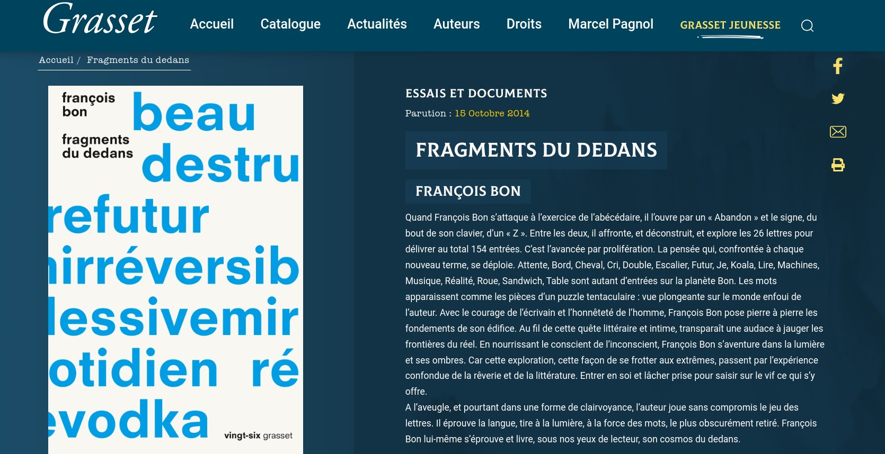

##  Éditorialisation : du chantier littéraire à l’oeuvre ouverte

<!-- .element: style="width:400px" -->

§§§§§§§§§§§§§§§§§§§§§§§§§§§§§§§§§§§§§§§§§§§§§
<!-- .slide: data-background-video="img/desordre.mp4" data-background-size="contain"--->

===

Désordre = site de Philippe de Jonckheere, un écrivain et artiste belge.

Présentation du site :

>un site où s'accumulent depuis 2001, en un immense bric-à-brac, les différents projets de l'artiste. On y déniche un carnet de notes et des fictions hypermédiatiques, mais aussi des photographies, des dessins, des casse-têtes, de nombreux hommages à des écrivains marquants, ainsi que des commentaires sur l'actualité. On y explore à loisir une mémoire qui se montre volontairement déstructurée, les efforts déployés par son auteur étant tout entiers dirigés vers une expérience de navigation sans cesse plus déroutante. L'internaute est invité à se perdre parmi les milliers de fichiers qui se trouvent sur le site — en 2004, le site en contenait déjà plus de 24 000! Faire l'expérience du Désordre, c'est aborder le Web comme un flâneur davantage intéressé par le processus qui mène à la découverte qu'au résultat lui-même.

§§§§§§§§§§§§§§§§§§§§§§§§§§§§§§§§§§§§§§§§§§§§§
<!-- .slide: data-background-image="img/desordre1.png" data-background-size="contain"--->

===

Arriver sur la page d'accueil de Desordre, c'est arriver sur un immense index (pensez à une table des matières) ici représentée sur l'interface comme une immense table de travail où des images s'empilent une à une. Chacune de ces images est une porte d'entrée vers une oeuvre. Vous cliquez, la page s'ouvre généralement dans une nouvelle fenêtre.

C'est un algorithme qui puise au hasard les oeuvres pour organiser cet index interactif. Autrement dit : on est face à une sorte de jeu de roulette russe.

Si vous quittez le site pour y revenir plus tard, la page d'accueil ne sera plus la même. Votre expérience de navigation est donc à chaque fois unique.

§§§§§§§§§§§§§§§§§§§§§§§§§§§§§§§§§§§§§§§§§§§§§

### Tour d'horizon du problème...
* Des pratiques d'écriture "automatiques"
* Un corpus fragile, disséminé et éphémère
* Des objets hyper/multimédiatiques
* Des "entrées", navigations, lectures, toujours différentes et singulières

===

Comme on ne se baigne pas deux fois dans le même fleuve, on ne lit pas deux fois le même Desordre.

Le désordre sans cesse se reconstruit, se réagence et s'augmente.

Cette dimension processuelle, instable, des objets numériques (si vous y pensez, n'importe quel site porte cette instabilité, à commencer par votre journal quotidien, ou encore votre réseau social préféré), porte un nom : on l'appelle l'éditorialisation.

Ce cours est dédié à ce concept clé de la culture et de la création numérique, puisque cela ne vous aura pas échappé : dans éditorialisation, nous retrouvons un peu le terme édition, pourtant quelque peu modifié.

§§§§§§§§§§§§§§§§§§§§§§§§§§§§§§§§§§§§§§§§§§§§§

### Problématiques

Ces pratiques d’écriture en ligne, qui déplacent à la fois les lieux et les instances de production, diffusion et validation des textes, relèvent-elles encore de l’édition ? Que désigne exactement le concept *éditorialisation* et quelles mutations du fait littéraire prend-il en charge ? Le statut ontologique de la littérature est-il en train de changer sous l'effet de l'éditorialisation ?

<!-- .element: style="font-size:1.7rem; text-align:justify" -->

§§§§§§§§§§§§§§§§§§§§§§§§§§§§§§§§§§§§§§§§§§§§§

### Sommaire

(1.) L'éditorialisation : présentation et discussion d'un concept

(2.) Le livre à l'heure de l'éditorialisation : le modèle du read/write book

(3.) Étude de cas : l'écrivain François Bon dans son chantier littéraire

§§§§§§§§§§§§§§§§§§§§§§§§§§§§§§§§§§§§§§§§§§§§§

## (1) L'éditorialisation

§§§§§§§§§§§§§§§§§§§§§§§§§§§§§§§§§§§§§§§§§§§§§
<!-- .slide: data-background-image="img/ngramEditorialisation.png" data-background-size="contain"-->

===

Le terme éditorialisation est un néologisme récent, forgé à partir de 2004, pour désigner de nouvelles pratiques éditoriales issues des technologies numériques. Le concept reste encore instable et débattu : clairement il fait l’objet d’un intérêt très fort, mais sa définition est encore en construction.

§§§§§§§§§§§§§§§§§§§§§§§§§§§§§§§§§§§§§§§§§§§§§
<!-- .slide: data-background-image="img/ngramEditorialisation.png" data-background-size="contain"-->
<!-- .slide: class="hover"-->

### Cartographie du concept
* Un néologisme récent (< 2004)
* Un concept interdisciplinaire
* Articulation théorie/pratique

===

Malgré ses frontières encore mouvantes (ce qui en fait d'ailleurs l'intérêt), le concept d'éditorialisation fédère un nombre croissant de chercheurs et d’institutions, dans une perspective interdisciplinaire. À vrai dire, les littéraires sont encore un peu à la traîne sur le terrain de l'éditorialisation, qui fait surtout l'objet d'études approfondies en info com (avec Louise Merzeau), philo (Gérard Wormser), design, bibliothéconomie...

Enfin, l’éditorialisation témoigne d'une forte volonté de faire dialoguer les théoriciens et les praticiens : ceux qui construisent des outils, des plateformes d’édition et de gestion des contenus, ceux qui réfléchissent aux conséquences culturelles, ontologiques de ces nouveaux outils. La notion implique en effet un dialogue constant entre théorie et pratique.

Entre théorie et pratique, les praticiens sont ainsi amenés à développer une approche critique de leurs outils et environnement, et de leur côté, les théoriciens doivent nécessairement ancrer leurs concepts sur des cas concrets et une connaissance technique de l’environnement numérique.

§§§§§§§§§§§§§§§§§§§§§§§§§§§§§§§§§§§§§§§§§§§§§

### 2004-2007: apparition du terme

  * Une "sorte" d'édition dans l'environnement numérique
  * Bruno Bachimont : le document numérique comme remédiation d'une ressource numérisée

===

Un auteur important : Bruno Bachimont qui met en avant le concept d'éditorialisation en 2007, dans un chapitre de *L’indexation multimédia* intitulé « Nouvelles tendances applicatives : de l’indexation à l’éditorialisation ».

Bruno Bachimont utilise le terme pour parler du passage d'un document non-numérique à un document numérique (on n’est pas seulement dans le texte littéraire, mais dans la question du document - archivistique et information)

§§§§§§§§§§§§§§§§§§§§§§§§§§§§§§§§§§§§§§§§§§§§§

> L’idée centrale de cet article est que l’indexation fine du contenu rendue possible pour le numérique introduit un rapport nouveau au contenu et au document. Alors que selon l’indexation traditionnelle l’enjeu est de retrouver le ou les documents contenant l’information recherchée, l’indexation fine du contenu permet de ne retrouver que les segments concernés par la recherche d’information et de paramétrer l’usage de ces segments. (...) Devenant des ressources, ces segments sont remobilisés pour la production d’autres contenus dont ils constituent les composants. La finalité n’est plus de retrouver des documents, mais d’en produire de nouveaux, à l’aide des ressources retrouvées. On passe ainsi de l’indexation pour la recherche à l’indexation pour la publication. Comme cette dernière s’effectue selon des règles et des normes, on parlera plutôt d’éditorialisation, pour souligner le fait que les segments indexés sont enrôlés dans des processus éditoriaux en vue de nouvelles publications.
>
> Bruno Bachimont, « Nouvelles tendances applicatives : de l’indexation à l’éditorialisation », in _L’indexation multimédia_, Paris, Hermès, 2007

<!-- .element: style="font-size:1.4rem; text-align:justify" -->

===
Pour Bachimont, l'éditorialisation est le processus par lequel une ressource est remédiatisée et remédiée en un nouveau document numérique, impliquant la ré-interprétation de la ressource.

Pour le dire autrement : en changeant de milieu, le document est amené à devenir autre.
Le processus d'indexation multimédia n'est donc plus seulement une forme d'édition mais d'éditorialisation (l'éditorialisation venant ici désigner ce changement de nature qui s'opère)

§§§§§§§§§§§§§§§§§§§§§§§§§§§§§§§§§§§§§§§§§§§§§

2008: institutionnalisation du concept
  * Séminaire «Écritures numériques et éditorialisation» (Sens Public, IRI, Dicen-IDF, UdeM)
  * De nouveaux documents et objets "natifs numériques"

===
À partir de 2008, le terme commence ainsi à s'institutionnaliser.

Notamment avec le séminaire "Écritures numériques et éditorialisation", où l'éditorialisation se conçoit comme un espace de débat et de réfléxion - nous vous invitons à consulter les archives vidéo disponibles en ligne, pour vous faire une idée plus précise de ce chantier théorique et pratique.

L'éditorialisation permet alors de penser un processus un peu plus complexe car ouvert à tous : auteurs, collectivités, plateformes (donc outils de type algorithme), dynamiques pratiques.

L'un des grand théoriciens du concept est Marcello Vitali-Rosati, dont nous allons présenter et discuter la pensée du concept.

§§§§§§§§§§§§§§§§§§§§§§§§§§§§§§§§§§§§§§§§§§§§§

> Davantage qu’un néologisme forgé pour marquer le passage au numérique, le concept d’éditorialisation vient répondre à des problématiques posées par ce nouveau modèle (numérique). Il est en effet essentiel de souligner (...) à quel point la notion d’éditorialisation peut changer notre manière d’habiter l’espace numérique. Parce qu’elle en souligne la structure, l’éditorialisation nous donne la possibilité de comprendre l’espace numérique et de comprendre le sens de nos actions dans cet espace : elle nous révèle les rapports entre les objets, les dynamiques, les forces, les dispositifs de pouvoir, les sources d’autorité.
>
> Vitali-Rosati, [_Qu'est-ce que l'éditorialisation?_, Sens public 2016](https://www.sens-public.org/article1184.html)

<!-- .element: style="font-size:1.7rem; text-align:justify" -->

===

Le concept d'éditorialisation souligne en premier lieu les différences entre les modèles éditoriaux classiques et les modèles éditoriaux numériques. Il se réfère à des pratiques éditoriales que l'on ne peut réduire à ce que l'on entend généralement par « édition ».

Là où l'éditorialisation restait chez Bachimont un processus assez limité, pas si éloigné de la curation de contenu, MVR développe - avec d'autres : Louise Merzeau, G. Wormser - une théorie assez ambitieuse qui tend à saisir les implications culturelles, épistémologiques et ontologiques de ce processes d'éditorialisation.

Dans l'article que vous aviez à lire pour aujourd'hui, 3 définitions sont données.

§§§§§§§§§§§§§§§§§§§§§§§§§§§§§§§§§§§§§§§§§§§§§

### 1. Définition restreinte

> Selon la définition restreinte, l’éditorialisation désigne l’ensemble des appareils techniques (le réseau, les serveurs, les plateformes, les CMS, les algorithmes des moteurs de recherche), des structures (l’hypertexte, le multimédia, les métadonnées) et des pratiques (l’annotation, les commentaires, les recommandations via les réseaux sociaux) permettant de produire et d’organiser un contenu sur le web. En d’autres termes, l’éditorialisation est une instance de mise en forme et de structuration d’un contenu dans un environnement numérique. On pourrait dire, en ce sens, que l’éditorialisation est ce que devient l’édition sous l’influence des technologies numériques.
>
> Vitali-Rosati, [_Qu'est-ce que l'éditorialisation?_, Sens public 2016](https://www.sens-public.org/article1184.html)

<!-- .element: style="font-size:1.6rem; text-align:justify" -->

===

la définition restreinte s’intéresse aux mutations des outils de l’édition numérique, qui se caractérise par l’apparition de nouveaux dispositifs et corps de métier, et la disparition d’autres dispositifs et corps de métier.

Si l’éditorialisation = ce que « devient l’édition sous l’influence des technologies », pourquoi ne parle-t-on pas simplement d’édition numérique ? Tout simplement parce que la mutation engagée par le déplacement de l’édition avec les outils numériques et sur le web est telle, qu’elle vient modifier en profondeur ce que l’on entend par édition : c'est ce que décrivait déjà Bachimont, finalement.

§§§§§§§§§§§§§§§§§§§§§§§§§§§§§§§§§§§§§§§§§§§§§

> L'éditorialisation façonne et structure les contenus sans se limiter à un contexte fermé et bien défini (comme une revue) ou à un groupe prédéfini d'individus (comme les éditeurs). Elle implique une ouverture de l'espace (plusieurs plateformes) et du temps (plusieurs contributions différentes, à des moments distincts). Cette ouverture est l'une des différences principales entre curation et éditorialisation et elle est aussi ce qui différencie l'éditorialisation de l'édition traditionnelle. L'ouverture de l'éditorialisation par rapport à l'édition papier détermine une certaine perte de contrôle de l'écrivain comme de l'éditeur sur le contenu. En effet, tous deux ne sont plus que des acteurs parmi d'autres du processus éditorial, qui s'élargit considérablement.
>
> Vitali-Rosati, [_Qu'est-ce que l'éditorialisation?_, Sens public 2016](https://www.sens-public.org/article1184.html)

<!-- .element: style="font-size:1.6rem; text-align:justify" -->

===

L’ouverture dans le temps et dans l’espace est devenue le principe fondateur de l’éditorialisation = nature PROCESSUELLE de l’éditorialisation. Or c’est justement cette ouverture que notre modèle éditorial avait cherché à verrouiller. Le principe de l’édition était de publier des textes qui devaient faire référence - on n’était pas supposés pouvoir les modifier sans cesse, et on devait les circonscrire dans un objet.

§§§§§§§§§§§§§§§§§§§§§§§§§§§§§§§§§§§§§§§§§§§§§

### 2. Définition large

> Dans un monde numérique connecté, exister signifie être éditorialisé. En effet, dans l'espace numérique, un objet doit être connecté et mis en relation avec les autres objets pour exister. (...) Pour qu'une personne existe dans l'espace numérique, elle doit avoir un profil sur Facebook, sur Twitter, sur LinkedIn ou sur une autre plateforme qui puisse l'identifier et la rendre visible. L'éditorialisation devient donc une condition d'existence. Or, sur la base de cette idée, éditorialiser ne signifie pas seulement produire des contenus, mais aussi produire la réalité elle-même. Selon cette définition très large, l'éditorialisation désigne l'ensemble des formes collectives de négociation du réel.
>
> Vitali-Rosati, [_Qu'est-ce que l'éditorialisation?_, Sens public 2016](https://www.sens-public.org/article1184.html)

<!-- .element: style="font-size:1.6rem; text-align:justify" -->

===
Mais si l’on s’est embêté à créer un néologisme, c’est aussi parce que ces mutations ont des conséquences culturelles, épistémologiques, et même ontologiques. C’est que l’éditorialisation doit aussi se comprendre à une échelle plus large, qui n’est pas seulement liée à la question des techniques/outils de production/diffusion/validation des textes : un changement plus profond serait en train de s’opérer - sur la définition même du savoir (connaissance renfermée dans les livres), de la littérature (ce qui fait littérature), de la culture.

C’est pour mesurer ce changement paradigmatique que l’on a pu forger une seconde définition de l’éditorialisation : **DEF**

Le problème de cette définition, c’est quelle est tellement large et essentialiste (on touche à la philo, et notamment à des questions ontologiques, liées au rapport entre réel et non-réel), qu’elle nous fait nous éloigner un peu de nos préoccupations du moment. Il ne s’agit pas de dire qu’elle est fausse, mais qu’elle touche plus à la science fondamentale qu’à la science appliquée. Or il est très urgent aujourd’hui de développer une théorie appliquée de l’édition.

§§§§§§§§§§§§§§§§§§§§§§§§§§§§§§§§§§§§§§§§§§§§§

### 3. Définition philosophico-pratique

> L'éditorialisation désigne l'ensemble des dynamiques qui produisent et structurent l'espace numérique. Ces dynamiques sont les interactions des actions individuelles et collectives avec un environnement numérique particulier.
>
> Vitali-Rosati, [_Qu'est-ce que l'éditorialisation?_, Sens public 2016](https://www.sens-public.org/article1184.html)

<!-- .element: style="font-size:1.6rem; text-align:justify" -->

===

[CITER]

Ainsi posée, cette définition reste un peu floue, en fait on peut la préciser en prenant en compte trois aspects implicites de l'éditorialisation : un aspect technologique, un aspect culturel et un aspect pratique. Mais le mieux est de prendre un exemple : le cas de Twitter.

§§§§§§§§§§§§§§§§§§§§§§§§§§§§§§§§§§§§§§§§§§§§§

### 3 aspects implicites de l'éditorialisation :
* Technologique : un environnement prescriptif (Twitter et ses 140/280 caractères)
* Culturel : Twitter n'a pas inventé la forme courte (maxime, Haiku, poésie...)
* Pratique : le pouvoir des usagers (invention du #)
* Bref, une dynamique stygmergique (A/R)

===

* Technologie :
Le terme éditorialisation a été créé en partie pour prendre en compte l'impact des technologies sur la production des contenus.

TWITTER : on peut faire de la littérature sur Twitter en 140#280 caractères !

> L'environnement numérique est prescriptif, car il détermine la forme des contenus qu'il héberge. La dimension technologique est donc fondamentale pour l'édition, mais en même temps, on ne peut pas réduire l'éditorialisation à ce seul aspect.

* Culture
Mais tout comme il faut prendre en compte l'impact des technologies sur la production des contenus - il faut en retour reconnaître l’impact de nos habitudes culturelles et de nos pratiques sur les technologies.
La forme elliptique n’a pas été inventée par Twitter !!!
// question de la contrainte = poésie.

* Pratiques
Le troisième et dernier aspect de l'éditorialisation – son aspect pratique – nous amène du côté des pratiques, sans lesquelles les structures culturelle et technologique ne pourraient exister.
> L'action de mettre un # avant un mot dans l'environnement Twitter fait de celui-ci un mot-clé. À l'origine, cette action n'avait pas été prévue par la plateforme, car Twitter n'avait pas été conçu pour gérer des mots-clés. Puis, un premier usager a commencé à utiliser le #, bientôt suivi d'un groupe de personnes, et cette action est devenue une pratique – pratique qui a obligé Twitter à adapter sa plateforme, pour prendre en compte les mots-clés – que nous appelons aujourd'hui des hashtags.

On a souvent tendance à craindre le technodéterminisme. Il faut comprendre le processus dans un cercle vertueux, bcp plus complexe qu’on ne le laisse penser.

§§§§§§§§§§§§§§§§§§§§§§§§§§§§§§§§§§§§§§§§§§§§§

### Caractéristiques de l'éditorialisation

- ouverte
  - plusieurs plateformes
  - plusieurs acteurs
  - toujours inachevée
- processuelle
- collective

§§§§§§§§§§§§§§§§§§§§§§§§§§§§§§§§§§§§§§§§§§§§§

### Portée de l'éditorialisation

>«La différence entre édition et éditorialisation n'est pas qu'une différence d'outils. Elle suggère plutôt une différence culturelle : l'éditorialisation n'est pas notre façon de produire du savoir en utilisant des outils numériques ; c'est notre façon de produire du savoir à l'époque du numérique, ou mieux, dans notre société numérique.»
>
> Vitali-Rosati, [_Qu'est-ce que l'éditorialisation?_, Sens public 2016](https://www.sens-public.org/article1184.html)

<!-- .element: style="font-size:1.6rem; text-align:justify" -->

===

Important : dimension performative de l'éditorialisation.

Éditorialiser, c'est faire, c'est créer.
- L'éditorialisation vient faire appel à une activité et une responsabilité accrue des acteurs-lecteurs
- L'éditorialisation implique aussi une série d'outils et de protocoles qui ne sont pas toujours maîtrisables

Là où l'édition trad était finalement très normée, avec des structures d'autorités très fortes, l'édito implique une perte de contrôle qui peut s'avérer problématique pour nos institutions, mais aussi pour nous, lecteurs-internautes. Comment sont triés les résultats d'un page Google ? Je peux influer sur les résultats via mes recommandations. En même temps je n'ai pas la main sur l'algorithme...

§§§§§§§§§§§§§§§§§§§§§§§§§§§§§§§§§§§§§§§§§§§§§

### Enjeux de l'éditorialisation

* Comment garantir la production, la circulation et la légitimation des contenus à l'ère numérique ?

§§§§§§§§§§§§§§§§§§§§§§§§§§§§§§§§§§§§§§§§§§§§§

## Nouvelles manières de lire, nouvelles façons de penser/voir le monde

>Plus on travaille avec les technologies numériques, plus on en vient à apprécier la capacité des machines programmables et en réseau à effectuer des tâches cognitives sophistiquées, et plus le clavier en vient à paraître une extension de ses propres idées plutôt qu’un instrument externe sur lequel on se contente de taper. L’incarnation prend alors la forme d’une cognition étendue, dans laquelle la capacité d’action et la pensée des humains sont impliquées dans des réseaux plus larges qui, au-delà de l’ordinateur de bureau, s’étendent à l’environnement. (Katherine Hayles, *Comment nous pensons*)

<!-- .element: style="font-size:1.5rem; text-align:justify" -->

§§§§§§§§§§§§§§§§§§§§§§§§§§§§§§§§§§§§§§§§§§§§§

## 2. Le livre à l'heure de l'éditorialisation : le modèle du read/write book

<!-- .element: style="width:400px" -->

§§§§§§§§§§§§§§§§§§§§§§§§§§§§§§§§§§§§§§§§§§§§§
<!-- .slide: data-background-image="img/readwrite.png" data-background-size="contain"-->

Source : Pierre Mounier et Marin Dacis *Read/Write Book*, [Livre 1](https://books.openedition.org/oep/128?lang=fr) et [Livre 2](https://books.openedition.org/oep/226?lang=fr).

<!-- .element: class="source" -->

===

Théorie du Read/Write book : terme emprunté à l'écriture informatique : en informatique, le RW web = principe inscrit dans le protocole http, qui consiste à dire que tout document n'est pas seulement "à lire", mais aussi à "écrire". Dans un protocole de communication, il y a des règles et actions de base protocolaires (on sert la main d'un pote, mais pas de son prof). En informatique, qd un navigateur demande à un serveur un document, il le fait selon les 2 actions de base suivante : get + post url. On a tendance à penser qu'en tant que consommateur, les documents que l'on consomme sont en lecture pure. Mais en fait, le principe du http est de créer des doc en écriture.
COncrètement, on n'a pas toujours le droit/ la permission d'écrire -- le protocole prévoit l'ouverture d'un droit d'écriture. Mais la possibilité de l'écriture est naturellement inscrite dans le protocole http.

§§§§§§§§§§§§§§§§§§§§§§§§§§§§§§§§§§§§§§§§§§§§§
## Read/Write ?
* L'avenir du livre est d'être scriptible (par le lecteur)
* Livre "en ligne" : fonction de réappropriation

>Le livre n’est pas que lecture, c’est aussi une interface adaptée pour écrire, chercher, annoter… C’est le livre qui s’écrit et se lit. C’est le Read/Write Book. ([Qu'est-ce qu'un livre à l'heure du numérique ? Hubert Guillaud](https://books.openedition.org/oep/147))

<!-- .element: style="font-size:1.6rem; text-align:justify" -->

===

Le read/write book est une proposition pour penser la remédiation du livre, hors de la tentation homothétique. Pas nécessairement une technologie "spectaculaire" (comme on a vu avec les livres-arts), mais, une philosophie du livre "ouvert".

Pour les éditeurs traditionnels, le livre est forcément uniquement lisible. Or ce que l'idée du RW book défend soudain, c'est la possibilité de lire + écrire le livre. Vers une édition différente : édition continue, par exemple.

§§§§§§§§§§§§§§§§§§§§§§§§§§§§§§§§§§§§§§§§§§§§§

## Des lectures qui "font" le livre, des exemplaires uniques

>Vous ne lisez pas de la même façon selon le support ou l’outil que vous utilisez. Pas plus que vous ne commentez un livre de la même façon dans un forum généraliste ou dans une discussion entre spécialistes. Le but de l’électronique est de faciliter nos objectifs finaux, qui sont, comme le disait Alberto Manguel dans _Une histoire de la lecture_, différents pour chacun. L’électronique personnalise nos lectures : nous n’aurons plus un même exemplaire, mais chacun aura le sien, avec des couches d’information qui nous seront en partie personnelles, et d’autres que l’on partagera avec des amis ou d’autres lecteurs. ([Qu'est-ce qu'un livre à l'heure du numérique ? Hubert Guillaud](https://books.openedition.org/oep/147))

<!-- .element: style="font-size:1.4rem; text-align:justify" -->

§§§§§§§§§§§§§§§§§§§§§§§§§§§§§§§§§§§§§§§§§§§§§

## Des livres modulaires

>Avec l’économie de l’attention, c’est la posture de lecture qui est renouvelée. Accéder à un livre dépendait de modalités simples : l’achat ou l’emprunt. Avec le numérique, la gamme des modes d’accès s’élargit. On peut louer un livre de nombreuses manières : n’avoir accès qu’à des extraits, ou encore n’avoir accès que sur un type de support (comme cherche à le faire en partie le Kindle d’Amazon). ([Qu'est-ce qu'un livre à l'heure du numérique ? Hubert Guillaud](https://books.openedition.org/oep/147))

<!-- .element: style="font-size:1.6rem; text-align:justify" -->

===
Pour un titre = plusieurs formats, correspondant à différents mode de consommation, cad différents modes de lecture.

Ainsi, la plupart des éditeurs proposent, parfois pour le même prix, un "Pack livre" avec plusieurs formats distincts :
- imprimé
- numérique PD
- numérique pour application liseuse
- numérique sur un site web...

§§§§§§§§§§§§§§§§§§§§§§§§§§§§§§§§§§§§§§§§§§§§§
<!-- .slide: data-background-image="img/abrupt.png" data-background-size="contain"-->

§§§§§§§§§§§§§§§§§§§§§§§§§§§§§§§§§§§§§§§§§§§§§
<!-- .slide: data-background-image="img/jeanneyformats.png" data-background-size="contain"-->

§§§§§§§§§§§§§§§§§§§§§§§§§§§§§§§§§§§§§§§§§§§§§

## Vers de nouveaux contrats de lecture
* Appropriation
* Annotation
* Partage

===

cela peut semble redondant, mais non. Derrière ces multiplicités de format, il y a l'idée que de nouveaux contrats de lecture se dessinent.

Tout est fait pour favoriser les actions du lecteur : pour que le livre soit un objet "pratique", manipulable. Garantir une appropriation.

§§§§§§§§§§§§§§§§§§§§§§§§§§§§§§§§§§§§§§§§§§§§§

## Vers une nouvelle "économie" de l'attention (Yves Citton)
* Apprendre à tisser le fil de l'attention / de la distraction
* Vers des environnements interactifs
* Vers plus de modularité
* Vers des modèles d'appropriation

===

Cela nous rappelle évidemment ce que l'on a discuté lors du cours de com.

§§§§§§§§§§§§§§§§§§§§§§§§§§§§§§§§§§§§§§§§§§§§§

>Dans l’ancien modèle, celui du livre papier, seules les publications les plus rentables existent (font l’objet d’une décision de publication favorable). La rareté est donc du côté des publications. Dans le nouveau contexte, toutes les publications possibles existent : ce sont alors les lecteurs qui deviennent rares. C’est le fondement de ce qu’on appelle l’économie de l’attention, avec une conséquence importante : si ce sont les lecteurs qui sont rares et non plus les publications (relativement les unes aux autres), alors les barrières d’accès aux documents deviennent contre-productives. Le principal souci des publications est désormais d’être lues, connues et reconnues. ([Pierre Mounier « L’édition en ligne : un nouvel eldorado pour les sciences humaines »](https://books.openedition.org/oep/169))

<!-- .element: style="font-size:1.6rem; text-align:justify" -->

§§§§§§§§§§§§§§§§§§§§§§§§§§§§§§§§§§§§§§§§§§§§§

## Un exemple d'édition "continue"

§§§§§§§§§§§§§§§§§§§§§§§§§§§§§§§§§§§§§§§§§§§§§
<!-- .slide: data-background-image="img/communs1.png" data-background-size="contain" -->

Source : *Sens public*

<!-- .element: class="source" -->

§§§§§§§§§§§§§§§§§§§§§§§§§§§§§§§§§§§§§§§§§§§§§
<!-- .slide: data-background-image="img/commun2.png" data-background-size="contain"-->

Source : *Sens public*

<!-- .element: class="source" -->

§§§§§§§§§§§§§§§§§§§§§§§§§§§§§§§§§§§§§§§§§§§§§
<!-- .slide: data-background-image="img/communs3.png" data-background-size="contain"-->

Source : *Sens public*

<!-- .element: class="source" -->

§§§§§§§§§§§§§§§§§§§§§§§§§§§§§§§§§§§§§§§§§§§§§

### Quel modèle économique : fin du modèle unitaire ?
* Repenser le produit : qu'est-ce que l'on vend ?
    * Un accès (Amazon) ?
    * Des espaces publicitaires (blogues) ?
    * Un objet (l'imprimé dans les chaînes hybrides)?
    * Des services (comptes "Premium") ?

§§§§§§§§§§§§§§§§§§§§§§§§§§§§§§§§§§§§§§§§§§§§§

>Dans une économie de l’attention, le plus important n’est pas le contenu (on le trouve ailleurs, autrement, sous une autre forme), mais le service ajouté, individualisé et proposé au lecteur. Quel avantage pouvez-vous lui apporter ? Ceux qui ont la lourde tâche d’imaginer les services numériques de demain doivent se donner pour tâche de donner du pouvoir à l’utilisateur ! Plus il lui sera offert d’interactions, de libertés, de possibilités, plus il se tournera vers ces services-là. Les offres trop fermées (exploitant un seul catalogue), trop limitatives (DRM qui interdisent l’impression, la copie sur plusieurs supports, absence de solutions sociales…), seront autant d’éléments qui ne joueront pas en votre faveur dans une économie de l’attention. ([Qu'est-ce qu'un livre à l'heure du numérique ? Hubert Guillaud](https://books.openedition.org/oep/147))

<!-- .element: style="font-size:1.4rem; text-align:justify" -->

§§§§§§§§§§§§§§§§§§§§§§§§§§§§§§§§§§§§§§§§§§§§§

## L'utopie du [Read/Write] en résumé
* Dans le paradigme numérique, écrire, c'est lire ; lire, c'est écrire
* D'un point de vue techno-optimiste : une production de la culture collaborative, ouverte, dynamique
* D'un point de vue techno-défaitiste : des données mal maîtrisées, la menace d'un illettrisme numérique
* Concepts à retenir : économie de l'attention, niveaux d'écriture, données, métadonnées

<!-- .element: style="font-size:1.6rem; text-align:justify" -->

§§§§§§§§§§§§§§§§§§§§§§§§§§§§§§§§§§§§§§§§§§§§§

### Objection : un parti pris utopique et biaisé ?

* Tous les contenus (texuels, visuels, sonores... savants, littéraires, etc.) peuvent-ils être conçus et traités de la même manière ?

===
L'objection principale au Read/Write book, c'est qu'il s'intéresse essentiellement au domaine de l'édition savante, voire de l'essai. Un domaine où l'écrivain, autrement dit, occupe une activité professionnelle qui lui permet d'écrire, mais sans être dépendant des profits liés à la vente d'ouvrages.

Que se passe-t-il en revanche pour un écrivain littéraire ?

§§§§§§§§§§§§§§§§§§§§§§§§§§§§§§§§§§§§§§§§§§§§§

### Editorialisation et littérature : de nouvelles frontières ?

* Où commence/s'arrête l'oeuvre littéraire sur le web ?
* Qui/ Qu'est-ce qui fait autorité sur le web ?
* Quel est le rôle du lecteur ?

===

Repensons au Cas de P. De Jonckheere

§§§§§§§§§§§§§§§§§§§§§§§§§§§§§§§§§§§§§§§§§§§§§

## 3. Éditorialisation et littérature : François Bon dans son chantier numérique

===

§§§§§§§§§§§§§§§§§§§§§§§§§§§§§§§§§§§§§§§§§§§§§
<!-- .slide: data-background-image="img/6165686178_548dbd0bf9_b.jpg" -->

===

Texte important : Après le livre de F. Bon. Paru en 2011

§§§§§§§§§§§§§§§§§§§§§§§§§§§§§§§§§§§§§§§§§§§§§

>Nous vivons une des très rares mutations de l’écrit. Rares (la tablette, le rouleau, le codex, l’imprimerie), mais chaque fois irréversibles et globales.

>Ce que change Internet, ce n’est pas le rapport au livre, c’est le rapport au monde. Le numérique affecte la façon dont on écrit aussi bien que celle dont on lit, nos bibliothèques comme la trace que nous laissons parmi les autres.

>Il ne s’agit pas ici de prédire. Prendre le temps, au contraire, de considérer l’histoire récente de notre propre rapport à ces machines, comment nous nous en servons, ce qu’elles ouvrent de possibles. Prendre le temps de revenir à quelques oeuvres décisives, celles de Balzac ou de Rabelais en font partie, qui sont elles-mêmes l’empreinte d’une de ces transitions. Alors peut-être accepterons-nous de voir que s’offrent pour nos fables, nos récits, nos lettres, nos carnets privés, nos images aussi, d’autres vecteurs, une autre mémoire et de nouveaux modes de transmission.

>Nous sommes déjà après le livre.

<!-- .element: style="font-size:1.6rem; text-align:justify" -->

===

Première  question : les nouvelles formes de publication sur le web seraient-elles vraiment en train de détruire la stabilité du texte autrefois permise par l’imprimé ?

Réflexion préliminaire : la question de la stabilité et de la clôture...

§§§§§§§§§§§§§§§§§§§§§§§§§§§§§§§§§§§§§§§§§§§§§

### "Baudelaire n'a jamais écrit  les _Fleurs du mal_"
* Qu'est-ce qu'une "oeuvre" littéraire ?
* Discussion des enjeux de clôture et de stabilisation
* Le livre-nombreux : vers une nouvelle conception du texte et de la littérature

===

“Baudelaire n’a jamais écrit Les fleurs du mal”. Cette proposition polémique est le titre, un brin provocateur, du 11e chapitre d’Après le livre. Nous aurait-on alors menti ? Baudelaire ne serait pas le véritable auteur des Fleurs du mal, cette oeuvre qui compte parmi les plus connues de la littérature française ? Là n’est pas la question. François Bon n’a nullement la volonté d’ôter à Baudelaire la paternité de son oeuvre. Il s’agit plutôt de remettre en question le concept même d’oeuvre, comprise comme le résultat d’une intention explicite et forte de l’écrivain - dont le livre imprimé serait la matérialisation finale, stable et la pérenne. Dire que « Baudelaire n’a pas écrit Les Fleurs du mal », dans ce contexte, c’est donc affirmer que Les Fleurs du mal n’existent pas “en soi” comme une entité unique, autonome, et close sur elle-même, que l’auteur aurait imaginée et conçue d’un seul jet.

§§§§§§§§§§§§§§§§§§§§§§§§§§§§§§§§§§§§§§§§§§§§§
<!-- .slide: data-background-image="img/Fleurs_du_mal.jpg" -->

§§§§§§§§§§§§§§§§§§§§§§§§§§§§§§§§§§§§§§§§§§§§§

### Une généalogie complexe, une clôture factice

- Manuscrit perdu confié à Charles Asselineau (vers 1850)
- 1ère édition par Auguste Poulet-Malassis, attaquée et censurée (1857)
- 2nde édition chez Poulet-Malassis, sans les poèmes censurés + "Tableaux Parisiens" (1861)
- Édition de _Les Épaves_ par Poulet-Malassis (1866)
- 4e Édition avec 151 poèmes (1868)
- 1949 : première "édition complète" autorisée

===

De ce point de vue, il faut bien dire que François Bon a plutôt raison, comme le montre la généalogie complexe des Fleurs du mal. On sait en effet qu’il a d’abord existé un premier manuscrit relié du recueil, aujourd’hui perdu, que le poète avait confié à son ami écrivain Charles Asselineau, vers 1850 - le contenu exact de cette version est indéterminé. En 1857, une première édition des Fleurs du mal est publiée et tirée à 1300 exemplaires par le jeune éditeur Auguste Poulet-Malassis.
Attaquée pour outrage aux bonnes moeurs, puisque des poèmes comprennent des connotations érotiques à peine dissimulées, cette édition sera censurée.

Loin de se décourager, Auguste Poulet-Malassis, auquel Baudelaire a cédé les droits de reproduction exclusifs, propose une nouvelle édition du recueil en 1861. Le poète y supprime les 6 poèmes ayant fait l’objet d’une censure, mais en ajoute 32, pour un total de 126 poèmes - dont une nouvelle section, et non la moindre, celle des « Tableaux parisiens ». Cinq ans plus tard (1866), alors qu’il est exilé en Belgique pour échapper à la justice Française, Poulet-Malassis fait paraître Les Épaves, un recueil qui compte 23 poèmes de Baudelaire, dont les 6 qui avaient été censurés dans la première édition… L’ouvrage, évidemment, est condamné, mais il est considéré par les spécialistes comme la 3è édition des Fleurs du mal. Et ce n’est pas fini ! Après le décès de Baudelaire, une quatrième édition est publiée en 1868 qui comprend un total de 151 poèmes, sans ceux qui ont été condamnés par la censure - lesquels sont parallèlement re-publiés à Bruxelles en 1869, dans un Complément aux Fleurs du Mal de Charles Baudelaire, avec le recueil Les Épaves...

Tout cela pour dire, en fin de compte, que le public n’a pu lire une version “complète” des Fleurs du Mal qu’en 1949 (!), suite à un jugement de la Chambre criminelle de la Cour de cassation, qui a révisé l’ensemble des condamnations pour outrage aux bonnes mœurs commis par la voie du livre…

§§§§§§§§§§§§§§§§§§§§§§§§§§§§§§§§§§§§§§§§§§§§§

### Le livre-nombreux

> Peut-être “Les Fleurs du mal” est-il le livre le plus nombreux dans ma bibliothèque. Paradoxe de l’expression, mais comment dire autrement qu’il est présent dans la pièce où je travaille en tant d’éditions successives ou critiques, ou poche – ou ultra-poche… ?
>
> François Bon _Après le livre_, chapitre "Baudelaire n'a jamais écrit les Fleurs du mal" (2011)

<!-- .element: style="font-size:1.6rem; text-align:justify" -->

===

La proposition de François Bon est donc particulièrement originale : l’expression de « livre nombreux » qu’il utilise, désigne non seulement les versions du texte mais aussi les versions du livre - soit de l’inscription médiatique du texte.
En effet, on a bien vu que c’était aussi la mise en livre, le processus éditorial, qui avait construit une œuvre comme les Fleurs du mal, dont les éditions et rééditions ont été si nombreuses que Baudelaire lui-même n’en aura jamais vu l’état définitif. Le critère de “vérité du texte” doit alors prendre en compte cette multiplicité textuelle mais aussi matérielle, une multiplicité constitutive de la plupart des oeuvres littéraires - autant imputable à l’écrivain, qui aura construit une oeuvre sur plusieurs années), qu’à l’éditeur, qui est lui aussi l’architecte du livre.

§§§§§§§§§§§§§§§§§§§§§§§§§§§§§§§§§§§§§§§§§§§§§

### Le Chantier littéraire de _Fragments du dedans_

> Tout chantier d’écriture s’insère d’abord sur le site. Et puis vient un moment où le livre prend le relais, exige d’autres outils, d’autres reprises et approches.
>
> François Bon (Le Tiers livre)

<!-- .element: style="font-size:1.6rem; text-align:justify" -->

<!-- .element: style="width:400px" -->

===

Il faut bien dire que les contenus diffusés en ligne sont sans cesse susceptibles d’être modifiés, altérés ou même supprimés : ils nous est tous arrivé au moins une fois de cliquer sur un “lien mort”, par exemple. Dans le domaine littéraire, cette instabilité ou fragilité technique redouble d’ailleurs celle des contenus publiés : sur le web, les écrivains et écrivaines se servent en effet de leur blogue ou de leur site pour diffuser des brouillons, des versions inachevées ou partielles d’un récit, chapitre par chapitre.

Sur les réseaux sociaux comme Twitter, ils se lancent dans des expériences exigeantes d’écriture “en direct”, donnant quotidiennement rendez-vous à leurs lecteurs - abonnés pour livrer les fragments d’un récit en construction. Pour le lecteur, l’occasion est enfin donnée d’assister à l’élaboration progressive d’un texte, et de voir les coulisses du travail littéraire. Le processus d’écriture se révèle, comme jamais, en train de se faire.

Ces chantiers à ciel ouvert que sont les blogues et les réseaux sociaux transgressent certains concepts encore très forts dans l’imaginaire littéraire et éditorial, à commencer par l’auteur et l’oeuvre. Là où le livre imprimé constituait le résultat final et très élaboré d’un travail de longue haleine, mené sur plusieurs années, mais dont rien ne filtrait, le web donne enfin à voir le travail d’écriture en amont. La conception même de l’oeuvre littéraire s’en trouve changée. Non seulement l’instabilité et le caractère inachevé du texte ne sont plus tabous.

§§§§§§§§§§§§§§§§§§§§§§§§§§§§§§§§§§§§§§§§§§§§§

### L'écriture-performance

>“Écrire n’est pas un scénario, un plan, mais comment la matière qu’on affronte sera subversion de ce scénario ou de ce plan, de l’intuition obscure qu’on en a. Le caractère nécessaire de la logique interne d’une oeuvre s’exprimant donc plutôt par l’écart qu’elle impose aux intuitions qui en sont l’origine. Le site Internet pourrait bien, alors, comme le soulignent ses détracteur, se révéler dangereux pour les grandes constructions de l’esprit : il rend inopérante la contrainte d’écart.”
>
> François Bon (Le Tiers livre)

<!-- .element: style="font-size:1.6rem; text-align:justify" -->

===
Certains écrivains mettent en scène, dans ce qui devient parfois un véritable méta-récit, l’élaboration du texte. Dans les chantiers littéraires en ligne, l’écriture est ainsi transformée en une performance.

Cette écriture-performance, François Bon l’a mise en pratique avec Fragments du dedans - un livre publié chez Grasset, mais dont le “chantier” a d’abord été publié en ligne.

Pour François Bon en effet, “tout chantier d’écriture s’insère d’abord sur le site. Et puis vient un moment où le livre prend le relais, exige d’autres outils, d’autres reprises et approches.” Le web-chantier ne se conçoit donc pas comme un “concurrent” du livre, mais comme une expérience alternative, autonome, qui servira de pierre d’assise à la constitution de celui-ci. Ce que François Bon publie en ligne, c’est bien cette performance qu’est l’écriture - “non pas le livre, mais ce pré-travail sur le web, l’étape embryonnaire aux 2/3 de la constitution du livre, en l’état”.

§§§§§§§§§§§§§§§§§§§§§§§§§§§§§§§§§§§§§§§§§§§§§
<!-- .slide: data-background-image="img/fragmentsDuDedans.png" -->

===
>C’était au printemps 2013. Je reçois par mail la proposition de Jeanne Garcin, éditrice chez Grasset : un abécédaire, prise de risque sous la protection de l’alphabet, tentative par l’écart, puisque aucun des auteurs sollicités ne serait chez son éditeur habituel.

Premiers rendez-vous, lente approche, le courant passe, frappé par la détermination, la qualité aussi des maquettes. Content aussi de retrouver dans cette collection quelques ferrailleurs de langue amis. Je me lance à l’été 2013, dans le petit hameau de Tartonne, dans les Alpes de Haute-Provence, mais l’écriture va continuer, le plus souvent hors domicile, dans les trains, les hôtels, les bistrots de passage, jusque vers juin 2014.

Comme d’ordinaire, tout chantier d’écriture s’insère d’abord ici sur le site. Et puis vient un moment où le livre prend le relais, exige d’autres outils, d’autres reprises et approches. Les mots les plus dangereux (roman) viendraient tout à la fin.

Sur le livre, voir autres billets de cette rubrique, et bien sûr possible de le commander ci-dessous, version papier ou numérique. Et c’est aussi une manière de soutenir le travail qui se fait ici en ligne.

§§§§§§§§§§§§§§§§§§§§§§§§§§§§§§§§§§§§§§§§§§§§§
<!-- .slide: data-background-image="img/fragmentdededansSite.png" data-background-size="contain"-->

===

Ci-dessous, non pas le livre, mais ce pré-travail sur le web, l’étape embryonnaire aux 2/3 de la constitution du livre, en l’état... Et, comme on le constatera, le titre aussi a surgi tout à la fin, en complicité avec J.G.

FB, août 2015

§§§§§§§§§§§§§§§§§§§§§§§§§§§§§§§§§§§§§§§§§§§§§
<!-- .slide: data-background-image="img/fragmentDeDedansGrasset.png" data-background-size="contain"-->

===

Évidemment, il n’est pas toujours aisé pour les éditeurs de comprendre ce genre de démarche… Beaucoup d’entre eux demandent en effet aux écrivains d’effacer les traces des chantiers en ligne, de peur que les lecteurs ne voient pas bien l’intérêt d’acheter un livre dont une part du contenu est disponible gratuitement sur le web. C’est bien mal comprendre ce qui se joue fondamentalement ici : car pour le lecteur, justement, ce sont deux expériences de lecture bien différentes ! L’une, sur le web, consiste à suivre une performance d’écriture et un récit discontinu - il faut en effet patienter entre les publications, et le sens du texte semble toujours en suspens. L’autre expérience, à travers le livre, consiste à lire un récit linéaire, dont la clôture balise par ailleurs un horizon d’attente bien différent. Comme avec Les Fleurs du mal de Baudelaire, le texte se révèle donc “nombreux” depuis ses racines en ligne jusqu’au livre imprimé. Et le dispositif éditorial, ici, ne doit pas être pensé du point de vue des contenus, mais bien depuis celui de l’expérience de lecture.

§§§§§§§§§§§§§§§§§§§§§§§§§§§§§§§§§§§§§§§§§§§§§

### Le cas _Limite_ de François Bon
* Un chantier inversé
* La réouverture du livre

===

À première vue, ces chantiers littéraires en ligne pourraient passer pour une étape transitoire vers l’imprimé, dont l’autorité et la stabilité resteraient indétrônable. Le bon vieux livre papier viendrait clore un chantier numérique dont il serait la finalité. Ce serait là bien mal connaître François Bon qui, en 2010, s’est lancé dans un travail un peu fou de récriture en ligne de son second roman, Limite. Travail “fou” car François Bon à dû retaper tout son texte à la main, puisqu’il n’existait pas de copie originale numérique de cet ouvrage paru en 1985 chez Minuit. En d’autres termes, l’auteur a procédé à contre-courant de ce que propose le modèle éditorial traditionnel, en “réouvrant” le chantier d’un livre publié 25 ans plus tôt…

§§§§§§§§§§§§§§§§§§§§§§§§§§§§§§§§§§§§§§§§§§§§§
<!-- .slide: data-background-image="img/limite01.png" data-background-size="contain"-->

===

Écrit dans les années 1980, alors que François Bon était encore un “jeune” auteur méconnu, Limite était épuisé depuis déjà bien longtemps et l’éditeur, Minuit, n’avait pas le projet de le rééditer.

§§§§§§§§§§§§§§§§§§§§§§§§§§§§§§§§§§§§§§§§§§§§§
<!-- .slide: data-background-image="img/limite02.png" data-background-size="contain"-->
<!-- .slide: class="hover"-->

===
En accord avec la maison d’édition, François Bon a donc décidé de rendre disponible à nouveau cet ouvrage, en le recopiant et le republiant lui-même sur son site web, le Tiers livre.

§§§§§§§§§§§§§§§§§§§§§§§§§§§§§§§§§§§§§§§§§§§§§

>Alors scanner et préparer l’epub ? Non : 30 ans après, j’ai décidé de tout recopier à la main sur mon ordi. Bien sûr, quelques phrases ont changé, peut-être un ou deux passages ont-ils sauté, quelques adjectifs ont été virés à la soufflette. Mais l’équilibre d’une langue est comme hors de l’auteur, on n’y touche pas. C’est très surprenant aussi combien on le découvre mémorisé, organiquement lié à vous-même, bien au-delà du souvenir conscient.

<!-- .element: style="font-size:1.4rem" -->

===

Question du choix technique :  pas de format numérique, initialement tapé à la machine (tapuscrit)... Le plus "simple" serait d'en proposer une numérisation, un peu sur le modèle de ce que propose la BN, par exemple.

Mais FB va préférer travailler directement dans son site web : donc nécessité de tt recopier à la main. CITER

§§§§§§§§§§§§§§§§§§§§§§§§§§§§§§§§§§§§§§§§§§§§§

>Encore un travail qui a commencé par le site, et restera en ligne ci-dessous.
Ecrit en 1985 à la Villa Médicis sur une machine à écrire électrique Adler (j’avais déjà à endurer quelques commentaires de collègues traditionnalistes sur le fait que j’utilisais un engin aussi futuriste), je n’avais pas de version numérique de Limite, dont j’ai pu il y a 3 ans récupérer les droits aux éditions de Minuit, qui l’avaient laissé en déshérence. Irène Lindon a eu l’élégance d’accepter, moi je voudrais bien récupérer les droits de tous mes livres au-delà de 10 ans d’exploitation, c’est une des raisons qui m’a conduit à fonder ma propre maison d’édition.

<!-- .element: style="font-size:1.4rem" -->

===

Encore un travail qui a commencé par le site, et restera en ligne ci-dessous.
Ecrit en 1985 à la Villa Médicis sur une machine à écrire électrique Adler (j’avais déjà à endurer quelques commentaires de collègues traditionnalistes sur le fait que j’utilisais un engin aussi futuriste), je n’avais pas de version numérique de Limite, dont j’ai pu il y a 3 ans récupérer les droits aux éditions de Minuit, qui l’avaient laissé en déshérence. Irène Lindon a eu l’élégance d’accepter, moi je voudrais bien récupérer les droits de tous mes livres au-delà de 10 ans d’exploitation, c’est une des raisons qui m’a conduit à fonder ma propre maison d’édition.

§§§§§§§§§§§§§§§§§§§§§§§§§§§§§§§§§§§§§§§§§§§§§

>Et c’est dans ces heures de dactylographie (le découpage des billets ici en témoigne, une douzaine de grandes séances) que me revenaient aussi les sources, les événements, les intuitions – des moments qui touchaient parfois à l’écriture, parfois aux racines autobiographiques. « Le deuxième livre est toujours le plus difficile à écrire », c’est une phrase de Jérôme Lindon, le directeur des éditions de Minuit, à réception du premier état du manuscrit, qui portait alors pour titre Terrain glissant. J’ai décidé que cette phrase serait le titre de ce livre imprimé, spécialement composé pour accueillir cette démarche.

<!-- .element: style="font-size:1.4rem" -->

===

Et c’est dans ces heures de dactylographie (le découpage des billets ici en témoigne, une douzaine de grandes séances) que me revenaient aussi les sources, les événements, les intuitions – des moments qui touchaient parfois à l’écriture, parfois aux racines autobiographiques. « Le deuxième livre est toujours le plus difficile à écrire », c’est une phrase de Jérôme Lindon, le directeur des éditions de Minuit, à réception du premier état du manuscrit, qui portait alors pour titre Terrain glissant. J’ai décidé que cette phrase serait le titre de ce livre imprimé, spécialement composé pour accueillir cette démarche.

§§§§§§§§§§§§§§§§§§§§§§§§§§§§§§§§§§§§§§§§§§§§§
<!-- .slide: data-background-image="img/limite001.png" data-background-size="contain"-->

===

Tradition de Jérôme Lindon chez Minuit : refuser systématiquement les second manuscrits en l'état. Les auteurs devaient entièrement les reprendre. Personne n'y échappe. Jean ECHenoz raconte comment il a mit des années après le refus de son second MS pour oser réécrire, et renvoyer quelque chose à Lindon.

FB lui aussi, en son temps, a vu son second manuscrit refusé :

>Quand je revois Jérôme Lindon, en juin 1985, le manuscrit s’appelle Terrain glissant. Quand j’entre dans son bureau, il raccroche son téléphone : – Marguerite Duras me dit que c’est un très mauvais titre... Jamais su si c’était réel ou un de ses rituels, pour lui l’édition tenait du jeu, mais c’est avec nous qu’il jouait, on était gagnant aussi. Et c’est lui qui proposera Limite.

Le livre devra en effet subir de grosses modifications.

Mais cette fois, FB joue avec la formule de Lindon, pour en faire dériver quelque peu le sens : "Le second livre est toujours le plus difficile à écrire"... même si, ici, ce sera plutôt une seconde version du livre. Un livre réécrit plus 20 ans après sa première publication.

§§§§§§§§§§§§§§§§§§§§§§§§§§§§§§§§§§§§§§§§§§§§§

### (1) Un travail de republication
* Un livre "recopié" à la main pour être numérisé
* Des modifications mineures (syntaxe, vocabulaire)

===

En effet, il faut bien comprendre que le travail de recopiage auquel se livre FB, va finalement constituer un travail de réécriture à part entière qui va changer le sens de l'oeuvre.

Tout d'abord, il s'agit d'un travail de l'ordre de la republication : Cette réédition numérique permet d’apporter quelques modifications mineures au texte : de l’aveu même de l’auteur, “quelques phrases ont changé, peut-être un ou deux passages ont-ils sauté, quelques adjectifs ont été virés à la soufflette” (Bon, Tiers livre).

§§§§§§§§§§§§§§§§§§§§§§§§§§§§§§§§§§§§§§§§§§§§§

### 2. Un travail de remédiation (du papier au numérique)
* De la forme linéaire à la forme fragmentée et hypertextuelle
* Transformation du roman en feuilleton
* Nouvelle expérience de lecture

===

2. Travail de remédiation

Par ailleurs, en choisissant de ne pas produire un livre numérique (epub), mais une série de posts de blogue publiés à intervalles réguliers, François Bon transforme le roman Limite en feuilleton : le texte est fragmenté, soit découpé en 12 parties. Il se transforme alors en hypertexte, là où la version imprimée privilégiait une forme linéaire.

§§§§§§§§§§§§§§§§§§§§§§§§§§§§§§§§§§§§§§§§§§§§§

### 3. Un travail de rétro-médiation
* Augmentation du récit original (création d'un méta-récit)
* Retour "à la forme initiale, en amont de la première publication”
* _Virtualisation_ du texte : de l’édition à l’éditorialisation, revenir aux origines du geste créatif

===

Mais surtout, au fur et à mesure qu’il se prête à cet exercice de dactylographie à première vue bien mécanique, l’écrivain redécouvre son propre texte et entame la construction d’un métarécit à caractère autobiographique, établissant des ponts entre la fiction (Limite) et un récit rétrospectif sur son parcours d’écrivain.

En republiant en ligne Limite, François Bon réouvre donc le chantier du roman, pour en créer une version augmentée qui explore les potentialités du texte au-delà de toute exigence de stabilité et de clôture. Dans sa forme imprimée, Limite, tel que publié chez Minuit, aura été un moment du texte - mais pas le seul !

§§§§§§§§§§§§§§§§§§§§§§§§§§§§§§§§§§§§§§§§§§§§§
<!-- .slide: data-background-image="img/limiteExemple1.png" data-background-size="contain"-->

§§§§§§§§§§§§§§§§§§§§§§§§§§§§§§§§§§§§§§§§§§§§§
<!-- .slide: data-background-image="img/limiteEx2.png" data-background-size="contain"-->

§§§§§§§§§§§§§§§§§§§§§§§§§§§§§§§§§§§§§§§§§§§§§

### Conclusion
De l'édition à l'éditorialisation, la fonction éditoriale est amenée à se repenser entièrement. Dans les modèles de publication (*rendre public*) numérique, le livre imprimé n'est pas nécessairement exclu, bien au contraire, mais il sera reconsidéré comme un **moment** du texte : moment de cristallisation d'une pensée, d'une oeuvre. Ainsi, sur le web, nous pouvons repérer un déplacement de la littérature qui, d'une attention entièrement tournée vers l'oeuvre, se concentre désormais vers l'écriture (comme une performance). Éditorialiser, en ce sens, engage une perte de contrôle des instances traditionnelles, redistribuées notamment à l'auteur, mais aussi à l'usager, au lecteur.

<!-- .element: style="font-size:1.7rem; text-align:justify" -->
