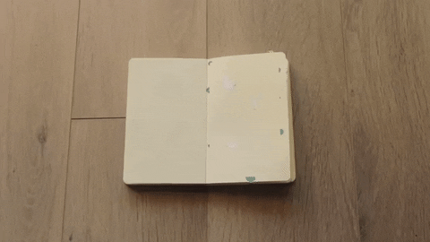

## Auto-édition, autorisation ? Les écrivain.e.s face à l’utopie de la désintermédiation

<!-- .element: style="width:400px" -->

===

Dans cette séance ainsi que dans la suivante, nous allons évoquer les enjeux liés à l'auto-édition, et plus largement aux formes d'édition para-institutionnelles. Dans le plan de cours disponible sur Moodle, nous avons 2 séances décorrélées :
- Auto-édition
- Publication

Mais en fait il s'agit à chaque fois d'aborder le même problème, sous deux angles un peu distincts :
- aujourd'hui, la construction de l'autorité (en insistant sur la fonction de légitimation), où l'on va parler des écrivains
- dans 15 jours, les nouvelles chaînes éditoriales (sur un plan un peu plus technique de production & de diffusion), où je vous présenterai des entreprises éditoriales "alternatives", qui testent des solutions pour prendre en compte le besoin croissant de réintermédiation, tout en travaillant à éviter les nouveaux monopoles.

Le cours d'aujourd'hui va revenir sur l'actualité problématique du concept d'auteur.

Ce concept ayant émergé en même temps que le modèle éditorial moderne, c'est-à-dire un modèle à présent fortement bousculé par le fait numérique, il est normal qu'il se trouve désormais au coeur de nombreux débats.

La question que je peux poser en introduction sera donc la suivante : comment "s'autorise-t-on" aujourd'hui, dans un contexte où la fabrique de l'autorité est bouleversée par l'irruption de nouveaux outils qui:
- favorisent et facilitent l'auto-édition (perspective édition/outil)
- ouvrent de nouvelles pistes pour la promotion des auteurs (perspective communicationnelle)

Mais peut-être faut-il commencer par expliciter ce concept. Car, justement, je tiens à prendre de biais ce concept d'auteur qui, pris en tant que substantif, me semble assez trompeur. Pour être auteur, il faut d'abord se légitimer ou être légitimé par quelqu'un. On ne naît pas auteur, on le devient, on s'autorise, et on s'autorise de manières parfois très différentes, en fonction du contexte social, professionnel, historique dans lequel on se trouve. S'autoriser, donc, pour s'extraire de la figure littéraire un peu encombrante de l'auteur (une figure très sacralisée chez nous), et en revenir à une conception médiatique, philosophique, finalement très basique : comment s'autorise-t-on ? Comment assumons-nous de prendre la parole et, à l'inverse, comment cette parole est-elle légitimée dans ce nouvel espace public contemporain, largement déterminé par les technologies numériques ?

- la "dés-autorisation" : rappel de ce qu'est le droit d'auteur aujourd'hui  = un statut juridique et administratif, arrimé à une série de conditions institutionnelles
- Autopublication, autoédition : de quoi parle-t-on ?
- l'utopie de la désintermédiation : disparition d'intermédiaires, nouveaux intermédiaires
- le problème de fond : la relation de plus en plus tendue entre auteurs et éditeurs

§§§§§§§§§§§§§§§§§§§§§§§§§§§§§§§§§§§§§§§§§§§§§

## Peut-on encore être un "auteur" à l'ère numérique ?

===

Peut-on encore être un auteur à l'ère numérique ? Question provoc : c'est que j'entends ici "auteur" en tant que concept, soit construction juridique et culturelle qui, finalement, appartient à notre histoire récente, puisqu'elle émerge à partir du XVIIIe siècle. Concept, mais aussi statut - juridique, fiscal. Être auteur, c'est à la fois occuper une position symbolique, mais aussi une position administrative et juridique.

§§§§§§§§§§§§§§§§§§§§§§§§§§§§§§§§§§§§§§§§§§§§§

## La "dés-autorisation"...

===
On peut avoir été auteur et ne plus l'être. Du moins, administrativement. C'est la mésaventure qui est arrivée à François Bon en 2018.

§§§§§§§§§§§§§§§§§§§§§§§§§§§§§§§§§§§§§§§§§§§§§
<!-- .slide: data-background-image="img/agessa.jpg" data-background-size="contain" -->

source : Tiers livre, François Bon
<!-- .element: class="source" -->

§§§§§§§§§§§§§§§§§§§§§§§§§§§§§§§§§§§§§§§§§§§§§

>Zut alors : privé d’« assiette sociale ». J’avais une assiette sociale sans le savoir et je n’en ai plus.
Dingue : pour la 1ère fois depuis... 1986, JE NE SUIS PLUS auteur ni quedalle... bon, j’ai du vieux cuir tanné – et quelques états de service derrière moi, mais ça montre bien :
- 1, comment la précarisation des auteur.e.s touche globalement et massivement désormais TOUTE la profession ;
- 2, que le régime démerde ça va être massivement la règle pour tou.te.s les d’jeuns qui débarquent dans le métier ;

>Francois Bon, [Tiers Livre](http://www.tierslivre.net/spip/spip.php?article4777)

<!-- .element: style="font-size:1.6rem; text-align:justify" -->

§§§§§§§§§§§§§§§§§§§§§§§§§§§§§§§§§§§§§§§§§§§§§

>Psychologiquement, pour moi, c’est la première fois depuis 30 ans, et depuis 20 ans de web, ce sont mes activités numériques indépendantes (y compris la vente de mes livres Tiers Livre Editeur, qui payent frais de site et matos, mais sur lesquels je ne me rémunère pas en D.A.) qui deviennent mon activité principale

>Francois Bon, [Tiers Livre](http://www.tierslivre.net/spip/spip.php?article4777)

§§§§§§§§§§§§§§§§§§§§§§§§§§§§§§§§§§§§§§§§§§§§§
<!-- .slide: data-background-image="img/cnl_08.jpg" data-background-size="contain" -->

source : Tiers livre, François Bon
<!-- .element: class="source" -->

§§§§§§§§§§§§§§§§§§§§§§§§§§§§§§§§§§§§§§§§§§§§§
<!-- .slide: data-background-image="img/ligue-2020.jpg" data-background-size="contain" -->

===

Mouvement d'auteurs créé par Samantha Bailly.

§§§§§§§§§§§§§§§§§§§§§§§§§§§§§§§§§§§§§§§§§§§§§

### La problématique de l'auctorialité à l'époque du numérique
Le concept moderne d’auteur est le fruit du processus qui permet la professionnalisation des auteurs à la base du modèle économique de l’édition imprimée. En d’autres termes, la fonction fondamentale de l’auctorialité est la propriété. Problème : que fait-on des écrivains qui ont choisi de publier *autrement* ?

<!-- .element: style="font-size:1.7rem; text-align:justify" -->

===

L’un des problèmes soulevés par le numérique est le statut de l’auteur. Mais il existe en réalité deux façon de comprendre ce problème :
- culpabilisation du lecteur : on télécharge = on vole pendant que l’auteur meurt de faim en s’éclairant à la chandelle. Cad on porte atteinte au droit d’auteur comme rétribution financière.

- le droit d’auteur, c’est aussi un certain respect de l’oeuvre, qui n’est pas simplement le respect de son intégrité, mais aussi l’assurance de la promotion et de la diffusion du travail d’un écrivain. Or cela, les grands éditeurs, regroupés en concentrés en groupe média, sont les premiers à mal le respecter.

§§§§§§§§§§§§§§§§§§§§§§§§§§§§§§§§§§§§§§§§§§§§§

### Un Droit d’auteur mal adapté ?

>Le droit d’auteur n’a jamais été très bien fait, mais là il est encore plus à côté de la plaque qu’avant.
Alors contre les droits d’auteur ? Bien sûr que non. Seul constat que la proposition s’est complexifiée, et que dans cette complexification ce qui est rétribué tient de l’intervention, du service, et passe de fait par un mode de rétribution qui déjà s’est éloigné de l’univers des droits d’auteur. De même que le livre n’est plus le domaine exclusif de notre activité et notre présence (je n’en fais pas un dogme, juste je prends acte), de même un dossier ou une table-ronde centrée sur la problématique des droits d’auteur ne mérite pas qu’on aille y perdre notre temps, on à trop de boulot là où se constituent ces usages neufs. (François Bon)

<!-- .element: style="font-size:1.4rem; text-align:justify" -->

===
Les éditeurs, confrontés à une mutation technologique sur laquelle ils ont peu de prise, se replient sur des pratiques juridiques et commerciales issues du XIXe siècle, et les auteurs, plus indépendants que jamais, envisageraient soit de mandater des agents littéraires pour que leurs droits soient respectés, soit de devenir « éditeurs et diffuseurs d’eux-mêmes », grâce aux nouvelles licences « libres » qui leur permettent de moduler le périmètre de leurs droits.

Hystérie qui instrumentalise le terme « Droit d’auteur », sans générer davantage d’interrogation sur la nature du Droit d'Auteur, et sur le statut particulier des oeuvres littéraires et artistiques qu'il vise à protéger. Dès lors, considérant les oeuvres comme des biens marchands traditionnels, "repenser le droit d'auteur" se limite à trouver les solutions techniques pour garantir le paiement à l'acte de lecture.

Pour de nombreux écrivains - parmi lesquels Bon - le fait que certains grands groupes tels qu’Amazon souhaite rendre obligatoire les dispositifs anti-copie dans les outils numériques (DRM) ne fait que renforcer l'idée que sous la confusion des projets se cache une orientation claire, visant à accroître la marchandisation de la culture.

Une orientation opposée aux intérêts globaux de la société.

§§§§§§§§§§§§§§§§§§§§§§§§§§§§§§§§§§§§§§§§§§§§§

## Auto-édition : de quoi parle-t-on ?
* Autoédition
* Autopublication
* Publication à compte d'auteur

===

Histoire ancienne, pratique variée qui remonte bien avant les pratiques numériques, et qui renvoie à des réalités distinctes.

§§§§§§§§§§§§§§§§§§§§§§§§§§§§§§§§§§§§§§§§§§§§§

### Publication à compte d'auteur
L’édition à compte d’auteur consiste pour un auteur à faire éditer ses propres ouvrages par un éditeur qui assure seulement la partie technique de l’édition et de la diffusion, en dehors du choix éditorial proprement dit. Dans un contrait de publication à compte d'auteur, c’est donc l’auteur qui paie les frais d’impression et de publicité de son livre, tout en restant propriétaire de ses droits d’auteur.

<!-- .element: style="font-size:1.7rem; text-align:justify" -->

===

L’édition à compte d’auteur consiste pour un auteur à faire éditer ses propres ouvrages par un éditeur qui assure seulement la partie technique de l’édition et de la diffusion, en dehors du choix éditorial proprement dit. C’est donc l’auteur qui paie les frais d’impression et de publicité de son livre. Il reste cependant propriétaire des droits d’auteur et contrôle le nombre de livres édités.

Un éditeur qui publie à compte d’auteur n’est pas un éditeur stricto sensu, mais un prestataire de services. L’auteur devient un client.

§§§§§§§§§§§§§§§§§§§§§§§§§§§§§§§§§§§§§§§§§§§§§
<!-- .slide: data-background-image="img/Proust_1913.jpg" data-background-size="contain" -->

===

Publication à compte d'auteur : système inventé par Bernard Grasset.

Grasset avait fondé une maison d'édition avec laquelle il a expérimenté de nombreuses stratégies éditoriales très mal vues à l'époque (notamment par la NRF de Gallimard), car on considérait qu'elles portaient atteinte à l'intégrité des oeuvres et de la littérature.

C'est à lui que l'on doit notamment la naissance du marketing éditorial, avec la création de publicités destinées à vanter certains livres.

Comme la maison était plutôt jeune, et pas forcément bien dotée (quoique 2 de ses auteurs remportent le Goncourt dans les années 1910), elle a ouvert la possibilité à des écrivains de publier sous leur bannière ou label éditorial, à leur frais.

Exemple de Proust. En 1913.
>L’accord est signé avec Grasset : 1250 exemplaires du premier tome sont imprimés, dont 1000 pour la vente et 250 pour le service de presse et l’auteur.

§§§§§§§§§§§§§§§§§§§§§§§§§§§§§§§§§§§§§§§§§§§§§
<!-- .slide: data-background-image="img/editionsBaudelaire.png" data-background-size="contain" -->

===

Concrètement, le texte ne passe pas devant un comité de lecture (pas d'opération de "sélection" qui fait le propre de la fonction éditoriale traditionnelle), mais intégrait tout de suite le circuit de fabrication.

L’éditeur à compte d’auteur n’assume pas ce qu'on appelle le risque éditorial. En contrepartie, l’auteur ne lui cède pas ses droits. Il reste le propriétaire du tirage et reçoit la majeure partie du produit des ventes.

Dans une publication à compte d'auteur, typiquement, l'écrivain ne bénéficie pas tout à fait de la fonction de légitimation accordée traditionnellement par l'éditeur :
- du moins, il ne bénéficie pas de l'approbation d'un comité éditorial (cf. fonction de production qui engage une opération de sélection du contenu)
- mais il bénéficie tout de même des compétences techniques de fabrication du livre, et de ce que l'on a appelé l'énonciation éditoriale. De fait, la plupart du temps, vous ne vous rendrez même pas compte qu'un ouvrage a été publié à compte d'auteur.

§§§§§§§§§§§§§§§§§§§§§§§§§§§§§§§§§§§§§§§§§§§§§
<!-- .slide: data-background-image="img/lharmattan.png" data-background-size="contain" -->

===
L’Harmattan
La maison d’édition l’Harmattan a été fondée en 1975. Elle s’est fait connaitre en publiant des ouvrages d’auteurs Africains, ou tiers-mondistes. Aujourd’hui, le nombre de livres publiés par l’Harmattan est très impressionnant. La maison accueille de nombreux auteurs.

La maison permet d’éditer son livre gratuitement, mais ne verse des droits d’auteurs qu’à partir du 500ème livre vendu. C’est une pratique ambiguë, mais qui a l’avantage de permettre aux auteurs de publier facilement leur livre.

§§§§§§§§§§§§§§§§§§§§§§§§§§§§§§§§§§§§§§§§§§§§§

### Auto-publication
Stricto-sensu, l’autopublication (dérivé de l’anglais *self-publishing*) consiste à *rendre public* un texte, sans nécessairement chercher à le commercialiser.

===

La deuxième distinction à opérer est sans doute plus ténue, et touche deux termes souvent employés de manière synonymique : auto-édition et auto-publication. Je commencerai par ce dernier terme, qui renvoie à une pratique très large dans laquelle peut entrer l'auto-édition.

Stricto-sensu, l’autopublication (dérivé de l’anglais *self-publishing*) consiste à *rendre public* un texte, sans nécessairement chercher à le commercialiser.

§§§§§§§§§§§§§§§§§§§§§§§§§§§§§§§§§§§§§§§§§§§§§
<!-- .slide: data-background-image="img/desordre2.png" data-background-size="contain" -->

source : *Désordre*, Philippe de Jonckeere

<!-- .element: class="source" -->

===
Tout ce qui relève de la publication numérique sur le web, à titre personnel.

Les sites perso, blogues, micro-bloging

§§§§§§§§§§§§§§§§§§§§§§§§§§§§§§§§§§§§§§§§§§§§§
<!-- .slide: data-background-image="img/spip2.png" data-background-size="contain" -->

source : Fuir est une pulsion, Guillaume Vissac

<!-- .element: class="source" -->

===
SPIP = plateforme de publication ++

§§§§§§§§§§§§§§§§§§§§§§§§§§§§§§§§§§§§§§§§§§§§§
<!-- .slide: data-background-image="img/MarilynIntagran1-instagram2.png" data-background-size="contain" -->

source : Anne Savelli, comptes instagram

<!-- .element: class="source" -->

===

§§§§§§§§§§§§§§§§§§§§§§§§§§§§§§§§§§§§§§§§§§§§§
<!-- .slide: data-background-image="img/wp.png" data-background-size="contain" -->

===

Des plateformes dédiées, de type wattpad... Et là, on voit déjà une progression : des outils de plus en plus formattés, qui laissent une liberté d'expression et une autonomie assez variable.

§§§§§§§§§§§§§§§§§§§§§§§§§§§§§§§§§§§§§§§§§§§§§
<!-- .slide: data-background-image="img/kindleDirectPublishing.png" data-background-size="contain" -->

===

Des services de production de livre électroniques, comme le Kindle direct publishing (j'en dirai un mot tout à l'heure).

Sylvie Bosser :
>S’il n’est évidemment pas question ici de recenser la totalité des acteurs qui ont investi cette
modalité de publication, il semble toutefois pertinent de dégager deux tendances majeures.
D’une part, des acteurs importants du Web qui se positionnent sur les rangs de bataille en
termes de captation des ressources, à savoir principalement Kobo Writing Life (Fnac),
iBooks Authors (Apple). De moindre envergure en termes de rôle joué sur le net, Je publie
mon livre8 initié par Chapitre.com ou encore par exemple lulu.com9 se situent sur le même
registre que les précédents qui, à l’instar de KDP, ne demandent aucune contribution
financière à l’auteur. Nous avons, d’autre part, des services d’autoédition numérique tels que
librinova10 qui proposent, quant à eux, contre rémunération, un accompagnement de l’auteur
sous la forme de prestations professionnelles tout en permettant également une
commercialisation de l’ouvrage sur plus de 90 librairies en ligne.

Des succès : Agnès Martin-Lugand *Les gens heureux lisent et boivent du café* (adpatation ciné)

L'auto-publication = une solution pour les primo-auteurs. D'où la valorisation et la médiatisation de success-story

§§§§§§§§§§§§§§§§§§§§§§§§§§§§§§§§§§§§§§§§§§§§§

### Auto-édition
L’autoédition (souvent employé comme un synonyme d'autopublication) renvoie à un modèle d'auto-publication qui se veut qualitatif, et qui s'inscrit encore dans un modèle éditorial traditionnel, où l'objet livre demeure un produit essentiel. L'auto-édition aura par ailleurs souvent une vocation marchande.

§§§§§§§§§§§§§§§§§§§§§§§§§§§§§§§§§§§§§§§§§§§§§
<!-- .slide: data-background-image="img/FBediteur2.png" data-background-size="contain" -->

===

François Bon & Tiers-livre éditeur...
Différence entre le site Tiers-Livre qui relèverait de l'auto-publication : pas de vocation commerciale

§§§§§§§§§§§§§§§§§§§§§§§§§§§§§§§§§§§§§§§§§§§§§
<!-- .slide: data-background-image="img/FBediteur.png" data-background-size="contain" -->

====

Et Tiers-livres éditeur qui propose la vente de livres produits par l'auteur.

Chez François Bon

Dans la distinction entre auto-édition et auto-publication, il y a encore l'idée de vouloir soutenir le principe d'édition comme garant d'une forme de qualité.

§§§§§§§§§§§§§§§§§§§§§§§§§§§§§§§§§§§§§§§§§§§§§
<!-- .slide: data-background-image="img/heuresIndues.png" data-background-size="contain" -->

====

Et le cas d'un livre-objet comme Pierre Ménard et son *Esprit d'escalier*

§§§§§§§§§§§§§§§§§§§§§§§§§§§§§§§§§§§§§§§§§§§§§
<!-- .slide: data-background-image="img/" data-background-size="contain" -->

>"Alors que l'on définit la publication comme un processus de mise en forme d’un contenu préalablement sélectionné (collecté, agrégé, synthétisé…), en vue de sa diffusion collective, pour l’autopublication, il faut ajouter : “sans intermédiaire”. C'est effectivement cette notion de désintermédiation qui est en jeu. Le producteur de documents est aussi le diffuseur. Une autre notion essentielle concerne la sélection/validation. Elle permet de réaliser la distinction entre publication et édition. L'autopublication dans ce cadre associe la production à la diffusion directe reléguant la sélection à l'édition, à un tiers. La désintermédiation s'accompagne parfois d'une réintermédiation souvent fondée sur un service non-marchand."

<!-- .element: style="font-size:1.4rem; text-align:justify" -->

>Gallezot Gabriel et Ertzscheid Olivier, « Swaper la publication »

<!-- .element: style="font-size:1.4rem; text-align:justify" -->

===

Le concept sur lequel je voudrais à présent proposer quelques définitions = désintermédiation, dont on a eu l'occasion de parler à plusieurs reprises, sans pour autant creuser la définition et les implications.

§§§§§§§§§§§§§§§§§§§§§§§§§§§§§§§§§§§§§§§§§§§§§

## L'utopie de la désintermédiation
* La disparition d'intermédiaires historiques...
* ... sitôt remplacés par de nouveaux acteurs (géants du web, GAFAM... avec des modèles économiques et culturels différents)

===

Ce que les débats sur l'autorité contemporaine travaillent, c'est d'abord une tension entre l'utopie, propre à l'économie numérique, d'une désintermédiation, et la réalité d'une ré-intermédiation qui ne dit pas toujours son nom.

La désintermédiation, c'est quoi ?
La désintermédiation est d'abord un concept économique, qui a connu une fortune dès les années 60 avec le développement de techniques numériques qui rendaient obsolètes certaines activités ou tâches traditionnellement accomplies par des individus au sein de services qualifiés.

§§§§§§§§§§§§§§§§§§§§§§§§§§§§§§§§§§§§§§§§§§§§§

### Qu'entend-t-on par désintermédiation ?  

Processus établissant une relation directe entre une entité (industrielle, culturelle, institutionnelle) et ses usagers, entraînant la disparition de certains services traditionnellement chargés d'assurer des services de transmission, diffusion, médiation, etc. (les "intermédiaires").

<!-- .element: style="font-size:1.4rem; text-align:justify" -->

===

On peut définir la désintermédiation comme l'établissement d'une relation directe entre une entité (industrielle, culturelle, institutionnelle) et ses usagers, entraînant la disparition de certains services -- et par conséquent la disparition d'emplois, voire de corps de métier -- rendus obsolètes par l'automatisation.

Cette définition est pour le moment assez vague, et pour la détailler, voyons peut-être immédiatement son impact sur les industries et les instituions culturelles, comme l'édition (mais pas seulement).

La désintermédiation peut être perçue et interprétée de manière très positive ou au contraire très négative, notamment en raison d'une double implication

§§§§§§§§§§§§§§§§§§§§§§§§§§§§§§§§§§§§§§§§§§§§§

* La désintermédiation : un facteur de la redistribution de l'autorité, en direction des premiers producteurs et du public

===

Le phénomène de désintermédiation renvoie tout d'abord ce phénomène de redistribution de l'autorité que l'on a pu étudier dans nos cours consacrés à la nouvelle économie de l'attention. Ce passage du "Top down" vers le "bottom up"

La désintermédiation renvoie en effet à la disparition de certains intermédiaires qui incarnaient une forme d'autorité, ou qui traditionnellement conféraient cette autorité : typiquement les éditeurs, les grands distributeurs, les libraires, etc. qui aujourd'hui doivent faire face à une concurrence jouant fortement sur le principe d'une redistribution du pouvoir de production et de prescription à la communauté des consommateurs, voire de certains prestataires.

On a pu le voir à travers plusieurs exemples, dans ce cours comme dans le cours de communication.

§§§§§§§§§§§§§§§§§§§§§§§§§§§§§§§§§§§§§§§§§§§§§
<!-- .slide: data-background-image="img/limite02.png" data-background-size="contain" -->

===

C'est F. BOn qui est passé de l'Éditeur (Minuit) à des Plateformes autoédition (ou sites persos)

F. Bon "débarassé" de l'éditeur : relation conflictuelle à ses éditeurs. Possibilité de by-passer les refus

§§§§§§§§§§§§§§§§§§§§§§§§§§§§§§§§§§§§§§§§§§§§§
<!-- .slide: data-background-image="img/MasquePlumeBabelio.png" data-background-size="contain" -->

===

Côté pouvoir au public = C'est la critique, qui est passée de secteurs spécialisés, experts, à des réseaux amateurs

§§§§§§§§§§§§§§§§§§§§§§§§§§§§§§§§§§§§§§§§§§§§§
<!-- .slide: data-background-image="img/babelioaccueil.png" data-background-size="contain" -->

§§§§§§§§§§§§§§§§§§§§§§§§§§§§§§§§§§§§§§§§§§§§§
<!-- .slide: data-background-image="img/mediaCitoyen.png" data-background-size="contain" -->

===
Pour sortir du seul domaine de l'édition, c'est par exemple la prise en main de la circulation voire de la production de l'information par les journalistes-citoyens.

§§§§§§§§§§§§§§§§§§§§§§§§§§§§§§§§§§§§§§§§§§§§§
<!-- .slide: data-background-image="img/tuches5.png" data-background-size="contain" -->

===

Ce que l'on observe à chaque fois, c'est donc une remise en question de l'autorité de structures institutionnelles qui disposaient d'un très fort pouvoir de légitimation.

La désintermédiation pose ainsi de nombreuses questions en termes de système hiérarchique de valeur attribués aux contenus. Pour prendre un cas particulièrement radical, une fanfiction comme After aura d'abord été validée par la masse des lecteurs amateurs d'une plateforme, mais non par un éditeur ou un commité de lecture.

Nous naviguons de faire à l'heure actuelle dans un double système de validation et de légitimation des contenus, avec d'un côté la sélection des instances expertes traditionnelles, et de l'autre celle du "grand public".

§§§§§§§§§§§§§§§§§§§§§§§§§§§§§§§§§§§§§§§§§§§§§

* La désintermédiation : de l'automatisation des tâches à l'obsolescence de certains métiers

===

Évidemment, cette crise de l'autorité des instances de légitimation traditionnelle beaucoup inquiété les acteurs historiques de ces institutions, d'autant plus qu'elle s'est accompagnée d'une remise en question parfois violente de la pertinence de certains métiers.

À l'origine de la désintermédiation, un concept dont on discute depuis les années 196, on retrouve en effet le développement de dispositifs techniques (en particulier l'informatique), ayant conduit à l'automatisation de certaines tâches jusque-là assurées par des être humains. Cette automatisation a donc rendue obsolète certains emplois, voire certains corps de métier dans leur ensemble.

La désintermédiation a souvent été mal vécue par des individus dont le métier a dû être entièrement réinventé, en même temps que le développement technique entraînait l'obsolescence de leur tâche. Les institution et industries ont ainsi été nombreuses à de voir se repositionner par rapport à leur public, en proposant de nouveaux services -- et donc une nouvelle manière de concevoir leur métier / le service ou l'objet qu'ils vendaient.

§§§§§§§§§§§§§§§§§§§§§§§§§§§§§§§§§§§§§§§§§§§§§
<!-- .slide: data-background-image="img/resnais.png" data-background-size="contain" -->

===

Dans le secteur de l'industrie documentaire, par exemple (je pense ici aux bibliothèques), la désintermédiation a été très forte dès les années 70 aux années 80-90. Je me permets d'opérer ce crochet par l'industrie documentaire des bibliothèques car elle n'est pas si éloignée que cela de notre univers d'éditeurs, et parce qu'elle a fait les frais d'une désintermédiation avant l'heure, qu'elle a particulièrement bien négociée.

Je voudrais donc d'abord vous montrer quelques minutes d'un film documentaire d'Alain Resnais, "Toute la mémoire du monde", qui présente le système de catalogage à la BNF avant l'arrivée de l'informatique.

§§§§§§§§§§§§§§§§§§§§§§§§§§§§§§§§§§§§§§§§§§§§§
<!-- .slide: data-background-video="img/Resnais_extrait.mp4" data-background-size="contain" -->

§§§§§§§§§§§§§§§§§§§§§§§§§§§§§§§§§§§§§§§§§§§§§

>« Le documentaliste est un « intermédiaire dont la fonction essentielle est de mettre en contact ceux qui ont besoin de savoir et ceux qui savent »

<!-- .element: style="font-size:1.4rem; text-align:justify" -->

>Eric de Grolier, E. De Grolier, « La passion de l'organisation des connaissances », Documentaliste, sciences de l'information, 1996.

<!-- .element: style="font-size:1.4rem; text-align:justify" -->

===

Dans le secteur documentaire, désintermédiation = informatisation des catalogues. Auparavant, tout était sous forme de fiches dans de "vrais" catalogues imprimés, dans lesquels les documentalistes guidaient les lecteurs.

FIgure d'autorité :  Pour Eric de Grolier (éditeur, chercheur, parfois considéré comme le fondateur des sciences de l'information en France), le documentaliste est un « intermédiaire dont la fonction essentielle est de mettre en contact ceux qui ont besoin de savoir et ceux qui savent » (on voit combien la hiérarchie est forte), ailleurs on parle d’un « médiateur entre le document et l’utilisateur ».

L'informatisation des catalogues va entraîner un déplacement de cette fonction, désormais assumée par la machine, avec laquelle le lecteur est directement en interaction.

Gain d'autonomie énorme pour le lecteur, qui devient maître de ses recherches. Le catalogue informatisé que vous utilisez par exemple à la BU, tout cela, c'était une personne qui vous guidait ! Les documentalistes sont conscients qu’il leur faut former les usagers aux nouveaux outils de recherche mais craignent en même temps de les voir devenir totalement autonomes.

Mais est-ce que cela signifie pour autant la disparition des documentalistes ? Non ! Mais une redéfinition profonde de leur métier.

§§§§§§§§§§§§§§§§§§§§§§§§§§§§§§§§§§§§§§§§§§§§§
<!-- .slide: data-background-video="img/ccfr_presentation.mp4" data-background-size="contain" -->

===

https://www.bnf.fr/fr/mediatheque/le-catalogue-collectif-de-france-quest-ce-que-cest

§§§§§§§§§§§§§§§§§§§§§§§§§§§§§§§§§§§§§§§§§§§§§
<!-- .slide: data-background-image="img/mallarme_vollard2.png" data-background-size="contain" -->

===

Liée à cette crainte de la désintermédiation causée par les machines, on voit apparaître la crainte de la dématérialisation : est-ce qu'on ne perd pas une partie de l'expérience de prendre dans ses mains un livre ancien lorsqu'on en consulte une image en ligne ?

La dématérialisation est un faux problème : on parlera plutôt de délocalisation. On l'a bien vu avec la question des supports de l'archivage numérique, qui sont en fait fragiles, bien plus qu'on ne le pensait.

Ce paradigme du déplacement, de l'évolution des objets et des métiers est essentiel.

§§§§§§§§§§§§§§§§§§§§§§§§§§§§§§§§§§§§§§§§§§§§§

>Depuis longtemps, les débats à propos du Web  2.0 se sont concentrés sur la question de la désintermédiation. Avec l'accès immédiat et spontané des auteurs aux outils de publication sur des plateformes de partage de contenus en ligne, ceux qui font profession d'assurer la publication d'une œuvre, c'est-à-dire de la porter pour l'auteur vers son public, ont pu se croire neutralisés par une mise en relation directe de l'auteur au lecteur. À l'heure du « tous auteurs », « tous journalistes », la capacité des entreprises d'édition à faire accéder l'écrivant au statut d'auteur et le monopole qu'elles détiennent jusqu'alors sur cette capacité semblent s'effondrer.

>Marin Dacos, Pierre Mounier, L'édition en réseau.

<!-- .element: style="font-size:1.4rem; text-align:justify" -->

===

Reprenons : utopie de la désintermédiation = rêve d'une relation directe entre tous les écrivains et leur public, sans la médiation (et parfois la censure, la révision, le jugement)

§§§§§§§§§§§§§§§§§§§§§§§§§§§§§§§§§§§§§§§§§§§§§

* La désintermédiation a-t-elle vraiment eu lieu ?

§§§§§§§§§§§§§§§§§§§§§§§§§§§§§§§§§§§§§§§§§§§§§

>Contre toute attente, le scénario catastrophe de la désintermédiation n'a pourtant pas eu lieu. On sait en 2010 que la spontanéité apparente du texte  2.0 n'est qu'un leurre et que ce texte est en réalité le résultat d'une très puissante médiation, mais qui s'exprime selon des modes peu habituels et parfaitement inconnus des acteurs traditionnels. Il s'agit :

<!-- .element: style="font-size:1.4rem; text-align:justify" -->

>– du design des plateformes informatiques ;   
– de la définition des règles d'écriture et de lecture ;   
– de la gestion des communautés qui les utilisent ;   
– des algorithmes de classement de l'information produite.   

>Marin Dacos, Pierre Mounier, L'édition en réseau

<!-- .element: style="font-size:1.4rem; text-align:justify" -->

§§§§§§§§§§§§§§§§§§§§§§§§§§§§§§§§§§§§§§§§§§§§§
<!-- .slide: data-background-image="img/" data-background-size="contain" -->

>Dès lors, la fonction du médiateur qu'est l'éditeur n'a pas disparu ; elle a simplement profondément changé et contraint tous les acteurs traditionnels à redéfinir d'urgence les bases de leur métier sous peine de disparaître au profit d'acteurs nouveaux venant d'autres horizons.

>Marin Dacos, Pierre Mounier, L'édition en réseau

<!-- .element: style="font-size:1.4rem; text-align:justify" -->

§§§§§§§§§§§§§§§§§§§§§§§§§§§§§§§§§§§§§§§§§§§§§

>Il fait bon dire que tout va changer demain et que les producteurs (de culture, d’information, de connaissances... comme hier de « plus-value ») vont enfin prendre les rênes d’un système accaparé par des industries « moralement répugnantes » comme le dit Eben Möglen. On doit cependant se demander si l’analyse du bousculement des rapports de production qui s’opère sous nos yeux n’est pas erronée. Certes, les arguments des tenants de l’ancien système, les détenteurs de « portefeuilles de droits », les monopolistes de la connaissance et de la culture, les majors qui cherchent leur tambour..., de par leur indigence, pourraient nous inciter à un radicalisme de façade.

>Hervé Le Crosnier, "Désintermédiation et démocratie. Quelques questions dans le domaine culturel", 2004.

<!-- .element: style="font-size:1.4rem; text-align:justify" -->

§§§§§§§§§§§§§§§§§§§§§§§§§§§§§§§§§§§§§§§§§§§§§

### Le POD : la fin des imprimeurs ?
* *Print on demand* ou impression à la demande
* Des techniques de plus en plus pointues (de l'espresso book-machine)
* Un moyen d'éviter la réimpression

===

chronologiquement : expresso-book machine
Puis des machines de + en + perfectionnées (possibilité d'imprimer des titres très rapidement)
Ces machines POD réintégrées dans les chaînes des grands éditeurs traditionnels, qui s'en servent pour gérer les pb de stock. Un éditeur n'a pas intérêt à tirer bcp d'exemplaires (politique de retour des livres, mis au pilon). Pour des ouvrages qui ne sont plus dispo, on les met en POD, et on peut faire soit des tirages à la demande (Stock), soit refaire des stocks qui ne relèvent pas d'une "réimpression" (seuil pour la réimpression = 500 exemplaires)

notes FB : liberté et indépendance.

§§§§§§§§§§§§§§§§§§§§§§§§§§§§§§§§§§§§§§§§§§§§§

### Le risque de la plateformisation
Uniformisation des productions s'intégrant dans un format de publication préconstruit et partagé par une communauté d'utilisateurs, avec les dérives potentielles en termes de censure, de formatage, d'appauvrissement des contenus etc.

===

L'écriture, la publication, l'évaluation, l'information... tous ces contenus passent aujourd'hui essentiellement par des plateforme, qui sont des logiciels construits par des sociétés (rarement par des communautés indépendantes), à des fins commerciales (même si ce n'est pas en publication ou en lecture que l'on paye, mais pas nos connexion, la récolte des données, la publicité, etc.)

Mounier et Dacos parlent plus haut de facteurs de réintermédiation via :
– le design des plateformes informatiques ;   
– la définition des règles d'écriture et de lecture ;   
– la gestion des communautés qui les utilisent ;   
– les algorithmes de classement de l'information produite.   

Tous ces éléments participent de ce que l'on appelle la plateformisation, à savoir
- uniformisation des productions pour entrer dans un modèle de publication préconstruit et partagé par une communauté d'utilisateurs

§§§§§§§§§§§§§§§§§§§§§§§§§§§§§§§§§§§§§§§§§§§§§
<!-- .slide: data-background-movie="img/" data-background-size="contain" -->

### La publication via des chaînes numériques dédiées : le risque de la best-sellerisation
* le cas Koskas & Kindle Direct Publishing (KDP)

§§§§§§§§§§§§§§§§§§§§§§§§§§§§§§§§§§§§§§§§§§§§§
<!-- .slide: data-background-image="img/kindleDirectPublishing.png" data-background-size="contain" -->

===

>La plus célèbre d’entre elles est, évidemment, Amazon Kindle Direct Publishing (KDP). A l’origine, il s’agit d’un service proposé aux auteurs pour augmenter rapidement le nombre de livres numériques disponible au format Kindle. En quelques années, KDP s’est imposé par sa simplicité d’utilisation (vous téléchargez vos fichiers de couverture et de contenu) et sa puissance de vente : 60 % des ebooks seraient en effet vendus par Amazon.

KDP existe depuis 2011 en France, 2009 aux US.

>Il en existe d’autres telles que iBooks Author (Apple), Tolino Publishing, Kobo Writing Life (Kobo/Sony) ou Google Play Books.

>La publication est gratuite et l’auteur perçoit une redevance (royalties) dont le pourcentage varie mais qui peut aller jusqu’à 70% du prix de vente.

>Ces plateformes ne proposent pas de services éditoriaux. C’est pourquoi on y trouve le pire comme le meilleur, des ouvrages d’une grande utilité comme des essais de quelques pages bourrés de fautes d’orthographe.

§§§§§§§§§§§§§§§§§§§§§§§§§§§§§§§§§§§§§§§§§§§§§
<!-- .slide: data-background-image="img/koskas2.png" data-background-size="contain" -->

===
Kokas = "Indie Author", expression anglo-saxone où l'auto-édition a fait émerger cette figure de l'auteur indépendant, sur le même modèle sémantique (valorisant), de la musique indé, ou chez nous des libraires indé.

le cas Koskas : sur la liste du Renaudot en 2018.

§§§§§§§§§§§§§§§§§§§§§§§§§§§§§§§§§§§§§§§§§§§§§
<!-- .slide: data-background-image="img/koskas1.png" data-background-size="contain" -->

===

§§§§§§§§§§§§§§§§§§§§§§§§§§§§§§§§§§§§§§§§§§§§§

>via le dispositif KDP, Amazon saisit l’opportunité de cet espace de sédition que représente l’autoédition, l’injonction à la créativité prenant ici la forme réduite d’une injonction à la production de contenus, supprimant tout intermédiaire
susceptible de qualifier ces derniers. Externalisant ainsi les aléas de la valeur - aucun risque et un investissement financier tout relatif au regard de la puissance de feu d’Amazon -, l’autoédition est l’un des vecteurs déployés par cet acteur, lui permettant de nourrir le catalogue de la liseuse Kindle et au-delà, d’occuper de manière exponentielle le marché du livre numérique.

>Sylvie Bosser, "L’autoédition selon Kindle Direct Publishing : Amazon et l’instrumentalisation de la créativité"

<!-- .element: style="font-size:1.4rem; text-align:justify" -->

===

Sylvie Bosser a pris en charge l'étude de la platforme KDP, et voici ses conclusions.

MÉthosologie = analysé le discours présent sur le site de KDP, ainsi que celui tenu par
Marie-Pierre Sangouard, responsable des contenus Kindle d’Amazon France + Étude du classement des meilleures ventes (soit les contenus mis en avant sur le site)

Cette méthodo "permet de déterminer les secteurs littéraires majoritairement présents et d’autre part, de voir de quelle manière s’opère, derrière ce classement, une logique de commercialisation qui s’appuie sur le savoir-faire d’Amazon en matière d’algorithme."

§§§§§§§§§§§§§§§§§§§§§§§§§§§§§§§§§§§§§§§§§§§§§
<!-- .slide: data-background-image="img/KDP-pub.png" data-background-size="contain" -->

===

Sylvie Bosser :

>Sur la page d’accueil de KDP19, l’accent est mis, dans le discours tenu, sur la simplicité du
processus, la rapidité de la mise en œuvre de celui-ci (« Publiez en quelques minutes et votre
livre apparaît sur le site d’Amazon en moins de 24 heures »), ainsi que sur la notion
d’indépendance à travers le choix possible des territoires de vente et enfin, sur le montant de
la redevance qui peut aller jusqu’à 70 %.

>l’accent est particulièrement mis sur la maîtrise du processus par la
personne : « C’est vous le chef, vous déterminez tout, du contenu au prix ».

>la personne qui a recours au service de KDP est d’emblée désignée comme
écrivain, pouvant de cette manière se passer de l’intermédiaire classique qu’est l’éditeur :
« Ce n’est pas votre truc les lettres, les recherches d’argent, etc. Vous êtes un auteur, pas un
éditeur ».

>D’emblée, le texte est envisagé comme acceptable: « Vous n’avez pas à nous convaincre que
votre livre mérite d’être publié. Désormais chacun peut publier de façon indépendante ses
ouvrages fraîchement écrits ou ceux qui patientent depuis des années ».

>discours promotionnel marqué par le registre lexical du pouvoir.

§§§§§§§§§§§§§§§§§§§§§§§§§§§§§§§§§§§§§§§§§§§§§

### KDP, un service sous conditions

===

>Le programme KDP select est un service gratuit qui vous est proposé lorsque vous publiez
votre livre sur Amazon. En souscrivant à ce programme, vous bénéficiez de plusieurs
avantages par rapport aux auteurs qui ne le font pas, mais l’accès à ces avantages n’est pas
sans contrepartie.

Par exemple, pour toucher les fameux 70% de recettes de votre livre, il faut accepter de le vendre à un tarif plafonné à 2, 99 euros !

§§§§§§§§§§§§§§§§§§§§§§§§§§§§§§§§§§§§§§§§§§§§§
<!-- .slide: data-background-image="img/KDP-lectureGratuite.png" data-background-size="contain" -->

===

>Prime Reading
Prime Reading est un programme de promotion facultatif qui permet aux auteurs de proposer leurs livres aux lecteurs Amazon les plus actifs. Les membres Prime Reading peuvent accéder à un nombre illimité d’ouvrages sans frais supplémentaires.

Durant votre promotion Prime Reading, votre livre reste disponible à la vente selon nos conditions standard et continue de générer des redevances.

Remarque : Votre livre doit être inscrit à KDP Select pour être éligible au programme Prime Reading.

§§§§§§§§§§§§§§§§§§§§§§§§§§§§§§§§§§§§§§§§§§§§§

>Notons que depuis le mois de juillet 2015, les auteurs dont les livres sont empruntés dans ce cadre ne sont plus
rémunérés selon le barème d’une base minimale de lecture de 10 % du livre, mais en fonction du nombre de pages lues. Cette comptabilisation ne s’effectue pas selon le nombre de pages téléchargées, mais en fonction du nombre de pages affichées suffisamment longtemps à l’écran pour pouvoir supposer avoir été lues. Sous ce rapport, Amazon ne fait finalement que poursuivre son utilisation des algorithmes, valeur cardinale de son système de recommandation. Mais ces fourches caudines de l’algorithme désormais appliquées à la rémunération des auteurs, pour l’instant seulement dans le cadre du prêt, ne vont-elles pas générer de la part de ces derniers un formatage de leur écrit, au sens où il s’agira d’inciter, coûte que coûte, le lecteur à poursuivre le plus loin possible sa progression dans l’ouvrage ?

>Sylvie Bosser, "L’autoédition selon Kindle Direct Publishing : Amazon et l’instrumentalisation de la créativité"

<!-- .element: style="font-size:1.4rem; text-align:justify" -->

===

Par exemple, écriture de cliffangher, etc sur le modèle des séries TV mais également des feuilletons du 19e.

§§§§§§§§§§§§§§§§§§§§§§§§§§§§§§§§§§§§§§§§§§§§§

>En d’autres termes, sous couvert de promesse d’émancipation et d’obtention de gains substantiels, ce recours au crowdsourcing (Howe, 2006), à l’empowerment des aspirants écrivains s’inscrit dans le modèle économique de l’hyperoffre au sens de Benghozi (2012), ainsi que d’une rationalisation et industrialisation de la production des biens culturels
(Bouquillion, Miège, Moeglin, 2013).

>Sylvie Bosser, "L’autoédition selon Kindle Direct Publishing : Amazon et l’instrumentalisation de la créativité"

<!-- .element: style="font-size:1.4rem; text-align:justify" -->

§§§§§§§§§§§§§§§§§§§§§§§§§§§§§§§§§§§§§§§§§§§§§

### La publication via les réseaux sociaux : le risque de la censure
* Le cas François Bon & TikTok

§§§§§§§§§§§§§§§§§§§§§§§§§§§§§§§§§§§§§§§§§§§§§
<!-- .slide: data-background-video="img/AdieuTikTok.mp4" data-background-size="contain" -->

===
- censure
cas de FB sur Tik Tok

§§§§§§§§§§§§§§§§§§§§§§§§§§§§§§§§§§§§§§§§§§§§§

>Il est urgent de saisir cette opportunité, créée par la remise en cause des modes de production que l’on appelle du terme générique, qui resterait à définir et critiquer, la « société de l’information ». En particulier parce que les forces dominantes cherchent à utiliser ce basculement pour revenir sur des acquis démocratiques et réorganiser les pouvoirs pour limiter plus encore les marges de liberté des créateurs sur la diffusion de l’information, de la culture et de la connaissance. Les questions de la copie privée, du brevetage des logiciels, l’extension de la propriété intellectuelle définissent ainsi des zones de front dans le nouveau cadre de la société de l’information.

>Hervé Le Crosnier, "Désintermédiation et démocratie. Quelques questions dans le domaine culturel", 2004.

<!-- .element: style="font-size:1.4rem; text-align:justify" -->

§§§§§§§§§§§§§§§§§§§§§§§§§§§§§§§§§§§§§§§§§§§§§

## Auteurs et éditeurs : du malentendu au malaise

<!-- .element: style="width:600px" -->

===

Le problème de fond: un malaise de plus en plus grand entre auteurs et éditeurs, avec un statut qui est devenu précaire

§§§§§§§§§§§§§§§§§§§§§§§§§§§§§§§§§§§§§§§§§§§§§

<iframe width="560" height="315" src="https://www.youtube.com/embed/NMmlfdXa7OY" title="YouTube video player" frameborder="0" allow="accelerometer; autoplay; clipboard-write; encrypted-media; gyroscope; picture-in-picture" allowfullscreen></iframe>

§§§§§§§§§§§§§§§§§§§§§§§§§§§§§§§§§§§§§§§§§§§§§

<iframe width="560" height="315" src="https://www.youtube.com/embed/3kcp4XP47xo" title="YouTube video player" frameborder="0" allow="accelerometer; autoplay; clipboard-write; encrypted-media; gyroscope; picture-in-picture" allowfullscreen></iframe>

§§§§§§§§§§§§§§§§§§§§§§§§§§§§§§§§§§§§§§§§§§§§§

### Le rapport Racine

§§§§§§§§§§§§§§§§§§§§§§§§§§§§§§§§§§§§§§§§§§§§§
<!-- .slide: data-background-image="img/racineRapport.png" data-background-size="contain" -->

===

>Franck Riester, ministre de la Culture, avait confié en avril 2019 à Bruno Racine, conseiller maître à la Cour des comptes, une mission prospective sur l’état des mutations que les activités de création ont pu connaître ces trente dernières années. Cette réflexion globale devra permettre d’adapter les politiques publiques existantes en faveur des artistes, auteurs et créateurs. Son rapport sur le statut des artistes-auteurs, « L’auteur et l’acte de création », a été remis au ministre mercredi 22 janvier.

Le rapport va "dresser un état des lieux de la situation des auteurs, se projeter dans la durée pour identifier les évolutions de leur activité à l’heure des GAFA, du numérique ou de l’intelligence artificielle, et surtout, proposer des changements concrets pour améliorer leurs conditions de vie."

§§§§§§§§§§§§§§§§§§§§§§§§§§§§§§§§§§§§§§§§§§§§§
<!-- .slide: data-background-image="img/PayeTonAteur.png" data-background-size="contain" -->

===

La lecture du rapport appuie le mal-être des écrivains et auteurs depuis maintenant une bonne vingtaine d'années : l’analyse menée par Bruno Racine et plusieurs experts indépendants sur plus de cent quarante pages constitue une reconnaissance de la situation difficile des artistes-auteurs.

Cette revendication était d’ailleurs à l’origine de la création de nombreux mouvements de défense et d’associations ces dernières années, à l’image du collectif #Payetonauteur ou de la Ligue des auteurs professionnels. Le rapport Racine pointe donc l’érosion de leurs revenus, soulignant que « les jeunes et les femmes sont particulièrement exposés aux difficultés socio-économiques ».

§§§§§§§§§§§§§§§§§§§§§§§§§§§§§§§§§§§§§§§§§§§§§

### Les propositions du rapport racine
* établissement d’un statut professionnel des artistes-auteurs, clairement défini par des textes
* renforcer collectivement les artistes-auteurs, via la création de syndicats d'artistes-auteurs (du droit d'auteur au droit *des* auteurs...)
* repenser les institutions et activités des auteurs (rémunération des salons, refonte des services du ministères : remplacer le service du livre par une délégation aux artistes-auteurs)

<!-- .element: style="font-size:1.4rem; text-align:justify" -->

===

Analyse de Télérama :

>Les mesures concrètes – vingt-trois au total, dont beaucoup sont très techniques – s’articulent autour de trois grands axes, le premier étant l’établissement d’un statut professionnel des artistes-auteurs, clairement défini par des textes. Car il n’existe toujours pas, à ce jour, de définition de l’auteur, ce dernier étant reconnu comme tel uniquement si un contrat est établi avec un diffuseur. Ce statut, basé sur la pratique créative, construirait donc un corps professionnel, ouvrant potentiellement des droits aux créateurs auto-diffusés. En somme, on reconnaîtrait la « carrière artistique comme métier et pas seulement comme vocation » et, si cela semble symbolique, c’est en fait une avancée capitale qui leur permettrait notamment de peser plus face aux « acteurs de l’aval » (éditeurs, producteurs, diffuseurs...), plus puissants et mieux organisés.

>Une deuxième série de mesures vise à renforcer collectivement les artistes-auteurs, en commençant par leur permettre de décider de leur sort, à travers l’organisation rapide d’élections professionnelles et démocratiques dans chaque secteur. La question de la représentation professionnelle est posée : qui défend, non pas « le droit d’auteur » mais les droits des auteurs, c’est-à-dire leurs conditions de création ? Le rapport souligne que soixante millions d’euros de droits collectés par les puissants organismes de gestion collective ou OGC (autrement dit, les gestionnaires de droits d’auteurs, comme la SACEM, la SOFIA, l’ADAGP etc) pourraient être réorientés vers le financement des syndicats d’artistes-auteurs.

>Autre mesure longtemps réclamée, mais étonnamment restreinte aux auteurs de BD et jeunesse : la rémunération des auteurs lorsqu’ils participent à des salons et des festivals, auxquels l’octroi d’aides publiques serait conditionné « au respect des règles et bonnes pratiques relatives aux artistes-auteurs ». Le rapport propose enfin de mieux former les étudiants aux aspects administratifs de leurs futurs métiers, de les accompagner dans la durée, ou encore de mettre en valeur leur travail et la vitalité de la création contemporaine à travers des manifestations nationales.

§§§§§§§§§§§§§§§§§§§§§§§§§§§§§§§§§§§§§§§§§§§§§
<!-- .slide: data-background-image="img/LeMondeRapportRacineEnterre.png" data-background-size="contain" -->

===

§§§§§§§§§§§§§§§§§§§§§§§§§§§§§§§§§§§§§§§§§§§§§
<!-- .slide: data-background-image="img/demissionBailly.png" data-background-size="contain" -->

===
La ligue des auteurs pro

§§§§§§§§§§§§§§§§§§§§§§§§§§§§§§§§§§§§§§§§§§§§§

## Conclusion...
La désintermédiation -- concept phare de la culture numérique il y a encore quelques années -- incarnait la promesse d'une émancipation des écrivains, enfin capable de garder l'entière maîtrise de leur travail. La fin des éditeurs a cependant été trop vite annoncée, tant la réintermédiation semble avoir mis en place un nouveau monopole qui n'est pas toujours plus favorable au statut des auteurs. Désintermédiation ou non, cette volonté des auteurs, toujours plus nombreux, à vouloir s'émanciper des éditeurs traditionnels, incarne un profond malaise qui touche la communauté des écrivains depuis maintenant plusieurs années. La réforme du statut des auteurs semble nécessaire, reste à déterminer dans quelle mesure elle sera encouragée par les institutions éditoriales.

<!-- .element: style="font-size:1.4rem; text-align:justify" -->

§§§§§§§§§§§§§§§§§§§§§§§§§§§§§§§§§§§§§§§§§§§§§

### ... et ouverture

<iframe width="560" height="315" src="https://www.youtube.com/embed/QmeIEb3x2XE?start=403" title="YouTube video player" frameborder="0" allow="accelerometer; autoplay; clipboard-write; encrypted-media; gyroscope; picture-in-picture" allowfullscreen></iframe>
